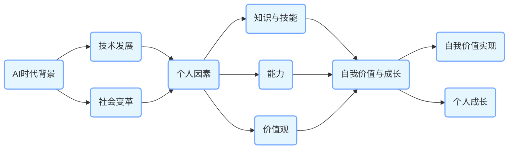

# 如何在AI时代实现自我价值与成长

> 关键词：AI时代、自我价值、个人成长、技能提升、职业发展、创新思维、终身学习

> 摘要：随着AI技术的飞速发展，我们正身处一个前所未有的AI时代。这个时代既带来了巨大的机遇，也带来了诸多挑战。对于个人而言，如何在AI时代实现自我价值与成长是一个至关重要的问题。本文将深入探讨AI时代的特点和影响，分析实现自我价值与成长的核心概念、算法原理、数学模型等，通过项目实战案例详细说明具体方法，介绍实际应用场景和相关工具资源，最后总结未来发展趋势与挑战，为读者在AI时代的自我发展提供全面而深入的指导。

## 1. 背景介绍 
### 1.1 目的和范围
在AI技术日新月异的今天，每个人都不可避免地受到其影响。本文章的目的在于为广大读者提供一套全面、系统的方法和思路，帮助他们在AI时代更好地实现自我价值与成长。范围涵盖了从个人的思维转变、技能提升到职业发展、社会贡献等多个方面，旨在为不同背景、不同阶段的读者提供有价值的参考。

### 1.2 预期读者
本文预期读者包括即将步入职场的学生、正在寻求职业转型的职场人士、希望提升个人竞争力的专业人士，以及对AI时代发展趋势感兴趣，渴望实现自我价值与成长的广大人群。

### 1.3 文档结构概述
本文将首先介绍背景知识，包括目的、预期读者和文档结构等。接着阐述核心概念与联系，帮助读者理解AI时代实现自我价值与成长的基本原理。然后详细讲解核心算法原理和具体操作步骤，通过Python代码示例进行说明。再介绍相关的数学模型和公式，并举例说明。之后通过项目实战案例，展示如何将理论应用于实际。接着介绍实际应用场景，让读者了解在不同领域的具体应用。随后推荐相关的工具和资源，帮助读者进一步学习和实践。最后总结未来发展趋势与挑战，并提供常见问题与解答以及扩展阅读和参考资料。

### 1.4 术语表
#### 1.4.1 核心术语定义
- **AI（Artificial Intelligence）**：即人工智能，是指计算机系统能够执行通常需要人类智能才能完成的任务，如学习、推理、解决问题等。
- **自我价值**：指个人对自己的能力、成就和贡献的认可和评价，是个人在社会和生活中所具有的价值。
- **个人成长**：包括知识、技能、能力、品德等方面的不断提升和发展，是一个持续的过程。

#### 1.4.2 相关概念解释
- **终身学习**：指个体在一生中持续不断地学习新知识、新技能，以适应社会的发展和变化。
- **创新思维**：指以新颖、独特的方式思考问题，提出创造性的解决方案的思维方式。
- **职业转型**：指个人从一个职业领域转换到另一个职业领域的过程。

#### 1.4.3 缩略词列表
- **AI**：Artificial Intelligence（人工智能）

## 2. 核心概念与联系 

### 核心概念原理
在AI时代，实现自我价值与成长需要理解几个关键概念及其相互关系。AI技术的发展改变了社会的生产方式和就业结构，对个人的技能和能力提出了新的要求。自我价值的实现与个人的知识、技能、能力以及对社会的贡献密切相关。个人成长则是一个不断学习、适应和创新的过程。

个人的知识和技能是实现自我价值的基础。在AI时代，不仅需要掌握传统的专业知识，还需要具备与AI相关的技能，如数据分析、机器学习等。能力则包括思维能力、创新能力、沟通能力等，这些能力能够帮助个人更好地应用知识和技能，创造更大的价值。对社会的贡献则是自我价值的外在体现，通过为社会创造价值，个人能够获得社会的认可和尊重。

个人成长是实现自我价值的途径。通过不断学习和实践，个人能够提升自己的知识和技能，培养创新思维和能力，从而更好地适应AI时代的发展变化，实现自我价值的提升。

### 架构的文本示意图
```plaintext
AI时代背景
|
|-- 技术发展（AI技术不断进步）
|-- 社会变革（就业结构变化、生活方式改变）
|
|-- 个人因素
|   |-- 知识与技能（传统知识、AI相关技能）
|   |-- 能力（思维能力、创新能力、沟通能力等）
|   |-- 价值观（对自我价值的认知、社会责任感）
|
|-- 自我价值与成长
|   |-- 自我价值实现（个人成就、社会认可）
|   |-- 个人成长（知识提升、技能进步、能力发展）
```

### Mermaid流程图


## 3. 核心算法原理 & 具体操作步骤 

### 核心算法原理
可以将实现自我价值与成长的过程看作一个优化问题，目标是在AI时代的约束条件下，最大化个人的自我价值。我们可以用以下几个步骤来描述这个算法：

1. **评估现状**：对自己当前的知识、技能、能力和价值观进行全面评估，了解自己的优势和劣势。
2. **设定目标**：根据AI时代的发展趋势和个人的兴趣、特长，设定合理的自我价值与成长目标。
3. **制定计划**：根据目标，制定具体的学习计划、实践计划和职业发展计划。
4. **执行计划**：按照计划进行学习、实践和职业发展，不断提升自己的知识和技能。
5. **反馈调整**：定期对自己的进展进行评估和反馈，根据实际情况调整计划和目标。

### 具体操作步骤及Python代码示例
以下是一个简单的Python代码示例，模拟实现自我价值与成长的过程：

```python
# 定义个人信息类
class Person:
    def __init__(self, knowledge, skills, abilities, values):
        self.knowledge = knowledge
        self.skills = skills
        self.abilities = abilities
        self.values = values

    # 评估现状
    def assess_status(self):
        print(f"当前知识水平: {self.knowledge}")
        print(f"当前技能水平: {self.skills}")
        print(f"当前能力水平: {self.abilities}")
        print(f"当前价值观: {self.values}")

    # 设定目标
    def set_goals(self, knowledge_goal, skills_goal, abilities_goal, values_goal):
        self.knowledge_goal = knowledge_goal
        self.skills_goal = skills_goal
        self.abilities_goal = abilities_goal
        self.values_goal = values_goal
        print(f"设定知识目标: {self.knowledge_goal}")
        print(f"设定技能目标: {self.skills_goal}")
        print(f"设定能力目标: {self.abilities_goal}")
        print(f"设定价值观目标: {self.values_goal}")

    # 制定计划
    def make_plan(self):
        # 简单示例，根据目标制定计划
        knowledge_plan = f"学习 {self.knowledge_goal - self.knowledge} 个新知识"
        skills_plan = f"提升 {self.skills_goal - self.skills} 项技能"
        abilities_plan = f"锻炼 {self.abilities_goal - self.abilities} 种能力"
        values_plan = f"培养符合 {self.values_goal} 的价值观"
        self.plan = {
            "knowledge": knowledge_plan,
            "skills": skills_plan,
            "abilities": abilities_plan,
            "values": values_plan
        }
        print("制定计划:")
        for key, value in self.plan.items():
            print(f"{key}: {value}")

    # 执行计划
    def execute_plan(self):
        print("执行计划...")
        # 模拟执行过程，简单增加相应的值
        self.knowledge += 1
        self.skills += 1
        self.abilities += 1
        self.values = self.values_goal
        print("计划执行完成")

    # 反馈调整
    def feedback_adjust(self):
        if self.knowledge < self.knowledge_goal:
            print("知识水平未达到目标，调整计划，增加学习时间")
        if self.skills < self.skills_goal:
            print("技能水平未达到目标，调整计划，增加实践机会")
        if self.abilities < self.abilities_goal:
            print("能力水平未达到目标，调整计划，参加培训课程")
        if self.values != self.values_goal:
            print("价值观未达到目标，调整计划，参加相关活动")

# 创建一个人的实例
person = Person(knowledge=5, skills=3, abilities=4, values="传统价值观")

# 评估现状
person.assess_status()

# 设定目标
person.set_goals(knowledge_goal=8, skills_goal=6, abilities_goal=7, values_goal="创新价值观")

# 制定计划
person.make_plan()

# 执行计划
person.execute_plan()

# 反馈调整
person.feedback_adjust()
```

在这个代码示例中，我们定义了一个`Person`类，包含个人的知识、技能、能力和价值观等属性。通过`assess_status`方法评估现状，`set_goals`方法设定目标，`make_plan`方法制定计划，`execute_plan`方法执行计划，`feedback_adjust`方法进行反馈调整。

## 4. 数学模型和公式 & 详细讲解 & 举例说明 

### 数学模型
我们可以用一个简单的数学模型来描述个人的自我价值与成长。设个人的自我价值 $V$ 是由知识 $K$、技能 $S$、能力 $A$ 和价值观 $V_{v}$ 等因素决定的函数，即：

$$V = f(K, S, A, V_{v})$$

其中，$f$ 是一个复杂的函数，不同的人可能有不同的函数形式。一般来说，$V$ 与 $K$、$S$、$A$ 呈正相关关系，即知识、技能和能力的提升会增加个人的自我价值。价值观 $V_{v}$ 则会影响个人对自我价值的认知和实现方式。

### 详细讲解
知识 $K$ 可以用个人所掌握的知识领域的数量、深度和广度来衡量。例如，一个人掌握了数学、物理、计算机等多个领域的知识，并且在每个领域都有一定的深度，那么他的知识水平就相对较高。

技能 $S$ 可以用个人所具备的技能种类和熟练程度来衡量。例如，一个人具备编程、数据分析、项目管理等多种技能，并且在每种技能上都有较高的熟练程度，那么他的技能水平就相对较高。

能力 $A$ 包括思维能力、创新能力、沟通能力等多个方面。这些能力可以通过各种测试和实践来评估。例如，一个人的思维能力强，能够快速地分析和解决问题；创新能力强，能够提出新颖、独特的解决方案；沟通能力强，能够有效地与他人交流和合作，那么他的能力水平就相对较高。

价值观 $V_{v}$ 是个人对事物的看法和评价标准。不同的价值观会影响个人的行为和决策，从而影响个人的自我价值实现。例如，一个具有社会责任感的人，可能会更注重为社会做出贡献，从而通过自己的工作和行为来实现更大的自我价值。

### 举例说明
假设一个人的自我价值函数为：

$$V = 0.3K + 0.4S + 0.2A + 0.1V_{v}$$

其中，$K$、$S$、$A$ 的取值范围为 $0 - 10$，$V_{v}$ 的取值范围为 $0 - 10$，分别表示知识、技能、能力和价值观的水平。

现在有两个人，甲的知识水平 $K_{甲} = 6$，技能水平 $S_{甲} = 7$，能力水平 $A_{甲} = 5$，价值观水平 $V_{v甲} = 8$；乙的知识水平 $K_{乙} = 7$，技能水平 $S_{乙} = 6$，能力水平 $A_{乙} = 6$，价值观水平 $V_{v乙} = 7$。

我们可以计算出甲和乙的自我价值：

甲的自我价值：

$$V_{甲} = 0.3\times6 + 0.4\times7 + 0.2\times5 + 0.1\times8$$
$$= 1.8 + 2.8 + 1 + 0.8$$
$$= 6.4$$

乙的自我价值：

$$V_{乙} = 0.3\times7 + 0.4\times6 + 0.2\times6 + 0.1\times7$$
$$= 2.1 + 2.4 + 1.2 + 0.7$$
$$= 6.4$$

从这个例子可以看出，虽然甲和乙在知识、技能、能力和价值观方面的具体表现不同，但他们的自我价值是相同的。这说明自我价值的实现是一个综合的过程，不同的因素可以相互补充和影响。

## 5. 项目实战：代码实际案例和详细解释说明 

### 5.1  开发环境搭建
在进行项目实战之前，需要搭建相应的开发环境。以下是一些基本的步骤：

1. **安装Python**：Python是一种广泛使用的编程语言，适合用于数据处理、机器学习等任务。可以从Python官方网站（https://www.python.org/downloads/）下载并安装适合自己操作系统的Python版本。
2. **安装开发工具**：推荐使用PyCharm或Jupyter Notebook作为开发工具。PyCharm是一个功能强大的Python集成开发环境，提供了代码编辑、调试、版本控制等功能；Jupyter Notebook则是一个交互式的开发环境，适合用于数据探索和分析。
3. **安装必要的库**：根据项目的需求，安装相应的Python库，如`numpy`、`pandas`、`scikit-learn`等。可以使用`pip`命令来安装这些库，例如：

```bash
pip install numpy pandas scikit-learn
```

### 5.2  源代码详细实现和代码解读
以下是一个简单的项目实战案例，通过数据分析和机器学习算法来预测个人的职业发展潜力，从而帮助个人实现自我价值与成长。

```python
import numpy as np
import pandas as pd
from sklearn.model_selection import train_test_split
from sklearn.linear_model import LinearRegression
from sklearn.metrics import mean_squared_error

# 生成模拟数据
np.random.seed(42)
n_samples = 1000
# 知识水平
knowledge = np.random.randint(1, 10, n_samples)
# 技能水平
skills = np.random.randint(1, 10, n_samples)
# 能力水平
abilities = np.random.randint(1, 10, n_samples)
# 职业发展潜力（目标变量）
career_potential = 0.3 * knowledge + 0.4 * skills + 0.2 * abilities + np.random.normal(0, 1, n_samples)

# 创建DataFrame
data = pd.DataFrame({
    'knowledge': knowledge,
    'skills': skills,
    'abilities': abilities,
    'career_potential': career_potential
})

# 划分特征和目标变量
X = data[['knowledge', 'skills', 'abilities']]
y = data['career_potential']

# 划分训练集和测试集
X_train, X_test, y_train, y_test = train_test_split(X, y, test_size=0.2, random_state=42)

# 创建线性回归模型
model = LinearRegression()

# 训练模型
model.fit(X_train, y_train)

# 预测
y_pred = model.predict(X_test)

# 评估模型
mse = mean_squared_error(y_test, y_pred)
print(f"均方误差: {mse}")

# 输出模型系数
print(f"知识系数: {model.coef_[0]}")
print(f"技能系数: {model.coef_[1]}")
print(f"能力系数: {model.coef_[2]}")
```

### 代码解读与分析
1. **数据生成**：使用`numpy`库生成模拟数据，包括知识水平、技能水平、能力水平和职业发展潜力。职业发展潜力是根据知识、技能和能力的加权和加上随机噪声生成的。
2. **数据处理**：使用`pandas`库将数据存储在`DataFrame`中，并划分特征和目标变量。
3. **数据划分**：使用`sklearn`库的`train_test_split`函数将数据划分为训练集和测试集，比例为8:2。
4. **模型训练**：创建线性回归模型，并使用训练集数据进行训练。
5. **模型预测**：使用训练好的模型对测试集数据进行预测。
6. **模型评估**：使用均方误差（MSE）来评估模型的性能。
7. **输出模型系数**：输出模型的系数，即知识、技能和能力对职业发展潜力的影响程度。

通过这个项目实战案例，我们可以了解个人的知识、技能和能力对职业发展潜力的影响，从而有针对性地提升自己的相关能力，实现自我价值与成长。

## 6. 实际应用场景 
### 教育领域
在教育领域，AI技术可以为学生提供个性化的学习方案。通过分析学生的学习数据，如学习进度、知识掌握情况、学习习惯等，AI系统可以为学生推荐适合他们的学习内容和学习方法，帮助学生提高学习效率和成绩。学生可以根据AI系统的建议，有针对性地提升自己的知识和技能，实现自我价值的提升。

例如，一些在线教育平台利用AI技术实现了智能辅导功能。学生在学习过程中遇到问题时，AI系统可以自动为学生提供解答和指导，帮助学生更好地理解和掌握知识。同时，AI系统还可以根据学生的学习情况，为学生推荐相关的学习资源和练习题目，帮助学生巩固所学知识。

### 职业发展领域
在职业发展领域，AI技术可以帮助个人进行职业规划和职业转型。通过分析个人的技能、能力、兴趣和职业市场需求，AI系统可以为个人提供职业发展建议和职业转型方案。个人可以根据AI系统的建议，选择适合自己的职业方向，并通过学习和实践不断提升自己的相关能力，实现职业发展和自我价值的提升。

例如，一些职业咨询平台利用AI技术为求职者提供职业匹配和职业发展建议。求职者可以在平台上输入自己的个人信息和职业目标，AI系统可以根据这些信息为求职者推荐适合他们的职业岗位和职业发展路径。同时，AI系统还可以为求职者提供相关的培训课程和学习资源，帮助求职者提升自己的职业技能。

### 创新领域
在创新领域，AI技术可以为创新者提供灵感和支持。通过分析大量的创新案例和数据，AI系统可以帮助创新者发现创新机会和趋势，提供创新思路和方法。创新者可以利用AI技术，结合自己的知识和技能，开展创新活动，实现自我价值的创新和提升。

例如，一些创新平台利用AI技术实现了创新项目的智能推荐和评估功能。创新者可以在平台上提交自己的创新项目，AI系统可以根据项目的内容和目标，为创新者推荐相关的创新资源和合作伙伴。同时，AI系统还可以对创新项目进行评估和预测，帮助创新者优化项目方案，提高创新成功率。

## 7. 工具和资源推荐
### 7.1 学习资源推荐
#### 7.1.1 书籍推荐
- 《人工智能：一种现代的方法》：这是一本经典的人工智能教材，全面介绍了人工智能的基本概念、算法和应用。
- 《Python机器学习》：详细介绍了使用Python进行机器学习的方法和技术，适合初学者和有一定基础的读者。
- 《创新者的窘境》：探讨了创新的本质和规律，对于培养创新思维和能力有很大的帮助。

#### 7.1.2 在线课程
- Coursera：提供了众多关于人工智能、机器学习、数据分析等方面的在线课程，由全球知名大学和机构的教授授课。
- edX：同样提供了丰富的在线课程，涵盖了计算机科学、工程技术、商业管理等多个领域。
- 中国大学MOOC：国内知名的在线课程平台，提供了大量优质的大学课程，包括人工智能、计算机科学等相关课程。

#### 7.1.3 技术博客和网站
- Medium：一个汇集了众多技术专家和爱好者的博客平台，有很多关于人工智能、机器学习等方面的优秀文章。
- Towards Data Science：专注于数据科学和机器学习领域的技术博客，提供了很多实用的教程和案例。
- 开源中国：国内知名的开源技术社区，提供了大量关于人工智能、开源项目等方面的资讯和技术文章。

### 7.2 开发工具框架推荐
#### 7.2.1 IDE和编辑器
- PyCharm：功能强大的Python集成开发环境，提供了代码编辑、调试、版本控制等丰富的功能。
- Jupyter Notebook：交互式的开发环境，适合用于数据探索、分析和可视化。
- Visual Studio Code：轻量级的代码编辑器，支持多种编程语言，有丰富的插件和扩展。

#### 7.2.2 调试和性能分析工具
- PDB：Python自带的调试工具，用于调试Python代码。
- cProfile：Python的性能分析工具，用于分析代码的性能瓶颈。
- TensorBoard：用于可视化深度学习模型的训练过程和结果，帮助开发者更好地理解和优化模型。

#### 7.2.3 相关框架和库
- TensorFlow：开源的机器学习框架，广泛应用于深度学习领域。
- PyTorch：另一个流行的深度学习框架，具有动态计算图等优点。
- Scikit-learn：用于机器学习的Python库，提供了丰富的机器学习算法和工具。

### 7.3 相关论文著作推荐
#### 7.3.1 经典论文
- "A Logical Calculus of the Ideas Immanent in Nervous Activity"：由Warren McCulloch和Walter Pitts于1943年发表，提出了神经元的数学模型，是人工智能领域的经典论文之一。
- "Learning Representations by Back-propagating Errors"：由David Rumelhart、Geoffrey Hinton和Ronald Williams于1986年发表，介绍了反向传播算法，对神经网络的发展起到了重要的推动作用。

#### 7.3.2 最新研究成果
- 关注顶级学术会议和期刊，如NeurIPS（神经信息处理系统大会）、ICML（国际机器学习会议）、Journal of Artificial Intelligence Research等，了解人工智能领域的最新研究成果。

#### 7.3.3 应用案例分析
- 一些知名企业和研究机构会发布人工智能的应用案例分析，如谷歌、微软、IBM等公司的官方博客和研究报告，通过学习这些案例可以了解人工智能在实际应用中的方法和经验。

## 8. 总结：未来发展趋势与挑战
### 未来发展趋势
- **AI与各领域深度融合**：未来，AI技术将与教育、医疗、交通、金融等各个领域深度融合，创造出更多的应用场景和商业机会。例如，在医疗领域，AI可以辅助医生进行疾病诊断和治疗方案推荐；在交通领域，AI可以实现自动驾驶和智能交通管理。
- **个性化和定制化服务**：随着AI技术的发展，个人将能够获得更加个性化和定制化的服务。例如，在教育领域，学生可以根据自己的学习情况和兴趣爱好获得个性化的学习方案；在消费领域，消费者可以根据自己的需求和偏好获得定制化的产品和服务。
- **跨学科合作**：AI技术的发展需要跨学科的知识和技能，未来将出现更多的跨学科合作项目和研究成果。例如，人工智能与生物学、物理学、数学等学科的交叉融合，将推动新的科学发现和技术创新。

### 挑战
- **技术伦理和法律问题**：AI技术的发展带来了一系列的伦理和法律问题，如隐私保护、算法偏见、责任认定等。如何制定合理的伦理和法律规范，保障AI技术的健康发展，是一个亟待解决的问题。
- **就业结构调整**：AI技术的发展将导致就业结构的调整，一些传统的工作岗位可能会被自动化和智能化的系统所取代。如何帮助人们适应就业结构的变化，实现职业转型和再就业，是一个重要的挑战。
- **数据安全和隐私问题**：AI技术的发展离不开大量的数据支持，数据的安全和隐私问题日益突出。如何保障数据的安全和隐私，防止数据泄露和滥用，是一个关键的问题。

## 9. 附录：常见问题与解答
### 问题1：在AI时代，哪些技能是最重要的？
答：在AI时代，以下技能是比较重要的：
- **数据分析和处理技能**：能够收集、整理、分析和解释数据，从数据中提取有价值的信息。
- **编程技能**：掌握至少一种编程语言，如Python、Java等，能够进行软件开发和算法实现。
- **机器学习和人工智能技能**：了解机器学习和人工智能的基本概念、算法和应用，能够使用相关的工具和框架进行模型开发和训练。
- **创新思维和能力**：能够提出新颖、独特的想法和解决方案，具备创新意识和创新能力。
- **沟通和协作能力**：能够与不同背景的人进行有效的沟通和协作，共同完成项目和任务。

### 问题2：如何在AI时代保持竞争力？
答：要在AI时代保持竞争力，可以从以下几个方面入手：
- **持续学习**：不断学习新的知识和技能，跟上技术发展的步伐。
- **培养创新思维**：勇于尝试新的方法和思路，不断创新和改进。
- **积累实践经验**：通过实际项目和实践活动，提高自己的解决问题的能力。
- **建立人际关系网络**：与同行、专家和其他领域的人士建立良好的人际关系，获取更多的信息和资源。
- **关注行业动态**：及时了解行业的发展趋势和最新技术，调整自己的发展方向和策略。

### 问题3：AI技术会导致大量失业吗？
答：AI技术的发展确实会对就业结构产生影响，但不一定会导致大量失业。虽然一些传统的工作岗位可能会被自动化和智能化的系统所取代，但同时也会创造出一些新的工作岗位，如AI技术研发、数据分析、人工智能伦理和法律等方面的岗位。此外，AI技术还可以提高生产效率和质量，促进经济的发展，从而创造更多的就业机会。因此，人们需要不断学习和提升自己的技能，适应就业结构的变化，实现职业转型和再就业。

## 10. 扩展阅读 & 参考资料
### 扩展阅读
- 《奇点临近》：探讨了人工智能和技术发展的未来趋势，提出了奇点的概念。
- 《人类简史：从动物到上帝》：从人类的历史发展角度，探讨了人类与技术的关系。
- 《未来简史：从智人到神人》：进一步探讨了未来人类的发展方向和可能面临的挑战。

### 参考资料
- 相关学术论文和研究报告
- 行业资讯和新闻报道
- 技术书籍和教材
- 在线课程和教学视频