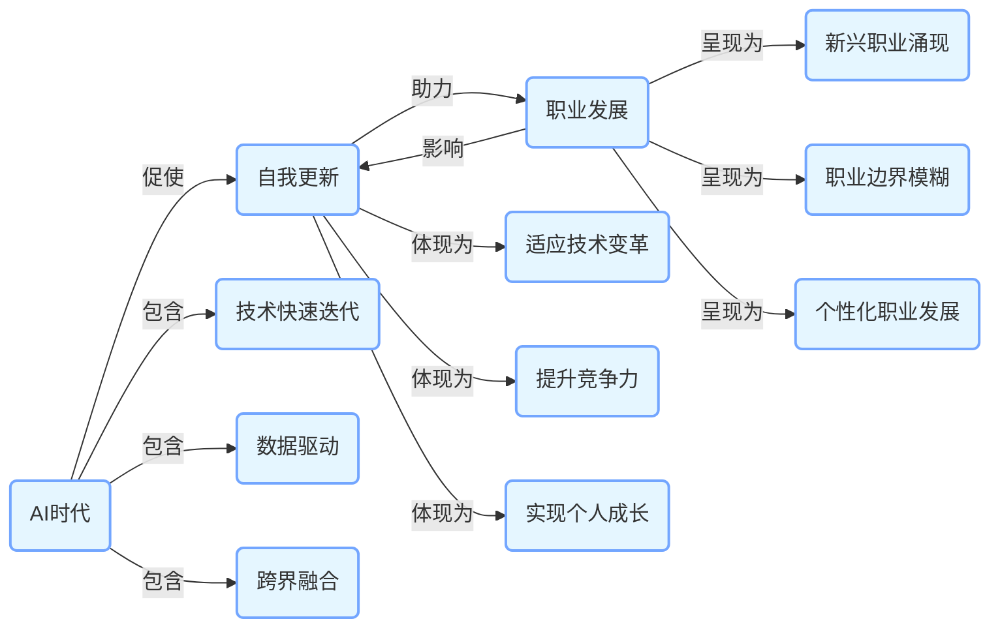

# 如何在AI时代实现自我更新与职业发展

> 关键词：AI时代、自我更新、职业发展、技能提升、适应变革

> 摘要：随着人工智能（AI）技术的飞速发展，我们正身处一个前所未有的变革时代。AI不仅改变了我们的生活方式，也对职场和个人的职业发展产生了深远的影响。本文旨在探讨在AI时代，个人如何实现自我更新与职业发展，通过对背景的介绍、核心概念的解析、相关算法原理的阐述、数学模型的分析、项目实战案例的展示、实际应用场景的探讨、工具和资源的推荐等方面进行详细论述，帮助读者清晰地认识到在AI时代所面临的机遇和挑战，以及掌握实现自我更新和职业发展的有效方法和策略。

## 1. 背景介绍 
### 1.1 目的和范围
本文章的目的在于为身处AI时代的个人提供全面且实用的指导，帮助他们更好地实现自我更新与职业发展。范围涵盖了AI时代对职业的影响、个人应具备的关键技能、实现自我更新的方法、职业发展的策略以及相关的工具和资源等多个方面。通过深入的分析和探讨，为读者构建一个系统的知识体系，使他们能够在AI时代的浪潮中找准方向，不断提升自己，实现职业目标。

### 1.2 预期读者
本文预期读者包括正在职场中寻求发展的各类从业人员，无论是初入职场的新人，还是有一定工作经验的资深人士；也包括即将进入职场的高校学生和职业院校学生，帮助他们提前做好应对AI时代的准备；同时，对于关注个人成长和职业发展的普通读者，也具有一定的参考价值。

### 1.3 文档结构概述
本文首先介绍背景信息，包括目的、预期读者和文档结构概述等内容。接着阐述核心概念与联系，帮助读者理解AI时代、自我更新和职业发展等关键概念及其相互关系。然后详细讲解核心算法原理和具体操作步骤，通过Python代码进行示例。再介绍相关的数学模型和公式，并结合实例进行说明。之后通过项目实战，展示代码实际案例并进行详细解释。随后探讨实际应用场景，让读者了解在不同领域如何实现自我更新与职业发展。接着推荐相关的工具和资源，为读者提供学习和实践的途径。最后进行总结，展望未来发展趋势与挑战，并提供常见问题与解答以及扩展阅读和参考资料。

### 1.4 术语表
#### 1.4.1 核心术语定义
- **AI时代**：指以人工智能技术为核心驱动力，广泛应用于各个领域，对社会、经济、文化等产生深远影响的时代。
- **自我更新**：个人为了适应不断变化的环境和需求，主动地对自身的知识、技能、思维方式等进行更新和提升的过程。
- **职业发展**：个人在职业生涯中，通过不断学习、实践和积累，实现职位晋升、技能提升、收入增加等目标的过程。

#### 1.4.2 相关概念解释
- **技能迁移**：将在一个领域或工作中所学到的技能应用到另一个领域或工作中的能力。例如，在传统媒体行业中掌握的写作和沟通技能，可以迁移到互联网营销领域。
- **终身学习**：指一个人在一生中持续不断地学习新知识、新技能的理念和行为。在AI时代，由于技术更新换代迅速，终身学习显得尤为重要。

#### 1.4.3 缩略词列表
- **AI**：Artificial Intelligence，人工智能
- **ML**：Machine Learning，机器学习
- **DL**：Deep Learning，深度学习

## 2. 核心概念与联系 
### 2.1 AI时代的特征
AI时代具有以下几个显著特征：
- **技术快速迭代**：人工智能技术发展日新月异，新的算法、模型和应用不断涌现。例如，从早期的简单机器学习算法到现在的深度学习模型，性能和效率都有了巨大的提升。
- **数据驱动**：数据成为AI时代的核心资产，大量的数据为AI算法的训练和优化提供了基础。例如，电商平台通过分析用户的购物数据，为用户提供个性化的推荐服务。
- **跨界融合**：AI技术与各个行业深度融合，打破了传统行业的界限。例如，医疗行业与AI的结合，实现了疾病的早期诊断和精准治疗。

### 2.2 自我更新的重要性
在AI时代，自我更新对于个人的职业发展至关重要。具体体现在以下几个方面：
- **适应技术变革**：随着AI技术的不断发展，许多传统的工作岗位可能会被自动化和智能化所取代。个人只有不断更新自己的知识和技能，才能适应这种技术变革，避免被淘汰。
- **提升竞争力**：在激烈的职场竞争中，具备自我更新能力的人能够更快地掌握新的知识和技能，从而在求职和晋升中占据优势。
- **实现个人成长**：自我更新不仅可以提升个人的职业能力，还可以促进个人的全面成长，培养创新思维和解决问题的能力。

### 2.3 职业发展的趋势
AI时代的职业发展呈现出以下几个趋势：
- **新兴职业涌现**：随着AI技术的发展，出现了许多新兴的职业，如AI工程师、数据分析师、机器学习专家等。这些职业对个人的技能和知识要求较高，具有广阔的发展前景。
- **职业边界模糊**：由于AI技术的跨界融合，许多职业的边界变得越来越模糊。例如，设计师需要具备一定的编程技能，营销人员需要了解数据分析知识。
- **个性化职业发展**：每个人的兴趣、能力和职业目标都不同，在AI时代，个人可以根据自己的特点和需求，制定个性化的职业发展路径。

### 2.4 核心概念的联系
AI时代的发展促使个人必须进行自我更新，以适应技术变革和职业发展的需求。而自我更新的过程又有助于个人实现职业发展，提升在职场中的竞争力。同时，职业发展的趋势也会反过来影响个人的自我更新方向和重点。例如，新兴职业的涌现要求个人不断学习新的知识和技能，而职业边界的模糊则需要个人具备跨领域的能力。

### 2.5 核心概念原理和架构的文本示意图
```plaintext
AI时代
|
|-- 技术快速迭代
|-- 数据驱动
|-- 跨界融合
|
|-- 促使
|
自我更新
|
|-- 适应技术变革
|-- 提升竞争力
|-- 实现个人成长
|
|-- 助力
|
职业发展
|
|-- 新兴职业涌现
|-- 职业边界模糊
|-- 个性化职业发展
```

### 2.6 Mermaid流程图


## 3. 核心算法原理 & 具体操作步骤 
### 3.1 技能评估算法原理
在实现自我更新与职业发展的过程中，首先需要对自己的技能进行评估。我们可以使用简单的加权评分算法来评估个人的技能水平。

#### 3.1.1 算法原理
假设我们有 $n$ 项技能，每项技能有一个权重 $w_i$ 和一个评分 $s_i$，其中 $i = 1,2,\cdots,n$。技能的总得分 $S$ 可以通过以下公式计算：

$$S = \sum_{i = 1}^{n} w_i s_i$$

#### 3.1.2 Python源代码实现
```python
# 技能列表
skills = ["编程", "数据分析", "沟通能力", "团队协作"]
# 权重列表
weights = [0.3, 0.25, 0.2, 0.25]
# 评分列表
scores = [8, 7, 6, 7]

# 计算总得分
total_score = 0
for i in range(len(skills)):
    total_score += weights[i] * scores[i]

print(f"技能总得分: {total_score}")
```

### 3.2 职业规划算法原理
在进行职业规划时，我们可以使用决策树算法来选择合适的职业方向。决策树是一种基于树结构进行决策的算法，每个内部节点是一个属性上的测试，每个分支是一个测试输出，每个叶节点是一个类别或值。

#### 3.2.1 算法原理
决策树的构建过程主要包括以下几个步骤：
1. **特征选择**：选择最能区分不同类别的特征作为决策树的节点。
2. **决策树生成**：根据特征选择的结果，递归地构建决策树。
3. **决策树剪枝**：为了防止过拟合，对决策树进行剪枝操作。

#### 3.2.2 Python源代码实现
```python
from sklearn.datasets import load_iris
from sklearn.model_selection import train_test_split
from sklearn.tree import DecisionTreeClassifier
from sklearn.metrics import accuracy_score

# 加载数据集
iris = load_iris()
X = iris.data
y = iris.target

# 划分训练集和测试集
X_train, X_test, y_train, y_test = train_test_split(X, y, test_size=0.3, random_state=42)

# 创建决策树分类器
clf = DecisionTreeClassifier()

# 训练模型
clf.fit(X_train, y_train)

# 预测
y_pred = clf.predict(X_test)

# 计算准确率
accuracy = accuracy_score(y_test, y_pred)
print(f"决策树模型准确率: {accuracy}")
```

### 3.3 具体操作步骤
#### 3.3.1 技能评估操作步骤
1. **确定技能列表**：根据自己的职业目标和所在行业，确定需要评估的技能列表。
2. **确定权重**：根据各项技能在职业发展中的重要程度，确定每个技能的权重。
3. **进行评分**：对自己在每项技能上的水平进行评分，评分范围可以根据实际情况确定。
4. **计算总得分**：使用上述的加权评分算法计算技能的总得分。

#### 3.3.2 职业规划操作步骤
1. **收集数据**：收集与职业选择相关的数据，如个人的技能、兴趣、学历等。
2. **数据预处理**：对收集到的数据进行清洗、转换等预处理操作。
3. **构建决策树模型**：使用决策树算法构建职业规划模型。
4. **模型评估**：使用测试数据对模型进行评估，调整模型参数，提高模型的准确率。
5. **进行职业规划**：根据模型的预测结果，选择合适的职业方向。

## 4. 数学模型和公式 & 详细讲解 & 举例说明 
### 4.1 技能评估的数学模型和公式
#### 4.1.1 公式
如前面所述，技能评估的总得分 $S$ 可以通过以下公式计算：

$$S = \sum_{i = 1}^{n} w_i s_i$$

其中，$n$ 是技能的数量，$w_i$ 是第 $i$ 项技能的权重，$s_i$ 是第 $i$ 项技能的评分。

#### 4.1.2 详细讲解
权重 $w_i$ 表示每项技能在整体技能体系中的重要程度，其取值范围通常在 $[0, 1]$ 之间，且 $\sum_{i = 1}^{n} w_i = 1$。评分 $s_i$ 表示个人在第 $i$ 项技能上的水平，其取值范围可以根据实际情况确定，例如 $[0, 10]$。

#### 4.1.3 举例说明
假设我们有三项技能：编程、数据分析和沟通能力，权重分别为 $0.4$、$0.3$ 和 $0.3$，评分分别为 $7$、$6$ 和 $8$。则技能的总得分 $S$ 为：

$$S = 0.4\times7 + 0.3\times6 + 0.3\times8 = 2.8 + 1.8 + 2.4 = 7$$

### 4.2 决策树的数学模型和公式
#### 4.2.1 信息熵公式
信息熵是衡量数据不确定性的指标，其计算公式为：

$$H(X) = -\sum_{i = 1}^{n} p(x_i) \log_2 p(x_i)$$

其中，$X$ 是一个随机变量，$p(x_i)$ 是 $X$ 取值为 $x_i$ 的概率。

#### 4.2.2 信息增益公式
信息增益是指在使用某个特征进行划分后，数据的不确定性减少的程度，其计算公式为：

$$IG(D, A) = H(D) - \sum_{v \in Values(A)} \frac{|D_v|}{|D|} H(D_v)$$

其中，$D$ 是数据集，$A$ 是特征，$Values(A)$ 是特征 $A$ 的所有取值，$D_v$ 是特征 $A$ 取值为 $v$ 时的子集，$|D|$ 和 $|D_v|$ 分别表示数据集 $D$ 和子集 $D_v$ 的样本数量。

#### 4.2.3 详细讲解
信息熵 $H(X)$ 越大，说明数据的不确定性越大；信息增益 $IG(D, A)$ 越大，说明使用特征 $A$ 进行划分后，数据的不确定性减少得越多，该特征越适合作为决策树的节点。

#### 4.2.4 举例说明
假设我们有一个数据集 $D$，包含 $10$ 个样本，其中正类样本有 $6$ 个，负类样本有 $4$ 个。则数据集 $D$ 的信息熵为：

$$H(D) = -\frac{6}{10} \log_2 \frac{6}{10} - \frac{4}{10} \log_2 \frac{4}{10} \approx 0.971$$

假设我们有一个特征 $A$，其取值有两个：$v_1$ 和 $v_2$。特征 $A$ 取值为 $v_1$ 时的子集 $D_1$ 包含 $4$ 个样本，其中正类样本有 $3$ 个，负类样本有 $1$ 个；特征 $A$ 取值为 $v_2$ 时的子集 $D_2$ 包含 $6$ 个样本，其中正类样本有 $3$ 个，负类样本有 $3$ 个。则子集 $D_1$ 和 $D_2$ 的信息熵分别为：

$$H(D_1) = -\frac{3}{4} \log_2 \frac{3}{4} - \frac{1}{4} \log_2 \frac{1}{4} \approx 0.811$$

$$H(D_2) = -\frac{3}{6} \log_2 \frac{3}{6} - \frac{3}{6} \log_2 \frac{3}{6} = 1$$

使用特征 $A$ 进行划分后的信息增益为：

$$IG(D, A) = H(D) - \frac{4}{10} H(D_1) - \frac{6}{10} H(D_2) \approx 0.971 - \frac{4}{10} \times 0.811 - \frac{6}{10} \times 1 \approx 0.146$$

## 5. 项目实战：代码实际案例和详细解释说明 
### 5.1  开发环境搭建
#### 5.1.1 安装Python
首先，我们需要安装Python开发环境。可以从Python官方网站（https://www.python.org/downloads/） 下载适合自己操作系统的Python安装包，并按照安装向导进行安装。

#### 5.1.2 安装必要的库
在本项目中，我们需要使用一些Python库，如 `numpy`、`pandas`、`scikit-learn` 等。可以使用以下命令进行安装：

```bash
pip install numpy pandas scikit-learn
```

### 5.2  源代码详细实现和代码解读
#### 5.2.1 技能评估代码实现
```python
# 技能列表
skills = ["编程", "数据分析", "沟通能力", "团队协作"]
# 权重列表
weights = [0.3, 0.25, 0.2, 0.25]
# 评分列表
scores = [8, 7, 6, 7]

# 计算总得分
total_score = 0
for i in range(len(skills)):
    total_score += weights[i] * scores[i]

print(f"技能总得分: {total_score}")
```

#### 5.2.2 代码解读
- **技能列表**：`skills` 列表存储了需要评估的技能名称。
- **权重列表**：`weights` 列表存储了每项技能的权重，权重之和为 $1$。
- **评分列表**：`scores` 列表存储了个人在每项技能上的评分。
- **计算总得分**：使用 `for` 循环遍历技能列表，将每项技能的权重乘以评分，并累加到 `total_score` 中。
- **输出结果**：使用 `print` 函数输出技能的总得分。

#### 5.2.3 职业规划代码实现
```python
from sklearn.datasets import load_iris
from sklearn.model_selection import train_test_split
from sklearn.tree import DecisionTreeClassifier
from sklearn.metrics import accuracy_score

# 加载数据集
iris = load_iris()
X = iris.data
y = iris.target

# 划分训练集和测试集
X_train, X_test, y_train, y_test = train_test_split(X, y, test_size=0.3, random_state=42)

# 创建决策树分类器
clf = DecisionTreeClassifier()

# 训练模型
clf.fit(X_train, y_train)

# 预测
y_pred = clf.predict(X_test)

# 计算准确率
accuracy = accuracy_score(y_test, y_pred)
print(f"决策树模型准确率: {accuracy}")
```

#### 5.2.4 代码解读
- **导入必要的库**：使用 `from ... import ...` 语句导入所需的库，如 `load_iris` 用于加载鸢尾花数据集，`train_test_split` 用于划分训练集和测试集，`DecisionTreeClassifier` 用于创建决策树分类器，`accuracy_score` 用于计算模型的准确率。
- **加载数据集**：使用 `load_iris()` 函数加载鸢尾花数据集，将特征数据存储在 `X` 中，将标签数据存储在 `y` 中。
- **划分训练集和测试集**：使用 `train_test_split` 函数将数据集划分为训练集和测试集，测试集占比为 $30\%$。
- **创建决策树分类器**：使用 `DecisionTreeClassifier()` 函数创建决策树分类器。
- **训练模型**：使用 `fit` 方法对模型进行训练，传入训练集的特征数据和标签数据。
- **预测**：使用 `predict` 方法对测试集的特征数据进行预测，得到预测结果 `y_pred`。
- **计算准确率**：使用 `accuracy_score` 函数计算模型的准确率，传入测试集的真实标签数据和预测结果。
- **输出结果**：使用 `print` 函数输出决策树模型的准确率。

### 5.3  代码解读与分析
#### 5.3.1 技能评估代码分析
- **优点**：代码简单易懂，实现了基本的技能评估功能。通过加权评分的方式，可以综合考虑各项技能的重要程度。
- **缺点**：权重和评分的确定具有一定的主观性，可能会影响评估结果的准确性。而且代码的扩展性较差，如果需要增加或删除技能，需要手动修改代码。

#### 5.3.2 职业规划代码分析
- **优点**：使用了成熟的机器学习算法，能够根据数据进行分类和预测。通过划分训练集和测试集，可以评估模型的性能。
- **缺点**：决策树模型容易过拟合，需要进行剪枝操作。而且代码中使用的是鸢尾花数据集，与实际的职业规划场景可能存在差异，需要进行数据的收集和预处理。

## 6. 实际应用场景 
### 6.1 传统行业从业者
对于传统行业的从业者来说，AI时代带来了新的机遇和挑战。例如，制造业工人可以学习AI相关的知识和技能，如机器人编程、自动化控制等，实现从传统工人向智能制造工程师的转型。金融行业的从业者可以学习数据分析和机器学习算法，为客户提供更精准的投资建议。

### 6.2 新兴行业从业者
新兴行业的从业者需要不断更新自己的知识和技能，以适应技术的快速发展。例如，AI工程师需要关注最新的研究成果和技术趋势，学习新的算法和模型，提高自己的研发能力。数据分析师需要掌握更多的数据处理和挖掘技术，为企业提供更有价值的数据分析报告。

### 6.3 高校学生和职业院校学生
对于高校学生和职业院校学生来说，在AI时代需要提前做好职业规划，学习相关的知识和技能。高校学生可以选择与AI相关的专业，如计算机科学与技术、数据科学与大数据技术等，并参加相关的实践项目和竞赛，提高自己的实践能力。职业院校学生可以选择与AI应用相关的专业，如人工智能技术应用、智能机器人技术等，为将来进入职场做好准备。

### 6.4 自由职业者
自由职业者在AI时代也可以利用AI技术提升自己的竞争力。例如，自由设计师可以使用AI设计工具，提高设计效率和质量。自由撰稿人可以使用AI写作助手，获取灵感和素材，提高写作效率。

## 7. 工具和资源推荐
### 7.1 学习资源推荐
#### 7.1.1 书籍推荐
- 《人工智能：一种现代的方法》：这本书是人工智能领域的经典教材，全面介绍了人工智能的基本概念、算法和应用。
- 《Python机器学习》：本书详细介绍了使用Python进行机器学习的方法和技巧，适合初学者学习。
- 《深度学习》：由深度学习领域的三位顶尖专家撰写，系统地介绍了深度学习的理论和实践。

#### 7.1.2 在线课程
- Coursera：提供了丰富的人工智能和机器学习课程，由世界知名大学和机构的教授授课。
- edX：同样提供了大量的优质在线课程，涵盖了人工智能的各个方面。
- 中国大学MOOC：国内的在线课程平台，有许多高校提供的人工智能相关课程。

#### 7.1.3 技术博客和网站
- Medium：有许多人工智能领域的专家和爱好者分享自己的经验和见解。
- Towards Data Science：专注于数据科学和机器学习领域，提供了大量的技术文章和案例分析。
- 机器之心：国内的人工智能媒体平台，及时报道人工智能领域的最新动态和技术进展。

### 7.2 开发工具框架推荐
#### 7.2.1 IDE和编辑器
- PyCharm：一款专业的Python集成开发环境，具有强大的代码编辑、调试和项目管理功能。
- Jupyter Notebook：交互式的开发环境，适合进行数据分析和机器学习实验。
- Visual Studio Code：轻量级的代码编辑器，支持多种编程语言和插件扩展。

#### 7.2.2 调试和性能分析工具
- PDB：Python自带的调试工具，可以帮助开发者定位和解决代码中的问题。
- cProfile：Python的性能分析工具，可以分析代码的运行时间和资源消耗情况。
- TensorBoard：TensorFlow的可视化工具，可以帮助开发者监控和分析模型的训练过程。

#### 7.2.3 相关框架和库
- TensorFlow：Google开发的开源机器学习框架，广泛应用于深度学习领域。
- PyTorch：Facebook开发的深度学习框架，具有动态计算图的特点，易于使用和调试。
- Scikit-learn：Python的机器学习库，提供了丰富的机器学习算法和工具。

### 7.3 相关论文著作推荐
#### 7.3.1 经典论文
- 《A Logical Calculus of the Ideas Immanent in Nervous Activity》：这篇论文是神经网络领域的经典之作，提出了神经元模型。
- 《Gradient-based learning applied to document recognition》：介绍了卷积神经网络（CNN）在手写字符识别中的应用，推动了深度学习的发展。

#### 7.3.2 最新研究成果
- 关注顶级学术会议，如NeurIPS（神经信息处理系统大会）、ICML（国际机器学习会议）等，了解人工智能领域的最新研究成果。
- 阅读知名学术期刊，如Journal of Artificial Intelligence Research（JAIR）、Artificial Intelligence等，获取最新的学术论文。

#### 7.3.3 应用案例分析
- 《AI Superpowers: China, Silicon Valley, and the New World Order》：通过分析中美两国在人工智能领域的发展，探讨了人工智能对全球经济和政治格局的影响。
- 《The Age of AI and Our Human Future》：介绍了人工智能在各个领域的应用案例，并探讨了人工智能对人类社会的影响和挑战。

## 8. 总结：未来发展趋势与挑战
### 8.1 未来发展趋势
- **AI技术持续创新**：人工智能技术将不断发展和创新，新的算法、模型和应用将不断涌现。例如，量子计算与人工智能的结合，将为人工智能的发展带来新的突破。
- **AI与各行业深度融合**：AI技术将与更多的行业深度融合，推动传统行业的转型升级。例如，医疗、教育、交通等行业将迎来智能化的变革。
- **个性化和定制化服务**：随着AI技术的发展，企业将能够为用户提供更加个性化和定制化的服务。例如，电商平台可以根据用户的兴趣和偏好，提供个性化的商品推荐。

### 8.2 挑战
- **技术更新换代快**：AI技术更新换代迅速，个人需要不断学习和更新自己的知识和技能，才能跟上技术发展的步伐。这对个人的学习能力和适应能力提出了很高的要求。
- **就业结构调整**：AI技术的发展将导致就业结构的调整，一些传统的工作岗位可能会被自动化和智能化所取代，而新兴的职业对个人的技能和知识要求较高。这可能会导致部分人群面临就业困难的问题。
- **伦理和法律问题**：AI技术的发展也带来了一系列的伦理和法律问题，如隐私保护、算法偏见、责任认定等。如何解决这些问题，是AI时代面临的重要挑战之一。

### 8.3 应对策略
- **终身学习**：个人应树立终身学习的理念，不断学习新的知识和技能，提高自己的综合素质和竞争力。
- **跨学科学习**：由于AI技术的跨界融合，个人需要具备跨学科的知识和技能。可以通过学习不同学科的知识，拓宽自己的视野和思维方式。
- **关注伦理和法律问题**：企业和个人应关注AI技术带来的伦理和法律问题，遵守相关的法律法规和道德准则，推动AI技术的健康发展。

## 9. 附录：常见问题与解答
### 9.1 如何确定自己需要学习哪些技能？
可以通过以下几种方式确定自己需要学习的技能：
- **职业规划**：根据自己的职业目标，确定所需的技能。例如，如果想成为一名数据分析师，需要学习数据分析、统计学、编程等技能。
- **行业研究**：了解所在行业的发展趋势和技术需求，学习相关的技能。例如，随着AI技术在医疗行业的应用，医疗从业者可以学习AI相关的知识和技能。
- **技能评估**：对自己现有的技能进行评估，找出自己的优势和不足，有针对性地学习和提升。

### 9.2 学习AI技术需要具备哪些基础？
学习AI技术需要具备一定的数学基础和编程基础。数学基础包括线性代数、概率论、统计学等，编程基础可以选择Python语言。此外，还需要对机器学习、深度学习等概念有一定的了解。

### 9.3 如何平衡工作和学习的时间？
可以通过以下几种方法平衡工作和学习的时间：
- **制定计划**：制定详细的学习计划，合理安排工作和学习的时间。例如，每天晚上抽出一定的时间进行学习。
- **利用碎片时间**：利用碎片化的时间进行学习，如在上下班的路上听在线课程、阅读技术文章等。
- **提高效率**：在工作和学习中提高效率，避免浪费时间。例如，采用番茄工作法，提高工作和学习的效率。

### 9.4 AI技术会完全取代人类的工作吗？
AI技术虽然会对一些工作岗位产生影响，但不会完全取代人类的工作。AI技术主要擅长处理重复性、规律性的任务，而人类在创造力、情感理解、人际交往等方面具有独特的优势。未来，人类和AI技术将相互协作，共同完成各种任务。

## 10. 扩展阅读 & 参考资料
### 10.1 扩展阅读
- 《人类简史：从动物到上帝》：从人类历史的角度探讨了人类的发展和未来的趋势，对理解AI时代的人类社会有一定的帮助。
- 《奇点临近》：探讨了人工智能和技术发展的奇点问题，引发人们对未来的思考。

### 10.2 参考资料
- 相关的学术论文和研究报告，可以从学术数据库如IEEE Xplore、ACM Digital Library等获取。
- 人工智能领域的官方文档和技术博客，如TensorFlow官方文档、PyTorch官方文档等。