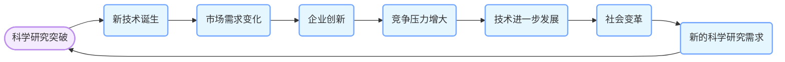

# 如何在技术快速变革中生存与发展

> 关键词：技术变革、生存发展、技术趋势、创新能力、适应策略

> 摘要：在当今时代，技术正以前所未有的速度进行变革，这既为个人和企业带来了前所未有的机遇，也带来了巨大的挑战。本文旨在探讨在技术快速变革的大环境下，个人和企业该如何实现生存与发展。通过对技术变革的背景、核心概念、相关算法原理、数学模型、项目实战、应用场景等多方面进行深入分析，提出切实可行的策略和方法，帮助读者更好地适应技术变革，把握发展机遇。

## 1. 背景介绍 
### 1.1 目的和范围
本文章的目的在于为个人和企业在技术快速变革的浪潮中提供全面且具有针对性的指导。范围涵盖了技术变革的多个领域，包括但不限于信息技术、人工智能、生物技术、新能源技术等。通过对不同领域技术变革的分析，总结出通用的生存与发展策略，适用于各类行业和不同规模的企业以及不同职业阶段的个人。

### 1.2 预期读者
预期读者包括企业管理者、创业者、技术人员、投资者以及对技术发展趋势感兴趣的人群。无论是希望在技术变革中带领企业实现突破的管理者，还是渴望提升自身竞争力的技术人员，都能从本文中获得有价值的信息和启示。

### 1.3 文档结构概述
本文首先介绍技术变革的背景信息，包括目的、预期读者和术语表等内容。接着阐述核心概念与联系，通过文本示意图和 Mermaid 流程图帮助读者理解技术变革的内在逻辑。然后详细讲解核心算法原理和具体操作步骤，结合 Python 源代码进行说明。之后介绍数学模型和公式，并举例说明其应用。再通过项目实战展示如何将理论应用到实际中，包括开发环境搭建、源代码实现和代码解读。随后探讨实际应用场景，介绍相关的工具和资源推荐，包括学习资源、开发工具框架和相关论文著作。最后总结未来发展趋势与挑战，提供常见问题与解答，并列出扩展阅读和参考资料。

### 1.4 术语表
#### 1.4.1 核心术语定义
- **技术变革**：指由于科学技术的进步而引起的生产方式、管理模式、社会结构等方面的重大变化。
- **数字化转型**：企业利用数字技术来改造业务流程、提升运营效率、创新商业模式的过程。
- **创新能力**：个人或组织创造新思想、新产品、新方法的能力。
- **技术栈**：指完成一项工作所需的一系列技术和工具的组合。

#### 1.4.2 相关概念解释
- **技术奇点**：指技术发展到一定程度时，会出现指数级的增长和变化，导致人类社会发生根本性的变革。
- **摩尔定律**：由英特尔创始人之一戈登·摩尔提出，指集成电路上可容纳的晶体管数目，约每隔 18 个月便会增加一倍，性能也将提升一倍。

#### 1.4.3 缩略词列表
- **AI**：Artificial Intelligence，人工智能
- **IoT**：Internet of Things，物联网
- **VR**：Virtual Reality，虚拟现实
- **AR**：Augmented Reality，增强现实

## 2. 核心概念与联系 

### 技术变革的驱动因素
技术变革的驱动因素主要包括科学研究的突破、市场需求的变化和竞争压力的推动。科学研究的新发现为技术创新提供了理论基础，例如量子力学的发展为量子计算技术的诞生奠定了基础。市场需求的变化促使企业不断创新，以满足消费者日益多样化的需求，如智能手机的发展就是为了满足人们对移动办公、娱乐等多方面的需求。竞争压力则迫使企业不断提升自身的技术水平，以在市场中占据优势地位。

### 技术变革与生存发展的关系
技术变革既带来了挑战，也带来了机遇。对于个人而言，技术变革可能导致某些职业的消失，但也会创造出许多新的职业机会。例如，随着电商的发展，传统实体店销售人员的需求减少，但电商运营、物流管理等职业的需求大幅增加。对于企业来说，技术变革可能使一些传统企业面临淘汰的风险，但也为创新型企业提供了快速发展的机会。例如，共享经济的兴起对传统出租车行业造成了巨大冲击，但也催生了滴滴、Uber 等新型出行企业。

### 文本示意图
技术变革的核心概念与联系可以用以下文本示意图表示：

科学研究突破 ---> 新技术诞生 ---> 市场需求变化 ---> 企业创新 ---> 竞争压力增大 ---> 技术进一步发展 ---> 社会变革

### Mermaid 流程图


## 3. 核心算法原理 & 具体操作步骤 

### 趋势预测算法原理
在技术快速变革的环境中，准确预测技术发展趋势至关重要。一种常用的趋势预测算法是时间序列分析算法。时间序列分析是一种基于历史数据来预测未来趋势的统计方法。其基本原理是通过对历史数据的分析，找出数据的变化规律，然后利用这些规律来预测未来的数据。

以下是一个使用 Python 实现的简单时间序列分析示例，使用的是 ARIMA（Autoregressive Integrated Moving Average）模型：

```python
import pandas as pd
from statsmodels.tsa.arima.model import ARIMA
import matplotlib.pyplot as plt

# 生成示例数据
data = [10, 12, 15, 13, 16, 18, 20, 22, 25, 23]
index = pd.date_range(start='2020-01-01', periods=len(data), freq='M')
series = pd.Series(data, index=index)

# 拟合 ARIMA 模型
model = ARIMA(series, order=(1, 1, 1))
model_fit = model.fit()

# 进行预测
forecast_steps = 5
forecast = model_fit.get_forecast(steps=forecast_steps)
forecast_mean = forecast.predicted_mean

# 绘制结果
plt.plot(series, label='Historical Data')
plt.plot(forecast_mean, label='Forecast', linestyle='--')
plt.title('Time Series Forecast')
plt.xlabel('Date')
plt.ylabel('Value')
plt.legend()
plt.show()
```

### 具体操作步骤
1. **数据收集**：收集与技术发展相关的历史数据，例如技术指标、市场份额、用户数量等。
2. **数据预处理**：对收集到的数据进行清洗、转换和归一化等处理，以提高数据的质量和可用性。
3. **模型选择**：根据数据的特点和预测目标，选择合适的预测模型，如 ARIMA、LSTM（Long Short-Term Memory）等。
4. **模型训练**：使用历史数据对选择的模型进行训练，调整模型的参数，以提高模型的预测准确性。
5. **模型评估**：使用测试数据对训练好的模型进行评估，计算模型的评估指标，如均方误差（MSE）、平均绝对误差（MAE）等。
6. **预测与决策**：使用训练好的模型进行预测，并根据预测结果做出相应的决策，如调整业务策略、投资方向等。

## 4. 数学模型和公式 & 详细讲解 & 举例说明 

### ARIMA 模型的数学原理
ARIMA 模型是一种广泛应用于时间序列预测的模型，它结合了自回归（AR）、差分（I）和移动平均（MA）三个部分。其数学表达式如下：

$$
(1 - \sum_{i=1}^{p} \phi_i B^i)(1 - B)^d Y_t = (1 + \sum_{j=1}^{q} \theta_j B^j) \epsilon_t
$$

其中：
- $Y_t$ 是时间序列在时刻 $t$ 的值。
- $B$ 是后移算子，即 $B Y_t = Y_{t-1}$。
- $p$ 是自回归的阶数，表示使用过去 $p$ 个时间点的值来预测当前值。
- $d$ 是差分的阶数，用于使时间序列变得平稳。
- $q$ 是移动平均的阶数，表示使用过去 $q$ 个时间点的误差项来预测当前值。
- $\phi_i$ 是自回归系数。
- $\theta_j$ 是移动平均系数。
- $\epsilon_t$ 是白噪声序列。

### 详细讲解
- **自回归部分（AR）**：自回归部分表示当前值与过去若干个时间点的值之间的线性关系。例如，当 $p = 1$ 时，$Y_t$ 可以表示为 $Y_t = \phi_1 Y_{t-1} + \epsilon_t$，即当前值只与前一个时间点的值有关。
- **差分部分（I）**：差分部分用于处理非平稳时间序列。通过对时间序列进行差分操作，可以使其变得平稳。例如，一阶差分可以表示为 $\Delta Y_t = Y_t - Y_{t-1}$。
- **移动平均部分（MA）**：移动平均部分表示当前值与过去若干个时间点的误差项之间的线性关系。例如，当 $q = 1$ 时，$Y_t$ 可以表示为 $Y_t = \epsilon_t + \theta_1 \epsilon_{t-1}$，即当前值只与当前误差项和前一个时间点的误差项有关。

### 举例说明
假设我们有一个时间序列 $Y = [10, 12, 15, 13, 16, 18, 20, 22, 25, 23]$，我们可以使用 ARIMA(1, 1, 1) 模型进行预测。首先，我们对时间序列进行一阶差分，使其变得平稳。然后，我们根据自回归和移动平均的原理，建立模型并进行训练。最后，我们使用训练好的模型进行预测，得到未来几个时间点的预测值。

## 5. 项目实战：代码实际案例和详细解释说明 

### 5.1  开发环境搭建
1. **安装 Python**：从 Python 官方网站（https://www.python.org/downloads/） 下载并安装 Python 3.x 版本。
2. **安装必要的库**：使用以下命令安装所需的库：
```bash
pip install pandas statsmodels matplotlib
```

### 5.2  源代码详细实现和代码解读
```python
import pandas as pd
from statsmodels.tsa.arima.model import ARIMA
import matplotlib.pyplot as plt

# 生成示例数据
data = [10, 12, 15, 13, 16, 18, 20, 22, 25, 23]
index = pd.date_range(start='2020-01-01', periods=len(data), freq='M')
series = pd.Series(data, index=index)

# 代码解读：
# 这里我们生成了一个示例时间序列数据，数据包含 10 个值，并使用 pandas 的 date_range 函数生成了对应的日期索引。

# 拟合 ARIMA 模型
model = ARIMA(series, order=(1, 1, 1))
model_fit = model.fit()

# 代码解读：
# 我们使用 ARIMA 模型对时间序列进行拟合，order=(1, 1, 1) 表示自回归阶数为 1，差分阶数为 1，移动平均阶数为 1。
# 然后使用 fit() 方法对模型进行训练。

# 进行预测
forecast_steps = 5
forecast = model_fit.get_forecast(steps=forecast_steps)
forecast_mean = forecast.predicted_mean

# 代码解读：
# 我们指定要预测的步数为 5，然后使用 get_forecast() 方法进行预测。
# predicted_mean 属性返回预测的均值。

# 绘制结果
plt.plot(series, label='Historical Data')
plt.plot(forecast_mean, label='Forecast', linestyle='--')
plt.title('Time Series Forecast')
plt.xlabel('Date')
plt.ylabel('Value')
plt.legend()
plt.show()

# 代码解读：
# 我们使用 matplotlib 库绘制历史数据和预测结果的图表，以便直观地观察预测效果。
```

### 5.3  代码解读与分析
通过上述代码，我们实现了一个简单的时间序列预测项目。首先，我们生成了示例数据并进行了预处理。然后，我们使用 ARIMA 模型对数据进行拟合和训练。最后，我们进行了预测并绘制了结果图表。在实际应用中，我们可以根据具体需求调整模型的参数，如自回归阶数、差分阶数和移动平均阶数，以提高预测的准确性。

## 6. 实际应用场景 

### 个人职业发展
- **技能提升**：个人可以通过学习新兴技术，如人工智能、大数据、区块链等，提升自己的技能水平，增加在职场上的竞争力。例如，一名传统的会计人员可以学习数据分析技能，转型为财务分析师。
- **职业转型**：关注技术变革带来的新职业机会，适时进行职业转型。例如，随着电商行业的发展，一些传统销售人员可以转型为电商运营人员。

### 企业战略规划
- **产品创新**：企业可以利用新技术进行产品创新，满足消费者的新需求。例如，智能手机厂商可以利用人工智能技术开发智能拍照、智能语音助手等功能。
- **商业模式创新**：借助技术变革，探索新的商业模式。例如，共享经济企业通过互联网技术实现了资源的共享和优化配置。

### 社会发展
- **教育改革**：利用新技术改进教育方式和方法，提高教育质量。例如，在线教育平台的发展使更多人能够接受优质教育资源。
- **医疗进步**：借助生物技术、信息技术等的发展，提高医疗水平和效率。例如，远程医疗技术可以使患者在偏远地区也能得到专家的诊断和治疗。

## 7. 工具和资源推荐
### 7.1 学习资源推荐
#### 7.1.1 书籍推荐
- 《浪潮之巅》：介绍了信息技术产业的发展历程和规律，以及一些知名科技公司的兴衰。
- 《人工智能：现代方法》：全面介绍了人工智能的基本概念、算法和应用。
- 《大数据时代》：阐述了大数据对社会、经济和生活的影响。

#### 7.1.2 在线课程
- Coursera：提供了众多知名大学和机构的在线课程，涵盖了各个领域的技术知识。
- edX：与全球顶尖大学合作，提供高质量的在线课程。
- 中国大学 MOOC：汇聚了国内众多高校的优质课程资源。

#### 7.1.3 技术博客和网站
- Medium：有许多技术专家和开发者分享他们的经验和见解。
- Hacker News：关注技术、创业和科技行业的最新动态。
- 开源中国：提供了丰富的开源技术资讯和项目资源。

### 7.2 开发工具框架推荐
#### 7.2.1 IDE和编辑器
- PyCharm：一款专门为 Python 开发设计的集成开发环境，功能强大。
- Visual Studio Code：一款轻量级的代码编辑器，支持多种编程语言，有丰富的插件。
- Jupyter Notebook：适用于数据科学和机器学习领域，方便进行代码编写和实验。

#### 7.2.2 调试和性能分析工具
- PDB：Python 自带的调试器，可以帮助开发者定位和解决代码中的问题。
- cProfile：Python 的性能分析工具，可以分析代码的运行时间和资源消耗情况。
- TensorBoard：用于可视化深度学习模型的训练过程和性能指标。

#### 7.2.3 相关框架和库
- TensorFlow：一个开源的机器学习框架，广泛应用于深度学习领域。
- PyTorch：另一个流行的深度学习框架，具有简洁易用的特点。
- Scikit-learn：一个用于机器学习的 Python 库，提供了丰富的算法和工具。

### 7.3 相关论文著作推荐
#### 7.3.1 经典论文
- 《A Mathematical Theory of Communication》：香农的经典论文，奠定了信息论的基础。
- 《Learning Representations by Back-propagating Errors》：介绍了反向传播算法，对神经网络的发展起到了重要作用。

#### 7.3.2 最新研究成果
- 关注顶级学术会议和期刊，如 NeurIPS（神经信息处理系统大会）、ICML（国际机器学习会议）、JMLR（机器学习研究杂志）等，获取最新的研究成果。

#### 7.3.3 应用案例分析
- 研究一些知名企业的技术应用案例，如谷歌的搜索引擎技术、亚马逊的电商推荐系统等，学习他们的成功经验。

## 8. 总结：未来发展趋势与挑战

### 未来发展趋势
- **技术融合**：不同领域的技术将相互融合，产生新的技术和应用。例如，人工智能与物联网的结合将实现智能物联网，使设备之间能够实现智能交互和协同工作。
- **个性化定制**：随着消费者需求的日益多样化，产品和服务将更加注重个性化定制。例如，在医疗领域，精准医疗将根据患者的基因信息和身体状况提供个性化的治疗方案。
- **绿色技术发展**：为了应对全球气候变化和资源短缺问题，绿色技术将得到更广泛的应用和发展。例如，新能源技术、节能减排技术等将成为未来的发展重点。

### 挑战
- **技术更新换代快**：技术的快速变革使得个人和企业需要不断学习和更新知识，以跟上技术发展的步伐。这对个人的学习能力和企业的创新能力提出了更高的要求。
- **数据安全和隐私问题**：随着信息技术的发展，数据的数量和价值不断增加，数据安全和隐私问题也日益突出。个人和企业需要加强数据安全保护，防止数据泄露和滥用。
- **社会结构调整**：技术变革可能导致一些传统职业的消失和新职业的出现，这将对社会结构产生影响。政府和社会需要采取相应的措施，促进就业结构的调整和优化，保障社会的稳定和发展。

## 9. 附录：常见问题与解答

### 个人如何快速适应技术变革？
个人可以通过持续学习、关注行业动态、参加培训课程和实践项目等方式快速适应技术变革。同时，要保持开放的心态，勇于尝试新事物，不断提升自己的创新能力和应变能力。

### 企业在技术变革中如何降低风险？
企业可以通过多元化发展、加强技术研发和创新、建立战略合作伙伴关系等方式降低技术变革带来的风险。此外，企业还需要加强风险管理，制定应急预案，以应对可能出现的危机。

### 技术变革对就业市场有哪些影响？
技术变革会导致一些传统职业的需求减少，同时也会创造出许多新的职业机会。就业市场的结构将发生变化，对劳动者的技能和素质要求也将提高。因此，劳动者需要不断学习和提升自己的能力，以适应就业市场的变化。

## 10. 扩展阅读 & 参考资料

### 扩展阅读
- 《人类简史：从动物到上帝》：探讨了人类的进化历程和未来发展方向，对理解技术变革的影响具有一定的启示作用。
- 《失控：全人类的最终命运和结局》：介绍了复杂系统的自组织和进化原理，对技术发展的趋势有独特的见解。

### 参考资料
- 相关学术论文和研究报告
- 行业资讯和统计数据
- 企业官方网站和新闻报道