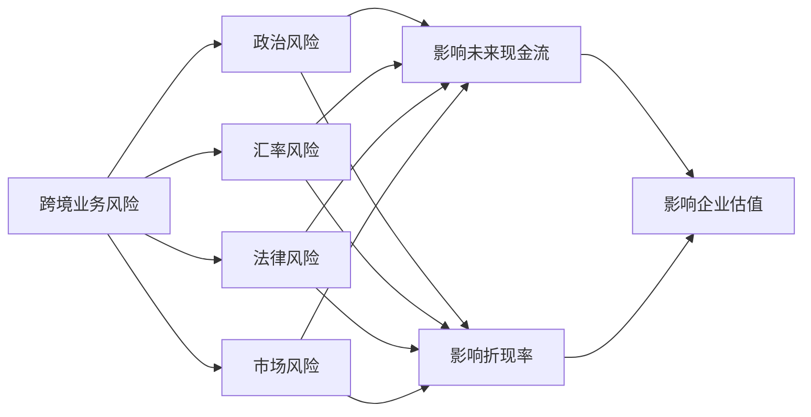

# 如何处理企业估值中的跨境业务风险

> 关键词：企业估值、跨境业务风险、风险评估、风险管理、估值调整、金融市场、国际法规

> 摘要：随着全球化的发展，越来越多的企业开展跨境业务。然而，跨境业务伴随着多种风险，这些风险对企业估值有着重要影响。本文旨在深入探讨如何处理企业估值中的跨境业务风险，首先介绍相关背景知识，包括目的范围、预期读者等；接着阐述核心概念与联系，包括跨境业务风险的类型及与企业估值的关系；然后详细讲解核心算法原理和具体操作步骤，结合数学模型和公式进行说明；通过项目实战案例展示如何在实际中处理跨境业务风险对企业估值的影响；分析实际应用场景；推荐相关工具和资源；最后总结未来发展趋势与挑战，提供常见问题解答和扩展阅读参考资料，帮助企业更准确地进行估值并有效管理跨境业务风险。

## 1. 背景介绍 
### 1.1 目的和范围
在全球经济一体化的大背景下，企业的跨境业务活动日益频繁。准确评估企业价值并合理处理跨境业务风险，对于投资者、企业管理者以及监管机构都具有至关重要的意义。本文的目的在于为读者提供一套全面、系统的方法，用以处理企业估值中涉及的跨境业务风险。范围涵盖了各种类型的跨境业务风险，包括但不限于政治风险、汇率风险、法律风险、市场风险等，以及这些风险对企业估值的具体影响和应对措施。

### 1.2 预期读者
本文预期读者包括企业的高级管理人员、财务分析师、投资经理、风险管理人员、金融机构从业者以及对企业估值和跨境业务风险感兴趣的学者和研究人员。这些读者在实际工作或研究中可能会面临企业估值和跨境业务风险相关的问题，本文将为他们提供有价值的参考和指导。

### 1.3 文档结构概述
本文将按照以下结构展开：首先介绍背景知识，包括目的范围、预期读者等；然后阐述核心概念与联系，分析跨境业务风险的类型及其与企业估值的关系；接着详细讲解核心算法原理和具体操作步骤，结合数学模型和公式进行说明；通过项目实战案例展示如何在实际中处理跨境业务风险对企业估值的影响；分析实际应用场景；推荐相关工具和资源；最后总结未来发展趋势与挑战，提供常见问题解答和扩展阅读参考资料。

### 1.4 术语表
#### 1.4.1 核心术语定义
- **企业估值**：指对企业的整体价值进行评估的过程，通常基于企业的资产、收益、市场地位等多种因素。
- **跨境业务风险**：企业在开展跨境业务过程中面临的各种不确定性和潜在损失，包括政治、经济、法律等多个方面的风险。
- **风险评估**：对跨境业务风险的可能性和影响程度进行分析和评价的过程。
- **风险管理**：采取一系列措施来识别、评估、控制和应对跨境业务风险的过程。
- **估值调整**：根据跨境业务风险的评估结果，对企业估值进行相应的调整。

#### 1.4.2 相关概念解释
- **政治风险**：指由于政治因素导致的企业跨境业务面临的风险，如政策变化、政治不稳定、战争等。
- **汇率风险**：由于汇率波动导致企业在跨境业务中面临的资产、负债和收益的不确定性。
- **法律风险**：企业在跨境业务中因不同国家或地区的法律法规差异而面临的风险，如法律纠纷、合规问题等。
- **市场风险**：指由于市场因素导致的企业跨境业务面临的风险，如市场需求变化、竞争加剧等。

#### 1.4.3 缩略词列表
- **NPV**：净现值（Net Present Value）
- **DCF**：现金流折现法（Discounted Cash Flow）
- **VAR**：风险价值（Value at Risk）

## 2. 核心概念与联系 

### 跨境业务风险的类型
跨境业务风险主要包括以下几种类型：
1. **政治风险**：政治风险是跨境业务中较为重要的风险之一。不同国家的政治制度、政策稳定性和国际关系等因素都会对企业的跨境业务产生影响。例如，某国家突然出台限制外资的政策，可能导致企业在该国的投资无法正常进行，甚至面临资产被没收的风险。
2. **汇率风险**：汇率的波动会直接影响企业的跨境收支和资产负债价值。当企业的收入和成本以不同货币计价时，汇率的变化可能导致企业的利润发生变化。例如，一家中国企业向美国出口商品，以美元计价，如果美元贬值，该企业在将美元兑换成人民币时就会面临损失。
3. **法律风险**：不同国家的法律法规存在差异，企业在跨境业务中需要遵守当地的法律规定。如果企业对当地法律不熟悉或违反了当地法律，可能会面临法律诉讼、罚款等风险。例如，某些国家对数据隐私保护有严格的法律规定，如果企业在跨境数据传输过程中违反了这些规定，就可能面临严重的法律后果。
4. **市场风险**：市场风险包括市场需求变化、竞争加剧等因素。不同国家的市场环境和消费者需求存在差异，企业需要适应当地市场的特点。如果企业不能及时调整产品或服务以满足当地市场需求，可能会面临市场份额下降、销售额减少等风险。

### 跨境业务风险与企业估值的关系
跨境业务风险会对企业的未来现金流和折现率产生影响，从而影响企业估值。
1. **对未来现金流的影响**：政治风险可能导致企业的生产经营活动受到干扰，从而减少未来的现金流。例如，政治不稳定可能导致企业的供应链中断，无法按时交付产品，进而影响销售收入。汇率风险会影响企业的跨境收支，导致现金流的不确定性增加。法律风险可能导致企业面临法律诉讼和罚款，从而减少企业的净利润和现金流。市场风险可能导致企业的市场份额下降，销售收入减少，进而影响未来现金流。
2. **对折现率的影响**：跨境业务风险的增加会导致投资者要求更高的回报率来补偿风险，从而提高折现率。折现率的提高会降低企业未来现金流的现值，进而降低企业估值。例如，当企业面临较高的政治风险时，投资者会认为投资该企业的风险较大，因此会要求更高的回报率。

### 文本示意图
跨境业务风险与企业估值的关系可以用以下示意图表示：

跨境业务风险（政治风险、汇率风险、法律风险、市场风险） -> 影响企业未来现金流和折现率 -> 影响企业估值

### Mermaid 流程图


## 3. 核心算法原理 & 具体操作步骤 

### 风险评估算法原理
风险评估是处理跨境业务风险的重要环节，常用的风险评估方法包括风险矩阵法、风险价值（VAR）法等。下面以风险矩阵法为例，介绍其算法原理和具体操作步骤。

风险矩阵法是一种基于风险发生的可能性和影响程度来评估风险的方法。该方法将风险发生的可能性和影响程度分别划分为不同的等级，然后根据风险的可能性和影响程度在矩阵中确定风险的等级。

### 风险矩阵法的 Python 实现
```python
# 定义风险可能性等级和影响程度等级
possibility_levels = ['低', '中', '高']
impact_levels = ['轻微', '中等', '严重']

# 定义风险矩阵
risk_matrix = {
    ('低', '轻微'): '低风险',
    ('低', '中等'): '低风险',
    ('低', '严重'): '中风险',
    ('中', '轻微'): '低风险',
    ('中', '中等'): '中风险',
    ('中', '严重'): '高风险',
    ('高', '轻微'): '中风险',
    ('高', '中等'): '高风险',
    ('高', '严重'): '高风险'
}

# 定义风险评估函数
def risk_assessment(possibility, impact):
    if possibility in possibility_levels and impact in impact_levels:
        return risk_matrix[(possibility, impact)]
    else:
        return '无效输入'

# 示例使用
possibility = '中'
impact = '严重'
risk_level = risk_assessment(possibility, impact)
print(f'风险等级: {risk_level}')
```

### 具体操作步骤
1. **确定风险因素**：识别企业跨境业务中可能面临的各种风险因素，如政治风险、汇率风险、法律风险等。
2. **评估风险发生的可能性**：根据历史数据、专家判断等方法，对每个风险因素发生的可能性进行评估，将其划分为低、中、高三个等级。
3. **评估风险的影响程度**：分析每个风险因素对企业的财务状况、经营业绩等方面的影响程度，将其划分为轻微、中等、严重三个等级。
4. **确定风险等级**：根据风险发生的可能性和影响程度，在风险矩阵中查找对应的风险等级。
5. **制定风险应对措施**：根据风险等级，制定相应的风险应对措施，如风险规避、风险降低、风险转移等。

## 4. 数学模型和公式 & 详细讲解 & 举例说明 

### 现金流折现法（DCF）与跨境业务风险调整
现金流折现法是企业估值中常用的方法之一，其基本公式为：

$$NPV = \sum_{t=1}^{n} \frac{CF_t}{(1 + r)^t}$$

其中，$NPV$ 表示净现值，$CF_t$ 表示第 $t$ 期的现金流，$r$ 表示折现率，$n$ 表示预测期数。

在考虑跨境业务风险时，需要对现金流和折现率进行调整。

### 现金流调整
由于跨境业务风险可能导致未来现金流的不确定性增加，需要对现金流进行调整。一种常见的方法是采用情景分析法，根据不同的风险情景预测未来现金流。例如，假设企业面临政治风险，可能出现三种情景：乐观情景、中性情景和悲观情景。在不同情景下，预测未来现金流如下：

| 情景 | 概率 | 第 1 年现金流 | 第 2 年现金流 | 第 3 年现金流 |
|---|---|---|---|---|
| 乐观情景 | 0.3 | 100 | 120 | 150 |
| 中性情景 | 0.5 | 80 | 100 | 120 |
| 悲观情景 | 0.2 | 60 | 80 | 100 |

则调整后的预期现金流为：

$$E(CF_t) = 0.3 \times CF_{t,乐观} + 0.5 \times CF_{t,中性} + 0.2 \times CF_{t,悲观}$$

例如，第 1 年调整后的预期现金流为：

$$E(CF_1) = 0.3 \times 100 + 0.5 \times 80 + 0.2 \times 60 = 82$$

### 折现率调整
跨境业务风险的增加会导致投资者要求更高的回报率来补偿风险，因此需要对折现率进行调整。一种常见的方法是采用资本资产定价模型（CAPM），并考虑跨境业务风险溢价。

资本资产定价模型的公式为：

$$r = r_f + \beta \times (r_m - r_f)$$

其中，$r$ 表示折现率，$r_f$ 表示无风险利率，$\beta$ 表示贝塔系数，$r_m$ 表示市场收益率。

考虑跨境业务风险溢价后的折现率为：

$$r_{调整} = r + RP$$

其中，$RP$ 表示跨境业务风险溢价。

例如，假设无风险利率为 3%，贝塔系数为 1.2，市场收益率为 8%，跨境业务风险溢价为 2%，则调整后的折现率为：

$$r_{调整} = 3\% + 1.2 \times (8\% - 3\%) + 2\% = 9\%$$

### 举例说明
假设企业未来三年的调整后的预期现金流分别为 82、90、100，调整后的折现率为 9%，则企业的净现值为：

$$NPV = \frac{82}{(1 + 0.09)^1} + \frac{90}{(1 + 0.09)^2} + \frac{100}{(1 + 0.09)^3} \approx 227.83$$

## 5. 项目实战：代码实际案例和详细解释说明 

### 5.1  开发环境搭建
本次项目实战使用 Python 语言进行开发，开发环境搭建步骤如下：
1. **安装 Python**：从 Python 官方网站（https://www.python.org/downloads/）下载并安装 Python 3.x 版本。
2. **安装必要的库**：使用 pip 安装必要的库，如 numpy、pandas 等。

```bash
pip install numpy pandas
```

### 5.2  源代码详细实现和代码解读
下面是一个完整的 Python 代码示例，用于处理企业估值中的跨境业务风险：

```python
import numpy as np
import pandas as pd

# 定义风险可能性等级和影响程度等级
possibility_levels = ['低', '中', '高']
impact_levels = ['轻微', '中等', '严重']

# 定义风险矩阵
risk_matrix = {
    ('低', '轻微'): '低风险',
    ('低', '中等'): '低风险',
    ('低', '严重'): '中风险',
    ('中', '轻微'): '低风险',
    ('中', '中等'): '中风险',
    ('中', '严重'): '高风险',
    ('高', '轻微'): '中风险',
    ('高', '中等'): '高风险',
    ('高', '严重'): '高风险'
}

# 定义风险评估函数
def risk_assessment(possibility, impact):
    if possibility in possibility_levels and impact in impact_levels:
        return risk_matrix[(possibility, impact)]
    else:
        return '无效输入'

# 定义现金流折现法函数
def dcf_valuation(cash_flows, discount_rate):
    npv = 0
    for t in range(len(cash_flows)):
        npv += cash_flows[t] / (1 + discount_rate) ** (t + 1)
    return npv

# 示例数据
# 风险评估数据
risk_possibility = '中'
risk_impact = '严重'
# 现金流数据
cash_flows = [82, 90, 100]
# 折现率数据
discount_rate = 0.09

# 风险评估
risk_level = risk_assessment(risk_possibility, risk_impact)
print(f'风险等级: {risk_level}')

# 企业估值
npv = dcf_valuation(cash_flows, discount_rate)
print(f'企业净现值: {npv}')
```

### 5.3  代码解读与分析
1. **风险评估部分**：定义了风险可能性等级、影响程度等级和风险矩阵，通过 `risk_assessment` 函数根据输入的风险可能性和影响程度评估风险等级。
2. **现金流折现法部分**：定义了 `dcf_valuation` 函数，根据输入的现金流和折现率计算企业的净现值。
3. **示例数据部分**：提供了示例的风险评估数据、现金流数据和折现率数据，调用风险评估函数和现金流折现法函数进行风险评估和企业估值，并输出结果。

## 6. 实际应用场景 
### 跨国企业投资决策
跨国企业在进行海外投资时，需要对目标企业进行估值，并考虑跨境业务风险。通过对跨境业务风险的评估和调整，可以更准确地评估目标企业的价值，从而做出更明智的投资决策。例如，一家美国企业计划投资一家中国企业，在估值过程中需要考虑中国的政治、经济、法律等方面的风险，以及汇率波动的影响。

### 跨境并购重组
在跨境并购重组过程中，准确评估企业价值并处理跨境业务风险至关重要。收购方需要对被收购方的跨境业务风险进行全面评估，调整企业估值，以确定合理的收购价格。同时，在并购后的整合过程中，也需要采取相应的措施来管理跨境业务风险，确保并购重组的成功。例如，一家欧洲企业并购一家亚洲企业，需要考虑亚洲地区的文化差异、法律法规差异等风险。

### 跨境融资
企业在进行跨境融资时，投资者会关注企业的跨境业务风险。企业需要向投资者充分披露跨境业务风险，并采取相应的措施来降低风险。通过合理处理跨境业务风险，可以提高企业的信用评级，降低融资成本。例如，一家新兴市场企业在国际市场上发行债券，需要向投资者说明其面临的政治、汇率等风险，并提供相应的风险管理措施。

## 7. 工具和资源推荐
### 7.1 学习资源推荐
#### 7.1.1 书籍推荐
- 《企业估值：理论与实践》：全面介绍了企业估值的方法和理论，包括现金流折现法、市场法、成本法等，同时也涉及了跨境业务风险对企业估值的影响。
- 《国际金融》：深入讲解了国际金融市场的运行机制和汇率风险管理等内容，对于理解跨境业务中的汇率风险非常有帮助。
- 《风险管理》：系统阐述了风险管理的基本原理和方法，包括风险识别、风险评估、风险控制等方面，可应用于跨境业务风险的管理。

#### 7.1.2 在线课程
- Coursera 上的“企业估值与财务建模”课程：由知名教授授课，详细讲解了企业估值的方法和财务建模技巧。
- edX 上的“国际金融与风险管理”课程：涵盖了国际金融市场的各个方面，以及如何管理跨境业务中的金融风险。
- Udemy 上的“风险管理实战”课程：通过实际案例介绍风险管理的方法和工具，帮助学员掌握风险管理的实际操作技能。

#### 7.1.3 技术博客和网站
- 财新网：提供了丰富的财经资讯和分析文章，包括跨境业务风险相关的内容。
- 华尔街日报中文网：及时报道全球金融市场动态和企业跨境业务的最新情况。
- 中国外汇网：专注于外汇市场的信息和分析，对于了解汇率风险非常有帮助。

### 7.2 开发工具框架推荐
#### 7.2.1 IDE和编辑器
- PyCharm：一款功能强大的 Python 集成开发环境，提供了代码编辑、调试、版本控制等一系列功能，适合开发处理跨境业务风险的 Python 程序。
- Jupyter Notebook：一种交互式的开发环境，支持 Python 等多种编程语言，方便进行数据分析和模型验证，可用于风险评估和企业估值的实验。

#### 7.2.2 调试和性能分析工具
- pdb：Python 自带的调试工具，可用于调试 Python 代码，帮助开发者定位和解决问题。
- cProfile：Python 标准库中的性能分析工具，可用于分析 Python 程序的性能瓶颈，优化代码效率。

#### 7.2.3 相关框架和库
- numpy：一个用于科学计算的 Python 库，提供了高效的数组操作和数学函数，可用于处理现金流数据和进行数值计算。
- pandas：一个用于数据处理和分析的 Python 库，提供了数据结构和数据操作方法，方便对风险评估数据和现金流数据进行处理和分析。

### 7.3 相关论文著作推荐
#### 7.3.1 经典论文
- 《跨国公司的风险评估与管理》：该论文系统地阐述了跨国公司面临的各种风险，包括政治风险、汇率风险等，并提出了相应的风险评估和管理方法。
- 《企业估值中的风险调整方法研究》：探讨了在企业估值过程中如何考虑风险因素，并提出了几种常见的风险调整方法。

#### 7.3.2 最新研究成果
- 《数字经济时代跨境业务风险的新特征与应对策略》：研究了数字经济时代跨境业务风险的新变化和特点，并提出了相应的应对策略。
- 《人工智能在跨境业务风险评估中的应用研究》：探讨了人工智能技术在跨境业务风险评估中的应用前景和方法。

#### 7.3.3 应用案例分析
- 《某跨国企业跨境并购中的风险评估与管理案例分析》：通过具体案例分析了跨国企业在跨境并购过程中如何评估和管理风险，为企业提供了实际操作的参考。
- 《某企业跨境业务汇率风险管理案例研究》：详细介绍了一家企业在跨境业务中如何应对汇率风险，采取了哪些有效的风险管理措施。

## 8. 总结：未来发展趋势与挑战
### 未来发展趋势
1. **数字化转型加速**：随着数字技术的不断发展，企业的跨境业务将更加数字化。数字化转型将带来新的机遇和挑战，同时也会改变跨境业务风险的形态和管理方式。例如，区块链技术的应用可以提高跨境交易的透明度和安全性，降低信用风险；人工智能和大数据技术可以帮助企业更准确地评估和管理跨境业务风险。
2. **区域经济一体化加强**：区域经济一体化的发展将促进企业的跨境业务合作。例如，“一带一路”倡议的推进将加强中国与沿线国家的经济合作，企业在这些地区的跨境业务将不断增加。区域经济一体化将带来新的市场机会，但也会面临新的风险，如区域政治、经济政策的变化等。
3. **风险管理专业化**：随着跨境业务风险的日益复杂，企业对风险管理的要求也越来越高。未来，风险管理将更加专业化，企业将更加注重风险管理团队的建设和风险管理工具的应用。同时，风险管理咨询机构和服务提供商也将不断涌现，为企业提供更加专业的风险管理服务。

### 挑战
1. **风险复杂性增加**：随着全球化的深入和数字技术的发展，跨境业务风险的复杂性不断增加。企业需要面对更多类型的风险，如网络安全风险、数据隐私风险等。同时，不同类型的风险之间相互关联、相互影响，增加了风险评估和管理的难度。
2. **法规差异和合规要求**：不同国家和地区的法律法规存在差异，企业在跨境业务中需要遵守当地的法律规定。随着各国对跨境业务监管的加强，企业面临的合规要求也越来越高。企业需要投入更多的资源来了解和遵守不同国家的法律法规，以避免法律风险。
3. **信息不对称**：在跨境业务中，由于信息传递的不及时和不准确，企业可能面临信息不对称的问题。信息不对称会影响企业对跨境业务风险的评估和决策，增加企业的风险。企业需要加强信息收集和分析能力，提高信息的准确性和及时性。

## 9. 附录：常见问题与解答
### 问题 1：如何准确评估跨境业务风险？
解答：准确评估跨境业务风险需要综合考虑多种因素，包括政治、经济、法律、市场等方面。可以采用风险矩阵法、风险价值（VAR）法等方法进行风险评估。同时，还需要收集和分析相关的数据和信息，如历史数据、行业报告、专家意见等，以提高风险评估的准确性。

### 问题 2：跨境业务风险对企业估值的影响有多大？
解答：跨境业务风险对企业估值的影响程度取决于风险的类型、可能性和影响程度。一般来说，风险越高，对企业估值的影响越大。例如，政治风险可能导致企业的生产经营活动受到严重干扰，从而大幅降低企业的未来现金流和估值；汇率风险可能导致企业的利润波动，对企业估值也会产生一定的影响。

### 问题 3：如何应对跨境业务中的汇率风险？
解答：应对跨境业务中的汇率风险可以采取多种措施，如外汇套期保值、选择合适的计价货币、调整经营策略等。外汇套期保值是一种常用的方法，企业可以通过远期外汇合约、外汇期权等工具来锁定汇率，降低汇率波动的风险。选择合适的计价货币也可以减少汇率风险，例如尽量选择本币或稳定的国际货币进行计价。调整经营策略，如增加本地采购、拓展本地市场等，也可以降低企业对汇率波动的敏感度。

### 问题 4：企业在跨境业务中如何遵守不同国家的法律法规？
解答：企业在跨境业务中需要了解和遵守不同国家的法律法规。可以采取以下措施：一是加强法律意识培训，提高员工对不同国家法律法规的认识；二是聘请当地的法律专业人士提供咨询服务，确保企业的经营活动符合当地法律规定；三是建立健全的合规管理制度，加强对企业经营活动的监督和检查，及时发现和纠正合规问题。

## 10. 扩展阅读 & 参考资料
### 扩展阅读
- 《全球风险管理手册》：全面介绍了全球风险管理的理论和实践，包括跨境业务风险的管理。
- 《国际商务环境》：深入分析了国际商务环境的特点和变化，对于理解跨境业务风险的背景和原因非常有帮助。

### 参考资料
1. 教材类：《财务管理学》《国际金融教程》等相关教材。
2. 行业报告：各大金融机构和咨询公司发布的跨境业务风险相关的行业报告。
3. 法律法规：不同国家和地区的相关法律法规，如外汇管理法规、投资法规等。
4. 学术文献：国内外学术期刊上发表的关于企业估值和跨境业务风险的研究论文。