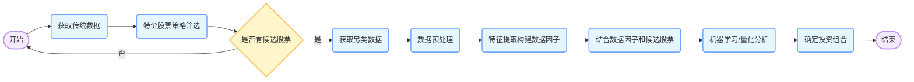

# 如何将特价股票策略与另类数据因子策略相结合

> 关键词：特价股票策略、另类数据因子策略、策略结合、量化投资、金融科技、数据挖掘、投资组合优化

> 摘要：本文聚焦于如何将特价股票策略与另类数据因子策略相结合，旨在为投资者提供更具创新性和有效性的投资方法。首先介绍了研究的背景、目的、预期读者等信息，接着阐述了特价股票策略和另类数据因子策略的核心概念与联系，详细讲解了相关核心算法原理及具体操作步骤，通过数学模型和公式进行理论支撑并举例说明。然后通过项目实战给出代码实际案例及详细解释，分析了该结合策略的实际应用场景。同时推荐了相关的工具和资源，最后总结了未来发展趋势与挑战，并对常见问题进行解答，提供扩展阅读和参考资料，助力投资者深入理解并运用这一创新投资策略。

## 1. 背景介绍 
### 1.1 目的和范围
在当今复杂多变的金融市场中，投资者不断寻求能够获取超额收益且降低风险的投资策略。特价股票策略和另类数据因子策略各自具有独特的优势，但也存在一定的局限性。本研究的目的在于探索如何将这两种策略有机结合，充分发挥它们的长处，以构建更优的投资组合。

研究范围涵盖了特价股票策略和另类数据因子策略的基本原理、核心算法，以及实现两者结合的具体方法和步骤。同时，通过实际案例分析和应用场景探讨，验证该结合策略的可行性和有效性。

### 1.2 预期读者
本文预期读者主要包括专业投资者、量化投资从业者、金融科技领域的研究人员以及对金融投资策略感兴趣的技术爱好者。专业投资者可以从中获取新的投资思路和方法，量化投资从业者可借鉴相关算法和实现步骤进行策略优化，金融科技研究人员能深入了解两种策略结合的技术原理和发展趋势，技术爱好者则可以学习到金融与科技融合的相关知识。

### 1.3 文档结构概述
本文首先介绍研究的背景信息，包括目的、预期读者和文档结构概述等内容。接着阐述特价股票策略和另类数据因子策略的核心概念与联系，展示其原理和架构。然后详细讲解核心算法原理及具体操作步骤，并给出相应的 Python 源代码。通过数学模型和公式对策略进行理论分析和举例说明。之后通过项目实战展示代码实际案例并进行详细解释。分析该结合策略的实际应用场景，推荐相关的工具和资源。最后总结未来发展趋势与挑战，解答常见问题，并提供扩展阅读和参考资料。

### 1.4 术语表
#### 1.4.1 核心术语定义
- **特价股票策略**：一种基于股票价格相对其内在价值被低估的投资策略，投资者通过分析财务指标等传统数据，寻找价格被低估的股票进行投资，期望在股票价格回归其内在价值时获得收益。
- **另类数据因子策略**：利用非传统的、通常来自于社交媒体、卫星图像、物联网设备等数据源的数据，挖掘其中蕴含的信息和规律，构建数据因子，以此作为投资决策的依据。
- **数据因子**：从数据中提取的具有一定经济意义和预测能力的变量，用于解释和预测股票价格的变动。
- **投资组合优化**：在给定的风险水平下，通过合理配置资产，使投资组合的预期收益最大化；或在给定的预期收益目标下，使投资组合的风险最小化。

#### 1.4.2 相关概念解释
- **量化投资**：利用数学、统计学和计算机技术，通过建立模型和算法，对金融市场数据进行分析和处理，以制定投资决策的一种投资方法。
- **数据挖掘**：从大量的数据中发现潜在的、有价值的信息和知识的过程，常用于挖掘另类数据中的投资机会。
- **因子模型**：一种用于解释资产收益率的模型，通过将资产收益率分解为多个因子的线性组合，来分析各因子对资产收益率的影响。

#### 1.4.3 缩略词列表
- **AI**：Artificial Intelligence，人工智能
- **ML**：Machine Learning，机器学习
- **PCA**：Principal Component Analysis，主成分分析
- **ETF**：Exchange-Traded Fund，交易型开放式指数基金

## 2. 核心概念与联系 

### 特价股票策略原理
特价股票策略的核心思想是寻找被市场低估的股票。其理论基础在于市场并非完全有效的，存在信息不对称和投资者非理性行为，导致部分股票的价格与其内在价值偏离。投资者通过分析公司的财务报表、行业地位、竞争力等传统数据，计算股票的内在价值，当股票价格低于其内在价值时，认为该股票被低估，具有投资价值。

例如，常用的方法是使用市盈率（P/E）、市净率（P/B）等估值指标。如果一只股票的市盈率明显低于同行业平均水平，且公司的基本面良好，那么该股票可能被低估。

### 另类数据因子策略原理
另类数据因子策略则是利用非传统数据源的数据来挖掘投资机会。随着信息技术的发展，大量的非结构化数据被产生，如社交媒体上的用户评论、卫星图像、电商平台的销售数据等。这些数据中蕴含着关于公司经营状况、行业趋势、消费者行为等方面的信息。

通过数据挖掘和机器学习技术，可以从这些另类数据中提取有价值的数据因子。例如，通过分析社交媒体上关于某公司的舆情数据，可以构建舆情因子，用于预测该公司股票的短期走势。

### 两者的联系
特价股票策略和另类数据因子策略并非相互独立，而是可以相互补充。特价股票策略主要依赖于传统的财务数据和基本面分析，能够提供股票的长期投资价值判断；而另类数据因子策略则可以从更广泛的数据源中获取实时信息，捕捉市场的短期变化和潜在的投资机会。

将两者结合起来，可以综合考虑股票的长期价值和短期趋势，提高投资决策的准确性和有效性。例如，在使用特价股票策略筛选出被低估的股票后，可以利用另类数据因子策略进一步分析这些股票的短期市场情绪和行业动态，以确定最佳的买入时机。

### 核心概念架构的文本示意图
特价股票策略和另类数据因子策略相结合的核心概念架构可以描述如下：

首先，从传统数据源（如财务报表、行业报告）获取数据，运用特价股票策略的方法进行初步筛选，得到一批被低估的股票候选集。然后，从另类数据源（如社交媒体、卫星图像、物联网设备）收集数据，进行数据预处理和特征提取，构建数据因子。将这些数据因子与特价股票候选集相结合，通过机器学习或其他量化分析方法，对候选集进行进一步的筛选和排序，确定最终的投资组合。

### Mermaid 流程图


## 3. 核心算法原理 & 具体操作步骤 

### 特价股票策略算法原理及 Python 实现
特价股票策略的核心是计算股票的内在价值，并与当前市场价格进行比较。常用的方法是使用股息贴现模型（Dividend Discount Model，DDM）或自由现金流贴现模型（Discounted Cash Flow Model，DCF）。这里以股息贴现模型为例进行说明。

股息贴现模型的基本公式为：

$$V = \frac{D_1}{r - g}$$

其中，$V$ 是股票的内在价值，$D_1$ 是下一期预计股息，$r$ 是必要收益率，$g$ 是股息增长率。

以下是使用 Python 实现股息贴现模型的代码示例：

```python
def ddm_valuation(D1, r, g):
    """
    股息贴现模型计算股票内在价值
    :param D1: 下一期预计股息
    :param r: 必要收益率
    :param g: 股息增长率
    :return: 股票内在价值
    """
    if r <= g:
        raise ValueError("必要收益率必须大于股息增长率")
    return D1 / (r - g)

# 示例数据
D1 = 2.0  # 下一期预计股息
r = 0.1  # 必要收益率
g = 0.05  # 股息增长率

try:
    intrinsic_value = ddm_valuation(D1, r, g)
    print(f"股票内在价值: {intrinsic_value}")
except ValueError as e:
    print(e)
```

### 另类数据因子策略算法原理及 Python 实现
另类数据因子策略的关键在于从另类数据中提取有价值的数据因子。以社交媒体舆情数据为例，我们可以通过情感分析来构建舆情因子。

以下是使用 Python 和`TextBlob`库进行简单情感分析的代码示例：

```python
from textblob import TextBlob

def sentiment_analysis(text):
    """
    情感分析函数
    :param text: 文本内容
    :return: 情感极性（-1 到 1 之间，-1 表示负面，1 表示正面）
    """
    blob = TextBlob(text)
    return blob.sentiment.polarity

# 示例数据
social_media_text = "这家公司的产品太棒了，我非常看好它的未来发展！"
sentiment_score = sentiment_analysis(social_media_text)
print(f"舆情情感得分: {sentiment_score}")
```

### 两者结合的具体操作步骤
1. **数据收集**：同时收集传统的财务数据和另类数据。传统财务数据可以从金融数据提供商（如 Wind、Bloomberg）获取，另类数据可以通过网络爬虫、数据接口等方式收集。
2. **数据预处理**：对收集到的数据进行清洗、整理和标准化处理。对于财务数据，可能需要处理缺失值、异常值等；对于另类数据，需要进行文本清洗、数据转换等操作。
3. **特价股票筛选**：使用股息贴现模型或其他估值方法，对股票进行初步筛选，得到被低估的股票候选集。
4. **数据因子构建**：从另类数据中提取数据因子，如舆情因子、销售数据因子等。
5. **结合分析**：将数据因子与特价股票候选集相结合，使用机器学习算法（如线性回归、逻辑回归、随机森林等）对候选集进行进一步的筛选和排序。
6. **投资组合优化**：根据结合分析的结果，确定最终的投资组合，并进行风险评估和优化。

以下是一个简单的结合分析的 Python 代码示例：

```python
import pandas as pd
from sklearn.linear_model import LinearRegression

# 示例数据
# 假设我们有股票的内在价值、舆情得分和实际收益率数据
data = {
    'intrinsic_value': [100, 120, 110, 90, 130],
    'sentiment_score': [0.8, 0.6, 0.7, 0.3, 0.9],
    'actual_return': [0.1, 0.15, 0.12, 0.05, 0.2]
}
df = pd.DataFrame(data)

# 特征和目标变量
X = df[['intrinsic_value', 'sentiment_score']]
y = df['actual_return']

# 线性回归模型
model = LinearRegression()
model.fit(X, y)

# 预测新数据
new_data = pd.DataFrame({
    'intrinsic_value': [115],
    'sentiment_score': [0.75]
})
predicted_return = model.predict(new_data)
print(f"预测收益率: {predicted_return[0]}")
```

## 4. 数学模型和公式 & 详细讲解 & 举例说明 

### 股息贴现模型（DDM）
如前面所述，股息贴现模型的基本公式为：

$$V = \frac{D_1}{r - g}$$

- **详细讲解**：
    - $D_1$：下一期预计股息，通常可以根据公司的历史股息政策和盈利情况进行预测。
    - $r$：必要收益率，反映了投资者对该股票的最低预期收益率，通常可以使用资本资产定价模型（CAPM）来计算。
    - $g$：股息增长率，是公司股息的预期增长速度，可以根据公司的历史股息增长情况和行业发展趋势进行估计。

- **举例说明**：
假设某公司下一期预计股息 $D_1 = 3$ 元，必要收益率 $r = 0.12$，股息增长率 $g = 0.05$。则该股票的内在价值为：

$$V = \frac{3}{0.12 - 0.05} = \frac{3}{0.07} \approx 42.86$$（元）

如果该股票的当前市场价格低于 42.86 元，则认为该股票被低估，具有投资价值。

### 资本资产定价模型（CAPM）
资本资产定价模型用于计算必要收益率 $r$，其公式为：

$$r = R_f + \beta (R_m - R_f)$$

- **详细讲解**：
    - $R_f$：无风险收益率，通常可以使用国债收益率来近似代替。
    - $\beta$：股票的贝塔系数，反映了该股票相对于市场组合的系统性风险。
    - $R_m$：市场组合的预期收益率，通常可以使用股票市场指数的收益率来近似代替。

- **举例说明**：
假设无风险收益率 $R_f = 0.03$，市场组合的预期收益率 $R_m = 0.1$，某股票的贝塔系数 $\beta = 1.2$。则该股票的必要收益率为：

$$r = 0.03 + 1.2\times(0.1 - 0.03) = 0.03 + 1.2\times0.07 = 0.03 + 0.084 = 0.114$$

### 线性回归模型
线性回归模型用于结合分析中，对股票的收益率进行预测。其基本公式为：

$$y = \beta_0 + \beta_1x_1 + \beta_2x_2 + \cdots + \beta_nx_n + \epsilon$$

- **详细讲解**：
    - $y$：目标变量，即股票的实际收益率。
    - $x_1, x_2, \cdots, x_n$：特征变量，如股票的内在价值、舆情得分等。
    - $\beta_0, \beta_1, \beta_2, \cdots, \beta_n$：回归系数，通过最小二乘法等方法进行估计。
    - $\epsilon$：误差项，反映了模型无法解释的随机因素。

- **举例说明**：
假设我们使用股票的内在价值 $x_1$ 和舆情得分 $x_2$ 来预测股票的收益率 $y$，线性回归模型的表达式为：

$$y = 0.02 + 0.001x_1 + 0.05x_2$$

如果某股票的内在价值 $x_1 = 120$，舆情得分 $x_2 = 0.8$，则预测的收益率为：

$$y = 0.02 + 0.001\times120 + 0.05\times0.8 = 0.02 + 0.12 + 0.04 = 0.18$$

## 5. 项目实战：代码实际案例和详细解释说明 

### 5.1  开发环境搭建
- **操作系统**：建议使用 Windows、Linux 或 macOS 操作系统。
- **Python 版本**：推荐使用 Python 3.7 及以上版本。
- **开发工具**：可以使用 PyCharm、Jupyter Notebook 等开发工具。
- **安装依赖库**：使用`pip`命令安装所需的库，如`pandas`、`numpy`、`scikit-learn`、`textblob`等。

```bash
pip install pandas numpy scikit-learn textblob
```

### 5.2  源代码详细实现和代码解读
以下是一个完整的项目实战代码示例，实现了特价股票策略与另类数据因子策略的结合：

```python
import pandas as pd
import numpy as np
from sklearn.linear_model import LinearRegression
from textblob import TextBlob

# 模拟数据生成函数
def generate_data(n_samples):
    np.random.seed(42)
    intrinsic_values = np.random.randint(80, 150, n_samples)
    sentiment_texts = [
        "这家公司前景不错，产品很有竞争力！",
        "公司业绩下滑，前景堪忧。",
        "新的产品推出，值得期待。",
        "市场竞争激烈，公司面临挑战。",
        "公司管理团队优秀，发展潜力大。"
    ]
    sentiment_scores = [TextBlob(text).sentiment.polarity for text in np.random.choice(sentiment_texts, n_samples)]
    actual_returns = 0.02 + 0.001 * intrinsic_values + 0.05 * np.array(sentiment_scores) + np.random.normal(0, 0.01, n_samples)
    data = {
        'intrinsic_value': intrinsic_values,
        'sentiment_score': sentiment_scores,
        'actual_return': actual_returns
    }
    return pd.DataFrame(data)

# 数据收集
n_samples = 100
df = generate_data(n_samples)

# 数据预处理
# 这里假设数据已经是干净的，不需要进行特殊处理

# 特价股票筛选
# 假设内在价值大于 100 的股票为被低估的股票
undervalued_stocks = df[df['intrinsic_value'] > 100]

# 数据因子构建
# 舆情得分已经作为数据因子

# 结合分析
X = undervalued_stocks[['intrinsic_value', 'sentiment_score']]
y = undervalued_stocks['actual_return']

model = LinearRegression()
model.fit(X, y)

# 预测新数据
new_data = pd.DataFrame({
    'intrinsic_value': [125],
    'sentiment_score': [0.7]
})
predicted_return = model.predict(new_data)
print(f"预测收益率: {predicted_return[0]}")

# 投资组合优化
# 简单示例：根据预测收益率排序，选择收益率最高的股票
undervalued_stocks['predicted_return'] = model.predict(undervalued_stocks[['intrinsic_value', 'sentiment_score']])
sorted_stocks = undervalued_stocks.sort_values(by='predicted_return', ascending=False)
top_stocks = sorted_stocks.head(10)
print("投资组合中的前 10 只股票:")
print(top_stocks)
```

### 5.3  代码解读与分析
- **数据生成**：`generate_data`函数用于模拟生成股票的内在价值、舆情得分和实际收益率数据。
- **数据收集**：调用`generate_data`函数生成 100 个样本的数据。
- **数据预处理**：由于模拟数据已经是干净的，所以这里不需要进行特殊处理。
- **特价股票筛选**：根据内在价值大于 100 的条件筛选出被低估的股票。
- **数据因子构建**：舆情得分作为数据因子。
- **结合分析**：使用线性回归模型对被低估的股票进行结合分析，预测股票的收益率。
- **投资组合优化**：根据预测收益率对被低估的股票进行排序，选择收益率最高的前 10 只股票作为投资组合。

## 6. 实际应用场景 
### 专业投资机构
专业投资机构，如对冲基金、资产管理公司等，可以利用特价股票策略与另类数据因子策略相结合的方法，构建更具竞争力的投资组合。通过挖掘另类数据中的信息，能够及时捕捉市场的变化和潜在的投资机会，提高投资组合的收益。

例如，对冲基金可以使用该策略在市场波动较大时，快速调整投资组合，降低风险。资产管理公司可以将该策略应用于不同类型的基金产品中，为投资者提供多样化的投资选择。

### 个人投资者
个人投资者可以借助该策略提高自己的投资决策能力。通过分析股票的内在价值和市场情绪，个人投资者可以更准确地判断股票的投资价值，避免盲目跟风投资。

例如，个人投资者可以使用免费的金融数据网站和社交媒体平台收集数据，运用简单的量化分析工具进行策略实现，从而在股票投资中获得更好的收益。

### 金融科技公司
金融科技公司可以将该策略与人工智能、大数据等技术相结合，开发智能投资顾问产品。通过对大量数据的分析和处理，为用户提供个性化的投资建议和资产配置方案。

例如，金融科技公司可以开发手机应用程序，用户只需输入自己的投资目标和风险偏好，应用程序即可根据该策略为用户生成适合的投资组合。

## 7. 工具和资源推荐
### 7.1 学习资源推荐
#### 7.1.1 书籍推荐
- 《聪明的投资者》（The Intelligent Investor）：作者本杰明·格雷厄姆（Benjamin Graham），被誉为投资界的圣经，介绍了价值投资的基本原理和方法，对特价股票策略有深入的阐述。
- 《量化投资：策略与技术》：作者丁鹏，系统介绍了量化投资的理论和实践，包括数据挖掘、因子模型、投资组合优化等内容，对理解和应用该策略有很大帮助。
- 《Python 金融数据分析实战》：作者魏太云，详细介绍了如何使用 Python 进行金融数据分析和量化投资，包含大量的代码示例和实际案例。

#### 7.1.2 在线课程
- Coursera 上的“Financial Markets”课程：由耶鲁大学教授罗伯特·席勒（Robert Shiller）主讲，介绍了金融市场的基本原理和投资策略。
- edX 上的“Machine Learning for Trading”课程：教授如何使用机器学习技术进行量化交易，包括数据预处理、特征工程、模型训练等内容。
- 中国大学 MOOC 上的“金融大数据分析与应用”课程：介绍了金融大数据的特点和分析方法，以及如何应用大数据进行投资决策。

#### 7.1.3 技术博客和网站
- 优矿（uqer.io）：提供金融数据和量化交易平台，有丰富的量化投资教程和案例分享。
- 聚宽（joinquant.com）：专注于量化投资领域，提供数据接口、策略回测等功能，社区中有很多量化投资爱好者分享经验和策略。
- 金融界（jrj.com.cn）：提供金融资讯、行情数据等服务，有很多关于投资策略和市场分析的文章。

### 7.2 开发工具框架推荐
#### 7.2.1 IDE和编辑器
- PyCharm：一款专业的 Python 集成开发环境，具有代码编辑、调试、版本控制等功能，适合开发复杂的量化投资项目。
- Jupyter Notebook：一种交互式的开发环境，支持代码、文本、图表等多种形式的展示，适合进行数据分析和模型实验。
- Visual Studio Code：一款轻量级的代码编辑器，支持多种编程语言，有丰富的插件扩展功能，可用于快速开发和调试量化投资代码。

#### 7.2.2 调试和性能分析工具
- PDB：Python 内置的调试器，可以在代码中设置断点，逐行调试代码，帮助查找和解决问题。
- cProfile：Python 标准库中的性能分析工具，可以分析代码的运行时间和函数调用次数，帮助优化代码性能。
- Py-Spy：一个基于 Rust 的 Python 性能分析工具，可以实时监控 Python 程序的性能，生成火焰图等可视化结果。

#### 7.2.3 相关框架和库
- Pandas：用于数据处理和分析的 Python 库，提供了高效的数据结构和数据操作方法，适用于金融数据的处理。
- NumPy：用于科学计算的 Python 库，提供了多维数组和数学函数，是很多量化投资算法的基础。
- Scikit-learn：用于机器学习的 Python 库，提供了丰富的机器学习算法和工具，可用于数据挖掘、模型训练和预测。
- TextBlob：用于自然语言处理的 Python 库，提供了简单的情感分析、词性标注等功能，可用于处理另类数据中的文本信息。

### 7.3 相关论文著作推荐
#### 7.3.1 经典论文
- Fama, E. F., & French, K. R. (1992). The cross-section of expected stock returns. The Journal of Finance, 47(2), 427-465. 该论文提出了著名的 Fama-French 三因子模型，对理解股票收益率的影响因素有重要意义。
- Jegadeesh, N., & Titman, S. (1993). Returns to buying winners and selling losers: Implications for stock market efficiency. The Journal of Finance, 48(1), 65-91. 该论文研究了动量效应，即过去表现好的股票在未来一段时间内继续表现好的现象，为投资策略的制定提供了参考。

#### 7.3.2 最新研究成果
- 关注顶级金融学术期刊，如 The Journal of Finance、The Review of Financial Studies 等，这些期刊上经常发表关于量化投资、另类数据等领域的最新研究成果。
- 参加金融科技领域的学术会议，如 ACM SIGKDD、IEEE ICDM 等，了解最新的技术和研究趋势。

#### 7.3.3 应用案例分析
- 一些金融机构和研究机构会发布关于量化投资策略应用的案例分析报告，可以通过他们的官方网站或专业数据库获取。
- 关注金融科技公司的博客和研究报告，了解他们在实际项目中应用特价股票策略与另类数据因子策略相结合的经验和成果。

## 8. 总结：未来发展趋势与挑战
### 未来发展趋势
- **数据多元化**：随着信息技术的不断发展，另类数据的来源将越来越广泛，除了社交媒体、卫星图像等数据外，还将包括物联网设备产生的大量实时数据、医疗健康数据等。这些多元化的数据将为投资策略的制定提供更多的信息和机会。
- **人工智能与机器学习的深度应用**：人工智能和机器学习技术将在量化投资领域得到更深入的应用。例如，使用深度学习算法对海量的另类数据进行分析和挖掘，提高数据因子的提取效率和准确性；使用强化学习算法进行投资组合优化，实现自适应的投资决策。
- **跨学科融合**：量化投资将与计算机科学、统计学、经济学、心理学等多个学科进行更深入的融合。例如，结合心理学原理分析投资者的行为和情绪，将其纳入投资策略的考虑因素中，提高投资决策的科学性和有效性。

### 挑战
- **数据质量和隐私问题**：另类数据的质量参差不齐，存在数据不准确、不完整、不一致等问题。同时，数据隐私和安全也是一个重要的挑战，如何在合法合规的前提下获取和使用另类数据是需要解决的问题。
- **模型的可解释性**：随着人工智能和机器学习模型的复杂度不断增加，模型的可解释性变得越来越重要。投资者需要理解模型的决策过程和依据，以便做出合理的投资决策。如何提高模型的可解释性是量化投资领域面临的一个重要挑战。
- **市场变化和竞争加剧**：金融市场是动态变化的，投资策略需要不断适应市场的变化。同时，随着量化投资的普及，市场竞争也将加剧，如何在激烈的竞争中保持优势是投资者和投资机构需要面对的挑战。

## 9. 附录：常见问题与解答
### 问题 1：如何确定股息贴现模型中的股息增长率 $g$？
答：股息增长率 $g$ 可以根据公司的历史股息增长情况、盈利增长情况和行业发展趋势进行估计。一种常用的方法是使用公司过去几年的平均股息增长率作为未来的预测值。此外，还可以参考行业分析师的研究报告和市场预期，对股息增长率进行调整。

### 问题 2：另类数据的获取渠道有哪些？
答：另类数据的获取渠道非常广泛，常见的包括：
- **社交媒体平台**：如 Twitter、微博、股吧等，可以获取用户对公司和市场的评论和情绪信息。
- **卫星图像提供商**：可以获取关于企业生产设施、仓库、港口等的图像数据，用于分析企业的生产和运营情况。
- **物联网设备**：如智能电表、传感器等，可以获取关于能源消耗、物流运输等方面的实时数据。
- **电商平台**：可以获取商品销售数据、用户评价等信息，了解企业的市场表现和消费者需求。

### 问题 3：如何评估结合策略的有效性？
答：可以通过以下几种方法评估结合策略的有效性：
- **回测**：使用历史数据对策略进行回测，比较策略的收益率、夏普比率等指标与基准指数的表现，评估策略的盈利能力和风险控制能力。
- **样本外测试**：使用未参与模型训练的数据对策略进行测试，验证策略的泛化能力和稳定性。
- **模拟交易**：在模拟交易环境中运行策略，观察策略的实际表现，评估策略在实际市场中的可行性。

### 问题 4：如何处理另类数据中的噪声和异常值？
答：处理另类数据中的噪声和异常值可以采用以下方法：
- **数据清洗**：对数据进行清洗，去除重复数据、缺失值和无效数据。
- **统计方法**：使用统计方法，如均值、中位数、标准差等，识别和处理异常值。
- **机器学习方法**：使用机器学习算法，如聚类分析、异常检测等，自动识别和处理噪声和异常值。

## 10. 扩展阅读 & 参考资料
### 扩展阅读
- 《金融炼金术》（The Alchemy of Finance）：作者乔治·索罗斯（George Soros），介绍了他的投资哲学和交易策略，对理解金融市场的复杂性和不确定性有很大帮助。
- 《黑天鹅》（The Black Swan）：作者纳西姆·尼古拉斯·塔勒布（Nassim Nicholas Taleb），探讨了不可预测的重大事件对金融市场和投资决策的影响，提醒投资者要重视风险管理。
- 《思考，快与慢》（Thinking, Fast and Slow）：作者丹尼尔·卡尼曼（Daniel Kahneman），介绍了人类思维的两种模式和认知偏差，对理解投资者的行为和情绪有重要意义。

### 参考资料
- 金融数据提供商的官方网站，如 Wind、Bloomberg 等，获取财务数据和市场行情信息。
- 学术数据库，如 Web of Science、EBSCOhost 等，获取相关的学术论文和研究报告。
- 金融科技公司的官方网站和博客，如优矿、聚宽等，获取量化投资的技术文档和案例分享。