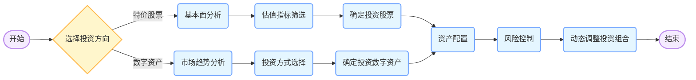

# 如何将特价股票策略与数字资产投资结合

> 关键词：特价股票策略、数字资产投资、投资组合、风险控制、市场分析、资产配置、收益优化

> 摘要：本文聚焦于如何将特价股票策略与数字资产投资相结合。首先介绍了相关背景，包括目的范围、预期读者等内容。接着阐述了特价股票策略和数字资产投资的核心概念及两者联系，详细讲解了核心算法原理与操作步骤，并给出了对应的数学模型和公式。通过项目实战展示了结合两者的具体代码实现与分析。探讨了其实际应用场景，推荐了学习资源、开发工具框架以及相关论文著作。最后总结了未来发展趋势与挑战，解答常见问题并提供扩展阅读与参考资料，旨在为投资者提供全面且深入的指导，帮助其更好地实现特价股票策略与数字资产投资的有效结合，优化投资组合并提升收益。

## 1. 背景介绍 
### 1.1 目的和范围
在当今复杂多变的金融市场环境下，投资者面临着众多的投资选择和挑战。特价股票策略作为传统股票投资领域中一种有效的投资方法，旨在寻找被市场低估的股票，通过长期持有获取价值回归带来的收益。而数字资产投资则是近年来新兴的投资领域，以比特币、以太坊等为代表的数字资产具有高波动性、高风险和高收益的特点，吸引了越来越多投资者的关注。

本文的目的在于探讨如何将特价股票策略与数字资产投资相结合，为投资者提供一种创新的投资思路和方法，帮助投资者优化投资组合，降低风险，提高收益。具体范围包括特价股票策略和数字资产投资的核心概念、两者结合的原理和方法、实际应用场景以及相关的工具和资源推荐等。

### 1.2 预期读者
本文的预期读者主要包括以下几类人群：
1. **个人投资者**：希望通过多元化投资来优化资产配置，提高投资收益的普通投资者。
2. **金融从业者**：包括股票分析师、投资顾问、基金经理等，希望了解新的投资策略和方法，为客户提供更全面的投资建议。
3. **金融科技爱好者**：对数字资产投资和金融科技应用感兴趣，希望深入了解相关技术和理论的人士。
4. **学术研究人员**：从事金融投资、资产定价等领域研究的学者和学生，希望获取相关的研究资料和案例。

### 1.3 文档结构概述
本文将按照以下结构进行组织：
1. **背景介绍**：介绍本文的目的和范围、预期读者、文档结构概述以及相关术语表。
2. **核心概念与联系**：阐述特价股票策略和数字资产投资的核心概念，分析两者之间的联系和相互影响。
3. **核心算法原理 & 具体操作步骤**：详细讲解将特价股票策略与数字资产投资结合的核心算法原理，并给出具体的操作步骤，同时使用 Python 源代码进行阐述。
4. **数学模型和公式 & 详细讲解 & 举例说明**：建立相关的数学模型和公式，详细讲解其含义和应用，并通过具体例子进行说明。
5. **项目实战：代码实际案例和详细解释说明**：通过一个实际的项目案例，展示如何使用代码实现特价股票策略与数字资产投资的结合，并对代码进行详细解读和分析。
6. **实际应用场景**：探讨特价股票策略与数字资产投资结合在不同场景下的应用。
7. **工具和资源推荐**：推荐相关的学习资源、开发工具框架以及论文著作。
8. **总结：未来发展趋势与挑战**：总结本文的主要内容，分析未来的发展趋势和面临的挑战。
9. **附录：常见问题与解答**：解答读者在阅读过程中可能遇到的常见问题。
10. **扩展阅读 & 参考资料**：提供相关的扩展阅读材料和参考资料。

### 1.4 术语表
#### 1.4.1 核心术语定义
1. **特价股票策略**：一种基于价值投资理念的股票投资策略，通过分析股票的基本面和市场价格，寻找被市场低估的股票进行投资，期望在股票价值回归时获得收益。
2. **数字资产**：指以电子数据形式存在的资产，包括加密货币、数字代币、虚拟货币等，具有去中心化、匿名性、高波动性等特点。
3. **投资组合**：由多种不同的资产组成的集合，投资者通过合理配置资产，以达到降低风险、提高收益的目的。
4. **风险控制**：在投资过程中，通过各种方法和手段对投资风险进行识别、评估和控制，以降低投资损失的可能性。
5. **资产配置**：根据投资者的风险偏好、投资目标和市场情况，将资金分配到不同的资产类别中，以实现投资组合的优化。

#### 1.4.2 相关概念解释
1. **价值投资**：一种投资理念，强调通过分析公司的基本面，如财务状况、盈利能力、行业前景等，寻找被市场低估的股票进行投资，长期持有以获取公司价值增长带来的收益。
2. **加密货币**：一种基于密码学技术的数字资产，使用去中心化的分布式账本技术（如区块链）进行交易记录和验证，具有匿名性、安全性和不可篡改等特点。
3. **市场有效性**：指市场价格能够充分反映所有可用信息的程度。在有效市场中，股票价格已经反映了所有已知的信息，因此很难通过分析信息来获得超额收益。
4. **波动率**：衡量资产价格波动程度的指标，通常用标准差来表示。波动率越高，资产价格的波动越剧烈，投资风险也越大。

#### 1.4.3 缩略词列表
1. **ETF**：Exchange Traded Fund，交易型开放式指数基金。
2. **ICO**：Initial Coin Offering，首次代币发行。
3. **API**：Application Programming Interface，应用程序编程接口。
4. **MACD**：Moving Average Convergence Divergence，指数平滑异同移动平均线。
5. **RSI**：Relative Strength Index，相对强弱指数。

## 2. 核心概念与联系 

### 2.1 特价股票策略核心概念
特价股票策略的核心思想是基于价值投资理论，认为市场有时会出现错误定价，导致某些股票的价格低于其内在价值。投资者通过深入分析公司的基本面，如财务报表、行业地位、竞争优势等，寻找这些被低估的股票，并在适当的时机买入，等待股票价值回归，从而获得投资收益。

特价股票的筛选通常基于以下几个方面的指标：
1. **市盈率（P/E）**：反映了股票价格与每股收益的比率，是衡量股票估值的常用指标。较低的市盈率可能意味着股票被低估。
2. **市净率（P/B）**：反映了股票价格与每股净资产的比率，也是衡量股票估值的重要指标。较低的市净率可能表示股票具有较高的投资价值。
3. **股息率**：指股票每年的股息与股票价格的比率，是衡量股票投资收益的一个重要指标。较高的股息率可能意味着股票具有较好的投资价值。

### 2.2 数字资产投资核心概念
数字资产投资是指投资者将资金投入到各种数字资产中，以获取资产增值或收益的行为。数字资产具有以下特点：
1. **去中心化**：数字资产通常基于区块链技术，不依赖于单一的中心化机构进行管理，具有较高的自主性和安全性。
2. **高波动性**：数字资产市场的价格波动较为剧烈，投资者可能在短时间内获得高额收益，也可能面临较大的损失。
3. **创新性**：数字资产领域不断涌现新的技术和应用，如智能合约、去中心化金融（DeFi）等，为投资者带来了更多的投资机会和挑战。

数字资产投资的常见方式包括：
1. **直接投资**：投资者直接购买数字资产，如比特币、以太坊等，等待资产价格上涨后卖出获利。
2. **投资数字资产基金**：通过购买数字资产基金，间接参与数字资产投资，由专业的基金经理进行资产配置和管理。
3. **参与 ICO 或 IEO**：参与首次代币发行（ICO）或首次交易所发行（IEO），投资新兴的数字资产项目。

### 2.3 两者联系
特价股票策略和数字资产投资虽然属于不同的投资领域，但它们之间存在一定的联系：
1. **投资目标相同**：两者的最终目标都是为了实现资产的增值和收益最大化，投资者通过合理的投资决策和资产配置，希望在承担一定风险的前提下获得更高的回报。
2. **风险分散**：将特价股票策略与数字资产投资相结合，可以实现投资组合的多元化，降低单一资产的风险。由于股票市场和数字资产市场的走势并不完全相关，当股票市场表现不佳时，数字资产可能表现较好，反之亦然。
3. **市场分析方法相似**：在进行特价股票策略和数字资产投资时，都需要进行市场分析和研究。投资者需要关注宏观经济环境、行业发展趋势、公司基本面等因素，以做出合理的投资决策。

### 2.4 核心概念原理和架构的文本示意图
```plaintext
特价股票策略与数字资产投资结合架构

|-- 特价股票策略
|   |-- 基本面分析
|   |   |-- 财务报表分析
|   |   |-- 行业地位评估
|   |   |-- 竞争优势分析
|   |-- 估值指标筛选
|   |   |-- 市盈率（P/E）
|   |   |-- 市净率（P/B）
|   |   |-- 股息率
|
|-- 数字资产投资
|   |-- 市场趋势分析
|   |   |-- 技术分析
|   |   |-- 基本面分析
|   |-- 投资方式选择
|   |   |-- 直接投资
|   |   |-- 投资数字资产基金
|   |   |-- 参与 ICO 或 IEO
|
|-- 结合策略
|   |-- 资产配置
|   |   |-- 确定投资比例
|   |   |-- 动态调整
|   |-- 风险控制
|   |   |-- 止损策略
|   |   |-- 分散投资
```

### 2.5 Mermaid 流程图


## 3. 核心算法原理 & 具体操作步骤 

### 3.1 核心算法原理
将特价股票策略与数字资产投资结合的核心算法原理主要基于资产配置理论和风险控制原则。具体步骤如下：
1. **资产筛选**：分别使用特价股票策略和数字资产投资的方法，筛选出具有投资价值的股票和数字资产。
2. **风险评估**：对筛选出的股票和数字资产进行风险评估，确定其风险水平。
3. **资产配置**：根据投资者的风险偏好和投资目标，将资金分配到不同的股票和数字资产中，构建投资组合。
4. **动态调整**：定期对投资组合进行评估和调整，根据市场情况和资产表现，调整投资比例，以实现风险控制和收益优化。

### 3.2 具体操作步骤
#### 3.2.1 数据收集
1. **股票数据**：收集股票的基本面数据，如财务报表、市盈率、市净率、股息率等；同时收集股票的市场数据，如价格走势、成交量等。
2. **数字资产数据**：收集数字资产的市场数据，如价格走势、成交量、市值等；同时关注数字资产的技术发展和行业动态。

#### 3.2.2 资产筛选
1. **特价股票筛选**：使用以下公式筛选特价股票：
    - 市盈率（P/E） < 行业平均市盈率
    - 市净率（P/B） < 行业平均市净率
    - 股息率 > 行业平均股息率
2. **数字资产筛选**：根据数字资产的市场表现、技术实力、团队背景等因素，筛选出具有潜力的数字资产。

#### 3.2.3 风险评估
1. **股票风险评估**：使用以下指标评估股票的风险：
    - 波动率：衡量股票价格的波动程度。
    - 贝塔系数：衡量股票相对于市场的风险程度。
2. **数字资产风险评估**：使用以下指标评估数字资产的风险：
    - 波动率：衡量数字资产价格的波动程度。
    - 市值：反映数字资产的市场规模和稳定性。

#### 3.2.4 资产配置
1. **确定投资比例**：根据投资者的风险偏好和投资目标，确定股票和数字资产的投资比例。例如，风险偏好较低的投资者可以将大部分资金投资于股票，小部分资金投资于数字资产；风险偏好较高的投资者可以适当增加数字资产的投资比例。
2. **动态调整**：定期对投资组合进行评估和调整，根据市场情况和资产表现，调整投资比例。例如，当股票市场表现不佳时，可以适当增加数字资产的投资比例；当数字资产市场出现泡沫时，可以减少数字资产的投资比例。

#### 3.2.5 风险控制
1. **止损策略**：设定止损点，当股票或数字资产的价格下跌到一定程度时，及时卖出，以避免损失进一步扩大。
2. **分散投资**：将资金分散投资于不同的股票和数字资产，降低单一资产的风险。

### 3.3 Python 源代码实现
```python
import pandas as pd
import numpy as np
import yfinance as yf
from datetime import datetime, timedelta

# 数据收集
def collect_data(tickers, start_date, end_date):
    data = yf.download(tickers, start=start_date, end=end_date)
    return data

# 特价股票筛选
def screen_stocks(data, industry_pe, industry_pb, industry_dividend_yield):
    screened_stocks = []
    for ticker in data.columns.levels[1]:
        stock_data = data['Close'][ticker]
        pe = stock_data[-1] / data['Earnings'][ticker][-1]
        pb = stock_data[-1] / data['BookValue'][ticker][-1]
        dividend_yield = data['Dividends'][ticker].sum() / stock_data[-1]
        if pe < industry_pe and pb < industry_pb and dividend_yield > industry_dividend_yield:
            screened_stocks.append(ticker)
    return screened_stocks

# 数字资产筛选（简单示例，仅根据价格涨幅筛选）
def screen_digital_assets(data, min_return):
    screened_assets = []
    for asset in data.columns:
        returns = data[asset].pct_change()
        if returns[-1] > min_return:
            screened_assets.append(asset)
    return screened_assets

# 风险评估
def risk_assessment(data):
    volatility = data.pct_change().std()
    return volatility

# 资产配置
def asset_allocation(risk_preference, screened_stocks, screened_assets, stock_volatility, asset_volatility):
    if risk_preference == 'low':
        stock_weight = 0.8
        asset_weight = 0.2
    elif risk_preference == 'medium':
        stock_weight = 0.6
        asset_weight = 0.4
    else:
        stock_weight = 0.4
        asset_weight = 0.6
    
    total_stock_volatility = stock_volatility[screened_stocks].mean()
    total_asset_volatility = asset_volatility[screened_assets].mean()
    
    stock_allocation = stock_weight * (1 - total_stock_volatility / (total_stock_volatility + total_asset_volatility))
    asset_allocation = asset_weight * (1 - total_asset_volatility / (total_stock_volatility + total_asset_volatility))
    
    return stock_allocation, asset_allocation

# 主函数
def main():
    # 股票和数字资产列表
    stock_tickers = ['AAPL', 'MSFT', 'GOOG']
    digital_asset_tickers = ['BTC-USD', 'ETH-USD']
    
    # 数据收集时间范围
    start_date = datetime.now() - timedelta(days=365)
    end_date = datetime.now()
    
    # 收集数据
    stock_data = collect_data(stock_tickers, start_date, end_date)
    digital_asset_data = collect_data(digital_asset_tickers, start_date, end_date)
    
    # 行业平均估值指标（示例）
    industry_pe = 20
    industry_pb = 2
    industry_dividend_yield = 0.02
    
    # 筛选特价股票和数字资产
    screened_stocks = screen_stocks(stock_data, industry_pe, industry_pb, industry_dividend_yield)
    screened_assets = screen_digital_assets(digital_asset_data['Close'], 0.1)
    
    # 风险评估
    stock_volatility = risk_assessment(stock_data['Close'])
    asset_volatility = risk_assessment(digital_asset_data['Close'])
    
    # 资产配置
    risk_preference = 'medium'
    stock_allocation, asset_allocation = asset_allocation(risk_preference, screened_stocks, screened_assets, stock_volatility, asset_volatility)
    
    print(f"特价股票筛选结果: {screened_stocks}")
    print(f"数字资产筛选结果: {screened_assets}")
    print(f"股票投资比例: {stock_allocation}")
    print(f"数字资产投资比例: {asset_allocation}")

if __name__ == "__main__":
    main()
```

### 3.4 代码解释
1. **数据收集**：使用 `yfinance` 库收集股票和数字资产的历史数据。
2. **特价股票筛选**：根据市盈率、市净率和股息率等指标筛选出特价股票。
3. **数字资产筛选**：根据价格涨幅筛选出具有潜力的数字资产。
4. **风险评估**：计算股票和数字资产的波动率，评估其风险水平。
5. **资产配置**：根据投资者的风险偏好和资产的风险水平，确定股票和数字资产的投资比例。
6. **主函数**：调用上述函数，完成数据收集、资产筛选、风险评估和资产配置等操作，并输出结果。

## 4. 数学模型和公式 & 详细讲解 & 举例说明 

### 4.1 市盈率（P/E）
#### 4.1.1 公式
市盈率（P/E）是指股票价格与每股收益的比率，计算公式为：
$$P/E = \frac{股价}{每股收益}$$

#### 4.1.2 详细讲解
市盈率是衡量股票估值的常用指标之一。较低的市盈率可能意味着股票被低估，具有较高的投资价值；较高的市盈率可能意味着股票被高估，投资风险较大。不同行业的市盈率水平可能存在较大差异，因此在使用市盈率进行股票筛选时，需要与行业平均市盈率进行比较。

#### 4.1.3 举例说明
假设某股票的当前价格为 50 元，每股收益为 2 元，则该股票的市盈率为：
$$P/E = \frac{50}{2} = 25$$
如果该行业的平均市盈率为 20，则该股票的市盈率高于行业平均水平，可能被高估。

### 4.2 市净率（P/B）
#### 4.2.1 公式
市净率（P/B）是指股票价格与每股净资产的比率，计算公式为：
$$P/B = \frac{股价}{每股净资产}$$

#### 4.2.2 详细讲解
市净率也是衡量股票估值的重要指标之一。较低的市净率可能意味着股票被低估，具有较高的投资价值；较高的市净率可能意味着股票被高估，投资风险较大。与市盈率类似，不同行业的市净率水平也可能存在较大差异，因此在使用市净率进行股票筛选时，需要与行业平均市净率进行比较。

#### 4.2.3 举例说明
假设某股票的当前价格为 50 元，每股净资产为 10 元，则该股票的市净率为：
$$P/B = \frac{50}{10} = 5$$
如果该行业的平均市净率为 3，则该股票的市净率高于行业平均水平，可能被高估。

### 4.3 股息率
#### 4.3.1 公式
股息率是指股票每年的股息与股票价格的比率，计算公式为：
$$股息率 = \frac{每年股息}{股价} \times 100\%$$

#### 4.3.2 详细讲解
股息率是衡量股票投资收益的一个重要指标。较高的股息率可能意味着股票具有较好的投资价值，投资者可以通过获得股息来实现投资收益。股息率的高低与公司的盈利状况、分红政策等因素有关。

#### 4.3.3 举例说明
假设某股票的当前价格为 50 元，每年的股息为 2 元，则该股票的股息率为：
$$股息率 = \frac{2}{50} \times 100\% = 4\%$$
如果该行业的平均股息率为 3%，则该股票的股息率高于行业平均水平，具有较好的投资价值。

### 4.4 波动率
#### 4.4.1 公式
波动率是衡量资产价格波动程度的指标，通常用标准差来表示。计算公式为：
$$\sigma = \sqrt{\frac{1}{n-1} \sum_{i=1}^{n} (R_i - \bar{R})^2}$$
其中，$\sigma$ 表示波动率，$R_i$ 表示第 $i$ 期的收益率，$\bar{R}$ 表示平均收益率，$n$ 表示样本数量。

#### 4.4.2 详细讲解
波动率反映了资产价格的不确定性和风险程度。波动率越高，资产价格的波动越剧烈，投资风险也越大；波动率越低，资产价格的波动越平稳，投资风险也越小。在投资决策中，投资者通常会根据自己的风险偏好选择合适的波动率水平。

#### 4.4.3 举例说明
假设某股票在过去 10 个交易日的收益率分别为：0.01, 0.02, -0.01, 0.03, -0.02, 0.01, 0.02, -0.01, 0.03, -0.02。则该股票的平均收益率为：
$$\bar{R} = \frac{0.01 + 0.02 - 0.01 + 0.03 - 0.02 + 0.01 + 0.02 - 0.01 + 0.03 - 0.02}{10} = 0.006$$
该股票的波动率为：
$$\sigma = \sqrt{\frac{1}{10-1} \sum_{i=1}^{10} (R_i - 0.006)^2} \approx 0.02$$

### 4.5 资产配置模型
#### 4.5.1 公式
在将特价股票策略与数字资产投资结合的资产配置中，可以使用以下公式确定股票和数字资产的投资比例：
$$w_s = \frac{\sigma_a}{\sigma_s + \sigma_a} \times r_p$$
$$w_a = \frac{\sigma_s}{\sigma_s + \sigma_a} \times (1 - r_p)$$
其中，$w_s$ 表示股票的投资比例，$w_a$ 表示数字资产的投资比例，$\sigma_s$ 表示股票的波动率，$\sigma_a$ 表示数字资产的波动率，$r_p$ 表示投资者的风险偏好系数（取值范围为 0 到 1，风险偏好越低，$r_p$ 越接近 1）。

#### 4.5.2 详细讲解
该资产配置模型基于风险平价原则，即通过调整股票和数字资产的投资比例，使两者的风险贡献相等。风险偏好系数 $r_p$ 反映了投资者对风险的承受能力，风险偏好越低，投资者越倾向于将更多的资金投资于风险较低的股票；风险偏好越高，投资者越倾向于将更多的资金投资于风险较高的数字资产。

#### 4.5.3 举例说明
假设股票的波动率为 0.2，数字资产的波动率为 0.5，投资者的风险偏好系数为 0.6。则股票的投资比例为：
$$w_s = \frac{0.5}{0.2 + 0.5} \times 0.6 \approx 0.43$$
数字资产的投资比例为：
$$w_a = \frac{0.2}{0.2 + 0.5} \times (1 - 0.6) \approx 0.11$$

## 5. 项目实战：代码实际案例和详细解释说明 

### 5.1  开发环境搭建
#### 5.1.1 安装 Python
首先，需要安装 Python 环境。可以从 Python 官方网站（https://www.python.org/downloads/） 下载适合自己操作系统的 Python 安装包，并按照安装向导进行安装。

#### 5.1.2 安装必要的库
在安装好 Python 后，需要安装一些必要的库，如 `pandas`、`numpy`、`yfinance` 等。可以使用以下命令进行安装：
```sh
pip install pandas numpy yfinance
```

### 5.2  源代码详细实现和代码解读
```python
import pandas as pd
import numpy as np
import yfinance as yf
from datetime import datetime, timedelta

# 数据收集
def collect_data(tickers, start_date, end_date):
    data = yf.download(tickers, start=start_date, end=end_date)
    return data

# 特价股票筛选
def screen_stocks(data, industry_pe, industry_pb, industry_dividend_yield):
    screened_stocks = []
    for ticker in data.columns.levels[1]:
        stock_data = data['Close'][ticker]
        pe = stock_data[-1] / data['Earnings'][ticker][-1]
        pb = stock_data[-1] / data['BookValue'][ticker][-1]
        dividend_yield = data['Dividends'][ticker].sum() / stock_data[-1]
        if pe < industry_pe and pb < industry_pb and dividend_yield > industry_dividend_yield:
            screened_stocks.append(ticker)
    return screened_stocks

# 数字资产筛选（简单示例，仅根据价格涨幅筛选）
def screen_digital_assets(data, min_return):
    screened_assets = []
    for asset in data.columns:
        returns = data[asset].pct_change()
        if returns[-1] > min_return:
            screened_assets.append(asset)
    return screened_assets

# 风险评估
def risk_assessment(data):
    volatility = data.pct_change().std()
    return volatility

# 资产配置
def asset_allocation(risk_preference, screened_stocks, screened_assets, stock_volatility, asset_volatility):
    if risk_preference == 'low':
        stock_weight = 0.8
        asset_weight = 0.2
    elif risk_preference == 'medium':
        stock_weight = 0.6
        asset_weight = 0.4
    else:
        stock_weight = 0.4
        asset_weight = 0.6
    
    total_stock_volatility = stock_volatility[screened_stocks].mean()
    total_asset_volatility = asset_volatility[screened_assets].mean()
    
    stock_allocation = stock_weight * (1 - total_stock_volatility / (total_stock_volatility + total_asset_volatility))
    asset_allocation = asset_weight * (1 - total_asset_volatility / (total_stock_volatility + total_asset_volatility))
    
    return stock_allocation, asset_allocation

# 主函数
def main():
    # 股票和数字资产列表
    stock_tickers = ['AAPL', 'MSFT', 'GOOG']
    digital_asset_tickers = ['BTC-USD', 'ETH-USD']
    
    # 数据收集时间范围
    start_date = datetime.now() - timedelta(days=365)
    end_date = datetime.now()
    
    # 收集数据
    stock_data = collect_data(stock_tickers, start_date, end_date)
    digital_asset_data = collect_data(digital_asset_tickers, start_date, end_date)
    
    # 行业平均估值指标（示例）
    industry_pe = 20
    industry_pb = 2
    industry_dividend_yield = 0.02
    
    # 筛选特价股票和数字资产
    screened_stocks = screen_stocks(stock_data, industry_pe, industry_pb, industry_dividend_yield)
    screened_assets = screen_digital_assets(digital_asset_data['Close'], 0.1)
    
    # 风险评估
    stock_volatility = risk_assessment(stock_data['Close'])
    asset_volatility = risk_assessment(digital_asset_data['Close'])
    
    # 资产配置
    risk_preference = 'medium'
    stock_allocation, asset_allocation = asset_allocation(risk_preference, screened_stocks, screened_assets, stock_volatility, asset_volatility)
    
    print(f"特价股票筛选结果: {screened_stocks}")
    print(f"数字资产筛选结果: {screened_assets}")
    print(f"股票投资比例: {stock_allocation}")
    print(f"数字资产投资比例: {asset_allocation}")

if __name__ == "__main__":
    main()
```

### 5.3  代码解读与分析
1. **数据收集**：`collect_data` 函数使用 `yfinance` 库收集股票和数字资产的历史数据。
2. **特价股票筛选**：`screen_stocks` 函数根据市盈率、市净率和股息率等指标筛选出特价股票。
3. **数字资产筛选**：`screen_digital_assets` 函数根据价格涨幅筛选出具有潜力的数字资产。
4. **风险评估**：`risk_assessment` 函数计算股票和数字资产的波动率，评估其风险水平。
5. **资产配置**：`asset_allocation` 函数根据投资者的风险偏好和资产的风险水平，确定股票和数字资产的投资比例。
6. **主函数**：`main` 函数调用上述函数，完成数据收集、资产筛选、风险评估和资产配置等操作，并输出结果。

### 5.4 注意事项
1. **数据准确性**：在使用 `yfinance` 库收集数据时，需要确保数据的准确性和完整性。如果数据存在缺失或错误，可能会影响后续的分析和决策。
2. **指标选择**：在筛选特价股票和数字资产时，选择的指标可能会影响筛选结果。因此，需要根据自己的投资目标和风险偏好，选择合适的指标。
3. **风险控制**：在进行资产配置时，需要充分考虑风险因素，合理分配资金，以降低投资风险。同时，需要定期对投资组合进行评估和调整，根据市场情况和资产表现，及时调整投资比例。

## 6. 实际应用场景 
### 6.1 个人投资者资产配置
对于个人投资者来说，将特价股票策略与数字资产投资相结合可以实现资产的多元化配置，降低投资风险。例如，一位风险偏好适中的个人投资者可以将大部分资金投资于特价股票，以获取稳定的收益；同时，将小部分资金投资于数字资产，以追求较高的收益。通过这种方式，投资者可以在保证资产安全性的前提下，提高投资组合的收益率。

### 6.2 机构投资者投资组合优化
机构投资者，如基金公司、保险公司等，通常管理着大量的资金，需要进行合理的资产配置和投资组合优化。将特价股票策略与数字资产投资相结合可以为机构投资者提供更多的投资选择和策略，帮助他们实现投资目标。例如，一家基金公司可以在其投资组合中适当配置一些特价股票和数字资产，以提高投资组合的收益和抗风险能力。

### 6.3 量化投资策略开发
量化投资是指利用数学模型和计算机算法进行投资决策的一种投资方式。将特价股票策略与数字资产投资相结合可以为量化投资策略的开发提供新的思路和方法。例如，量化投资者可以使用机器学习算法对股票和数字资产的历史数据进行分析和建模，预测其未来走势，从而制定出更加科学合理的投资策略。

### 6.4 金融科技应用创新
随着金融科技的不断发展，越来越多的金融科技公司开始将特价股票策略与数字资产投资相结合，推出创新的金融产品和服务。例如，一些金融科技公司开发了智能投资顾问平台，根据投资者的风险偏好和投资目标，为其提供个性化的投资组合建议，包括特价股票和数字资产的配置比例。这些创新的金融产品和服务为投资者提供了更加便捷、高效的投资方式。

## 7. 工具和资源推荐
### 7.1 学习资源推荐
#### 7.1.1 书籍推荐
1. 《聪明的投资者》（The Intelligent Investor）：本杰明·格雷厄姆（Benjamin Graham）著，被誉为投资界的圣经，详细阐述了价值投资的理念和方法，对特价股票策略的学习具有重要的指导意义。
2. 《数字黄金：比特币鲜为人知的故事》（Digital Gold: Bitcoin and the Inside Story of the Misfits and Millionaires Trying to Reinvent Money）：纳撒尼尔·波普尔（Nathaniel Popper）著，介绍了比特币的发展历程和背后的故事，有助于了解数字资产投资的背景和现状。
3. 《漫步华尔街》（A Random Walk Down Wall Street）：伯顿·马尔基尔（Burton Malkiel）著，探讨了股票市场的有效性和投资策略，对投资者进行资产配置和风险控制具有重要的参考价值。

#### 7.1.2 在线课程
1. Coursera 上的“投资学原理”（Principles of Investing）课程：由宾夕法尼亚大学的教授授课，系统地介绍了投资学的基本原理和方法，包括股票投资、债券投资、资产配置等内容。
2. edX 上的“区块链基础”（Blockchain Basics）课程：由 Linux Foundation 提供，讲解了区块链技术的基本概念、原理和应用，对了解数字资产投资的底层技术具有重要的帮助。
3. Udemy 上的“量化投资策略开发”（Quantitative Investment Strategy Development）课程：介绍了量化投资的基本概念、方法和工具，包括数据处理、模型构建、策略回测等内容，对开发量化投资策略具有重要的指导作用。

#### 7.1.3 技术博客和网站
1. Seeking Alpha（https://seekingalpha.com/）：一个专业的金融投资网站，提供股票、基金、债券等多种资产的分析和评论，同时也有关于数字资产投资的相关内容。
2. CoinDesk（https://www.coindesk.com/）：全球领先的数字资产新闻和信息平台，提供比特币、以太坊等数字资产的最新消息、市场分析和技术解读。
3. Investopedia（https://www.investopedia.com/）：一个综合性的金融投资教育网站，提供投资术语解释、投资策略分析、市场行情解读等内容，对投资者学习投资知识具有重要的帮助。

### 7.2 开发工具框架推荐
#### 7.2.1 IDE和编辑器
1. PyCharm：一款专业的 Python 集成开发环境（IDE），具有代码编辑、调试、版本控制等功能，适合开发 Python 投资分析程序。
2. Jupyter Notebook：一个交互式的开发环境，支持 Python、R 等多种编程语言，适合进行数据分析和模型开发。
3. Visual Studio Code：一款轻量级的代码编辑器，支持多种编程语言和插件，具有丰富的扩展功能，适合快速开发和调试投资分析代码。

#### 7.2.2 调试和性能分析工具
1. PDB：Python 内置的调试器，可以帮助开发者调试 Python 代码，查找代码中的错误和问题。
2. cProfile：Python 内置的性能分析工具，可以帮助开发者分析 Python 代码的性能瓶颈，优化代码性能。
3. Py-Spy：一个跨平台的 Python 性能分析工具，可以实时监控 Python 程序的性能，找出性能瓶颈所在。

#### 7.2.3 相关框架和库
1. Pandas：一个强大的数据分析库，提供了数据结构和数据分析工具，适合处理和分析股票和数字资产的历史数据。
2. NumPy：一个基础的科学计算库，提供了多维数组对象和数学函数，适合进行数值计算和矩阵运算。
3. Scikit-learn：一个常用的机器学习库，提供了多种机器学习算法和工具，适合进行量化投资策略的开发和模型构建。

### 7.3 相关论文著作推荐
#### 7.3.1 经典论文
1. “The Capital Asset Pricing Model: Theory and Evidence”（资本资产定价模型：理论与证据）：由 Eugene F. Fama 和 Kenneth R. French 发表，对资本资产定价模型进行了深入的研究和探讨，是投资学领域的经典论文之一。
2. “Efficient Capital Markets: A Review of Theory and Empirical Work”（有效资本市场：理论与实证研究综述）：由 Eugene F. Fama 发表，系统地阐述了有效市场假说的理论和实证研究成果，对理解股票市场的有效性具有重要的意义。
3. “Bitcoin: A Peer-to-Peer Electronic Cash System”（比特币：一种点对点的电子现金系统）：由中本聪（Satoshi Nakamoto）发表，是比特币的创世论文，详细介绍了比特币的原理和实现方法。

#### 7.3.2 最新研究成果
1. “The Economics of Digital Currencies”（数字货币经济学）：由 Garrick Hileman 和 Michel Rauchs 发表，对数字资产的经济学原理和市场现象进行了深入的研究和分析。
2. “Blockchain Technology and its Impact on the Financial Industry”（区块链技术及其对金融行业的影响）：由 Christian Catalini 和 Joshua S. Gans 发表，探讨了区块链技术在金融行业的应用前景和挑战。
3. “Quantitative Investment Strategies in the Digital Asset Market”（数字资产市场中的量化投资策略）：由一些学者和研究机构发表，研究了在数字资产市场中应用量化投资策略的方法和效果。

#### 7.3.3 应用案例分析
1. “Case Studies in Value Investing”（价值投资案例分析）：通过实际案例分析，介绍了价值投资策略在股票投资中的应用和效果。
2. “Digital Asset Investment Case Studies”（数字资产投资案例分析）：分析了一些成功的数字资产投资案例，总结了投资经验和教训。
3. “Combining Traditional and Digital Asset Investment Strategies: Case Studies”（结合传统和数字资产投资策略的案例分析）：介绍了将特价股票策略与数字资产投资相结合的实际案例，为投资者提供了参考和借鉴。

## 8. 总结：未来发展趋势与挑战
### 8.1 未来发展趋势
1. **市场规模扩大**：随着数字资产市场的不断发展和成熟，以及投资者对多元化投资的需求增加，特价股票策略与数字资产投资相结合的市场规模有望不断扩大。越来越多的投资者将关注并参与到这一领域的投资中。
2. **技术创新推动**：金融科技的不断发展将为特价股票策略与数字资产投资的结合提供更多的技术支持和创新工具。例如，人工智能、机器学习、区块链等技术的应用将提高投资决策的准确性和效率，为投资者带来更好的投资体验。
3. **监管政策完善**：随着数字资产市场的发展，监管政策也将逐渐完善。合理的监管政策将有助于规范市场秩序，保护投资者的合法权益，促进特价股票策略与数字资产投资的健康发展。
4. **产品和服务创新**：金融机构和金融科技公司将不断推出创新的金融产品和服务，满足投资者多样化的投资需求。例如，更多的智能投资顾问平台、数字资产基金等产品将涌现，为投资者提供更加便捷、高效的投资方式。

### 8.2 挑战
1. **市场风险**：股票市场和数字资产市场都存在较高的波动性和不确定性，投资者面临着市场风险。特别是数字资产市场，由于其新兴性和特殊性，价格波动更为剧烈，投资风险更大。
2. **监管不确定性**：数字资产市场的监管政策尚不完善，不同国家和地区的监管态度和政策存在差异。监管政策的不确定性可能会给投资者带来一定的风险，也会影响特价股票策略与数字资产投资的发展。
3. **技术风险**：金融科技的应用带来了技术创新的同时，也带来了技术风险。例如，区块链技术的安全性、人工智能算法的可靠性等问题都需要引起投资者的关注。
4. **投资者教育不足**：特价股票策略与数字资产投资是相对较新的投资领域，很多投资者对其了解不够深入，缺乏相关的投资知识和经验。投资者教育不足可能会导致投资者做出错误的投资决策，增加投资风险。

### 8.3 应对策略
1. **加强风险控制**：投资者应充分认识到投资风险，制定合理的风险控制策略。例如，设置止损点、分散投资、定期调整投资组合等，以降低投资风险。
2. **关注监管政策**：投资者应密切关注监管政策的变化，及时调整投资策略。同时，选择合规的投资平台和产品，确保自己的投资行为合法合规。
3. **提升技术能力**：投资者应不断学习和掌握金融科技相关的知识和技能，提高自己的技术能力。例如，学习数据分析、机器学习等技术，以便更好地进行投资决策和风险评估。
4. **加强投资者教育**：金融机构、监管部门和媒体应加强投资者教育，普及特价股票策略与数字资产投资的相关知识和风险，提高投资者的投资素养和风险意识。

## 9. 附录：常见问题与解答
### 9.1 特价股票策略与数字资产投资结合的风险大吗？
结合两者的投资策略存在一定的风险。股票市场和数字资产市场都具有波动性，数字资产市场的波动性相对更大。但是，通过合理的资产配置和风险控制，可以在一定程度上降低风险。例如，根据自己的风险偏好确定股票和数字资产的投资比例，分散投资于不同的股票和数字资产等。

### 9.2 如何选择适合自己的特价股票和数字资产？
选择特价股票可以通过分析公司的基本面，如财务报表、市盈率、市净率、股息率等指标，寻找被市场低估的股票。选择数字资产可以关注其技术实力、团队背景、市场表现等因素，同时要注意数字资产市场的风险。在选择时，应根据自己的投资目标和风险偏好进行综合考虑。

### 9.3 数字资产投资合法吗？
数字资产的合法性在不同国家和地区存在差异。一些国家和地区对数字资产采取了较为开放的态度，允许其合法交易和投资；而另一些国家和地区则对数字资产进行了严格的限制或禁止。投资者在进行数字资产投资时，应了解并遵守当地的法律法规。

### 9.4 如何进行资产配置和风险控制？
资产配置可以根据自己的风险偏好和投资目标，确定股票和数字资产的投资比例。风险控制可以采取设置止损点、分散投资、定期调整投资组合等措施。同时，要密切关注市场动态，及时调整投资策略。

### 9.5 学习特价股票策略与数字资产投资需要具备哪些知识和技能？
学习这一领域需要具备一定的金融知识，如股票投资、资产定价、风险管理等；同时，还需要掌握一些数据分析和编程技能，以便进行数据处理、模型构建和策略开发。可以通过阅读相关书籍、参加在线课程等方式来学习和提升自己的知识和