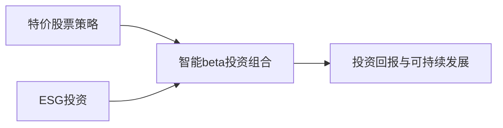

# 如何将特价股票策略融入ESG智能beta投资

> 关键词：特价股票策略、ESG、智能beta投资、投资组合、可持续发展

> 摘要：本文旨在探讨如何将特价股票策略融入ESG智能beta投资。首先介绍了相关背景，包括目的范围、预期读者等。接着阐述了特价股票策略、ESG和智能beta投资的核心概念及联系。详细讲解了核心算法原理和具体操作步骤，并给出数学模型和公式。通过项目实战展示了代码实现和分析。还探讨了实际应用场景，推荐了相关工具和资源。最后总结未来发展趋势与挑战，提供常见问题解答和参考资料，帮助投资者在追求财务回报的同时，兼顾环境、社会和治理因素，实现可持续投资目标。

## 1. 背景介绍 
### 1.1 目的和范围
在当今的金融市场中，投资者越来越关注可持续发展和社会责任，ESG（环境、社会和治理）投资理念逐渐兴起。同时，特价股票策略作为一种传统的投资策略，旨在寻找被市场低估的股票以获取超额收益。本文章的目的在于探讨如何将特价股票策略与ESG智能beta投资相结合，在实现可持续投资的同时，提高投资组合的收益。

文章的范围涵盖了特价股票策略、ESG投资、智能beta投资的基本概念和原理，以及如何将三者有机结合的具体方法和步骤。同时，通过实际案例和代码实现，展示了这种结合在实际投资中的应用。

### 1.2 预期读者
本文预期读者包括金融投资者、投资顾问、金融分析师、研究可持续投资的学者以及对金融科技和投资策略感兴趣的技术人员。对于投资者来说，希望通过本文了解如何在投资决策中更好地融入ESG因素和特价股票策略，实现投资组合的优化。对于研究人员和技术人员，本文提供了相关的理论基础和技术实现细节，有助于他们进一步深入研究和开发相关的投资模型和工具。

### 1.3 文档结构概述
本文将按照以下结构进行阐述：首先介绍相关的背景知识，包括目的范围、预期读者等；接着详细讲解特价股票策略、ESG和智能beta投资的核心概念及它们之间的联系；然后阐述将特价股票策略融入ESG智能beta投资的核心算法原理和具体操作步骤，并给出相应的数学模型和公式；通过项目实战展示代码实现和详细分析；探讨实际应用场景；推荐相关的工具和资源；最后总结未来发展趋势与挑战，提供常见问题解答和参考资料。

### 1.4 术语表
#### 1.4.1 核心术语定义
- **特价股票策略**：一种投资策略，通过分析股票的基本面和市场价格，寻找被市场低估的股票进行投资，期望在股票价格回归其内在价值时获得超额收益。
- **ESG**：即环境（Environment）、社会（Social）和治理（Governance）的缩写，是一种关注企业在环境保护、社会责任和公司治理方面表现的投资理念。
- **智能beta投资**：一种介于主动投资和被动投资之间的投资策略，通过对传统市场指数进行优化，选取具有特定因子的股票构建投资组合，以获取超越市场平均水平的收益。

#### 1.4.2 相关概念解释
- **可持续投资**：一种综合考虑经济、环境和社会因素的投资方式，旨在实现长期的财务回报和社会可持续发展的双重目标。
- **因子投资**：基于股票的某些特定特征（如价值、成长、动量等）进行投资的策略，通过选取具有这些特征的股票构建投资组合，以获取超额收益。

#### 1.4.3 缩略词列表
- **ESG**：环境、社会和治理（Environment, Social, Governance）
- **ETF**：交易型开放式指数基金（Exchange Traded Fund）

## 2. 核心概念与联系 

### 2.1 特价股票策略原理
特价股票策略的核心思想是基于价值投资理论，认为市场有时会对股票的价格产生错误的定价，导致某些股票的价格低于其内在价值。投资者通过对股票的财务报表、行业前景等基本面因素进行分析，寻找这些被低估的股票。例如，一个公司的资产负债表显示其拥有大量的现金和优质资产，但市场由于短期的负面消息而低估了该公司的股票价格，此时就可能是一个投资机会。

### 2.2 ESG投资原理
ESG投资关注企业在环境、社会和治理方面的表现。从环境角度来看，企业的可持续发展能力、资源利用效率等是重要的考量因素；在社会方面，企业的员工福利、社区关系、供应链管理等都是评估的内容；治理方面则涉及企业的董事会结构、内部控制、信息披露等。投资者认为，具有良好ESG表现的企业更有可能在长期内实现可持续发展，降低风险，从而带来更好的财务回报。

### 2.3 智能beta投资原理
智能beta投资是对传统市场指数的优化。传统的市场指数通常是按照市值加权来构建的，而智能beta投资则根据特定的因子（如价值、成长、动量等）对股票进行筛选和加权。例如，价值因子智能beta投资会选取市盈率、市净率等较低的股票，认为这些股票被市场低估，具有更高的投资价值。通过这种方式，智能beta投资试图在控制风险的同时，获取超越市场平均水平的收益。

### 2.4 三者之间的联系
特价股票策略和ESG投资可以相互补充。特价股票策略关注股票的价格和基本面，而ESG投资关注企业的可持续发展能力和社会责任。将两者结合起来，可以在寻找被低估股票的同时，确保投资的企业具有良好的ESG表现，降低投资风险。智能beta投资则为这种结合提供了一种有效的实现方式，通过选取具有特价股票特征和良好ESG表现的股票构建投资组合，实现投资策略的优化。

### 2.5 文本示意图
特价股票策略、ESG投资和智能beta投资的关系可以用以下示意图表示：

特价股票策略关注股票的价值低估，通过基本面分析寻找投资机会。ESG投资关注企业的环境、社会和治理表现，评估企业的可持续发展能力。智能beta投资则是一种投资方法，将特价股票策略和ESG投资的理念融入其中，通过选取具有特定因子的股票构建投资组合，实现投资目标。

### 2.6 Mermaid流程图


## 3. 核心算法原理 & 具体操作步骤 

### 3.1 核心算法原理
将特价股票策略融入ESG智能beta投资的核心算法可以分为以下几个步骤：

1. **数据收集**：收集股票的基本面数据、市场价格数据以及企业的ESG评级数据。
2. **特价股票筛选**：根据基本面数据，如市盈率、市净率等，筛选出被低估的股票。
3. **ESG筛选**：根据企业的ESG评级数据，筛选出具有良好ESG表现的股票。
4. **因子加权**：根据智能beta投资的因子（如价值、成长、动量等）对筛选出的股票进行加权，构建投资组合。

### 3.2 具体操作步骤

#### 3.2.1 数据收集
可以使用金融数据提供商（如Bloomberg、Wind等）提供的API接口来收集股票的基本面数据、市场价格数据和ESG评级数据。以下是一个使用Python的示例代码：

```python
import pandas as pd
import requests

# 定义API接口地址
api_url = 'https://example.com/api/stock_data'

# 定义请求参数
params = {
    'tickers': ['AAPL', 'GOOG', 'MSFT'],
    'start_date': '2020-01-01',
    'end_date': '2023-01-01',
    'data_type': 'fundamentals,price,esg'
}

# 发送请求
response = requests.get(api_url, params=params)

# 解析响应数据
data = response.json()

# 将数据转换为DataFrame格式
df = pd.DataFrame(data)
```

#### 3.2.2 特价股票筛选
根据市盈率（PE）和市净率（PB）等指标筛选被低估的股票。以下是一个示例代码：

```python
# 筛选市盈率低于10且市净率低于1的股票
undervalued_stocks = df[(df['PE'] < 10) & (df['PB'] < 1)]
```

#### 3.2.3 ESG筛选
根据ESG评级筛选出具有良好ESG表现的股票。假设ESG评级范围为1-10，评级越高表示ESG表现越好。以下是一个示例代码：

```python
# 筛选ESG评级大于7的股票
esg_stocks = undervalued_stocks[undervalued_stocks['ESG_Rating'] > 7]
```

#### 3.2.4 因子加权
根据智能beta投资的因子对筛选出的股票进行加权，构建投资组合。以下是一个根据价值因子（市盈率的倒数）进行加权的示例代码：

```python
# 计算价值因子（市盈率的倒数）
esg_stocks['Value_Factor'] = 1 / esg_stocks['PE']

# 计算因子权重
total_value_factor = esg_stocks['Value_Factor'].sum()
esg_stocks['Weight'] = esg_stocks['Value_Factor'] / total_value_factor

# 构建投资组合
portfolio = esg_stocks[['Ticker', 'Weight']]
```

## 4. 数学模型和公式 & 详细讲解 & 举例说明 

### 4.1 数学模型
将特价股票策略融入ESG智能beta投资的数学模型可以表示为：

设 $S$ 为所有股票的集合，$S_{uv}$ 为被低估的股票集合，$S_{esg}$ 为具有良好ESG表现的股票集合，$S_{p}$ 为最终的投资组合股票集合。

则有：

$$S_{uv}=\{s\in S|PE(s)<\theta_{pe}\text{ and }PB(s)<\theta_{pb}\}$$

其中，$PE(s)$ 表示股票 $s$ 的市盈率，$PB(s)$ 表示股票 $s$ 的市净率，$\theta_{pe}$ 和 $\theta_{pb}$ 分别为市盈率和市净率的阈值。

$$S_{esg}=\{s\in S_{uv}|ESG(s)>\theta_{esg}\}$$

其中，$ESG(s)$ 表示股票 $s$ 的ESG评级，$\theta_{esg}$ 为ESG评级的阈值。

投资组合的权重 $w_i$ 可以根据因子 $F_i$ 计算：

$$w_i=\frac{F_i}{\sum_{j=1}^{n}F_j}$$

其中，$n$ 为投资组合中股票的数量，$F_i$ 为第 $i$ 只股票的因子值。

### 4.2 详细讲解
上述数学模型首先通过市盈率和市净率筛选出被低估的股票集合 $S_{uv}$，然后在 $S_{uv}$ 中根据ESG评级筛选出具有良好ESG表现的股票集合 $S_{esg}$。最后，根据因子 $F_i$ 计算每只股票在投资组合中的权重 $w_i$，构建最终的投资组合 $S_{p}$。

### 4.3 举例说明
假设我们有10只股票，其市盈率、市净率和ESG评级如下表所示：

| 股票代码 | 市盈率 | 市净率 | ESG评级 |
|---|---|---|---|
| A | 8 | 0.8 | 8 |
| B | 12 | 1.2 | 6 |
| C | 6 | 0.6 | 9 |
| D | 15 | 1.5 | 5 |
| E | 9 | 0.9 | 7 |
| F | 11 | 1.1 | 6 |
| G | 7 | 0.7 | 8 |
| H | 13 | 1.3 | 5 |
| I | 5 | 0.5 | 9 |
| J | 10 | 1.0 | 6 |

设 $\theta_{pe}=10$，$\theta_{pb}=1$，$\theta_{esg}=7$。

首先筛选被低估的股票集合 $S_{uv}$：

$S_{uv}=\{A, C, E, G, I\}$

然后筛选具有良好ESG表现的股票集合 $S_{esg}$：

$S_{esg}=\{A, C, E, G, I\}$

假设我们根据价值因子（市盈率的倒数）进行加权，计算每只股票的价值因子和权重：

| 股票代码 | 市盈率 | 价值因子 | 权重 |
|---|---|---|---|
| A | 8 | 0.125 | 0.125 / (0.125 + 0.167 + 0.111 + 0.143 + 0.2) = 0.15 |
| C | 6 | 0.167 | 0.167 / (0.125 + 0.167 + 0.111 + 0.143 + 0.2) = 0.2 |
| E | 9 | 0.111 | 0.111 / (0.125 + 0.167 + 0.111 + 0.143 + 0.2) = 0.13 |
| G | 7 | 0.143 | 0.143 / (0.125 + 0.167 + 0.111 + 0.143 + 0.2) = 0.17 |
| I | 5 | 0.2 | 0.2 / (0.125 + 0.167 + 0.111 + 0.143 + 0.2) = 0.24 |

最终的投资组合为：

| 股票代码 | 权重 |
|---|---|
| A | 0.15 |
| C | 0.2 |
| E | 0.13 |
| G | 0.17 |
| I | 0.24 |

## 5. 项目实战：代码实际案例和详细解释说明 

### 5.1  开发环境搭建
为了实现将特价股票策略融入ESG智能beta投资的项目，我们需要搭建以下开发环境：

1. **Python环境**：建议使用Python 3.7及以上版本。
2. **开发工具**：可以使用PyCharm、Jupyter Notebook等开发工具。
3. **第三方库**：需要安装pandas、requests、numpy等第三方库。可以使用以下命令进行安装：

```sh
pip install pandas requests numpy
```

### 5.2  源代码详细实现和代码解读
以下是一个完整的Python代码示例，实现了将特价股票策略融入ESG智能beta投资的过程：

```python
import pandas as pd
import requests
import numpy as np

# 定义API接口地址
api_url = 'https://example.com/api/stock_data'

# 定义请求参数
params = {
    'tickers': ['AAPL', 'GOOG', 'MSFT', 'AMZN', 'FB'],
    'start_date': '2020-01-01',
    'end_date': '2023-01-01',
    'data_type': 'fundamentals,price,esg'
}

# 发送请求
response = requests.get(api_url, params=params)

# 解析响应数据
data = response.json()

# 将数据转换为DataFrame格式
df = pd.DataFrame(data)

# 筛选市盈率低于10且市净率低于1的股票
undervalued_stocks = df[(df['PE'] < 10) & (df['PB'] < 1)]

# 筛选ESG评级大于7的股票
esg_stocks = undervalued_stocks[undervalued_stocks['ESG_Rating'] > 7]

# 计算价值因子（市盈率的倒数）
esg_stocks['Value_Factor'] = 1 / esg_stocks['PE']

# 计算因子权重
total_value_factor = esg_stocks['Value_Factor'].sum()
esg_stocks['Weight'] = esg_stocks['Value_Factor'] / total_value_factor

# 构建投资组合
portfolio = esg_stocks[['Ticker', 'Weight']]

print(portfolio)
```

### 5.3  代码解读与分析
1. **数据收集**：使用`requests`库发送HTTP请求，从API接口获取股票的基本面数据、市场价格数据和ESG评级数据。然后使用`pandas`库将数据转换为DataFrame格式，方便后续处理。
2. **特价股票筛选**：通过筛选市盈率低于10且市净率低于1的股票，找出被低估的股票。
3. **ESG筛选**：在被低估的股票中，筛选出ESG评级大于7的股票，确保投资的股票具有良好的ESG表现。
4. **因子加权**：计算每只股票的价值因子（市盈率的倒数），并根据价值因子计算每只股票在投资组合中的权重。
5. **投资组合构建**：选择股票代码和权重两列，构建最终的投资组合。

## 6. 实际应用场景 
### 6.1 个人投资者
对于个人投资者来说，将特价股票策略融入ESG智能beta投资可以帮助他们在追求财务回报的同时，关注企业的社会责任和可持续发展。例如，一个注重环保的投资者可以通过这种投资策略，选择那些在环境方面表现良好且被低估的股票，构建自己的投资组合。这样不仅可以实现资产的增值，还可以为环保事业做出贡献。

### 6.2 机构投资者
机构投资者（如养老基金、保险公司等）通常管理着大量的资金，需要在控制风险的同时，实现长期的稳定回报。将特价股票策略融入ESG智能beta投资可以帮助机构投资者优化投资组合，降低风险。例如，养老基金可以选择那些具有良好ESG表现和被低估的股票，以确保投资的安全性和可持续性。

### 6.3 金融机构
金融机构（如银行、证券公司等）可以将这种投资策略作为一种创新的金融产品推向市场。例如，银行可以发行基于ESG智能beta投资的理财产品，吸引那些关注可持续发展的客户。证券公司可以为客户提供相关的投资咨询服务，帮助客户构建符合其投资目标的ESG智能beta投资组合。

## 7. 工具和资源推荐
### 7.1 学习资源推荐
#### 7.1.1 书籍推荐
- 《价值投资：从格雷厄姆到巴菲特》：这本书介绍了价值投资的基本原理和方法，对于理解特价股票策略有很大的帮助。
- 《ESG投资：理念、方法与实践》：全面介绍了ESG投资的理念、方法和实践案例，是学习ESG投资的重要参考书籍。
- 《聪明的投资者》：经典的投资著作，由本杰明·格雷厄姆所著，对于投资者树立正确的投资理念和方法具有重要的指导意义。

#### 7.1.2 在线课程
- Coursera上的“投资学原理”课程：系统介绍了投资学的基本原理和方法，包括股票投资、债券投资、投资组合理论等。
- edX上的“ESG投资与可持续金融”课程：专门讲解ESG投资的相关知识和实践经验。

#### 7.1.3 技术博客和网站
- Seeking Alpha：提供股票分析、投资策略和市场评论等内容，是投资者获取投资信息和观点的重要平台。
- ESG Investor：专注于ESG投资领域的新闻、研究和分析，为投资者提供最新的ESG投资动态和趋势。

### 7.2 开发工具框架推荐
#### 7.2.1 IDE和编辑器
- PyCharm：功能强大的Python集成开发环境，提供代码编辑、调试、版本控制等功能，适合专业的Python开发人员。
- Jupyter Notebook：交互式的开发环境，适合进行数据分析和模型开发，方便代码的展示和分享。

#### 7.2.2 调试和性能分析工具
- PDB：Python自带的调试工具，可以帮助开发人员定位代码中的错误。
- cProfile：Python的性能分析工具，可以分析代码的运行时间和资源消耗，帮助开发人员优化代码性能。

#### 7.2.3 相关框架和库
- Pandas：强大的数据分析库，提供数据结构和数据处理功能，方便进行数据清洗、分析和可视化。
- Numpy：Python的数值计算库，提供高效的数组操作和数学函数，用于实现投资模型和算法。
- Scikit-learn：机器学习库，提供各种机器学习算法和工具，可用于投资组合优化和风险分析。

### 7.3 相关论文著作推荐
#### 7.3.1 经典论文
- “The Capital Asset Pricing Model: Theory and Evidence”：介绍了资本资产定价模型（CAPM）的理论和实证研究，是投资学领域的经典论文。
- “ESG and Financial Performance: Aggregated Evidence from More than 2000 Empirical Studies”：对ESG与财务绩效之间的关系进行了综合分析，为ESG投资提供了理论支持。

#### 7.3.2 最新研究成果
- 关注顶级金融期刊（如Journal of Finance、Review of Financial Studies等）上的最新研究论文，了解ESG投资和特价股票策略的最新研究进展。

#### 7.3.3 应用案例分析
- 可以参考一些知名投资机构（如BlackRock、Vanguard等）的研究报告和案例分析，了解他们在ESG投资和特价股票策略方面的实践经验和应用案例。

## 8. 总结：未来发展趋势与挑战
### 8.1 未来发展趋势
- **ESG投资的普及**：随着投资者对可持续发展的关注度不断提高，ESG投资将越来越普及。将特价股票策略融入ESG智能beta投资将成为一种趋势，投资者将更加注重企业的ESG表现和内在价值。
- **科技的应用**：金融科技的发展将为ESG智能beta投资提供更多的工具和方法。例如，人工智能和机器学习技术可以用于数据分析和投资模型的优化，提高投资决策的准确性和效率。
- **监管的加强**：政府和监管机构将加强对ESG投资的监管，推动企业提高ESG信息披露的质量和透明度。这将为投资者提供更多的信息，促进ESG智能beta投资的健康发展。

### 8.2 挑战
- **数据质量和可用性**：ESG数据的质量和可用性是一个挑战。目前，ESG数据的标准和定义还不统一，数据的准确性和完整性也存在问题。这给投资者进行ESG分析和投资决策带来了困难。
- **投资策略的有效性**：将特价股票策略融入ESG智能beta投资的有效性还需要进一步验证。虽然理论上这种投资策略可以在实现可持续投资的同时，提高投资组合的收益，但在实际应用中，可能会受到市场环境、行业因素等多种因素的影响。
- **投资者教育**：投资者对ESG投资和特价股票策略的认识和理解还不够深入。需要加强投资者教育，提高投资者的ESG意识和投资能力，促进ESG智能beta投资的发展。

## 9. 附录：常见问题与解答
### 9.1 什么是特价股票策略？
特价股票策略是一种投资策略，通过分析股票的基本面和市场价格，寻找被市场低估的股票进行投资，期望在股票价格回归其内在价值时获得超额收益。

### 9.2 什么是ESG投资？
ESG投资是一种关注企业在环境、社会和治理方面表现的投资理念。投资者认为，具有良好ESG表现的企业更有可能在长期内实现可持续发展，降低风险，从而带来更好的财务回报。

### 9.3 什么是智能beta投资？
智能beta投资是一种介于主动投资和被动投资之间的投资策略，通过对传统市场指数进行优化，选取具有特定因子的股票构建投资组合，以获取超越市场平均水平的收益。

### 9.4 如何将特价股票策略融入ESG智能beta投资？
可以通过以下步骤将特价股票策略融入ESG智能beta投资：首先收集股票的基本面数据、市场价格数据和ESG评级数据；然后根据基本面数据筛选出被低估的股票；接着根据ESG评级筛选出具有良好ESG表现的股票；最后根据智能beta投资的因子对筛选出的股票进行加权，构建投资组合。

### 9.5 ESG投资和传统投资有什么区别？
ESG投资除了关注企业的财务指标外，还关注企业在环境、社会和治理方面的表现。传统投资主要关注企业的财务指标和市场表现。ESG投资更注重企业的可持续发展能力和社会责任，旨在实现长期的财务回报和社会可持续发展的双重目标。

## 10. 扩展阅读 & 参考资料
1. 《金融市场与金融机构基础》，Frank J. Fabozzi等著
2. 《可持续投资：ESG投资的理论与实践》，相关研究报告
3. Bloomberg、Wind等金融数据提供商的官方文档
4. Seeking Alpha、ESG Investor等技术博客和网站的相关文章
5. Journal of Finance、Review of Financial Studies等顶级金融期刊上的相关论文