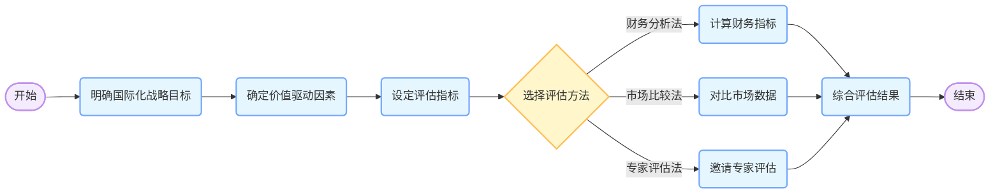

# 如何评估企业的国际化战略价值

> 关键词：企业国际化、战略价值评估、国际化战略、价值评估指标、评估方法

> 摘要：本文旨在深入探讨如何评估企业的国际化战略价值。随着全球经济一体化的发展，越来越多的企业选择实施国际化战略，但如何准确衡量这一战略的价值是企业面临的重要问题。文章首先介绍了评估企业国际化战略价值的背景信息，包括目的、预期读者、文档结构和相关术语。接着阐述了核心概念与联系，通过文本示意图和 Mermaid 流程图进行展示。详细讲解了核心算法原理和具体操作步骤，运用 Python 源代码进行说明。还给出了数学模型和公式，并举例进行详细解释。通过项目实战案例，展示了开发环境搭建、源代码实现与解读。分析了实际应用场景，推荐了相关的工具和资源。最后总结了未来发展趋势与挑战，提供了常见问题解答和扩展阅读参考资料，帮助企业全面、科学地评估国际化战略价值。

## 1. 背景介绍 
### 1.1 目的和范围
在当今全球化的商业环境中，企业的国际化战略已成为众多企业追求增长和竞争优势的重要途径。然而，企业在实施国际化战略的过程中投入了大量的资源，包括资金、人力、物力等，因此准确评估国际化战略的价值对于企业的决策和资源配置至关重要。本文章的目的在于提供一套全面、系统的方法和框架，帮助企业评估其国际化战略的价值。范围涵盖了从国际化战略的基本概念到具体的评估指标、方法和实际应用案例，旨在为企业的管理者、战略规划者以及相关研究人员提供有价值的参考。

### 1.2 预期读者
本文的预期读者主要包括企业的高层管理者、战略规划部门的工作人员、市场营销人员、财务管理人员以及对企业国际化战略和价值评估感兴趣的研究人员和学者。对于企业管理者来说，通过阅读本文可以更好地理解如何评估国际化战略的价值，从而做出更明智的战略决策；对于研究人员和学者而言，本文提供了一个深入研究企业国际化战略价值评估的理论和实践基础。

### 1.3 文档结构概述
本文将按照以下结构进行阐述：首先介绍评估企业国际化战略价值的背景信息，包括目的、预期读者、文档结构和相关术语；接着阐述核心概念与联系，通过文本示意图和 Mermaid 流程图进行展示；详细讲解核心算法原理和具体操作步骤，运用 Python 源代码进行说明；给出数学模型和公式，并举例进行详细解释；通过项目实战案例，展示开发环境搭建、源代码实现与解读；分析实际应用场景，推荐相关的工具和资源；最后总结未来发展趋势与挑战，提供常见问题解答和扩展阅读参考资料。

### 1.4 术语表
#### 1.4.1 核心术语定义
- **企业国际化战略**：指企业为了实现自身的发展目标，将业务拓展到国际市场，参与国际竞争的一系列决策和行动的总和。
- **国际化战略价值**：指企业实施国际化战略所带来的各种收益和效益，包括经济价值、战略价值、品牌价值等。
- **价值评估**：指运用一定的方法和指标，对企业的国际化战略价值进行量化和分析的过程。

#### 1.4.2 相关概念解释
- **经济价值**：主要体现在企业的财务指标上，如销售额、利润、资产回报率等，反映了企业实施国际化战略所带来的直接经济收益。
- **战略价值**：包括市场份额的扩大、资源的获取、技术的提升、竞争力的增强等，对企业的长期发展具有重要意义。
- **品牌价值**：指企业品牌在国际市场上的知名度、美誉度和忠诚度，是企业国际化战略的重要无形资产。

#### 1.4.3 缩略词列表
- **ROI**：Return on Investment，投资回报率
- **NPV**：Net Present Value，净现值
- **IRR**：Internal Rate of Return，内部收益率

## 2. 核心概念与联系 

### 核心概念原理
企业的国际化战略价值评估涉及多个方面的因素，这些因素相互关联、相互影响。从战略层面来看，企业的国际化战略是基于自身的资源和能力，结合国际市场的机会和威胁制定的。其价值的实现依赖于战略的有效实施和执行。从经济层面来看，国际化战略的价值体现在企业的财务绩效上，如销售收入的增加、成本的降低、利润的提升等。从市场层面来看，国际化战略有助于企业扩大市场份额，提高品牌知名度和美誉度，增强市场竞争力。

### 架构的文本示意图
企业国际化战略价值评估架构主要包括以下几个层次：
- **战略目标层**：明确企业实施国际化战略的目标，如市场扩张、资源获取、技术创新等。
- **价值驱动因素层**：包括市场因素（如市场规模、市场增长速度、市场份额等）、资源因素（如资金、人力、技术等）、竞争因素（如竞争对手的实力、竞争策略等）。
- **评估指标层**：根据价值驱动因素，设定具体的评估指标，如财务指标（销售额、利润、资产回报率等）、市场指标（市场份额、品牌知名度等）、创新指标（研发投入、专利数量等）。
- **评估方法层**：选择合适的评估方法，如财务分析法、市场比较法、专家评估法等。

### Mermaid 流程图


## 3. 核心算法原理 & 具体操作步骤 

### 核心算法原理
在评估企业国际化战略价值时，常用的算法原理包括财务分析法、市场比较法和专家评估法。

#### 财务分析法
财务分析法主要基于企业的财务数据，通过计算各种财务指标来评估国际化战略的价值。常用的财务指标包括投资回报率（ROI）、净现值（NPV）和内部收益率（IRR）等。

- **投资回报率（ROI）**：反映了企业投资的收益水平，计算公式为：
  $$ROI = \frac{净利润}{投资成本} \times 100\%$$

- **净现值（NPV）**：考虑了资金的时间价值，将未来的现金流量折现到当前时刻，计算公式为：
  $$NPV = \sum_{t=0}^{n} \frac{CF_t}{(1 + r)^t}$$
  其中，$CF_t$ 表示第 $t$ 期的现金流量，$r$ 表示折现率，$n$ 表示项目的寿命期。

- **内部收益率（IRR）**：是使项目净现值为零的折现率，通过求解以下方程得到：
  $$\sum_{t=0}^{n} \frac{CF_t}{(1 + IRR)^t} = 0$$

#### 市场比较法
市场比较法是通过与同行业的其他企业进行比较，来评估企业国际化战略的价值。可以比较的指标包括市场份额、销售额增长率、利润率等。

#### 专家评估法
专家评估法是邀请相关领域的专家，根据他们的经验和专业知识对企业国际化战略的价值进行评估。专家可以从战略、市场、技术等多个方面进行综合评价。

### 具体操作步骤

#### 财务分析法的 Python 实现
```python
import numpy as np

# 计算投资回报率
def calculate_roi(net_profit, investment_cost):
    return (net_profit / investment_cost) * 100

# 计算净现值
def calculate_npv(cash_flows, discount_rate):
    npv = 0
    for t in range(len(cash_flows)):
        npv += cash_flows[t] / (1 + discount_rate) ** t
    return npv

# 计算内部收益率
def calculate_irr(cash_flows):
    return np.irr(cash_flows)

# 示例数据
net_profit = 100000
investment_cost = 500000
cash_flows = [-500000, 100000, 120000, 150000, 180000, 200000]
discount_rate = 0.1

# 计算并输出结果
roi = calculate_roi(net_profit, investment_cost)
npv = calculate_npv(cash_flows, discount_rate)
irr = calculate_irr(cash_flows)

print(f"投资回报率: {roi}%")
print(f"净现值: {npv}")
print(f"内部收益率: {irr}")
```

#### 市场比较法的操作步骤
1. 确定同行业的可比企业。
2. 收集可比企业的相关市场数据，如市场份额、销售额增长率、利润率等。
3. 将企业自身的数据与可比企业的数据进行对比分析，找出优势和差距。
4. 根据对比结果，评估企业国际化战略的价值。

#### 专家评估法的操作步骤
1. 确定专家团队，邀请具有丰富经验和专业知识的专家。
2. 向专家提供企业国际化战略的相关资料，包括战略目标、实施计划、市场分析等。
3. 组织专家进行评估，采用问卷调查、访谈、研讨会等方式收集专家的意见和建议。
4. 对专家的评估结果进行汇总和分析，得出综合评估结论。

## 4. 数学模型和公式 & 详细讲解 & 举例说明 

### 财务指标的数学模型和公式
#### 投资回报率（ROI）
投资回报率是衡量企业投资收益水平的重要指标，它反映了企业每投入一元资金所能获得的利润。其计算公式为：
$$ROI = \frac{净利润}{投资成本} \times 100\%$$

**详细讲解**：净利润是指企业在一定时期内的总收入减去总成本和税费后的剩余金额。投资成本是指企业为实施国际化战略所投入的全部资金，包括固定资产投资、流动资金投资等。ROI 越高，说明企业的投资收益越好。

**举例说明**：某企业实施国际化战略，投资成本为 500 万元，在一年后获得净利润 100 万元。则该企业的投资回报率为：
$$ROI = \frac{100}{500} \times 100\% = 20\%$$

#### 净现值（NPV）
净现值是考虑了资金时间价值的投资决策指标，它通过将未来的现金流量折现到当前时刻，来判断项目是否值得投资。其计算公式为：
$$NPV = \sum_{t=0}^{n} \frac{CF_t}{(1 + r)^t}$$
其中，$CF_t$ 表示第 $t$ 期的现金流量，$r$ 表示折现率，$n$ 表示项目的寿命期。

**详细讲解**：现金流量是指企业在项目实施过程中所产生的现金流入和现金流出的净额。折现率是反映资金时间价值和风险水平的指标，通常可以采用企业的加权平均资本成本（WACC）。如果 $NPV > 0$，说明项目的投资收益超过了资金成本，项目值得投资；如果 $NPV < 0$，说明项目的投资收益低于资金成本，项目不值得投资。

**举例说明**：某企业实施国际化战略，预计未来 5 年的现金流量分别为 -500 万元、100 万元、120 万元、150 万元、180 万元、200 万元，折现率为 10%。则该项目的净现值为：
$$NPV = -500 + \frac{100}{(1 + 0.1)^1} + \frac{120}{(1 + 0.1)^2} + \frac{150}{(1 + 0.1)^3} + \frac{180}{(1 + 0.1)^4} + \frac{200}{(1 + 0.1)^5} \approx 32.56$$（万元）

#### 内部收益率（IRR）
内部收益率是使项目净现值为零的折现率，它反映了项目的实际盈利能力。其计算公式为：
$$\sum_{t=0}^{n} \frac{CF_t}{(1 + IRR)^t} = 0$$

**详细讲解**：IRR 是一个相对指标，它不受外部折现率的影响，只与项目的现金流量有关。如果 IRR 大于企业的加权平均资本成本（WACC），说明项目的盈利能力超过了资金成本，项目值得投资；如果 IRR 小于 WACC，说明项目的盈利能力低于资金成本，项目不值得投资。

**举例说明**：仍以上述企业的国际化战略项目为例，通过 Python 代码计算得到内部收益率约为 12.5%。如果该企业的加权平均资本成本为 10%，由于 12.5% > 10%，说明该项目值得投资。

### 市场份额的数学模型和公式
市场份额是指企业的销售额在整个市场销售额中所占的比例，它反映了企业在市场中的竞争地位。其计算公式为：
$$市场份额 = \frac{企业销售额}{市场总销售额} \times 100\%$$

**详细讲解**：企业销售额是指企业在一定时期内的产品或服务的销售收入。市场总销售额是指整个市场中所有企业的产品或服务的销售收入总和。市场份额越高，说明企业在市场中的竞争力越强。

**举例说明**：某企业在国际市场上的销售额为 2000 万元，而该市场的总销售额为 1 亿元。则该企业的市场份额为：
$$市场份额 = \frac{2000}{10000} \times 100\% = 20\%$$

## 5. 项目实战：代码实际案例和详细解释说明 

### 5.1  开发环境搭建
本项目实战使用 Python 语言进行开发，开发环境搭建步骤如下：

#### 安装 Python
可以从 Python 官方网站（https://www.python.org/downloads/）下载适合自己操作系统的 Python 安装包，按照安装向导进行安装。

#### 安装必要的库
本项目需要使用 `numpy` 库来进行数值计算，可以使用以下命令进行安装：
```sh
pip install numpy
```

### 5.2  源代码详细实现和代码解读
以下是一个完整的 Python 代码示例，用于评估企业国际化战略的财务价值：

```python
import numpy as np

# 计算投资回报率
def calculate_roi(net_profit, investment_cost):
    """
    计算投资回报率
    :param net_profit: 净利润
    :param investment_cost: 投资成本
    :return: 投资回报率
    """
    return (net_profit / investment_cost) * 100

# 计算净现值
def calculate_npv(cash_flows, discount_rate):
    """
    计算净现值
    :param cash_flows: 现金流量列表
    :param discount_rate: 折现率
    :return: 净现值
    """
    npv = 0
    for t in range(len(cash_flows)):
        npv += cash_flows[t] / (1 + discount_rate) ** t
    return npv

# 计算内部收益率
def calculate_irr(cash_flows):
    """
    计算内部收益率
    :param cash_flows: 现金流量列表
    :return: 内部收益率
    """
    return np.irr(cash_flows)

# 主函数
def main():
    # 示例数据
    net_profit = 100000
    investment_cost = 500000
    cash_flows = [-500000, 100000, 120000, 150000, 180000, 200000]
    discount_rate = 0.1

    # 计算并输出结果
    roi = calculate_roi(net_profit, investment_cost)
    npv = calculate_npv(cash_flows, discount_rate)
    irr = calculate_irr(cash_flows)

    print(f"投资回报率: {roi}%")
    print(f"净现值: {npv}")
    print(f"内部收益率: {irr}")

if __name__ == "__main__":
    main()
```

### 5.3  代码解读与分析
#### 函数功能分析
- `calculate_roi` 函数：用于计算投资回报率，接受净利润和投资成本作为输入参数，返回投资回报率的百分比。
- `calculate_npv` 函数：用于计算净现值，接受现金流量列表和折现率作为输入参数，通过循环计算每一期现金流量的折现值并累加，返回净现值。
- `calculate_irr` 函数：用于计算内部收益率，使用 `numpy` 库的 `irr` 函数，接受现金流量列表作为输入参数，返回内部收益率。
- `main` 函数：主函数，定义了示例数据，调用上述三个函数计算投资回报率、净现值和内部收益率，并输出结果。

#### 代码复杂度分析
- 时间复杂度：`calculate_roi` 函数的时间复杂度为 $O(1)$，因为只进行了简单的算术运算。`calculate_npv` 函数的时间复杂度为 $O(n)$，其中 $n$ 是现金流量列表的长度，因为需要遍历现金流量列表。`calculate_irr` 函数的时间复杂度取决于 `numpy` 库中 `irr` 函数的实现，通常为 $O(n)$ 或 $O(n log n)$。
- 空间复杂度：`calculate_roi` 函数的空间复杂度为 $O(1)$，因为只使用了固定的变量。`calculate_npv` 函数的空间复杂度为 $O(1)$，因为只使用了固定的变量。`calculate_irr` 函数的空间复杂度取决于 `numpy` 库中 `irr` 函数的实现，通常为 $O(n)$。

## 6. 实际应用场景 
### 战略决策
企业在制定国际化战略时，需要评估不同战略方案的价值，以便选择最优方案。通过对国际化战略价值的评估，可以帮助企业确定是否进入某个国际市场、选择何种进入模式、如何配置资源等。例如，企业可以通过比较不同市场的市场潜力、竞争程度、投资回报率等指标，选择最有价值的市场进行进入。

### 资源配置
企业在实施国际化战略过程中，需要合理配置资源，以确保战略目标的实现。通过评估国际化战略的价值，可以帮助企业确定资源的分配方向和重点。例如，企业可以根据不同业务的净现值和内部收益率，决定在哪些业务上加大投资，在哪些业务上减少投资。

### 绩效评估
企业需要对国际化战略的实施效果进行评估，以衡量战略的价值和效益。通过对国际化战略价值的评估，可以帮助企业及时发现战略实施过程中存在的问题，调整战略方向和措施。例如，企业可以通过比较实际的投资回报率、市场份额等指标与预期指标的差异，评估战略的实施效果。

### 风险管理
企业在国际化过程中面临着各种风险，如政治风险、经济风险、市场风险等。通过评估国际化战略的价值，可以帮助企业识别和评估风险，制定相应的风险应对措施。例如，企业可以通过计算不同战略方案的净现值在不同风险情景下的变化，评估战略的风险承受能力。

## 7. 工具和资源推荐
### 7.1 学习资源推荐
#### 7.1.1 书籍推荐
- 《国际商务：环境与运作》（International Business: Environments and Operations）：本书全面介绍了国际商务的环境、战略、运作等方面的知识，是学习企业国际化战略的经典教材。
- 《竞争战略》（Competitive Strategy）：作者迈克尔·波特（Michael Porter）提出了著名的竞争战略理论，对于企业制定国际化战略和评估战略价值具有重要的指导意义。
- 《价值评估：公司价值的衡量与管理》（Valuation: Measuring and Managing the Value of Companies）：本书详细介绍了企业价值评估的方法和技术，是学习企业价值评估的权威书籍。

#### 7.1.2 在线课程
- Coursera 平台上的“International Business Strategy”课程：由知名教授授课，系统讲解了国际商务战略的理论和实践。
- edX 平台上的“Corporate Finance”课程：介绍了企业财务管理的基本原理和方法，包括投资决策、价值评估等内容。
- 中国大学 MOOC 平台上的“国际市场营销”课程：帮助学习者了解国际市场营销的策略和方法，对于企业国际化战略的实施具有重要的指导作用。

#### 7.1.3 技术博客和网站
- 麦肯锡官网（https://www.mckinsey.com/）：提供了大量关于企业战略、国际化等方面的研究报告和分析文章。
- 波士顿咨询公司官网（https://www.bcg.com/）：发布了许多关于企业竞争战略、市场趋势等方面的研究成果。
- 哈佛商业评论官网（https://hbr.org/）：是全球知名的商业管理杂志，发表了很多关于企业战略、领导力等方面的优秀文章。

### 7.2 开发工具框架推荐
#### 7.2.1 IDE和编辑器
- PyCharm：是一款专门为 Python 开发设计的集成开发环境（IDE），具有代码编辑、调试、版本控制等功能，适合开发复杂的 Python 项目。
- Visual Studio Code：是一款轻量级的代码编辑器，支持多种编程语言，通过安装插件可以实现 Python 开发的各种功能，具有便捷的代码编辑和调试功能。

#### 7.2.2 调试和性能分析工具
- pdb：是 Python 自带的调试工具，可以在代码中设置断点，逐行调试代码，帮助开发者查找和解决代码中的问题。
- cProfile：是 Python 的性能分析工具，可以分析代码的运行时间和函数调用次数，帮助开发者优化代码性能。

#### 7.2.3 相关框架和库
- numpy：是 Python 的一个科学计算库，提供了高效的数组操作和数学函数，在财务计算和数据分析中广泛应用。
- pandas：是 Python 的一个数据分析库，提供了数据结构和数据处理工具，方便进行数据的清洗、分析和可视化。

### 7.3 相关论文著作推荐
#### 7.3.1 经典论文
- Vernon, R. (1966). International investment and international trade in the product cycle. The Quarterly Journal of Economics, 80(2), 190 - 207. 该论文提出了产品生命周期理论，对于理解企业国际化的动因和模式具有重要意义。
- Dunning, J. H. (1977). Trade, location of economic activity and the multinational enterprise: A search for an eclectic approach. In The international allocation of economic activity (pp. 395 - 418). Palgrave Macmillan, London. 该论文提出了国际生产折衷理论，为企业国际化战略的选择提供了理论基础。

#### 7.3.2 最新研究成果
- 关注国际商务领域的顶级学术期刊，如《Journal of International Business Studies》《Strategic Management Journal》等，这些期刊发表了许多关于企业国际化战略和价值评估的最新研究成果。

#### 7.3.3 应用案例分析
- 许多咨询公司和研究机构会发布企业国际化的应用案例分析报告，如埃森哲、贝恩等公司的相关报告，可以帮助读者了解企业在实际中如何实施国际化战略和评估战略价值。

## 8. 总结：未来发展趋势与挑战
### 未来发展趋势
#### 数字化和智能化
随着信息技术的快速发展，数字化和智能化将成为企业国际化战略的重要趋势。企业将利用大数据、人工智能、物联网等技术，实现全球供应链的优化、市场需求的精准预测、客户服务的个性化等，提高国际化战略的效率和效果。

#### 绿色和可持续发展
在全球环保意识不断提高的背景下，绿色和可持续发展将成为企业国际化战略的重要考虑因素。企业将更加注重环境保护、社会责任和可持续发展，推出绿色产品和服务，加强与供应商和合作伙伴的可持续发展合作，提升企业的国际形象和竞争力。

#### 区域化和本地化
尽管全球化趋势仍然存在，但区域化和本地化也将成为企业国际化战略的重要方向。企业将更加注重区域市场的特点和需求，加强区域内的资源整合和协同发展。同时，企业也将更加注重本地化经营，适应当地的文化、法律和市场环境，提高市场份额和客户满意度。

### 挑战
#### 政治和政策风险
不同国家和地区的政治制度、政策法规存在差异，企业在国际化过程中面临着政治和政策风险。例如，贸易保护主义的抬头、政策的变化等都可能对企业的国际化战略产生不利影响。

#### 文化差异
不同国家和地区的文化差异较大，企业在国际化过程中需要面对文化冲突和文化融合的问题。例如，企业的管理模式、营销策略等需要适应当地的文化环境，否则可能会导致市场失败。

#### 竞争加剧
随着全球经济一体化的发展，企业面临的国际竞争日益加剧。企业需要不断提升自身的核心竞争力，才能在激烈的国际竞争中立于不败之地。

## 9. 附录：常见问题与解答
### 问题 1：如何确定合适的折现率？
解答：折现率的确定需要考虑多个因素，包括企业的加权平均资本成本（WACC）、项目的风险水平、市场利率等。一般来说，可以采用企业的 WACC 作为基准折现率，然后根据项目的风险程度进行调整。如果项目的风险较高，可以适当提高折现率；如果项目的风险较低，可以适当降低折现率。

### 问题 2：市场比较法中如何选择可比企业？
解答：选择可比企业时，需要考虑以下几个因素：行业相同或相似、规模相近、市场地位相似、财务状况相似等。可以通过行业研究报告、数据库、咨询机构等渠道获取可比企业的信息。

### 问题 3：专家评估法的结果是否可靠？
解答：专家评估法的结果具有一定的主观性，但通过合理选择专家团队、采用科学的评估方法和流程，可以提高评估结果的可靠性。在选择专家时，应选择具有丰富经验和专业知识的专家，并确保专家的独立性和客观性。在评估过程中，可以采用多次评估、小组讨论等方式，减少个体差异对评估结果的影响。

### 问题 4：如何处理国际化战略中的不确定性？
解答：国际化战略中存在许多不确定性因素，如市场需求的变化、政策法规的调整、竞争对手的策略变化等。可以采用情景分析、敏感性分析等方法来评估不确定性因素对战略价值的影响。同时，企业可以制定应急预案，及时应对不确定性事件的发生。

## 10. 扩展阅读 & 参考资料
### 扩展阅读
- 《全球供应链管理》：深入介绍了全球供应链的管理理念、方法和实践，对于企业优化全球供应链、提高国际化战略的效率具有重要的参考价值。
- 《国际品牌管理》：探讨了国际品牌的建设、传播和维护等问题，帮助企业提升品牌在国际市场上的知名度和美誉度。

### 参考资料
- 相关行业研究报告，如国际商务行业研究报告、财务分析行业研究报告等。
- 企业的年度报告、财务报表等公开资料。
- 国际商务领域的学术论文和研究成果。