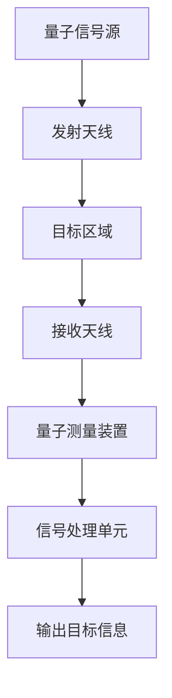

# 如何评估企业的量子雷达隐身探测技术潜力

> 关键词：量子雷达、隐身探测技术、企业潜力评估、量子信息技术、雷达技术

> 摘要：随着军事对抗和国防安全需求的不断升级，量子雷达隐身探测技术成为各国研究的焦点。对于企业而言，掌握该技术的潜力大小决定了其在未来国防科技领域的竞争力。本文旨在全面阐述如何评估企业的量子雷达隐身探测技术潜力，通过对相关背景、核心概念、算法原理、数学模型、实战案例、应用场景等多方面的分析，为评估人员提供一套科学、系统的评估方法，助力企业明确自身技术定位，推动量子雷达隐身探测技术的发展。

## 1. 背景介绍 
### 1.1 目的和范围
本评估的目的在于准确判断企业在量子雷达隐身探测技术方面的潜力，为企业自身的技术研发决策、投资者的投资决策以及行业监管部门的政策制定提供依据。评估范围涵盖企业的研发能力、技术积累、人才队伍、资金支持、市场前景等多个方面，全面考量企业在该领域的综合实力。

### 1.2 预期读者
本文预期读者包括企业的高层管理人员、技术研发人员、投资者、行业分析师以及相关政府部门的政策制定者。他们可以通过本文提供的评估方法，深入了解企业的量子雷达隐身探测技术潜力，做出合理的决策。

### 1.3 文档结构概述
本文首先介绍量子雷达隐身探测技术的背景知识，包括术语表和相关概念解释。接着阐述核心概念与联系，通过文本示意图和 Mermaid 流程图展示技术架构。然后详细讲解核心算法原理和具体操作步骤，结合 Python 源代码进行说明。之后介绍数学模型和公式，并举例说明。再通过项目实战案例，包括开发环境搭建、源代码实现和代码解读，深入剖析技术应用。随后探讨实际应用场景，推荐相关工具和资源。最后总结未来发展趋势与挑战，提供常见问题解答和扩展阅读参考资料。

### 1.4 术语表
#### 1.4.1 核心术语定义
- **量子雷达**：利用量子态作为信息载体，结合量子信息技术和传统雷达技术的新型雷达系统。它具有更高的灵敏度、抗干扰能力和目标探测精度。
- **隐身探测技术**：旨在发现采用隐身技术的目标的技术手段，通过探测目标的各种物理特征，如电磁散射、红外辐射等，来识别隐身目标。
- **量子态**：量子系统的状态，如量子比特的叠加态和纠缠态，是量子雷达信息处理的基础。
- **量子纠缠**：两个或多个量子系统之间存在的一种特殊关联，即使它们相隔很远，一个系统的状态变化也会瞬间影响另一个系统的状态。

#### 1.4.2 相关概念解释
- **量子信息技术**：基于量子力学原理发展起来的信息技术，包括量子计算、量子通信和量子传感等领域。量子雷达隐身探测技术是量子信息技术在雷达领域的应用。
- **雷达散射截面（RCS）**：衡量目标对雷达波散射能力的物理量，隐身目标通常通过特殊的外形设计和材料技术来减小 RCS。
- **信号处理**：对雷达接收到的信号进行滤波、放大、解调等处理，提取有用信息，判断目标的存在、位置和运动状态。

#### 1.4.3 缩略词列表
- **RCS**：Radar Cross Section（雷达散射截面）
- **SNR**：Signal - to - Noise Ratio（信噪比）
- **QKD**：Quantum Key Distribution（量子密钥分发）

## 2. 核心概念与联系 

### 核心概念原理
量子雷达隐身探测技术的核心在于利用量子态的独特性质来提高雷达的探测性能。传统雷达通过发射电磁波并接收目标反射的回波来探测目标，而量子雷达则利用量子态作为信息载体，如利用量子纠缠态的相关性来增强信号检测能力。

量子雷达的工作原理可以分为以下几个步骤：
1. **量子态制备**：制备特定的量子态，如纠缠态或叠加态，作为雷达信号的载体。
2. **信号发射**：将制备好的量子态发射到目标区域。
3. **目标散射**：量子信号与目标相互作用，发生散射。
4. **信号接收**：接收散射回来的量子信号。
5. **量子测量**：对接收的量子信号进行测量，提取目标信息。

### 架构的文本示意图
量子雷达隐身探测技术的架构主要包括量子信号源、发射天线、接收天线、量子测量装置和信号处理单元。量子信号源负责制备量子态，发射天线将量子信号发射出去，接收天线接收散射回来的信号，量子测量装置对信号进行测量，信号处理单元对测量结果进行分析和处理，提取目标的相关信息。

### Mermaid 流程图


## 3. 核心算法原理 & 具体操作步骤 

### 核心算法原理
量子雷达隐身探测技术中常用的算法包括量子态估计、量子信号检测和量子信息处理等。以下以量子态估计算法为例进行说明。

量子态估计的目标是通过对量子系统的测量结果来估计量子态的参数。常用的方法是最大似然估计法。假设我们对一个量子系统进行了 $N$ 次测量，得到测量结果 $x_1,x_2,\cdots,x_N$，量子态的密度矩阵为 $\rho$，测量算符为 $M_i$，则测量结果 $x_i$ 的概率为 $P(x_i|\rho)=\text{Tr}(M_i\rho)$。

最大似然估计的目标是找到一个密度矩阵 $\hat{\rho}$，使得似然函数 $L(\rho)=\prod_{i = 1}^{N}P(x_i|\rho)$ 最大。为了方便计算，通常取对数似然函数 $\ln L(\rho)=\sum_{i = 1}^{N}\ln P(x_i|\rho)$，然后通过优化算法求解 $\hat{\rho}$。

### 具体操作步骤
1. **数据采集**：对量子系统进行多次测量，记录测量结果。
2. **定义似然函数**：根据测量结果和量子态的密度矩阵，定义对数似然函数。
3. **选择优化算法**：选择合适的优化算法，如梯度下降法、牛顿法等，来求解对数似然函数的最大值。
4. **迭代求解**：通过迭代计算，不断更新密度矩阵的估计值，直到满足收敛条件。

### Python 源代码实现
```python
import numpy as np
from scipy.optimize import minimize

# 定义测量算符
M = [np.array([[1, 0], [0, 0]]), np.array([[0, 0], [0, 1]])]

# 模拟测量结果
N = 1000
measurements = np.random.choice([0, 1], N, p=[0.6, 0.4])

# 定义对数似然函数
def log_likelihood(rho):
    rho = np.array([[rho[0], rho[1] + 1j * rho[2]], [rho[1] - 1j * rho[2], 1 - rho[0]]])
    likelihood = 1
    for m in measurements:
        likelihood *= np.trace(np.dot(M[m], rho))
    return -np.log(likelihood)

# 初始猜测
initial_guess = [0.5, 0, 0]

# 优化求解
result = minimize(log_likelihood, initial_guess)

# 输出结果
estimated_rho = np.array([[result.x[0], result.x[1] + 1j * result.x[2]], [result.x[1] - 1j * result.x[2], 1 - result.x[0]]])
print("Estimated density matrix:", estimated_rho)
```

## 4. 数学模型和公式 & 详细讲解 & 举例说明 

### 数学模型
量子雷达隐身探测技术的数学模型主要基于量子力学和雷达信号处理理论。以下是一些重要的数学模型和公式。

#### 量子态的表示
量子态可以用密度矩阵 $\rho$ 来表示，对于一个两能级量子系统，密度矩阵可以表示为：
$$\rho=\begin{pmatrix}\rho_{00}&\rho_{01}\\\rho_{10}&\rho_{11}\end{pmatrix}$$
其中，$\rho_{ii}$ 表示量子态处于第 $i$ 个能级的概率，$\rho_{ij}(i\neq j)$ 表示量子态的相干项。

#### 量子测量
量子测量由一组测量算符 $\{M_i\}$ 描述，测量结果 $i$ 的概率为：
$$P(i)=\text{Tr}(M_i\rho)$$
测量后量子态变为：
$$\rho'=\frac{M_i\rho M_i^{\dagger}}{\text{Tr}(M_i\rho)}$$

#### 雷达信号处理
雷达接收到的信号可以表示为目标回波信号和噪声信号的叠加：
$$r(t)=s(t)\ast h(t)+n(t)$$
其中，$s(t)$ 是发射信号，$h(t)$ 是目标的冲激响应，$n(t)$ 是噪声信号，$\ast$ 表示卷积运算。

### 详细讲解
量子态的密度矩阵描述了量子系统的状态信息，包括概率分布和相干性。量子测量的概率公式表示了测量结果的统计特性，而测量后量子态的变化则体现了量子测量的不可逆性。雷达信号处理中的卷积运算表示了目标对发射信号的散射作用，噪声信号的存在会影响雷达的探测性能。

### 举例说明
假设一个两能级量子系统的初始密度矩阵为 $\rho=\begin{pmatrix}0.6&0.2 + 0.1j\\0.2 - 0.1j&0.4\end{pmatrix}$，测量算符为 $M_0=\begin{pmatrix}1&0\\0&0\end{pmatrix}$ 和 $M_1=\begin{pmatrix}0&0\\0&1\end{pmatrix}$。则测量结果为 $0$ 的概率为：
$$P(0)=\text{Tr}(M_0\rho)=\text{Tr}\begin{pmatrix}0.6&0.2 + 0.1j\\0&0\end{pmatrix}=0.6$$
测量结果为 $1$ 的概率为：
$$P(1)=\text{Tr}(M_1\rho)=\text{Tr}\begin{pmatrix}0&0\\0.2 - 0.1j&0.4\end{pmatrix}=0.4$$

## 5. 项目实战：代码实际案例和详细解释说明 

### 5.1  开发环境搭建
#### 硬件环境
- **计算机**：建议使用性能较高的台式机或笔记本电脑，配备多核处理器和较大的内存，以满足量子计算模拟和信号处理的需求。
- **量子计算模拟器**：可以使用开源的量子计算模拟器，如 Qiskit、Cirq 等，来模拟量子态的制备、演化和测量过程。

#### 软件环境
- **操作系统**：推荐使用 Linux 或 macOS 系统，也可以使用 Windows 系统。
- **编程语言**：Python 是量子计算和信号处理领域常用的编程语言，建议安装 Python 3.7 及以上版本。
- **开发工具**：可以使用 Jupyter Notebook 或 PyCharm 等开发工具，方便进行代码编写、调试和可视化。
- **相关库**：安装 Qiskit、NumPy、SciPy、Matplotlib 等相关库，用于量子计算模拟、数值计算和数据可视化。

### 5.2  源代码详细实现和代码解读
以下是一个简单的量子雷达信号模拟和处理的 Python 代码示例：
```python
import numpy as np
import matplotlib.pyplot as plt
from qiskit import QuantumCircuit, Aer, execute

# 定义量子雷达参数
num_qubits = 2
shots = 1000

# 制备量子态
qc = QuantumCircuit(num_qubits)
qc.h(0)
qc.cx(0, 1)
qc.measure_all()

# 模拟量子测量
backend = Aer.get_backend('qasm_simulator')
job = execute(qc, backend, shots=shots)
result = job.result()
counts = result.get_counts(qc)

# 处理测量结果
probabilities = {key: value / shots for key, value in counts.items()}

# 可视化结果
labels = list(probabilities.keys())
values = list(probabilities.values())

plt.bar(labels, values)
plt.xlabel('Measurement outcomes')
plt.ylabel('Probability')
plt.title('Quantum radar measurement results')
plt.show()
```
### 代码解读与分析
1. **量子态制备**：使用 Qiskit 库创建一个量子电路，通过 Hadamard 门和 CNOT 门制备一个纠缠态。
2. **量子测量**：对量子电路进行测量，并使用量子计算模拟器进行模拟实验，得到测量结果。
3. **结果处理**：计算每个测量结果的概率。
4. **可视化**：使用 Matplotlib 库将测量结果的概率分布可视化，方便分析和理解。

## 6. 实际应用场景 
### 军事领域
- **隐身目标探测**：量子雷达的高灵敏度和抗干扰能力使其能够更有效地探测采用隐身技术的飞机、舰艇等目标，提高国防安全能力。
- **战场态势感知**：量子雷达可以提供更准确的目标信息，帮助指挥员更好地掌握战场态势，做出合理的决策。

### 民用领域
- **航空航天**：在航空航天领域，量子雷达可以用于飞行器的导航、防撞和空间目标监测等。
- **气象监测**：量子雷达可以提高气象监测的精度，更准确地探测云层、降水等气象目标。

## 7. 工具和资源推荐
### 7.1 学习资源推荐
#### 7.1.1 书籍推荐
- 《量子力学导论》：全面介绍量子力学的基本原理和概念，是学习量子雷达隐身探测技术的基础书籍。
- 《量子信息与量子计算》：深入讲解量子信息和量子计算的理论和应用，对理解量子雷达的核心技术有很大帮助。
- 《雷达信号处理》：详细介绍雷达信号处理的原理和方法，是雷达技术领域的经典书籍。

#### 7.1.2 在线课程
- Coursera 上的“Quantum Mechanics for Scientists and Engineers”：由知名教授授课，系统讲解量子力学的基础知识。
- edX 上的“Quantum Computing Fundamentals”：介绍量子计算的基本概念和算法，适合初学者学习。
- 中国大学 MOOC 上的“雷达原理”：国内高校的优质课程，深入讲解雷达的工作原理和技术。

#### 7.1.3 技术博客和网站
- Quantum Computing Report：提供量子计算领域的最新研究成果和行业动态。
- IEEE Xplore：电气和电子工程师协会的数字图书馆，包含大量关于雷达技术和量子信息技术的学术论文。
- arXiv：预印本数据库，及时发布量子计算和雷达技术领域的最新研究论文。

### 7.2 开发工具框架推荐
#### 7.2.1 IDE和编辑器
- PyCharm：功能强大的 Python 集成开发环境，支持代码调试、自动补全和版本控制等功能。
- Jupyter Notebook：交互式的开发环境，适合进行代码编写、实验和数据可视化。

#### 7.2.2 调试和性能分析工具
- Qiskit Visualization Tools：Qiskit 提供的可视化工具，用于调试和分析量子电路。
- NumPy 和 SciPy 的性能分析工具：可以帮助优化数值计算代码的性能。

#### 7.2.3 相关框架和库
- Qiskit：开源的量子计算框架，提供量子电路设计、模拟和优化等功能。
- Cirq：Google 开发的量子计算框架，支持量子算法的实现和模拟。
- NumPy 和 SciPy：用于数值计算和科学计算的 Python 库，是量子雷达信号处理的基础工具。

### 7.3 相关论文著作推荐
#### 7.3.1 经典论文
- “Quantum Radar” by Seth Lloyd：该论文首次提出了量子雷达的概念，阐述了量子雷达的基本原理和优势。
- “Quantum Entanglement and Its Applications in Radar”：探讨了量子纠缠在雷达技术中的应用，为量子雷达的发展提供了理论基础。

#### 7.3.2 最新研究成果
- 关注 IEEE Transactions on Quantum Engineering、Physical Review A 等学术期刊上的最新研究论文，了解量子雷达隐身探测技术的前沿进展。

#### 7.3.3 应用案例分析
- 分析国内外量子雷达相关的科研项目和实际应用案例，了解量子雷达在不同场景下的应用效果和技术挑战。

## 8. 总结：未来发展趋势与挑战
### 未来发展趋势
- **技术融合**：量子雷达隐身探测技术将与人工智能、大数据等技术深度融合，提高雷达的智能化水平和数据处理能力。
- **小型化和集成化**：随着量子技术的发展，量子雷达将朝着小型化和集成化的方向发展，降低成本，提高应用的灵活性。
- **多领域应用拓展**：除了军事和民用领域，量子雷达隐身探测技术还将在海洋监测、地质勘探等领域得到更广泛的应用。

### 挑战
- **技术难题**：量子态的制备、操控和测量仍然面临着许多技术难题，如量子退相干、噪声干扰等，需要进一步研究和解决。
- **成本问题**：量子雷达的研发和制造成本较高，限制了其大规模应用，需要探索降低成本的方法和技术。
- **人才短缺**：量子雷达隐身探测技术涉及量子力学、雷达技术、信号处理等多个领域的知识，需要大量的专业人才，目前人才短缺是制约该技术发展的重要因素。

## 9. 附录：常见问题与解答
### 问题 1：量子雷达与传统雷达有什么区别？
答：量子雷达利用量子态作为信息载体，具有更高的灵敏度、抗干扰能力和目标探测精度。传统雷达则通过发射和接收电磁波来探测目标，在性能上相对较弱。

### 问题 2：量子雷达隐身探测技术的发展前景如何？
答：量子雷达隐身探测技术具有广阔的发展前景，在军事和民用领域都有重要的应用价值。随着技术的不断进步，量子雷达将成为未来雷达技术的重要发展方向。

### 问题 3：企业在发展量子雷达隐身探测技术时面临哪些挑战？
答：企业面临的挑战包括技术难题、成本问题、人才短缺等。需要加强技术研发，降低成本，培养和引进专业人才，以提高企业的技术竞争力。

## 10. 扩展阅读 & 参考资料
- Nielsen, M. A., & Chuang, I. L. (2010). Quantum Computation and Quantum Information. Cambridge University Press.
- Skolnik, M. I. (2001). Introduction to Radar Systems. McGraw - Hill.
- IEEE Transactions on Quantum Engineering.
- Physical Review A.
- Quantum Computing Report website: https://www.quantumcomputingreport.com/
- arXiv website: https://arxiv.org/