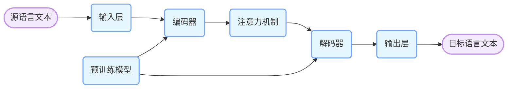

# 如何识别企业的深度学习多语言翻译技术优势

> 关键词：深度学习、多语言翻译、技术优势、企业识别、翻译质量、效率、适应性

> 摘要：在全球化的今天，多语言翻译需求日益增长，深度学习技术在多语言翻译领域展现出巨大潜力。本文旨在探讨如何识别企业的深度学习多语言翻译技术优势，通过深入剖析相关背景知识、核心概念、算法原理、数学模型、项目实战案例等方面，为读者提供全面且系统的判断方法，助力读者准确评估企业在该领域的技术实力，以便在选择翻译服务或技术合作时做出更明智的决策。

## 1. 背景介绍 
### 1.1 目的和范围
随着全球经济一体化的加速，跨国交流、贸易、文化传播等活动日益频繁，多语言翻译的需求呈现出爆发式增长。深度学习技术的兴起，为多语言翻译带来了新的突破和发展机遇。众多企业纷纷投入资源研发深度学习多语言翻译技术，然而市场上的技术水平参差不齐。本文的目的在于为读者提供一套全面、科学的方法，帮助他们识别企业在深度学习多语言翻译技术方面的优势，范围涵盖技术的各个层面，包括翻译质量、效率、适应性、创新性等。

### 1.2 预期读者
本文预期读者包括对深度学习多语言翻译技术感兴趣的普通用户，如需要选择翻译服务的个人或企业；从事自然语言处理、人工智能等相关领域的专业技术人员，希望通过了解如何识别技术优势来评估竞争对手或寻求合作机会；以及关注科技发展动态的投资者，以便在该领域做出更明智的投资决策。

### 1.3 文档结构概述
本文首先介绍相关背景知识，包括目的、预期读者和文档结构概述等内容。接着深入讲解深度学习多语言翻译的核心概念与联系，通过文本示意图和 Mermaid 流程图直观呈现其原理和架构。然后详细阐述核心算法原理及具体操作步骤，结合 Python 源代码进行说明。随后介绍数学模型和公式，并通过举例进行详细讲解。在项目实战部分，给出代码实际案例并进行详细解释说明。之后探讨该技术的实际应用场景，推荐相关的工具和资源。最后总结未来发展趋势与挑战，提供常见问题与解答以及扩展阅读和参考资料。

### 1.4 术语表
#### 1.4.1 核心术语定义
- **深度学习（Deep Learning）**：一种基于人工神经网络的机器学习技术，通过构建具有多个层次的神经网络模型，自动从大量数据中学习特征和模式，以实现对数据的分类、预测等任务。
- **多语言翻译（Multilingual Translation）**：将一种自然语言的文本转换为另一种或多种自然语言的文本的过程。
- **机器翻译（Machine Translation）**：利用计算机程序实现自然语言之间的翻译，深度学习多语言翻译是机器翻译的一种高级形式。
- **神经机器翻译（Neural Machine Translation，NMT）**：基于神经网络的机器翻译方法，是深度学习在机器翻译领域的主要应用形式。

#### 1.4.2 相关概念解释
- **编码器 - 解码器架构（Encoder - Decoder Architecture）**：神经机器翻译中常用的架构，编码器将输入的源语言文本编码为一个固定长度的向量表示，解码器根据该向量生成目标语言文本。
- **注意力机制（Attention Mechanism）**：一种在神经机器翻译中用于提高翻译质量的技术，它允许模型在生成目标语言文本时动态地关注源语言文本的不同部分。
- **预训练模型（Pre - trained Model）**：在大规模无监督数据上进行预训练的深度学习模型，如 BERT、GPT 等，这些模型可以为多语言翻译任务提供有用的语言表示。

#### 1.4.3 缩略词列表
- **NMT**：Neural Machine Translation（神经机器翻译）
- **RNN**：Recurrent Neural Network（循环神经网络）
- **LSTM**：Long Short - Term Memory（长短期记忆网络）
- **GRU**：Gated Recurrent Unit（门控循环单元）
- **Transformer**：一种基于注意力机制的深度学习架构

## 2. 核心概念与联系 

深度学习多语言翻译技术的核心在于利用深度学习模型自动学习语言之间的映射关系，从而实现高质量的翻译。其主要涉及到的概念和架构包括编码器 - 解码器架构、注意力机制和预训练模型等。

### 核心概念原理和架构的文本示意图
深度学习多语言翻译系统通常由输入层、编码器、解码器和输出层组成。输入层接收源语言文本，将其转换为适合模型处理的格式。编码器对输入的文本进行编码，提取其语义信息并将其表示为一个向量。解码器根据编码器输出的向量生成目标语言文本。注意力机制在编码器和解码器之间起到桥梁的作用，帮助解码器更好地关注源语言文本的相关部分。预训练模型可以为整个系统提供先验的语言知识，提高模型的性能。

### Mermaid 流程图


在这个流程图中，源语言文本首先进入输入层进行预处理，然后经过编码器将其转换为语义向量。注意力机制根据编码器的输出，动态地为解码器提供源语言文本的相关信息。解码器利用这些信息生成目标语言文本，最后通过输出层输出最终的翻译结果。预训练模型为编码器和解码器提供先验的语言知识，辅助模型更好地学习语言之间的映射关系。

## 3. 核心算法原理 & 具体操作步骤 

深度学习多语言翻译技术中，最常用的算法是基于 Transformer 架构的神经机器翻译算法。下面我们将详细介绍其原理并给出 Python 源代码示例。

### 核心算法原理
Transformer 架构是一种基于注意力机制的深度学习架构，它摒弃了传统的循环神经网络（RNN）结构，采用全注意力机制来处理序列数据。Transformer 主要由编码器和解码器组成，每个部分都包含多个相同的层，每个层又由多头注意力机制和前馈神经网络组成。

多头注意力机制允许模型在不同的表示子空间中关注输入序列的不同部分，从而提高模型的表达能力。前馈神经网络则对多头注意力机制的输出进行非线性变换，进一步提取特征。

### 具体操作步骤
1. **数据预处理**：将源语言和目标语言的文本进行分词、标记化等处理，将其转换为适合模型处理的格式。
2. **模型构建**：构建 Transformer 模型，包括编码器和解码器的各个层。
3. **训练模型**：使用大规模的平行语料库对模型进行训练，优化模型的参数。
4. **翻译过程**：将待翻译的源语言文本输入到训练好的模型中，通过编码器生成语义向量，解码器根据该向量生成目标语言文本。

### Python 源代码示例
```python
import torch
import torch.nn as nn
import torch.optim as optim
import math

# 定义多头注意力机制
class MultiHeadAttention(nn.Module):
    def __init__(self, d_model, num_heads):
        super(MultiHeadAttention, self).__init__()
        assert d_model % num_heads == 0, "d_model must be divisible by num_heads"

        self.d_model = d_model
        self.num_heads = num_heads
        self.d_k = d_model // num_heads

        self.W_q = nn.Linear(d_model, d_model)
        self.W_k = nn.Linear(d_model, d_model)
        self.W_v = nn.Linear(d_model, d_model)
        self.W_o = nn.Linear(d_model, d_model)

    def scaled_dot_product_attention(self, Q, K, V, mask=None):
        attn_scores = torch.matmul(Q, K.transpose(-2, -1)) / math.sqrt(self.d_k)
        if mask is not None:
            attn_scores = attn_scores.masked_fill(mask == 0, -1e9)
        attn_probs = torch.softmax(attn_scores, dim=-1)
        output = torch.matmul(attn_probs, V)
        return output

    def split_heads(self, x):
        batch_size, seq_length, d_model = x.size()
        return x.view(batch_size, seq_length, self.num_heads, self.d_k).transpose(1, 2)

    def combine_heads(self, x):
        batch_size, num_heads, seq_length, d_k = x.size()
        return x.transpose(1, 2).contiguous().view(batch_size, seq_length, self.d_model)

    def forward(self, Q, K, V, mask=None):
        Q = self.split_heads(self.W_q(Q))
        K = self.split_heads(self.W_k(K))
        V = self.split_heads(self.W_v(V))

        attn_output = self.scaled_dot_product_attention(Q, K, V, mask)
        output = self.W_o(self.combine_heads(attn_output))
        return output

# 定义前馈神经网络
class PositionwiseFeedForward(nn.Module):
    def __init__(self, d_model, d_ff):
        super(PositionwiseFeedForward, self).__init__()
        self.fc1 = nn.Linear(d_model, d_ff)
        self.fc2 = nn.Linear(d_ff, d_model)
        self.relu = nn.ReLU()

    def forward(self, x):
        return self.fc2(self.relu(self.fc1(x)))

# 定义编码器层
class EncoderLayer(nn.Module):
    def __init__(self, d_model, num_heads, d_ff, dropout):
        super(EncoderLayer, self).__init__()
        self.self_attn = MultiHeadAttention(d_model, num_heads)
        self.feed_forward = PositionwiseFeedForward(d_model, d_ff)
        self.norm1 = nn.LayerNorm(d_model)
        self.norm2 = nn.LayerNorm(d_model)
        self.dropout = nn.Dropout(dropout)

    def forward(self, x, mask):
        attn_output = self.self_attn(x, x, x, mask)
        x = self.norm1(x + self.dropout(attn_output))
        ff_output = self.feed_forward(x)
        x = self.norm2(x + self.dropout(ff_output))
        return x

# 定义解码器层
class DecoderLayer(nn.Module):
    def __init__(self, d_model, num_heads, d_ff, dropout):
        super(DecoderLayer, self).__init__()
        self.self_attn = MultiHeadAttention(d_model, num_heads)
        self.cross_attn = MultiHeadAttention(d_model, num_heads)
        self.feed_forward = PositionwiseFeedForward(d_model, d_ff)
        self.norm1 = nn.LayerNorm(d_model)
        self.norm2 = nn.LayerNorm(d_model)
        self.norm3 = nn.LayerNorm(d_model)
        self.dropout = nn.Dropout(dropout)

    def forward(self, x, enc_output, src_mask, tgt_mask):
        attn_output1 = self.self_attn(x, x, x, tgt_mask)
        x = self.norm1(x + self.dropout(attn_output1))
        attn_output2 = self.cross_attn(x, enc_output, enc_output, src_mask)
        x = self.norm2(x + self.dropout(attn_output2))
        ff_output = self.feed_forward(x)
        x = self.norm3(x + self.dropout(ff_output))
        return x

# 定义 Transformer 模型
class Transformer(nn.Module):
    def __init__(self, src_vocab_size, tgt_vocab_size, d_model, num_heads, num_layers, d_ff, max_seq_length, dropout):
        super(Transformer, self).__init__()
        self.encoder_embedding = nn.Embedding(src_vocab_size, d_model)
        self.decoder_embedding = nn.Embedding(tgt_vocab_size, d_model)
        self.positional_encoding = nn.Parameter(torch.zeros(1, max_seq_length, d_model))
        self.encoder_layers = nn.ModuleList([EncoderLayer(d_model, num_heads, d_ff, dropout) for _ in range(num_layers)])
        self.decoder_layers = nn.ModuleList([DecoderLayer(d_model, num_heads, d_ff, dropout) for _ in range(num_layers)])
        self.fc = nn.Linear(d_model, tgt_vocab_size)
        self.dropout = nn.Dropout(dropout)

    def forward(self, src, tgt, src_mask, tgt_mask):
        src_embedded = self.dropout(self.encoder_embedding(src) + self.positional_encoding[:, :src.size(1), :])
        tgt_embedded = self.dropout(self.decoder_embedding(tgt) + self.positional_encoding[:, :tgt.size(1), :])

        enc_output = src_embedded
        for layer in self.encoder_layers:
            enc_output = layer(enc_output, src_mask)

        dec_output = tgt_embedded
        for layer in self.decoder_layers:
            dec_output = layer(dec_output, enc_output, src_mask, tgt_mask)

        output = self.fc(dec_output)
        return output

# 示例使用
src_vocab_size = 1000
tgt_vocab_size = 1000
d_model = 512
num_heads = 8
num_layers = 6
d_ff = 2048
max_seq_length = 50
dropout = 0.1

model = Transformer(src_vocab_size, tgt_vocab_size, d_model, num_heads, num_layers, d_ff, max_seq_length, dropout)
criterion = nn.CrossEntropyLoss()
optimizer = optim.Adam(model.parameters(), lr=0.0001)

# 模拟训练数据
src = torch.randint(0, src_vocab_size, (32, 20))
tgt = torch.randint(0, tgt_vocab_size, (32, 20))
src_mask = torch.ones((32, 1, 20))
tgt_mask = torch.ones((32, 1, 20))

# 训练模型
for epoch in range(10):
    optimizer.zero_grad()
    output = model(src, tgt[:, :-1], src_mask, tgt_mask[:, :-1, :-1])
    loss = criterion(output.contiguous().view(-1, tgt_vocab_size), tgt[:, 1:].contiguous().view(-1))
    loss.backward()
    optimizer.step()
    print(f'Epoch {epoch+1}, Loss: {loss.item()}')
```

### 代码解释
1. **MultiHeadAttention 类**：实现了多头注意力机制，包括缩放点积注意力和多头注意力的计算。
2. **PositionwiseFeedForward 类**：实现了前馈神经网络，对多头注意力机制的输出进行非线性变换。
3. **EncoderLayer 类**：定义了编码器层，包括自注意力机制和前馈神经网络。
4. **DecoderLayer 类**：定义了解码器层，包括自注意力机制、跨注意力机制和前馈神经网络。
5. **Transformer 类**：定义了整个 Transformer 模型，包括编码器、解码器和输出层。
6. **训练过程**：使用交叉熵损失函数和 Adam 优化器对模型进行训练，模拟了 10 个 epoch 的训练过程。

## 4. 数学模型和公式 & 详细讲解 & 举例说明 

### 数学模型和公式
#### 缩放点积注意力（Scaled Dot - Product Attention）
缩放点积注意力的计算公式为：
$$
\text{Attention}(Q, K, V) = \text{softmax}\left(\frac{QK^T}{\sqrt{d_k}}\right)V
$$
其中，$Q$ 是查询矩阵，$K$ 是键矩阵，$V$ 是值矩阵，$d_k$ 是键向量的维度。

#### 多头注意力（Multi - Head Attention）
多头注意力的计算公式为：
$$
\text{MultiHead}(Q, K, V) = \text{Concat}(\text{head}_1, \ldots, \text{head}_h)W^O
$$
其中，$\text{head}_i = \text{Attention}(QW_i^Q, KW_i^K, VW_i^V)$，$W_i^Q$、$W_i^K$、$W_i^V$ 和 $W^O$ 是可学习的参数矩阵，$h$ 是头的数量。

#### 前馈神经网络（Feed - Forward Network）
前馈神经网络的计算公式为：
$$
\text{FFN}(x) = \text{max}(0, xW_1 + b_1)W_2 + b_2
$$
其中，$W_1$、$W_2$ 是权重矩阵，$b_1$、$b_2$ 是偏置向量。

### 详细讲解
- **缩放点积注意力**：通过计算查询矩阵和键矩阵的点积，然后除以 $\sqrt{d_k}$ 进行缩放，最后使用 softmax 函数得到注意力分布，再将注意力分布与值矩阵相乘得到输出。缩放的目的是为了防止点积的结果过大，导致 softmax 函数的梯度消失。
- **多头注意力**：通过多个不同的注意力头并行计算，每个头关注输入序列的不同部分，然后将所有头的输出拼接起来，再通过一个线性变换得到最终的输出。多头注意力可以提高模型的表达能力。
- **前馈神经网络**：是一个简单的两层全连接神经网络，中间使用 ReLU 激活函数进行非线性变换。前馈神经网络的作用是对多头注意力机制的输出进行进一步的特征提取。

### 举例说明
假设我们有一个输入序列 $x = [x_1, x_2, x_3]$，每个元素的维度为 $d = 512$，头的数量 $h = 8$，键向量的维度 $d_k = 64$。

1. **缩放点积注意力**：
   - 首先，计算查询矩阵 $Q$、键矩阵 $K$ 和值矩阵 $V$。
   - 然后，计算 $QK^T$，得到一个 $3 \times 3$ 的矩阵。
   - 接着，将 $QK^T$ 除以 $\sqrt{d_k} = 8$，得到缩放后的矩阵。
   - 最后，使用 softmax 函数得到注意力分布，再将注意力分布与值矩阵 $V$ 相乘，得到输出。

2. **多头注意力**：
   - 对于每个头，分别计算缩放点积注意力，得到 $h$ 个输出。
   - 将这 $h$ 个输出拼接起来，得到一个维度为 $3 \times (h \times d_k) = 3 \times 512$ 的矩阵。
   - 通过一个线性变换 $W^O$，将拼接后的矩阵映射到维度为 $3 \times 512$ 的输出。

3. **前馈神经网络**：
   - 将多头注意力的输出输入到前馈神经网络中，经过两层全连接和 ReLU 激活函数的计算，得到最终的输出。

## 5. 项目实战：代码实际案例和详细解释说明 

### 5.1  开发环境搭建
#### 操作系统
建议使用 Linux 或 macOS 操作系统，因为它们对深度学习开发的支持更好。Windows 系统也可以使用，但可能会遇到一些兼容性问题。

#### 编程语言和版本
使用 Python 3.7 及以上版本，Python 是深度学习开发中最常用的编程语言，具有丰富的库和工具。

#### 深度学习框架
使用 PyTorch 深度学习框架，PyTorch 提供了丰富的神经网络模块和优化器，方便我们进行模型的构建和训练。可以使用以下命令安装 PyTorch：
```sh
pip install torch torchvision
```

#### 其他依赖库
还需要安装一些其他的依赖库，如 `numpy`、`tqdm` 等，可以使用以下命令安装：
```sh
pip install numpy tqdm
```

### 5.2  源代码详细实现和代码解读
以下是一个完整的深度学习多语言翻译项目的源代码示例，包括数据预处理、模型构建、训练和翻译过程。

```python
import torch
import torch.nn as nn
import torch.optim as optim
from torch.utils.data import Dataset, DataLoader
import numpy as np
from tqdm import tqdm

# 定义数据集类
class TranslationDataset(Dataset):
    def __init__(self, src_data, tgt_data):
        self.src_data = src_data
        self.tgt_data = tgt_data

    def __len__(self):
        return len(self.src_data)

    def __getitem__(self, idx):
        src = torch.tensor(self.src_data[idx])
        tgt = torch.tensor(self.tgt_data[idx])
        return src, tgt

# 定义多头注意力机制
class MultiHeadAttention(nn.Module):
    def __init__(self, d_model, num_heads):
        super(MultiHeadAttention, self).__init__()
        assert d_model % num_heads == 0, "d_model must be divisible by num_heads"

        self.d_model = d_model
        self.num_heads = num_heads
        self.d_k = d_model // num_heads

        self.W_q = nn.Linear(d_model, d_model)
        self.W_k = nn.Linear(d_model, d_model)
        self.W_v = nn.Linear(d_model, d_model)
        self.W_o = nn.Linear(d_model, d_model)

    def scaled_dot_product_attention(self, Q, K, V, mask=None):
        attn_scores = torch.matmul(Q, K.transpose(-2, -1)) / np.sqrt(self.d_k)
        if mask is not None:
            attn_scores = attn_scores.masked_fill(mask == 0, -1e9)
        attn_probs = torch.softmax(attn_scores, dim=-1)
        output = torch.matmul(attn_probs, V)
        return output

    def split_heads(self, x):
        batch_size, seq_length, d_model = x.size()
        return x.view(batch_size, seq_length, self.num_heads, self.d_k).transpose(1, 2)

    def combine_heads(self, x):
        batch_size, num_heads, seq_length, d_k = x.size()
        return x.transpose(1, 2).contiguous().view(batch_size, seq_length, self.d_model)

    def forward(self, Q, K, V, mask=None):
        Q = self.split_heads(self.W_q(Q))
        K = self.split_heads(self.W_k(K))
        V = self.split_heads(self.W_v(V))

        attn_output = self.scaled_dot_product_attention(Q, K, V, mask)
        output = self.W_o(self.combine_heads(attn_output))
        return output

# 定义前馈神经网络
class PositionwiseFeedForward(nn.Module):
    def __init__(self, d_model, d_ff):
        super(PositionwiseFeedForward, self).__init__()
        self.fc1 = nn.Linear(d_model, d_ff)
        self.fc2 = nn.Linear(d_ff, d_model)
        self.relu = nn.ReLU()

    def forward(self, x):
        return self.fc2(self.relu(self.fc1(x)))

# 定义编码器层
class EncoderLayer(nn.Module):
    def __init__(self, d_model, num_heads, d_ff, dropout):
        super(EncoderLayer, self).__init__()
        self.self_attn = MultiHeadAttention(d_model, num_heads)
        self.feed_forward = PositionwiseFeedForward(d_model, d_ff)
        self.norm1 = nn.LayerNorm(d_model)
        self.norm2 = nn.LayerNorm(d_model)
        self.dropout = nn.Dropout(dropout)

    def forward(self, x, mask):
        attn_output = self.self_attn(x, x, x, mask)
        x = self.norm1(x + self.dropout(attn_output))
        ff_output = self.feed_forward(x)
        x = self.norm2(x + self.dropout(ff_output))
        return x

# 定义解码器层
class DecoderLayer(nn.Module):
    def __init__(self, d_model, num_heads, d_ff, dropout):
        super(DecoderLayer, self).__init__()
        self.self_attn = MultiHeadAttention(d_model, num_heads)
        self.cross_attn = MultiHeadAttention(d_model, num_heads)
        self.feed_forward = PositionwiseFeedForward(d_model, d_ff)
        self.norm1 = nn.LayerNorm(d_model)
        self.norm2 = nn.LayerNorm(d_model)
        self.norm3 = nn.LayerNorm(d_model)
        self.dropout = nn.Dropout(dropout)

    def forward(self, x, enc_output, src_mask, tgt_mask):
        attn_output1 = self.self_attn(x, x, x, tgt_mask)
        x = self.norm1(x + self.dropout(attn_output1))
        attn_output2 = self.cross_attn(x, enc_output, enc_output, src_mask)
        x = self.norm2(x + self.dropout(attn_output2))
        ff_output = self.feed_forward(x)
        x = self.norm3(x + self.dropout(ff_output))
        return x

# 定义 Transformer 模型
class Transformer(nn.Module):
    def __init__(self, src_vocab_size, tgt_vocab_size, d_model, num_heads, num_layers, d_ff, max_seq_length, dropout):
        super(Transformer, self).__init__()
        self.encoder_embedding = nn.Embedding(src_vocab_size, d_model)
        self.decoder_embedding = nn.Embedding(tgt_vocab_size, d_model)
        self.positional_encoding = nn.Parameter(torch.zeros(1, max_seq_length, d_model))
        self.encoder_layers = nn.ModuleList([EncoderLayer(d_model, num_heads, d_ff, dropout) for _ in range(num_layers)])
        self.decoder_layers = nn.ModuleList([DecoderLayer(d_model, num_heads, d_ff, dropout) for _ in range(num_layers)])
        self.fc = nn.Linear(d_model, tgt_vocab_size)
        self.dropout = nn.Dropout(dropout)

    def forward(self, src, tgt, src_mask, tgt_mask):
        src_embedded = self.dropout(self.encoder_embedding(src) + self.positional_encoding[:, :src.size(1), :])
        tgt_embedded = self.dropout(self.decoder_embedding(tgt) + self.positional_encoding[:, :tgt.size(1), :])

        enc_output = src_embedded
        for layer in self.encoder_layers:
            enc_output = layer(enc_output, src_mask)

        dec_output = tgt_embedded
        for layer in self.decoder_layers:
            dec_output = layer(dec_output, enc_output, src_mask, tgt_mask)

        output = self.fc(dec_output)
        return output

# 训练模型
def train_model(model, dataloader, criterion, optimizer, device, num_epochs):
    model.train()
    for epoch in range(num_epochs):
        total_loss = 0
        for src, tgt in tqdm(dataloader):
            src = src.to(device)
            tgt = tgt.to(device)

            src_mask = torch.ones((src.size(0), 1, src.size(1))).to(device)
            tgt_mask = torch.tril(torch.ones((tgt.size(0), tgt.size(1), tgt.size(1)))).to(device)

            optimizer.zero_grad()
            output = model(src, tgt[:, :-1], src_mask, tgt_mask[:, :-1, :-1])
            loss = criterion(output.contiguous().view(-1, model.fc.out_features), tgt[:, 1:].contiguous().view(-1))
            loss.backward()
            optimizer.step()

            total_loss += loss.item()

        print(f'Epoch {epoch+1}, Loss: {total_loss / len(dataloader)}')

# 翻译函数
def translate(model, src, src_vocab, tgt_vocab, device, max_seq_length):
    model.eval()
    src = torch.tensor([src]).to(device)
    src_mask = torch.ones((1, 1, src.size(1))).to(device)

    tgt = [tgt_vocab['<sos>']]
    for _ in range(max_seq_length):
        tgt_tensor = torch.tensor([tgt]).to(device)
        tgt_mask = torch.tril(torch.ones((1, tgt_tensor.size(1), tgt_tensor.size(1)))).to(device)

        output = model(src, tgt_tensor, src_mask, tgt_mask)
        pred = output.argmax(dim=-1)[:, -1].item()
        tgt.append(pred)

        if pred == tgt_vocab['<eos>']:
            break

    translation = [tgt_vocab.idx2word[idx] for idx in tgt]
    return translation

# 示例使用
src_vocab_size = 1000
tgt_vocab_size = 1000
d_model = 512
num_heads = 8
num_layers = 6
d_ff = 2048
max_seq_length = 50
dropout = 0.1
batch_size = 32
num_epochs = 10

# 模拟数据
src_data = np.random.randint(0, src_vocab_size, (1000, 20))
tgt_data = np.random.randint(0, tgt_vocab_size, (1000, 20))

# 创建数据集和数据加载器
dataset = TranslationDataset(src_data, tgt_data)
dataloader = DataLoader(dataset, batch_size=batch_size, shuffle=True)

# 初始化模型、损失函数和优化器
device = torch.device('cuda' if torch.cuda.is_available() else 'cpu')
model = Transformer(src_vocab_size, tgt_vocab_size, d_model, num_heads, num_layers, d_ff, max_seq_length, dropout).to(device)
criterion = nn.CrossEntropyLoss()
optimizer = optim.Adam(model.parameters(), lr=0.0001)

# 训练模型
train_model(model, dataloader, criterion, optimizer, device, num_epochs)

# 模拟翻译
src = [1, 2, 3, 4, 5]
src_vocab = {'<sos>': 0, '<eos>': 1001}
tgt_vocab = {'<sos>': 0, '<eos>': 1001}
translation = translate(model, src, src_vocab, tgt_vocab, device, max_seq_length)
print('Translation:', translation)
```

### 5.3  代码解读与分析
1. **TranslationDataset 类**：自定义数据集类，用于加载源语言和目标语言的数据。
2. **MultiHeadAttention 类**：实现了多头注意力机制，包括缩放点积注意力和多头注意力的计算。
3. **PositionwiseFeedForward 类**：实现了前馈神经网络，对多头注意力机制的输出进行非线性变换。
4. **EncoderLayer 类**：定义了编码器层，包括自注意力机制和前馈神经网络。
5. **DecoderLayer 类**：定义了解码器层，包括自注意力机制、跨注意力机制和前馈神经网络。
6. **Transformer 类**：定义了整个 Transformer 模型，包括编码器、解码器和输出层。
7. **train_model 函数**：用于训练模型，包括前向传播、损失计算、反向传播和参数更新。
8. **translate 函数**：用于进行翻译，根据输入的源语言文本生成目标语言文本。
9. **主程序**：创建数据集和数据加载器，初始化模型、损失函数和优化器，训练模型并进行翻译。

通过这个项目实战，我们可以看到如何使用 PyTorch 实现一个完整的深度学习多语言翻译系统，包括数据处理、模型构建、训练和翻译过程。

## 6. 实际应用场景 

深度学习多语言翻译技术在许多领域都有广泛的应用，以下是一些常见的实际应用场景：

### 跨境电商
在跨境电商平台上，卖家和买家可能使用不同的语言。深度学习多语言翻译技术可以实现商品信息、用户评价、客服咨询等内容的实时翻译，帮助卖家扩大市场，提高用户体验，促进跨境交易的顺利进行。

### 国际会议和交流
在国际会议、学术交流、商务洽谈等活动中，不同国家和地区的参会人员使用不同的语言。多语言翻译技术可以实现实时的语音和文本翻译，打破语言障碍，提高沟通效率，促进知识和经验的交流。

### 旅游行业
在旅游过程中，游客可能会遇到语言不通的问题。多语言翻译技术可以应用于旅游指南、景点介绍、餐厅菜单、交通标识等方面，帮助游客更好地了解当地信息，解决语言交流问题，提升旅游体验。

### 教育领域
在教育领域，多语言翻译技术可以用于翻译教材、学术论文、在线课程等内容，促进国际教育资源的共享和交流。同时，也可以帮助学生学习外语，提高语言学习的效率和效果。

### 社交媒体
在社交媒体平台上，用户来自不同的国家和地区，使用不同的语言。多语言翻译技术可以实现用户发布的内容的自动翻译，让用户能够更好地理解和交流，扩大社交圈子，促进文化的传播和交流。

## 7. 工具和资源推荐
### 7.1 学习资源推荐
#### 7.1.1 书籍推荐
- 《深度学习》（Deep Learning）：由 Ian Goodfellow、Yoshua Bengio 和 Aaron Courville 合著，是深度学习领域的经典教材，全面介绍了深度学习的基本概念、算法和应用。
- 《神经网络与深度学习》（Neural Networks and Deep Learning）：由 Michael Nielsen 编写，以通俗易懂的方式介绍了神经网络和深度学习的基本原理和实现方法。
- 《自然语言处理入门》（Natural Language Processing in Action）：由 Hobson Lane、Cole Howard 和 Hannes Hapke 合著，介绍了自然语言处理的基本概念、算法和应用，包括机器翻译、文本分类、情感分析等。

#### 7.1.2 在线课程
- Coursera 上的《深度学习专项课程》（Deep Learning Specialization）：由 Andrew Ng 教授主讲，是深度学习领域的经典在线课程，包括神经网络和深度学习、改善深层神经网络、结构化机器学习项目、卷积神经网络、序列模型等五个课程。
- edX 上的《自然语言处理》（Natural Language Processing）：由哥伦比亚大学的教授主讲，介绍了自然语言处理的基本概念、算法和应用，包括词法分析、句法分析、语义分析、机器翻译等。
- 哔哩哔哩（B 站）上的相关视频：B 站上有许多关于深度学习和自然语言处理的教学视频，由不同的博主制作，内容丰富多样，可以根据自己的需求选择观看。

#### 7.1.3 技术博客和网站
- arXiv：一个预印本平台，提供了大量的学术论文，包括深度学习、自然语言处理等领域的最新研究成果。
- Medium：一个技术博客平台，有许多知名的技术专家和学者在上面分享自己的研究成果和经验。
- 机器之心：一个专注于人工智能领域的媒体平台，提供了大量的技术文章、行业动态和研究报告。

### 7.2 开发工具框架推荐
#### 7.2.1 IDE和编辑器
- PyCharm：一款专业的 Python 集成开发环境（IDE），提供了丰富的代码编辑、调试、分析等功能，适合大规模的深度学习项目开发。
- Visual Studio Code（VS Code）：一款轻量级的代码编辑器，支持多种编程语言，通过安装插件可以实现深度学习开发的各种功能，如代码高亮、调试、版本控制等。

#### 7.2.2 调试和性能分析工具
- TensorBoard：一个可视化工具，用于监控和分析深度学习模型的训练过程，包括损失曲线、准确率曲线、模型结构等。
- PyTorch Profiler：PyTorch 提供的性能分析工具，用于分析模型的运行时间、内存使用情况等，帮助优化模型的性能。

#### 7.2.3 相关框架和库
- PyTorch：一个开源的深度学习框架，提供了丰富的神经网络模块和优化器，方便我们进行模型的构建和训练。
- Hugging Face Transformers：一个基于 PyTorch 和 TensorFlow 的自然语言处理库，提供了大量的预训练模型和工具，方便我们进行多语言翻译、文本分类、情感分析等任务。
- SentencePiece：一个用于文本分词的工具，支持多种语言，可以将文本分割成子词单元，提高模型的性能。

### 7.3 相关论文著作推荐
#### 7.3.1 经典论文
- 《Attention Is All You Need》：介绍了 Transformer 架构，是深度学习多语言翻译领域的经典论文。
- 《Neural Machine Translation by Jointly Learning to Align and Translate》：提出了基于注意力机制的神经机器翻译模型，为多语言翻译技术的发展奠定了基础。

#### 7.3.2 最新研究成果
- 关注 arXiv 上的最新论文，了解深度学习多语言翻译领域的最新研究进展。
- 参加国际学术会议，如 ACL（Association for Computational Linguistics）、EMNLP（Conference on Empirical Methods in Natural Language Processing）等，获取最新的研究成果和行业动态。

#### 7.3.3 应用案例分析
- 许多科技公司和研究机构会发布深度学习多语言翻译技术的应用案例，如谷歌、微软、百度等公司的相关技术博客和报告，可以从中学习到实际应用中的经验和技巧。

## 8. 总结：未来发展趋势与挑战

### 未来发展趋势
- **更高的翻译质量**：随着深度学习技术的不断发展和训练数据的不断丰富，深度学习多语言翻译的质量将不断提高，更加接近人类翻译的水平。
- **更多的语言支持**：目前的多语言翻译技术主要支持常见的几种语言，未来将支持更多的语言，包括一些少数民族语言和濒危语言，促进语言文化的传承和交流。
- **实时翻译和交互**：随着语音识别和合成技术的发展，深度学习多语言翻译将实现实时的语音翻译和交互，为人们的沟通和交流提供更加便捷的服务。
- **跨领域和个性化翻译**：未来的多语言翻译技术将能够根据不同的领域和用户需求进行个性化的翻译，提高翻译的准确性和适用性。

### 挑战
- **数据质量和多样性**：深度学习多语言翻译需要大量的高质量平行语料库，然而目前的数据质量和多样性还存在一定的问题，需要进一步提高数据的质量和丰富度。
- **计算资源和效率**：深度学习模型通常需要大量的计算资源和时间进行训练和推理，如何提高计算效率，降低计算成本，是一个亟待解决的问题。
- **语义理解和文化差异**：语言不仅仅是词汇和语法的组合，还包含了丰富的语义和文化内涵。如何让深度学习模型更好地理解语义和文化差异，是提高翻译质量的关键。
- **伦理和隐私问题**：在多语言翻译过程中，涉及到大量的个人信息和隐私数据，如何保护用户的隐私和数据安全，是一个需要关注的伦理问题。

## 9. 附录：常见问题与解答

### 1. 深度学习多语言翻译技术和传统机器翻译技术有什么区别？
深度学习多语言翻译技术基于神经网络模型，能够自动从大量数据中学习语言之间的映射关系，具有更高的翻译质量和适应性。传统机器翻译技术主要基于规则和统计方法，需要人工编写规则和特征，翻译质量和适应性相对较低。

### 2. 如何评估深度学习多语言翻译技术的质量？
可以使用一些评估指标来评估深度学习多语言翻译技术的质量，如 BLEU（Bilingual Evaluation Understudy）、METEOR（Metric for Evaluation of Translation with Explicit ORdering）等。此外，还可以通过人工评估的方式，让专业的翻译人员对翻译结果进行评价。

### 3. 深度学习多语言翻译技术需要多少训练数据？
深度学习多语言翻译技术需要大量的训练数据，具体的数量取决于模型的复杂度和任务的难度。一般来说，训练数据越多，模型的性能越好。

### 4. 如何选择适合的深度学习多语言翻译模型？
可以根据具体的任务需求和数据情况选择适合的深度学习多语言翻译模型。如果数据量较小，可以选择一些预训练模型进行微调；如果数据量较大，可以选择自己训练模型。此外，还可以参考一些公开的基准测试结果，选择性能较好的模型。

### 5. 深度学习多语言翻译技术在实际应用中存在哪些局限性？
深度学习多语言翻译技术在实际应用中存在一些局限性，如对一些专业领域的术语和文化内涵的理解不够准确，对长文本的翻译效果可能不佳，以及在处理一些特殊语言和语法结构时存在困难等。

## 10. 扩展阅读 & 参考资料

### 扩展阅读
- 《人工智能时代的语言与翻译》：探讨了人工智能时代语言和翻译的发展趋势和挑战。
- 《自然语言处理综论》：全面介绍了自然语言处理的各个方面，包括机器翻译、文本分类、情感分析等。

### 参考资料
- 《Attention Is All You Need》论文原文：https://arxiv.org/abs/1706.03762
- 《Neural Machine Translation by Jointly Learning to Align and Translate》论文原文：https://arxiv.org/abs/1409.0473
- PyTorch 官方文档：https://pytorch.org/docs/stable/index.html
- Hugging Face Transformers 官方文档：https://huggingface.co/docs/transformers/index
- SentencePiece 官方文档：https://github.com/google/sentencepiece

通过阅读本文，读者可以全面了解深度学习多语言翻译技术的原理、算法、应用场景等方面的知识，掌握如何识别企业在该领域的技术优势，以便在实际应用中做出更明智的决策。同时，本文也为读者提供了丰富的学习资源和参考资料，帮助读者进一步深入学习和研究该领域的知识。