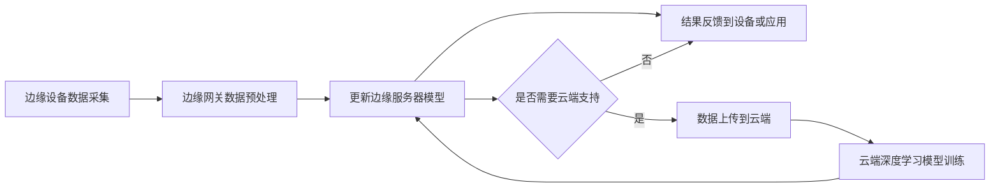

# 如何识别企业的边缘计算实时推理优势

> 关键词：边缘计算、实时推理、企业优势、数据处理、人工智能

> 摘要：本文围绕如何识别企业的边缘计算实时推理优势展开深入探讨。首先介绍边缘计算和实时推理的相关背景知识，接着阐述核心概念及其联系，剖析核心算法原理与具体操作步骤，讲解相关数学模型和公式。通过项目实战案例详细说明代码实现与解读，分析实际应用场景。推荐相关的学习资源、开发工具框架以及论文著作，最后总结未来发展趋势与挑战，并提供常见问题解答和参考资料，旨在帮助读者全面深入地理解和识别企业在边缘计算实时推理方面的优势。

## 1. 背景介绍 
### 1.1 目的和范围
边缘计算实时推理在当今数字化时代正发挥着越来越重要的作用，企业若能有效利用这一技术，将在市场竞争中占据优势。本文的目的在于帮助企业及相关从业者识别企业自身在边缘计算实时推理方面的优势，以便更好地规划技术发展战略、优化资源配置。范围涵盖边缘计算和实时推理的基本概念、技术原理、实际应用等多个方面，从理论到实践全面分析企业的优势所在。

### 1.2 预期读者
本文预期读者包括企业的技术决策者、IT 工程师、人工智能研发人员、对边缘计算和实时推理感兴趣的学者以及希望了解企业数字化转型相关技术的商业人士等。

### 1.3 文档结构概述
本文首先介绍背景知识，包括目的、预期读者和文档结构等。接着阐述核心概念与联系，包括边缘计算和实时推理的原理及架构。然后详细讲解核心算法原理与具体操作步骤，结合数学模型和公式进行深入分析。通过项目实战案例展示代码实现和解读。分析实际应用场景，推荐相关工具和资源。最后总结未来发展趋势与挑战，提供常见问题解答和参考资料。

### 1.4 术语表
#### 1.4.1 核心术语定义
- **边缘计算**：是一种将计算和数据存储靠近数据源的计算模式，在网络边缘侧（如设备端、网关等）完成数据的处理和分析，减少数据传输到云端的延迟和带宽需求。
- **实时推理**：指在接收到数据后，能够立即进行分析和判断并给出结果的过程，强调处理的及时性和快速响应。
- **人工智能模型**：用于模拟人类智能的数学模型，通过训练学习数据中的模式和规律，以实现预测、分类等任务。

#### 1.4.2 相关概念解释
- **数据本地化处理**：在边缘设备或靠近数据源的地方对数据进行处理，而不是将所有数据都传输到远程的数据中心或云端。
- **低延迟**：指数据从产生到处理结果返回的时间间隔非常短，能够满足实时性要求高的应用场景。

#### 1.4.3 缩略词列表
- **AI**：Artificial Intelligence，人工智能
- **IoT**：Internet of Things，物联网
- **GPU**：Graphics Processing Unit，图形处理器

## 2. 核心概念与联系 

### 2.1 边缘计算原理
边缘计算的核心思想是将计算和数据存储推向网络的边缘，靠近数据源。传统的云计算模式下，数据需要从设备端传输到云端进行处理，这会带来较大的延迟和带宽压力。而边缘计算在设备端或靠近设备的网关等节点进行数据处理，能够减少数据传输距离，提高响应速度。

边缘计算架构通常包括边缘设备、边缘网关和边缘服务器。边缘设备负责采集数据，如传感器、摄像头等；边缘网关对边缘设备采集的数据进行初步处理和转发；边缘服务器则提供更强大的计算和存储能力，进行更复杂的数据处理和分析。

以下是边缘计算架构的文本示意图：

边缘设备（传感器、摄像头等） -> 边缘网关（数据初步处理、转发） -> 边缘服务器（复杂数据处理、分析） -> 云端（数据存储、深度学习模型训练等）

### 2.2 实时推理原理
实时推理是人工智能模型在接收到输入数据后，迅速进行计算和分析，并输出结果的过程。在实时推理中，模型的计算效率和响应速度至关重要。通常，实时推理需要在毫秒级甚至更短的时间内完成，以满足实时性要求高的应用场景，如自动驾驶、工业自动化等。

实时推理的过程包括数据预处理、模型推理和结果后处理。数据预处理将输入数据转换为模型能够接受的格式；模型推理使用训练好的人工智能模型对预处理后的数据进行计算；结果后处理对模型输出的结果进行进一步处理和优化，以满足实际应用的需求。

### 2.3 边缘计算与实时推理的联系
边缘计算为实时推理提供了有利的环境。在边缘设备或边缘网关进行实时推理，可以减少数据传输到云端的延迟，提高推理的实时性。同时，边缘计算还可以减轻云端的计算压力，降低网络带宽需求。实时推理则是边缘计算的重要应用场景之一，通过在边缘侧进行实时推理，能够实现对数据的快速响应和决策，提高系统的智能化水平。

以下是边缘计算与实时推理联系的 Mermaid 流程图：



## 3. 核心算法原理 & 具体操作步骤 

### 3.1 核心算法原理
在边缘计算实时推理中，常用的算法包括深度学习算法，如卷积神经网络（CNN）、循环神经网络（RNN）等。以 CNN 为例，其基本原理是通过卷积层提取输入数据的特征，池化层对特征进行降维，全连接层将特征映射到输出类别。

以下是一个简单的 CNN 模型的 Python 实现：

```python
import torch
import torch.nn as nn

class SimpleCNN(nn.Module):
    def __init__(self):
        super(SimpleCNN, self).__init__()
        self.conv1 = nn.Conv2d(3, 16, kernel_size=3, padding=1)
        self.relu1 = nn.ReLU()
        self.pool1 = nn.MaxPool2d(2)
        self.conv2 = nn.Conv2d(16, 32, kernel_size=3, padding=1)
        self.relu2 = nn.ReLU()
        self.pool2 = nn.MaxPool2d(2)
        self.fc1 = nn.Linear(32 * 8 * 8, 128)
        self.relu3 = nn.ReLU()
        self.fc2 = nn.Linear(128, 10)

    def forward(self, x):
        x = self.pool1(self.relu1(self.conv1(x)))
        x = self.pool2(self.relu2(self.conv2(x)))
        x = x.view(-1, 32 * 8 * 8)
        x = self.relu3(self.fc1(x))
        x = self.fc2(x)
        return x
```

### 3.2 具体操作步骤
1. **数据准备**：收集和整理用于训练和推理的数据。确保数据的质量和标注的准确性。
2. **模型训练**：使用准备好的数据对 CNN 模型进行训练。在训练过程中，调整模型的参数以最小化损失函数。
```python
import torch.optim as optim

# 初始化模型
model = SimpleCNN()

# 定义损失函数和优化器
criterion = nn.CrossEntropyLoss()
optimizer = optim.SGD(model.parameters(), lr=0.001, momentum=0.9)

# 训练模型
for epoch in range(10):
    running_loss = 0.0
    for i, data in enumerate(trainloader, 0):
        inputs, labels = data
        optimizer.zero_grad()
        outputs = model(inputs)
        loss = criterion(outputs, labels)
        loss.backward()
        optimizer.step()
        running_loss += loss.item()
    print(f'Epoch {epoch + 1}, Loss: {running_loss / len(trainloader)}')
```
3. **模型部署**：将训练好的模型部署到边缘设备或边缘服务器上。可以使用一些工具，如 TensorFlow Lite、PyTorch Mobile 等，将模型转换为适合边缘设备运行的格式。
4. **实时推理**：在边缘设备上接收输入数据，进行实时推理。根据推理结果进行相应的决策和处理。
```python
# 实时推理示例
model.eval()
with torch.no_grad():
    test_input = torch.randn(1, 3, 32, 32)
    output = model(test_input)
    _, predicted = torch.max(output.data, 1)
    print(f'Predicted: {predicted.item()}')
```

## 4. 数学模型和公式 & 详细讲解 & 举例说明 

### 4.1 卷积操作的数学模型
卷积操作是 CNN 中的核心操作，其数学模型可以表示为：

$$y(m,n) = \sum_{i=0}^{M-1} \sum_{j=0}^{N-1} x(m + i, n + j) \cdot w(i, j)$$

其中，$x$ 是输入数据，$w$ 是卷积核，$y$ 是卷积输出，$M$ 和 $N$ 是卷积核的尺寸。

### 4.2 损失函数的数学模型
在分类任务中，常用的损失函数是交叉熵损失函数，其数学模型可以表示为：

$$L = -\frac{1}{N} \sum_{i=1}^{N} \sum_{c=1}^{C} y_{i,c} \log(p_{i,c})$$

其中，$N$ 是样本数量，$C$ 是类别数量，$y_{i,c}$ 是第 $i$ 个样本的真实标签，$p_{i,c}$ 是模型预测的第 $i$ 个样本属于第 $c$ 类的概率。

### 4.3 举例说明
假设我们有一个二分类任务，有 3 个样本，真实标签分别为 $[1, 0, 1]$，模型预测的概率分别为 $[0.8, 0.2, 0.6]$。则交叉熵损失为：

$$L = -\frac{1}{3} \left( 1 \cdot \log(0.8) + 0 \cdot \log(0.2) + 1 \cdot \log(0.6) \right) \approx 0.33$$

## 5. 项目实战：代码实际案例和详细解释说明 

### 5.1  开发环境搭建
1. **安装 Python**：建议使用 Python 3.7 及以上版本。可以从 Python 官方网站下载安装包进行安装。
2. **安装深度学习框架**：选择 PyTorch 或 TensorFlow 等深度学习框架。以 PyTorch 为例，可以使用以下命令进行安装：
```sh
pip install torch torchvision
```
3. **安装相关库**：根据项目需求，安装其他相关库，如 NumPy、Matplotlib 等。
```sh
pip install numpy matplotlib
```

### 5.2  源代码详细实现和代码解读
以下是一个完整的边缘计算实时推理项目示例，以图像分类任务为例：

```python
import torch
import torch.nn as nn
import torch.optim as optim
from torchvision import datasets, transforms
from torch.utils.data import DataLoader

# 定义 CNN 模型
class SimpleCNN(nn.Module):
    def __init__(self):
        super(SimpleCNN, self).__init__()
        self.conv1 = nn.Conv2d(3, 16, kernel_size=3, padding=1)
        self.relu1 = nn.ReLU()
        self.pool1 = nn.MaxPool2d(2)
        self.conv2 = nn.Conv2d(16, 32, kernel_size=3, padding=1)
        self.relu2 = nn.ReLU()
        self.pool2 = nn.MaxPool2d(2)
        self.fc1 = nn.Linear(32 * 8 * 8, 128)
        self.relu3 = nn.ReLU()
        self.fc2 = nn.Linear(128, 10)

    def forward(self, x):
        x = self.pool1(self.relu1(self.conv1(x)))
        x = self.pool2(self.relu2(self.conv2(x)))
        x = x.view(-1, 32 * 8 * 8)
        x = self.relu3(self.fc1(x))
        x = self.fc2(x)
        return x

# 数据预处理
transform = transforms.Compose([
    transforms.Resize((32, 32)),
    transforms.ToTensor(),
    transforms.Normalize((0.5, 0.5, 0.5), (0.5, 0.5, 0.5))
])

# 加载数据集
train_dataset = datasets.CIFAR10(root='./data', train=True,
                                 download=True, transform=transform)
trainloader = DataLoader(train_dataset, batch_size=32, shuffle=True)

test_dataset = datasets.CIFAR10(root='./data', train=False,
                                download=True, transform=transform)
testloader = DataLoader(test_dataset, batch_size=32, shuffle=False)

# 初始化模型、损失函数和优化器
model = SimpleCNN()
criterion = nn.CrossEntropyLoss()
optimizer = optim.SGD(model.parameters(), lr=0.001, momentum=0.9)

# 训练模型
for epoch in range(10):
    running_loss = 0.0
    for i, data in enumerate(trainloader, 0):
        inputs, labels = data
        optimizer.zero_grad()
        outputs = model(inputs)
        loss = criterion(outputs, labels)
        loss.backward()
        optimizer.step()
        running_loss += loss.item()
    print(f'Epoch {epoch + 1}, Loss: {running_loss / len(trainloader)}')

# 实时推理示例
model.eval()
with torch.no_grad():
    test_input = torch.randn(1, 3, 32, 32)
    output = model(test_input)
    _, predicted = torch.max(output.data, 1)
    print(f'Predicted: {predicted.item()}')
```

### 5.3  代码解读与分析
1. **模型定义**：定义了一个简单的 CNN 模型，包括卷积层、池化层和全连接层。
2. **数据预处理**：使用 `transforms` 对图像数据进行预处理，包括调整大小、转换为张量和归一化。
3. **数据集加载**：使用 `datasets.CIFAR10` 加载 CIFAR-10 数据集，并使用 `DataLoader` 进行数据加载。
4. **模型训练**：使用交叉熵损失函数和随机梯度下降优化器对模型进行训练。
5. **实时推理**：将模型设置为评估模式，进行实时推理，并输出预测结果。

## 6. 实际应用场景 
### 6.1 工业自动化
在工业生产中，边缘计算实时推理可以用于设备状态监测、故障预测和质量控制等。通过在边缘设备上安装传感器，实时采集设备的运行数据，并进行实时推理，可以及时发现设备的异常情况，采取相应的措施，提高生产效率和产品质量。

### 6.2 自动驾驶
在自动驾驶领域，边缘计算实时推理可以用于目标检测、路径规划和决策制定等。车辆上的摄像头、雷达等传感器实时采集周围环境的数据，在边缘设备上进行实时推理，快速识别障碍物、交通标志等，为自动驾驶决策提供支持，确保行车安全。

### 6.3 智能安防
在智能安防系统中，边缘计算实时推理可以用于视频监控、人脸识别和行为分析等。通过在监控摄像头边缘设备上进行实时推理，能够及时发现异常行为和人员，发出警报，提高安防效率。

### 6.4 智能家居
在智能家居场景中，边缘计算实时推理可以用于设备控制、环境监测和能源管理等。智能设备实时采集家庭环境数据，如温度、湿度、光照等，在边缘设备上进行实时推理，根据用户的需求自动控制设备的运行，提高家居的舒适度和能源利用效率。

## 7. 工具和资源推荐
### 7.1 学习资源推荐
#### 7.1.1 书籍推荐
- 《深度学习》（Deep Learning）：由 Ian Goodfellow、Yoshua Bengio 和 Aaron Courville 合著，是深度学习领域的经典教材。
- 《Python 深度学习》（Deep Learning with Python）：由 Francois Chollet 编写，详细介绍了如何使用 Python 和 Keras 进行深度学习开发。

#### 7.1.2 在线课程
- Coursera 上的《深度学习专项课程》（Deep Learning Specialization）：由 Andrew Ng 教授讲授，涵盖了深度学习的各个方面。
- edX 上的《人工智能基础》（Fundamentals of Artificial Intelligence）：介绍了人工智能的基本概念和算法。

#### 7.1.3 技术博客和网站
- Medium 上的 Towards Data Science：分享了大量关于数据科学、机器学习和深度学习的文章。
- 开源中国（OSChina）：提供了丰富的技术资讯和开源项目资源。

### 7.2 开发工具框架推荐
#### 7.2.1 IDE和编辑器
- PyCharm：是一款专业的 Python 集成开发环境，提供了丰富的功能和工具，方便开发和调试。
- Visual Studio Code：是一款轻量级的代码编辑器，支持多种编程语言，具有丰富的插件生态系统。

#### 7.2.2 调试和性能分析工具
- TensorBoard：是 TensorFlow 提供的可视化工具，可以用于查看模型训练过程中的损失函数、准确率等指标。
- PyTorch Profiler：是 PyTorch 提供的性能分析工具，可以帮助用户分析模型的性能瓶颈。

#### 7.2.3 相关框架和库
- TensorFlow Lite：是 TensorFlow 为移动和边缘设备优化的轻量级深度学习框架。
- PyTorch Mobile：是 PyTorch 为移动设备提供的开发框架，支持在 Android 和 iOS 设备上运行深度学习模型。

### 7.3 相关论文著作推荐
#### 7.3.1 经典论文
- “ImageNet Classification with Deep Convolutional Neural Networks”：AlexNet 论文，开创了深度学习在图像分类领域的先河。
- “Long Short-Term Memory”：LSTM 论文，介绍了长短期记忆网络的原理和应用。

#### 7.3.2 最新研究成果
- 关注 arXiv 等学术预印本平台，及时了解边缘计算和实时推理领域的最新研究成果。

#### 7.3.3 应用案例分析
- 查阅 IEEE、ACM 等学术会议和期刊上的相关论文，了解边缘计算实时推理在不同领域的应用案例和经验总结。

## 8. 总结：未来发展趋势与挑战
### 8.1 未来发展趋势
- **更广泛的应用场景**：边缘计算实时推理将在更多领域得到应用，如医疗保健、农业、金融等，推动各行业的数字化转型。
- **融合多种技术**：与物联网、5G、区块链等技术深度融合，实现更高效、更安全的数据处理和传输。
- **模型优化和加速**：不断优化深度学习模型，提高模型的计算效率和推理速度，以满足实时性要求更高的应用场景。

### 8.2 挑战
- **资源受限**：边缘设备的计算、存储和能源资源有限，需要开发更轻量级、高效的算法和模型。
- **数据安全和隐私**：边缘计算中数据在本地处理，增加了数据安全和隐私保护的难度，需要加强相关技术和管理措施。
- **标准和规范缺失**：目前边缘计算实时推理领域缺乏统一的标准和规范，不利于技术的推广和应用。

## 9. 附录：常见问题与解答
### 9.1 边缘计算和云计算有什么区别？
边缘计算将计算和数据存储靠近数据源，减少数据传输延迟和带宽需求；云计算则将计算和数据存储集中在远程的数据中心，通过网络提供服务。

### 9.2 如何选择适合边缘设备的深度学习模型？
需要考虑模型的复杂度、计算量、存储需求等因素。选择轻量级、高效的模型，如 MobileNet、ShuffleNet 等。

### 9.3 边缘计算实时推理如何保证数据安全？
可以采用加密技术对数据进行加密处理，在边缘设备和边缘服务器上设置访问控制和认证机制，确保只有授权的用户和设备能够访问数据。

## 10. 扩展阅读 & 参考资料
- [边缘计算技术白皮书](https://example.com/edge_computing_whitepaper.pdf)
- [深度学习入门教程](https://www.example.com/deep_learning_tutorial)
- [实时推理算法研究进展](https://arxiv.org/abs/xxxx.xxxx)