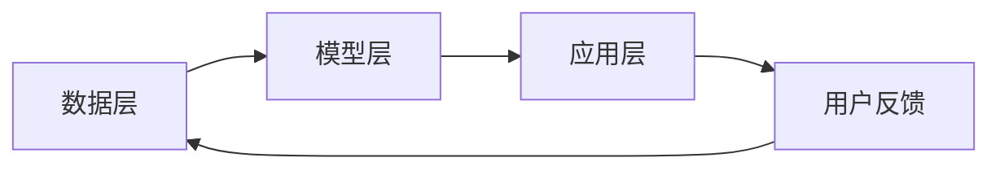

# 如何通过AI实现更高的工作效率与创新

> 关键词：AI、工作效率、创新、自动化、智能决策、人机协作、数据驱动

> 摘要：本文围绕如何通过AI实现更高的工作效率与创新展开深入探讨。首先介绍了AI在当今工作场景中的背景和重要性，阐述了核心概念及它们之间的联系，详细讲解了相关核心算法原理与操作步骤，借助数学模型和公式进行理论支撑。通过项目实战展示了AI在实际工作中的应用，分析了其在不同场景下的实际应用效果。推荐了一系列学习资源、开发工具框架以及相关论文著作，为读者进一步深入学习和应用AI提供参考。最后总结了AI在提高工作效率与创新方面的未来发展趋势与挑战，并解答了常见问题，提供了扩展阅读和参考资料，旨在帮助读者全面了解如何利用AI提升工作效率与激发创新。

## 1. 背景介绍 
### 1.1 目的和范围
在当今数字化时代，AI技术的快速发展为各个行业带来了前所未有的机遇和挑战。本文章的目的在于深入探讨如何借助AI技术来实现更高的工作效率以及激发创新。范围涵盖了AI在不同工作场景中的应用，包括但不限于自动化任务处理、智能决策支持、创新思维激发等方面。通过对AI技术原理、实际案例和应用场景的分析，为读者提供全面且实用的指导，帮助他们在工作中更好地运用AI技术。

### 1.2 预期读者
本文预期读者包括企业管理人员、职场人士、技术开发者、创业者以及对AI技术在工作中应用感兴趣的广大人群。无论是希望提升团队工作效率的管理者，还是寻求个人职业发展和创新的职场人士，亦或是专注于AI技术研发和应用的开发者，都能从本文中获取有价值的信息和启示。

### 1.3 文档结构概述
本文将按照以下结构进行阐述：首先介绍相关背景知识，包括目的、预期读者和文档结构概述等；接着讲解AI的核心概念及其联系，通过文本示意图和Mermaid流程图进行直观展示；然后深入剖析核心算法原理和具体操作步骤，并结合Python源代码进行详细说明；再通过数学模型和公式对AI技术进行理论支持和举例说明；之后通过项目实战展示AI在实际工作中的应用，包括开发环境搭建、源代码实现和代码解读；分析AI在不同实际应用场景中的作用；推荐学习资源、开发工具框架和相关论文著作；总结AI在提高工作效率与创新方面的未来发展趋势与挑战；最后在附录中解答常见问题，并提供扩展阅读和参考资料。

### 1.4 术语表
#### 1.4.1 核心术语定义
- **AI（Artificial Intelligence）**：即人工智能，是指计算机系统能够执行通常需要人类智能才能完成的任务，如学习、推理、解决问题、感知和语言理解等。
- **机器学习（Machine Learning）**：是AI的一个重要分支，它使计算机能够从数据中学习模式和规律，而无需明确的编程指令。
- **深度学习（Deep Learning）**：是一种基于人工神经网络的机器学习技术，通过多层神经网络对数据进行深度特征提取和学习。
- **自然语言处理（Natural Language Processing，NLP）**：是AI的一个领域，专注于让计算机理解、处理和生成人类语言。
- **自动化（Automation）**：指利用技术手段自动执行重复性、规律性的任务，减少人工干预。

#### 1.4.2 相关概念解释
- **智能决策**：借助AI技术对大量数据进行分析和挖掘，为决策者提供准确、全面的信息和建议，帮助其做出更明智的决策。
- **人机协作**：人类与AI系统相互配合、协同工作，充分发挥人类的创造力和判断力以及AI的计算能力和数据处理能力。
- **数据驱动**：以数据为基础，通过对数据的分析和挖掘来指导决策和行动，AI技术在数据驱动的工作模式中起着关键作用。

#### 1.4.3 缩略词列表
- **AI**：Artificial Intelligence
- **ML**：Machine Learning
- **DL**：Deep Learning
- **NLP**：Natural Language Processing

## 2. 核心概念与联系 

### 核心概念原理
- **AI基础原理**：AI的核心是模拟人类智能，通过算法和模型对数据进行处理和分析。它包括符号主义、连接主义和行为主义等不同的理论流派。符号主义强调基于逻辑和规则的推理；连接主义借鉴了人类大脑神经元的结构，通过神经网络进行学习；行为主义则注重智能体与环境的交互和适应性。
- **机器学习原理**：机器学习通过对数据的学习来构建模型，从而对未知数据进行预测和分类。常见的机器学习算法包括监督学习、无监督学习和强化学习。监督学习使用带有标签的数据进行训练，模型学习输入数据与标签之间的映射关系；无监督学习处理无标签的数据，旨在发现数据中的潜在结构和模式；强化学习通过智能体与环境的交互，根据奖励信号来学习最优策略。
- **深度学习原理**：深度学习基于多层神经网络，通过大量的数据进行训练，自动提取数据的深层特征。深度神经网络由输入层、隐藏层和输出层组成，隐藏层可以有多个，每个神经元通过加权和激活函数进行计算，不断调整权重以优化模型性能。
- **自然语言处理原理**：自然语言处理涉及语言的理解、生成和交互。它包括词法分析、句法分析、语义分析等多个层次的处理。通过机器学习和深度学习算法，对文本数据进行建模和训练，使计算机能够理解人类语言的含义和结构，并生成自然流畅的文本。

### 架构的文本示意图
AI系统的架构通常包括数据层、模型层和应用层。数据层负责收集、存储和预处理各种类型的数据，如文本、图像、音频等。模型层包含各种AI模型，如机器学习模型、深度学习模型等，这些模型通过对数据的训练和优化来实现特定的功能。应用层则将训练好的模型应用到实际工作场景中，如智能客服、自动化报表生成、图像识别等。

### Mermaid流程图

该流程图展示了AI系统的基本架构和数据流动过程。数据层为模型层提供训练数据，模型层通过训练得到的模型应用到应用层，用户在使用应用层的过程中产生反馈，反馈数据又回到数据层，形成一个闭环，不断优化AI系统。

## 3. 核心算法原理 & 具体操作步骤 

### 机器学习算法 - 线性回归
#### 算法原理
线性回归是一种简单而常用的机器学习算法，用于预测连续数值的输出。其基本原理是通过找到一条最佳拟合直线，使得数据点到该直线的误差平方和最小。线性回归模型的数学表达式为：
$$y = \theta_0 + \theta_1x_1 + \theta_2x_2 + \cdots + \theta_nx_n$$
其中，$y$ 是预测值，$x_1, x_2, \cdots, x_n$ 是输入特征，$\theta_0, \theta_1, \cdots, \theta_n$ 是模型的参数。

#### Python源代码实现
```python
import numpy as np
from sklearn.linear_model import LinearRegression
from sklearn.model_selection import train_test_split
from sklearn.metrics import mean_squared_error

# 生成示例数据
np.random.seed(0)
X = np.random.rand(100, 1)
y = 2 * X + 1 + 0.5 * np.random.randn(100, 1)

# 划分训练集和测试集
X_train, X_test, y_train, y_test = train_test_split(X, y, test_size=0.2, random_state=42)

# 创建线性回归模型
model = LinearRegression()

# 训练模型
model.fit(X_train, y_train)

# 预测
y_pred = model.predict(X_test)

# 计算均方误差
mse = mean_squared_error(y_test, y_pred)
print(f"均方误差: {mse}")
```
#### 具体操作步骤
1. **数据准备**：收集和整理相关数据，将其分为输入特征和目标变量。
2. **数据划分**：将数据划分为训练集和测试集，一般比例为80%训练集和20%测试集。
3. **模型创建**：选择合适的线性回归模型。
4. **模型训练**：使用训练集数据对模型进行训练，通过最小化误差平方和来确定模型的参数。
5. **模型预测**：使用训练好的模型对测试集数据进行预测。
6. **模型评估**：计算预测结果与真实值之间的误差，如均方误差、均方根误差等，评估模型的性能。

### 深度学习算法 - 卷积神经网络（CNN）
#### 算法原理
卷积神经网络是一种专门用于处理具有网格结构数据的深度学习模型，如图像和音频。它通过卷积层、池化层和全连接层等组件来提取数据的特征。卷积层通过卷积核在输入数据上滑动，进行卷积操作，提取局部特征；池化层用于降低数据的维度，减少计算量；全连接层将提取的特征进行整合，输出最终的分类或预测结果。

#### Python源代码实现
```python
import tensorflow as tf
from tensorflow.keras import datasets, layers, models
import matplotlib.pyplot as plt

# 加载数据集
(train_images, train_labels), (test_images, test_labels) = datasets.cifar10.load_data()

# 数据预处理
train_images, test_images = train_images / 255.0, test_images / 255.0

# 构建CNN模型
model = models.Sequential()
model.add(layers.Conv2D(32, (3, 3), activation='relu', input_shape=(32, 32, 3)))
model.add(layers.MaxPooling2D((2, 2)))
model.add(layers.Conv2D(64, (3, 3), activation='relu'))
model.add(layers.MaxPooling2D((2, 2)))
model.add(layers.Conv2D(64, (3, 3), activation='relu'))
model.add(layers.Flatten())
model.add(layers.Dense(64, activation='relu'))
model.add(layers.Dense(10))

# 编译模型
model.compile(optimizer='adam',
              loss=tf.keras.losses.SparseCategoricalCrossentropy(from_logits=True),
              metrics=['accuracy'])

# 训练模型
history = model.fit(train_images, train_labels, epochs=10, 
                    validation_data=(test_images, test_labels))

# 评估模型
test_loss, test_acc = model.evaluate(test_images,  test_labels, verbose=2)
print(f"测试准确率: {test_acc}")
```
#### 具体操作步骤
1. **数据加载和预处理**：加载相关数据集，对数据进行归一化等预处理操作。
2. **模型构建**：构建CNN模型，包括卷积层、池化层和全连接层的设计。
3. **模型编译**：选择合适的优化器、损失函数和评估指标。
4. **模型训练**：使用训练集数据对模型进行训练，指定训练的轮数和验证集。
5. **模型评估**：使用测试集数据评估模型的性能，计算准确率等指标。

## 4. 数学模型和公式 & 详细讲解 & 举例说明 

### 线性回归的数学模型和公式
#### 详细讲解
线性回归的目标是找到一组参数 $\theta = [\theta_0, \theta_1, \cdots, \theta_n]$，使得预测值 $y$ 与真实值 $\hat{y}$ 之间的误差最小。常用的误差度量方法是均方误差（Mean Squared Error，MSE），其数学表达式为：
$$MSE = \frac{1}{m} \sum_{i=1}^{m} (y^{(i)} - \hat{y}^{(i)})^2$$
其中，$m$ 是样本数量，$y^{(i)}$ 是第 $i$ 个样本的真实值，$\hat{y}^{(i)}$ 是第 $i$ 个样本的预测值。

为了最小化均方误差，我们可以使用梯度下降算法。梯度下降算法通过不断迭代更新参数 $\theta$，使得误差函数逐渐减小。参数更新的公式为：
$$\theta_j := \theta_j - \alpha \frac{\partial}{\partial \theta_j} MSE(\theta)$$
其中，$\alpha$ 是学习率，控制参数更新的步长。

#### 举例说明
假设我们有一组数据 $(x_1, y_1), (x_2, y_2), \cdots, (x_m, y_m)$，我们希望通过线性回归模型 $y = \theta_0 + \theta_1x$ 来预测 $y$ 的值。首先，我们需要计算均方误差：
$$MSE = \frac{1}{m} \sum_{i=1}^{m} (y^{(i)} - (\theta_0 + \theta_1x^{(i)}))^2$$
然后，使用梯度下降算法更新参数 $\theta_0$ 和 $\theta_1$：
$$\frac{\partial}{\partial \theta_0} MSE(\theta) = \frac{2}{m} \sum_{i=1}^{m} (y^{(i)} - (\theta_0 + \theta_1x^{(i)}))$$
$$\frac{\partial}{\partial \theta_1} MSE(\theta) = \frac{2}{m} \sum_{i=1}^{m} (y^{(i)} - (\theta_0 + \theta_1x^{(i)}))x^{(i)}$$
不断迭代更新 $\theta_0$ 和 $\theta_1$，直到误差函数收敛。

### 卷积神经网络的数学模型和公式
#### 详细讲解
卷积神经网络中的卷积操作是其核心部分。卷积操作可以表示为：
$$y_{ij} = \sum_{m=0}^{M-1} \sum_{n=0}^{N-1} x_{i+m, j+n} w_{mn} + b$$
其中，$x$ 是输入数据，$w$ 是卷积核，$b$ 是偏置，$y$ 是卷积输出。

池化操作通常使用最大池化或平均池化，以降低数据的维度。最大池化的数学表达式为：
$$y_{ij} = \max_{m,n \in R} x_{i+m, j+n}$$
其中，$R$ 是池化窗口的范围。

全连接层的计算可以表示为：
$$y = Wx + b$$
其中，$W$ 是权重矩阵，$x$ 是输入向量，$b$ 是偏置向量。

#### 举例说明
假设我们有一个 $3 \times 3$ 的输入图像和一个 $2 \times 2$ 的卷积核：
输入图像 $x$：
$$
\begin{bmatrix}
1 & 2 & 3 \\
4 & 5 & 6 \\
7 & 8 & 9
\end{bmatrix}
$$
卷积核 $w$：
$$
\begin{bmatrix}
1 & 2 \\
3 & 4
\end{bmatrix}
$$
偏置 $b = 1$。

卷积操作的计算过程如下：
$$y_{00} = (1 \times 1 + 2 \times 2 + 4 \times 3 + 5 \times 4) + 1 = 38$$
$$y_{01} = (2 \times 1 + 3 \times 2 + 5 \times 3 + 6 \times 4) + 1 = 50$$
$$y_{10} = (4 \times 1 + 5 \times 2 + 7 \times 3 + 8 \times 4) + 1 = 76$$
$$y_{11} = (5 \times 1 + 6 \times 2 + 8 \times 3 + 9 \times 4) + 1 = 88$$

最终的卷积输出为：
$$
\begin{bmatrix}
38 & 50 \\
76 & 88
\end{bmatrix}
$$

## 5. 项目实战：代码实际案例和详细解释说明 

### 5.1  开发环境搭建
#### 安装Python
首先，需要安装Python解释器。可以从Python官方网站（https://www.python.org/downloads/） 下载适合自己操作系统的Python版本，并按照安装向导进行安装。

#### 安装相关库
使用pip（Python包管理工具）安装所需的库，如NumPy、Pandas、Scikit-learn、TensorFlow等。可以使用以下命令进行安装：
```sh
pip install numpy pandas scikit-learn tensorflow
```

#### 选择开发工具
可以选择使用集成开发环境（IDE），如PyCharm、Jupyter Notebook等。PyCharm提供了强大的代码编辑、调试和项目管理功能；Jupyter Notebook则适合进行交互式的数据分析和模型开发。

### 5.2  源代码详细实现和代码解读
#### 项目背景
假设我们要构建一个智能客服系统，使用自然语言处理技术来自动回答用户的问题。

#### 源代码实现
```python
import nltk
from nltk.stem import WordNetLemmatizer
import json
import pickle
import numpy as np
from keras.models import Sequential
from keras.layers import Dense, Activation, Dropout
from tensorflow.keras.optimizers import SGD
import random

nltk.download('punkt')
nltk.download('wordnet')

lemmatizer = WordNetLemmatizer()

# 加载数据集
data_file = open('intents.json').read()
intents = json.loads(data_file)

words = []
classes = []
documents = []
ignore_words = ['?', '!']

# 处理数据集
for intent in intents['intents']:
    for pattern in intent['patterns']:
        # 分词
        w = nltk.word_tokenize(pattern)
        words.extend(w)
        # 添加文档
        documents.append((w, intent['tag']))
        # 添加类别
        if intent['tag'] not in classes:
            classes.append(intent['tag'])

# 词形还原
words = [lemmatizer.lemmatize(w.lower()) for w in words if w not in ignore_words]
words = sorted(list(set(words)))
classes = sorted(list(set(classes)))

# 保存数据
pickle.dump(words, open('words.pkl', 'wb'))
pickle.dump(classes, open('classes.pkl', 'wb'))

# 创建训练数据
training = []
output_empty = [0] * len(classes)

for doc in documents:
    bag = []
    pattern_words = doc[0]
    pattern_words = [lemmatizer.lemmatize(word.lower()) for word in pattern_words]
    for w in words:
        bag.append(1) if w in pattern_words else bag.append(0)

    output_row = list(output_empty)
    output_row[classes.index(doc[1])] = 1

    training.append([bag, output_row])

random.shuffle(training)
training = np.array(training)

train_x = list(training[:, 0])
train_y = list(training[:, 1])

# 构建模型
model = Sequential()
model.add(Dense(128, input_shape=(len(train_x[0]),), activation='relu'))
model.add(Dropout(0.5))
model.add(Dense(64, activation='relu'))
model.add(Dropout(0.5))
model.add(Dense(len(train_y[0]), activation='softmax'))

# 编译模型
sgd = SGD(learning_rate=0.01, decay=1e-6, momentum=0.9, nesterov=True)
model.compile(loss='categorical_crossentropy', optimizer=sgd, metrics=['accuracy'])

# 训练模型
hist = model.fit(np.array(train_x), np.array(train_y), epochs=200, batch_size=5, verbose=1)
model.save('chatbot_model.h5', hist)
```
#### 代码解读
1. **数据加载和预处理**：首先加载包含用户问题和对应答案的数据集（`intents.json`），对问题进行分词和词形还原处理，提取出所有的单词和类别。
2. **创建训练数据**：将每个问题转换为一个词袋向量，同时创建对应的类别标签向量，将其组合成训练数据。
3. **模型构建**：构建一个简单的神经网络模型，包含输入层、隐藏层和输出层。
4. **模型编译**：选择合适的优化器（SGD）和损失函数（`categorical_crossentropy`），并设置评估指标（准确率）。
5. **模型训练**：使用训练数据对模型进行训练，指定训练的轮数和批次大小。
6. **模型保存**：将训练好的模型保存到文件中，以便后续使用。

### 5.3  代码解读与分析
#### 数据预处理的重要性
数据预处理是自然语言处理任务中的关键步骤。通过分词和词形还原，可以将文本数据转换为计算机能够处理的形式，同时减少数据的冗余和噪声。词袋模型将文本表示为向量，方便模型进行处理和计算。

#### 模型选择和参数调整
在本项目中，选择了简单的神经网络模型。通过调整隐藏层的神经元数量、激活函数、优化器的参数等，可以提高模型的性能。例如，使用ReLU激活函数可以加快模型的收敛速度，使用Dropout层可以防止模型过拟合。

#### 模型评估和优化
在训练过程中，可以使用验证集来评估模型的性能，根据评估结果调整模型的参数和结构。可以尝试不同的模型架构和算法，如循环神经网络（RNN）、长短期记忆网络（LSTM）等，以提高模型的准确率和泛化能力。

## 6. 实际应用场景 

### 自动化任务处理
- **文档处理**：使用AI技术可以自动对文档进行分类、提取关键信息、生成摘要等。例如，企业可以使用OCR（光学字符识别）技术将纸质文档转换为电子文本，然后使用自然语言处理技术对文本进行分析和处理，提高文档处理的效率。
- **数据录入**：AI可以实现自动化的数据录入，减少人工录入的错误和时间成本。例如，通过图像识别技术识别表格中的数据，自动将其录入到数据库中。
- **流程自动化**：借助机器人流程自动化（RPA）技术，AI可以模拟人类操作，自动执行重复性的业务流程，如财务报表生成、订单处理等。

### 智能决策支持
- **市场分析**：AI可以对大量的市场数据进行分析和挖掘，帮助企业了解市场趋势、消费者需求和竞争对手情况，为企业的决策提供有力支持。例如，通过分析社交媒体数据、销售数据等，预测市场需求和产品销售趋势。
- **风险评估**：在金融、保险等领域，AI可以用于风险评估和预测。通过对客户的信用数据、财务数据等进行分析，评估客户的信用风险和违约概率，帮助企业做出合理的决策。
- **资源分配**：AI可以根据业务需求和资源状况，优化资源分配方案。例如，在物流领域，通过分析订单数据和运输路线，合理安排车辆和司机，提高物流效率。

### 创新思维激发
- **创意生成**：AI可以通过对大量创意作品的学习和分析，生成新的创意和灵感。例如，在广告设计、音乐创作等领域，AI可以提供创意建议和素材，帮助创作者开拓思路。
- **产品创新**：AI可以帮助企业发现新的产品需求和机会，推动产品创新。例如，通过对用户反馈数据的分析，发现用户的痛点和需求，为产品的改进和创新提供方向。
- **业务模式创新**：AI可以改变企业的业务模式和运营方式。例如，共享经济模式的兴起就是借助AI技术实现了资源的高效配置和共享。

## 7. 工具和资源推荐
### 7.1 学习资源推荐
#### 7.1.1 书籍推荐
- 《Python机器学习》：这本书详细介绍了Python在机器学习中的应用，包括各种机器学习算法的原理和实现，适合初学者入门。
- 《深度学习》：由深度学习领域的三位巨头Ian Goodfellow、Yoshua Bengio和Aaron Courville合著，是深度学习领域的经典教材，全面介绍了深度学习的理论和实践。
- 《人工智能：一种现代的方法》：是人工智能领域的权威著作，涵盖了人工智能的各个方面，包括搜索算法、知识表示、机器学习、自然语言处理等。

#### 7.1.2 在线课程
- Coursera上的“机器学习”课程：由Andrew Ng教授主讲，是机器学习领域的经典课程，通过视频讲解、编程作业和测验等方式，帮助学习者掌握机器学习的基本概念和算法。
- edX上的“深度学习微硕士项目”：由多个知名大学和机构联合推出，提供了深度学习领域的系统学习课程，包括深度学习基础、卷积神经网络、循环神经网络等内容。
- 阿里云天池平台的AI实战课程：提供了丰富的AI实战项目和教程，通过实际项目的操作，帮助学习者提高AI应用能力。

#### 7.1.3 技术博客和网站
- Medium：是一个技术博客平台，有很多AI领域的专家和爱好者分享他们的经验和见解，内容涵盖了AI的各个方面。
- Towards Data Science：专注于数据科学和机器学习领域，提供了很多高质量的技术文章和教程，适合学习者深入学习和研究。
- Kaggle：是一个数据科学竞赛平台，不仅有各种数据竞赛，还有很多优秀的开源代码和数据资源，学习者可以通过参与竞赛和学习他人的代码来提高自己的能力。

### 7.2 开发工具框架推荐
#### 7.2.1 IDE和编辑器
- PyCharm：是一款专业的Python集成开发环境，提供了丰富的代码编辑、调试和项目管理功能，适合Python开发者使用。
- Jupyter Notebook：是一个交互式的数据分析和模型开发工具，支持多种编程语言，通过代码和文本的结合，方便开发者进行数据探索和模型验证。
- Visual Studio Code：是一款轻量级的代码编辑器，支持多种编程语言和插件，具有强大的代码编辑和调试功能，适合快速开发和学习。

#### 7.2.2 调试和性能分析工具
- TensorBoard：是TensorFlow提供的可视化工具，可以帮助开发者可视化模型的训练过程、损失函数、准确率等指标，方便调试和优化模型。
- Py-Spy：是一个Python性能分析工具，可以实时监测Python程序的CPU使用情况、函数调用时间等，帮助开发者找出性能瓶颈。
- cProfile：是Python标准库中的性能分析工具，可以统计Python程序中各个函数的调用次数、执行时间等信息，为优化代码提供依据。

#### 7.2.3 相关框架和库
- TensorFlow：是一个开源的机器学习框架，由Google开发和维护，提供了丰富的深度学习模型和工具，支持CPU、GPU和TPU等多种计算设备。
- PyTorch：是另一个流行的深度学习框架，由Facebook开发和维护，具有动态图的特点，适合快速开发和研究。
- Scikit-learn：是一个简单易用的机器学习库，提供了各种机器学习算法和工具，如分类、回归、聚类等，适合初学者和快速开发。

### 7.3 相关论文著作推荐
#### 7.3.1 经典论文
- “ImageNet Classification with Deep Convolutional Neural Networks”：这篇论文是卷积神经网络领域的经典之作，提出了AlexNet模型，在ImageNet图像分类竞赛中取得了巨大成功，开启了深度学习在计算机视觉领域的热潮。
- “Long Short-Term Memory”：介绍了长短期记忆网络（LSTM）的原理和结构，LSTM是一种特殊的循环神经网络，能够有效解决序列数据处理中的长期依赖问题。
- “Attention Is All You Need”：提出了Transformer模型，引入了注意力机制，在自然语言处理领域取得了突破性进展，成为了当前很多自然语言处理任务的主流模型。

#### 7.3.2 最新研究成果
- 关注顶级学术会议和期刊，如NeurIPS（神经信息处理系统大会）、ICML（国际机器学习会议）、ACL（计算语言学协会年会）等，这些会议和期刊上发表的论文代表了AI领域的最新研究成果和趋势。
- 各大科技公司的研究机构也会发布很多有价值的研究成果，如Google AI、Facebook AI Research等，可以关注它们的官方网站和博客。

#### 7.3.3 应用案例分析
- 《AI超人类：人工智能的商业新物种》：通过大量的实际案例，分析了AI在不同行业的应用和商业价值，为企业和创业者提供了参考和启示。
- 《智能时代：大数据与智能革命重新定义未来》：介绍了AI在各个领域的应用和影响，以及智能时代的发展趋势和挑战，帮助读者了解AI的实际应用场景和发展前景。

## 8. 总结：未来发展趋势与挑战
### 未来发展趋势
- **更广泛的应用**：AI技术将在更多的领域得到应用，如医疗、教育、交通等。例如，在医疗领域，AI可以辅助医生进行疾病诊断和治疗方案推荐；在教育领域，AI可以实现个性化学习和智能辅导。
- **人机协作的深化**：未来，人类与AI将实现更加深度的协作。AI将作为人类的智能助手，帮助人类完成复杂的任务，同时人类的创造力和判断力也将为AI的发展提供方向和指导。
- **跨领域融合**：AI将与其他技术，如物联网、大数据、区块链等进行深度融合，创造出更多的创新应用和商业模式。例如，物联网设备产生的大量数据可以为AI提供丰富的训练素材，AI可以对这些数据进行分析和处理，实现智能决策和控制。
- **伦理和法律的完善**：随着AI技术的发展，伦理和法律问题将越来越受到关注。未来，将建立更加完善的伦理和法律框架，规范AI的发展和应用，保障人类的利益和安全。

### 挑战
- **数据隐私和安全**：AI的发展依赖于大量的数据，数据的隐私和安全问题成为了一个重要的挑战。如何保护用户的数据不被泄露和滥用，是AI发展过程中需要解决的关键问题。
- **算法偏见**：AI算法可能存在偏见，导致不公平的结果。例如，在招聘、信贷等领域，AI算法可能会对某些群体产生歧视。如何消除算法偏见，确保AI的公平性和公正性，是一个亟待解决的问题。
- **人才短缺**：AI技术的发展需要大量的专业人才，包括算法工程师、数据科学家、AI伦理专家等。目前，全球范围内AI人才短缺的问题比较严重，如何培养和吸引更多的AI人才，是推动AI发展的关键。
- **社会影响**：AI的发展可能会对社会产生深远的影响，如就业结构的变化、贫富差距的扩大等。如何应对这些社会影响，实现AI的可持续发展，是一个需要全社会共同关注和解决的问题。

## 9. 附录：常见问题与解答
### 问题1：AI技术对就业有什么影响？
AI技术的发展确实会对就业结构产生一定的影响。一些重复性、规律性的工作可能会被AI自动化取代，但同时也会创造出一些新的就业机会，如AI研发、数据管理、人机协作等领域。因此，人们需要不断学习和提升自己的技能，以适应AI时代的就业需求。

### 问题2：如何确保AI系统的安全性？
确保AI系统的安全性需要从多个方面入手。首先，要加强数据的安全管理，对数据进行加密和备份，防止数据泄露和丢失。其次，要对AI算法进行安全审计和测试，发现和修复潜在的安全漏洞。此外，还需要建立健全的安全管理制度和应急响应机制，及时应对各种安全威胁。

### 问题3：AI算法的可解释性重要吗？
AI算法的可解释性非常重要。在一些关键领域，如医疗、金融等，决策者需要了解AI算法的决策过程和依据，以便做出合理的决策。同时，可解释性也有助于发现算法中的偏见和错误，提高AI系统的可靠性和可信度。

### 问题4：如何选择适合自己的AI学习资源？
选择适合自己的AI学习资源需要考虑自己的学习目标、基础水平和学习方式。如果是初学者，可以选择一些入门级的书籍和在线课程，如《Python机器学习》、Coursera上的“机器学习”课程等。如果已经有一定的基础，可以选择一些深入的技术博客和研究论文，如Towards Data Science、NeurIPS会议论文等。此外，还可以根据自己的兴趣和需求，选择相关的开源项目和实践案例进行学习和实践。

## 10. 扩展阅读 & 参考资料
### 扩展阅读
- 《人类简史：从动物到上帝》：探讨了人类的进化和发展历程，以及人类与技术的关系，为理解AI的发展和影响提供了更广阔的视角。
- 《生命3.0：人工智能时代的人类未来》：思考了AI对人类未来的影响，包括人类的存在意义、道德伦理等问题，引发读者对AI发展的深入思考。

### 参考资料
- Goodfellow, I., Bengio, Y., & Courville, A. (2016). Deep Learning. MIT Press.
- Ng, A. (2012). Machine Learning. Coursera.
- LeCun, Y., Bengio, Y., & Hinton, G. (2015). Deep learning. Nature, 521(7553), 436-444.
- Vaswani, A., Shazeer, N., Parmar, N., Uszkoreit, J., Jones, L., Gomez, A. N., ... & Polosukhin, I. (2017). Attention is all you need. Advances in neural information processing systems, 5998-6008.