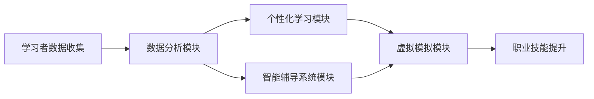

# 如何通过AI实现职业技能的快速升级

> 关键词：AI、职业技能升级、个性化学习、智能辅导、数据分析、虚拟模拟、职业发展

> 摘要：本文围绕如何通过AI实现职业技能的快速升级展开。首先介绍了相关背景，包括目的、预期读者等内容。接着阐述了AI在职业技能升级中的核心概念与联系，深入剖析核心算法原理并给出Python代码示例。通过数学模型和公式进一步解释其内在逻辑，结合项目实战案例详细说明代码实现与解读。探讨了AI在职业技能升级中的实际应用场景，推荐了相关的学习资源、开发工具框架以及论文著作。最后总结未来发展趋势与挑战，解答常见问题并提供扩展阅读与参考资料，旨在为读者全面呈现利用AI实现职业技能快速升级的方法与路径。

## 1. 背景介绍 
### 1.1 目的和范围
在当今快速发展的时代，职业技能的更新换代速度越来越快。传统的职业技能学习方式往往效率低下，难以满足人们快速适应职场变化的需求。本文的目的在于探讨如何借助人工智能（AI）技术来实现职业技能的快速升级，以帮助个人在职业生涯中保持竞争力。

本文的范围涵盖了AI在职业技能升级中的多个方面，包括个性化学习方案的制定、智能辅导系统的应用、基于数据分析的技能提升策略等。同时，通过实际案例和代码示例，展示如何在实际项目中运用AI技术来促进职业技能的快速提升。

### 1.2 预期读者
本文预期读者包括以下几类人群：
- **职场人士**：希望通过学习新技能提升自己在职场上的竞争力，以适应不断变化的工作需求。
- **学生群体**：即将步入职场，希望提前了解如何利用先进技术快速掌握职业技能，为未来的职业发展做好准备。
- **教育工作者**：关注如何将AI技术融入职业教育中，提高教学效果和学生的学习效率。
- **技术开发者**：对AI技术在职业技能提升领域的应用感兴趣，希望了解相关的算法原理和实现方法。

### 1.3 文档结构概述
本文将按照以下结构进行阐述：
- **核心概念与联系**：介绍AI在职业技能升级中的核心概念和它们之间的联系，通过文本示意图和Mermaid流程图进行直观展示。
- **核心算法原理 & 具体操作步骤**：详细讲解AI实现职业技能升级所涉及的核心算法原理，并给出Python源代码示例。
- **数学模型和公式 & 详细讲解 & 举例说明**：运用数学模型和公式解释AI技术的内在逻辑，并通过具体例子进行说明。
- **项目实战：代码实际案例和详细解释说明**：通过实际项目案例，展示如何在开发环境中搭建并实现AI辅助职业技能升级的代码，同时对代码进行详细解读。
- **实际应用场景**：探讨AI在不同职业领域中实现技能快速升级的实际应用场景。
- **工具和资源推荐**：推荐相关的学习资源、开发工具框架以及论文著作，帮助读者进一步深入学习。
- **总结：未来发展趋势与挑战**：总结AI在职业技能升级领域的未来发展趋势，并分析可能面临的挑战。
- **附录：常见问题与解答**：解答读者在利用AI实现职业技能升级过程中可能遇到的常见问题。
- **扩展阅读 & 参考资料**：提供相关的扩展阅读内容和参考资料，方便读者进一步研究。

### 1.4 术语表
#### 1.4.1 核心术语定义
- **人工智能（AI）**：是一门研究如何使计算机能够模拟人类智能的学科，包括机器学习、深度学习、自然语言处理等多个领域。
- **个性化学习**：根据学习者的个体差异，如学习风格、知识水平、兴趣爱好等，定制适合其自身的学习方案。
- **智能辅导系统**：利用AI技术为学习者提供实时的辅导和反馈，帮助他们解决学习过程中遇到的问题。
- **数据分析**：对大量的数据进行收集、整理、分析和解释，以发现其中的规律和趋势。
- **虚拟模拟**：通过计算机技术创建虚拟环境，让学习者在模拟场景中进行实践操作，提高技能水平。

#### 1.4.2 相关概念解释
- **机器学习**：是AI的一个重要分支，通过让计算机从数据中自动学习模式和规律，从而实现预测和决策等功能。
- **深度学习**：是机器学习的一种特殊形式，利用多层神经网络对数据进行深度特征提取和学习，在图像识别、语音识别等领域取得了显著成果。
- **自然语言处理**：是AI的一个领域，主要研究如何让计算机理解和处理人类语言，包括文本分类、机器翻译、情感分析等任务。

#### 1.4.3 缩略词列表
- **AI**：Artificial Intelligence（人工智能）
- **ML**：Machine Learning（机器学习）
- **DL**：Deep Learning（深度学习）
- **NLP**：Natural Language Processing（自然语言处理）

## 2. 核心概念与联系 

### 核心概念原理
在通过AI实现职业技能快速升级的过程中，涉及到多个核心概念，这些概念相互关联，共同构成了一个完整的体系。

#### 个性化学习
个性化学习是基于学习者的个体特征和学习需求，为其定制专属的学习路径和内容。AI可以通过收集学习者的学习数据，如学习进度、错误率、学习时间等，利用机器学习算法分析这些数据，从而了解学习者的优势和不足，为其推荐适合的学习资源和练习题目。

#### 智能辅导系统
智能辅导系统利用自然语言处理和机器学习技术，为学习者提供实时的辅导和反馈。当学习者遇到问题时，智能辅导系统可以理解问题的含义，并根据知识库中的知识提供相应的解答和建议。同时，它还可以根据学习者的回答情况，调整辅导策略，帮助学习者更好地理解和掌握知识。

#### 数据分析
数据分析在职业技能升级中起着至关重要的作用。通过对学习者的学习数据、职业发展数据等进行分析，可以发现学习者的学习趋势、职业发展瓶颈等问题。AI可以利用数据分析的结果，为学习者制定更加科学合理的学习计划和职业发展策略。

#### 虚拟模拟
虚拟模拟是利用计算机技术创建虚拟环境，让学习者在模拟场景中进行实践操作。通过虚拟模拟，学习者可以在安全、低成本的环境中练习职业技能，提高实践能力。AI可以根据学习者的操作情况，提供实时的反馈和指导，帮助学习者不断改进和提高。

### 架构的文本示意图
```plaintext
        +------------------+
        |  学习者数据收集  |
        +------------------+
                  |
                  v
        +------------------+
        |    数据分析模块   |
        +------------------+
                  |
                  v
 +----------------------+----------------------+
 |                      |                      |
 |  个性化学习模块      |  智能辅导系统模块    |
 |                      |                      |
 +----------------------+----------------------+
                  |
                  v
        +------------------+
        |  虚拟模拟模块    |
        +------------------+
                  |
                  v
        +------------------+
        |  职业技能提升    |
        +------------------+
```

### Mermaid流程图


## 3. 核心算法原理 & 具体操作步骤 

### 核心算法原理
在通过AI实现职业技能快速升级的过程中，常用的核心算法包括机器学习算法和自然语言处理算法。

#### 机器学习算法 - 决策树算法
决策树算法是一种常用的机器学习算法，它可以根据数据的特征进行分类和预测。在个性化学习中，决策树算法可以根据学习者的学习数据，如学习进度、错误率等，对学习者进行分类，从而为其推荐适合的学习资源和练习题目。

以下是一个简单的决策树算法的Python实现示例：
```python
from sklearn.datasets import load_iris
from sklearn.model_selection import train_test_split
from sklearn.tree import DecisionTreeClassifier
from sklearn.metrics import accuracy_score

# 加载数据集
iris = load_iris()
X = iris.data
y = iris.target

# 划分训练集和测试集
X_train, X_test, y_train, y_test = train_test_split(X, y, test_size=0.3, random_state=42)

# 创建决策树分类器
clf = DecisionTreeClassifier()

# 训练模型
clf.fit(X_train, y_train)

# 预测
y_pred = clf.predict(X_test)

# 计算准确率
accuracy = accuracy_score(y_test, y_pred)
print(f"Accuracy: {accuracy}")
```

#### 自然语言处理算法 - 词袋模型
词袋模型是一种简单而有效的自然语言处理算法，它将文本表示为一个向量，向量的每个维度表示一个单词的出现频率。在智能辅导系统中，词袋模型可以将学习者提出的问题表示为向量，然后根据向量的相似度来查找相关的解答和建议。

以下是一个简单的词袋模型的Python实现示例：
```python
from sklearn.feature_extraction.text import CountVectorizer
import numpy as np

# 定义文本数据
corpus = [
    "This is the first document.",
    "This document is the second document.",
    "And this is the third one.",
    "Is this the first document?"
]

# 创建词袋模型
vectorizer = CountVectorizer()
X = vectorizer.fit_transform(corpus)

# 输出特征名
feature_names = vectorizer.get_feature_names_out()
print("Feature names:", feature_names)

# 输出向量表示
print("Vector representation:")
print(X.toarray())
```

### 具体操作步骤
#### 数据收集
首先，需要收集学习者的相关数据，包括学习记录、考试成绩、职业发展信息等。这些数据可以通过学习管理系统、在线测试平台等渠道获取。

#### 数据预处理
对收集到的数据进行预处理，包括数据清洗、特征提取、数据归一化等操作。数据预处理的目的是提高数据的质量，以便后续的算法处理。

#### 模型训练
根据具体的需求选择合适的算法，如决策树算法、词袋模型等，并使用预处理后的数据进行模型训练。

#### 模型评估
使用测试数据对训练好的模型进行评估，计算模型的准确率、召回率等指标，评估模型的性能。

#### 应用部署
将训练好的模型部署到实际应用中，如个性化学习平台、智能辅导系统等，为学习者提供服务。

## 4. 数学模型和公式 & 详细讲解 & 举例说明 

### 决策树算法的数学模型和公式
决策树算法的核心是通过递归地划分数据集，构建一个决策树。在划分数据集时，通常使用信息增益、基尼指数等指标来选择最优的划分特征。

#### 信息增益
信息增益是衡量划分数据集前后信息不确定性减少的程度。设数据集 $D$ 的信息熵为 $H(D)$，特征 $A$ 对数据集 $D$ 的信息增益为 $G(D, A)$，则信息增益的计算公式为：
$$G(D, A) = H(D) - \sum_{v=1}^{V} \frac{|D^v|}{|D|} H(D^v)$$
其中，$V$ 是特征 $A$ 的取值个数，$D^v$ 是特征 $A$ 取值为 $v$ 的样本子集，$|D|$ 和 $|D^v|$ 分别表示数据集 $D$ 和样本子集 $D^v$ 的样本数量。

#### 信息熵
信息熵是衡量数据集不确定性的指标。设数据集 $D$ 中第 $k$ 类样本的比例为 $p_k$，则数据集 $D$ 的信息熵计算公式为：
$$H(D) = - \sum_{k=1}^{K} p_k \log_2 p_k$$
其中，$K$ 是数据集 $D$ 中类别的数量。

### 举例说明
假设有一个数据集 $D$ 包含 10 个样本，分为两类，其中第一类有 6 个样本，第二类有 4 个样本。则数据集 $D$ 的信息熵为：
$$H(D) = - \left( \frac{6}{10} \log_2 \frac{6}{10} + \frac{4}{10} \log_2 \frac{4}{10} \right) \approx 0.971$$

假设现在有一个特征 $A$，它有两个取值 $A_1$ 和 $A_2$。在特征 $A$ 取值为 $A_1$ 的样本子集中，第一类有 4 个样本，第二类有 1 个样本；在特征 $A$ 取值为 $A_2$ 的样本子集中，第一类有 2 个样本，第二类有 3 个样本。则特征 $A$ 对数据集 $D$ 的信息增益为：
$$G(D, A) = H(D) - \left( \frac{5}{10} H(D^{A_1}) + \frac{5}{10} H(D^{A_2}) \right)$$
其中，$H(D^{A_1}) = - \left( \frac{4}{5} \log_2 \frac{4}{5} + \frac{1}{5} \log_2 \frac{1}{5} \right) \approx 0.722$，$H(D^{A_2}) = - \left( \frac{2}{5} \log_2 \frac{2}{5} + \frac{3}{5} \log_2 \frac{3}{5} \right) \approx 0.971$。
$$G(D, A) = 0.971 - \left( \frac{5}{10} \times 0.722 + \frac{5}{10} \times 0.971 \right) \approx 0.124$$

### 词袋模型的数学模型和公式
词袋模型将文本表示为一个向量，向量的每个维度表示一个单词的出现频率。设文本 $T$ 中单词 $w_i$ 的出现频率为 $f_{i}$，则文本 $T$ 的词袋向量 $\mathbf{v}$ 可以表示为：
$$\mathbf{v} = [f_1, f_2, \cdots, f_n]$$
其中，$n$ 是词汇表的大小。

### 举例说明
假设有一个词汇表 $V = \{ "this", "is", "the", "first", "document", "second", "third", "one" \}$，文本 $T = "This is the first document."$。则文本 $T$ 的词袋向量为：
$$\mathbf{v} = [1, 1, 1, 1, 1, 0, 0, 0]$$

## 5. 项目实战：代码实际案例和详细解释说明 

### 5.1  开发环境搭建
#### 安装Python
首先，需要安装Python开发环境。可以从Python官方网站（https://www.python.org/downloads/） 下载适合自己操作系统的Python版本，并按照安装向导进行安装。

#### 安装必要的库
在通过AI实现职业技能快速升级的项目中，需要安装一些必要的Python库，如`scikit-learn`、`numpy`、`pandas`等。可以使用以下命令进行安装：
```sh
pip install scikit-learn numpy pandas
```

### 5.2  源代码详细实现和代码解读
以下是一个简单的基于决策树算法的个性化学习推荐系统的Python代码示例：
```python
import pandas as pd
from sklearn.tree import DecisionTreeClassifier
from sklearn.model_selection import train_test_split
from sklearn.metrics import accuracy_score

# 加载数据集
data = pd.read_csv('learning_data.csv')

# 划分特征和标签
X = data.drop('recommended_course', axis=1)
y = data['recommended_course']

# 划分训练集和测试集
X_train, X_test, y_train, y_test = train_test_split(X, y, test_size=0.3, random_state=42)

# 创建决策树分类器
clf = DecisionTreeClassifier()

# 训练模型
clf.fit(X_train, y_train)

# 预测
y_pred = clf.predict(X_test)

# 计算准确率
accuracy = accuracy_score(y_test, y_pred)
print(f"Accuracy: {accuracy}")

# 为新用户进行课程推荐
new_user = pd.DataFrame({
    'learning_progress': [0.5],
    'error_rate': [0.2],
    'learning_time': [20]
})
recommended_course = clf.predict(new_user)
print(f"Recommended course for new user: {recommended_course[0]}")
```

### 代码解读与分析
#### 数据加载
```python
data = pd.read_csv('learning_data.csv')
```
使用`pandas`库的`read_csv`函数加载学习数据，数据文件为`learning_data.csv`。

#### 特征和标签划分
```python
X = data.drop('recommended_course', axis=1)
y = data['recommended_course']
```
将数据集中的`recommended_course`列作为标签，其余列作为特征。

#### 训练集和测试集划分
```python
X_train, X_test, y_train, y_test = train_test_split(X, y, test_size=0.3, random_state=42)
```
使用`sklearn`库的`train_test_split`函数将数据集划分为训练集和测试集，测试集占比为 30%。

#### 模型训练
```python
clf = DecisionTreeClassifier()
clf.fit(X_train, y_train)
```
创建决策树分类器，并使用训练集数据进行模型训练。

#### 模型预测和评估
```python
y_pred = clf.predict(X_test)
accuracy = accuracy_score(y_test, y_pred)
print(f"Accuracy: {accuracy}")
```
使用训练好的模型对测试集数据进行预测，并计算预测的准确率。

#### 新用户课程推荐
```python
new_user = pd.DataFrame({
    'learning_progress': [0.5],
    'error_rate': [0.2],
    'learning_time': [20]
})
recommended_course = clf.predict(new_user)
print(f"Recommended course for new user: {recommended_course[0]}")
```
创建一个新用户的数据，使用训练好的模型为新用户进行课程推荐。

## 6. 实际应用场景 
### 软件开发领域
在软件开发领域，AI可以帮助开发者快速升级职业技能。例如，智能代码编辑器可以利用AI技术提供代码自动补全、错误提示、代码优化建议等功能，帮助开发者提高编程效率和代码质量。同时，个性化学习平台可以根据开发者的技能水平和学习需求，为其推荐适合的学习资源和项目实践，加速技能提升。

### 医疗领域
在医疗领域，AI可以辅助医生进行技能提升。例如，虚拟模拟系统可以创建各种疾病的诊断和治疗场景，让医生在模拟环境中进行实践操作，提高临床技能。智能辅导系统可以根据医生的诊断结果和治疗方案，提供实时的反馈和建议，帮助医生不断改进和提高。

### 金融领域
在金融领域，AI可以帮助金融从业者快速掌握新的金融知识和技能。例如，智能投顾系统可以利用AI技术分析市场数据和客户需求，为金融从业者提供投资建议和决策支持。同时，个性化学习平台可以根据金融从业者的职业发展目标和知识短板，为其定制专属的学习计划和培训课程。

### 教育领域
在教育领域，AI可以为教师和学生提供更好的教学和学习支持。例如，智能辅导系统可以为学生提供个性化的学习辅导，帮助他们解决学习过程中遇到的问题。教师可以利用AI技术分析学生的学习数据，了解学生的学习情况和需求，调整教学策略，提高教学效果。

## 7. 工具和资源推荐
### 7.1 学习资源推荐
#### 7.1.1 书籍推荐
- 《Python机器学习》：全面介绍了Python在机器学习领域的应用，包括各种机器学习算法的原理和实现。
- 《深度学习》：由深度学习领域的三位先驱所著，是深度学习领域的经典教材，深入讲解了深度学习的理论和实践。
- 《自然语言处理入门》：适合初学者的自然语言处理教材，介绍了自然语言处理的基本概念和常用算法。

#### 7.1.2 在线课程
- Coursera上的“机器学习”课程：由斯坦福大学教授Andrew Ng主讲，是机器学习领域的经典课程，系统地介绍了机器学习的基本概念和算法。
- edX上的“深度学习”课程：由麻省理工学院等知名高校的教授授课，深入讲解了深度学习的理论和实践。
- 中国大学MOOC上的“自然语言处理”课程：由国内高校的专家授课，介绍了自然语言处理的基本概念和常用技术。

#### 7.1.3 技术博客和网站
- Medium：一个汇聚了众多技术专家和开发者的博客平台，上面有很多关于AI和机器学习的优质文章。
- Towards Data Science：专注于数据科学和机器学习领域的技术博客，提供了大量的技术文章和案例分析。
- Kaggle：一个数据科学竞赛平台，上面有很多关于AI和机器学习的数据集和开源代码，可以学习和参考。

### 7.2 开发工具框架推荐
#### 7.2.1 IDE和编辑器
- PyCharm：一款专业的Python集成开发环境，提供了丰富的代码编辑、调试和部署功能。
- Jupyter Notebook：一个交互式的开发环境，适合进行数据探索和模型实验，方便代码的编写和分享。
- Visual Studio Code：一款轻量级的代码编辑器，支持多种编程语言，有丰富的插件可以扩展功能。

#### 7.2.2 调试和性能分析工具
- PDB：Python自带的调试工具，可以帮助开发者定位代码中的问题。
- cProfile：Python的性能分析工具，可以分析代码的运行时间和内存使用情况。
- TensorBoard：TensorFlow的可视化工具，可以帮助开发者可视化模型的训练过程和性能指标。

#### 7.2.3 相关框架和库
- Scikit-learn：一个简单易用的机器学习库，提供了各种机器学习算法的实现和工具。
- TensorFlow：一个开源的深度学习框架，广泛应用于图像识别、语音识别等领域。
- PyTorch：一个基于Python的深度学习框架，具有动态计算图的特点，适合快速迭代和实验。

### 7.3 相关论文著作推荐
#### 7.3.1 经典论文
- “Gradient-Based Learning Applied to Document Recognition”：由Yann LeCun等人发表的论文，介绍了卷积神经网络（CNN）在手写数字识别中的应用，是深度学习领域的经典论文之一。
- “Attention Is All You Need”：由Google团队发表的论文，提出了Transformer模型，是自然语言处理领域的重要突破。
- “ImageNet Classification with Deep Convolutional Neural Networks”：由Alex Krizhevsky等人发表的论文，介绍了AlexNet模型，在图像识别领域取得了巨大成功。

#### 7.3.2 最新研究成果
- 关注顶级学术会议，如NeurIPS（神经信息处理系统大会）、ICML（国际机器学习会议）、ACL（计算语言学协会年会）等，了解AI领域的最新研究成果。
- 查阅知名学术期刊，如Journal of Artificial Intelligence Research（JAIR）、Artificial Intelligence等，获取高质量的研究论文。

#### 7.3.3 应用案例分析
- 研究一些成功的AI应用案例，如AlphaGo在围棋领域的应用、Siri在语音助手领域的应用等，了解AI技术在实际场景中的应用方法和效果。

## 8. 总结：未来发展趋势与挑战
### 未来发展趋势
- **更加个性化的学习体验**：随着AI技术的不断发展，未来的个性化学习系统将能够更加精准地了解学习者的需求和特点，为其提供更加个性化的学习方案和辅导服务。
- **智能虚拟助手的广泛应用**：智能虚拟助手将在职业技能升级中发挥越来越重要的作用，它们可以与学习者进行自然的对话，提供实时的帮助和支持。
- **跨领域的技能融合**：未来的职业发展需要具备跨领域的技能，AI技术将有助于促进不同领域技能的融合，帮助学习者快速掌握多领域的知识和技能。
- **与现实世界的深度融合**：虚拟模拟技术将与现实世界更加紧密地结合，学习者可以在现实场景中进行虚拟实践，提高技能的实用性和适应性。

### 挑战
- **数据隐私和安全问题**：在收集和使用学习者的个人数据时，需要确保数据的隐私和安全，防止数据泄露和滥用。
- **算法的可解释性**：AI算法的黑盒性质使得其决策过程难以解释，在职业技能升级领域，需要提高算法的可解释性，让学习者和教育者能够理解和信任算法的推荐结果。
- **技术的普及和应用成本**：虽然AI技术发展迅速，但在一些地区和领域，技术的普及程度还较低，同时应用AI技术的成本也较高，需要降低技术门槛和成本，让更多的人受益。
- **伦理和道德问题**：AI技术的应用可能会带来一些伦理和道德问题，如算法歧视、职业替代等，需要制定相应的伦理准则和政策，引导AI技术的健康发展。

## 9. 附录：常见问题与解答
### 问题1：AI技术在职业技能升级中的效果如何保证？
答：要保证AI技术在职业技能升级中的效果，需要从多个方面入手。首先，要确保数据的质量和准确性，因为AI算法的训练依赖于大量的数据。其次，选择合适的算法和模型，并进行充分的训练和优化。此外，还需要对AI系统进行持续的评估和改进，根据学习者的反馈和实际应用情况进行调整。

### 问题2：使用AI技术进行职业技能升级是否会导致人类的技能退化？
答：不会。AI技术的目的是辅助人类进行技能升级，而不是替代人类。通过AI技术，学习者可以更加高效地获取知识和技能，同时AI系统可以提供实时的反馈和指导，帮助学习者不断改进和提高。在实际应用中，人类仍然需要发挥自己的创造力和判断力，将所学的技能应用到实际工作中。

### 问题3：如何选择适合自己的AI学习工具和资源？
答：选择适合自己的AI学习工具和资源需要考虑自己的学习目标、技能水平和学习风格等因素。如果是初学者，可以选择一些基础的教材和在线课程，如《Python机器学习》和Coursera上的“机器学习”课程。如果已经有一定的基础，可以选择一些深入的研究论文和开源代码，如NeurIPS会议上的最新研究成果和Kaggle上的开源项目。同时，还可以参考其他学习者的评价和推荐，选择口碑较好的学习工具和资源。

### 问题4：AI技术在职业技能升级中的应用是否存在局限性？
答：存在一定的局限性。例如，AI算法的决策过程可能受到数据偏差和噪声的影响，导致推荐结果不准确。此外，AI技术目前还难以完全理解人类的情感和意图，在一些需要情感交流和人文关怀的场景中应用效果有限。同时，AI技术的应用也需要一定的技术和资源支持，对于一些资源匮乏的地区和人群来说，可能难以实现。

## 10. 扩展阅读 & 参考资料
### 扩展阅读
- 《AI未来进行式》：李开复和王咏刚所著，探讨了AI技术对未来社会和职业发展的影响。
- 《智能时代》：吴军所著，介绍了AI技术在各个领域的应用和发展趋势。
- 《人类简史：从动物到上帝》：尤瓦尔·赫拉利所著，从人类发展的角度探讨了技术对人类社会的影响，包括AI技术的发展。

### 参考资料
- 相关学术论文和研究报告，如IEEE、ACM等学术组织发表的论文。
- 行业报告和统计数据，如Gartner、IDC等机构发布的报告。
- 官方文档和技术手册，如Scikit-learn、TensorFlow等框架的官方文档。