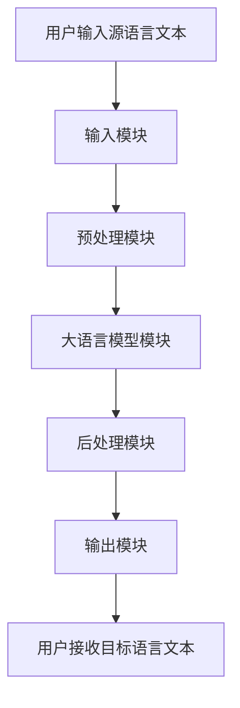

# 实时语言转换AI Agent：LLM在多语言环境中的应用

> 关键词：实时语言转换、AI Agent、大语言模型（LLM）、多语言环境、自然语言处理

> 摘要：本文聚焦于实时语言转换AI Agent在多语言环境中的应用。详细介绍了相关核心概念，深入剖析其核心算法原理，借助数学模型进行阐释，并通过实际案例展示了开发与实现过程。探讨了该技术在多种场景下的应用，同时推荐了学习资源、开发工具以及相关论文著作。最后总结了其未来发展趋势与面临的挑战，旨在为相关领域的研究者和开发者提供全面而深入的参考。

## 1. 背景介绍 
### 1.1 目的和范围
在全球化的大背景下，不同语言之间的交流障碍成为了制约信息流通和文化交流的重要因素。实时语言转换AI Agent的出现为解决这一问题提供了有效的途径。本文章的目的在于深入探讨基于大语言模型（LLM）的实时语言转换AI Agent在多语言环境中的应用原理、实现方法以及实际应用场景。范围涵盖了从核心概念的讲解到具体算法的实现，再到实际项目的开发与应用案例分析，以及相关学习资源和工具的推荐等多个方面。

### 1.2 预期读者
本文预期读者包括自然语言处理领域的研究者、人工智能开发者、对多语言技术感兴趣的技术爱好者以及相关行业的从业者。无论是想要深入了解实时语言转换技术原理的专业人士，还是希望将该技术应用到实际项目中的开发者，都能从本文中获得有价值的信息。

### 1.3 文档结构概述
本文首先介绍了实时语言转换AI Agent及相关概念的背景知识，包括术语定义和相关概念解释。接着详细阐述了核心概念及其联系，通过文本示意图和Mermaid流程图进行直观展示。然后深入讲解核心算法原理，使用Python源代码进行详细阐述，并结合数学模型和公式进行理论分析。随后通过项目实战展示了代码的实际实现过程和详细解读。之后探讨了该技术在不同场景下的实际应用。再推荐了相关的学习资源、开发工具和论文著作。最后总结了未来发展趋势与挑战，并提供了常见问题的解答和扩展阅读的参考资料。

### 1.4 术语表
#### 1.4.1 核心术语定义
- **实时语言转换AI Agent**：一种能够实时将一种自然语言转换为另一种自然语言的人工智能代理，它可以理解输入语言的语义，并生成相应的目标语言输出。
- **大语言模型（LLM）**：基于深度学习的大规模语言模型，通过在大量文本数据上进行训练，学习语言的模式和规律，能够生成自然流畅的文本。
- **自然语言处理（NLP）**：研究如何让计算机理解、处理和生成自然语言的技术领域。
- **多语言环境**：包含多种不同自然语言的使用场景，如国际会议、跨国商务交流等。

#### 1.4.2 相关概念解释
- **AI Agent**：是一种能够感知环境、进行决策并采取行动的智能实体。在实时语言转换中，AI Agent通过接收输入的语言信息，利用内部的语言模型进行处理，然后输出转换后的语言信息。
- **语言模型**：是一种对语言进行建模的统计模型，它可以预测一个词序列出现的概率。大语言模型通常具有更深的神经网络结构和更多的参数，能够更好地捕捉语言的语义和上下文信息。

#### 1.4.3 缩略词列表
- **LLM**：Large Language Model（大语言模型）
- **NLP**：Natural Language Processing（自然语言处理）

## 2. 核心概念与联系 

### 核心概念原理
实时语言转换AI Agent的核心原理是基于大语言模型（LLM）的自然语言处理技术。大语言模型通过在大规模的文本语料库上进行训练，学习到语言的语法、语义和上下文信息。当AI Agent接收到输入的源语言文本时，它首先对文本进行分词、词性标注等预处理操作，将文本转换为模型能够处理的格式。然后，大语言模型根据输入的文本信息，结合其内部学习到的语言知识，预测出目标语言的文本序列。最后，AI Agent对生成的目标语言文本进行后处理，如去除不必要的符号、调整语序等，以生成自然流畅的翻译结果。

### 架构的文本示意图
实时语言转换AI Agent的架构主要包括以下几个部分：
1. **输入模块**：负责接收用户输入的源语言文本。
2. **预处理模块**：对输入的文本进行分词、词性标注、命名实体识别等预处理操作。
3. **大语言模型模块**：基于训练好的大语言模型，对预处理后的文本进行语言转换。
4. **后处理模块**：对大语言模型生成的目标语言文本进行后处理，如去除冗余信息、调整语序等。
5. **输出模块**：将后处理后的目标语言文本输出给用户。

### Mermaid流程图


## 3. 核心算法原理 & 具体操作步骤 

### 核心算法原理
实时语言转换AI Agent的核心算法基于大语言模型的序列到序列（Seq2Seq）模型。Seq2Seq模型由编码器（Encoder）和解码器（Decoder）两部分组成。编码器的作用是将输入的源语言文本序列转换为一个固定长度的向量表示，这个向量表示包含了输入文本的语义信息。解码器则根据这个向量表示，逐步生成目标语言的文本序列。

在训练过程中，模型通过最小化预测的目标语言文本序列与真实的目标语言文本序列之间的损失函数来学习语言的模式和规律。常用的损失函数包括交叉熵损失函数等。

### 具体操作步骤
1. **数据收集与预处理**：收集大量的平行语料，即包含源语言文本和对应的目标语言文本的数据集。对数据进行清洗、分词、标注等预处理操作，将文本转换为模型能够处理的格式。
2. **模型训练**：使用预处理后的数据集对Seq2Seq模型进行训练。在训练过程中，不断调整模型的参数，以最小化损失函数。
3. **模型评估**：使用测试数据集对训练好的模型进行评估，计算模型的准确率、召回率等指标，评估模型的性能。
4. **部署与应用**：将训练好的模型部署到实际应用环境中，实现实时语言转换功能。

### Python源代码详细阐述
以下是一个简单的基于PyTorch实现的Seq2Seq模型示例：

```python
import torch
import torch.nn as nn
import torch.optim as optim

# 定义编码器
class Encoder(nn.Module):
    def __init__(self, input_size, hidden_size):
        super(Encoder, self).__init__()
        self.hidden_size = hidden_size
        self.embedding = nn.Embedding(input_size, hidden_size)
        self.gru = nn.GRU(hidden_size, hidden_size)

    def forward(self, input, hidden):
        embedded = self.embedding(input).view(1, 1, -1)
        output = embedded
        output, hidden = self.gru(output, hidden)
        return output, hidden

    def initHidden(self):
        return torch.zeros(1, 1, self.hidden_size)

# 定义解码器
class Decoder(nn.Module):
    def __init__(self, hidden_size, output_size):
        super(Decoder, self).__init__()
        self.hidden_size = hidden_size
        self.embedding = nn.Embedding(output_size, hidden_size)
        self.gru = nn.GRU(hidden_size, hidden_size)
        self.out = nn.Linear(hidden_size, output_size)
        self.softmax = nn.LogSoftmax(dim=1)

    def forward(self, input, hidden):
        output = self.embedding(input).view(1, 1, -1)
        output = nn.functional.relu(output)
        output, hidden = self.gru(output, hidden)
        output = self.softmax(self.out(output[0]))
        return output, hidden

    def initHidden(self):
        return torch.zeros(1, 1, self.hidden_size)

# 训练模型
def train(input_tensor, target_tensor, encoder, decoder, encoder_optimizer, decoder_optimizer, criterion):
    encoder_hidden = encoder.initHidden()
    encoder_optimizer.zero_grad()
    decoder_optimizer.zero_grad()
    input_length = input_tensor.size(0)
    target_length = target_tensor.size(0)
    encoder_outputs = torch.zeros(input_length, encoder.hidden_size)
    loss = 0
    for ei in range(input_length):
        encoder_output, encoder_hidden = encoder(input_tensor[ei], encoder_hidden)
        encoder_outputs[ei] = encoder_output[0, 0]
    decoder_input = torch.tensor([[0]])
    decoder_hidden = encoder_hidden
    for di in range(target_length):
        decoder_output, decoder_hidden = decoder(decoder_input, decoder_hidden)
        topv, topi = decoder_output.topk(1)
        decoder_input = topi.squeeze().detach()
        loss += criterion(decoder_output, target_tensor[di].unsqueeze(0))
        if decoder_input.item() == 1:
            break
    loss.backward()
    encoder_optimizer.step()
    decoder_optimizer.step()
    return loss.item() / target_length
```

## 4. 数学模型和公式 & 详细讲解 & 举例说明 

### 数学模型
Seq2Seq模型的数学模型可以表示为：

$$P(y_1, y_2, \cdots, y_T | x_1, x_2, \cdots, x_S) = \prod_{t=1}^{T} P(y_t | y_1, y_2, \cdots, y_{t-1}, \mathbf{c})$$

其中，$x_1, x_2, \cdots, x_S$ 是输入的源语言文本序列，$y_1, y_2, \cdots, y_T$ 是输出的目标语言文本序列，$\mathbf{c}$ 是编码器生成的上下文向量。

### 详细讲解
- **编码器**：编码器的作用是将输入的源语言文本序列 $x_1, x_2, \cdots, x_S$ 转换为上下文向量 $\mathbf{c}$。编码器通常使用循环神经网络（RNN）或其变体，如长短期记忆网络（LSTM）、门控循环单元（GRU）等。在每个时间步 $s$，编码器根据输入 $x_s$ 和上一个时间步的隐藏状态 $h_{s-1}$ 计算当前时间步的隐藏状态 $h_s$：

$$h_s = f(x_s, h_{s-1})$$

其中，$f$ 是循环神经网络的转移函数。最后，将最后一个时间步的隐藏状态 $h_S$ 作为上下文向量 $\mathbf{c}$。

- **解码器**：解码器根据上下文向量 $\mathbf{c}$ 和之前生成的目标语言文本序列 $y_1, y_2, \cdots, y_{t-1}$ 预测当前时间步的目标语言单词 $y_t$。解码器同样使用循环神经网络，在每个时间步 $t$，解码器根据输入 $y_{t-1}$ 和上一个时间步的隐藏状态 $h_{t-1}$ 计算当前时间步的隐藏状态 $h_t$：

$$h_t = g(y_{t-1}, h_{t-1}, \mathbf{c})$$

其中，$g$ 是解码器的转移函数。然后，根据隐藏状态 $h_t$ 计算当前时间步的输出概率分布 $P(y_t | y_1, y_2, \cdots, y_{t-1}, \mathbf{c})$：

$$P(y_t | y_1, y_2, \cdots, y_{t-1}, \mathbf{c}) = \text{softmax}(W h_t + b)$$

其中，$W$ 和 $b$ 是线性变换的参数。

### 举例说明
假设输入的源语言文本是 “Hello”，目标语言是中文，对应的目标语言文本是 “你好”。编码器将 “Hello” 转换为上下文向量 $\mathbf{c}$，解码器根据 $\mathbf{c}$ 逐步生成 “你好”。在第一个时间步，解码器根据 $\mathbf{c}$ 预测出 “你”，在第二个时间步，解码器根据 $\mathbf{c}$ 和 “你” 预测出 “好”。

## 5. 项目实战：代码实际案例和详细解释说明 

### 5.1  开发环境搭建
1. **安装Python**：确保你的系统中安装了Python 3.x版本。
2. **安装PyTorch**：根据你的系统和CUDA版本，选择合适的PyTorch版本进行安装。可以使用以下命令安装：
```sh
pip install torch torchvision
```
3. **安装其他依赖库**：安装NLTK、NumPy等常用的自然语言处理和数值计算库。
```sh
pip install nltk numpy
```

### 5.2  源代码详细实现和代码解读
以下是一个完整的实时语言转换项目的实现代码：

```python
import torch
import torch.nn as nn
import torch.optim as optim
import random
import nltk
nltk.download('punkt')

# 定义编码器
class Encoder(nn.Module):
    def __init__(self, input_size, hidden_size):
        super(Encoder, self).__init__()
        self.hidden_size = hidden_size
        self.embedding = nn.Embedding(input_size, hidden_size)
        self.gru = nn.GRU(hidden_size, hidden_size)

    def forward(self, input, hidden):
        embedded = self.embedding(input).view(1, 1, -1)
        output = embedded
        output, hidden = self.gru(output, hidden)
        return output, hidden

    def initHidden(self):
        return torch.zeros(1, 1, self.hidden_size)

# 定义解码器
class Decoder(nn.Module):
    def __init__(self, hidden_size, output_size):
        super(Decoder, self).__init__()
        self.hidden_size = hidden_size
        self.embedding = nn.Embedding(output_size, hidden_size)
        self.gru = nn.GRU(hidden_size, hidden_size)
        self.out = nn.Linear(hidden_size, output_size)
        self.softmax = nn.LogSoftmax(dim=1)

    def forward(self, input, hidden):
        output = self.embedding(input).view(1, 1, -1)
        output = nn.functional.relu(output)
        output, hidden = self.gru(output, hidden)
        output = self.softmax(self.out(output[0]))
        return output, hidden

    def initHidden(self):
        return torch.zeros(1, 1, self.hidden_size)

# 训练模型
def train(input_tensor, target_tensor, encoder, decoder, encoder_optimizer, decoder_optimizer, criterion):
    encoder_hidden = encoder.initHidden()
    encoder_optimizer.zero_grad()
    decoder_optimizer.zero_grad()
    input_length = input_tensor.size(0)
    target_length = target_tensor.size(0)
    encoder_outputs = torch.zeros(input_length, encoder.hidden_size)
    loss = 0
    for ei in range(input_length):
        encoder_output, encoder_hidden = encoder(input_tensor[ei], encoder_hidden)
        encoder_outputs[ei] = encoder_output[0, 0]
    decoder_input = torch.tensor([[0]])
    decoder_hidden = encoder_hidden
    for di in range(target_length):
        decoder_output, decoder_hidden = decoder(decoder_input, decoder_hidden)
        topv, topi = decoder_output.topk(1)
        decoder_input = topi.squeeze().detach()
        loss += criterion(decoder_output, target_tensor[di].unsqueeze(0))
        if decoder_input.item() == 1:
            break
    loss.backward()
    encoder_optimizer.step()
    decoder_optimizer.step()
    return loss.item() / target_length

# 数据预处理
def prepare_sequence(seq, to_ix):
    idxs = [to_ix[w] for w in seq]
    return torch.tensor(idxs, dtype=torch.long)

# 示例数据
input_sentences = ["Hello", "How are you"]
target_sentences = ["你好", "你好吗"]

# 构建词汇表
input_vocab = set()
target_vocab = set()
for sentence in input_sentences:
    input_vocab.update(nltk.word_tokenize(sentence))
for sentence in target_sentences:
    target_vocab.update(list(sentence))

input_vocab = sorted(input_vocab)
target_vocab = sorted(target_vocab)

input_to_ix = {word: i for i, word in enumerate(input_vocab)}
target_to_ix = {word: i for i, word in enumerate(target_vocab)}

# 转换为张量
input_tensors = [prepare_sequence(nltk.word_tokenize(sentence), input_to_ix) for sentence in input_sentences]
target_tensors = [prepare_sequence(list(sentence), target_to_ix) for sentence in target_sentences]

# 初始化模型
hidden_size = 256
encoder = Encoder(len(input_vocab), hidden_size)
decoder = Decoder(hidden_size, len(target_vocab))

# 定义优化器和损失函数
encoder_optimizer = optim.SGD(encoder.parameters(), lr=0.01)
decoder_optimizer = optim.SGD(decoder.parameters(), lr=0.01)
criterion = nn.NLLLoss()

# 训练模型
n_iters = 1000
for iter in range(1, n_iters + 1):
    training_pair = random.choice(list(zip(input_tensors, target_tensors)))
    input_tensor = training_pair[0]
    target_tensor = training_pair[1]
    loss = train(input_tensor, target_tensor, encoder, decoder, encoder_optimizer, decoder_optimizer, criterion)
    if iter % 100 == 0:
        print(f'Iter {iter}: Loss = {loss}')
```

### 5.3  代码解读与分析
1. **编码器和解码器定义**：`Encoder` 类和 `Decoder` 类分别定义了编码器和解码器的结构。编码器使用 `nn.Embedding` 层将输入的单词转换为向量表示，然后使用 `nn.GRU` 层进行序列编码。解码器同样使用 `nn.Embedding` 层和 `nn.GRU` 层，最后使用 `nn.Linear` 层和 `nn.LogSoftmax` 层输出预测的单词概率分布。
2. **训练函数**：`train` 函数实现了模型的训练过程。在训练过程中，首先将输入序列通过编码器得到上下文向量，然后解码器根据上下文向量逐步生成目标序列。计算预测结果与真实结果之间的损失，并通过反向传播更新模型的参数。
3. **数据预处理**：`prepare_sequence` 函数将输入的文本序列转换为模型能够处理的张量。同时，构建了输入和目标语言的词汇表，并将文本序列转换为对应的索引序列。
4. **模型初始化和训练**：初始化编码器、解码器、优化器和损失函数，然后进行多轮训练。在每一轮训练中，随机选择一个训练样本进行训练，并输出当前的损失值。

## 6. 实际应用场景 
### 国际会议
在国际会议中，实时语言转换AI Agent可以为参会者提供实时的语言翻译服务。参会者可以使用自己的母语进行发言，AI Agent将其实时翻译成其他语言，让不同语言背景的参会者都能理解发言内容，提高会议的交流效率。

### 跨国商务交流
在跨国商务谈判、商务会议等场景中，实时语言转换AI Agent可以帮助双方克服语言障碍，实现顺畅的沟通。双方可以使用自己熟悉的语言进行交流，AI Agent实时将语言进行转换，确保信息的准确传递，促进商务合作的顺利进行。

### 旅游
在旅游过程中，实时语言转换AI Agent可以帮助游客解决语言交流问题。游客可以使用AI Agent将自己的需求翻译成当地语言，与当地人进行交流，获取旅游信息、问路、点餐等，提高旅游的便利性和体验感。

### 教育
在教育领域，实时语言转换AI Agent可以为学生提供多语言学习的支持。学生可以使用AI Agent将学习资料翻译成自己熟悉的语言，帮助理解学习内容。同时，AI Agent还可以提供实时的语言翻译练习，提高学生的语言能力。

## 7. 工具和资源推荐
### 7.1 学习资源推荐
#### 7.1.1 书籍推荐
- 《深度学习》（Deep Learning）：由Ian Goodfellow、Yoshua Bengio和Aaron Courville合著，是深度学习领域的经典教材，涵盖了深度学习的基本原理、算法和应用。
- 《自然语言处理入门》：介绍了自然语言处理的基本概念、算法和技术，适合初学者入门。
- 《Python自然语言处理》（Natural Language Processing with Python）：详细介绍了使用Python进行自然语言处理的方法和技术，提供了丰富的代码示例。

#### 7.1.2 在线课程
- Coursera上的“深度学习专项课程”（Deep Learning Specialization）：由Andrew Ng教授授课，系统地介绍了深度学习的理论和实践。
- edX上的“自然语言处理”（Natural Language Processing）课程：提供了自然语言处理的深入学习内容，包括语言模型、机器翻译等。
- 哔哩哔哩（Bilibili）上有很多关于自然语言处理和深度学习的视频教程，适合初学者快速入门。

#### 7.1.3 技术博客和网站
- Medium：有很多技术博主分享自然语言处理和人工智能领域的最新研究成果和实践经验。
- arXiv：是一个预印本平台，提供了大量的学术论文，包括自然语言处理和深度学习领域的最新研究。
- Hugging Face：是一个专注于自然语言处理的开源平台，提供了丰富的预训练模型和工具，以及相关的技术文档和教程。

### 7.2 开发工具框架推荐
#### 7.2.1 IDE和编辑器
- PyCharm：是一款专门为Python开发设计的集成开发环境（IDE），提供了丰富的代码编辑、调试和版本控制等功能。
- Visual Studio Code：是一款轻量级的代码编辑器，支持多种编程语言，通过安装Python扩展可以方便地进行Python开发。
- Jupyter Notebook：是一个交互式的开发环境，适合进行数据分析和模型训练等工作，可以实时查看代码的运行结果。

#### 7.2.2 调试和性能分析工具
- PyTorch Profiler：是PyTorch官方提供的性能分析工具，可以帮助开发者分析模型的性能瓶颈，优化代码性能。
- TensorBoard：是TensorFlow提供的可视化工具，也可以与PyTorch结合使用，用于可视化模型的训练过程和性能指标。
- cProfile：是Python标准库中的性能分析工具，可以帮助开发者分析代码的执行时间和调用关系。

#### 7.2.3 相关框架和库
- PyTorch：是一个开源的深度学习框架，提供了丰富的神经网络层和优化算法，支持GPU加速，广泛应用于自然语言处理和计算机视觉等领域。
- TensorFlow：是另一个流行的深度学习框架，具有强大的分布式训练和模型部署功能。
- Transformers：是Hugging Face开发的一个自然语言处理库，提供了大量的预训练模型，如BERT、GPT等，可以方便地进行文本分类、机器翻译等任务。

### 7.3 相关论文著作推荐
#### 7.3.1 经典论文
- “Attention Is All You Need”：提出了Transformer架构，是自然语言处理领域的里程碑式论文，为后续的大语言模型发展奠定了基础。
- “Neural Machine Translation by Jointly Learning to Align and Translate”：提出了基于注意力机制的神经机器翻译模型，显著提高了机器翻译的性能。
- “BERT: Pre-training of Deep Bidirectional Transformers for Language Understanding”：介绍了BERT模型，通过预训练和微调的方式在多个自然语言处理任务中取得了优异的成绩。

#### 7.3.2 最新研究成果
- 关注顶级学术会议，如ACL（Association for Computational Linguistics）、EMNLP（Conference on Empirical Methods in Natural Language Processing）等，这些会议上会发表自然语言处理领域的最新研究成果。
- 关注知名学术期刊，如Journal of Artificial Intelligence Research（JAIR）、Computational Linguistics等，这些期刊会发表高质量的自然语言处理研究论文。

#### 7.3.3 应用案例分析
- 可以参考一些实际应用案例的分析文章，了解实时语言转换AI Agent在不同场景下的应用实践和经验教训。例如，一些大型科技公司在国际会议、跨国商务等场景中应用实时语言转换技术的案例分析。

## 8. 总结：未来发展趋势与挑战
### 未来发展趋势
1. **更高的翻译质量**：随着大语言模型的不断发展和优化，实时语言转换的翻译质量将不断提高，更加准确地传达语义和语境信息。
2. **多模态融合**：将语言信息与图像、音频等多模态信息进行融合，实现更加丰富和自然的交互体验。例如，在视频会议中同时进行语言翻译和表情识别等。
3. **个性化定制**：根据用户的语言习惯、专业领域等个性化需求，提供定制化的语言转换服务，提高用户的满意度。
4. **边缘计算和端侧部署**：将实时语言转换模型部署到边缘设备和终端设备上，减少数据传输延迟，提高实时性和隐私性。

### 挑战
1. **语言多样性和文化差异**：世界上存在着数千种语言和丰富的文化差异，如何准确地处理不同语言和文化背景下的语言转换是一个巨大的挑战。
2. **数据隐私和安全**：实时语言转换涉及到大量的用户语言数据，如何保护用户的数据隐私和安全是一个重要的问题。
3. **计算资源和效率**：大语言模型通常需要大量的计算资源和时间进行训练和推理，如何提高模型的计算效率和降低资源消耗是一个亟待解决的问题。
4. **伦理和法律问题**：实时语言转换技术的应用可能会带来一些伦理和法律问题，如虚假信息传播、翻译误导等，需要建立相应的规范和法律制度来进行约束。

## 9. 附录：常见问题与解答
### 问题1：实时语言转换AI Agent的翻译准确率如何保证？
解答：实时语言转换AI Agent的翻译准确率主要通过以下几个方面来保证：一是使用大规模的平行语料进行模型训练，让模型学习到丰富的语言知识；二是采用先进的深度学习模型和算法，如Transformer架构等，提高模型的性能；三是进行模型评估和优化，不断调整模型的参数，提高翻译的准确率。

### 问题2：实时语言转换AI Agent能否处理口语化和方言？
解答：目前的实时语言转换AI Agent在处理口语化和方言方面还存在一定的挑战。口语化和方言的表达方式比较灵活和多样化，缺乏统一的规范，模型需要更多的相关数据进行训练才能更好地处理。一些先进的模型已经开始尝试处理口语化和方言，但仍需要进一步的研究和改进。

### 问题3：实时语言转换AI Agent的实时性如何保证？
解答：实时性主要通过优化模型结构、采用高效的推理算法和硬件加速等方式来保证。例如，使用轻量级的模型结构、量化技术等可以减少模型的计算量，提高推理速度；使用GPU、TPU等硬件设备可以加速模型的计算过程，从而提高实时性。

### 问题4：实时语言转换AI Agent是否可以进行离线使用？
解答：部分实时语言转换AI Agent支持离线使用。这些离线模型通常是经过压缩和优化的，能够在本地设备上进行推理。但离线模型的性能可能会受到一定的限制，因为其训练数据和模型参数相对较少。

## 10. 扩展阅读 & 参考资料
- 《自然语言处理实战》
- 《深度学习实战》
- 相关学术论文：在ACM Digital Library、IEEE Xplore等学术数据库中搜索关于实时语言转换、大语言模型等相关的论文。
- 开源项目：在GitHub等开源平台上搜索实时语言转换相关的开源项目，学习其代码实现和技术思路。