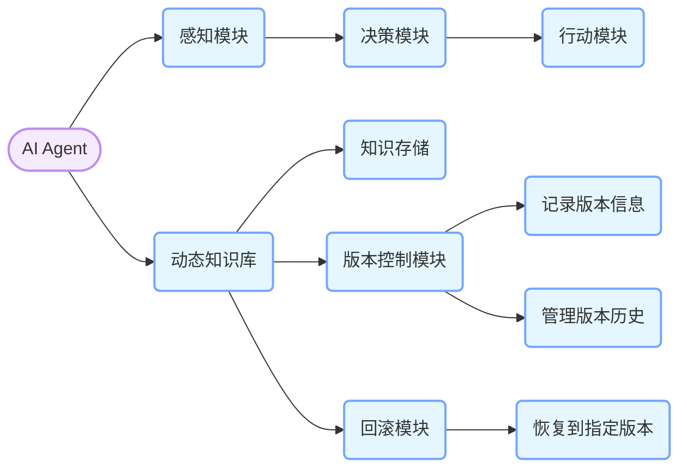

# 实现AI Agent的动态知识库版本控制与回滚

> 关键词：AI Agent、动态知识库、版本控制、回滚、知识管理

> 摘要：本文聚焦于实现AI Agent的动态知识库版本控制与回滚这一关键技术领域。详细阐述了相关核心概念、算法原理、数学模型，通过项目实战展示代码实现与解读，探讨了实际应用场景。同时，推荐了学习资源、开发工具框架以及相关论文著作。旨在帮助读者全面理解和掌握实现AI Agent动态知识库版本控制与回滚的技术要点，为相关领域的研究和实践提供深入的指导与参考。

## 1. 背景介绍 
### 1.1 目的和范围
随着人工智能技术的不断发展，AI Agent在各个领域的应用日益广泛。AI Agent的知识库是其智能决策和行为的重要支撑，动态知识库需要不断更新和维护以适应不同的任务和环境变化。版本控制与回滚功能对于确保知识库的正确性、可追溯性以及在出现问题时恢复到之前的稳定状态至关重要。本文的目的在于深入探讨如何实现AI Agent的动态知识库版本控制与回滚，范围涵盖相关概念、算法、数学模型、代码实现以及实际应用等多个方面。

### 1.2 预期读者
本文预期读者包括人工智能领域的研究人员、开发者、软件工程师、数据科学家以及对AI Agent和知识管理感兴趣的技术爱好者。希望通过本文的介绍，读者能够深入理解实现AI Agent动态知识库版本控制与回滚的技术原理和方法，并能够将其应用到实际项目中。

### 1.3 文档结构概述
本文将按照以下结构进行组织：首先介绍相关的核心概念与联系，包括AI Agent、动态知识库、版本控制和回滚的定义和相互关系；接着阐述核心算法原理和具体操作步骤，并使用Python源代码进行详细说明；然后介绍数学模型和公式，并通过举例进行讲解；之后通过项目实战展示代码实际案例和详细解释说明；再探讨实际应用场景；推荐相关的工具和资源；最后总结未来发展趋势与挑战，并提供常见问题与解答以及扩展阅读和参考资料。

### 1.4 术语表
#### 1.4.1 核心术语定义
- **AI Agent**：人工智能代理，是能够感知环境、做出决策并采取行动以实现特定目标的智能实体。
- **动态知识库**：存储AI Agent所需知识的集合，这些知识可以根据不同的任务和环境动态更新。
- **版本控制**：对知识库的不同版本进行管理和记录，以便跟踪知识库的变化历史。
- **回滚**：将知识库恢复到之前的某个版本，通常用于解决知识库更新过程中出现的问题。

#### 1.4.2 相关概念解释
- **知识表示**：将知识以计算机能够理解和处理的形式进行表示，常见的知识表示方法包括语义网络、框架、规则等。
- **知识更新**：随着环境和任务的变化，对知识库中的知识进行添加、修改或删除的操作。
- **版本号**：用于标识知识库不同版本的唯一编号，通常采用数字或字母组合的形式。

#### 1.4.3 缩略词列表
- **AI**：Artificial Intelligence，人工智能
- **DB**：Database，数据库

## 2. 核心概念与联系 

### 核心概念原理
#### AI Agent
AI Agent是一个具有感知、决策和行动能力的智能体。它通过传感器感知环境信息，利用知识库中的知识进行推理和决策，然后通过执行器采取相应的行动。AI Agent的性能和智能水平在很大程度上取决于其知识库的质量和完整性。

#### 动态知识库
动态知识库是AI Agent的知识存储库，它存储了与任务相关的各种知识，如事实、规则、经验等。动态知识库的特点是可以根据不同的任务和环境动态更新，以保证AI Agent能够获取最新和最准确的知识。

#### 版本控制
版本控制是对知识库的不同版本进行管理和记录的过程。通过版本控制，可以跟踪知识库的变化历史，了解每个版本的修改内容和时间，方便进行问题排查和知识追溯。常见的版本控制方法包括基于文件系统的版本控制和基于数据库的版本控制。

#### 回滚
回滚是将知识库恢复到之前某个版本的操作。当知识库更新过程中出现问题，如引入错误知识或导致系统不稳定时，可以通过回滚操作将知识库恢复到之前的稳定版本，以保证AI Agent的正常运行。

### 架构的文本示意图
```plaintext
AI Agent
|
|-- 感知模块（传感器）
|   |
|   |-- 接收环境信息
|
|-- 决策模块
|   |
|   |-- 利用知识库进行推理和决策
|
|-- 行动模块（执行器）
|   |
|   |-- 执行决策结果
|
|-- 动态知识库
    |
    |-- 知识存储
    |   |
    |   |-- 事实、规则、经验等知识
    |
    |-- 版本控制模块
    |   |
    |   |-- 记录版本信息
    |   |-- 管理版本历史
    |
    |-- 回滚模块
        |
        |-- 恢复到指定版本
```

### Mermaid 流程图


## 3. 核心算法原理 & 具体操作步骤 

### 算法原理
实现AI Agent的动态知识库版本控制与回滚的核心算法主要包括版本记录算法和回滚算法。

#### 版本记录算法
版本记录算法的主要目的是在每次知识库更新时，记录更新的内容、时间和版本号。具体步骤如下：
1. 当知识库发生更新操作（如添加、修改或删除知识）时，生成一个唯一的版本号。
2. 记录更新的内容，包括更新的知识条目、更新类型（添加、修改或删除）。
3. 记录更新的时间。
4. 将版本号、更新内容和时间信息存储到版本控制数据库中。

#### 回滚算法
回滚算法的主要目的是将知识库恢复到指定的版本。具体步骤如下：
1. 根据用户指定的版本号，从版本控制数据库中查找该版本的更新信息。
2. 按照更新信息的逆序，对知识库进行反向操作，即如果是添加操作，则删除相应的知识条目；如果是修改操作，则恢复到修改前的内容；如果是删除操作，则重新添加相应的知识条目。

### 具体操作步骤

#### 初始化版本控制数据库
首先，需要创建一个版本控制数据库，用于存储知识库的版本信息。可以使用关系型数据库（如MySQL、SQLite）或非关系型数据库（如MongoDB）来实现。以下是使用SQLite创建版本控制数据库的Python代码示例：

```python
import sqlite3

# 连接到SQLite数据库
conn = sqlite3.connect('version_control.db')
cursor = conn.cursor()

# 创建版本控制表
cursor.execute('''
CREATE TABLE IF NOT EXISTS version_history (
    version_id TEXT PRIMARY KEY,
    update_time TEXT,
    update_type TEXT,
    update_content TEXT
)
''')

# 提交更改并关闭连接
conn.commit()
conn.close()
```

#### 记录版本信息
在每次知识库更新时，调用记录版本信息的函数，将更新信息存储到版本控制数据库中。以下是一个简单的Python代码示例：

```python
import sqlite3
import uuid
from datetime import datetime

def record_version(update_type, update_content):
    # 生成唯一的版本号
    version_id = str(uuid.uuid4())
    # 获取当前时间
    update_time = datetime.now().strftime('%Y-%m-%d %H:%M:%S')
    
    # 连接到SQLite数据库
    conn = sqlite3.connect('version_control.db')
    cursor = conn.cursor()
    
    # 插入版本信息
    cursor.execute('''
    INSERT INTO version_history (version_id, update_time, update_type, update_content)
    VALUES (?,?,?,?)
    ''', (version_id, update_time, update_type, update_content))
    
    # 提交更改并关闭连接
    conn.commit()
    conn.close()
    
    return version_id
```

#### 回滚操作
当需要回滚到指定版本时，调用回滚函数，根据版本信息对知识库进行反向操作。以下是一个简单的Python代码示例：

```python
import sqlite3

def rollback(version_id, knowledge_base):
    # 连接到SQLite数据库
    conn = sqlite3.connect('version_control.db')
    cursor = conn.cursor()
    
    # 查询指定版本的更新信息
    cursor.execute('''
    SELECT update_type, update_content
    FROM version_history
    WHERE version_id =?
    ''', (version_id,))
    
    # 获取更新信息
    update_info = cursor.fetchall()
    
    # 关闭连接
    conn.close()
    
    # 按照逆序进行反向操作
    for update_type, update_content in reversed(update_info):
        if update_type == 'add':
            # 删除相应的知识条目
            knowledge_base.remove(update_content)
        elif update_type == 'modify':
            # 恢复到修改前的内容
            old_content, new_content = update_content.split('->')
            index = knowledge_base.index(new_content)
            knowledge_base[index] = old_content
        elif update_type == 'delete':
            # 重新添加相应的知识条目
            knowledge_base.append(update_content)
    
    return knowledge_base
```

## 4. 数学模型和公式 & 详细讲解 & 举例说明 

### 数学模型
为了更好地描述动态知识库的版本控制与回滚过程，我们可以引入一些数学模型。

#### 知识库状态表示
设知识库的状态可以用一个集合 $K$ 表示，其中每个元素 $k_i$ 表示一条知识。即 $K = \{k_1, k_2, \cdots, k_n\}$。

#### 版本表示
设版本信息可以用一个三元组 $V = (v_id, t, \Delta K)$ 表示，其中 $v_id$ 是版本号，$t$ 是更新时间，$\Delta K$ 是更新的知识集合。$\Delta K$ 可以表示为添加的知识集合 $\Delta K_{add}$、修改的知识集合 $\Delta K_{modify}$ 和删除的知识集合 $\Delta K_{delete}$ 的并集，即 $\Delta K = \Delta K_{add} \cup \Delta K_{modify} \cup \Delta K_{delete}$。

#### 版本更新操作
设 $K_t$ 表示在时间 $t$ 时的知识库状态，$V_t = (v_id_t, t, \Delta K_t)$ 表示在时间 $t$ 时的版本信息。则更新后的知识库状态 $K_{t+1}$ 可以表示为：

$$
K_{t+1} = (K_t - \Delta K_{delete}) \cup \Delta K_{add} \cup (\Delta K_{modify} \text{ 中的新内容})
$$

#### 回滚操作
设要回滚到版本 $V_{t_0} = (v_id_{t_0}, t_0, \Delta K_{t_0})$，则回滚后的知识库状态 $K_{rollback}$ 可以表示为：

$$
K_{rollback} = (K_{current} - \Delta K_{add}) \cup \Delta K_{delete} \cup (\Delta K_{modify} \text{ 中的旧内容})
$$

### 详细讲解
上述数学模型通过集合的运算来描述知识库的更新和回滚过程。在版本更新时，首先从当前知识库中删除要删除的知识，然后添加新的知识，最后将修改的知识更新为新的内容。在回滚时，执行相反的操作，即删除新添加的知识，重新添加被删除的知识，将修改的知识恢复为旧的内容。

### 举例说明
假设初始知识库 $K_0 = \{k_1, k_2, k_3\}$，第一次更新的版本信息为 $V_1 = (v_1, t_1, \Delta K_1)$，其中 $\Delta K_1 = \{k_4\} \text{ (add)}, \{\} \text{ (modify)}, \{\} \text{ (delete)}$。则更新后的知识库状态为：

$$
K_1 = K_0 \cup \Delta K_{1_{add}} = \{k_1, k_2, k_3, k_4\}
$$

第二次更新的版本信息为 $V_2 = (v_2, t_2, \Delta K_2)$，其中 $\Delta K_2 = \{\} \text{ (add)}, \{k_2 \to k_2'\} \text{ (modify)}, \{k_3\} \text{ (delete)}$。则更新后的知识库状态为：

$$
K_2 = (K_1 - \{k_3\}) \cup \{k_2'\} = \{k_1, k_2', k_4\}
$$

如果要回滚到版本 $V_1$，则回滚后的知识库状态为：

$$
K_{rollback} = (K_2 - \{k_2'\}) \cup \{k_3\} \cup \{k_2\} = \{k_1, k_2, k_3, k_4\}
$$

## 5. 项目实战：代码实际案例和详细解释说明 

### 5.1  开发环境搭建
#### 操作系统
可以选择Windows、Linux或macOS等主流操作系统。

#### 编程语言
使用Python作为开发语言，Python具有丰富的库和工具，方便进行数据库操作、数据处理和算法实现。

#### 数据库
选择SQLite作为版本控制数据库，SQLite是一个轻量级的嵌入式数据库，无需单独的服务器进程，适合小型项目。

#### 安装依赖库
使用pip安装必要的依赖库，如sqlite3（Python标准库，无需额外安装）。

### 5.2  源代码详细实现和代码解读

#### 完整代码示例
```python
import sqlite3
import uuid
from datetime import datetime

# 初始化版本控制数据库
def init_version_control_db():
    conn = sqlite3.connect('version_control.db')
    cursor = conn.cursor()
    cursor.execute('''
    CREATE TABLE IF NOT EXISTS version_history (
        version_id TEXT PRIMARY KEY,
        update_time TEXT,
        update_type TEXT,
        update_content TEXT
    )
    ''')
    conn.commit()
    conn.close()

# 记录版本信息
def record_version(update_type, update_content):
    version_id = str(uuid.uuid4())
    update_time = datetime.now().strftime('%Y-%m-%d %H:%M:%S')
    conn = sqlite3.connect('version_control.db')
    cursor = conn.cursor()
    cursor.execute('''
    INSERT INTO version_history (version_id, update_time, update_type, update_content)
    VALUES (?,?,?,?)
    ''', (version_id, update_time, update_type, update_content))
    conn.commit()
    conn.close()
    return version_id

# 回滚操作
def rollback(version_id, knowledge_base):
    conn = sqlite3.connect('version_control.db')
    cursor = conn.cursor()
    cursor.execute('''
    SELECT update_type, update_content
    FROM version_history
    WHERE version_id =?
    ''', (version_id,))
    update_info = cursor.fetchall()
    conn.close()
    for update_type, update_content in reversed(update_info):
        if update_type == 'add':
            knowledge_base.remove(update_content)
        elif update_type == 'modify':
            old_content, new_content = update_content.split('->')
            index = knowledge_base.index(new_content)
            knowledge_base[index] = old_content
        elif update_type == 'delete':
            knowledge_base.append(update_content)
    return knowledge_base

# 示例使用
if __name__ == '__main__':
    # 初始化版本控制数据库
    init_version_control_db()
    
    # 初始知识库
    knowledge_base = ['k1', 'k2', 'k3']
    
    # 第一次更新：添加知识
    version_id_1 = record_version('add', 'k4')
    knowledge_base.append('k4')
    
    # 第二次更新：修改知识
    old_content = 'k2'
    new_content = 'k2_new'
    index = knowledge_base.index(old_content)
    knowledge_base[index] = new_content
    version_id_2 = record_version('modify', f'{old_content}->{new_content}')
    
    # 第三次更新：删除知识
    knowledge_to_delete = 'k3'
    knowledge_base.remove(knowledge_to_delete)
    version_id_3 = record_version('delete', knowledge_to_delete)
    
    print('更新后的知识库:', knowledge_base)
    
    # 回滚到第一次更新后的版本
    knowledge_base = rollback(version_id_1, knowledge_base)
    print('回滚后的知识库:', knowledge_base)
```

#### 代码解读
1. **init_version_control_db函数**：用于初始化版本控制数据库，创建一个名为`version_history`的表，用于存储版本信息。
2. **record_version函数**：在每次知识库更新时，生成唯一的版本号，记录更新的类型（添加、修改或删除）和内容，并将这些信息插入到版本控制数据库中。
3. **rollback函数**：根据指定的版本号，从版本控制数据库中查询更新信息，然后按照逆序对知识库进行反向操作，实现回滚功能。
4. **主程序**：首先初始化版本控制数据库，然后模拟三次知识库更新操作，每次更新后记录版本信息。最后，回滚到第一次更新后的版本，并输出回滚后的知识库内容。

### 5.3  代码解读与分析
#### 优点
- **简单易懂**：代码结构清晰，使用Python语言和SQLite数据库，易于理解和实现。
- **可扩展性**：可以根据需要扩展版本控制数据库的功能，如添加更多的版本信息字段，支持更复杂的知识更新操作。
- **灵活性**：可以根据不同的知识库实现方式（如列表、字典、数据库等）进行相应的调整，适用于不同的应用场景。

#### 缺点
- **性能问题**：对于大规模的知识库和频繁的更新操作，使用SQLite数据库可能会导致性能瓶颈。可以考虑使用更高效的数据库系统，如MySQL或MongoDB。
- **并发控制**：代码中没有考虑并发更新的情况，在多线程或多进程环境下可能会出现数据不一致的问题。需要添加并发控制机制，如锁或事务。

## 6. 实际应用场景 

### 智能客服系统
在智能客服系统中，AI Agent需要根据不同的用户问题和业务规则进行回答。动态知识库存储了常见问题的答案、业务规则和相关知识。通过版本控制与回滚功能，可以及时更新知识库以适应业务的变化，同时在更新过程中出现问题时可以快速恢复到之前的稳定版本，保证客服系统的正常运行。

### 自动驾驶系统
自动驾驶系统中的AI Agent需要不断学习和更新环境知识、交通规则和驾驶策略。动态知识库存储了这些关键知识。版本控制与回滚功能可以确保知识库的正确性和安全性，在新的知识更新导致系统出现异常时，能够迅速回滚到之前的可靠版本，避免发生交通事故。

### 智能推荐系统
智能推荐系统中的AI Agent根据用户的历史行为和偏好进行个性化推荐。动态知识库存储了用户的特征信息、商品信息和推荐规则。通过版本控制与回滚功能，可以对推荐算法和规则进行优化和调整，同时在优化过程中出现问题时可以恢复到之前的推荐效果较好的版本，提高用户体验。

## 7. 工具和资源推荐
### 7.1 学习资源推荐
#### 7.1.1 书籍推荐
- 《人工智能：一种现代的方法》：全面介绍了人工智能的基本概念、算法和应用，对AI Agent和知识管理有深入的讲解。
- 《Python数据分析实战》：介绍了Python在数据分析和处理方面的应用，对于实现版本控制和回滚的数据库操作有很大的帮助。

#### 7.1.2 在线课程
- Coursera上的“人工智能基础”课程：由知名高校的教授授课，系统地介绍了人工智能的基础知识和技术。
- edX上的“Python编程基础”课程：适合初学者学习Python编程语言，为实现相关代码提供基础。

#### 7.1.3 技术博客和网站
- 博客园：有许多人工智能和Python相关的技术博客，提供了丰富的学习资源和实践经验。
- 开源中国：关注开源技术和项目，有很多关于AI Agent和知识管理的开源项目和技术文章。

### 7.2 开发工具框架推荐
#### 7.2.1 IDE和编辑器
- PyCharm：一款功能强大的Python集成开发环境，提供了代码编辑、调试、版本控制等功能，适合Python项目的开发。
- Visual Studio Code：一款轻量级的代码编辑器，支持多种编程语言和插件扩展，方便进行Python代码的编写和调试。

#### 7.2.2 调试和性能分析工具
- PDB：Python标准库中的调试工具，可以帮助开发者进行代码调试和问题排查。
- cProfile：Python标准库中的性能分析工具，可以分析代码的性能瓶颈，优化代码效率。

#### 7.2.3 相关框架和库
- SQLAlchemy：一个强大的Python SQL工具包，提供了统一的数据库操作接口，支持多种数据库系统，方便进行版本控制数据库的开发。
- Django：一个高级的Python Web框架，提供了数据库管理、用户认证等功能，可用于开发基于Web的AI Agent知识库管理系统。

### 7.3 相关论文著作推荐
#### 7.3.1 经典论文
- “A Logical Framework for Representation and Reasoning in Intelligent Agents”：提出了一种用于智能体知识表示和推理的逻辑框架，为AI Agent的知识库设计提供了理论基础。
- “Version Control Systems: A Survey”：对版本控制系统进行了全面的综述，介绍了不同类型的版本控制方法和技术。

#### 7.3.2 最新研究成果
- 关注ACM SIGART、IEEE Transactions on Knowledge and Data Engineering等顶级学术期刊和会议，了解AI Agent和知识管理领域的最新研究成果。

#### 7.3.3 应用案例分析
- 研究一些实际应用案例，如谷歌的知识图谱、百度的智能客服系统等，了解它们在动态知识库管理和版本控制方面的实践经验和技术方案。

## 8. 总结：未来发展趋势与挑战

### 未来发展趋势
- **智能化**：未来的AI Agent动态知识库版本控制与回滚系统将更加智能化，能够自动检测知识库的变化和潜在问题，并根据不同的情况自动进行版本控制和回滚操作。
- **分布式**：随着大数据和云计算技术的发展，AI Agent的知识库可能会分布在多个节点上。分布式版本控制与回滚技术将成为未来的研究热点，以实现高效的知识共享和管理。
- **与区块链结合**：区块链技术具有去中心化、不可篡改等特点，可以为AI Agent的动态知识库版本控制与回滚提供更安全、可靠的解决方案。未来可能会将区块链技术与版本控制和回滚系统相结合，确保知识库的完整性和可信度。

### 挑战
- **数据一致性**：在动态知识库不断更新和变化的过程中，如何保证不同版本之间的数据一致性是一个挑战。特别是在分布式环境下，数据一致性问题更加复杂。
- **性能优化**：随着知识库规模的不断增大和更新频率的提高，版本控制和回滚操作的性能将成为一个关键问题。需要研究高效的算法和数据结构，以提高系统的性能和响应速度。
- **安全与隐私**：AI Agent的知识库中可能包含敏感信息，如用户隐私数据、商业机密等。如何在版本控制和回滚过程中保证数据的安全和隐私是一个重要的挑战。

## 9. 附录：常见问题与解答

### 问题1：如何处理版本控制数据库中的数据冗余问题？
答：可以定期对版本控制数据库进行清理和优化，删除一些不再需要的旧版本信息。同时，可以采用数据压缩和索引优化等技术，减少数据冗余，提高数据库的性能。

### 问题2：在多线程或多进程环境下，如何保证版本控制和回滚操作的线程安全？
答：可以使用锁机制或事务来保证线程安全。在进行版本控制和回滚操作时，对相关的资源（如数据库连接、知识库数据等）加锁，防止多个线程或进程同时访问和修改。同时，使用数据库的事务功能，确保操作的原子性和一致性。

### 问题3：如何在不同的知识库实现方式（如列表、字典、数据库等）中实现版本控制和回滚功能？
答：可以根据不同的知识库实现方式，对版本控制和回滚算法进行相应的调整。例如，对于列表类型的知识库，可以使用索引和元素操作来实现添加、修改和删除操作；对于字典类型的知识库，可以使用键值对的操作来实现更新和回滚；对于数据库类型的知识库，可以使用SQL语句来进行数据的增删改查操作。

## 10. 扩展阅读 & 参考资料

### 扩展阅读
- 《知识图谱：方法、实践与应用》：深入介绍了知识图谱的构建、表示和应用，对于理解AI Agent的知识库管理有很大的帮助。
- 《分布式系统原理与范型》：介绍了分布式系统的基本原理和技术，对于研究分布式版本控制与回滚系统有重要的参考价值。

### 参考资料
- SQLite官方文档：https://www.sqlite.org/docs.html
- Python官方文档：https://docs.python.org/3/
- SQLAlchemy官方文档：https://docs.sqlalchemy.org/