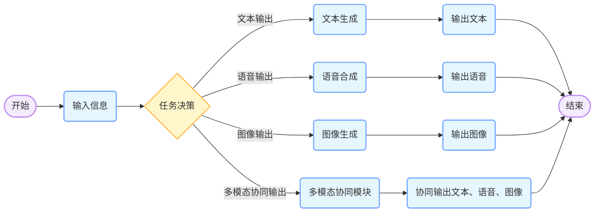

# 实现AI Agent的多模态输出：文本、语音、图像协同

> 关键词：AI Agent、多模态输出、文本、语音、图像、协同、人工智能

> 摘要：本文围绕实现AI Agent的多模态输出展开，详细探讨了文本、语音、图像协同输出的相关技术。首先介绍了实现多模态输出的背景和相关概念，接着深入讲解核心算法原理与具体操作步骤，通过数学模型和公式进一步阐述其理论基础。结合项目实战，给出代码实际案例并进行详细解释。分析了多模态输出在不同场景下的实际应用，同时推荐了相关的学习资源、开发工具框架和论文著作。最后总结了未来发展趋势与挑战，并对常见问题进行解答，为相关领域的研究者和开发者提供全面且深入的参考。

## 1. 背景介绍 
### 1.1 目的和范围
随着人工智能技术的不断发展，单一模态的交互方式已难以满足用户日益多样化的需求。实现AI Agent的多模态输出，将文本、语音、图像进行协同，旨在为用户提供更加丰富、自然和高效的交互体验。本文章的范围涵盖了多模态输出的核心概念、算法原理、数学模型、项目实战以及实际应用场景等多个方面，力求全面深入地介绍实现AI Agent多模态输出的相关技术。

### 1.2 预期读者
本文预期读者包括人工智能领域的研究者、开发者、相关专业的学生以及对AI Agent多模态输出技术感兴趣的技术爱好者。无论是想要深入了解多模态输出原理的理论研究者，还是希望在实际项目中应用该技术的开发者，都能从本文中获取有价值的信息。

### 1.3 文档结构概述
本文首先介绍背景信息，包括目的、预期读者和文档结构概述等内容。接着阐述多模态输出的核心概念与联系，通过文本示意图和Mermaid流程图进行直观展示。然后深入讲解核心算法原理和具体操作步骤，并给出Python源代码。之后介绍数学模型和公式，并举例说明。通过项目实战部分，详细展示代码实际案例并进行解读。分析多模态输出的实际应用场景，推荐相关的工具和资源。最后总结未来发展趋势与挑战，解答常见问题，并提供扩展阅读和参考资料。

### 1.4 术语表
#### 1.4.1 核心术语定义
- **AI Agent**：人工智能代理，是一种能够感知环境、进行推理决策并采取行动的智能实体。
- **多模态输出**：指AI Agent同时或根据需求以多种不同的模态（如文本、语音、图像）向用户输出信息。
- **文本生成**：AI Agent根据输入信息生成相应文本内容的过程。
- **语音合成**：将文本信息转换为语音信号的技术。
- **图像生成**：利用算法生成图像的过程。

#### 1.4.2 相关概念解释
- **模态协同**：在多模态输出中，不同模态之间相互配合、协调，以提供一致、连贯的信息。例如，语音内容与图像内容相互呼应，文本解释与图像和语音的信息相匹配。
- **感知与决策**：AI Agent通过感知环境获取信息，然后根据一定的策略和算法进行决策，决定以何种模态或模态组合输出信息。

#### 1.4.3 缩略词列表
- **TTS**：Text-to-Speech，文本转语音。
- **GAN**：Generative Adversarial Networks，生成对抗网络，常用于图像生成。
- **NLP**：Natural Language Processing，自然语言处理，用于文本处理和生成。

## 2. 核心概念与联系 

### 核心概念原理
AI Agent的多模态输出涉及多个核心概念和技术领域。文本生成是基于自然语言处理技术，AI Agent根据输入的信息和任务要求，生成符合语义和语法规则的文本内容。语音合成则是将生成的文本转换为自然流畅的语音信号，让用户能够通过听觉获取信息。图像生成利用机器学习算法，如生成对抗网络（GAN）等，根据文本描述或其他输入生成相应的图像。

多模态输出的协同是指在输出过程中，不同模态之间相互配合、相互补充。例如，在介绍一个旅游景点时，AI Agent可以同时输出关于该景点的文本介绍、语音讲解和相关的图片，让用户从多个角度全面了解该景点。

### 架构的文本示意图
```plaintext
           +----------------+
           |   AI Agent     |
           +----------------+
          /        |        \
         /         |         \
+---------+   +---------+   +---------+
| 文本生成 |   | 语音合成 |   | 图像生成 |
+---------+   +---------+   +---------+
```
这个示意图展示了AI Agent作为核心，分别连接文本生成、语音合成和图像生成三个模块。AI Agent根据输入信息和任务要求，向各个模块发送指令，实现多模态输出。

### Mermaid流程图

该流程图展示了AI Agent多模态输出的整体流程。首先输入信息，然后进行任务决策，根据决策结果选择文本输出、语音输出、图像输出或多模态协同输出，最后输出相应的内容。

## 3. 核心算法原理 & 具体操作步骤 

### 文本生成算法原理及Python代码实现
文本生成通常使用基于深度学习的自然语言处理模型，如Transformer架构的GPT系列模型。下面以一个简单的基于循环神经网络（RNN）的文本生成示例来讲解原理和代码实现。

#### 原理
RNN是一种能够处理序列数据的神经网络，它通过在每个时间步上接收输入并更新隐藏状态，从而生成下一个时间步的输出。在文本生成中，我们可以将文本序列作为输入，训练RNN模型来预测下一个字符或单词。

#### Python代码实现
```python
import numpy as np
import tensorflow as tf
from tensorflow.keras.models import Sequential
from tensorflow.keras.layers import SimpleRNN, Dense

# 准备数据
text = "hello world"
chars = sorted(list(set(text)))
char_to_idx = {char: idx for idx, char in enumerate(chars)}
idx_to_char = {idx: char for idx, char in enumerate(chars)}

max_length = 5
input_data = []
target_data = []

for i in range(len(text) - max_length):
    input_seq = text[i:i + max_length]
    target_char = text[i + max_length]
    input_data.append([char_to_idx[char] for char in input_seq])
    target_data.append(char_to_idx[target_char])

input_data = np.array(input_data)
target_data = np.array(target_data)

# 构建模型
model = Sequential([
    SimpleRNN(64, input_shape=(max_length, 1)),
    Dense(len(chars), activation='softmax')
])

model.compile(optimizer='adam', loss='sparse_categorical_crossentropy')

# 训练模型
model.fit(input_data.reshape(-1, max_length, 1), target_data, epochs=100)

# 生成文本
start_seq = text[:max_length]
generated_text = start_seq

for _ in range(10):
    input_seq = np.array([[char_to_idx[char] for char in start_seq]])
    predicted_probs = model.predict(input_seq.reshape(-1, max_length, 1))
    predicted_idx = np.argmax(predicted_probs)
    predicted_char = idx_to_char[predicted_idx]
    generated_text += predicted_char
    start_seq = start_seq[1:] + predicted_char

print("Generated text:", generated_text)
```
### 语音合成算法原理及Python代码实现
语音合成常用的技术是基于深度学习的端到端语音合成模型，如Tacotron系列和WaveNet。这里以gTTS（Google Text-to-Speech）库为例进行简单的语音合成。

#### 原理
gTTS是一个Python库，它利用Google的文本转语音API将文本转换为语音。它将输入的文本发送到Google的服务器，服务器返回相应的语音文件。

#### Python代码实现
```python
from gtts import gTTS
import os

text = "Hello, this is a voice synthesis example."
tts = gTTS(text=text, lang='en')
tts.save("example.mp3")
os.system("mpg123 example.mp3")  # 播放生成的语音文件
```
### 图像生成算法原理及Python代码实现
图像生成可以使用生成对抗网络（GAN）。GAN由生成器和判别器组成，生成器尝试生成逼真的图像，判别器则尝试区分生成的图像和真实图像。两者通过对抗训练不断提高性能。

#### 原理
GAN的训练过程是一个博弈过程。生成器接收随机噪声作为输入，生成图像。判别器接收生成的图像和真实图像，判断其真实性。生成器的目标是生成能够骗过判别器的图像，判别器的目标是准确区分真实图像和生成图像。

#### Python代码实现
```python
import tensorflow as tf
from tensorflow.keras import layers
import numpy as np
import matplotlib.pyplot as plt

# 定义生成器
def make_generator_model():
    model = tf.keras.Sequential()
    model.add(layers.Dense(7*7*256, use_bias=False, input_shape=(100,)))
    model.add(layers.BatchNormalization())
    model.add(layers.LeakyReLU())

    model.add(layers.Reshape((7, 7, 256)))
    assert model.output_shape == (None, 7, 7, 256)

    model.add(layers.Conv2DTranspose(128, (5, 5), strides=(2, 2), padding='same', use_bias=False))
    assert model.output_shape == (None, 14, 14, 128)
    model.add(layers.BatchNormalization())
    model.add(layers.LeakyReLU())

    model.add(layers.Conv2DTranspose(64, (5, 5), strides=(2, 2), padding='same', use_bias=False))
    assert model.output_shape == (None, 28, 28, 64)
    model.add(layers.BatchNormalization())
    model.add(layers.LeakyReLU())

    model.add(layers.Conv2DTranspose(1, (5, 5), strides=(1, 1), padding='same', use_bias=False, activation='tanh'))
    assert model.output_shape == (None, 28, 28, 1)

    return model

# 定义判别器
def make_discriminator_model():
    model = tf.keras.Sequential()
    model.add(layers.Conv2D(64, (5, 5), strides=(2, 2), padding='same',
                                     input_shape=[28, 28, 1]))
    model.add(layers.LeakyReLU())
    model.add(layers.Dropout(0.3))

    model.add(layers.Conv2D(128, (5, 5), strides=(2, 2), padding='same'))
    model.add(layers.LeakyReLU())
    model.add(layers.Dropout(0.3))

    model.add(layers.Flatten())
    model.add(layers.Dense(1))

    return model

# 定义损失函数和优化器
cross_entropy = tf.keras.losses.BinaryCrossentropy(from_logits=True)

def discriminator_loss(real_output, fake_output):
    real_loss = cross_entropy(tf.ones_like(real_output), real_output)
    fake_loss = cross_entropy(tf.zeros_like(fake_output), fake_output)
    total_loss = real_loss + fake_loss
    return total_loss

def generator_loss(fake_output):
    return cross_entropy(tf.ones_like(fake_output), fake_output)

generator_optimizer = tf.keras.optimizers.Adam(1e-4)
discriminator_optimizer = tf.keras.optimizers.Adam(1e-4)

# 加载数据集
(train_images, _), (_, _) = tf.keras.datasets.mnist.load_data()
train_images = train_images.reshape(train_images.shape[0], 28, 28, 1).astype('float32')
train_images = (train_images - 127.5) / 127.5  # 归一化到 [-1, 1]

BUFFER_SIZE = 60000
BATCH_SIZE = 256

train_dataset = tf.data.Dataset.from_tensor_slices(train_images).shuffle(BUFFER_SIZE).batch(BATCH_SIZE)

# 训练循环
EPOCHS = 50
noise_dim = 100
num_examples_to_generate = 16

seed = tf.random.normal([num_examples_to_generate, noise_dim])

@tf.function
def train_step(images):
    noise = tf.random.normal([BATCH_SIZE, noise_dim])

    with tf.GradientTape() as gen_tape, tf.GradientTape() as disc_tape:
        generated_images = generator(noise, training=True)

        real_output = discriminator(images, training=True)
        fake_output = discriminator(generated_images, training=True)

        gen_loss = generator_loss(fake_output)
        disc_loss = discriminator_loss(real_output, fake_output)

    gradients_of_generator = gen_tape.gradient(gen_loss, generator.trainable_variables)
    gradients_of_discriminator = disc_tape.gradient(disc_loss, discriminator.trainable_variables)

    generator_optimizer.apply_gradients(zip(gradients_of_generator, generator.trainable_variables))
    discriminator_optimizer.apply_gradients(zip(gradients_of_discriminator, discriminator.trainable_variables))

def train(dataset, epochs):
    for epoch in range(epochs):
        for image_batch in dataset:
            train_step(image_batch)

        print(f'Epoch {epoch + 1} completed')

    generate_and_save_images(generator, epochs, seed)

def generate_and_save_images(model, epoch, test_input):
    predictions = model(test_input, training=False)

    fig = plt.figure(figsize=(4, 4))

    for i in range(predictions.shape[0]):
        plt.subplot(4, 4, i + 1)
        plt.imshow(predictions[i, :, :, 0] * 127.5 + 127.5, cmap='gray')
        plt.axis('off')

    plt.savefig('image_at_epoch_{:04d}.png'.format(epoch))
    plt.show()

generator = make_generator_model()
discriminator = make_discriminator_model()

train(train_dataset, EPOCHS)
```
### 多模态协同步骤
1. **任务分析**：AI Agent接收到输入信息后，首先分析任务需求，确定需要输出的模态组合。例如，如果用户询问一个故事，可能需要文本、语音和相关的图像进行协同输出。
2. **数据生成**：根据任务需求，分别调用文本生成、语音合成和图像生成模块生成相应的数据。
3. **协同处理**：对生成的文本、语音和图像数据进行协同处理，确保它们之间的一致性和连贯性。例如，语音内容要与文本内容匹配，图像要与文本和语音描述的信息相符。
4. **输出呈现**：将协同处理后的多模态数据输出给用户，可以通过界面展示文本和图像，同时播放语音。

## 4. 数学模型和公式 & 详细讲解 & 举例说明 

### 文本生成的数学模型
在基于RNN的文本生成中，我们可以用以下数学模型来描述。

设输入序列为 $x = (x_1, x_2, \cdots, x_T)$，其中 $x_t$ 表示第 $t$ 个时间步的输入，$T$ 是序列的长度。隐藏状态 $h_t$ 的更新公式为：

$$h_t = \sigma(W_{xh}x_t + W_{hh}h_{t - 1} + b_h)$$

其中 $W_{xh}$ 是输入到隐藏层的权重矩阵，$W_{hh}$ 是隐藏层到隐藏层的权重矩阵，$b_h$ 是隐藏层的偏置向量，$\sigma$ 是激活函数（如tanh）。

输出层的输出 $y_t$ 为：

$$y_t = W_{hy}h_t + b_y$$

其中 $W_{hy}$ 是隐藏层到输出层的权重矩阵，$b_y$ 是输出层的偏置向量。

最后，通过softmax函数得到每个字符的概率分布：

$$P(y_t = c) = \frac{e^{y_{t,c}}}{\sum_{k = 1}^{V}e^{y_{t,k}}}$$

其中 $V$ 是词汇表的大小，$c$ 是字符的索引。

**举例说明**：假设我们有一个简单的词汇表 $\{a, b, c\}$，$V = 3$。在某个时间步 $t$，输出层的输出 $y_t = [1, 2, 3]$。则字符 $a$ 的概率为：

$$P(y_t = a) = \frac{e^1}{e^1 + e^2 + e^3} \approx 0.09$$

字符 $b$ 的概率为：

$$P(y_t = b) = \frac{e^2}{e^1 + e^2 + e^3} \approx 0.24$$

字符 $c$ 的概率为：

$$P(y_t = c) = \frac{e^3}{e^1 + e^2 + e^3} \approx 0.67$$

### 语音合成的数学模型
语音合成的数学模型较为复杂，以Tacotron模型为例。Tacotron模型主要由编码器、解码器和后处理网络组成。

编码器将输入的文本转换为一系列的嵌入向量。设输入文本的字符序列为 $x = (x_1, x_2, \cdots, x_N)$，编码器输出的嵌入向量序列为 $e = (e_1, e_2, \cdots, e_N)$。

解码器根据编码器的输出和之前的输出帧，生成语音的梅尔频谱。设解码器的隐藏状态为 $h_t$，之前的输出帧为 $y_{t - 1}$，则解码器的输出 $y_t$ 可以表示为：

$$y_t = f(h_t, e, y_{t - 1})$$

其中 $f$ 是解码器的函数。

后处理网络将梅尔频谱转换为线性频谱，最终通过逆快速傅里叶变换（IFFT）得到语音信号。

### 图像生成的数学模型
在GAN中，生成器 $G$ 和判别器 $D$ 的目标函数可以用以下公式表示。

生成器的目标是最大化判别器将生成图像判断为真实图像的概率，其目标函数为：

$$\min_G \mathbb{E}_{z \sim p(z)}[\log(1 - D(G(z)))]$$

判别器的目标是正确区分真实图像和生成图像，其目标函数为：

$$\max_D \mathbb{E}_{x \sim p_{data}(x)}[\log(D(x))] + \mathbb{E}_{z \sim p(z)}[\log(1 - D(G(z)))]$$

其中 $p(z)$ 是噪声的概率分布，$p_{data}(x)$ 是真实图像的概率分布。

**举例说明**：假设我们有一个简单的二维噪声空间，噪声 $z$ 从正态分布中采样。生成器 $G$ 将噪声 $z$ 映射到图像空间，判别器 $D$ 对生成的图像和真实图像进行判断。在训练过程中，生成器不断调整参数，使得判别器难以区分生成图像和真实图像，而判别器则不断提高自己的判断能力。

## 5. 项目实战：代码实际案例和详细解释说明 

### 5.1  开发环境搭建
#### 操作系统
建议使用Linux或Windows操作系统，这里以Ubuntu 20.04为例进行说明。

#### Python环境
安装Python 3.7及以上版本。可以使用以下命令安装Python：
```bash
sudo apt update
sudo apt install python3 python3-pip
```

#### 相关库安装
安装所需的Python库，包括TensorFlow、gTTS、matplotlib等。可以使用以下命令安装：
```bash
pip install tensorflow gTTS matplotlib
```

### 5.2  源代码详细实现和代码解读
以下是一个简单的AI Agent多模态输出的综合代码示例：

```python
import numpy as np
import tensorflow as tf
from tensorflow.keras.models import Sequential
from tensorflow.keras.layers import SimpleRNN, Dense
from gtts import gTTS
import os
import matplotlib.pyplot as plt

# 文本生成部分
text = "hello world"
chars = sorted(list(set(text)))
char_to_idx = {char: idx for idx, char in enumerate(chars)}
idx_to_char = {idx: char for idx, char in enumerate(chars)}

max_length = 5
input_data = []
target_data = []

for i in range(len(text) - max_length):
    input_seq = text[i:i + max_length]
    target_char = text[i + max_length]
    input_data.append([char_to_idx[char] for char in input_seq])
    target_data.append(char_to_idx[target_char])

input_data = np.array(input_data)
target_data = np.array(target_data)

model = Sequential([
    SimpleRNN(64, input_shape=(max_length, 1)),
    Dense(len(chars), activation='softmax')
])

model.compile(optimizer='adam', loss='sparse_categorical_crossentropy')
model.fit(input_data.reshape(-1, max_length, 1), target_data, epochs=100)

start_seq = text[:max_length]
generated_text = start_seq

for _ in range(10):
    input_seq = np.array([[char_to_idx[char] for char in start_seq]])
    predicted_probs = model.predict(input_seq.reshape(-1, max_length, 1))
    predicted_idx = np.argmax(predicted_probs)
    predicted_char = idx_to_char[predicted_idx]
    generated_text += predicted_char
    start_seq = start_seq[1:] + predicted_char

print("Generated text:", generated_text)

# 语音合成部分
tts = gTTS(text=generated_text, lang='en')
tts.save("example.mp3")
os.system("mpg123 example.mp3")

# 图像生成部分（简单示例，这里使用随机图像代替实际的图像生成模型）
random_image = np.random.rand(100, 100, 3)
plt.imshow(random_image)
plt.axis('off')
plt.savefig('example_image.png')
plt.show()
```
### 5.3  代码解读与分析
#### 文本生成部分
- **数据准备**：将文本转换为字符索引序列，准备输入数据和目标数据。
- **模型构建**：使用简单的RNN模型，包括一个RNN层和一个全连接层。
- **模型训练**：使用交叉熵损失函数和Adam优化器进行训练。
- **文本生成**：根据训练好的模型，逐步生成文本。

#### 语音合成部分
- 使用gTTS库将生成的文本转换为语音文件，并使用`mpg123`播放。

#### 图像生成部分
这里只是一个简单示例，使用随机图像代替实际的图像生成模型。在实际应用中，可以使用GAN等更复杂的模型来生成与文本相关的图像。

## 6. 实际应用场景 
### 智能客服
在智能客服系统中，AI Agent可以通过多模态输出为用户提供更好的服务。当用户咨询问题时，AI Agent可以同时输出文本解答、语音讲解和相关的图片或图表，帮助用户更全面地理解问题的解决方案。例如，在解答用户关于产品使用方法的问题时，除了文字说明和语音讲解外，还可以提供产品的操作示意图，让用户一目了然。

### 教育领域
在在线教育中，AI Agent的多模态输出可以丰富教学内容和形式。教师可以利用AI Agent生成的文本、语音和图像进行教学。例如，在讲解历史故事时，AI Agent可以输出故事的文本内容、语音朗读和相关的历史图片，增强学生的学习体验，提高学习效果。

### 虚拟现实和增强现实
在虚拟现实（VR）和增强现实（AR）应用中，AI Agent的多模态输出可以提供更加沉浸式的体验。例如，在VR游戏中，AI Agent可以根据游戏场景输出相应的文本提示、语音指令和3D图像，让玩家更好地融入游戏世界。在AR导航应用中，AI Agent可以同时提供语音导航、文字提示和增强现实的图像指引，帮助用户更准确地找到目的地。

### 智能家居
在智能家居系统中，AI Agent可以通过多模态输出与用户进行交互。当用户控制家电设备时，AI Agent可以用语音反馈操作结果，同时在手机应用或智能屏幕上显示文本信息和相关的设备状态图像，方便用户了解设备的运行情况。

## 7. 工具和资源推荐
### 7.1 学习资源推荐
#### 7.1.1 书籍推荐
- 《深度学习》（Deep Learning）：由Ian Goodfellow、Yoshua Bengio和Aaron Courville所著，是深度学习领域的经典教材，涵盖了神经网络、卷积神经网络、循环神经网络等多种模型和算法，对理解多模态输出的相关技术有很大帮助。
- 《自然语言处理入门》：介绍了自然语言处理的基本概念、算法和应用，包括文本生成、语义理解等内容，是学习文本处理技术的良好入门书籍。
- 《Python机器学习》（Python Machine Learning）：详细介绍了Python在机器学习中的应用，包括各种机器学习算法的实现和应用，对于实现多模态输出中的图像生成、语音合成等任务有指导作用。

#### 7.1.2 在线课程
- Coursera上的“深度学习专项课程”（Deep Learning Specialization）：由Andrew Ng教授授课，包括深度学习的基础知识、卷积神经网络、循环神经网络等多个模块，对多模态输出的相关技术有深入的讲解。
- edX上的“自然语言处理基础”（Foundations of Natural Language Processing）：介绍了自然语言处理的基本原理和技术，包括文本分类、命名实体识别、文本生成等内容。
- Udemy上的“生成对抗网络实战”（Generative Adversarial Networks in Action）：专门讲解生成对抗网络的原理和应用，对于图像生成技术的学习有很大帮助。

#### 7.1.3 技术博客和网站
- Medium：有很多关于人工智能、机器学习和深度学习的技术博客，其中不乏关于多模态输出的最新研究成果和实践经验分享。
- arXiv：是一个预印本服务器，提供了大量的学术论文，包括多模态学习、文本生成、语音合成等领域的最新研究进展。
- Towards Data Science：是一个专注于数据科学和机器学习的技术博客平台，有很多关于多模态输出的实用教程和案例分析。

### 7.2 开发工具框架推荐
#### 7.2.1 IDE和编辑器
- PyCharm：是一款专门为Python开发设计的集成开发环境（IDE），具有强大的代码编辑、调试和自动补全功能，适合开发多模态输出相关的Python代码。
- Jupyter Notebook：是一个交互式的开发环境，支持Python、R等多种编程语言，方便进行代码的编写、调试和可视化展示，非常适合进行机器学习和深度学习的实验和开发。
- Visual Studio Code：是一款轻量级的代码编辑器，支持多种编程语言和插件扩展，具有丰富的代码编辑和调试功能，可用于开发多模态输出的相关项目。

#### 7.2.2 调试和性能分析工具
- TensorBoard：是TensorFlow提供的一个可视化工具，可以帮助开发者监控模型的训练过程、分析模型的性能指标，如损失函数、准确率等，对于调试和优化多模态输出模型非常有用。
- PyTorch Profiler：是PyTorch提供的性能分析工具，可以帮助开发者分析模型的性能瓶颈，如计算时间、内存使用等，优化模型的性能。
- cProfile：是Python内置的性能分析工具，可以帮助开发者分析Python代码的性能，找出代码中的性能瓶颈。

#### 7.2.3 相关框架和库
- TensorFlow：是一个开源的机器学习框架，提供了丰富的深度学习模型和工具，可用于实现文本生成、语音合成和图像生成等任务。
- PyTorch：是另一个流行的深度学习框架，具有简洁的API和高效的计算性能，也可用于多模态输出相关的开发。
- Hugging Face Transformers：是一个专门用于自然语言处理的库，提供了多种预训练的语言模型，如GPT、BERT等，可用于快速实现文本生成任务。
- librosa：是一个用于音频处理的Python库，可用于音频特征提取、语音合成等任务。
- Pillow：是一个Python图像处理库，可用于图像的读取、处理和保存，辅助图像生成和多模态输出的实现。

### 7.3 相关论文著作推荐
#### 7.3.1 经典论文
- “Attention Is All You Need”：介绍了Transformer架构，是自然语言处理领域的重要突破，为文本生成等任务提供了新的思路和方法。
- “Generative Adversarial Nets”：首次提出了生成对抗网络（GAN）的概念，开创了图像生成等领域的新局面。
- “Tacotron: Towards End-to-End Speech Synthesis”：介绍了Tacotron模型，是语音合成领域的经典论文，为端到端的语音合成技术奠定了基础。

#### 7.3.2 最新研究成果
- 关注顶级学术会议如NeurIPS（神经信息处理系统大会）、ICML（国际机器学习会议）、ACL（计算语言学协会年会）等上关于多模态学习、文本生成、语音合成和图像生成的最新研究成果。
- 一些知名学术期刊如Journal of Artificial Intelligence Research（JAIR）、Artificial Intelligence等也会发表多模态输出相关的前沿研究论文。

#### 7.3.3 应用案例分析
- 可以参考一些实际应用案例的论文，如智能客服、教育、虚拟现实等领域中AI Agent多模态输出的应用案例，了解实际应用中的技术实现和挑战解决方法。

## 8. 总结：未来发展趋势与挑战
### 未来发展趋势
#### 更加自然和智能的交互
未来的AI Agent多模态输出将更加自然和智能，能够根据用户的情绪、语境和偏好进行自适应的输出。例如，当用户处于紧张的工作状态时，AI Agent可能会优先以简洁的文本方式输出信息；当用户处于休闲状态时，则可能会以更加生动的语音和图像方式进行交互。

#### 跨模态融合的深度发展
跨模态融合将不再局限于简单的文本、语音和图像的协同输出，而是会深入到数据层面、特征层面和语义层面的融合。例如，在图像生成中，可以更好地结合文本和语音的语义信息，生成更加符合用户需求的图像。

#### 多模态输出在更多领域的应用
随着技术的不断发展，AI Agent的多模态输出将在更多领域得到应用，如医疗保健、金融服务、工业制造等。在医疗保健领域，AI Agent可以通过多模态输出为患者提供疾病诊断、治疗建议等信息，同时展示相关的医学图像和语音讲解。

### 挑战
#### 数据融合与处理
不同模态的数据具有不同的特点和格式，如何有效地融合和处理这些数据是一个挑战。例如，文本数据是离散的符号序列，语音数据是连续的音频信号，图像数据是二维或三维的像素矩阵，需要开发出高效的数据融合算法和模型。

#### 协同一致性问题
在多模态输出中，不同模态之间的协同一致性是一个关键问题。例如，语音内容要与文本内容一致，图像要与文本和语音描述的信息相符。如何保证不同模态之间的协同一致性，需要进一步研究和解决。

#### 计算资源和效率
多模态输出涉及到多个复杂的模型和算法，对计算资源的需求较大。如何在有限的计算资源下提高多模态输出的效率，是一个亟待解决的问题。例如，需要开发出更加高效的模型压缩和加速算法。

## 9. 附录：常见问题与解答
### 问题1：在实现多模态输出时，如何选择合适的文本生成、语音合成和图像生成模型？
解答：选择合适的模型需要考虑多个因素，如任务需求、数据规模、计算资源等。对于文本生成，如果数据规模较小，可以选择基于RNN的简单模型；如果数据规模较大，可以选择基于Transformer的预训练模型，如GPT系列。对于语音合成，可以根据需求选择不同的模型，如Tacotron系列适合端到端的语音合成。对于图像生成，GAN是一种常用的模型，适用于生成逼真的图像。

### 问题2：如何保证多模态输出中不同模态之间的协同一致性？
解答：可以从以下几个方面保证协同一致性。首先，在数据层面，可以使用标注好的多模态数据集进行训练，让模型学习不同模态之间的关联。其次，在算法层面，可以设计协同训练的算法，让不同模态的模型相互协作和约束。最后，在输出阶段，可以进行后处理，对不同模态的输出进行一致性检查和调整。

### 问题3：多模态输出的性能受哪些因素影响？
解答：多模态输出的性能受多个因素影响，包括模型的质量、数据的质量和规模、计算资源的限制等。模型的质量直接影响生成的文本、语音和图像的质量。数据的质量和规模决定了模型的学习能力和泛化能力。计算资源的限制会影响模型的训练速度和推理速度。

### 问题4：在实际应用中，如何处理多模态输出的延迟问题？
解答：可以采取以下措施处理延迟问题。首先，优化模型结构，减少模型的复杂度，提高模型的推理速度。其次，使用并行计算技术，如GPU加速，提高计算效率。最后，采用缓存技术，对于一些常用的多模态输出结果进行缓存，减少重复计算。

## 10. 扩展阅读 & 参考资料
### 扩展阅读
- 《多模态机器学习：原理与应用》：深入介绍了多模态机器学习的理论和方法，对于理解多模态输出的技术原理有很大帮助。
- 《人工智能：一种现代的方法》：全面介绍了人工智能的各个领域，包括自然语言处理、计算机视觉、机器学习等，为多模态输出的研究和开发提供了广阔的视野。

### 参考资料
- Goodfellow, I., Bengio, Y., & Courville, A. (2016). Deep Learning. MIT Press.
- Vaswani, A., Shazeer, N., Parmar, N., Uszkoreit, J., Jones, L., Gomez, A. N., ... & Polosukhin, I. (2017). Attention is all you need. In Advances in neural information processing systems (pp. 5998-6008).
- Radford, A., Narasimhan, K., Salimans, T., & Sutskever, I. (2018). Improving language understanding by generative pre-training.
- Van Den Oord, A., Dieleman, S., Zen, H., Simonyan, K., Vinyals, O., Graves, A., ... & Kavukcuoglu, K. (2016). WaveNet: A generative model for raw audio. arXiv preprint arXiv:1609.03499.
- Google Text-to-Speech API Documentation: https://gtts.readthedocs.io/en/latest/
- TensorFlow Documentation: https://www.tensorflow.org/
- PyTorch Documentation: https://pytorch.org/
- Hugging Face Transformers Documentation: https://huggingface.co/transformers/ 