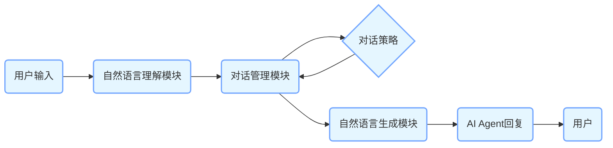

# 对话策略优化：提升AI Agent的交互质量

> 关键词：对话策略、AI Agent、交互质量、策略优化、自然语言处理、机器学习、强化学习

> 摘要：本文围绕对话策略优化以提升AI Agent的交互质量展开。首先介绍了相关背景，包括目的范围、预期读者等内容。接着阐述了对话策略等核心概念及其联系，详细讲解了核心算法原理和具体操作步骤，并给出Python源代码示例。通过数学模型和公式进一步剖析其内在原理，结合项目实战展示代码实现和解读。探讨了实际应用场景，推荐了相关工具和资源，最后总结未来发展趋势与挑战，解答常见问题并提供扩展阅读与参考资料，旨在为相关领域的研究者和开发者提供全面且深入的技术指导。

## 1. 背景介绍 
### 1.1 目的和范围
随着人工智能技术的飞速发展，AI Agent在各种领域的应用越来越广泛，如智能客服、智能助手等。然而，目前AI Agent的交互质量仍存在诸多问题，例如回答不准确、对话流程不流畅、缺乏个性化等。本文章的目的在于深入探讨对话策略优化的方法和技术，以提升AI Agent的交互质量，使其能够更好地满足用户需求。

本文的范围涵盖了对话策略的核心概念、算法原理、数学模型、项目实战、应用场景等多个方面，旨在为读者提供一个全面且深入的技术视角。

### 1.2 预期读者
本文预期读者包括人工智能领域的研究者、开发者、软件架构师、数据科学家等。对于对AI Agent交互技术感兴趣的初学者，也可以通过本文了解对话策略优化的基本原理和方法。

### 1.3 文档结构概述
本文将按照以下结构进行组织：首先介绍相关背景知识，包括目的范围、预期读者等；接着阐述对话策略等核心概念及其联系，并给出相应的文本示意图和Mermaid流程图；然后详细讲解核心算法原理和具体操作步骤，结合Python源代码进行说明；通过数学模型和公式进一步剖析其内在原理，并举例说明；进行项目实战，展示代码实现和解读；探讨实际应用场景；推荐相关工具和资源；最后总结未来发展趋势与挑战，解答常见问题并提供扩展阅读与参考资料。

### 1.4 术语表
#### 1.4.1 核心术语定义
- **AI Agent**：人工智能代理，是一种能够感知环境、做出决策并采取行动的智能实体。在对话系统中，AI Agent主要负责与用户进行交互。
- **对话策略**：指AI Agent在对话过程中选择合适的回复和行动的规则和方法。它决定了AI Agent如何根据用户的输入和当前对话状态来生成合适的回复。
- **交互质量**：衡量AI Agent与用户交互效果的指标，包括回答的准确性、对话的流畅性、个性化程度等多个方面。

#### 1.4.2 相关概念解释
- **自然语言处理（NLP）**：是人工智能的一个重要领域，主要研究如何让计算机理解和处理人类语言。在对话系统中，NLP技术用于对用户输入的自然语言进行解析和理解，以及生成自然语言回复。
- **机器学习（ML）**：是一门多领域交叉学科，涉及概率论、统计学、逼近论、凸分析、算法复杂度理论等多门学科。它专门研究计算机怎样模拟或实现人类的学习行为，以获取新的知识或技能，重新组织已有的知识结构使之不断改善自身的性能。在对话策略优化中，机器学习算法可用于训练AI Agent学习对话策略。
- **强化学习（RL）**：是机器学习中的一个领域，强调智能体（agent）如何在环境中采取一系列行动，以最大化累积奖励。在对话系统中，强化学习可以用于优化对话策略，使AI Agent能够在与用户的交互中不断学习和改进。

#### 1.4.3 缩略词列表
- **NLP**：Natural Language Processing（自然语言处理）
- **ML**：Machine Learning（机器学习）
- **RL**：Reinforcement Learning（强化学习）
- **RNN**：Recurrent Neural Network（循环神经网络）
- **LSTM**：Long Short - Term Memory（长短期记忆网络）
- **GRU**：Gated Recurrent Unit（门控循环单元）

## 2. 核心概念与联系 
### 核心概念原理
#### 对话策略
对话策略是AI Agent在对话过程中做出决策的依据。它可以基于规则、基于机器学习或基于强化学习等不同的方法来实现。基于规则的对话策略通过预定义的规则来选择回复，例如如果用户输入包含特定关键词，则返回相应的回复。基于机器学习的对话策略则通过对大量对话数据的学习来预测合适的回复。强化学习的对话策略则通过在与用户的交互中不断尝试和学习，以最大化长期奖励。

#### AI Agent
AI Agent是对话系统的核心组件，它负责感知用户的输入、理解用户的意图、选择合适的对话策略并生成回复。AI Agent通常由多个模块组成，包括自然语言理解模块、对话管理模块和自然语言生成模块。自然语言理解模块用于解析用户输入的自然语言，提取用户的意图和关键信息；对话管理模块根据用户意图和当前对话状态选择合适的对话策略；自然语言生成模块根据对话策略生成自然语言回复。

#### 交互质量
交互质量是衡量AI Agent与用户交互效果的重要指标。它包括多个方面，如回答的准确性、对话的流畅性、个性化程度等。回答的准确性指AI Agent的回复是否正确地回答了用户的问题；对话的流畅性指对话过程是否自然、连贯，没有明显的停顿或不恰当的转换；个性化程度指AI Agent是否能够根据用户的个人信息和历史对话记录提供个性化的服务。

### 架构的文本示意图
```plaintext
用户输入 ---> 自然语言理解模块 ---> 对话管理模块（包含对话策略） ---> 自然语言生成模块 ---> AI Agent回复 ---> 用户
```
这个示意图展示了AI Agent与用户交互的基本流程。用户输入自然语言，自然语言理解模块对其进行解析，提取用户意图和关键信息。对话管理模块根据这些信息和当前对话状态，运用对话策略选择合适的回复。自然语言生成模块将选择的回复转换为自然语言，最后AI Agent将回复呈现给用户。

### Mermaid流程图

该流程图更直观地展示了AI Agent与用户交互的过程。用户输入经过自然语言理解模块处理后，进入对话管理模块。对话管理模块依据对话策略做出决策，然后通过自然语言生成模块生成回复，最后将回复呈现给用户。

## 3. 核心算法原理 & 具体操作步骤 
### 基于规则的对话策略算法原理
基于规则的对话策略是最简单的对话策略实现方式。它通过预定义的规则来选择回复。例如，我们可以定义一个规则：如果用户输入包含关键词“天气”，则返回当前的天气信息。

#### Python源代码示例
```python
# 预定义规则
rules = {
    "天气": "当前天气晴朗，温度25摄氏度。",
    "时间": "现在是下午3点。"
}

def rule_based_dialogue(user_input):
    for keyword in rules:
        if keyword in user_input:
            return rules[keyword]
    return "抱歉，我不理解您的问题。"

# 测试
user_input = "今天天气怎么样？"
print(rule_based_dialogue(user_input))
```
#### 具体操作步骤
1. 定义规则：将关键词和对应的回复存储在一个字典中。
2. 解析用户输入：遍历规则字典，检查用户输入是否包含规则中的关键词。
3. 选择回复：如果找到匹配的关键词，则返回对应的回复；否则，返回默认回复。

### 基于机器学习的对话策略算法原理
基于机器学习的对话策略通常使用分类算法或序列生成算法。例如，我们可以使用循环神经网络（RNN）或其变体（如LSTM、GRU）来预测合适的回复。

#### Python源代码示例
```python
import tensorflow as tf
from tensorflow.keras.preprocessing.text import Tokenizer
from tensorflow.keras.preprocessing.sequence import pad_sequences
from tensorflow.keras.models import Sequential
from tensorflow.keras.layers import Embedding, LSTM, Dense

# 示例对话数据
questions = ["你好", "今天吃什么"]
answers = ["你好呀", "可以吃火锅或者炒菜"]

# 分词
tokenizer = Tokenizer()
tokenizer.fit_on_texts(questions + answers)
total_words = len(tokenizer.word_index) + 1

# 转换为序列
question_sequences = tokenizer.texts_to_sequences(questions)
answer_sequences = tokenizer.texts_to_sequences(answers)

# 填充序列
max_sequence_length = max([len(seq) for seq in question_sequences])
question_sequences = pad_sequences(question_sequences, maxlen=max_sequence_length)
answer_sequences = pad_sequences(answer_sequences, maxlen=max_sequence_length)

# 构建模型
model = Sequential()
model.add(Embedding(total_words, 100, input_length=max_sequence_length))
model.add(LSTM(100))
model.add(Dense(total_words, activation='softmax'))

# 编译模型
model.compile(loss='sparse_categorical_crossentropy', optimizer='adam', metrics=['accuracy'])

# 训练模型
model.fit(question_sequences, answer_sequences, epochs=100)

# 预测回复
def predict_reply(user_input):
    input_sequence = tokenizer.texts_to_sequences([user_input])
    input_sequence = pad_sequences(input_sequence, maxlen=max_sequence_length)
    predicted_sequence = model.predict(input_sequence)
    predicted_index = tf.argmax(predicted_sequence, axis=-1).numpy()[0]
    for word, index in tokenizer.word_index.items():
        if index == predicted_index:
            return word
    return "抱歉，我不理解您的问题。"

# 测试
user_input = "你好"
print(predict_reply(user_input))
```
#### 具体操作步骤
1. 数据准备：收集对话数据，包括问题和对应的回复。
2. 分词和序列转换：使用Tokenizer对文本进行分词，并将文本转换为序列。
3. 填充序列：将序列填充到相同的长度，以便输入到模型中。
4. 构建模型：使用Embedding、LSTM和Dense层构建一个序列生成模型。
5. 编译和训练模型：使用交叉熵损失函数和Adam优化器编译模型，并进行训练。
6. 预测回复：将用户输入转换为序列，输入到模型中进行预测，将预测结果转换为文本。

### 基于强化学习的对话策略算法原理
基于强化学习的对话策略通过在与用户的交互中不断尝试和学习，以最大化长期奖励。例如，我们可以使用Q - learning算法来优化对话策略。

#### Python源代码示例
```python
import numpy as np

# 定义状态和动作空间
states = ["state1", "state2"]
actions = ["action1", "action2"]

# 初始化Q表
Q = np.zeros((len(states), len(actions)))

# 定义超参数
alpha = 0.1  # 学习率
gamma = 0.9  # 折扣因子
epsilon = 0.1  # 探索率

# 定义奖励函数
def get_reward(state, action):
    if state == "state1" and action == "action1":
        return 1
    else:
        return -1

# Q - learning算法
def q_learning(state_index, action_index):
    state = states[state_index]
    action = actions[action_index]
    reward = get_reward(state, action)
    next_state_index = np.random.choice(len(states))
    max_q_next = np.max(Q[next_state_index])
    Q[state_index, action_index] += alpha * (reward + gamma * max_q_next - Q[state_index, action_index])
    return next_state_index

# 训练过程
current_state_index = 0
for _ in range(100):
    if np.random.uniform(0, 1) < epsilon:
        action_index = np.random.choice(len(actions))
    else:
        action_index = np.argmax(Q[current_state_index])
    current_state_index = q_learning(current_state_index, action_index)

# 选择动作
def choose_action(state_index):
    if np.random.uniform(0, 1) < epsilon:
        action_index = np.random.choice(len(actions))
    else:
        action_index = np.argmax(Q[state_index])
    return actions[action_index]

# 测试
state_index = 0
action = choose_action(state_index)
print(f"当前状态: {states[state_index]}, 选择的动作: {action}")
```
#### 具体操作步骤
1. 定义状态和动作空间：确定对话过程中可能的状态和AI Agent可以采取的动作。
2. 初始化Q表：Q表用于存储每个状态和动作的价值。
3. 定义超参数：包括学习率、折扣因子和探索率。
4. 定义奖励函数：根据状态和动作确定奖励值。
5. Q - learning算法更新：在每个时间步，根据当前状态选择动作，执行动作并获得奖励，更新Q表。
6. 选择动作：根据Q表选择价值最大的动作，或者以一定的概率进行探索。

## 4. 数学模型和公式 & 详细讲解 & 举例说明 
### 基于机器学习的对话策略数学模型
#### 循环神经网络（RNN）
RNN是一种用于处理序列数据的神经网络。其基本公式如下：
$$
h_t = \sigma(W_{hh}h_{t - 1}+W_{xh}x_t + b_h)
$$
$$
y_t = W_{hy}h_t + b_y
$$
其中，$x_t$ 是时间步 $t$ 的输入，$h_t$ 是时间步 $t$ 的隐藏状态，$y_t$ 是时间步 $t$ 的输出，$W_{hh}$、$W_{xh}$、$W_{hy}$ 是权重矩阵，$b_h$、$b_y$ 是偏置向量，$\sigma$ 是激活函数（如tanh或sigmoid）。

详细讲解：RNN通过将前一个时间步的隐藏状态 $h_{t - 1}$ 作为输入，结合当前时间步的输入 $x_t$，计算当前时间步的隐藏状态 $h_t$。然后，根据隐藏状态 $h_t$ 计算输出 $y_t$。这种结构使得RNN能够处理序列数据中的上下文信息。

举例说明：假设我们要处理一个句子 “Hello world”，将每个单词转换为向量作为输入 $x_t$。RNN会依次处理每个单词，在处理 “Hello” 时，根据初始隐藏状态 $h_0$ 和输入 “Hello” 计算隐藏状态 $h_1$；在处理 “world” 时，根据 $h_1$ 和输入 “world” 计算隐藏状态 $h_2$，以此类推。

#### 长短期记忆网络（LSTM）
LSTM是RNN的一种变体，它通过引入门控机制来解决RNN的梯度消失问题。其主要公式如下：
$$
i_t=\sigma(W_{ii}x_t + W_{hi}h_{t - 1}+b_i)
$$
$$
f_t=\sigma(W_{if}x_t + W_{hf}h_{t - 1}+b_f)
$$
$$
o_t=\sigma(W_{io}x_t + W_{ho}h_{t - 1}+b_o)
$$
$$
\tilde{C}_t=\tanh(W_{ic}x_t + W_{hc}h_{t - 1}+b_c)
$$
$$
C_t = f_t\odot C_{t - 1}+i_t\odot\tilde{C}_t
$$
$$
h_t = o_t\odot\tanh(C_t)
$$
其中，$i_t$ 是输入门，$f_t$ 是遗忘门，$o_t$ 是输出门，$\tilde{C}_t$ 是候选细胞状态，$C_t$ 是细胞状态，$\odot$ 表示逐元素相乘。

详细讲解：遗忘门 $f_t$ 决定了上一个时间步的细胞状态 $C_{t - 1}$ 有多少信息需要被遗忘；输入门 $i_t$ 决定了候选细胞状态 $\tilde{C}_t$ 有多少信息需要被添加到细胞状态 $C_t$ 中；输出门 $o_t$ 决定了细胞状态 $C_t$ 有多少信息需要被输出到隐藏状态 $h_t$ 中。

举例说明：在处理一个长句子时，LSTM的遗忘门可以忘记一些不重要的信息，输入门可以添加新的重要信息，输出门可以控制信息的输出，从而更好地处理长序列数据。

### 基于强化学习的对话策略数学模型
#### Q - learning算法
Q - learning算法的核心公式如下：
$$
Q(s,a)\leftarrow Q(s,a)+\alpha\left[r+\gamma\max_{a'}Q(s',a') - Q(s,a)\right]
$$
其中，$Q(s,a)$ 是状态 $s$ 下采取动作 $a$ 的价值，$\alpha$ 是学习率，$r$ 是执行动作 $a$ 后获得的奖励，$\gamma$ 是折扣因子，$s'$ 是执行动作 $a$ 后转移到的下一个状态。

详细讲解：Q - learning算法通过不断更新Q表来优化对话策略。在每个时间步，AI Agent根据当前状态 $s$ 选择动作 $a$，执行动作后获得奖励 $r$ 并转移到下一个状态 $s'$。然后，根据公式更新Q表中 $Q(s,a)$ 的值，使得 $Q(s,a)$ 逐渐逼近最优值。

举例说明：假设AI Agent处于状态 “用户询问天气”，选择动作 “返回天气信息”，执行动作后获得奖励1（因为回答正确），并转移到下一个状态 “用户继续询问其他问题”。根据Q - learning公式，更新Q表中 “用户询问天气” 状态下 “返回天气信息” 动作的价值。

## 5. 项目实战：代码实际案例和详细解释说明 
### 5.1  开发环境搭建
#### 操作系统
本项目可以在Windows、Linux或macOS等主流操作系统上进行开发。建议使用Ubuntu 18.04及以上版本的Linux系统，因为它对深度学习框架的支持较好。

#### 编程语言和版本
使用Python 3.7及以上版本。Python是一种功能强大且易于学习的编程语言，拥有丰富的机器学习和深度学习库。

#### 深度学习框架
使用TensorFlow 2.x版本。TensorFlow是一个开源的深度学习框架，提供了丰富的工具和API，方便进行模型的构建、训练和部署。

#### 安装依赖库
可以使用pip来安装所需的依赖库，以下是安装命令：
```sh
pip install tensorflow numpy pandas scikit - learn
```

### 5.2  源代码详细实现和代码解读
#### 数据准备
```python
import pandas as pd
from sklearn.model_selection import train_test_split
from tensorflow.keras.preprocessing.text import Tokenizer
from tensorflow.keras.preprocessing.sequence import pad_sequences

# 读取数据集
data = pd.read_csv('dialogue_data.csv')
questions = data['question'].tolist()
answers = data['answer'].tolist()

# 分词
tokenizer = Tokenizer()
tokenizer.fit_on_texts(questions + answers)
total_words = len(tokenizer.word_index) + 1

# 转换为序列
question_sequences = tokenizer.texts_to_sequences(questions)
answer_sequences = tokenizer.texts_to_sequences(answers)

# 填充序列
max_sequence_length = max([len(seq) for seq in question_sequences])
question_sequences = pad_sequences(question_sequences, maxlen=max_sequence_length)
answer_sequences = pad_sequences(answer_sequences, maxlen=max_sequence_length)

# 划分训练集和测试集
X_train, X_test, y_train, y_test = train_test_split(question_sequences, answer_sequences, test_size=0.2, random_state=42)
```
代码解读：首先，使用pandas读取对话数据集，将问题和答案分别存储在列表中。然后，使用Tokenizer对文本进行分词，并将文本转换为序列。接着，使用pad_sequences将序列填充到相同的长度。最后，使用train_test_split将数据集划分为训练集和测试集。

#### 模型构建
```python
from tensorflow.keras.models import Sequential
from tensorflow.keras.layers import Embedding, LSTM, Dense

# 构建模型
model = Sequential()
model.add(Embedding(total_words, 100, input_length=max_sequence_length))
model.add(LSTM(100))
model.add(Dense(total_words, activation='softmax'))

# 编译模型
model.compile(loss='sparse_categorical_crossentropy', optimizer='adam', metrics=['accuracy'])
```
代码解读：使用Sequential模型构建一个序列生成模型。首先，使用Embedding层将输入的序列转换为向量表示。然后，使用LSTM层处理序列数据，提取上下文信息。最后，使用Dense层进行分类，输出每个单词的概率。使用交叉熵损失函数和Adam优化器编译模型。

#### 模型训练
```python
# 训练模型
model.fit(X_train, y_train, epochs=100, batch_size=32, validation_data=(X_test, y_test))
```
代码解读：使用fit方法对模型进行训练，指定训练集、训练轮数、批次大小和验证集。

#### 模型预测
```python
def predict_reply(user_input):
    input_sequence = tokenizer.texts_to_sequences([user_input])
    input_sequence = pad_sequences(input_sequence, maxlen=max_sequence_length)
    predicted_sequence = model.predict(input_sequence)
    predicted_index = tf.argmax(predicted_sequence, axis=-1).numpy()[0]
    for word, index in tokenizer.word_index.items():
        if index == predicted_index:
            return word
    return "抱歉，我不理解您的问题。"

# 测试
user_input = "你好"
print(predict_reply(user_input))
```
代码解读：定义一个predict_reply函数，将用户输入转换为序列，输入到模型中进行预测，将预测结果转换为文本。

### 5.3  代码解读与分析
#### 数据处理
数据处理是对话系统的重要环节。通过分词和序列填充，将文本数据转换为适合模型输入的格式。划分训练集和测试集可以评估模型的泛化能力。

#### 模型构建
使用Embedding层可以将离散的单词转换为连续的向量表示，便于模型学习单词之间的语义关系。LSTM层可以处理序列数据中的上下文信息，提高模型的性能。Dense层用于分类，输出每个单词的概率。

#### 模型训练
使用交叉熵损失函数可以衡量模型预测结果与真实标签之间的差异，Adam优化器可以自适应地调整学习率，加速模型的收敛。

#### 模型预测
将用户输入转换为序列，输入到模型中进行预测，选择概率最大的单词作为回复。如果没有匹配的单词，则返回默认回复。

## 6. 实际应用场景 
### 智能客服
在智能客服场景中，AI Agent可以根据用户的问题选择合适的回复，解决用户的问题。通过优化对话策略，可以提高回答的准确性和对话的流畅性，提升用户体验。例如，在电商平台的智能客服中，AI Agent可以快速回答用户关于商品信息、订单状态等问题。

### 智能助手
智能助手如Siri、小爱同学等，可以与用户进行自然语言交互，提供各种服务。优化对话策略可以使智能助手更好地理解用户的意图，提供个性化的服务。例如，智能助手可以根据用户的历史对话记录和个人信息，推荐用户可能感兴趣的内容。

### 教育领域
在教育领域，AI Agent可以作为智能辅导系统，与学生进行交互，解答学生的问题，提供学习建议。通过优化对话策略，可以提高辅导的效果，帮助学生更好地学习。例如，智能辅导系统可以根据学生的学习进度和知识掌握情况，提供针对性的辅导。

### 医疗领域
在医疗领域，AI Agent可以作为在线问诊助手，与患者进行交互，收集患者的症状信息，提供初步的诊断建议。优化对话策略可以提高问诊的效率和准确性，为患者提供更好的服务。例如，在线问诊助手可以根据患者的症状描述，推荐可能的疾病和就诊科室。

## 7. 工具和资源推荐
### 7.1 学习资源推荐
#### 7.1.1 书籍推荐
- 《深度学习》（Deep Learning）：由Ian Goodfellow、Yoshua Bengio和Aaron Courville合著，是深度学习领域的经典教材，全面介绍了深度学习的基本原理和方法。
- 《Python自然语言处理》（Natural Language Processing with Python）：由Steven Bird、Ewan Klein和Edward Loper合著，详细介绍了Python在自然语言处理中的应用，包括分词、词性标注、命名实体识别等技术。
- 《强化学习：原理与Python实现》：介绍了强化学习的基本原理和算法，通过Python代码示例展示了如何实现强化学习算法。

#### 7.1.2 在线课程
- Coursera上的“深度学习专项课程”（Deep Learning Specialization）：由Andrew Ng教授授课，包括深度学习的基础、卷积神经网络、循环神经网络等内容。
- edX上的“自然语言处理基础”（Foundations of Natural Language Processing）：介绍了自然语言处理的基本概念和技术，包括词法分析、句法分析、语义分析等。
- Udemy上的“强化学习实战”（Reinforcement Learning in Action）：通过实际项目介绍了强化学习的应用和实现。

#### 7.1.3 技术博客和网站
- Medium：有很多关于人工智能、自然语言处理和强化学习的技术博客文章，作者来自世界各地的研究者和开发者。
- arXiv：提供了大量的学术论文，包括人工智能领域的最新研究成果。
- Towards Data Science：专注于数据科学和人工智能领域的技术文章，有很多关于对话系统和对话策略优化的文章。

### 7.2 开发工具框架推荐
#### 7.2.1 IDE和编辑器
- PyCharm：是一款专门为Python开发设计的集成开发环境，提供了丰富的代码编辑、调试和项目管理功能。
- Visual Studio Code：是一款轻量级的代码编辑器，支持多种编程语言，有丰富的插件可以扩展功能，适合Python开发。

#### 7.2.2 调试和性能分析工具
- TensorBoard：是TensorFlow提供的可视化工具，可以用于查看模型的训练过程、损失曲线、准确率等信息，帮助调试和优化模型。
- PyTorch Profiler：是PyTorch提供的性能分析工具，可以分析模型的运行时间、内存使用等情况，帮助优化模型性能。

#### 7.2.3 相关框架和库
- TensorFlow：是一个开源的深度学习框架，提供了丰富的工具和API，方便进行模型的构建、训练和部署。
- PyTorch：是另一个流行的深度学习框架，具有动态图的特点，易于使用和调试。
- NLTK：是Python的自然语言处理工具包，提供了分词、词性标注、命名实体识别等功能。
- SpaCy：是一个快速、高效的自然语言处理库，提供了各种语言的处理模型，支持多语言处理。

### 7.3 相关论文著作推荐
#### 7.3.1 经典论文
- “Attention Is All You Need”：提出了Transformer模型，是自然语言处理领域的重要突破，为后续的预训练模型（如BERT、GPT）奠定了基础。
- “Learning to Communicate with Deep Multi - Agent Reinforcement Learning”：介绍了多智能体强化学习在通信领域的应用，为对话系统的多智能体交互提供了理论基础。

#### 7.3.2 最新研究成果
- 关注ICML（国际机器学习会议）、NeurIPS（神经信息处理系统大会）、ACL（计算语言学协会年会）等顶级学术会议的最新研究成果，了解对话策略优化的最新技术和方法。

#### 7.3.3 应用案例分析
- 查看各大科技公司（如Google、Microsoft、Amazon等）的技术博客和研究报告，了解他们在对话系统和对话策略优化方面的应用案例和实践经验。

## 8. 总结：未来发展趋势与挑战
### 未来发展趋势
#### 多模态交互
未来的AI Agent将不仅仅局限于文本交互，还将支持语音、图像、手势等多模态交互方式。通过融合多种模态的信息，可以提高交互的自然度和效率。例如，用户可以通过语音和手势同时与AI Agent进行交互，AI Agent可以根据语音和手势信息更好地理解用户的意图。

#### 个性化和情感感知
AI Agent将更加注重个性化服务，根据用户的个人信息、历史对话记录和偏好提供个性化的回复和建议。同时，AI Agent将具备情感感知能力，能够识别用户的情感状态，并根据情感状态调整回复策略，提供更加贴心的服务。例如，当用户情绪低落时，AI Agent可以提供鼓励和安慰的回复。

#### 多智能体协作
在复杂的应用场景中，多个AI Agent可能需要协作完成任务。未来的对话策略将更加注重多智能体之间的协作和通信，提高团队的整体性能。例如，在智能客服场景中，多个AI Agent可以协作解决用户的复杂问题。

#### 知识图谱融合
将知识图谱与对话策略相结合，可以提高AI Agent的知识推理能力和回答的准确性。知识图谱可以提供丰富的领域知识，AI Agent可以根据知识图谱进行推理和回答。例如，在医疗领域，AI Agent可以根据知识图谱提供更加准确的诊断建议。

### 挑战
#### 数据质量和隐私问题
对话系统的训练需要大量的高质量数据。然而，数据的收集和标注是一项耗时耗力的工作，并且可能存在数据质量不高的问题。此外，用户的对话数据涉及隐私问题，如何保护用户的隐私是一个重要的挑战。

#### 语义理解和上下文处理
自然语言具有丰富的语义和上下文信息，如何准确地理解用户的语义和上下文是对话策略优化的关键问题。目前的技术在处理复杂的语义和长对话上下文方面还存在一定的局限性。

#### 可解释性和信任问题
AI Agent的决策过程往往是黑盒的，用户难以理解其决策依据。如何提高AI Agent的可解释性，增强用户对AI Agent的信任是一个重要的挑战。

#### 计算资源和效率问题
随着对话系统的复杂度不断增加，对计算资源的需求也越来越大。如何在有限的计算资源下提高对话系统的效率是一个亟待解决的问题。

## 9. 附录：常见问题与解答
### 问题1：如何选择合适的对话策略？
解答：选择合适的对话策略需要考虑多个因素，如应用场景、数据可用性、计算资源等。如果应用场景比较简单，数据量较小，可以选择基于规则的对话策略；如果数据量较大，可以选择基于机器学习或强化学习的对话策略。同时，还需要根据实际情况进行实验和评估，选择性能最优的对话策略。

### 问题2：如何处理用户的模糊输入？
解答：处理用户的模糊输入可以采用多种方法。例如，可以通过询问用户更多的信息来明确用户的意图；可以使用自然语言处理技术对用户输入进行语义理解，提取关键信息；还可以使用对话管理策略，根据上下文信息进行推理和猜测。

### 问题3：如何提高对话系统的性能？
解答：提高对话系统的性能可以从多个方面入手。例如，收集更多的高质量数据进行训练；优化对话策略，采用更先进的算法和技术；进行模型的调优和优化，调整超参数；进行对话系统的评估和测试，及时发现和解决问题。

### 问题4：如何保证对话系统的安全性和隐私性？
解答：保证对话系统的安全性和隐私性可以采取以下措施。例如，对用户的对话数据进行加密处理，防止数据泄露；采用访问控制和权限管理机制，限制对用户数据的访问；遵守相关的法律法规和隐私政策，保护用户的合法权益。

## 10. 扩展阅读 & 参考资料
### 扩展阅读
- 《人工智能：一种现代方法》（Artificial Intelligence: A Modern Approach）：全面介绍了人工智能的基本概念、方法和技术，是人工智能领域的经典教材。
- 《对话系统：从原理到实践》：详细介绍了对话系统的原理、技术和应用，对对话策略优化有深入的探讨。

### 参考资料
- 相关学术论文和研究报告，如ICML、NeurIPS、ACL等会议的论文。
- 各大科技公司的技术博客和开源项目，如Google的TensorFlow、Facebook的PyTorch等。
- 在线学习平台上的课程和教程，如Coursera、edX、Udemy等。