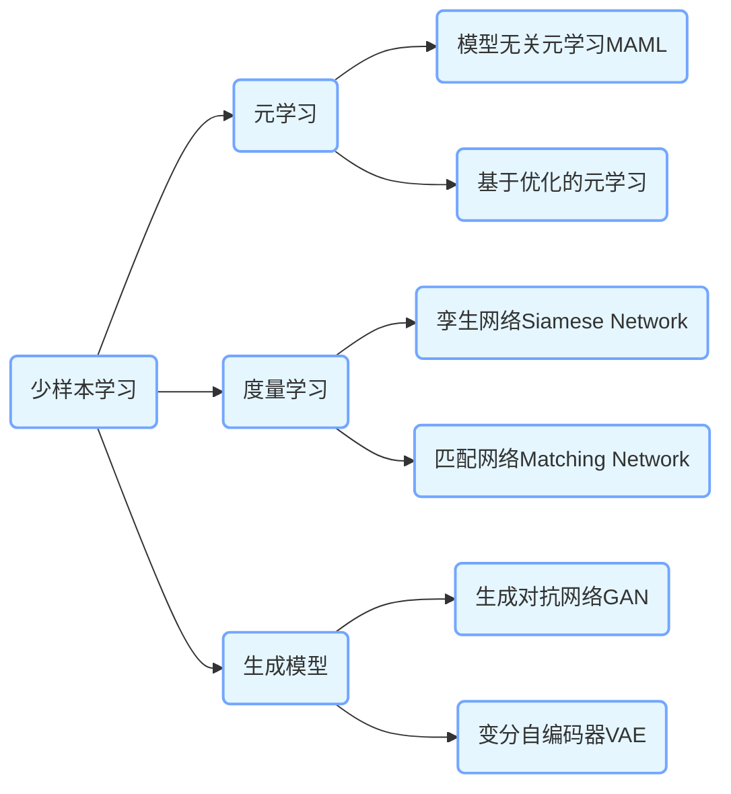

# 少样本学习:提高AI在稀疏数据环境中的表现

> 关键词：少样本学习、稀疏数据、人工智能、机器学习、元学习、度量学习、生成模型

> 摘要：在许多实际的人工智能应用场景中，往往面临着数据稀缺的问题，传统的机器学习方法在稀疏数据环境下表现不佳。少样本学习作为一种新兴的技术，旨在解决在少量样本数据情况下的学习问题，提高AI系统在稀疏数据环境中的表现。本文将深入探讨少样本学习的核心概念、算法原理、数学模型，通过项目实战展示其具体应用，并介绍相关的工具和资源，最后对少样本学习的未来发展趋势与挑战进行总结。

## 1. 背景介绍 
### 1.1 目的和范围
在当今的人工智能和机器学习领域，数据是训练模型的关键要素。然而，在很多实际场景中，获取大量有标注的数据是非常困难的，例如医疗影像、生物信息、金融风控等领域，标注数据的成本极高，或者数据本身就非常稀缺。少样本学习的目的就是在有限的样本数据下，让模型能够快速学习并具备良好的泛化能力，从而在稀疏数据环境中表现出色。本文的范围将涵盖少样本学习的基本概念、核心算法、数学模型、实际应用以及相关工具和资源等方面。

### 1.2 预期读者
本文预期读者包括对人工智能和机器学习有一定基础的研究人员、工程师、学生以及对少样本学习技术感兴趣的爱好者。通过阅读本文，读者可以深入了解少样本学习的原理和方法，掌握相关的技术细节，并能够将其应用到实际项目中。

### 1.3 文档结构概述
本文将按照以下结构进行组织：首先介绍少样本学习的背景知识，包括目的、预期读者和文档结构概述；接着阐述少样本学习的核心概念与联系，包括其原理和架构；然后详细讲解核心算法原理和具体操作步骤，并使用Python源代码进行阐述；之后介绍少样本学习的数学模型和公式，并举例说明；再通过项目实战展示少样本学习的实际应用；接着介绍少样本学习的实际应用场景；然后推荐相关的工具和资源；最后总结少样本学习的未来发展趋势与挑战，并提供常见问题与解答以及扩展阅读和参考资料。

### 1.4 术语表
#### 1.4.1 核心术语定义
- **少样本学习（Few-Shot Learning）**：指在只有少量标注样本的情况下，让模型能够学习并进行有效预测的学习方法。
- **元学习（Meta-Learning）**：也称为“学习如何学习”，通过在多个任务上进行训练，让模型学会快速适应新任务的能力。
- **度量学习（Metric Learning）**：旨在学习样本之间的距离度量，使得相似的样本在特征空间中距离更近，不相似的样本距离更远。
- **生成模型（Generative Model）**：用于生成新的数据样本，在少样本学习中可以帮助扩充样本数量。
- **支持集（Support Set）**：少样本学习中用于训练模型的少量标注样本集合。
- **查询集（Query Set）**：少样本学习中用于测试模型性能的样本集合。

#### 1.4.2 相关概念解释
- **过拟合（Overfitting）**：模型在训练数据上表现很好，但在测试数据上表现不佳的现象，通常是由于模型过于复杂，学习到了训练数据中的噪声和细节。
- **泛化能力（Generalization Ability）**：模型在未见过的数据上能够准确预测的能力，是衡量模型性能的重要指标。
- **任务（Task）**：在少样本学习中，一个任务通常由支持集和查询集组成，代表一个具体的学习问题。

#### 1.4.3 缩略词列表
- **MAML（Model-Agnostic Meta-Learning）**：模型无关元学习
- **Siamese Network**：孪生网络
- **GAN（Generative Adversarial Network）**：生成对抗网络
- **VAE（Variational Autoencoder）**：变分自编码器

## 2. 核心概念与联系 

少样本学习的核心目标是在少量标注样本的情况下，让模型能够快速学习并泛化到新的任务中。为了实现这一目标，少样本学习主要涉及到元学习、度量学习和生成模型等核心概念。

### 核心概念原理
- **元学习**：元学习的基本思想是让模型学会如何学习。通过在多个不同的任务上进行训练，模型可以学习到通用的学习策略和参数初始化方法，从而在面对新的少样本任务时能够快速适应。例如，在图像分类任务中，元学习模型可以学习到不同类别图像的特征表示和分类策略，当遇到新的图像类别时，只需要少量的样本就可以快速调整模型参数进行分类。
- **度量学习**：度量学习的核心是学习样本之间的距离度量。通过设计合适的损失函数，让模型学习到一个特征空间，使得相似的样本在该空间中距离更近，不相似的样本距离更远。在少样本学习中，度量学习可以帮助模型判断新样本与支持集中样本的相似度，从而进行分类或回归。例如，孪生网络通过比较两个样本的特征向量来判断它们是否属于同一类别。
- **生成模型**：生成模型可以用于生成新的数据样本。在少样本学习中，由于样本数量有限，生成模型可以帮助扩充样本数量，从而提高模型的泛化能力。例如，生成对抗网络（GAN）由生成器和判别器组成，生成器负责生成新的样本，判别器负责判断样本是真实的还是生成的，通过不断的对抗训练，生成器可以生成高质量的样本。

### 架构示意图


## 3. 核心算法原理 & 具体操作步骤 

### 元学习算法 - MAML（Model-Agnostic Meta-Learning）
#### 算法原理
MAML的核心思想是找到一个通用的模型参数初始化点，使得模型在经过少量的梯度更新后，能够在新的任务上快速收敛。具体来说，MAML通过在多个任务上进行训练，不断调整模型的初始参数，使得模型在每个任务上的梯度更新能够快速提高性能。

#### 具体操作步骤
1. **任务采样**：从任务分布中随机采样一批任务。
2. **内部循环**：对于每个任务，使用支持集对模型进行少量的梯度更新，得到新的模型参数。
3. **外部循环**：使用更新后的模型参数在查询集上计算损失，并对初始模型参数进行更新。
4. **重复步骤1-3**：不断重复上述步骤，直到模型收敛。

#### Python源代码实现
```python
import torch
import torch.nn as nn
import torch.optim as optim

# 定义一个简单的神经网络模型
class SimpleNet(nn.Module):
    def __init__(self):
        super(SimpleNet, self).__init__()
        self.fc1 = nn.Linear(10, 20)
        self.fc2 = nn.Linear(20, 1)

    def forward(self, x):
        x = torch.relu(self.fc1(x))
        x = self.fc2(x)
        return x

# 定义MAML算法
class MAML:
    def __init__(self, model, lr_inner=0.01, lr_outer=0.001, num_inner_steps=5):
        self.model = model
        self.lr_inner = lr_inner
        self.lr_outer = lr_outer
        self.num_inner_steps = num_inner_steps
        self.optimizer = optim.Adam(self.model.parameters(), lr=self.lr_outer)

    def train(self, tasks):
        meta_loss = 0
        for task in tasks:
            support_x, support_y, query_x, query_y = task
            # 内部循环
            fast_weights = list(self.model.parameters())
            for _ in range(self.num_inner_steps):
                output = self.model(support_x)
                loss = nn.MSELoss()(output, support_y)
                grads = torch.autograd.grad(loss, fast_weights)
                fast_weights = [w - self.lr_inner * g for w, g in zip(fast_weights, grads)]
            # 外部循环
            output = self.model.forward_with_weights(query_x, fast_weights)
            loss = nn.MSELoss()(output, query_y)
            meta_loss += loss
        meta_loss /= len(tasks)
        # 更新初始模型参数
        self.optimizer.zero_grad()
        meta_loss.backward()
        self.optimizer.step()
        return meta_loss
```

### 度量学习算法 - 孪生网络（Siamese Network）
#### 算法原理
孪生网络由两个共享参数的子网络组成，输入两个样本，通过子网络将样本映射到特征空间，然后计算两个样本在特征空间中的距离。在训练过程中，通过对比损失函数，让相似的样本距离更近，不相似的样本距离更远。

#### 具体操作步骤
1. **数据准备**：准备成对的样本，包括正样本对（属于同一类别）和负样本对（属于不同类别）。
2. **模型训练**：将成对的样本输入到孪生网络中，计算两个样本在特征空间中的距离，使用对比损失函数进行训练。
3. **模型预测**：对于新的样本，将其与支持集中的样本进行配对，计算距离，根据距离判断类别。

#### Python源代码实现
```python
import torch
import torch.nn as nn
import torch.optim as optim

# 定义孪生网络模型
class SiameseNetwork(nn.Module):
    def __init__(self):
        super(SiameseNetwork, self).__init__()
        self.fc1 = nn.Linear(10, 20)
        self.fc2 = nn.Linear(20, 10)

    def forward_once(self, x):
        x = torch.relu(self.fc1(x))
        x = self.fc2(x)
        return x

    def forward(self, input1, input2):
        output1 = self.forward_once(input1)
        output2 = self.forward_once(input2)
        return output1, output2

# 定义对比损失函数
class ContrastiveLoss(nn.Module):
    def __init__(self, margin=2.0):
        super(ContrastiveLoss, self).__init__()
        self.margin = margin

    def forward(self, output1, output2, label):
        euclidean_distance = nn.functional.pairwise_distance(output1, output2)
        loss_contrastive = torch.mean((1 - label) * torch.pow(euclidean_distance, 2) +
                                      label * torch.pow(torch.clamp(self.margin - euclidean_distance, min=0.0), 2))
        return loss_contrastive

# 训练孪生网络
model = SiameseNetwork()
criterion = ContrastiveLoss()
optimizer = optim.Adam(model.parameters(), lr=0.001)

# 假设已经有训练数据
train_data = [...]  # 成对的样本和标签

for epoch in range(100):
    for data in train_data:
        input1, input2, label = data
        optimizer.zero_grad()
        output1, output2 = model(input1, input2)
        loss = criterion(output1, output2, label)
        loss.backward()
        optimizer.step()
```

### 生成模型算法 - 生成对抗网络（GAN）
#### 算法原理
生成对抗网络由生成器和判别器组成。生成器负责生成新的样本，判别器负责判断样本是真实的还是生成的。通过不断的对抗训练，生成器和判别器的能力不断提高，最终生成器可以生成高质量的样本。

#### 具体操作步骤
1. **初始化**：初始化生成器和判别器的参数。
2. **训练判别器**：固定生成器的参数，使用真实样本和生成样本训练判别器，使其能够准确判断样本的真实性。
3. **训练生成器**：固定判别器的参数，训练生成器，使其生成的样本能够骗过判别器。
4. **重复步骤2-3**：不断重复上述步骤，直到生成器和判别器达到平衡。

#### Python源代码实现
```python
import torch
import torch.nn as nn
import torch.optim as optim
import torchvision
import torchvision.datasets as datasets
import torchvision.transforms as transforms

# 定义生成器
class Generator(nn.Module):
    def __init__(self, z_dim=100, img_dim=784):
        super(Generator, self).__init__()
        self.gen = nn.Sequential(
            nn.Linear(z_dim, 256),
            nn.LeakyReLU(0.1),
            nn.Linear(256, img_dim),
            nn.Tanh()
        )

    def forward(self, x):
        return self.gen(x)

# 定义判别器
class Discriminator(nn.Module):
    def __init__(self, img_dim=784):
        super(Discriminator, self).__init__()
        self.disc = nn.Sequential(
            nn.Linear(img_dim, 128),
            nn.LeakyReLU(0.1),
            nn.Linear(128, 1),
            nn.Sigmoid()
        )

    def forward(self, x):
        return self.disc(x)

# 超参数设置
device = torch.device("cuda" if torch.cuda.is_available() else "cpu")
lr = 3e-4
z_dim = 100
img_dim = 28 * 28
batch_size = 32
num_epochs = 50

# 数据加载
transform = transforms.Compose([
    transforms.ToTensor(),
    transforms.Normalize((0.5,), (0.5,))
])
dataset = datasets.MNIST(root='./data', train=True, transform=transform, download=True)
dataloader = torch.utils.data.DataLoader(dataset, batch_size=batch_size, shuffle=True)

# 初始化模型、优化器和损失函数
gen = Generator(z_dim, img_dim).to(device)
disc = Discriminator(img_dim).to(device)
opt_gen = optim.Adam(gen.parameters(), lr=lr)
opt_disc = optim.Adam(disc.parameters(), lr=lr)
criterion = nn.BCELoss()

# 训练GAN
for epoch in range(num_epochs):
    for batch_idx, (real, _) in enumerate(dataloader):
        real = real.view(-1, 784).to(device)
        batch_size = real.shape[0]

        ### 训练判别器
        noise = torch.randn(batch_size, z_dim).to(device)
        fake = gen(noise)
        disc_real = disc(real).view(-1)
        lossD_real = criterion(disc_real, torch.ones_like(disc_real))
        disc_fake = disc(fake.detach()).view(-1)
        lossD_fake = criterion(disc_fake, torch.zeros_like(disc_fake))
        lossD = (lossD_real + lossD_fake) / 2
        disc.zero_grad()
        lossD.backward()
        opt_disc.step()

        ### 训练生成器
        output = disc(fake).view(-1)
        lossG = criterion(output, torch.ones_like(output))
        gen.zero_grad()
        lossG.backward()
        opt_gen.step()

    print(f"Epoch [{epoch + 1}/{num_epochs}] Loss D: {lossD.item():.4f}, Loss G: {lossG.item():.4f}")
```

## 4. 数学模型和公式 & 详细讲解 & 举例说明 

### 元学习 - MAML的数学模型
MAML的目标是找到一个通用的模型参数 $\theta$，使得在经过少量的梯度更新后，模型在新任务上的损失最小。假设任务的损失函数为 $L(\theta)$，在内部循环中，使用支持集对模型进行梯度更新：
$$\theta'_i = \theta - \alpha \nabla_{\theta} L_{T_i}(\theta)$$
其中，$\theta'_i$ 是在第 $i$ 个任务上更新后的模型参数，$\alpha$ 是内部循环的学习率，$L_{T_i}(\theta)$ 是第 $i$ 个任务的损失函数。

在外部循环中，使用更新后的模型参数 $\theta'_i$ 在查询集上计算损失，并对初始模型参数 $\theta$ 进行更新：
$$\min_{\theta} \sum_{T_i \sim p(T)} L_{T_i}(\theta'_i)$$
其中，$p(T)$ 是任务的分布。

### 度量学习 - 孪生网络的数学模型
孪生网络使用对比损失函数来训练，对比损失函数的定义如下：
$$L = (1 - y) \cdot D^2 + y \cdot \max(0, m - D)^2$$
其中，$y$ 是样本对的标签（$y = 0$ 表示正样本对，$y = 1$ 表示负样本对），$D$ 是两个样本在特征空间中的欧几里得距离，$m$ 是一个正的常数，称为边界。

### 生成模型 - GAN的数学模型
GAN的目标是找到生成器 $G$ 和判别器 $D$ 的最优参数，使得生成器生成的样本能够骗过判别器，判别器能够准确判断样本的真实性。GAN的目标函数可以表示为：
$$\min_G \max_D V(D, G) = \mathbb{E}_{x \sim p_{data}(x)}[\log D(x)] + \mathbb{E}_{z \sim p_z(z)}[\log(1 - D(G(z)))]$$
其中，$p_{data}(x)$ 是真实数据的分布，$p_z(z)$ 是噪声的分布，$G(z)$ 是生成器生成的样本，$D(x)$ 是判别器对样本 $x$ 的判断结果。

### 举例说明
#### MAML举例
假设我们有一个简单的线性回归任务，任务的目标是学习一个线性函数 $y = wx + b$。在MAML中，我们首先随机初始化 $w$ 和 $b$ 的值，然后在多个不同的线性回归任务上进行训练。在每个任务中，我们使用支持集对 $w$ 和 $b$ 进行少量的梯度更新，得到新的 $w'$ 和 $b'$，然后使用更新后的 $w'$ 和 $b'$ 在查询集上计算损失，并对初始的 $w$ 和 $b$ 进行更新。经过多次训练后，模型可以学习到一个通用的 $w$ 和 $b$ 的初始化值，使得在面对新的线性回归任务时，只需要少量的梯度更新就可以快速收敛。

#### 孪生网络举例
假设我们有一个图像分类任务，我们使用孪生网络来判断两个图像是否属于同一类别。我们首先将图像输入到孪生网络中，得到两个图像在特征空间中的特征向量，然后计算两个特征向量的欧几里得距离。如果距离小于某个阈值，则认为两个图像属于同一类别，否则认为属于不同类别。在训练过程中，我们使用对比损失函数来训练孪生网络，使得相似的图像在特征空间中的距离更近，不相似的图像距离更远。

#### GAN举例
假设我们要生成手写数字图像，我们使用GAN来实现。生成器的输入是一个随机噪声向量，输出是一个手写数字图像。判别器的输入是一个图像，输出是该图像是真实图像还是生成图像的概率。在训练过程中，生成器不断生成新的手写数字图像，判别器不断判断图像的真实性。通过不断的对抗训练，生成器可以生成越来越逼真的手写数字图像。

## 5. 项目实战：代码实际案例和详细解释说明 

### 5.1  开发环境搭建
#### 安装Python
首先，确保你已经安装了Python 3.6及以上版本。你可以从Python官方网站（https://www.python.org/downloads/） 下载并安装Python。

#### 安装深度学习框架
我们将使用PyTorch作为深度学习框架。可以使用以下命令安装PyTorch：
```bash
pip install torch torchvision
```

#### 安装其他依赖库
还需要安装一些其他的依赖库，如NumPy、Matplotlib等：
```bash
pip install numpy matplotlib
```

### 5.2  源代码详细实现和代码解读
#### 少样本图像分类任务 - 使用孪生网络
```python
import torch
import torch.nn as nn
import torch.optim as optim
import torchvision
import torchvision.transforms as transforms
from torch.utils.data import DataLoader, Dataset
import numpy as np
import matplotlib.pyplot as plt

# 定义孪生网络模型
class SiameseNetwork(nn.Module):
    def __init__(self):
        super(SiameseNetwork, self).__init__()
        self.conv1 = nn.Conv2d(1, 64, kernel_size=3)
        self.pool1 = nn.MaxPool2d(2)
        self.conv2 = nn.Conv2d(64, 128, kernel_size=3)
        self.pool2 = nn.MaxPool2d(2)
        self.fc1 = nn.Linear(128 * 5 * 5, 512)
        self.fc2 = nn.Linear(512, 128)

    def forward_once(self, x):
        x = torch.relu(self.conv1(x))
        x = self.pool1(x)
        x = torch.relu(self.conv2(x))
        x = self.pool2(x)
        x = x.view(-1, 128 * 5 * 5)
        x = torch.relu(self.fc1(x))
        x = self.fc2(x)
        return x

    def forward(self, input1, input2):
        output1 = self.forward_once(input1)
        output2 = self.forward_once(input2)
        return output1, output2

# 定义对比损失函数
class ContrastiveLoss(nn.Module):
    def __init__(self, margin=2.0):
        super(ContrastiveLoss, self).__init__()
        self.margin = margin

    def forward(self, output1, output2, label):
        euclidean_distance = nn.functional.pairwise_distance(output1, output2)
        loss_contrastive = torch.mean((1 - label) * torch.pow(euclidean_distance, 2) +
                                      label * torch.pow(torch.clamp(self.margin - euclidean_distance, min=0.0), 2))
        return loss_contrastive

# 定义数据集类
class SiameseDataset(Dataset):
    def __init__(self, dataset):
        self.dataset = dataset
        self.classes = np.unique(dataset.targets)

    def __getitem__(self, index):
        img1, label1 = self.dataset[index]
        # 随机选择一个正样本或负样本
        if np.random.randint(0, 2):
            # 正样本
            indices = np.where(self.dataset.targets == label1)[0]
            index2 = np.random.choice(indices)
            label = 0
        else:
            # 负样本
            indices = np.where(self.dataset.targets != label1)[0]
            index2 = np.random.choice(indices)
            label = 1
        img2, _ = self.dataset[index2]
        return img1, img2, torch.tensor(label, dtype=torch.float32)

    def __len__(self):
        return len(self.dataset)

# 数据加载
transform = transforms.Compose([
    transforms.ToTensor(),
    transforms.Normalize((0.5,), (0.5,))
])
train_dataset = torchvision.datasets.MNIST(root='./data', train=True, transform=transform, download=True)
train_siamese_dataset = SiameseDataset(train_dataset)
train_dataloader = DataLoader(train_siamese_dataset, batch_size=32, shuffle=True)

# 初始化模型、优化器和损失函数
model = SiameseNetwork()
criterion = ContrastiveLoss()
optimizer = optim.Adam(model.parameters(), lr=0.001)

# 训练模型
num_epochs = 10
for epoch in range(num_epochs):
    running_loss = 0.0
    for img1, img2, label in train_dataloader:
        optimizer.zero_grad()
        output1, output2 = model(img1, img2)
        loss = criterion(output1, output2, label)
        loss.backward()
        optimizer.step()
        running_loss += loss.item()
    print(f"Epoch {epoch + 1}/{num_epochs}, Loss: {running_loss / len(train_dataloader)}")

# 测试模型
test_dataset = torchvision.datasets.MNIST(root='./data', train=False, transform=transform, download=True)
test_siamese_dataset = SiameseDataset(test_dataset)
test_dataloader = DataLoader(test_siamese_dataset, batch_size=1, shuffle=False)

correct = 0
total = 0
threshold = 1.0
with torch.no_grad():
    for img1, img2, label in test_dataloader:
        output1, output2 = model(img1, img2)
        euclidean_distance = nn.functional.pairwise_distance(output1, output2)
        predicted_label = (euclidean_distance > threshold).float()
        total += label.size(0)
        correct += (predicted_label == label).sum().item()

print(f"Accuracy: {correct / total * 100}%")
```

#### 代码解读
1. **数据加载**：使用 `torchvision.datasets.MNIST` 加载MNIST数据集，并将其转换为 `SiameseDataset` 类，该类用于生成成对的样本。
2. **模型定义**：定义了一个简单的孪生网络模型，包括卷积层、池化层和全连接层。
3. **损失函数定义**：使用对比损失函数 `ContrastiveLoss` 来训练孪生网络。
4. **训练过程**：在每个epoch中，遍历训练数据集，计算损失并更新模型参数。
5. **测试过程**：在测试数据集上，计算模型的准确率。

### 5.3  代码解读与分析
#### 优点
- **简单易懂**：代码结构清晰，易于理解和实现。
- **可扩展性**：可以很容易地扩展到其他数据集和任务中。
- **少样本学习能力**：通过孪生网络的对比学习，模型可以在少量样本的情况下进行分类。

#### 缺点
- **计算复杂度高**：孪生网络需要计算成对样本的距离，计算复杂度较高。
- **超参数敏感**：对比损失函数中的边界参数 $m$ 和距离阈值需要手动调整，对模型性能影响较大。

## 6. 实际应用场景 

### 医疗领域
在医疗领域，获取大量有标注的医疗影像数据是非常困难的，因为标注需要专业的医学知识和大量的时间。少样本学习可以在少量的医疗影像数据下，训练出能够准确诊断疾病的模型。例如，使用少样本学习技术可以在少量的肺癌CT影像数据下，训练出能够准确识别肺癌的模型，帮助医生进行早期诊断。

### 生物信息领域
在生物信息领域，基因序列数据、蛋白质结构数据等往往非常稀缺。少样本学习可以在少量的生物信息数据下，挖掘出生物分子的功能和相互作用机制。例如，使用少样本学习技术可以在少量的蛋白质序列数据下，预测蛋白质的功能和结构。

### 金融领域
在金融领域，金融交易数据往往是高度不平衡的，正样本（如欺诈交易）的数量非常少。少样本学习可以在少量的正样本数据下，训练出能够准确识别欺诈交易的模型，帮助金融机构防范风险。

### 安防领域
在安防领域，监控视频中的异常行为往往是非常罕见的，获取大量的异常行为样本非常困难。少样本学习可以在少量的异常行为样本下，训练出能够准确识别异常行为的模型，提高安防系统的智能化水平。

## 7. 工具和资源推荐
### 7.1 学习资源推荐
#### 7.1.1 书籍推荐
- 《深度学习》（Deep Learning）：由Ian Goodfellow、Yoshua Bengio和Aaron Courville所著，是深度学习领域的经典教材，涵盖了深度学习的基本概念、算法和应用。
- 《机器学习》（Machine Learning: A Probabilistic Perspective）：由Kevin P. Murphy所著，从概率的角度介绍了机器学习的基本概念和算法，对少样本学习的理论基础有很好的阐述。
- 《少样本学习》（Few-Shot Learning）：专门介绍少样本学习的书籍，涵盖了少样本学习的最新研究成果和应用案例。

#### 7.1.2 在线课程
- Coursera上的“深度学习专项课程”（Deep Learning Specialization）：由Andrew Ng教授主讲，是深度学习领域的经典在线课程，包括神经网络和深度学习、改善深层神经网络、结构化机器学习项目、卷积神经网络、序列模型等五个课程。
- edX上的“强化学习基础”（Fundamentals of Reinforcement Learning）：介绍了强化学习的基本概念和算法，对少样本学习中的元学习有一定的帮助。
- B站（哔哩哔哩）上的“李宏毅机器学习”：由李宏毅教授主讲，以通俗易懂的方式介绍了机器学习的基本概念和算法，包括少样本学习的相关内容。

#### 7.1.3 技术博客和网站
- arXiv.org：是一个预印本平台，提供了大量的学术论文，包括少样本学习的最新研究成果。
- Medium：是一个技术博客平台，有很多关于少样本学习的技术文章和经验分享。
- Towards Data Science：是一个专注于数据科学和机器学习的技术博客，提供了很多关于少样本学习的实用教程和案例分析。

### 7.2 开发工具框架推荐
#### 7.2.1 IDE和编辑器
- PyCharm：是一款专门为Python开发设计的集成开发环境（IDE），提供了代码编辑、调试、版本控制等功能，非常适合少样本学习项目的开发。
- Jupyter Notebook：是一个交互式的开发环境，支持Python、R等多种编程语言，适合进行数据探索、模型训练和结果可视化等工作。
- Visual Studio Code：是一款轻量级的代码编辑器，支持多种编程语言和插件，具有丰富的扩展功能，适合少样本学习项目的快速开发。

#### 7.2.2 调试和性能分析工具
- PyTorch Profiler：是PyTorch官方提供的性能分析工具，可以帮助用户分析模型的训练时间、内存使用等性能指标，优化模型的性能。
- TensorBoard：是TensorFlow官方提供的可视化工具，也可以与PyTorch结合使用，用于可视化模型的训练过程、损失曲线、准确率等指标。
- NVIDIA Nsight Systems：是一款专门为NVIDIA GPU设计的性能分析工具，可以帮助用户分析GPU的使用情况，优化模型的训练速度。

#### 7.2.3 相关框架和库
- PyTorch：是一个开源的深度学习框架，提供了丰富的神经网络模块和优化算法，非常适合少样本学习项目的开发。
- TensorFlow：是另一个开源的深度学习框架，具有广泛的应用场景和丰富的工具库，也可以用于少样本学习项目的开发。
- Scikit-learn：是一个开源的机器学习库，提供了多种机器学习算法和工具，如分类、回归、聚类等，对少样本学习中的数据预处理和模型评估有一定的帮助。

### 7.3 相关论文著作推荐
#### 7.3.1 经典论文
- “Model-Agnostic Meta-Learning for Fast Adaptation of Deep Networks”：介绍了MAML算法，是元学习领域的经典论文。
- “Siamese Neural Networks for One-shot Image Recognition”：介绍了孪生网络在少样本图像识别中的应用，是度量学习领域的经典论文。
- “Generative Adversarial Nets”：介绍了生成对抗网络（GAN）的基本原理和算法，是生成模型领域的经典论文。

#### 7.3.2 最新研究成果
- 关注arXiv.org上的最新论文，了解少样本学习领域的最新研究动态。
- 参加国际机器学习会议（ICML）、神经信息处理系统大会（NeurIPS）等学术会议，获取少样本学习领域的最新研究成果。

#### 7.3.3 应用案例分析
- 关注相关领域的学术期刊和会议，了解少样本学习在医疗、生物信息、金融等领域的应用案例。
- 参考开源项目和代码库，学习少样本学习在实际项目中的应用方法和技巧。

## 8. 总结：未来发展趋势与挑战 

### 未来发展趋势
- **多模态少样本学习**：结合图像、文本、音频等多种模态的数据进行少样本学习，提高模型的泛化能力和性能。
- **强化学习与少样本学习的结合**：将强化学习的思想引入少样本学习中，让模型能够在动态环境中快速学习和适应。
- **少样本学习在边缘计算中的应用**：随着边缘计算的发展，少样本学习可以在边缘设备上进行模型训练和推理，减少数据传输和计算成本。
- **少样本学习的理论研究**：深入研究少样本学习的理论基础，如样本复杂度、泛化误差等，为少样本学习的发展提供理论支持。

### 挑战
- **数据稀缺性**：少样本学习的核心问题是数据稀缺，如何在有限的样本数据下提高模型的性能仍然是一个挑战。
- **模型的泛化能力**：在少样本学习中，模型容易过拟合，如何提高模型的泛化能力是一个关键问题。
- **计算资源和时间成本**：少样本学习中的一些算法，如元学习和生成模型，计算复杂度较高，需要大量的计算资源和时间。
- **跨领域应用**：少样本学习在不同领域的应用需要考虑领域差异和数据特点，如何实现跨领域的少样本学习仍然是一个挑战。

## 9. 附录：常见问题与解答 

### 少样本学习和传统机器学习有什么区别？
少样本学习主要解决在少量样本数据下的学习问题，而传统机器学习通常需要大量的标注样本才能训练出性能良好的模型。少样本学习通过元学习、度量学习、生成模型等技术，在少量样本的情况下让模型能够快速学习并泛化到新的任务中。

### 少样本学习的应用场景有哪些限制？
少样本学习的应用场景主要受限于数据的稀缺性和领域的复杂性。在一些数据丰富的领域，传统机器学习方法可能更有效。此外，少样本学习在处理复杂任务和高维数据时，仍然面临着一定的挑战。

### 如何选择合适的少样本学习算法？
选择合适的少样本学习算法需要考虑数据的特点、任务的类型和计算资源等因素。例如，如果数据是图像数据，可以考虑使用度量学习算法；如果数据稀缺，可以考虑使用生成模型来扩充样本数量；如果任务是多任务学习，可以考虑使用元学习算法。

### 少样本学习中的超参数如何调整？
少样本学习中的超参数调整通常需要通过实验来确定。可以使用网格搜索、随机搜索等方法来寻找最优的超参数组合。此外，还可以使用贝叶斯优化等方法来提高超参数调整的效率。

## 10. 扩展阅读 & 参考资料 

### 扩展阅读
- 阅读相关的学术论文和技术博客，深入了解少样本学习的最新研究成果和应用案例。
- 参与开源项目和代码库，学习少样本学习在实际项目中的应用方法和技巧。
- 参加相关的学术会议和研讨会，与同行交流少样本学习的经验和心得。

### 参考资料
- 本文中引用的学术论文和书籍。
- 相关的技术博客和网站，如arXiv.org、Medium、Towards Data Science等。
- 开源项目和代码库，如GitHub上的少样本学习相关项目。