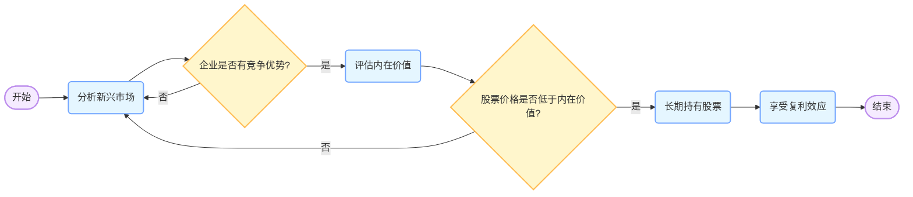

# 巴菲特 - 芒格的新兴市场投资哲学：长期视角的重要性

> 关键词：巴菲特、芒格、新兴市场、投资哲学、长期视角、价值投资、复利效应

> 摘要：本文深入探讨了巴菲特和芒格的新兴市场投资哲学，着重强调长期视角在投资中的关键重要性。通过对其核心概念与联系的分析、核心算法原理的阐述、数学模型的解读、项目实战案例的剖析，以及实际应用场景的介绍，全面展现了长期投资视角的价值和意义。同时，提供了相关的工具和资源推荐，对未来发展趋势与挑战进行了总结，并对常见问题进行了解答，旨在为投资者提供深入且实用的投资指导，帮助他们更好地理解和运用巴菲特 - 芒格的投资哲学。

## 1. 背景介绍 
### 1.1 目的和范围
本文的目的在于深入剖析巴菲特 - 芒格的新兴市场投资哲学，特别是长期视角在投资决策中的重要性。我们将探讨其投资哲学的理论基础、实际应用方法，并通过具体案例展示长期视角如何在新兴市场投资中发挥作用。范围涵盖了从投资哲学的基本概念到实际操作的各个方面，包括核心算法原理、数学模型、项目实战以及实际应用场景等，旨在为投资者提供全面而深入的理解。

### 1.2 预期读者
本文预期读者包括对投资领域感兴趣的个人投资者、金融专业人士、投资机构从业者以及对巴菲特 - 芒格投资哲学有研究需求的学者和学生。无论您是投资新手还是经验丰富的专业人士，都能从本文中获得有价值的信息和启示。

### 1.3 文档结构概述
本文将按照以下结构进行阐述：首先介绍背景信息，包括目的、预期读者和文档结构概述；接着深入探讨核心概念与联系，展示相关的原理和架构；然后详细讲解核心算法原理和具体操作步骤，并结合数学模型和公式进行分析；通过项目实战案例，展示代码实现和详细解释；介绍实际应用场景；推荐相关的工具和资源；总结未来发展趋势与挑战；解答常见问题；最后提供扩展阅读和参考资料。

### 1.4 术语表
#### 1.4.1 核心术语定义
- **新兴市场**：指发展中国家或地区的金融市场，通常具有较高的经济增长率和发展潜力，但也伴随着较高的风险和不确定性。
- **长期视角**：在投资中，指投资者以较长的时间跨度（通常为数年甚至数十年）来评估投资项目的价值和潜力，而不是关注短期的市场波动。
- **价值投资**：一种投资策略，强调通过分析公司的基本面，寻找被低估的股票，并长期持有，以实现资产的增值。
- **复利效应**：指在投资过程中，利息或收益不仅基于本金计算，还基于之前累积的利息或收益计算，从而实现资产的加速增长。

#### 1.4.2 相关概念解释
- **护城河理论**：巴菲特提出的概念，指公司具有的一种可持续的竞争优势，能够保护公司的市场份额和盈利能力，使其在长期竞争中脱颖而出。
- **安全边际**：在价值投资中，指投资者购买股票的价格低于其内在价值的幅度，以降低投资风险。

#### 1.4.3 缩略词列表
- **PE**：市盈率（Price - Earnings Ratio），指股票价格与每股收益的比率，用于评估股票的估值水平。
- **ROE**：净资产收益率（Return on Equity），指公司净利润与净资产的比率，反映公司运用自有资本的效率。

## 2. 核心概念与联系 
### 核心概念原理
巴菲特和芒格的投资哲学基于价值投资理念，强调通过深入分析公司的基本面，寻找具有长期竞争优势和稳定盈利能力的企业进行投资。在新兴市场中，由于市场的不确定性和波动性较大，长期视角尤为重要。

长期视角意味着投资者不会被短期的市场波动所左右，而是关注企业的长期发展潜力和内在价值。通过长期持有优质企业的股票，投资者可以分享企业成长带来的收益，同时避免频繁交易带来的成本和风险。

价值投资的核心是寻找被低估的股票，即股票价格低于其内在价值的股票。巴菲特和芒格通过对企业的财务报表、行业地位、管理团队等多方面进行分析，评估企业的内在价值。当股票价格低于其内在价值时，他们认为这是一个投资机会，并会长期持有该股票，等待市场对企业价值的重新认识。

### 架构的文本示意图
```plaintext
巴菲特 - 芒格投资哲学
|-- 价值投资理念
|   |-- 分析企业基本面
|   |   |-- 财务报表
|   |   |-- 行业地位
|   |   |-- 管理团队
|   |-- 评估内在价值
|   |-- 寻找被低估股票
|-- 长期视角
|   |-- 忽略短期波动
|   |-- 关注长期发展潜力
|   |-- 长期持有优质企业股票
|-- 复利效应
|   |-- 资产加速增长
|-- 护城河理论
|   |-- 可持续竞争优势
|-- 安全边际
|   |-- 降低投资风险
```

### Mermaid 流程图


## 3. 核心算法原理 & 具体操作步骤 
### 核心算法原理
在巴菲特 - 芒格的投资哲学中，核心算法原理主要围绕价值评估和风险控制展开。我们可以通过以下 Python 代码来模拟一个简单的价值评估过程：

```python
class Company:
    def __init__(self, name, earnings_per_share, growth_rate, required_rate_of_return):
        self.name = name
        self.earnings_per_share = earnings_per_share
        self.growth_rate = growth_rate
        self.required_rate_of_return = required_rate_of_return

    def calculate_intrinsic_value(self, years=10):
        """
        计算企业的内在价值
        使用股息折现模型（简化版）
        """
        intrinsic_value = 0
        for year in range(1, years + 1):
            future_earnings = self.earnings_per_share * (1 + self.growth_rate) ** year
            discounted_earnings = future_earnings / (1 + self.required_rate_of_return) ** year
            intrinsic_value += discounted_earnings
        return intrinsic_value


# 示例使用
company = Company("示例公司", 2, 0.1, 0.15)
intrinsic_value = company.calculate_intrinsic_value()
print(f"示例公司的内在价值为: {intrinsic_value}")
```

### 具体操作步骤
1. **选择新兴市场**：首先，投资者需要选择具有发展潜力的新兴市场。这可以通过研究宏观经济数据、政策环境、行业发展趋势等因素来确定。
2. **筛选企业**：在选定的新兴市场中，筛选具有竞争优势的企业。可以从行业地位、品牌影响力、技术实力、管理团队等方面进行评估。
3. **评估内在价值**：使用财务分析工具和模型，如上述代码中的股息折现模型，评估企业的内在价值。同时，考虑企业的护城河和安全边际。
4. **比较价格与内在价值**：将企业的股票价格与内在价值进行比较。如果股票价格低于内在价值，且企业具有长期发展潜力，则可以考虑投资。
5. **长期持有**：一旦做出投资决策，投资者应长期持有股票，忽略短期的市场波动。通过长期持有，享受企业成长带来的复利效应。

## 4. 数学模型和公式 & 详细讲解 & 举例说明 
### 股息折现模型（Dividend Discount Model, DDM）
股息折现模型是一种常用的股票估值模型，其基本原理是将股票的未来股息折现到当前时刻，以计算股票的内在价值。公式如下：

$$V = \sum_{t = 1}^{n} \frac{D_t}{(1 + r)^t}$$

其中：
- $V$ 表示股票的内在价值
- $D_t$ 表示第 $t$ 期的股息
- $r$ 表示投资者要求的必要收益率
- $n$ 表示预测的期数

### 详细讲解
股息折现模型的核心思想是，股票的价值取决于其未来所能带来的现金流（即股息）。由于未来的股息存在不确定性，因此需要将其折现到当前时刻，以反映货币的时间价值。

在实际应用中，我们通常需要对未来的股息进行预测。一种简化的方法是假设股息以固定的增长率 $g$ 增长，即 $D_t = D_0(1 + g)^t$，其中 $D_0$ 表示当前的股息。此时，股息折现模型可以简化为：

$$V = \frac{D_1}{r - g}$$

其中 $D_1 = D_0(1 + g)$ 表示下一期的股息。

### 举例说明
假设某公司当前的股息为 $2$ 元，预计股息增长率为 $10\%$，投资者要求的必要收益率为 $15\%$。则下一期的股息 $D_1 = 2\times(1 + 0.1) = 2.2$ 元。

根据简化的股息折现模型，该公司股票的内在价值为：

$$V = \frac{2.2}{0.15 - 0.1} = \frac{2.2}{0.05} = 44$$（元）

如果该公司股票的当前市场价格低于 $44$ 元，则从价值投资的角度来看，该股票可能被低估，具有投资价值。

## 5. 项目实战：代码实际案例和详细解释说明 
### 5.1  开发环境搭建
- **编程语言**：Python 3.x
- **开发工具**：可以选择 PyCharm、Jupyter Notebook 等集成开发环境。
- **所需库**：`pandas`、`numpy` 用于数据处理和分析，`matplotlib` 用于数据可视化。

可以使用以下命令安装所需库：
```bash
pip install pandas numpy matplotlib
```

### 5.2  源代码详细实现和代码解读
以下是一个更完整的项目实战代码示例，用于分析新兴市场中企业的投资价值：

```python
import pandas as pd
import numpy as np
import matplotlib.pyplot as plt


class CompanyAnalysis:
    def __init__(self, data_path):
        self.data = pd.read_csv(data_path)

    def calculate_growth_rate(self, column):
        """
        计算某一列数据的平均增长率
        """
        values = self.data[column].values
        growth_rates = []
        for i in range(1, len(values)):
            growth_rate = (values[i] - values[i - 1]) / values[i - 1]
            growth_rates.append(growth_rate)
        return np.mean(growth_rates)

    def calculate_intrinsic_value(self, earnings_per_share_column, growth_rate, required_rate_of_return, years=10):
        """
        计算企业的内在价值
        """
        latest_earnings_per_share = self.data[earnings_per_share_column].iloc[-1]
        intrinsic_value = 0
        for year in range(1, years + 1):
            future_earnings = latest_earnings_per_share * (1 + growth_rate) ** year
            discounted_earnings = future_earnings / (1 + required_rate_of_return) ** year
            intrinsic_value += discounted_earnings
        return intrinsic_value

    def plot_earnings_trend(self, earnings_per_share_column):
        """
        绘制每股收益的趋势图
        """
        plt.plot(self.data.index, self.data[earnings_per_share_column])
        plt.xlabel('年份')
        plt.ylabel('每股收益')
        plt.title('每股收益趋势')
        plt.show()


# 示例使用
data_path = 'company_data.csv'
analysis = CompanyAnalysis(data_path)

# 计算每股收益的平均增长率
growth_rate = analysis.calculate_growth_rate('earnings_per_share')

# 计算内在价值
required_rate_of_return = 0.15
intrinsic_value = analysis.calculate_intrinsic_value('earnings_per_share', growth_rate, required_rate_of_return)
print(f"企业的内在价值为: {intrinsic_value}")

# 绘制每股收益趋势图
analysis.plot_earnings_trend('earnings_per_share')
```

### 5.3  代码解读与分析
- **`__init__` 方法**：初始化类，读取存储企业数据的 CSV 文件。
- **`calculate_growth_rate` 方法**：计算某一列数据的平均增长率，通过计算相邻数据的增长率并取平均值得到。
- **`calculate_intrinsic_value` 方法**：根据股息折现模型计算企业的内在价值，使用最新的每股收益和计算得到的增长率进行计算。
- **`plot_earnings_trend` 方法**：绘制每股收益的趋势图，帮助投资者直观地了解企业的盈利情况。

通过这个代码示例，投资者可以对新兴市场中的企业进行基本的财务分析和价值评估，为投资决策提供参考。

## 6. 实际应用场景 
### 新兴市场股票投资
在新兴市场中，股票市场具有较高的波动性和不确定性。巴菲特 - 芒格的长期视角投资哲学可以帮助投资者避免被短期的市场波动所影响，专注于企业的长期发展潜力。例如，在一些新兴的科技行业中，虽然短期内股价可能会因为市场情绪、政策变化等因素而波动，但具有核心技术和创新能力的企业在长期内有望实现持续增长。投资者通过长期持有这些企业的股票，可以分享企业成长带来的收益。

### 新兴市场企业并购
在新兴市场的企业并购中，长期视角也非常重要。并购方需要考虑被并购企业的长期发展战略、核心竞争力以及协同效应等因素，而不仅仅关注短期的财务指标。通过长期的整合和发展，实现企业价值的提升。例如，一些跨国公司在新兴市场进行并购时，会注重被并购企业的品牌价值、市场份额和技术实力，通过长期的资源整合和业务拓展，实现双方的互利共赢。

### 新兴市场风险投资
风险投资在新兴市场中具有重要的作用。投资者需要以长期视角来评估创业企业的潜力和风险。虽然创业企业在初期可能面临较高的失败率，但一旦成功，将带来巨大的回报。巴菲特 - 芒格的投资哲学可以帮助风险投资者筛选出具有长期发展潜力的创业企业，并在企业成长过程中提供持续的支持。例如，在一些新兴的生物科技、人工智能等领域，风险投资者通过长期投资，支持创新企业的研发和发展，推动行业的进步。

## 7. 工具和资源推荐
### 7.1 学习资源推荐
#### 7.1.1 书籍推荐
- 《聪明的投资者》（The Intelligent Investor）：本杰明·格雷厄姆著，被誉为价值投资的圣经，是巴菲特的启蒙书籍。
- 《巴菲特致股东的信：股份公司教程》（Letters to Shareholders of Berkshire Hathaway）：沃伦·巴菲特著，通过巴菲特写给股东的信，深入了解他的投资哲学和理念。
- 《穷查理宝典：查理·芒格的智慧箴言录》（Poor Charlie's Almanack: The Wit and Wisdom of Charles T. Munger）：彼得·考夫曼编著，全面介绍了查理·芒格的投资思想和人生智慧。

#### 7.1.2 在线课程
- Coursera 上的“投资学原理”（Principles of Investing）课程，由知名教授授课，系统讲解投资的基本原理和方法。
- edX 上的“价值投资基础”（Foundations of Value Investing）课程，深入探讨价值投资的理论和实践。

#### 7.1.3 技术博客和网站
- 雪球网：国内知名的投资社区，提供丰富的投资资讯、分析报告和投资者交流平台。
- Seeking Alpha：国外知名的投资研究网站，有大量的专业分析师发布的投资分析文章。

### 7.2 开发工具框架推荐
#### 7.2.1 IDE和编辑器
- PyCharm：功能强大的 Python 集成开发环境，提供代码编辑、调试、版本控制等功能。
- Jupyter Notebook：交互式的开发环境，适合数据探索和分析，方便展示代码和结果。

#### 7.2.2 调试和性能分析工具
- `pdb`：Python 自带的调试工具，可以帮助开发者定位代码中的问题。
- `cProfile`：Python 性能分析工具，用于分析代码的性能瓶颈。

#### 7.2.3 相关框架和库
- `pandas`：强大的数据处理和分析库，提供数据结构和数据操作功能。
- `numpy`：用于科学计算的基础库，提供高效的数组操作和数学函数。
- `matplotlib`：用于数据可视化的库，可以绘制各种类型的图表。

### 7.3 相关论文著作推荐
#### 7.3.1 经典论文
- Eugene F. Fama 和 Kenneth R. French 的“Common Risk Factors in the Returns on Stocks and Bonds”，提出了三因子模型，对资产定价理论有重要贡献。
- Benjamin Graham 和 David Dodd 的“Security Analysis”，奠定了价值投资的理论基础。

#### 7.3.2 最新研究成果
- 关注顶级金融学术期刊，如《Journal of Finance》《Review of Financial Studies》等，了解新兴市场投资领域的最新研究动态。

#### 7.3.3 应用案例分析
- 阅读知名投资机构的研究报告和案例分析，如高盛、摩根士丹利等发布的关于新兴市场投资的报告，学习实际应用中的投资策略和方法。

## 8. 总结：未来发展趋势与挑战
### 未来发展趋势
- **新兴市场的重要性不断提升**：随着全球经济的发展，新兴市场在世界经济中的地位日益重要。新兴市场国家的经济增长速度较快，消费市场潜力巨大，将吸引更多的投资者关注。
- **科技驱动的投资机会增加**：新兴市场在科技领域的发展迅速，如人工智能、大数据、区块链等技术的应用不断拓展。这些科技领域的创新企业将成为未来投资的热点。
- **可持续投资理念的兴起**：投资者越来越关注企业的社会责任和可持续发展能力。在新兴市场中，符合可持续发展理念的企业将更具投资价值。

### 挑战
- **政治和政策风险**：新兴市场国家的政治环境和政策稳定性相对较差，可能会对投资产生不利影响。投资者需要密切关注政治动态和政策变化，做好风险防范。
- **市场波动和不确定性**：新兴市场的股票市场、汇率市场等波动较大，投资者需要具备较强的风险承受能力和应对能力。
- **信息不对称**：在新兴市场中，信息披露可能不够完善，投资者获取信息的难度较大。这需要投资者加强信息收集和分析能力，提高投资决策的准确性。

## 9. 附录：常见问题与解答
### 问题 1：如何判断一个新兴市场是否具有投资潜力？
解答：可以从宏观经济数据、政策环境、行业发展趋势等方面进行评估。例如，关注新兴市场国家的 GDP 增长率、通货膨胀率、财政政策和货币政策等。同时，研究新兴市场中具有发展潜力的行业，如科技、消费、医疗等。

### 问题 2：长期投资是否意味着一直持有股票，不进行任何操作？
解答：不是的。长期投资并不意味着盲目持有股票。投资者需要定期对投资组合进行评估和调整，根据企业的基本面变化、市场环境变化等因素，决定是否继续持有或卖出股票。

### 问题 3：在新兴市场中，如何控制投资风险？
解答：可以通过分散投资、设定止损点、关注企业的护城河和安全边际等方法来控制投资风险。分散投资可以降低单一股票或行业的风险；设定止损点可以在股票价格下跌到一定程度时及时卖出，避免损失进一步扩大；关注企业的护城河和安全边际可以选择具有较强竞争力和较低估值的企业进行投资。

## 10. 扩展阅读 & 参考资料
- [1] 本杰明·格雷厄姆. 《聪明的投资者》. 人民邮电出版社.
- [2] 沃伦·巴菲特. 《巴菲特致股东的信：股份公司教程》. 机械工业出版社.
- [3] 彼得·考夫曼. 《穷查理宝典：查理·芒格的智慧箴言录》. 中信出版社.
- [4] Eugene F. Fama, Kenneth R. French. “Common Risk Factors in the Returns on Stocks and Bonds”. Journal of Financial Economics.
- [5] Benjamin Graham, David Dodd. “Security Analysis”. McGraw - Hill.
- [6] 雪球网. https://xueqiu.com/
- [7] Seeking Alpha. https://seekingalpha.com/
- [8] Coursera. https://www.coursera.org/
- [9] edX. https://www.edx.org/ 