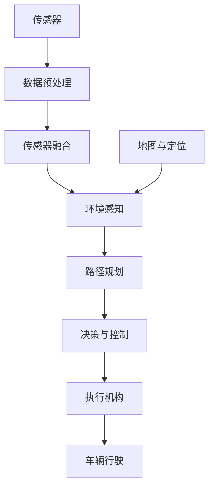

# 巴菲特 - 芒格的无人驾驶技术投资：交通革命的前夜

> 关键词：巴菲特、芒格、无人驾驶技术、投资、交通革命、人工智能、自动驾驶

> 摘要：本文围绕巴菲特 - 芒格的无人驾驶技术投资展开探讨。深入分析这一投资决策背后的原因和意义，介绍无人驾驶技术的核心概念、算法原理、数学模型等基础知识。通过项目实战案例详细阐述无人驾驶技术的代码实现和应用。同时，探讨无人驾驶技术的实际应用场景，推荐相关的学习资源、开发工具和研究论文。最后，总结无人驾驶技术未来的发展趋势与挑战，解答常见问题并提供参考资料，旨在全面展现无人驾驶技术在交通领域引发革命的潜力以及巴菲特 - 芒格投资决策的前瞻性。

## 1. 背景介绍 
### 1.1 目的和范围
本文旨在深入剖析巴菲特 - 芒格对无人驾驶技术的投资行为，探讨其投资决策背后的逻辑以及对交通领域未来发展的影响。通过对无人驾驶技术从基础概念到实际应用的全面介绍，帮助读者了解这一新兴技术的发展现状和潜力，以及它如何在交通领域引发一场革命。文章的范围涵盖无人驾驶技术的核心原理、算法实现、数学模型、项目实战、应用场景等多个方面，同时还会涉及到相关的学习资源、开发工具和研究成果。

### 1.2 预期读者
本文预期读者包括对投资领域感兴趣的人士，尤其是关注巴菲特 - 芒格投资理念和决策的投资者；从事无人驾驶技术、人工智能、汽车工程等相关领域的技术人员和研究人员；以及对未来交通发展趋势感兴趣的普通读者。希望通过本文，能为不同背景的读者提供有价值的信息和思考。

### 1.3 文档结构概述
本文将按照以下结构展开：首先介绍背景信息，包括目的、预期读者和文档结构概述，以及相关术语表。接着阐述无人驾驶技术的核心概念与联系，包括原理和架构的文本示意图及 Mermaid 流程图。然后详细讲解核心算法原理和具体操作步骤，通过 Python 源代码进行阐述。再介绍数学模型和公式，并举例说明。之后通过项目实战展示代码实际案例和详细解释。随后探讨无人驾驶技术的实际应用场景。接着推荐相关的工具和资源，包括学习资源、开发工具框架和相关论文著作。最后总结无人驾驶技术未来的发展趋势与挑战，解答常见问题并提供参考资料。

### 1.4 术语表
#### 1.4.1 核心术语定义
- **无人驾驶技术**：也称为自动驾驶技术，是指车辆在不需要人类驾驶员直接操作的情况下，通过车载传感器、算法和控制系统等实现自主行驶的技术。
- **传感器融合**：将多种不同类型的传感器（如激光雷达、摄像头、毫米波雷达等）的数据进行整合和处理，以获取更全面、准确的环境信息。
- **路径规划**：根据车辆当前位置、目标位置和环境信息，规划出一条安全、高效的行驶路径。
- **决策与控制**：根据传感器获取的环境信息和路径规划结果，做出行驶决策（如加速、减速、转弯等），并控制车辆的执行机构实现这些决策。

#### 1.4.2 相关概念解释
- **人工智能**：是一门研究如何使计算机能够模拟人类智能的学科，无人驾驶技术中广泛应用了人工智能的技术，如机器学习、深度学习等，用于环境感知、决策等任务。
- **机器学习**：是人工智能的一个分支，通过让计算机从数据中学习模式和规律，从而实现预测和决策。在无人驾驶技术中，机器学习算法可以用于目标检测、识别等任务。
- **深度学习**：是一种基于人工神经网络的机器学习方法，具有强大的特征提取和模式识别能力。在无人驾驶技术中，深度学习被广泛应用于图像识别、目标检测等领域。

#### 1.4.3 缩略词列表
- **LIDAR**：Light Detection and Ranging，激光雷达
- **GPS**：Global Positioning System，全球定位系统
- **IMU**：Inertial Measurement Unit，惯性测量单元
- **CAN**：Controller Area Network，控制器局域网

## 2. 核心概念与联系 
无人驾驶技术是一个复杂的系统工程，涉及多个核心概念和技术领域，它们相互关联、协同工作，共同实现车辆的自主行驶。

### 核心概念原理和架构的文本示意图
无人驾驶系统主要由感知层、决策层和执行层三个部分组成。

感知层：负责获取车辆周围的环境信息，包括障碍物、道路标志、交通信号等。主要通过各种传感器实现，如激光雷达、摄像头、毫米波雷达、超声波传感器等。激光雷达可以提供高精度的三维环境信息，摄像头可以获取丰富的视觉信息，毫米波雷达可以检测目标的速度和距离，超声波传感器则常用于近距离检测。

决策层：根据感知层获取的环境信息，结合车辆的当前状态和任务目标，做出行驶决策，如选择行驶路径、判断是否需要停车、避让障碍物等。决策层通常采用人工智能算法，如机器学习、深度学习等，对环境信息进行分析和处理，以实现智能决策。

执行层：根据决策层的指令，控制车辆的执行机构，如发动机、刹车、转向系统等，实现车辆的行驶动作。执行层需要与车辆的电子控制系统进行接口，确保指令能够准确地传达和执行。

### Mermaid 流程图

该流程图展示了无人驾驶技术的主要工作流程。首先，各种传感器收集车辆周围的环境数据，经过数据预处理和传感器融合后，进行环境感知。同时，地图与定位信息也会辅助环境感知。然后，根据环境感知结果进行路径规划和决策与控制，最终将决策指令发送给执行机构，实现车辆的行驶。

## 3. 核心算法原理 & 具体操作步骤 
无人驾驶技术中涉及多种核心算法，下面以目标检测算法为例，详细讲解其原理和具体操作步骤，并使用 Python 源代码进行阐述。

### 目标检测算法原理
目标检测是无人驾驶技术中环境感知的重要任务之一，其目的是在图像或点云数据中识别出感兴趣的目标（如车辆、行人、障碍物等），并确定其位置和类别。常用的目标检测算法有基于深度学习的 Faster R - CNN、YOLO 等。

这里以 YOLO（You Only Look Once）算法为例进行介绍。YOLO 算法是一种基于单阶段的目标检测算法，其核心思想是将目标检测问题转化为回归问题。YOLO 算法将输入图像划分为多个网格，每个网格负责预测一定数量的边界框（bounding box）及其对应的类别概率。通过一次前向传播，就可以同时得到图像中所有目标的位置和类别信息，因此具有较高的检测速度。

### 具体操作步骤
1. **数据准备**：收集包含目标的图像数据集，并进行标注，标注信息包括目标的边界框位置和类别标签。
2. **模型训练**：选择合适的 YOLO 模型架构（如 YOLOv5），并使用准备好的数据集进行训练。在训练过程中，模型会学习如何从图像中提取特征，并预测目标的位置和类别。
3. **模型推理**：使用训练好的模型对新的图像进行推理，得到目标的检测结果。

### Python 源代码实现
```python
import torch
from PIL import Image
import cv2
import numpy as np

# 加载预训练的 YOLOv5 模型
model = torch.hub.load('ultralytics/yolov5', 'yolov5s', pretrained=True)

# 读取图像
image_path = 'test_image.jpg'
image = Image.open(image_path)

# 进行目标检测
results = model(image)

# 获取检测结果
detections = results.pandas().xyxy[0]

# 绘制检测结果
image_cv = cv2.cvtColor(np.array(image), cv2.COLOR_RGB2BGR)
for index, detection in detections.iterrows():
    x1, y1, x2, y2 = int(detection['xmin']), int(detection['ymin']), int(detection['xmax']), int(detection['ymax'])
    class_name = detection['name']
    confidence = detection['confidence']
    cv2.rectangle(image_cv, (x1, y1), (x2, y2), (0, 255, 0), 2)
    cv2.putText(image_cv, f'{class_name}: {confidence:.2f}', (x1, y1 - 10), cv2.FONT_HERSHEY_SIMPLEX, 0.9, (0, 255, 0), 2)

# 显示结果
cv2.imshow('Object Detection', image_cv)
cv2.waitKey(0)
cv2.destroyAllWindows()
```
### 代码解释
1. **加载预训练模型**：使用 `torch.hub.load` 函数加载预训练的 YOLOv5 模型。
2. **读取图像**：使用 `PIL.Image.open` 函数读取待检测的图像。
3. **进行目标检测**：将图像输入到模型中，得到检测结果。
4. **获取检测结果**：使用 `pandas().xyxy[0]` 方法获取检测结果的边界框信息、类别名称和置信度。
5. **绘制检测结果**：使用 OpenCV 库在图像上绘制边界框和类别标签。
6. **显示结果**：使用 `cv2.imshow` 函数显示检测结果。

## 4. 数学模型和公式 & 详细讲解 & 举例说明 
在无人驾驶技术中，涉及多个数学模型和公式，下面以卡尔曼滤波为例进行介绍。

### 卡尔曼滤波原理
卡尔曼滤波是一种用于估计系统状态的最优递归滤波器，在无人驾驶技术中，常用于传感器融合和状态估计。其基本思想是通过对系统的状态方程和观测方程进行递归计算，不断更新系统状态的估计值，以减小估计误差。

### 数学模型和公式
卡尔曼滤波的数学模型包括状态方程和观测方程：

状态方程：
$$
\mathbf{x}_{k} = \mathbf{F}_{k}\mathbf{x}_{k - 1} + \mathbf{B}_{k}\mathbf{u}_{k} + \mathbf{w}_{k}
$$
其中，$\mathbf{x}_{k}$ 是 $k$ 时刻的系统状态向量，$\mathbf{F}_{k}$ 是状态转移矩阵，$\mathbf{B}_{k}$ 是控制输入矩阵，$\mathbf{u}_{k}$ 是 $k$ 时刻的控制输入向量，$\mathbf{w}_{k}$ 是过程噪声向量，服从均值为零、协方差为 $\mathbf{Q}_{k}$ 的高斯分布。

观测方程：
$$
\mathbf{z}_{k} = \mathbf{H}_{k}\mathbf{x}_{k} + \mathbf{v}_{k}
$$
其中，$\mathbf{z}_{k}$ 是 $k$ 时刻的观测向量，$\mathbf{H}_{k}$ 是观测矩阵，$\mathbf{v}_{k}$ 是观测噪声向量，服从均值为零、协方差为 $\mathbf{R}_{k}$ 的高斯分布。

卡尔曼滤波的递归计算步骤如下：

1. **预测步骤**：
    - 预测状态估计值：
$$
\hat{\mathbf{x}}_{k|k - 1} = \mathbf{F}_{k}\hat{\mathbf{x}}_{k - 1|k - 1} + \mathbf{B}_{k}\mathbf{u}_{k}
$$
    - 预测误差协方差：
$$
\mathbf{P}_{k|k - 1} = \mathbf{F}_{k}\mathbf{P}_{k - 1|k - 1}\mathbf{F}_{k}^{T} + \mathbf{Q}_{k}
$$

2. **更新步骤**：
    - 计算卡尔曼增益：
$$
\mathbf{K}_{k} = \mathbf{P}_{k|k - 1}\mathbf{H}_{k}^{T}(\mathbf{H}_{k}\mathbf{P}_{k|k - 1}\mathbf{H}_{k}^{T} + \mathbf{R}_{k})^{-1}
$$
    - 更新状态估计值：
$$
\hat{\mathbf{x}}_{k|k} = \hat{\mathbf{x}}_{k|k - 1} + \mathbf{K}_{k}(\mathbf{z}_{k} - \mathbf{H}_{k}\hat{\mathbf{x}}_{k|k - 1})
$$
    - 更新误差协方差：
$$
\mathbf{P}_{k|k} = (\mathbf{I} - \mathbf{K}_{k}\mathbf{H}_{k})\mathbf{P}_{k|k - 1}
$$

### 举例说明
假设我们要估计一个一维运动物体的位置和速度，状态向量 $\mathbf{x} = [p, v]^T$，其中 $p$ 是位置，$v$ 是速度。状态转移矩阵 $\mathbf{F} = \begin{bmatrix} 1 & \Delta t \\ 0 & 1 \end{bmatrix}$，观测矩阵 $\mathbf{H} = \begin{bmatrix} 1 & 0 \end{bmatrix}$，过程噪声协方差 $\mathbf{Q} = \begin{bmatrix} \sigma_{p}^{2} & 0 \\ 0 & \sigma_{v}^{2} \end{bmatrix}$，观测噪声协方差 $\mathbf{R} = \sigma_{z}^{2}$。

以下是一个简单的 Python 代码示例：
```python
import numpy as np

# 初始化参数
dt = 0.1  # 时间步长
F = np.array([[1, dt], [0, 1]])  # 状态转移矩阵
H = np.array([[1, 0]])  # 观测矩阵
Q = np.array([[0.1, 0], [0, 0.01]])  # 过程噪声协方差
R = np.array([[1]])  # 观测噪声协方差

# 初始状态估计和误差协方差
x_hat = np.array([[0], [0]])  # 初始状态估计
P = np.array([[1, 0], [0, 1]])  # 初始误差协方差

# 模拟观测数据
true_positions = np.linspace(0, 10, 100)
observations = true_positions + np.random.normal(0, np.sqrt(R[0, 0]), 100)

# 卡尔曼滤波
estimated_positions = []
for z in observations:
    # 预测步骤
    x_hat_minus = F @ x_hat
    P_minus = F @ P @ F.T + Q

    # 更新步骤
    K = P_minus @ H.T @ np.linalg.inv(H @ P_minus @ H.T + R)
    x_hat = x_hat_minus + K @ (z - H @ x_hat_minus)
    P = (np.eye(2) - K @ H) @ P_minus

    estimated_positions.append(x_hat[0, 0])

# 绘制结果
import matplotlib.pyplot as plt
plt.plot(true_positions, label='True Positions')
plt.plot(observations, 'o', label='Observations')
plt.plot(estimated_positions, label='Estimated Positions')
plt.legend()
plt.show()
```
在这个示例中，我们模拟了一个一维运动物体的真实位置，并加入了观测噪声。通过卡尔曼滤波，我们对物体的位置进行了估计，并绘制了真实位置、观测值和估计值的曲线。可以看到，卡尔曼滤波能够有效地减小观测噪声的影响，得到更准确的位置估计。

## 5. 项目实战：代码实际案例和详细解释说明 
### 5.1  开发环境搭建
在进行无人驾驶技术的项目实战之前，需要搭建相应的开发环境。以下是一些主要的步骤：

1. **操作系统**：推荐使用 Ubuntu 18.04 或更高版本，因为它在无人驾驶技术开发中得到了广泛的支持。
2. **编程语言**：主要使用 Python 进行开发，Python 具有丰富的库和工具，适合快速开发和实验。
3. **深度学习框架**：选择 PyTorch 或 TensorFlow 作为深度学习框架，这里以 PyTorch 为例。可以使用以下命令安装 PyTorch：
```bash
pip install torch torchvision
```
4. **传感器驱动**：根据使用的传感器类型，安装相应的驱动程序。例如，如果使用激光雷达，需要安装对应的 ROS（Robot Operating System）驱动包。
5. **开发工具**：推荐使用 Visual Studio Code 作为代码编辑器，它具有丰富的插件和良好的代码编辑体验。

### 5.2  源代码详细实现和代码解读
下面我们实现一个简单的无人驾驶模拟项目，包括环境感知、路径规划和决策控制。

```python
import numpy as np
import matplotlib.pyplot as plt

# 环境感知模块
class EnvironmentPerception:
    def __init__(self):
        self.obstacles = []

    def add_obstacle(self, position, size):
        self.obstacles.append((position, size))

    def detect_obstacles(self, vehicle_position):
        detected_obstacles = []
        for obstacle, size in self.obstacles:
            distance = np.linalg.norm(np.array(obstacle) - np.array(vehicle_position))
            if distance < size:
                detected_obstacles.append(obstacle)
        return detected_obstacles

# 路径规划模块
class PathPlanning:
    def __init__(self):
        pass

    def plan_path(self, start, goal, obstacles):
        # 简单的直线规划
        path = [start]
        num_steps = 10
        step = np.array(goal) - np.array(start)
        step = step / num_steps
        for i in range(1, num_steps + 1):
            point = np.array(start) + i * step
            # 检查是否与障碍物碰撞
            collision = False
            for obstacle in obstacles:
                distance = np.linalg.norm(point - np.array(obstacle))
                if distance < 1:
                    collision = True
                    break
            if collision:
                # 简单的避障策略：绕开障碍物
                point = point + np.array([1, 0])
            path.append(point)
        return path

# 决策控制模块
class DecisionControl:
    def __init__(self):
        pass

    def control_vehicle(self, path, vehicle_position):
        next_point = path[1]
        direction = np.array(next_point) - np.array(vehicle_position)
        direction = direction / np.linalg.norm(direction)
        return direction

# 主程序
if __name__ == '__main__':
    # 初始化环境感知模块
    perception = EnvironmentPerception()
    perception.add_obstacle((5, 5), 2)

    # 初始化车辆位置和目标位置
    vehicle_position = [0, 0]
    goal = [10, 10]

    # 环境感知
    detected_obstacles = perception.detect_obstacles(vehicle_position)

    # 路径规划
    planner = PathPlanning()
    path = planner.plan_path(vehicle_position, goal, detected_obstacles)

    # 决策控制
    controller = DecisionControl()
    direction = controller.control_vehicle(path, vehicle_position)

    # 绘制结果
    plt.figure()
    plt.plot([p[0] for p in path], [p[1] for p in path], 'b-', label='Path')
    for obstacle, size in perception.obstacles:
        circle = plt.Circle(obstacle, size, color='r', fill=False)
        plt.gca().add_artist(circle)
    plt.plot(vehicle_position[0], vehicle_position[1], 'go', label='Vehicle')
    plt.plot(goal[0], goal[1], 'ro', label='Goal')
    plt.legend()
    plt.show()
```
### 5.3  代码解读与分析
1. **环境感知模块**：`EnvironmentPerception` 类负责模拟环境中的障碍物，并检测车辆周围的障碍物。`add_obstacle` 方法用于添加障碍物，`detect_obstacles` 方法用于检测车辆周围的障碍物。
2. **路径规划模块**：`PathPlanning` 类负责根据车辆的起始位置、目标位置和检测到的障碍物规划路径。`plan_path` 方法实现了一个简单的直线规划算法，并在遇到障碍物时进行简单的避障。
3. **决策控制模块**：`DecisionControl` 类负责根据规划的路径控制车辆的行驶方向。`control_vehicle` 方法计算车辆的行驶方向。
4. **主程序**：在主程序中，我们初始化了环境感知模块、车辆位置和目标位置，进行了环境感知、路径规划和决策控制，并绘制了结果。

这个示例只是一个简单的无人驾驶模拟项目，实际的无人驾驶系统要复杂得多，需要考虑更多的因素，如传感器精度、实时性、复杂的环境等。

## 6. 实际应用场景 
无人驾驶技术具有广泛的实际应用场景，以下是一些主要的应用领域：

### 智能交通领域
- **自动驾驶汽车**：这是无人驾驶技术最直接的应用场景。自动驾驶汽车可以提高交通安全，减少交通事故的发生。据统计，大部分交通事故是由人为因素引起的，如疲劳驾驶、酒驾等。无人驾驶技术可以避免这些人为因素的影响，提高行车安全性。此外，自动驾驶汽车还可以提高交通效率，优化交通流量，减少交通拥堵。
- **智能公交系统**：无人驾驶公交可以按照固定的路线和时间表运行，提高公交服务的准时性和可靠性。同时，无人驾驶公交可以实现车辆之间的协同行驶，进一步提高交通效率。

### 物流运输领域
- **无人配送车辆**：在物流配送领域，无人配送车辆可以实现货物的自动运输和配送。例如，电商企业可以使用无人配送车辆将商品送到消费者手中，提高配送效率，降低人力成本。
- **港口和机场的无人运输**：在港口和机场，无人驾驶技术可以用于货物的装卸和运输。例如，无人驾驶的集装箱卡车可以在港口自动运输集装箱，提高货物的运输效率。

### 特殊环境作业领域
- **矿山作业**：在矿山环境中，无人驾驶技术可以用于矿石的开采和运输。无人驾驶的矿车可以在恶劣的环境中运行，提高作业安全性和效率。
- **农业作业**：无人驾驶的农业机械可以实现自动播种、施肥、收割等作业，提高农业生产效率，降低劳动强度。

### 军事领域
- **无人战车**：无人驾驶技术可以用于军事领域，制造无人战车。无人战车可以在危险的战场环境中执行任务，减少人员伤亡。
- **无人机**：无人机是无人驾驶技术在军事领域的另一个重要应用。无人机可以执行侦察、监视、打击等任务，具有灵活性高、成本低等优点。

## 7. 工具和资源推荐
### 7.1 学习资源推荐
#### 7.1.1 书籍推荐
- 《无人驾驶原理与实践》：这本书全面介绍了无人驾驶技术的基本原理、算法和实践案例，适合初学者和有一定基础的读者阅读。
- 《Python 深度学习》：介绍了深度学习的基本原理和 Python 实现，对于理解无人驾驶技术中的深度学习算法有很大帮助。
- 《机器人学导论》：涵盖了机器人学的基本概念、运动学、动力学等内容，对于理解无人驾驶车辆的运动控制有重要意义。

#### 7.1.2 在线课程
- Coursera 上的 “Self - Driving Cars Specialization”：由顶尖大学的教授授课，系统地介绍了无人驾驶技术的各个方面，包括传感器、算法、控制等。
- edX 上的 “Introduction to Autonomous Vehicles”：提供了无人驾驶技术的入门知识，适合初学者学习。

#### 7.1.3 技术博客和网站
- Medium 上的无人驾驶技术相关博客：有很多行业专家和研究人员分享的最新技术和研究成果。
- IEEE Xplore：提供了大量的学术论文和研究报告，对于深入了解无人驾驶技术的前沿研究有很大帮助。

### 7.2 开发工具框架推荐
#### 7.2.1 IDE和编辑器
- Visual Studio Code：功能强大的代码编辑器，支持多种编程语言和插件，适合开发无人驾驶技术相关的代码。
- PyCharm：专业的 Python 开发 IDE，具有代码调试、自动补全、代码分析等功能。

#### 7.2.2 调试和性能分析工具
- gdb：强大的调试工具，可用于调试 C、C++ 等语言编写的代码。
- TensorBoard：用于可视化深度学习模型的训练过程和性能指标。

#### 7.2.3 相关框架和库
- ROS（Robot Operating System）：广泛应用于机器人和无人驾驶领域的开源框架，提供了丰富的工具和库，方便开发者进行机器人开发和测试。
- OpenCV：开源的计算机视觉库，提供了各种图像处理和计算机视觉算法，可用于无人驾驶技术中的环境感知。
- PyTorch 和 TensorFlow：深度学习框架，可用于实现无人驾驶技术中的机器学习和深度学习算法。

### 7.3 相关论文著作推荐
#### 7.3.1 经典论文
- “You Only Look Once: Unified, Real - Time Object Detection”：介绍了 YOLO 目标检测算法，是目标检测领域的经典论文。
- “Kalman Filtering: Theory and Practice Using MATLAB”：详细介绍了卡尔曼滤波的理论和实践，对于理解无人驾驶技术中的状态估计有重要参考价值。

#### 7.3.2 最新研究成果
- 关注顶级学术会议，如 CVPR（Computer Vision and Pattern Recognition）、ICRA（International Conference on Robotics and Automation）等，这些会议上会发布很多关于无人驾驶技术的最新研究成果。

#### 7.3.3 应用案例分析
- 一些汽车制造商和科技公司会发布他们在无人驾驶技术方面的应用案例，如特斯拉、谷歌的 Waymo 等。这些案例可以帮助我们了解无人驾驶技术在实际应用中的情况和挑战。

## 8. 总结：未来发展趋势与挑战
### 未来发展趋势
- **技术不断进步**：随着人工智能、传感器技术、通信技术等的不断发展，无人驾驶技术将不断完善。例如，传感器的精度将不断提高，深度学习算法将更加高效，从而提高无人驾驶车辆的环境感知和决策能力。
- **应用场景不断拓展**：无人驾驶技术将不仅仅应用于汽车领域，还将在物流、农业、军事等更多领域得到广泛应用。例如，无人配送车辆将成为物流行业的重要发展方向，无人驾驶农业机械将提高农业生产的智能化水平。
- **产业生态逐渐完善**：无人驾驶技术的发展将带动相关产业的发展，形成一个完整的产业生态。例如，传感器制造商、芯片制造商、软件开发商等将共同参与到无人驾驶技术的研发和应用中。

### 挑战
- **技术挑战**：尽管无人驾驶技术取得了很大的进展，但仍然面临一些技术挑战。例如，在复杂环境下的环境感知和决策能力仍然有待提高，如何处理极端天气条件下的行驶问题也是一个难题。
- **法律和伦理问题**：无人驾驶技术的发展带来了一系列的法律和伦理问题。例如，在发生交通事故时，责任如何划分；无人驾驶车辆在面临道德困境时应该如何决策等。
- **社会接受度**：无人驾驶技术的推广还面临社会接受度的问题。一些人对无人驾驶技术的安全性存在疑虑，担心无人驾驶车辆会对人类的生命安全造成威胁。

## 9. 附录：常见问题与解答
### 1. 无人驾驶技术安全吗？
无人驾驶技术的安全性是一个备受关注的问题。目前，无人驾驶技术还在不断发展和完善中，虽然已经取得了很大的进展，但仍然存在一定的安全风险。例如，传感器可能会出现故障，算法可能会出现错误等。然而，与人类驾驶相比，无人驾驶技术具有一些优势，如不会疲劳、不会受到情绪的影响等。随着技术的不断进步，无人驾驶技术的安全性将不断提高。

### 2. 无人驾驶技术会导致大量失业吗？
无人驾驶技术的发展可能会对一些与驾驶相关的职业产生影响，如出租车司机、货车司机等。然而，它也会创造一些新的就业机会，如无人驾驶技术的研发、维护和管理等。此外，无人驾驶技术的应用还会带动相关产业的发展，从而创造更多的就业岗位。因此，无人驾驶技术对就业的影响是复杂的，不能简单地认为它会导致大量失业。

### 3. 无人驾驶技术什么时候能够大规模应用？
无人驾驶技术的大规模应用受到多种因素的影响，如技术成熟度、法律和法规的完善、社会接受度等。目前，无人驾驶技术已经在一些特定场景下得到了应用，如封闭园区内的自动驾驶车辆。预计在未来几年内，无人驾驶技术将在更多的场景下得到应用，但要实现大规模的商业化应用，还需要一定的时间。

## 10. 扩展阅读 & 参考资料
### 扩展阅读
- 《人工智能时代》：探讨了人工智能技术对社会和经济的影响，对于理解无人驾驶技术在未来社会中的地位和作用有一定的帮助。
- 《未来交通》：介绍了未来交通的发展趋势和新技术，包括无人驾驶技术、智能交通系统等。

### 参考资料
- 相关学术论文和研究报告，如 IEEE Xplore 上的论文、各大高校和研究机构发布的研究报告等。
- 汽车制造商和科技公司的官方网站，如特斯拉、谷歌的 Waymo 等公司的网站，可获取他们在无人驾驶技术方面的最新进展和应用案例。
- 行业媒体和资讯平台，如汽车之家、36 氪等，可获取无人驾驶技术的行业动态和市场信息。