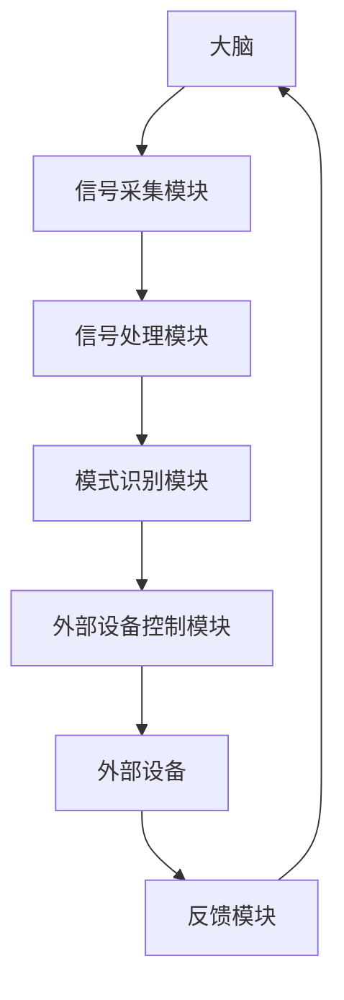

# 巴菲特 - 芒格的脑机接口工作效率投资：认知增强的产业化

> 关键词：巴菲特、芒格、脑机接口、工作效率、认知增强、产业化、投资

> 摘要：本文深入探讨了巴菲特 - 芒格的投资理念与脑机接口这一新兴技术在提升工作效率和认知增强方面的关联及产业化前景。首先介绍了脑机接口的背景知识，包括其概念、发展历程等，接着阐述了脑机接口提升工作效率和认知的核心原理与算法。通过数学模型对其效果进行量化分析，并结合实际案例展示了脑机接口在不同场景中的应用。探讨了脑机接口产业化面临的机遇与挑战，最后对其未来发展趋势进行了展望，旨在为相关领域的研究、投资和应用提供全面且深入的参考。

## 1. 背景介绍 
### 1.1 目的和范围
本研究旨在全面剖析巴菲特 - 芒格的投资思维与脑机接口技术在提升工作效率和认知增强领域的结合，以及该技术产业化的可能性和前景。研究范围涵盖脑机接口技术的基本原理、核心算法、数学模型，探讨其在不同行业的应用场景，分析产业化过程中面临的机遇与挑战，并对未来发展趋势进行预测。

### 1.2 预期读者
本文预期读者包括对投资领域感兴趣的专业人士，如投资经理、分析师等；关注新兴技术发展的科技爱好者和研究人员；从事脑机接口相关产业的从业者，如工程师、科学家等；以及对未来科技发展和商业趋势有探索欲望的普通读者。

### 1.3 文档结构概述
本文首先介绍脑机接口技术的背景知识，包括相关术语和概念。接着阐述脑机接口的核心概念与联系，通过文本示意图和 Mermaid 流程图展示其原理和架构。然后详细讲解核心算法原理及具体操作步骤，使用 Python 源代码进行说明。随后介绍数学模型和公式，并举例说明。通过项目实战展示代码实际案例和详细解释。分析脑机接口的实际应用场景，推荐相关工具和资源。最后总结未来发展趋势与挑战，提供常见问题解答和扩展阅读参考资料。

### 1.4 术语表
#### 1.4.1 核心术语定义
- **脑机接口（Brain - Computer Interface，BCI）**：一种在人脑与外部设备之间建立的直接通信渠道，允许大脑信号直接控制外部设备，或外部设备向大脑发送信号以影响大脑功能。
- **认知增强（Cognitive Enhancement）**：通过各种手段，如药物、技术等，提高人类的认知能力，包括注意力、记忆力、学习能力、决策能力等。
- **工作效率（Work Efficiency）**：指在单位时间内完成的工作量，反映了工作的速度和质量。

#### 1.4.2 相关概念解释
- **神经信号**：大脑神经元活动产生的电信号，这些信号携带了大脑的信息，如感知、思考、运动指令等。
- **信号处理**：对采集到的神经信号进行滤波、放大、特征提取等操作，以提高信号质量和提取有用信息。
- **机器学习算法**：一种让计算机自动从数据中学习模式和规律的算法，在脑机接口中常用于对神经信号进行分类和识别。

#### 1.4.3 缩略词列表
- **BCI**：Brain - Computer Interface（脑机接口）
- **EEG**：Electroencephalogram（脑电图）
- **fMRI**：Functional Magnetic Resonance Imaging（功能磁共振成像）
- **ML**：Machine Learning（机器学习）

## 2. 核心概念与联系 

### 脑机接口的基本原理
脑机接口的基本原理是通过采集大脑产生的神经信号，对其进行处理和分析，提取出有意义的信息，然后将这些信息转化为控制指令，用于控制外部设备。或者，外部设备也可以向大脑发送特定的信号，以调节大脑的活动，实现认知增强等目的。

#### 文本示意图
脑机接口系统主要由以下几个部分组成：
1. **信号采集模块**：使用各种传感器，如脑电图（EEG）电极、功能磁共振成像（fMRI）设备等，采集大脑的神经信号。
2. **信号处理模块**：对采集到的神经信号进行预处理，包括滤波、放大、去噪等操作，以提高信号质量。然后进行特征提取，提取出与特定认知或运动任务相关的特征。
3. **模式识别模块**：使用机器学习算法对提取的特征进行分类和识别，将其转化为具体的控制指令。
4. **外部设备控制模块**：根据模式识别模块输出的控制指令，控制外部设备的运行，如假肢的运动、计算机的操作等。
5. **反馈模块**：外部设备的运行状态可以通过反馈模块反馈给大脑，形成一个闭环系统，以提高脑机接口的性能和用户体验。

#### Mermaid 流程图


### 脑机接口与工作效率和认知增强的联系
脑机接口可以通过多种方式提升工作效率和实现认知增强。例如，在工作场景中，脑机接口可以帮助用户更快速、准确地完成任务。通过直接读取大脑的指令，减少了中间的操作环节，提高了操作的速度和精度。在认知增强方面，脑机接口可以通过向大脑发送特定的信号，调节大脑的神经活动，增强注意力、记忆力等认知能力。

## 3. 核心算法原理 & 具体操作步骤 

### 核心算法原理
在脑机接口中，常用的机器学习算法包括支持向量机（SVM）、神经网络（Neural Network）等。下面以支持向量机为例，介绍其在脑机接口中的应用原理。

支持向量机是一种二分类模型，其基本思想是在特征空间中找到一个最优的超平面，将不同类别的样本分开，并且使得两类样本到超平面的间隔最大。在脑机接口中，支持向量机可以用于对神经信号进行分类，例如判断用户是否有特定的运动意图。

### Python 源代码详细阐述
以下是一个使用 Python 和 Scikit - learn 库实现支持向量机分类的示例代码：
```python
import numpy as np
from sklearn import svm
from sklearn.model_selection import train_test_split
from sklearn.metrics import accuracy_score

# 生成一些示例数据
# 假设我们有 100 个样本，每个样本有 10 个特征
X = np.random.rand(100, 10)
# 生成对应的标签，0 或 1
y = np.random.randint(0, 2, 100)

# 划分训练集和测试集
X_train, X_test, y_train, y_test = train_test_split(X, y, test_size=0.2, random_state=42)

# 创建支持向量机分类器
clf = svm.SVC(kernel='linear')

# 训练模型
clf.fit(X_train, y_train)

# 预测测试集
y_pred = clf.predict(X_test)

# 计算准确率
accuracy = accuracy_score(y_test, y_pred)
print(f"Accuracy: {accuracy}")
```
### 具体操作步骤
1. **数据采集**：使用合适的传感器采集大脑的神经信号，并将其转换为数字信号。
2. **数据预处理**：对采集到的神经信号进行滤波、放大、去噪等操作，以提高信号质量。
3. **特征提取**：从预处理后的信号中提取与特定认知或运动任务相关的特征，如时域特征、频域特征等。
4. **模型训练**：使用训练数据对支持向量机等机器学习模型进行训练，调整模型的参数，使其能够准确地对神经信号进行分类。
5. **模型测试**：使用测试数据对训练好的模型进行测试，评估模型的性能。
6. **系统集成**：将训练好的模型集成到脑机接口系统中，实现对外部设备的控制。

## 4. 数学模型和公式 & 详细讲解 & 举例说明 

### 支持向量机的数学模型
支持向量机的目标是找到一个最优的超平面 $w^T x + b = 0$，其中 $w$ 是超平面的法向量，$b$ 是偏置项。对于二分类问题，给定训练数据集 $D = \{(x_1, y_1), (x_2, y_2), \cdots, (x_n, y_n)\}$，其中 $x_i \in \mathbb{R}^d$ 是特征向量，$y_i \in \{-1, +1\}$ 是标签。支持向量机的优化问题可以表示为：
$$
\begin{aligned}
\min_{w, b, \xi} &\quad \frac{1}{2} w^T w + C \sum_{i = 1}^{n} \xi_i \\
\text{s.t.} &\quad y_i (w^T x_i + b) \geq 1 - \xi_i, \quad i = 1, 2, \cdots, n \\
&\quad \xi_i \geq 0, \quad i = 1, 2, \cdots, n
\end{aligned}
$$
其中 $C$ 是惩罚参数，$\xi_i$ 是松弛变量，用于处理线性不可分的情况。

### 详细讲解
- **目标函数**：$\frac{1}{2} w^T w$ 表示超平面的间隔的倒数，目标是最小化这个值，以使得两类样本到超平面的间隔最大。
- **约束条件**：$y_i (w^T x_i + b) \geq 1 - \xi_i$ 表示每个样本都要被正确分类，并且到超平面的距离不小于 $1 - \xi_i$。$\xi_i \geq 0$ 表示松弛变量是非负的。

### 举例说明
假设我们有一个二维的数据集，其中有两个类别，正类和负类。支持向量机的目标是找到一个最优的直线（在二维空间中，超平面是一条直线），将这两个类别分开，并且使得两类样本到直线的间隔最大。通过求解上述优化问题，可以得到直线的参数 $w$ 和 $b$，从而确定直线的位置。

## 5. 项目实战：代码实际案例和详细解释说明 

### 5.1  开发环境搭建
- **操作系统**：推荐使用 Linux 或 macOS 系统，也可以使用 Windows 系统。
- **Python 环境**：安装 Python 3.6 或以上版本。
- **开发工具**：可以使用 PyCharm、Jupyter Notebook 等开发工具。
- **相关库**：安装 Scikit - learn、NumPy、Pandas 等库。可以使用以下命令进行安装：
```bash
pip install scikit-learn numpy pandas
```

### 5.2  源代码详细实现和代码解读
以下是一个更完整的脑机接口信号分类的示例代码：
```python
import numpy as np
from sklearn import svm
from sklearn.model_selection import train_test_split
from sklearn.metrics import accuracy_score
import pandas as pd

# 加载数据
data = pd.read_csv('brain_signal_data.csv')  # 假设数据存储在 CSV 文件中
X = data.iloc[:, :-1].values  # 特征矩阵
y = data.iloc[:, -1].values  # 标签

# 划分训练集和测试集
X_train, X_test, y_train, y_test = train_test_split(X, y, test_size=0.2, random_state=42)

# 创建支持向量机分类器
clf = svm.SVC(kernel='rbf', C=10, gamma=0.1)

# 训练模型
clf.fit(X_train, y_train)

# 预测测试集
y_pred = clf.predict(X_test)

# 计算准确率
accuracy = accuracy_score(y_test, y_pred)
print(f"Accuracy: {accuracy}")
```
### 代码解读与分析
1. **数据加载**：使用 Pandas 库的 `read_csv` 函数加载存储在 CSV 文件中的脑机接口信号数据。
2. **数据划分**：使用 `train_test_split` 函数将数据集划分为训练集和测试集，测试集占总数据集的 20%。
3. **模型创建**：创建一个支持向量机分类器，使用径向基函数（RBF）作为核函数，设置惩罚参数 $C = 10$ 和核系数 $\gamma = 0.1$。
4. **模型训练**：使用训练集对支持向量机模型进行训练。
5. **模型预测**：使用训练好的模型对测试集进行预测。
6. **性能评估**：使用 `accuracy_score` 函数计算模型的准确率。

## 6. 实际应用场景 
### 医疗领域
- **康复治疗**：脑机接口可以帮助瘫痪患者恢复运动功能。通过采集患者大脑的运动意图信号，将其转化为控制指令，驱动假肢或康复设备进行运动，从而实现康复训练。
- **神经疾病诊断**：分析大脑的神经信号可以辅助诊断一些神经疾病，如癫痫、帕金森病等。通过检测神经信号的异常变化，医生可以更早地发现疾病并进行治疗。

### 教育领域
- **个性化学习**：脑机接口可以实时监测学生的学习状态，如注意力、认知负荷等。根据学生的状态，调整教学内容和方式，实现个性化学习，提高学习效果。
- **认知训练**：通过向大脑发送特定的信号，进行认知训练，如提高注意力、记忆力等。这种训练可以帮助学生更好地学习和发展。

### 工作场景
- **提高工作效率**：在一些需要高度集中注意力和快速反应的工作中，如飞行员、驾驶员等，脑机接口可以帮助他们更快速、准确地做出决策，提高工作效率和安全性。
- **智能办公**：脑机接口可以实现对计算机和其他办公设备的直接控制，减少手动操作的时间和工作量，提高办公效率。

## 7. 工具和资源推荐
### 7.1 学习资源推荐
#### 7.1.1 书籍推荐
- 《脑机接口：原理与应用》：全面介绍了脑机接口的基本原理、技术和应用，是学习脑机接口的经典教材。
- 《机器学习》：周志华著，系统地介绍了机器学习的基本概念、算法和应用，对于理解脑机接口中的模式识别算法很有帮助。

#### 7.1.2 在线课程
- Coursera 上的“Brain - Computer Interfaces”课程：由国际知名专家授课，详细讲解了脑机接口的原理、技术和应用。
- edX 上的“Machine Learning”课程：由斯坦福大学的教授授课，深入介绍了机器学习的算法和应用。

#### 7.1.3 技术博客和网站
- BCI Society 网站：提供了脑机接口领域的最新研究成果、会议信息和技术资源。
- Medium 上的一些技术博客：如“Towards Data Science”，经常发布关于脑机接口和机器学习的技术文章。

### 7.2 开发工具框架推荐
#### 7.2.1 IDE和编辑器
- PyCharm：功能强大的 Python 集成开发环境，提供代码编辑、调试、版本控制等功能。
- Jupyter Notebook：交互式的开发环境，适合进行数据分析和模型训练。

#### 7.2.2 调试和性能分析工具
- PDB：Python 内置的调试工具，可以帮助开发者定位代码中的问题。
- Scikit - learn 的 `cross_val_score` 函数：用于进行交叉验证，评估模型的性能。

#### 7.2.3 相关框架和库
- Scikit - learn：提供了丰富的机器学习算法和工具，方便进行模式识别和分类。
- NumPy：用于进行高效的数值计算，是很多机器学习库的基础。
- Pandas：用于数据处理和分析，方便加载和处理脑机接口信号数据。

### 7.3 相关论文著作推荐
#### 7.3.1 经典论文
- “Brain - computer interfaces for communication and control”：由 Joao M. F. Xavier 等人发表，是脑机接口领域的经典论文，介绍了脑机接口的基本概念和早期的研究成果。
- “Support - vector networks”：由 Corinna Cortes 和 Vladimir Vapnik 发表，详细介绍了支持向量机的原理和算法。

#### 7.3.2 最新研究成果
- 关注 IEEE Transactions on Neural Systems and Rehabilitation Engineering、Journal of Neural Engineering 等期刊，这些期刊经常发表脑机接口领域的最新研究成果。

#### 7.3.3 应用案例分析
- 一些国际会议，如 the Annual International Conference of the IEEE Engineering in Medicine and Biology Society（EMBC），会有关于脑机接口应用案例的报告和分享。

## 8. 总结：未来发展趋势与挑战
### 未来发展趋势
- **技术融合**：脑机接口技术将与人工智能、虚拟现实、增强现实等技术深度融合，创造出更加智能、沉浸式的用户体验。例如，在虚拟现实环境中，脑机接口可以实现更自然、直观的交互方式。
- **产业化加速**：随着技术的不断进步和成本的降低，脑机接口技术将逐渐从实验室走向市场，实现产业化应用。医疗、教育、娱乐等领域将成为脑机接口产业化的主要方向。
- **认知增强的个性化**：未来的脑机接口系统将能够根据个体的大脑特征和需求，实现个性化的认知增强。通过对大脑信号的深入分析，为每个用户提供定制化的训练和干预方案。

### 挑战
- **技术瓶颈**：目前脑机接口技术还存在一些技术瓶颈，如信号采集的精度和可靠性、信号处理的效率和准确性等。需要进一步的研究和创新来突破这些瓶颈。
- **伦理和法律问题**：脑机接口技术涉及到人类大脑的直接干预，引发了一系列伦理和法律问题，如隐私保护、人类自主性、道德责任等。需要建立相应的伦理和法律框架来规范脑机接口技术的发展和应用。
- **社会接受度**：脑机接口技术作为一种新兴技术，社会对其接受度还存在一定的差异。需要加强对公众的科普宣传，提高社会对脑机接口技术的认知和理解，促进其社会接受度的提高。

## 9. 附录：常见问题与解答
### 脑机接口技术安全吗？
脑机接口技术在设计和开发过程中会充分考虑安全性问题。例如，信号采集设备通常采用非侵入式或微创式的方式，减少对人体的伤害。同时，在信号处理和传输过程中，会采取加密等措施，保护用户的隐私和数据安全。

### 脑机接口技术会取代人类的思考和决策吗？
不会。脑机接口技术的目的是辅助人类提高工作效率和认知能力，而不是取代人类的思考和决策。人类的意识和创造力是无法被机器完全替代的，脑机接口技术只是为人类提供了一种更便捷、高效的工具。

### 脑机接口技术的成本高吗？
目前脑机接口技术的成本相对较高，主要是由于其涉及到先进的传感器、信号处理设备和算法等。随着技术的不断发展和规模化生产，成本有望逐渐降低，使其更具普及性。

## 10. 扩展阅读 & 参考资料
- 《Neural Engineering》：详细介绍了神经工程领域的理论和技术，包括脑机接口的相关内容。
- 国际脑机接口会议（International BCI Meeting）的会议论文集：收录了脑机接口领域的最新研究成果和技术进展。
- 相关的专利文献：可以了解脑机接口技术的创新点和发展趋势。

以上就是关于“巴菲特 - 芒格的脑机接口工作效率投资：认知增强的产业化”的详细阐述，希望对读者有所帮助。 