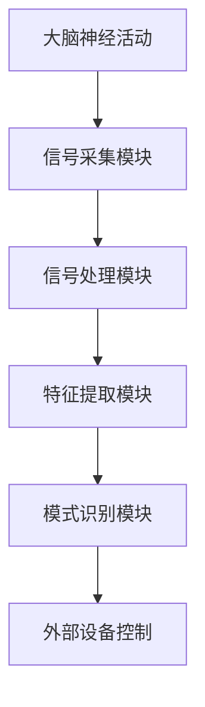

# 巴菲特 - 芒格的脑机接口工作效率提升投资：认知增强的产业化

> 关键词：巴菲特、芒格、脑机接口、工作效率提升、认知增强、产业化、投资

> 摘要：本文围绕巴菲特 - 芒格的脑机接口工作效率提升投资这一主题展开深入探讨。首先介绍脑机接口技术的背景，阐述其在提升工作效率和认知增强方面的潜力。接着详细剖析脑机接口的核心概念、算法原理、数学模型等。通过项目实战展示相关代码案例及解读，分析其实际应用场景。同时推荐了学习该领域的工具和资源，包括书籍、在线课程、开发工具等。最后总结脑机接口产业化的未来发展趋势与挑战，为相关领域的研究者、投资者及从业者提供全面的参考和思考。

## 1. 背景介绍 
### 1.1 目的和范围
本文章的目的在于全面探讨巴菲特 - 芒格所关注的脑机接口在工作效率提升及认知增强领域的投资价值与产业化前景。范围涵盖脑机接口技术的基本原理、算法实现、数学模型，以及在实际项目中的应用，还包括相关的工具资源推荐和未来发展趋势分析。旨在为对该领域感兴趣的读者提供深入的技术解读和产业洞察。

### 1.2 预期读者
预期读者包括对脑机接口技术、人工智能、投资领域感兴趣的专业人士，如技术开发者、投资者、科研人员等。同时，也适合对新兴科技发展趋势有探索欲望的普通读者，帮助他们了解这一前沿技术的发展动态和潜在影响。

### 1.3 文档结构概述
本文将按照以下结构进行阐述：首先介绍脑机接口技术的背景知识，包括目的、预期读者和术语表；接着深入讲解核心概念与联系，包括原理和架构；然后详细阐述核心算法原理和具体操作步骤，结合 Python 代码进行说明；再介绍数学模型和公式，并举例说明；通过项目实战展示代码案例和详细解释；分析实际应用场景；推荐相关的工具和资源；最后总结未来发展趋势与挑战，并提供常见问题解答和扩展阅读参考资料。

### 1.4 术语表
#### 1.4.1 核心术语定义
- **脑机接口（Brain - Computer Interface, BCI）**：是在人或动物脑（或者脑细胞的培养物）与外部设备间建立的直接连接通路。通过对神经系统电活动和特征信号的收集、识别及转化，脑机接口可将脑的指令转化为相应的动作或信息，实现大脑与外界的信息交互。
- **认知增强（Cognitive Enhancement）**：指通过各种手段（如药物、技术等）来改善、提高个体的认知功能，包括注意力、记忆力、思维能力等，从而提升个体的学习、工作和生活效率。
- **工作效率提升（Work Efficiency Improvement）**：通过优化工作流程、采用新技术等方式，减少完成工作任务所需的时间和精力，提高工作产出的质量和数量。

#### 1.4.2 相关概念解释
- **神经信号处理**：对从大脑中采集到的神经电信号进行滤波、特征提取、分类等操作，以获取有用的信息，为脑机接口系统的后续处理提供基础。
- **机器学习算法**：在脑机接口中，机器学习算法用于对神经信号进行分类和识别，根据不同的信号特征判断大脑的意图，如运动想象、认知状态等。

#### 1.4.3 缩略词列表
- **BCI**：Brain - Computer Interface（脑机接口）
- **EEG**：Electroencephalogram（脑电图）
- **EMG**：Electromyogram（肌电图）
- **ML**：Machine Learning（机器学习）

## 2. 核心概念与联系 

### 脑机接口的基本原理
脑机接口的基本原理是通过传感器采集大脑产生的神经电信号，这些信号包含了大脑的活动信息。然后对这些信号进行处理和分析，提取出有意义的特征，再利用模式识别算法将这些特征转化为具体的指令，最后将指令发送给外部设备，实现大脑与外界的交互。

### 脑机接口的架构
脑机接口系统通常由以下几个部分组成：
1. **信号采集模块**：使用电极等传感器采集大脑的神经电信号，常见的有脑电图（EEG）、脑磁图（MEG）等。
2. **信号处理模块**：对采集到的信号进行预处理，如滤波、去噪等，以提高信号的质量。
3. **特征提取模块**：从预处理后的信号中提取出能够反映大脑活动特征的参数。
4. **模式识别模块**：利用机器学习等算法对提取的特征进行分类和识别，判断大脑的意图。
5. **外部设备控制模块**：根据模式识别的结果，控制外部设备执行相应的动作。

### 脑机接口与认知增强的联系
脑机接口可以通过监测大脑的活动状态，实时了解个体的认知状态，如注意力、疲劳程度等。基于这些信息，可以采取相应的措施来增强认知功能。例如，当监测到个体注意力不集中时，可以通过反馈机制提醒个体，或者调整学习、工作的任务难度，以提高个体的注意力和学习效率。同时，脑机接口还可以通过训练个体的大脑，改善大脑的功能，从而实现认知增强。

### 文本示意图
```plaintext
            +----------------+
            | 大脑神经活动  |
            +----------------+
                    |
                    v
            +----------------+
            | 信号采集模块  |
            +----------------+
                    |
                    v
            +----------------+
            | 信号处理模块  |
            +----------------+
                    |
                    v
            +----------------+
            | 特征提取模块  |
            +----------------+
                    |
                    v
            +----------------+
            | 模式识别模块  |
            +----------------+
                    |
                    v
            +----------------+
            | 外部设备控制  |
            +----------------+
```

### Mermaid 流程图


## 3. 核心算法原理 & 具体操作步骤 

### 核心算法原理
在脑机接口中，常用的核心算法包括机器学习算法，如支持向量机（SVM）、神经网络等。这里以支持向量机为例，介绍其在脑机接口中的应用原理。

支持向量机是一种二分类模型，其基本思想是在特征空间中找到一个最优的超平面，使得不同类别的样本能够被最大程度地分开。在脑机接口中，支持向量机可以用于对神经信号进行分类，判断大脑的意图。

### 具体操作步骤
1. **数据采集**：使用 EEG 等设备采集大脑的神经电信号。
2. **数据预处理**：对采集到的信号进行滤波、去噪等处理，以提高信号的质量。
3. **特征提取**：从预处理后的信号中提取出能够反映大脑活动特征的参数，如时域特征、频域特征等。
4. **数据集划分**：将提取的特征数据集划分为训练集和测试集。
5. **模型训练**：使用训练集对支持向量机模型进行训练，调整模型的参数，使其能够准确地对神经信号进行分类。
6. **模型评估**：使用测试集对训练好的模型进行评估，计算模型的准确率、召回率等指标，评估模型的性能。
7. **应用部署**：将训练好的模型部署到实际的脑机接口系统中，实现大脑与外界的交互。

### Python 源代码实现
```python
import numpy as np
from sklearn.svm import SVC
from sklearn.model_selection import train_test_split
from sklearn.metrics import accuracy_score

# 模拟采集的神经信号特征数据
# 假设有 100 个样本，每个样本有 10 个特征
X = np.random.rand(100, 10)
# 模拟对应的标签，0 和 1 表示不同的大脑意图
y = np.random.randint(0, 2, 100)

# 数据集划分
X_train, X_test, y_train, y_test = train_test_split(X, y, test_size=0.2, random_state=42)

# 创建支持向量机模型
svm_model = SVC(kernel='linear')

# 模型训练
svm_model.fit(X_train, y_train)

# 模型预测
y_pred = svm_model.predict(X_test)

# 模型评估
accuracy = accuracy_score(y_test, y_pred)
print(f"模型准确率: {accuracy}")
```

### 代码解释
1. **数据模拟**：使用 `np.random.rand` 函数生成模拟的神经信号特征数据 `X`，使用 `np.random.randint` 函数生成对应的标签 `y`。
2. **数据集划分**：使用 `train_test_split` 函数将数据集划分为训练集和测试集，测试集占比为 20%。
3. **模型创建**：使用 `SVC` 函数创建支持向量机模型，指定核函数为线性核。
4. **模型训练**：使用 `fit` 方法对模型进行训练，传入训练集的特征数据和标签。
5. **模型预测**：使用 `predict` 方法对测试集的特征数据进行预测，得到预测结果 `y_pred`。
6. **模型评估**：使用 `accuracy_score` 函数计算模型的准确率，评估模型的性能。

## 4. 数学模型和公式 & 详细讲解 & 举例说明 

### 支持向量机的数学模型
支持向量机的目标是在特征空间中找到一个最优的超平面，使得不同类别的样本能够被最大程度地分开。对于一个二分类问题，假设训练数据集为 $\{(x_1, y_1), (x_2, y_2), \cdots, (x_n, y_n)\}$，其中 $x_i \in \mathbb{R}^d$ 是特征向量，$y_i \in \{-1, +1\}$ 是对应的标签。

超平面的方程可以表示为 $w^T x + b = 0$，其中 $w \in \mathbb{R}^d$ 是超平面的法向量，$b \in \mathbb{R}$ 是偏置项。支持向量机的优化目标是最小化以下目标函数：

$$\min_{w, b} \frac{1}{2} \|w\|^2 + C \sum_{i=1}^{n} \xi_i$$

subject to:

$$y_i (w^T x_i + b) \geq 1 - \xi_i, \quad \xi_i \geq 0, \quad i = 1, 2, \cdots, n$$

其中，$\xi_i$ 是松弛变量，用于处理线性不可分的情况，$C > 0$ 是惩罚参数，用于平衡模型的复杂度和分类误差。

### 详细讲解
1. **目标函数**：$\frac{1}{2} \|w\|^2$ 是正则化项，用于控制模型的复杂度，避免过拟合。$C \sum_{i=1}^{n} \xi_i$ 是惩罚项，用于惩罚分类错误的样本。
2. **约束条件**：$y_i (w^T x_i + b) \geq 1 - \xi_i$ 表示样本 $x_i$ 到超平面的距离大于等于 $1 - \xi_i$，确保样本能够被正确分类。$\xi_i \geq 0$ 表示松弛变量是非负的。

### 举例说明
假设我们有一个二维的数据集，包含两个类别的样本，如下所示：

```python
import numpy as np
import matplotlib.pyplot as plt

# 生成二维数据集
X = np.array([[1, 2], [2, 3], [3, 1], [4, 2], [1, 3], [2, 4], [3, 2], [4, 3]])
y = np.array([-1, -1, -1, -1, 1, 1, 1, 1])

# 可视化数据集
plt.scatter(X[y == -1][:, 0], X[y == -1][:, 1], c='b', label='Class -1')
plt.scatter(X[y == 1][:, 0], X[y == 1][:, 1], c='r', label='Class 1')
plt.xlabel('Feature 1')
plt.ylabel('Feature 2')
plt.legend()
plt.show()
```

我们可以使用支持向量机对这个数据集进行分类，代码如下：

```python
from sklearn.svm import SVC

# 创建支持向量机模型
svm_model = SVC(kernel='linear')

# 模型训练
svm_model.fit(X, y)

# 绘制决策边界
xx, yy = np.meshgrid(np.linspace(0, 5, 100), np.linspace(0, 5, 100))
Z = svm_model.predict(np.c_[xx.ravel(), yy.ravel()])
Z = Z.reshape(xx.shape)

plt.contourf(xx, yy, Z, alpha=0.3)
plt.scatter(X[y == -1][:, 0], X[y == -1][:, 1], c='b', label='Class -1')
plt.scatter(X[y == 1][:, 0], X[y == 1][:, 1], c='r', label='Class 1')
plt.xlabel('Feature 1')
plt.ylabel('Feature 2')
plt.legend()
plt.show()
```

通过这个例子，我们可以直观地看到支持向量机是如何在特征空间中找到一个最优的超平面，将不同类别的样本分开的。

## 5. 项目实战：代码实际案例和详细解释说明 

### 5.1  开发环境搭建
1. **安装 Python**：建议使用 Python 3.7 及以上版本，可以从 Python 官方网站（https://www.python.org/downloads/） 下载安装。
2. **安装必要的库**：使用 `pip` 命令安装以下库：
    - `numpy`：用于数值计算。
    - `scikit - learn`：用于机器学习算法的实现。
    - `matplotlib`：用于数据可视化。

```bash
pip install numpy scikit-learn matplotlib
```

### 5.2  源代码详细实现和代码解读
以下是一个基于 EEG 数据的脑机接口项目的代码实现，用于识别不同的运动想象任务。

```python
import numpy as np
from sklearn.svm import SVC
from sklearn.model_selection import train_test_split
from sklearn.metrics import accuracy_score
import matplotlib.pyplot as plt

# 模拟 EEG 数据
# 假设有 200 个样本，每个样本有 20 个特征
X = np.random.rand(200, 20)
# 模拟对应的标签，0 和 1 表示不同的运动想象任务
y = np.random.randint(0, 2, 200)

# 数据集划分
X_train, X_test, y_train, y_test = train_test_split(X, y, test_size=0.2, random_state=42)

# 创建支持向量机模型
svm_model = SVC(kernel='rbf', C=10, gamma=0.1)

# 模型训练
svm_model.fit(X_train, y_train)

# 模型预测
y_pred = svm_model.predict(X_test)

# 模型评估
accuracy = accuracy_score(y_test, y_pred)
print(f"模型准确率: {accuracy}")

# 可视化训练集和测试集的标签分布
plt.figure(figsize=(10, 5))
plt.subplot(1, 2, 1)
plt.hist(y_train, bins=2, edgecolor='k')
plt.title('Training Set Label Distribution')
plt.xlabel('Label')
plt.ylabel('Count')

plt.subplot(1, 2, 2)
plt.hist(y_test, bins=2, edgecolor='k')
plt.title('Test Set Label Distribution')
plt.xlabel('Label')
plt.ylabel('Count')

plt.show()
```

### 代码解读
1. **数据模拟**：使用 `np.random.rand` 函数生成模拟的 EEG 特征数据 `X`，使用 `np.random.randint` 函数生成对应的标签 `y`。
2. **数据集划分**：使用 `train_test_split` 函数将数据集划分为训练集和测试集，测试集占比为 20%。
3. **模型创建**：使用 `SVC` 函数创建支持向量机模型，指定核函数为径向基函数（RBF），惩罚参数 `C` 为 10，核系数 `gamma` 为 0.1。
4. **模型训练**：使用 `fit` 方法对模型进行训练，传入训练集的特征数据和标签。
5. **模型预测**：使用 `predict` 方法对测试集的特征数据进行预测，得到预测结果 `y_pred`。
6. **模型评估**：使用 `accuracy_score` 函数计算模型的准确率，评估模型的性能。
7. **数据可视化**：使用 `matplotlib` 库绘制训练集和测试集的标签分布直方图，直观地展示数据的分布情况。

### 5.3  代码解读与分析
- **数据模拟**：在实际应用中，EEG 数据需要通过专业的设备进行采集，并且需要进行预处理和特征提取。这里使用模拟数据只是为了演示代码的实现过程。
- **模型选择**：支持向量机是一种常用的分类算法，但是在实际应用中，可能需要根据具体的问题选择更合适的算法，如神经网络、决策树等。
- **参数调整**：支持向量机的性能受到惩罚参数 `C` 和核系数 `gamma` 等参数的影响，需要通过交叉验证等方法进行参数调整，以获得最优的性能。
- **数据可视化**：通过可视化训练集和测试集的标签分布，可以检查数据是否存在不平衡的问题，避免模型出现过拟合或欠拟合的情况。

## 6. 实际应用场景 

### 医疗康复领域
脑机接口技术在医疗康复领域具有广泛的应用前景。例如，对于瘫痪患者，可以通过脑机接口系统将大脑的运动意图转化为外部设备的控制信号，帮助患者实现肢体的运动，恢复运动功能。此外，脑机接口还可以用于神经疾病的诊断和治疗，通过监测大脑的活动状态，辅助医生进行疾病的诊断和治疗方案的制定。

### 教育领域
在教育领域，脑机接口可以用于监测学生的学习状态，实时了解学生的注意力、疲劳程度等认知状态。根据这些信息，教师可以调整教学方法和教学内容，提高教学效果。同时，脑机接口还可以用于开发智能教育系统，通过对学生大脑活动的分析，为学生提供个性化的学习方案。

### 智能家居领域
脑机接口技术可以应用于智能家居领域，实现用户通过大脑信号控制家居设备的功能。例如，用户可以通过大脑信号控制灯光的开关、调节空调的温度等，提高家居生活的便利性和舒适性。

### 娱乐游戏领域
在娱乐游戏领域，脑机接口可以为玩家带来更加沉浸式的游戏体验。例如，玩家可以通过大脑信号控制游戏角色的动作、行为等，实现更加自然、流畅的游戏交互。

## 7. 工具和资源推荐
### 7.1 学习资源推荐
#### 7.1.1 书籍推荐
- 《脑机接口：原理与应用》：全面介绍了脑机接口的基本原理、技术方法和应用领域，是学习脑机接口的经典教材。
- 《Python 机器学习》：详细介绍了 Python 语言在机器学习领域的应用，包括各种机器学习算法的实现和应用，对于学习脑机接口中的机器学习算法有很大的帮助。
- 《神经工程学》：涵盖了神经科学、工程学等多个领域的知识，介绍了神经工程的基本原理和技术方法，对于理解脑机接口的原理和技术有重要的参考价值。

#### 7.1.2 在线课程
- Coursera 上的 “Neural Engineering” 课程：由知名大学的教授授课，系统地介绍了神经工程的基本原理和技术方法，包括脑机接口技术。
- edX 上的 “Machine Learning” 课程：由斯坦福大学的教授授课，详细介绍了机器学习的基本算法和应用，对于学习脑机接口中的机器学习算法有很大的帮助。
- 中国大学 MOOC 上的 “脑机接口技术” 课程：由国内高校的专家授课，结合实际案例介绍了脑机接口的原理、技术和应用，适合初学者学习。

#### 7.1.3 技术博客和网站
- BCI Society（https://www.bcisociety.org/）：国际脑机接口协会的官方网站，提供了脑机接口领域的最新研究成果、会议信息等资源。
- NeurotechX（https://neurotechx.com/）：专注于神经技术领域的社区网站，分享了脑机接口、神经科学等方面的技术文章和项目经验。
- Medium 上的 “Neurotech” 专栏：有许多关于脑机接口和神经技术的优质文章，涵盖了技术原理、应用案例、行业趋势等方面的内容。

### 7.2 开发工具框架推荐
#### 7.2.1 IDE和编辑器
- PyCharm：一款功能强大的 Python 集成开发环境，提供了代码编辑、调试、版本控制等丰富的功能，适合开发脑机接口相关的 Python 代码。
- Jupyter Notebook：一种交互式的开发环境，支持 Python、R 等多种编程语言，适合进行数据分析、模型训练等工作，方便代码的展示和分享。

#### 7.2.2 调试和性能分析工具
- PDB：Python 自带的调试工具，可以帮助开发者在代码运行过程中进行调试，查找代码中的错误。
- cProfile：Python 标准库中的性能分析工具，可以分析代码的运行时间和函数调用情况，帮助开发者优化代码性能。

#### 7.2.3 相关框架和库
- MNE - Python：一个用于处理和分析 EEG、MEG 等神经电信号的 Python 库，提供了丰富的信号处理和分析功能。
- Scikit - learn：一个用于机器学习的 Python 库，提供了各种机器学习算法的实现，如支持向量机、神经网络等，方便开发者进行模型训练和评估。
- TensorFlow：一个开源的机器学习框架，提供了强大的深度学习功能，适合开发复杂的脑机接口模型。

### 7.3 相关论文著作推荐
#### 7.3.1 经典论文
- “Brain - computer interfaces for communication and control”：该论文是脑机接口领域的经典论文，介绍了脑机接口的基本概念、技术方法和应用领域，对脑机接口的发展起到了重要的推动作用。
- “A practical guide to support vector classification”：详细介绍了支持向量机的原理、算法和应用，对于理解脑机接口中支持向量机的应用有很大的帮助。

#### 7.3.2 最新研究成果
- 可以通过 IEEE Xplore、ACM Digital Library 等学术数据库搜索脑机接口领域的最新研究成果，了解该领域的前沿技术和发展趋势。

#### 7.3.3 应用案例分析
- 一些国际知名的学术会议，如 IEEE International Conference on Biomedical Robotics and Biomechatronics（BioRob）、Annual International Conference of the IEEE Engineering in Medicine and Biology Society（EMBC）等，会发表许多脑机接口应用案例的研究论文，可以从中了解脑机接口在不同领域的实际应用情况。

## 8. 总结：未来发展趋势与挑战

### 未来发展趋势
1. **技术融合**：脑机接口技术将与人工智能、物联网、虚拟现实等技术深度融合，创造出更加智能、高效、便捷的应用场景。例如，将脑机接口与虚拟现实技术结合，可以实现更加沉浸式的虚拟现实体验；将脑机接口与物联网技术结合，可以实现更加智能化的家居控制。
2. **小型化和便携化**：随着技术的不断进步，脑机接口设备将越来越小型化和便携化，方便用户随时随地使用。例如，未来可能会出现可穿戴式的脑机接口设备，用户可以像佩戴手表一样轻松地使用脑机接口技术。
3. **个性化和精准化**：脑机接口技术将更加注重个性化和精准化，根据用户的个体差异和需求，提供更加个性化的服务和解决方案。例如，在医疗康复领域，脑机接口系统可以根据患者的具体病情和康复需求，制定个性化的康复方案。
4. **产业化发展**：脑机接口技术的产业化发展将加速，越来越多的企业将进入该领域，推动脑机接口技术的商业化应用。例如，一些科技公司已经开始研发脑机接口相关的产品，如智能头盔、智能手套等。

### 挑战
1. **技术瓶颈**：目前脑机接口技术还存在一些技术瓶颈，如信号采集的精度和稳定性、信号处理的效率和准确性等。这些技术瓶颈限制了脑机接口技术的进一步发展和应用。
2. **伦理和法律问题**：脑机接口技术的发展也带来了一系列的伦理和法律问题，如大脑隐私保护、人类自主性的挑战等。如何在技术发展的同时，解决好这些伦理和法律问题，是脑机接口技术面临的重要挑战。
3. **社会接受度**：脑机接口技术作为一种新兴技术，公众对其了解和接受程度还比较低。如何提高公众对脑机接口技术的认知和接受度，是推广脑机接口技术应用的关键。

## 9. 附录：常见问题与解答

### 1. 脑机接口技术安全吗？
脑机接口技术在设计和开发过程中会充分考虑安全性问题。目前的脑机接口设备大多采用非侵入式的方式采集大脑信号，对人体没有伤害。但是，在使用脑机接口技术时，也需要注意数据的安全和隐私保护，避免个人信息泄露。

### 2. 脑机接口技术可以用于治疗哪些疾病？
脑机接口技术可以用于治疗多种神经疾病，如瘫痪、癫痫、帕金森病等。通过脑机接口系统，可以帮助患者恢复运动功能、控制疾病发作等。

### 3. 学习脑机接口技术需要具备哪些知识？
学习脑机接口技术需要具备一定的神经科学、信号处理、机器学习等方面的知识。同时，还需要掌握一门编程语言，如 Python，以便进行代码实现和实验验证。

### 4. 脑机接口技术的发展前景如何？
脑机接口技术具有广阔的发展前景，在医疗康复、教育、智能家居、娱乐游戏等领域都有很大的应用潜力。随着技术的不断进步和产业化的发展，脑机接口技术将为人类的生活和社会发展带来巨大的变革。

## 10. 扩展阅读 & 参考资料
- [1] Wolpaw, J. R., Birbaumer, N., McFarland, D. J., Pfurtscheller, G., & Vaughan, T. M. (2002). Brain - computer interfaces for communication and control. Clinical neurophysiology, 113(6), 767 - 791.
- [2] Hsu, C. W., Chang, C. C., & Lin, C. J. (2003). A practical guide to support vector classification.
- [3] 《脑机接口：原理与应用》，作者：[作者姓名]，出版社：[出版社名称]
- [4] 《Python 机器学习》，作者：[作者姓名]，出版社：[出版社名称]
- [5] 《神经工程学》，作者：[作者姓名]，出版社：[出版社名称]
- [6] BCI Society 官方网站：https://www.bcisociety.org/
- [7] NeurotechX 官方网站：https://neurotechx.com/
- [8] Medium 上的 “Neurotech” 专栏：https://medium.com/neurotech
- [9] IEEE Xplore 学术数据库：https://ieeexplore.ieee.org/
- [10] ACM Digital Library 学术数据库：https://dl.acm.org/ 