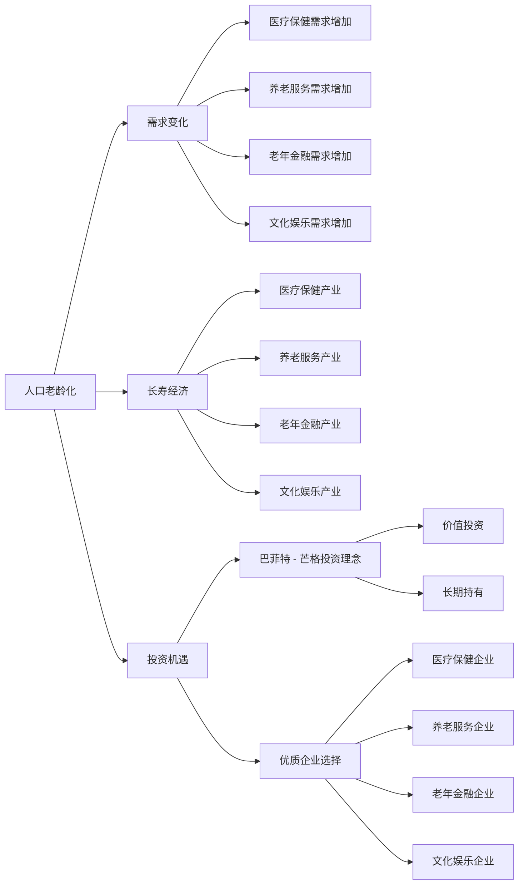

# 巴菲特 - 芒格的长寿经济投资：人口老龄化带来的机遇

> 关键词：巴菲特、芒格、长寿经济、人口老龄化、投资机遇

> 摘要：本文聚焦于巴菲特和芒格的投资理念在人口老龄化背景下的应用，深入探讨长寿经济所蕴含的投资机遇。通过对相关核心概念的解析、投资算法原理的阐述、数学模型的构建、项目实战案例的分析，全面展现了人口老龄化给投资领域带来的新方向。同时介绍了在这一领域可利用的工具和资源，对未来发展趋势与挑战进行总结，旨在为投资者和相关从业者提供有价值的参考。

## 1. 背景介绍 
### 1.1 目的和范围
本文章的目的在于揭示人口老龄化这一全球性趋势下所隐藏的投资机遇，特别关注巴菲特和芒格的投资智慧如何在长寿经济领域发挥作用。范围涵盖了长寿经济相关的各个产业，包括但不限于医疗保健、养老服务、老年金融等，通过多维度的分析为投资者提供全面的投资视角。

### 1.2 预期读者
预期读者包括对投资领域感兴趣的个人投资者、金融从业者、经济学者以及关注人口老龄化社会问题的相关人士。这些读者希望通过本文了解人口老龄化与投资之间的关联，获取有价值的投资信息和策略。

### 1.3 文档结构概述
本文首先介绍了相关背景知识，包括目的、预期读者和文档结构。接着阐述核心概念与联系，通过文本示意图和 Mermaid 流程图清晰展示长寿经济相关概念的关系。然后深入讲解核心算法原理和具体操作步骤，结合 Python 源代码进行说明。之后介绍数学模型和公式，并举例说明其应用。再通过项目实战案例，详细介绍开发环境搭建、源代码实现和代码解读。随后探讨实际应用场景，推荐相关工具和资源。最后总结未来发展趋势与挑战，提供常见问题解答和扩展阅读参考资料。

### 1.4 术语表
#### 1.4.1 核心术语定义
- **长寿经济**：指随着人口老龄化程度加深，围绕老年人的消费需求和生活保障而产生的一系列经济活动和产业体系。
- **人口老龄化**：指总人口中因年轻人口数量减少、年长人口数量增加而导致的老年人口比例相应增长的动态过程。
- **投资机遇**：指在特定的经济环境和市场条件下，投资者能够获取收益的机会和领域。

#### 1.4.2 相关概念解释
- **老年金融**：是专门为老年人设计的金融产品和服务，包括养老保险、老年理财等，旨在满足老年人的金融需求和保障其经济安全。
- **养老服务**：涵盖了老年人生活照料、医疗护理、精神慰藉等多个方面的服务内容，是长寿经济的重要组成部分。

#### 1.4.3 缩略词列表
- **GDP**：国内生产总值（Gross Domestic Product）
- **CPI**：消费者物价指数（Consumer Price Index）

## 2. 核心概念与联系 
### 核心概念原理
人口老龄化是一个全球性的社会现象，其主要原因包括生育率下降和人均寿命延长。随着老年人口的增加，他们的消费需求和生活方式与其他年龄段人群有所不同，从而催生了长寿经济。长寿经济的核心在于满足老年人在医疗、养老、文化娱乐等方面的需求，形成了一个庞大的产业体系。

巴菲特和芒格的投资理念强调价值投资，即寻找被低估的优质资产，并长期持有。在人口老龄化的背景下，他们会关注那些受益于老年人口增长的行业和企业，通过对这些企业的深入研究和分析，挖掘其中的投资价值。

### 架构的文本示意图
```plaintext
人口老龄化
|
|-- 需求变化
|   |-- 医疗保健需求增加
|   |-- 养老服务需求增加
|   |-- 老年金融需求增加
|   |-- 文化娱乐需求增加
|
|-- 长寿经济
|   |-- 医疗保健产业
|   |-- 养老服务产业
|   |-- 老年金融产业
|   |-- 文化娱乐产业
|
|-- 投资机遇
|   |-- 巴菲特 - 芒格投资理念
|   |   |-- 价值投资
|   |   |-- 长期持有
|   |-- 优质企业选择
|   |   |-- 医疗保健企业
|   |   |-- 养老服务企业
|   |   |-- 老年金融企业
|   |   |-- 文化娱乐企业
```

### Mermaid 流程图


## 3. 核心算法原理 & 具体操作步骤 
### 核心算法原理
在人口老龄化背景下的投资分析中，我们可以使用一些基本的财务分析算法来评估企业的价值。例如，我们可以使用市盈率（P/E）、市净率（P/B）等指标来判断企业的估值水平。

市盈率（P/E）的计算公式为：$P/E = \frac{股价}{每股收益}$

市净率（P/B）的计算公式为：$P/B = \frac{股价}{每股净资产}$

我们可以通过比较不同企业的市盈率和市净率，筛选出被低估的企业。同时，我们还可以结合企业的增长率、股息率等指标进行综合分析。

### 具体操作步骤
1. **数据收集**：收集相关企业的财务数据，包括股价、每股收益、每股净资产、增长率、股息率等。
2. **计算指标**：根据上述公式计算企业的市盈率、市净率等指标。
3. **筛选企业**：设定合理的指标范围，筛选出被低估的企业。
4. **综合分析**：结合企业的行业前景、竞争优势等因素，对筛选出的企业进行综合分析。
5. **投资决策**：根据综合分析的结果，做出投资决策。

### Python 源代码实现
```python
import pandas as pd

# 定义一个函数来计算市盈率和市净率
def calculate_ratios(data):
    data['P/E'] = data['股价'] / data['每股收益']
    data['P/B'] = data['股价'] / data['每股净资产']
    return data

# 示例数据
data = {
    '企业名称': ['企业 A', '企业 B', '企业 C'],
    '股价': [100, 150, 200],
    '每股收益': [10, 15, 20],
    '每股净资产': [50, 75, 100]
}

df = pd.DataFrame(data)

# 计算比率
df = calculate_ratios(df)

# 筛选被低估的企业（假设 P/E < 10 且 P/B < 2 为低估）
undervalued_stocks = df[(df['P/E'] < 10) & (df['P/B'] < 2)]

print(undervalued_stocks)
```

## 4. 数学模型和公式 & 详细讲解 & 举例说明 
### 数学模型和公式
在投资分析中，我们还可以使用一些更复杂的数学模型来评估企业的价值。例如，股利贴现模型（DDM）是一种常用的股票估值模型。

股利贴现模型的基本公式为：$V = \frac{D_1}{r - g}$

其中：
- $V$ 表示股票的内在价值
- $D_1$ 表示下一期预计支付的股利
- $r$ 表示投资者要求的必要收益率
- $g$ 表示股利的增长率

### 详细讲解
股利贴现模型的基本思想是，股票的价值等于其未来所有股利的现值之和。在上述公式中，我们假设股利以固定的增长率 $g$ 增长。如果 $g < r$，则该公式可以简化为上述形式。

### 举例说明
假设某股票下一期预计支付的股利 $D_1 = 2$ 元，投资者要求的必要收益率 $r = 0.1$，股利的增长率 $g = 0.05$。则该股票的内在价值为：

$$V = \frac{D_1}{r - g} = \frac{2}{0.1 - 0.05} = 40$$（元）

如果该股票的当前市场价格低于 40 元，则可以认为该股票被低估，具有投资价值。

## 5. 项目实战：代码实际案例和详细解释说明 
### 5.1  开发环境搭建
- **操作系统**：Windows、Linux 或 macOS 均可。
- **编程语言**：Python 3.x
- **开发工具**：推荐使用 PyCharm 或 Jupyter Notebook。
- **依赖库**：需要安装 pandas、numpy 等库。可以使用以下命令进行安装：
```sh
pip install pandas numpy
```

### 5.2  源代码详细实现和代码解读
```python
import pandas as pd
import numpy as np

# 定义一个函数来计算股利贴现模型的股票价值
def ddm_value(D1, r, g):
    if r <= g:
        raise ValueError("必要收益率必须大于股利增长率")
    return D1 / (r - g)

# 示例数据
D1 = 2  # 下一期预计支付的股利
r = 0.1  # 投资者要求的必要收益率
g = 0.05  # 股利的增长率

# 计算股票价值
stock_value = ddm_value(D1, r, g)

# 模拟多个股票的情况
num_stocks = 10
stocks_data = {
    '股票代码': [f'Stock{i}' for i in range(num_stocks)],
    'D1': np.random.uniform(1, 3, num_stocks),
    'r': np.random.uniform(0.08, 0.12, num_stocks),
    'g': np.random.uniform(0.03, 0.07, num_stocks)
}

df = pd.DataFrame(stocks_data)

# 计算每个股票的价值
df['股票价值'] = df.apply(lambda row: ddm_value(row['D1'], row['r'], row['g']), axis=1)

print(df)
```

### 5.3  代码解读与分析
1. **函数定义**：`ddm_value` 函数用于计算股利贴现模型的股票价值。在函数内部，首先检查必要收益率是否大于股利增长率，如果不满足条件，则抛出异常。
2. **示例数据**：定义了单个股票的示例数据，并调用 `ddm_value` 函数计算其价值。
3. **模拟多个股票**：使用 `numpy` 生成多个股票的随机数据，并将其存储在 `pandas` 的 `DataFrame` 中。
4. **计算每个股票的价值**：使用 `apply` 方法对 `DataFrame` 中的每一行应用 `ddm_value` 函数，计算每个股票的价值。

## 6. 实际应用场景 
### 医疗保健产业
随着人口老龄化的加剧，老年人对医疗保健的需求不断增加。这包括药品、医疗器械、医疗服务等多个领域。例如，一些生产治疗慢性疾病药物的制药企业，由于老年人口中慢性疾病患者的增多，其市场需求也相应增加。同时，养老机构中的医疗护理服务也成为了一个重要的市场。

### 养老服务产业
养老服务产业涵盖了养老院、老年公寓、居家养老服务等多个方面。老年人对舒适、安全、便捷的养老环境和服务有较高的需求。一些专业的养老服务企业通过提供优质的养老服务，获得了良好的市场口碑和经济效益。

### 老年金融产业
老年金融产业包括养老保险、老年理财等。老年人需要通过合理的金融规划来保障自己的晚年生活。保险公司推出的各种养老保险产品，以及金融机构提供的老年专属理财产品，都满足了老年人的金融需求。

### 文化娱乐产业
老年人的文化娱乐需求也在不断增长。这包括老年旅游、老年教育、老年文化活动等。一些旅游企业推出了适合老年人的旅游产品，老年大学也为老年人提供了学习和交流的平台。

## 7. 工具和资源推荐
### 7.1 学习资源推荐
#### 7.1.1 书籍推荐
- 《聪明的投资者》：作者本杰明·格雷厄姆，是价值投资领域的经典著作，介绍了投资的基本原则和方法。
- 《巴菲特致股东的信》：收录了巴菲特多年来致股东的信，通过这些信件可以深入了解巴菲特的投资理念和决策过程。
- 《穷查理宝典》：介绍了查理·芒格的智慧和投资哲学，对投资者有很大的启发。

#### 7.1.2 在线课程
- Coursera 上的“投资学原理”课程，由知名教授授课，系统地介绍了投资学的基本理论和方法。
- 网易云课堂上的“价值投资实战”课程，结合实际案例讲解价值投资的应用。

#### 7.1.3 技术博客和网站
- 雪球网：是一个投资者交流社区，有很多关于投资的经验分享和分析文章。
- 东方财富网：提供丰富的金融资讯和数据，对投资者了解市场动态有很大帮助。

### 7.2 开发工具框架推荐
#### 7.2.1 IDE和编辑器
- PyCharm：是一款功能强大的 Python 集成开发环境，适合专业开发者使用。
- Jupyter Notebook：以交互式的方式编写和运行代码，方便进行数据分析和实验。

#### 7.2.2 调试和性能分析工具
- pdb：Python 自带的调试工具，可以帮助开发者定位和解决代码中的问题。
- cProfile：用于分析 Python 代码的性能，找出性能瓶颈。

#### 7.2.3 相关框架和库
- pandas：用于数据处理和分析，提供了高效的数据结构和操作方法。
- numpy：是 Python 中用于科学计算的基础库，提供了高效的数组操作和数学函数。

### 7.3 相关论文著作推荐
#### 7.3.1 经典论文
- Modigliani, F., & Miller, M. H. (1958). The Cost of Capital, Corporation Finance and the Theory of Investment. American Economic Review, 48(3), 261 - 297. 该论文提出了著名的 MM 定理，对企业融资和资本结构理论有重要影响。
- Sharpe, W. F. (1964). Capital Asset Prices: A Theory of Market Equilibrium Under Conditions of Risk. The Journal of Finance, 19(3), 425 - 442. 提出了资本资产定价模型（CAPM），是现代金融理论的重要基石。

#### 7.3.2 最新研究成果
- 关于人口老龄化与经济增长关系的最新研究论文，探讨了人口老龄化对宏观经济的影响以及相应的政策建议。
- 关于长寿经济产业发展趋势的研究报告，分析了长寿经济各产业的发展现状和未来趋势。

#### 7.3.3 应用案例分析
- 一些知名投资机构在长寿经济领域的投资案例分析，包括投资策略、投资标的选择和投资收益情况。
- 养老服务企业的成功运营案例，介绍了其商业模式、服务特色和市场竞争优势。

## 8. 总结：未来发展趋势与挑战
### 未来发展趋势
- **产业融合加速**：长寿经济各产业之间的融合将越来越明显，例如医疗保健与养老服务的结合，老年金融与文化娱乐的结合等。这种融合将创造出更多的新业态和新模式。
- **科技应用广泛**：随着科技的不断进步，人工智能、大数据、物联网等技术将在长寿经济领域得到广泛应用。例如，智能养老设备、远程医疗服务等将提高养老服务的质量和效率。
- **市场需求持续增长**：随着人口老龄化的加剧，老年人口数量不断增加，长寿经济的市场需求将持续增长。这将为投资者带来更多的投资机会。

### 挑战
- **政策不确定性**：长寿经济的发展需要政府的政策支持，但政策的制定和实施存在一定的不确定性。政策的变化可能会对相关产业和企业的发展产生影响。
- **市场竞争加剧**：随着长寿经济市场的不断扩大，越来越多的企业将进入该领域，市场竞争将日益激烈。企业需要不断提升自身的核心竞争力，才能在市场中立足。
- **社会观念转变缓慢**：一些老年人和社会大众对长寿经济的接受程度还不够高，社会观念的转变需要一定的时间。这可能会影响长寿经济产业的发展速度。

## 9. 附录：常见问题与解答
### 1. 人口老龄化对经济有哪些负面影响？
人口老龄化可能导致劳动力供给减少，劳动年龄人口负担加重，经济增长动力不足等问题。同时，社会养老保障压力增大，可能会影响财政的可持续性。

### 2. 如何判断一个企业是否具有投资价值？
可以从多个方面进行判断，包括企业的财务状况、行业前景、竞争优势、管理团队等。可以使用一些财务指标，如市盈率、市净率、股息率等进行初步筛选，然后结合其他因素进行综合分析。

### 3. 长寿经济领域的投资风险有哪些？
长寿经济领域的投资风险包括政策风险、市场竞争风险、技术风险等。政策的变化可能会影响企业的经营环境，市场竞争加剧可能导致企业利润下降，技术更新换代可能使企业的产品和服务过时。

### 4. 如何应对人口老龄化带来的挑战？
政府可以通过制定相关政策，如完善养老保障体系、鼓励生育、推动产业升级等，来应对人口老龄化带来的挑战。企业可以积极开发适合老年人的产品和服务，满足市场需求。个人也可以通过合理规划自己的养老生活，提高自身的养老保障水平。

## 10. 扩展阅读 & 参考资料
- 《人口老龄化与经济发展》，作者：[作者姓名]，出版社：[出版社名称]
- 《长寿经济：未来经济发展的新动力》，作者：[作者姓名]，出版社：[出版社名称]
- 世界银行关于人口老龄化的相关报告
- 国际货币基金组织关于经济增长与人口结构的研究报告
- 相关上市公司的年报和财务报告