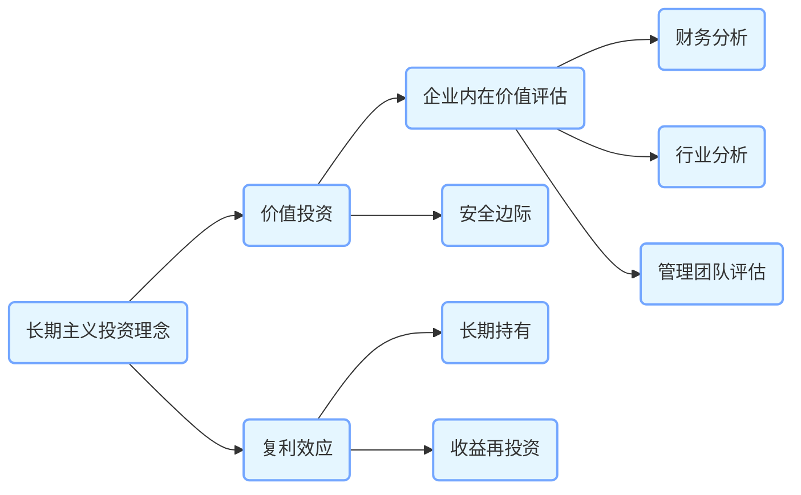

# 巴菲特 - 芒格的长期主义：为什么耐心是最佳投资策略

> 关键词：巴菲特、芒格、长期主义、耐心、投资策略、价值投资、复利效应

> 摘要：本文深入探讨了巴菲特和芒格所秉持的长期主义投资理念，详细阐述了耐心为何是最佳投资策略。通过对长期主义核心概念的剖析、相关算法原理的讲解、数学模型的分析、项目实战案例的解读、实际应用场景的介绍以及相关工具资源的推荐，全面展示了长期主义投资策略的科学性和有效性。同时，对未来投资领域的发展趋势与挑战进行了总结，并对常见问题进行了解答，为投资者提供了全面而深入的投资指导。

## 1. 背景介绍 
### 1.1 目的和范围
本文的目的在于深入剖析巴菲特 - 芒格的长期主义投资理念，探究耐心作为最佳投资策略的内在逻辑和实际应用效果。范围涵盖了长期主义投资理念的核心概念、算法原理、数学模型、项目实战、实际应用场景等多个方面，旨在为投资者提供全面、系统的投资知识和决策参考。

### 1.2 预期读者
本文预期读者包括对投资领域感兴趣的初学者、有一定投资经验的投资者、金融专业学生以及关注投资理念和策略的相关人士。无论您是希望了解基本投资知识，还是寻求优化投资策略，都能从本文中获得有价值的信息。

### 1.3 文档结构概述
本文共分为十个部分。第一部分为背景介绍，阐述文章的目的、预期读者和文档结构；第二部分介绍核心概念与联系，解释长期主义投资理念的核心概念并展示其架构；第三部分讲解核心算法原理和具体操作步骤，通过 Python 代码进行详细阐述；第四部分分析数学模型和公式，结合实例进行说明；第五部分进行项目实战，包括开发环境搭建、源代码实现和代码解读；第六部分介绍实际应用场景；第七部分推荐相关工具和资源；第八部分总结未来发展趋势与挑战；第九部分为附录，解答常见问题；第十部分提供扩展阅读和参考资料。

### 1.4 术语表
#### 1.4.1 核心术语定义
- **长期主义**：一种投资理念，强调投资者应着眼于长期投资回报，忽略短期市场波动，通过长期持有优质资产实现财富增值。
- **价值投资**：基于对企业内在价值的评估，寻找被低估的股票进行投资，等待市场对其价值的重新发现。
- **复利效应**：指在每一个计息期后，将所生利息加入本金再计利息，使得资产随着时间的推移呈现指数级增长。

#### 1.4.2 相关概念解释
- **安全边际**：投资者在购买股票时，以低于其内在价值的价格买入，以降低投资风险。
- **护城河**：企业所拥有的可持续竞争优势，使其在市场中能够抵御竞争对手的侵蚀，保持长期稳定的盈利。

#### 1.4.3 缩略词列表
- **PEG**：市盈率相对盈利增长比率（Price/Earnings to Growth Ratio），用于衡量股票的估值是否合理。

## 2. 核心概念与联系 
### 核心概念原理
巴菲特 - 芒格的长期主义投资理念基于对企业内在价值的深刻理解和对市场规律的把握。其核心原理在于相信优质企业具有长期稳定的盈利能力和成长潜力，通过长期持有这些企业的股票，投资者可以分享企业成长带来的红利。

价值投资是长期主义的重要基石。投资者通过对企业财务状况、行业地位、管理团队等多方面的分析，评估企业的内在价值。当股票价格低于其内在价值时，投资者认为存在投资机会，此时买入股票并长期持有，等待市场对企业价值的重新认识，从而实现投资回报。

复利效应是长期主义投资策略的强大动力。在长期投资过程中，每年的投资收益会不断滚入本金，随着时间的推移，资产会呈现指数级增长。例如，每年获得 10% 的收益率，经过 30 年，初始投资将增长 17.45 倍。

### 架构的文本示意图
```plaintext
长期主义投资理念
|-- 价值投资
|   |-- 企业内在价值评估
|   |   |-- 财务分析
|   |   |-- 行业分析
|   |   |-- 管理团队评估
|   |-- 安全边际
|-- 复利效应
|   |-- 长期持有
|   |-- 收益再投资
```

### Mermaid 流程图


## 3. 核心算法原理 & 具体操作步骤 
### 核心算法原理
在长期主义投资策略中，一个重要的算法原理是对企业内在价值的评估。这里我们介绍一种简单的基于现金流折现模型（DCF）的评估方法。

现金流折现模型的基本思想是将企业未来的现金流折现到当前时刻，以此来评估企业的内在价值。其计算公式为：

$$V = \sum_{t=1}^{n} \frac{CF_t}{(1 + r)^t} + \frac{TV}{(1 + r)^n}$$

其中，$V$ 表示企业的内在价值，$CF_t$ 表示第 $t$ 年的现金流，$r$ 表示折现率，$TV$ 表示终值，$n$ 表示预测期数。

### 具体操作步骤
1. **预测未来现金流**：通过对企业历史财务数据的分析和对行业发展趋势的判断，预测企业未来若干年的现金流。
2. **确定折现率**：折现率反映了投资者对投资回报的要求，通常可以使用加权平均资本成本（WACC）作为折现率。
3. **计算终值**：在预测期结束后，假设企业进入稳定增长阶段，使用终值公式计算企业的终值。
4. **折现现金流和终值**：将预测期内的现金流和终值按照折现率折现到当前时刻，得到企业的内在价值。

### Python 源代码实现
```python
import numpy as np

def dcf_evaluation(cash_flows, discount_rate, growth_rate, n_years):
    """
    现金流折现模型评估企业内在价值

    参数:
    cash_flows (list): 预测期内每年的现金流
    discount_rate (float): 折现率
    growth_rate (float): 终值阶段的稳定增长率
    n_years (int): 预测期数

    返回:
    float: 企业的内在价值
    """
    # 折现预测期内的现金流
    present_value_cash_flows = np.sum([cash_flows[i] / (1 + discount_rate) ** (i + 1) for i in range(n_years)])

    # 计算终值
    last_cash_flow = cash_flows[-1]
    terminal_value = last_cash_flow * (1 + growth_rate) / (discount_rate - growth_rate)
    present_value_terminal_value = terminal_value / (1 + discount_rate) ** n_years

    # 计算企业内在价值
    intrinsic_value = present_value_cash_flows + present_value_terminal_value

    return intrinsic_value

# 示例数据
cash_flows = [100, 120, 140, 160, 180]  # 预测期内每年的现金流
discount_rate = 0.1  # 折现率
growth_rate = 0.03  # 终值阶段的稳定增长率
n_years = 5  # 预测期数

# 计算企业内在价值
intrinsic_value = dcf_evaluation(cash_flows, discount_rate, growth_rate, n_years)
print(f"企业的内在价值为: {intrinsic_value}")
```

### 代码解释
1. **函数定义**：`dcf_evaluation` 函数接受预测期内每年的现金流、折现率、终值阶段的稳定增长率和预测期数作为参数，返回企业的内在价值。
2. **折现预测期内的现金流**：使用列表推导式将预测期内每年的现金流按照折现率折现到当前时刻，并求和。
3. **计算终值**：根据终值公式计算企业的终值，并将其折现到当前时刻。
4. **计算企业内在价值**：将预测期内的现金流现值和终值现值相加，得到企业的内在价值。

## 4. 数学模型和公式 & 详细讲解 & 举例说明 
### 现金流折现模型（DCF）
现金流折现模型是一种广泛应用的企业估值方法，其基本公式为：

$$V = \sum_{t=1}^{n} \frac{CF_t}{(1 + r)^t} + \frac{TV}{(1 + r)^n}$$

其中，$V$ 表示企业的内在价值，$CF_t$ 表示第 $t$ 年的现金流，$r$ 表示折现率，$TV$ 表示终值，$n$ 表示预测期数。

### 详细讲解
1. **预测期内现金流的折现**：$\sum_{t=1}^{n} \frac{CF_t}{(1 + r)^t}$ 表示将预测期内每年的现金流按照折现率 $r$ 折现到当前时刻，并求和。折现的目的是考虑资金的时间价值，因为未来的现金流在当前时刻的价值会低于其名义价值。
2. **终值的计算**：终值 $TV$ 表示企业在预测期结束后进入稳定增长阶段的价值。通常使用 Gordon 增长模型计算终值：

$$TV = \frac{CF_{n+1}}{r - g}$$

其中，$CF_{n+1}$ 表示预测期结束后下一年的现金流，$g$ 表示稳定增长率。

3. **终值的折现**：$\frac{TV}{(1 + r)^n}$ 表示将终值按照折现率 $r$ 折现到当前时刻。

### 举例说明
假设一家企业未来 5 年的现金流分别为 100 万元、120 万元、140 万元、160 万元和 180 万元，折现率为 10%，预测期结束后企业进入稳定增长阶段，稳定增长率为 3%。

1. **计算预测期内现金流的现值**：
$$PV_{CF} = \frac{100}{(1 + 0.1)^1} + \frac{120}{(1 + 0.1)^2} + \frac{140}{(1 + 0.1)^3} + \frac{160}{(1 + 0.1)^4} + \frac{180}{(1 + 0.1)^5} \approx 496.31$$（万元）

2. **计算终值**：
预测期结束后下一年的现金流 $CF_{6} = 180 \times (1 + 0.03) = 185.4$（万元）
$$TV = \frac{185.4}{0.1 - 0.03} \approx 2648.57$$（万元）

3. **计算终值的现值**：
$$PV_{TV} = \frac{2648.57}{(1 + 0.1)^5} \approx 1635.28$$（万元）

4. **计算企业的内在价值**：
$$V = PV_{CF} + PV_{TV} \approx 496.31 + 1635.28 = 2131.59$$（万元）

因此，该企业的内在价值约为 2131.59 万元。

## 5. 项目实战：代码实际案例和详细解释说明 
### 5.1  开发环境搭建
1. **安装 Python**：从 Python 官方网站（https://www.python.org/downloads/）下载并安装 Python 3.x 版本。
2. **安装必要的库**：在命令行中使用以下命令安装 `numpy` 库：
```sh
pip install numpy
```

### 5.2  源代码详细实现和代码解读
```python
import numpy as np

def dcf_evaluation(cash_flows, discount_rate, growth_rate, n_years):
    """
    现金流折现模型评估企业内在价值

    参数:
    cash_flows (list): 预测期内每年的现金流
    discount_rate (float): 折现率
    growth_rate (float): 终值阶段的稳定增长率
    n_years (int): 预测期数

    返回:
    float: 企业的内在价值
    """
    # 折现预测期内的现金流
    present_value_cash_flows = np.sum([cash_flows[i] / (1 + discount_rate) ** (i + 1) for i in range(n_years)])

    # 计算终值
    last_cash_flow = cash_flows[-1]
    terminal_value = last_cash_flow * (1 + growth_rate) / (discount_rate - growth_rate)
    present_value_terminal_value = terminal_value / (1 + discount_rate) ** n_years

    # 计算企业内在价值
    intrinsic_value = present_value_cash_flows + present_value_terminal_value

    return intrinsic_value

# 示例数据
cash_flows = [100, 120, 140, 160, 180]  # 预测期内每年的现金流
discount_rate = 0.1  # 折现率
growth_rate = 0.03  # 终值阶段的稳定增长率
n_years = 5  # 预测期数

# 计算企业内在价值
intrinsic_value = dcf_evaluation(cash_flows, discount_rate, growth_rate, n_years)
print(f"企业的内在价值为: {intrinsic_value}")
```

### 代码解读与分析
1. **导入库**：`import numpy as np` 导入 `numpy` 库，用于进行数值计算。
2. **定义函数**：`dcf_evaluation` 函数接受预测期内每年的现金流、折现率、终值阶段的稳定增长率和预测期数作为参数，返回企业的内在价值。
3. **折现预测期内的现金流**：使用列表推导式将预测期内每年的现金流按照折现率折现到当前时刻，并使用 `np.sum` 函数求和。
4. **计算终值**：根据终值公式计算企业的终值，并将其折现到当前时刻。
5. **计算企业内在价值**：将预测期内的现金流现值和终值现值相加，得到企业的内在价值。
6. **示例数据和计算**：定义示例数据，调用 `dcf_evaluation` 函数计算企业的内在价值，并打印结果。

## 6. 实际应用场景 
### 股票投资
在股票投资中，长期主义投资策略可以帮助投资者筛选出具有长期投资价值的股票。投资者通过对企业内在价值的评估，寻找被低估的股票并长期持有。例如，巴菲特长期持有可口可乐公司的股票，通过分享企业的成长和分红，获得了丰厚的回报。

### 基金投资
对于基金投资者来说，长期持有优质基金也是一种有效的投资策略。优质基金通常由专业的基金经理管理，他们具有较强的选股能力和风险管理能力。投资者可以通过长期持有这些基金，分享基金的长期收益。

### 房地产投资
在房地产投资中，长期主义同样适用。投资者可以选择具有良好地理位置和发展潜力的房产进行长期持有。随着时间的推移，房产的价值可能会不断上升，同时还可以获得租金收益。

### 企业并购
在企业并购中，长期主义投资理念可以帮助企业做出更明智的决策。企业在进行并购时，不仅要考虑短期的财务效益，还要考虑被并购企业的长期发展潜力和协同效应。通过长期的整合和发展，实现企业价值的提升。

## 7. 工具和资源推荐
### 7.1 学习资源推荐
#### 7.1.1 书籍推荐
- 《聪明的投资者》（The Intelligent Investor）：本杰明·格雷厄姆（Benjamin Graham）著，被誉为投资领域的圣经，介绍了价值投资的基本原理和方法。
- 《巴菲特致股东的信》（Letters to Shareholders）：沃伦·巴菲特（Warren Buffett）著，通过巴菲特致股东的信，深入了解他的投资理念和决策过程。
- 《穷查理宝典》（Poor Charlie's Almanack）：查理·芒格（Charlie Munger）著，收录了芒格的演讲和文章，展现了他的多元思维模型和投资智慧。

#### 7.1.2 在线课程
- Coursera 平台上的“投资学原理”（Principles of Investing）课程，由知名教授授课，系统介绍投资学的基本原理和方法。
- edX 平台上的“价值投资分析”（Value Investing Analysis）课程，深入讲解价值投资的理论和实践。

#### 7.1.3 技术博客和网站
- 雪球网（https://xueqiu.com/）：国内知名的投资社区，提供股票、基金等投资产品的分析和讨论。
- Seeking Alpha（https://seekingalpha.com/）：国外知名的投资研究网站，提供专业的投资分析和研究报告。

### 7.2 开发工具框架推荐
#### 7.2.1 IDE和编辑器
- PyCharm：一款功能强大的 Python 集成开发环境，提供代码编辑、调试、版本控制等功能。
- Visual Studio Code：一款轻量级的代码编辑器，支持多种编程语言，通过安装插件可以实现 Python 开发。

#### 7.2.2 调试和性能分析工具
- PDB：Python 自带的调试工具，用于调试 Python 代码。
- cProfile：Python 标准库中的性能分析工具，用于分析 Python 代码的性能瓶颈。

#### 7.2.3 相关框架和库
- Pandas：用于数据处理和分析的 Python 库，提供高效的数据结构和数据操作方法。
- Matplotlib：用于数据可视化的 Python 库，提供丰富的绘图功能。

### 7.3 相关论文著作推荐
#### 7.3.1 经典论文
- 《证券分析》（Security Analysis）：本杰明·格雷厄姆和戴维·多德（David Dodd）著，奠定了价值投资的理论基础。
- 《有效市场假说》（Efficient Market Hypothesis）：尤金·法玛（Eugene F. Fama）著，探讨了市场效率和投资策略的关系。

#### 7.3.2 最新研究成果
- 《行为金融学》（Behavioral Finance）领域的研究成果，探讨了投资者的心理和行为对投资决策的影响。
- 《量化投资》（Quantitative Investment）领域的研究成果，介绍了基于数学模型和算法的投资策略。

#### 7.3.3 应用案例分析
- 关于巴菲特和芒格投资案例的分析报告，深入研究他们的投资决策过程和成功经验。
- 关于长期主义投资策略在不同市场环境下应用效果的案例分析。

## 8. 总结：未来发展趋势与挑战
### 未来发展趋势
1. **数字化投资**：随着科技的发展，数字化投资将成为未来的发展趋势。投资者可以通过互联网平台进行投资，获取更多的投资信息和工具。
2. **社会责任投资**：投资者越来越关注企业的社会责任和可持续发展，社会责任投资将成为未来投资的重要方向。
3. **智能化投资**：人工智能和机器学习技术将在投资领域得到广泛应用，智能化投资策略将提高投资决策的效率和准确性。

### 挑战
1. **市场波动**：市场波动是投资过程中不可避免的挑战，投资者需要具备较强的心理承受能力和风险管理能力。
2. **信息过载**：随着信息传播的快速发展，投资者面临着信息过载的问题，需要学会筛选和分析有价值的信息。
3. **技术变革**：科技的快速发展带来了技术变革，投资者需要不断学习和更新知识，以适应新的投资环境。

## 9. 附录：常见问题与解答
### 1. 长期投资是否意味着一直持有股票，不进行买卖操作？
长期投资并不意味着一直持有股票，不进行买卖操作。投资者可以根据企业的基本面变化、市场估值等因素进行适当的调整。例如，如果企业的基本面发生恶化，或者股票估值过高，投资者可以考虑卖出股票。

### 2. 如何确定企业的内在价值？
确定企业的内在价值是一个复杂的过程，需要综合考虑多个因素。常见的方法包括现金流折现模型、市盈率法、市净率法等。投资者还需要对企业的财务状况、行业地位、管理团队等进行深入分析，以评估企业的长期发展潜力。

### 3. 长期投资是否适合所有投资者？
长期投资并不适合所有投资者。长期投资需要投资者具备较强的耐心和心理承受能力，能够承受市场的短期波动。对于一些短期资金需求较大或者风险承受能力较低的投资者来说，可能不适合采用长期投资策略。

### 4. 如何选择优质的基金进行长期投资？
选择优质的基金进行长期投资需要考虑多个因素。投资者可以关注基金的历史业绩、基金经理的投资经验和能力、基金的投资策略和风格等。此外，还可以参考基金评级机构的评级和其他投资者的评价。

## 10. 扩展阅读 & 参考资料
### 扩展阅读
- 《投资最重要的事》（The Most Important Thing Illuminated）：霍华德·马克斯（Howard Marks）著，介绍了投资中的重要原则和方法。
- 《漫步华尔街》（A Random Walk Down Wall Street）：伯顿·马尔基尔（Burton G. Malkiel）著，探讨了市场效率和投资策略的关系。

### 参考资料
- 沃伦·巴菲特和查理·芒格的官方网站和公开演讲。
- 金融学术期刊和研究报告，如《金融研究》《投资研究》等。
- 相关投资书籍和文献。