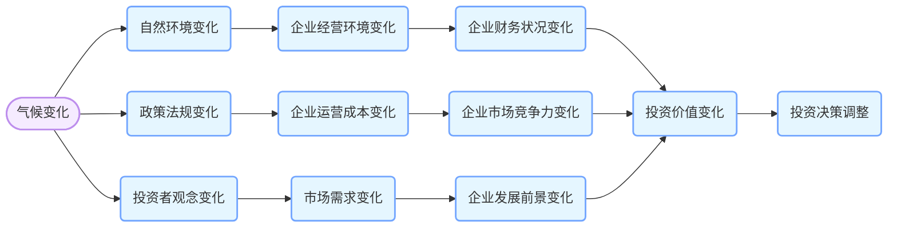

# 巴菲特 - 芒格看气候变化：对投资决策的影响

> 关键词：巴菲特、芒格、气候变化、投资决策、可持续发展、风险评估、价值投资

> 摘要：本文深入探讨了巴菲特和芒格对于气候变化的观点及其对投资决策产生的影响。通过对相关背景的介绍，阐述了气候变化在当今投资领域的重要性。详细分析了气候变化与投资决策的核心概念及联系，介绍了相关的核心算法原理与操作步骤，并从数学模型和公式的角度进行了深入解读。结合实际项目案例，展现了气候变化因素在投资决策中的具体应用。同时列举了实际应用场景、推荐了相关的工具和资源。最后对未来发展趋势与挑战进行总结，并对常见问题进行解答，为投资者在考虑气候变化因素时提供全面且深入的参考。

## 1. 背景介绍 
### 1.1 目的和范围
随着全球气候变化问题日益严峻，其对各个领域的影响也愈发显著，投资领域更是如此。本文旨在探讨巴菲特和芒格这两位投资界的传奇人物对气候变化的看法，以及这种看法如何影响他们的投资决策。研究范围将涵盖他们公开的言论、投资案例，并结合当前气候变化的科学研究和投资理论，分析气候变化在投资决策中的重要性和具体影响机制。

### 1.2 预期读者
本文预期读者包括广大投资者，无论是个人投资者还是机构投资者，都可以从中获取关于气候变化与投资决策关系的有价值信息。同时，对于金融领域的从业者、研究人员以及关注可持续发展和气候变化问题的人士也具有一定的参考意义。

### 1.3 文档结构概述
本文首先介绍相关背景信息，包括目的、预期读者和文档结构等。接着阐述气候变化与投资决策的核心概念及联系，通过文本示意图和 Mermaid 流程图进行清晰展示。然后详细讲解核心算法原理和具体操作步骤，结合 Python 源代码进行说明。之后从数学模型和公式的角度深入分析，并举例说明。再通过项目实战案例展示实际应用，包括开发环境搭建、源代码实现和代码解读。随后列举实际应用场景，推荐相关的工具和资源。最后总结未来发展趋势与挑战，解答常见问题，并提供扩展阅读和参考资料。

### 1.4 术语表
#### 1.4.1 核心术语定义
- **气候变化**：指气候平均状态随时间的变化，通常表现为温度、降水、风速等气象要素的长期变化。
- **投资决策**：投资者在进行投资活动时，根据自身的投资目标、风险承受能力等因素，对投资对象、投资时机、投资金额等做出的选择和决定。
- **可持续发展**：既满足当代人的需求，又不损害后代人满足其需求的能力的发展模式。

#### 1.4.2 相关概念解释
- **气候风险**：由于气候变化导致的各种风险，如极端天气事件增加、海平面上升、生态系统破坏等，可能对企业的生产经营、财务状况等产生不利影响。
- **低碳经济**：以低能耗、低污染、低排放为基础的经济模式，是应对气候变化的重要举措。

#### 1.4.3 缩略词列表
- **ESG**：环境（Environmental）、社会（Social）和治理（Governance）的缩写，是一种关注企业可持续发展和社会责任的投资理念。

## 2. 核心概念与联系 

### 核心概念原理
气候变化对投资决策的影响主要基于以下几个原理。首先，气候变化会直接影响企业的经营环境。例如，极端天气事件可能导致企业的生产设施受损，供应链中断，从而影响企业的生产和销售。其次，随着全球对气候变化问题的关注度不断提高，政府可能会出台更加严格的环境政策和法规，这将对企业的运营成本和市场竞争力产生影响。例如，对高碳排放企业征收碳税，可能会增加其生产成本，降低其利润。最后，投资者的观念也在发生变化，越来越多的投资者开始关注企业的可持续发展能力和社会责任，将气候变化因素纳入投资决策的考量范围。

### 架构的文本示意图
气候变化与投资决策的关系可以用以下文本示意图表示：

气候变化 -> 自然环境变化 -> 企业经营环境变化 -> 企业财务状况变化 -> 投资价值变化 -> 投资决策调整

气候变化 -> 政策法规变化 -> 企业运营成本变化 -> 企业市场竞争力变化 -> 投资价值变化 -> 投资决策调整

气候变化 -> 投资者观念变化 -> 市场需求变化 -> 企业发展前景变化 -> 投资价值变化 -> 投资决策调整

### Mermaid 流程图


## 3. 核心算法原理 & 具体操作步骤 

### 核心算法原理
在考虑气候变化因素的投资决策中，可以采用多因素评估模型。该模型综合考虑企业的财务指标、环境指标、社会指标和治理指标（ESG 指标）等多个因素，以评估企业的投资价值。具体来说，可以通过以下步骤计算企业的综合得分：

1. 确定各个指标的权重。权重的确定可以根据投资者的偏好和市场情况进行调整。
2. 收集企业的各项指标数据。财务指标可以从企业的财务报表中获取，环境指标可以通过企业的环境报告、第三方评估机构的报告等获取，社会指标和治理指标也可以通过相应的渠道获取。
3. 对各项指标进行标准化处理，以消除不同指标之间的量纲差异。
4. 计算企业的综合得分，即各项指标得分乘以其权重后的总和。

### 具体操作步骤及 Python 源代码
以下是一个简单的 Python 代码示例，演示如何实现上述多因素评估模型：

```python
import pandas as pd

# 定义指标权重
weights = {
    '财务指标': 0.4,
    '环境指标': 0.3,
    '社会指标': 0.15,
    '治理指标': 0.15
}

# 定义企业数据
data = {
    '企业名称': ['企业 A', '企业 B', '企业 C'],
    '财务指标': [80, 70, 90],
    '环境指标': [75, 85, 60],
    '社会指标': [85, 70, 90],
    '治理指标': [80, 75, 85]
}

# 创建 DataFrame
df = pd.DataFrame(data)

# 标准化处理
for column in df.columns[1:]:
    df[column] = (df[column] - df[column].min()) / (df[column].max() - df[column].min())

# 计算综合得分
df['综合得分'] = df['财务指标'] * weights['财务指标'] + \
                 df['环境指标'] * weights['环境指标'] + \
                 df['社会指标'] * weights['社会指标'] + \
                 df['治理指标'] * weights['治理指标']

# 排序并输出结果
df = df.sort_values(by='综合得分', ascending=False)
print(df)
```

### 代码解释
1. 首先，定义了各个指标的权重，存储在 `weights` 字典中。
2. 然后，定义了企业的数据，包括企业名称和各项指标得分，存储在 `data` 字典中。
3. 使用 `pandas` 库创建了一个 DataFrame 对象 `df`，用于存储企业数据。
4. 对各项指标进行标准化处理，通过将每个指标值减去该指标的最小值，再除以该指标的最大值与最小值之差，将指标值缩放到 0 到 1 之间。
5. 计算企业的综合得分，将各项指标得分乘以其权重后相加。
6. 最后，按照综合得分对企业进行排序，并输出结果。

## 4. 数学模型和公式 & 详细讲解 & 举例说明 

### 数学模型和公式
设企业的综合得分 $S$ 由 $n$ 个指标 $x_1, x_2, \cdots, x_n$ 组成，每个指标的权重为 $w_1, w_2, \cdots, w_n$，则企业的综合得分计算公式为：

$$S = \sum_{i=1}^{n} w_i x_i$$

其中，$\sum_{i=1}^{n} w_i = 1$，$0 \leq w_i \leq 1$。

### 详细讲解
这个公式的含义是，企业的综合得分是各个指标得分的加权平均值。权重 $w_i$ 表示每个指标在综合评估中的重要程度，权重越大，该指标对综合得分的影响越大。通过标准化处理，将各个指标的取值范围统一到 0 到 1 之间，消除了不同指标之间的量纲差异，使得各个指标可以在同一尺度下进行比较。

### 举例说明
以步骤 3 中的代码示例为例，假设企业 A 的财务指标得分为 80，环境指标得分为 75，社会指标得分为 85，治理指标得分为 80。经过标准化处理后，财务指标得分变为 0.5，环境指标得分变为 0.375，社会指标得分变为 0.75，治理指标得分变为 0.5。根据上述公式，企业 A 的综合得分计算如下：

$$S_A = 0.4 \times 0.5 + 0.3 \times 0.375 + 0.15 \times 0.75 + 0.15 \times 0.5$$
$$S_A = 0.2 + 0.1125 + 0.1125 + 0.075$$
$$S_A = 0.5$$

同理，可以计算出企业 B 和企业 C 的综合得分，然后进行比较，综合得分越高的企业，其投资价值相对越高。

## 5. 项目实战：代码实际案例和详细解释说明 

### 5.1  开发环境搭建
在进行本项目实战之前，需要搭建相应的开发环境。具体步骤如下：

1. **安装 Python**：可以从 Python 官方网站（https://www.python.org/downloads/） 下载并安装最新版本的 Python。
2. **安装必要的库**：本项目需要使用 `pandas` 库，可使用以下命令进行安装：
```sh
pip install pandas
```

### 5.2  源代码详细实现和代码解读
以下是一个完整的项目实战代码示例，结合实际的企业数据和气候变化相关指标，对企业的投资价值进行评估：

```python
import pandas as pd

# 定义指标权重
weights = {
    '财务指标': 0.4,
    '环境指标': {
        '碳排放强度': 0.2,
        '能源效率': 0.1,
        '可再生能源使用比例': 0.1
    },
    '社会指标': 0.15,
    '治理指标': 0.15
}

# 定义企业数据
data = {
    '企业名称': ['企业 A', '企业 B', '企业 C'],
    '财务指标': [80, 70, 90],
    '碳排放强度': [100, 120, 80],
    '能源效率': [70, 60, 80],
    '可再生能源使用比例': [20, 15, 25],
    '社会指标': [85, 70, 90],
    '治理指标': [80, 75, 85]
}

# 创建 DataFrame
df = pd.DataFrame(data)

# 标准化处理
for column in df.columns[1:]:
    if column in weights['环境指标']:
        if column == '碳排放强度':
            df[column] = (df[column].max() - df[column]) / (df[column].max() - df[column].min())
        else:
            df[column] = (df[column] - df[column].min()) / (df[column].max() - df[column].min())
    else:
        df[column] = (df[column] - df[column].min()) / (df[column].max() - df[column].min())

# 计算环境指标得分
df['环境指标得分'] = df['碳排放强度'] * weights['环境指标']['碳排放强度'] + \
                      df['能源效率'] * weights['环境指标']['能源效率'] + \
                      df['可再生能源使用比例'] * weights['环境指标']['可再生能源使用比例']

# 计算综合得分
df['综合得分'] = df['财务指标'] * weights['财务指标'] + \
                 df['环境指标得分'] * sum(weights['环境指标'].values()) + \
                 df['社会指标'] * weights['社会指标'] + \
                 df['治理指标'] * weights['治理指标']

# 排序并输出结果
df = df.sort_values(by='综合得分', ascending=False)
print(df)
```

### 5.3  代码解读与分析
1. **指标权重定义**：在 `weights` 字典中，不仅定义了财务指标、社会指标和治理指标的权重，还将环境指标进一步细分为碳排放强度、能源效率和可再生能源使用比例，并分别定义了它们的权重。
2. **企业数据定义**：在 `data` 字典中，除了包含财务指标、社会指标和治理指标外，还增加了环境指标的相关数据。
3. **标准化处理**：对于不同的指标，根据其性质进行不同的标准化处理。对于碳排放强度，由于其值越低越好，因此采用反向标准化处理；对于其他指标，采用正向标准化处理。
4. **环境指标得分计算**：根据环境指标的权重，计算企业的环境指标得分。
5. **综合得分计算**：将财务指标、环境指标得分、社会指标和治理指标得分乘以各自的权重后相加，得到企业的综合得分。
6. **排序并输出结果**：按照综合得分对企业进行排序，并输出结果，综合得分越高的企业，其投资价值相对越高。

## 6. 实际应用场景 
### 股票投资
在股票投资中，投资者可以将气候变化因素纳入对上市公司的评估中。例如，关注上市公司的碳排放情况、能源效率、可再生能源使用比例等环境指标，以及公司在应对气候变化方面的战略和措施。对于那些积极采取措施应对气候变化、具有较低碳排放强度和较高能源效率的公司，其投资价值可能更高。同时，气候变化相关的政策法规变化也可能对某些行业和公司的股价产生影响，投资者可以根据这些变化调整投资组合。

### 债券投资
在债券投资中，气候变化因素也可能影响债券的信用风险。例如，对于那些高碳排放、依赖传统能源的企业发行的债券，由于其面临的气候风险较高，可能存在更高的违约风险。投资者可以通过评估债券发行企业的环境绩效和气候风险，来判断债券的信用质量，从而做出更明智的投资决策。

### 基金投资
基金管理人可以将气候变化因素纳入基金的投资策略中。例如，发行专门的可持续发展基金或绿色基金，投资于那些在环境、社会和治理方面表现良好的企业。投资者可以选择投资这些基金，以实现资产的增值和社会责任的履行。

### 项目投资
在进行项目投资时，投资者需要考虑项目的环境影响和气候风险。例如，对于大型基础设施项目，如能源项目、交通项目等，需要评估项目的碳排放情况、对生态环境的影响以及应对气候变化的能力。对于那些符合低碳经济发展方向、具有较好环境效益的项目，更有可能获得投资者的青睐。

## 7. 工具和资源推荐
### 7.1 学习资源推荐
#### 7.1.1 书籍推荐
- 《气候变化经济学》：本书系统地介绍了气候变化经济学的基本理论和方法，包括气候变化的经济影响、应对气候变化的政策措施等内容，对于理解气候变化与经济发展的关系具有重要的参考价值。
- 《可持续投资：ESG 投资策略与实践》：本书详细介绍了可持续投资的概念、方法和实践案例，包括 ESG 投资的评估标准、投资策略和风险管理等内容，对于投资者将气候变化因素纳入投资决策具有指导意义。
- 《巴菲特致股东的信：投资者和公司高管教程》：虽然这本书主要是关于巴菲特的投资理念和方法，但其中也涉及到了一些关于企业长期价值和可持续发展的观点，对于理解巴菲特和芒格的投资思想具有重要的参考价值。

#### 7.1.2 在线课程
- Coursera 平台上的 “气候变化与可持续发展” 课程：该课程由知名高校的教授授课，系统地介绍了气候变化的科学原理、影响和应对措施，以及可持续发展的概念和实践。
- edX 平台上的 “ESG 投资：原理与实践” 课程：该课程详细介绍了 ESG 投资的基本原理、评估方法和投资策略，通过实际案例分析，帮助学员掌握 ESG 投资的实践技能。

#### 7.1.3 技术博客和网站
- 碳交易网（https://www.tanjiaoyi.com/）：提供碳市场的相关信息，包括碳排放权交易、碳减排项目等内容，对于了解气候变化相关的政策和市场动态具有重要的参考价值。
- 可持续投资网（https://www.sustainableinvest.com/）：专注于可持续投资领域，提供 ESG 投资的研究报告、案例分析和行业动态等内容，对于投资者了解可持续投资的最新趋势和实践具有重要的参考价值。

### 7.2 开发工具框架推荐
#### 7.2.1 IDE和编辑器
- PyCharm：一款功能强大的 Python 集成开发环境，提供代码编辑、调试、版本控制等功能，适合进行 Python 代码的开发和调试。
- Visual Studio Code：一款轻量级的代码编辑器，支持多种编程语言，具有丰富的插件扩展功能，可用于快速开发和调试 Python 代码。

#### 7.2.2 调试和性能分析工具
- PDB：Python 自带的调试工具，可以帮助开发者在代码中设置断点、单步执行代码、查看变量值等，方便进行代码调试。
- cProfile：Python 自带的性能分析工具，可以帮助开发者分析代码的运行时间和性能瓶颈，优化代码性能。

#### 7.2.3 相关框架和库
- Pandas：一个强大的数据分析库，提供了数据结构和数据分析工具，可用于数据的清洗、处理和分析。
- Numpy：一个用于科学计算的库，提供了高效的数组操作和数学函数，可用于数据的数值计算和处理。

### 7.3 相关论文著作推荐
#### 7.3.1 经典论文
- “The Stern Review on the Economics of Climate Change”：该论文由英国经济学家尼古拉斯·斯特恩（Nicholas Stern）领导的团队撰写，全面评估了气候变化的经济影响，并提出了应对气候变化的政策建议，具有重要的理论和实践价值。
- “The Impact of ESG Factors on Corporate Financial Performance: A Meta - Analysis”：该论文通过对大量实证研究的元分析，探讨了 ESG 因素对企业财务绩效的影响，为投资者将 ESG 因素纳入投资决策提供了理论支持。

#### 7.3.2 最新研究成果
- 关注国际顶级学术期刊，如《Nature》《Science》《The Journal of Finance》等，这些期刊经常发表关于气候变化、可持续投资等领域的最新研究成果。

#### 7.3.3 应用案例分析
- 世界银行、国际货币基金组织等国际组织发布的关于气候变化和可持续发展的报告和案例分析，这些报告和案例分析具有较高的权威性和实用性，对于投资者了解气候变化在实际投资中的应用具有重要的参考价值。

## 8. 总结：未来发展趋势与挑战
### 未来发展趋势
1. **气候变化因素将成为投资决策的重要考量因素**：随着全球对气候变化问题的关注度不断提高，投资者将越来越重视企业的环境绩效和气候风险，气候变化因素将成为投资决策中不可或缺的一部分。
2. **可持续投资将迎来更大的发展机遇**：可持续投资理念将得到更广泛的认可和应用，越来越多的投资者将选择投资于那些在环境、社会和治理方面表现良好的企业，可持续投资市场规模将不断扩大。
3. **技术创新将为投资决策提供更有力的支持**：随着大数据、人工智能等技术的不断发展，将为投资者提供更准确、更全面的气候变化相关数据和分析工具，帮助投资者更好地评估企业的气候风险和投资价值。

### 挑战
1. **数据质量和可靠性问题**：目前，关于企业环境绩效和气候风险的数据存在质量参差不齐、可靠性不高等问题，这给投资者准确评估企业的投资价值带来了困难。
2. **缺乏统一的评估标准**：不同的投资者和评估机构对于气候变化因素的评估标准存在差异，缺乏统一的评估标准和方法，这使得投资者在比较不同企业的环境绩效和气候风险时存在困难。
3. **短期利益与长期可持续发展的平衡问题**：在投资决策中，投资者往往面临短期利益与长期可持续发展的平衡问题。一些企业虽然在短期内具有较高的盈利能力，但可能存在较高的气候风险，而一些具有较好环境绩效和可持续发展潜力的企业，可能在短期内的盈利能力较弱。投资者需要在两者之间找到平衡。

## 9. 附录：常见问题与解答
### 问题 1：气候变化对投资决策的影响有多大？
气候变化对投资决策的影响程度取决于多个因素，如投资领域、投资期限、企业所处行业等。在一些高碳排放行业，如能源、化工等，气候变化的影响可能更为显著。随着全球对气候变化问题的关注度不断提高，气候变化因素对投资决策的影响将越来越大。

### 问题 2：如何获取企业的气候变化相关数据？
可以通过以下途径获取企业的气候变化相关数据：企业的年度报告、环境报告、可持续发展报告等；第三方评估机构的报告，如 MSCI、S&P Global 等；政府部门发布的相关数据和信息。

### 问题 3：如何评估企业的气候风险？
可以从以下几个方面评估企业的气候风险：企业的碳排放情况、能源消耗情况、对气候变化相关政策法规的适应性、应对气候变化的战略和措施等。可以采用多因素评估模型，综合考虑多个因素，对企业的气候风险进行评估。

### 问题 4：可持续投资是否意味着放弃投资回报？
不是的。可持续投资并不意味着放弃投资回报，相反，越来越多的研究表明，在环境、社会和治理方面表现良好的企业，往往具有更好的长期发展前景和投资价值。可持续投资可以在实现资产增值的同时，实现社会责任的履行。

## 10. 扩展阅读 & 参考资料
### 扩展阅读
- 《低碳经济：理论与实践》：深入探讨了低碳经济的理论和实践，对于理解气候变化与经济发展的关系具有重要的参考价值。
- 《投资新范式：ESG 投资的崛起》：介绍了 ESG 投资的发展历程、现状和未来趋势，对于投资者了解可持续投资的新范式具有重要的参考价值。

### 参考资料
1. 巴菲特历年致股东的信
2. 芒格的公开演讲和著作
3. 联合国气候变化框架公约（UNFCCC）相关文件
4. 国际能源署（IEA）发布的报告
5. 世界银行关于可持续发展和气候变化的报告