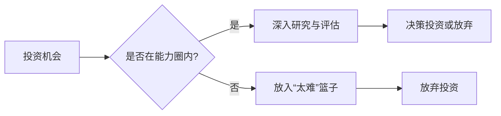

# 巴菲特的“太难”篮子：知道自己不知道什么

> 关键词：巴菲特、“太难”篮子、投资理念、能力圈、认知边界、不确定性、决策智慧

> 摘要：本文围绕巴菲特的“太难”篮子展开深入探讨，剖析其背后蕴含的深刻投资理念与人生智慧。通过阐述知道自己不知道什么这一关键认知的重要性，结合投资领域及其他实际场景，详细分析其在决策过程中的应用。同时，借助数学模型、实际案例以及相关工具资源，全面解读这一理念的核心与实践意义，并对其未来发展趋势和面临的挑战进行展望，旨在为投资者及追求智慧决策的人们提供有益的参考与启示。

## 1. 背景介绍 
### 1.1 目的和范围
本文旨在深入研究巴菲特的“太难”篮子这一独特概念，挖掘其在投资决策以及更广泛的生活决策中的价值。范围不仅涵盖了巴菲特的投资生涯中的具体案例和相关理念，还将拓展到其他领域，分析如何借鉴这一理念提升决策的科学性和有效性。通过系统的分析和阐述，帮助读者理解知道自己不知道什么对于个人成长和成功的重要性。

### 1.2 预期读者
本文预期读者包括广大投资者，无论是专业投资者还是普通股民，都能从巴菲特的投资智慧中获取有益的启示；也适合对商业决策、人生规划等领域感兴趣的人士，他们可以借鉴“太难”篮子的理念优化自己的决策过程；此外，对于研究投资哲学和商业智慧的学者和学生，本文也能提供有价值的参考和思考方向。

### 1.3 文档结构概述
本文首先介绍背景信息，包括目的、预期读者和文档结构概述等。接着阐述核心概念与联系，分析“太难”篮子的原理和架构。然后详细讲解核心算法原理和具体操作步骤，通过Python代码进行示例。随后介绍相关的数学模型和公式，并举例说明。再通过项目实战，展示代码实际案例并进行详细解释。之后探讨实际应用场景，推荐相关的工具和资源。最后总结未来发展趋势与挑战，提供常见问题与解答以及扩展阅读和参考资料。

### 1.4 术语表
#### 1.4.1 核心术语定义
- **“太难”篮子**：巴菲特在投资决策中使用的一种概念，用于将那些超出自己能力圈、难以理解和评估的投资机会归为一类，选择放弃，以避免因不确定性带来的风险。
- **能力圈**：指个人或组织在某个领域所具备的专业知识、技能和经验的范围，在这个范围内，个体能够做出相对准确的判断和决策。

#### 1.4.2 相关概念解释
- **不确定性**：指在决策过程中，由于信息不充分、未来情况难以预测等因素导致的结果的不可知性。在投资领域，不确定性可能来自市场波动、行业变化、企业经营风险等多个方面。
- **决策智慧**：是指在面对各种选择和不确定性时，能够运用合理的方法和原则，做出符合自身利益和目标的决策的能力。

#### 1.4.3 缩略词列表
无

## 2. 核心概念与联系 
### 2.1 “太难”篮子的原理
巴菲特的“太难”篮子体现了一种基于自我认知的决策策略。其核心原理在于承认自己的认知边界，认识到在复杂多变的世界中，不可能对所有事物都有深入的了解和准确的判断。当面对投资机会时，如果该机会涉及的领域、业务模式、技术等超出了自己的能力圈，无法清晰地评估其风险和价值，就将其放入“太难”篮子，选择放弃。这种做法看似保守，但实际上是一种明智的风险管理策略，能够避免因盲目投资而遭受重大损失。

### 2.2 与能力圈的联系
“太难”篮子与能力圈是紧密相关的概念。能力圈界定了个人或组织在知识和技能方面的优势范围，而“太难”篮子则是能力圈的一种外在体现。当某个投资机会不在能力圈范围内时，就会被视为“太难”的事情，放入“太难”篮子。通过明确“太难”篮子的范围，可以进一步清晰地界定自己的能力圈，从而更加专注于能力圈内的投资机会，提高投资成功的概率。

### 2.3 文本示意图
“太难”篮子与能力圈的关系可以用以下文本示意图表示：

个人/组织的认知范围
|-- 能力圈（可理解、可评估的领域）
|   |-- 熟悉的行业
|   |-- 了解的业务模式
|   |-- 掌握的技术
|-- “太难”篮子（超出能力圈、难以理解和评估的领域）
|   |-- 陌生的行业
|   |-- 复杂的业务模式
|   |-- 新兴的技术

### 2.4 Mermaid 流程图


## 3. 核心算法原理 & 具体操作步骤 
### 3.1 核心算法原理
在实际决策中，可以将“太难”篮子的判断过程看作一个分类算法。其核心思想是根据投资机会的特征与个人能力圈的匹配程度进行分类。如果投资机会的特征与能力圈内的知识、技能和经验不匹配，或者匹配程度较低，就将其判定为“太难”的投资机会，放入“太难”篮子。

以下是一个简单的Python代码示例，用于模拟“太难”篮子的判断过程：

```python
# 定义能力圈，用一组关键词表示
ability_circle = ["消费行业", "金融行业", "传统制造业"]

# 定义投资机会类
class InvestmentOpportunity:
    def __init__(self, name, industry):
        self.name = name
        self.industry = industry

    def is_too_hard(self):
        # 判断投资机会的行业是否在能力圈内
        if self.industry not in ability_circle:
            return True
        else:
            return False

# 创建投资机会实例
opportunity1 = InvestmentOpportunity("项目A", "消费行业")
opportunity2 = InvestmentOpportunity("项目B", "新能源行业")

# 判断投资机会是否属于“太难”篮子
print(f"{opportunity1.name} 是否属于“太难”篮子: {opportunity1.is_too_hard()}")
print(f"{opportunity2.name} 是否属于“太难”篮子: {opportunity2.is_too_hard()}")
```

### 3.2 具体操作步骤
1. **明确能力圈**：首先，投资者需要对自己的知识、技能和经验进行全面的梳理和评估，确定自己熟悉的行业、业务模式和技术领域，从而明确自己的能力圈范围。
2. **分析投资机会**：对于每个潜在的投资机会，详细了解其行业背景、业务模式、技术特点等信息，提取关键特征。
3. **匹配能力圈**：将投资机会的关键特征与能力圈进行对比，判断其是否在能力圈内。如果大部分特征都能与能力圈匹配，则认为该投资机会在能力圈内；反之，则认为超出能力圈。
4. **放入“太难”篮子**：对于超出能力圈的投资机会，果断将其放入“太难”篮子，选择放弃。对于在能力圈内的投资机会，则进行深入研究和评估，再做出投资决策。

## 4. 数学模型和公式 & 详细讲解 & 举例说明 
### 4.1 数学模型
可以用集合论的方法来描述“太难”篮子与能力圈的关系。设 $U$ 为所有投资机会的集合，$A$ 为个人的能力圈，即个人能够理解和评估的投资机会集合。则“太难”篮子 $T$ 可以表示为：

$$T = U - A$$

其中，$U - A$ 表示在集合 $U$ 中但不在集合 $A$ 中的元素构成的集合。

### 4.2 详细讲解
这个数学模型直观地反映了“太难”篮子的本质，即所有超出个人能力圈的投资机会的集合。通过明确能力圈 $A$，就可以确定“太难”篮子 $T$ 的范围。在实际应用中，投资者需要不断地更新和完善自己的能力圈 $A$，以适应市场的变化和自身知识的增长。

### 4.3 举例说明
假设市场上有 100 个投资机会，即 $|U| = 100$（$|U|$ 表示集合 $U$ 的元素个数）。经过评估，投资者确定自己的能力圈 $A$ 包含 30 个投资机会，即 $|A| = 30$。则根据上述公式，“太难”篮子 $T$ 包含的投资机会个数为：

$$|T| = |U| - |A| = 100 - 30 = 70$$

这意味着有 70 个投资机会超出了投资者的能力圈，应该放入“太难”篮子，予以放弃。

## 5. 项目实战：代码实际案例和详细解释说明 
### 5.1  开发环境搭建
- **编程语言**：Python 3.x
- **开发工具**：可以选择 PyCharm、Jupyter Notebook 等集成开发环境（IDE）。
- **安装依赖**：本示例代码不需要额外安装依赖库，使用 Python 内置的功能即可。

### 5.2  源代码详细实现和代码解读
以下是一个更完整的 Python 代码示例，模拟了一个简单的投资决策系统，包含能力圈的更新和投资机会的判断：

```python
# 定义能力圈类
class AbilityCircle:
    def __init__(self):
        self.skills = set()

    def add_skill(self, skill):
        # 向能力圈中添加技能
        self.skills.add(skill)

    def remove_skill(self, skill):
        # 从能力圈中移除技能
        if skill in self.skills:
            self.skills.remove(skill)

    def contains_skill(self, skill):
        # 判断能力圈中是否包含某个技能
        return skill in self.skills

# 定义投资机会类
class InvestmentOpportunity:
    def __init__(self, name, required_skills):
        self.name = name
        self.required_skills = set(required_skills)

    def is_too_hard(self, ability_circle):
        # 判断投资机会是否超出能力圈
        for skill in self.required_skills:
            if not ability_circle.contains_skill(skill):
                return True
        return False

# 创建能力圈实例
ability_circle = AbilityCircle()
# 向能力圈中添加技能
ability_circle.add_skill("财务分析")
ability_circle.add_skill("市场调研")

# 创建投资机会实例
opportunity1 = InvestmentOpportunity("项目A", ["财务分析", "市场调研"])
opportunity2 = InvestmentOpportunity("项目B", ["财务分析", "技术研发"])

# 判断投资机会是否属于“太难”篮子
print(f"{opportunity1.name} 是否属于“太难”篮子: {opportunity1.is_too_hard(ability_circle)}")
print(f"{opportunity2.name} 是否属于“太难”篮子: {opportunity2.is_too_hard(ability_circle)}")
```

### 5.3  代码解读与分析
- **AbilityCircle 类**：用于表示个人的能力圈，包含添加技能、移除技能和判断是否包含某个技能的方法。
- **InvestmentOpportunity 类**：用于表示投资机会，包含投资机会的名称和所需的技能集合。`is_too_hard` 方法用于判断投资机会是否超出能力圈，如果投资机会所需的技能中有任何一个不在能力圈中，则认为该投资机会超出能力圈，属于“太难”篮子。
- **主程序**：创建能力圈实例和投资机会实例，调用 `is_too_hard` 方法判断投资机会是否属于“太难”篮子，并输出结果。

通过这个代码示例，可以看到如何在实际项目中应用“太难”篮子的理念，根据个人的能力圈对投资机会进行筛选和决策。

## 6. 实际应用场景 
### 6.1 投资领域
在投资领域，“太难”篮子的理念具有重要的应用价值。巴菲特通过坚守自己的能力圈，将那些超出自己理解范围的投资机会放入“太难”篮子，避免了许多潜在的风险。例如，在科技股热潮中，巴菲特没有跟风投资那些他不熟悉的高科技企业，而是专注于自己熟悉的消费、金融等行业，从而在市场波动中保持了稳健的投资业绩。

### 6.2 商业决策
在企业的商业决策中，也可以借鉴“太难”篮子的理念。企业管理者在面对各种业务拓展机会时，需要评估自身的资源、能力和市场环境。如果某个业务领域超出了企业的核心能力范围，且难以把握其风险和收益，就应该将其放入“太难”篮子，避免盲目扩张导致的失败。

### 6.3 个人职业规划
在个人职业规划中，“太难”篮子的理念同样适用。当面临职业选择时，个人需要考虑自己的兴趣、技能和优势。如果某个职业方向需要的技能和知识超出了自己的能力范围，且短期内难以提升，就应该谨慎选择，避免进入一个自己难以适应的领域。

## 7. 工具和资源推荐
### 7.1 学习资源推荐
#### 7.1.1 书籍推荐
- 《巴菲特致股东的信：股份公司教程》：这本书收录了巴菲特多年来致股东的信，详细阐述了他的投资理念和方法，是学习巴菲特投资智慧的经典之作。
- 《穷查理宝典：查理·芒格的智慧箴言录》：查理·芒格是巴菲特的长期合作伙伴，这本书汇集了芒格的思想和智慧，其中包含了许多关于决策、认知和投资的宝贵经验。
- 《聪明的投资者》：作者本杰明·格雷厄姆是巴菲特的导师，这本书被誉为投资界的圣经，介绍了价值投资的基本原理和方法，对理解巴菲特的投资理念有重要的帮助。

#### 7.1.2 在线课程
- Coursera 上的“投资学原理”：该课程由知名大学的教授授课，系统地介绍了投资学的基本原理和方法，包括资产定价、投资组合管理等内容。
- edX 上的“金融市场”：这门课程从宏观和微观的角度分析金融市场的运行机制，帮助学习者了解投资决策的背景和环境。

#### 7.1.3 技术博客和网站
- 雪球网：一个专注于投资领域的社区，汇聚了众多投资者和投资专家，提供了丰富的投资资讯、研究报告和交流平台。
- 价值投资网：专门介绍价值投资理念和方法的网站，有大量关于巴菲特等投资大师的研究和分析文章。

### 7.2 开发工具框架推荐
#### 7.2.1 IDE和编辑器
- PyCharm：一款专业的 Python 集成开发环境，具有代码自动补全、调试、版本控制等强大功能，适合开发 Python 投资决策系统。
- Jupyter Notebook：一种交互式的开发环境，支持代码、文本、图表等多种形式的展示，方便进行数据分析和模型验证。

#### 7.2.2 调试和性能分析工具
- pdb：Python 内置的调试工具，可以帮助开发者定位代码中的问题和错误。
- cProfile：Python 标准库中的性能分析工具，用于分析代码的运行时间和资源消耗，优化代码性能。

#### 7.2.3 相关框架和库
- Pandas：一个强大的数据处理和分析库，用于处理和分析投资数据，如财务报表、市场行情等。
- NumPy：用于科学计算的基础库，提供了高效的数组操作和数学函数，在投资模型的计算中经常使用。

### 7.3 相关论文著作推荐
#### 7.3.1 经典论文
- “The Intelligent Investor” by Benjamin Graham：这篇论文奠定了价值投资的理论基础，对巴菲特的投资理念产生了深远的影响。
- “Security Analysis” by Benjamin Graham and David Dodd：详细阐述了证券分析的方法和原则，是投资领域的经典之作。

#### 7.3.2 最新研究成果
- 关注顶级金融学术期刊，如《Journal of Finance》《Review of Financial Studies》等，这些期刊发表了许多关于投资决策、风险管理等方面的最新研究成果。

#### 7.3.3 应用案例分析
- 一些商业杂志和财经媒体会定期发布企业的投资决策案例分析，通过研究这些案例，可以了解“太难”篮子理念在实际应用中的效果和经验教训。

## 8. 总结：未来发展趋势与挑战
### 8.1 未来发展趋势
- **数字化与智能化**：随着科技的不断发展，投资决策将越来越依赖于数字化和智能化工具。利用大数据、人工智能等技术，可以更准确地评估投资机会，拓展能力圈的边界，同时也能更有效地识别“太难”的投资机会。
- **跨领域融合**：未来的投资机会将越来越呈现出跨领域融合的特点，如科技与金融、医疗与消费等。投资者需要不断学习和更新知识，扩大自己的能力圈，以适应这种变化。
- **社会责任投资**：越来越多的投资者开始关注企业的社会责任和可持续发展，将环境、社会和治理（ESG）因素纳入投资决策中。这将对投资者的能力圈提出更高的要求，需要投资者具备更广泛的知识和视野。

### 8.2 挑战
- **认知偏差**：投资者在判断投资机会是否属于“太难”篮子时，容易受到认知偏差的影响，如过度自信、锚定效应等。这些认知偏差可能导致投资者错误地判断投资机会，将本应放入“太难”篮子的机会纳入投资范围，从而增加投资风险。
- **信息过载**：在信息爆炸的时代，投资者面临着海量的信息，如何从这些信息中筛选出有价值的信息，准确判断投资机会的本质，是一个巨大的挑战。
- **市场变化快速**：市场环境变化迅速，新的行业、技术和商业模式不断涌现。投资者需要不断学习和适应这种变化，及时调整自己的能力圈和“太难”篮子的范围，否则可能会错过一些有潜力的投资机会，同时也可能陷入一些高风险的投资陷阱。

## 9. 附录：常见问题与解答
### 9.1 如何准确界定自己的能力圈？
准确界定自己的能力圈需要进行全面的自我评估。可以从以下几个方面入手：一是回顾自己的学习和工作经历，确定自己熟悉的行业、专业知识和技能；二是分析自己的兴趣和优势，找到自己擅长的领域；三是通过实践和学习，不断拓展和更新自己的能力圈。同时，也可以参考他人的经验和意见，与同行、专家进行交流和学习。

### 9.2 如果错过一些超出能力圈但看起来很有潜力的投资机会怎么办？
错过一些投资机会是不可避免的，重要的是要坚守自己的投资原则。如果某个投资机会超出了自己的能力圈，即使看起来很有潜力，也存在较大的不确定性和风险。与其冒险投资，不如等待那些在自己能力圈内的投资机会。此外，也可以通过学习和提升自己的能力，逐渐扩大自己的能力圈，以便未来能够把握更多的投资机会。

### 9.3 “太难”篮子的理念是否过于保守？
“太难”篮子的理念并不是过于保守，而是一种基于风险控制的明智决策策略。在投资领域，风险控制是至关重要的。通过将超出能力圈的投资机会放入“太难”篮子，可以避免因盲目投资而遭受重大损失。同时，专注于能力圈内的投资机会，可以提高投资决策的准确性和成功率，实现长期稳定的投资回报。

## 10. 扩展阅读 & 参考资料
### 10.1 扩展阅读
- 《投资最重要的事》：作者霍华德·马克斯分享了他在投资领域的经验和见解，对投资决策中的风险控制、价值判断等方面有深入的探讨。
- 《金融炼金术》：乔治·索罗斯的著作，介绍了他的反身性理论和投资哲学，对理解市场的复杂性和不确定性有重要的启示。

### 10.2 参考资料
- 巴菲特历年致股东的信，可在伯克希尔·哈撒韦公司官方网站上查阅。
- 相关金融学术期刊和研究报告，如《中国金融》《金融研究》等。
- 财经媒体和网站的报道和分析，如新浪财经、腾讯财经等。