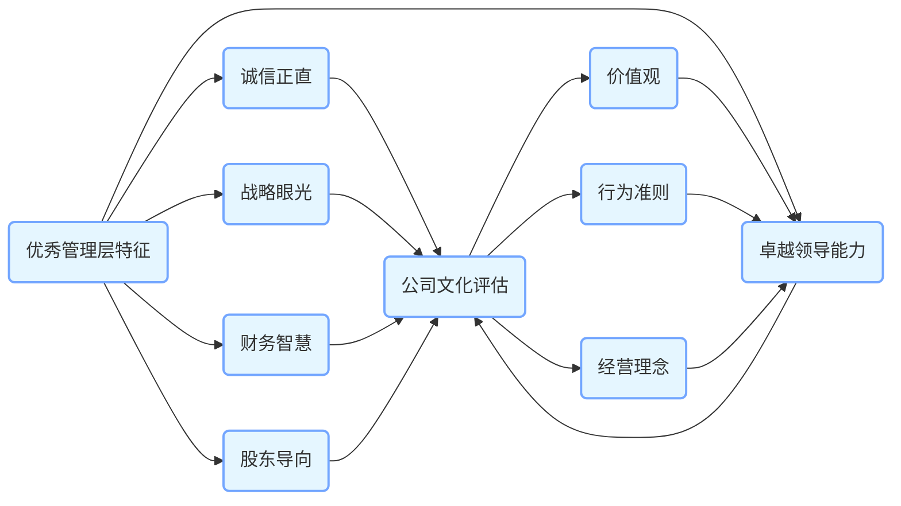

# 巴菲特的公司文化评估：优秀管理层的特征

> 关键词：巴菲特、公司文化评估、优秀管理层、特征、投资理念

> 摘要：本文围绕巴菲特的公司文化评估视角，深入剖析优秀管理层所具备的特征。首先介绍了研究此主题的背景，包括目的、预期读者等内容。接着阐述核心概念，明确公司文化评估与优秀管理层特征之间的联系。通过核心算法原理、数学模型等理论分析，结合项目实战案例，展现优秀管理层特征在实际公司运营中的体现。探讨其实际应用场景，推荐相关学习资源、开发工具及论文著作。最后总结未来发展趋势与挑战，解答常见问题并提供扩展阅读和参考资料，旨在为投资者、企业管理者等提供全面且深入的理解和借鉴。

## 1. 背景介绍 
### 1.1 目的和范围
本研究的目的在于深入理解巴菲特的公司文化评估体系中优秀管理层的特征。巴菲特作为投资界的传奇人物，其投资理念和对公司管理层的评估方法一直备受关注。通过研究他对优秀管理层的看法，能够为投资者提供更准确的投资参考，帮助企业管理者明确自身的发展方向，提升管理水平。研究范围涵盖了巴菲特公开的言论、著作以及其投资案例中所体现的对公司管理层的要求和评价标准。

### 1.2 预期读者
本文预期读者包括投资者，无论是个人投资者还是机构投资者，都可以从中学到如何通过评估管理层来筛选具有投资价值的公司；企业管理者可以借鉴优秀管理层的特征，改进自身的管理方式和领导风格，提升公司的整体竞争力；对巴菲特投资理念和公司管理理论感兴趣的学者和研究人员，也可以通过本文深入了解相关领域的知识。

### 1.3 文档结构概述
本文首先介绍研究的背景信息，包括目的、预期读者和文档结构概述等。接着阐述核心概念，明确公司文化评估与优秀管理层特征的内涵及联系。然后详细讲解核心算法原理和具体操作步骤，通过数学模型和公式进一步分析。以实际项目案例展示优秀管理层特征在实践中的应用，探讨其实际应用场景。推荐相关的学习资源、开发工具和论文著作。最后总结未来发展趋势与挑战，解答常见问题并提供扩展阅读和参考资料。

### 1.4 术语表
#### 1.4.1 核心术语定义
- **公司文化评估**：是指对公司的价值观、行为准则、经营理念等文化层面的因素进行全面、系统的分析和评价，以了解公司的文化特质和发展潜力。
- **优秀管理层**：具备卓越领导能力、战略眼光、决策能力、团队管理能力等多种素质，能够带领公司实现长期稳定发展，为股东创造价值的管理团队。

#### 1.4.2 相关概念解释
- **投资理念**：投资者在进行投资活动时所遵循的基本原则和方法，包括对投资目标、风险偏好、投资策略等方面的认识和选择。
- **企业竞争力**：企业在市场竞争中所具备的优势和能力，包括产品或服务的质量、成本控制、创新能力、品牌影响力等多个方面。

#### 1.4.3 缩略词列表
- **CEO**：首席执行官（Chief Executive Officer）
- **CFO**：首席财务官（Chief Financial Officer）

## 2. 核心概念与联系 

### 公司文化评估的原理
公司文化评估是一个综合性的过程，它涉及到对公司内部多个层面的考察。从价值观层面来看，公司的价值观是公司文化的核心，它决定了公司的行为准则和决策方向。例如，一家强调创新的公司，会鼓励员工勇于尝试新的想法和方法，在决策过程中也会更倾向于支持创新项目。从行为准则层面来看，公司的行为准则规范了员工的日常行为，它包括道德规范、工作流程、团队协作方式等。一个具有良好行为准则的公司，员工之间的协作会更加高效，工作效率也会更高。从经营理念层面来看，公司的经营理念反映了公司的战略方向和市场定位。一家以客户为中心的公司，会将满足客户需求作为公司的首要任务，在产品研发、市场营销等方面都会围绕客户需求展开。

### 优秀管理层的特征架构
优秀管理层通常具备以下几个方面的特征：
1. **诚信正直**：管理层必须具备高度的诚信和正直品质，这是赢得股东、员工和客户信任的基础。一个诚信正直的管理层会遵守法律法规，如实披露公司信息，不会为了短期利益而损害公司的长期发展。
2. **卓越的领导能力**：能够制定明确的战略方向，激励和引导员工朝着共同的目标前进。优秀的领导者具备良好的沟通能力、决策能力和团队管理能力，能够有效地组织和协调公司的资源。
3. **战略眼光**：对市场趋势和行业发展有敏锐的洞察力，能够提前布局，制定出符合公司长期发展的战略规划。具备战略眼光的管理层能够抓住市场机遇，带领公司在激烈的市场竞争中脱颖而出。
4. **财务智慧**：懂得合理配置公司资源，有效管理公司财务，确保公司的财务健康。他们能够制定合理的预算计划，控制成本，提高资金使用效率。
5. **股东导向**：将股东利益放在首位，努力为股东创造价值。他们会关注公司的股价表现，积极采取措施提升公司的盈利能力和市场价值。

### 核心概念联系的文本示意图
公司文化评估与优秀管理层特征之间存在着紧密的联系。优秀的管理层能够塑造和传承公司的文化，他们的价值观和行为方式会影响公司的文化氛围。例如，一个具有创新精神的管理层会鼓励员工创新，从而在公司内部形成创新的文化氛围。同时，公司文化也会对管理层的行为产生约束和引导作用。一个强调团队合作的公司文化，会促使管理层更加注重团队建设和协作。

### Mermaid 流程图


## 3. 核心算法原理 & 具体操作步骤 

### 核心算法原理
我们可以通过构建一个综合评估模型来评估管理层的优秀程度。这个模型可以基于多个维度的指标，每个指标赋予不同的权重，最后将各个指标的得分加权求和得到管理层的综合得分。

以下是使用 Python 实现的一个简单示例：

```python
# 定义各个指标的权重
weights = {
    "诚信正直": 0.2,
    "卓越领导能力": 0.3,
    "战略眼光": 0.2,
    "财务智慧": 0.15,
    "股东导向": 0.15
}

# 定义评估函数
def evaluate_management(management_scores):
    total_score = 0
    for indicator, score in management_scores.items():
        if indicator in weights:
            total_score += score * weights[indicator]
    return total_score

# 示例数据
management_scores = {
    "诚信正直": 8,
    "卓越领导能力": 7,
    "战略眼光": 6,
    "财务智慧": 7,
    "股东导向": 8
}

# 计算综合得分
result = evaluate_management(management_scores)
print(f"管理层综合得分: {result}")
```

### 具体操作步骤
1. **确定评估指标**：根据前面提到的优秀管理层的特征，确定具体的评估指标，如诚信正直、卓越领导能力等。
2. **收集数据**：通过各种渠道收集管理层在各个评估指标上的表现数据。例如，可以通过公司的年报、新闻报道、员工访谈等方式获取相关信息。
3. **量化评估**：将收集到的数据进行量化，为每个指标赋予一个得分。得分可以采用 1 - 10 分的评分标准，1 分表示表现较差，10 分表示表现优秀。
4. **确定权重**：根据各个指标的重要程度，确定每个指标的权重。权重的确定可以参考行业经验、专家意见等。
5. **计算综合得分**：将各个指标的得分乘以对应的权重，然后求和得到管理层的综合得分。
6. **评估结果分析**：根据综合得分对管理层的优秀程度进行评估。得分越高，说明管理层越优秀。

## 4. 数学模型和公式 & 详细讲解 & 举例说明 

### 数学模型和公式
设评估指标有 $n$ 个，分别为 $x_1, x_2, \cdots, x_n$，对应的权重为 $w_1, w_2, \cdots, w_n$，其中 $\sum_{i=1}^{n} w_i = 1$。管理层的综合得分 $S$ 可以通过以下公式计算：

$$S = \sum_{i=1}^{n} w_i x_i$$

### 详细讲解
这个公式的原理是加权平均。每个评估指标的得分乘以其对应的权重，然后将所有结果相加，得到管理层的综合得分。权重的作用是反映各个指标的重要程度。例如，如果诚信正直这个指标的权重较高，说明在评估管理层时，诚信正直这个因素更为重要。

### 举例说明
假设我们有三个评估指标：诚信正直（$x_1$）、卓越领导能力（$x_2$）、战略眼光（$x_3$），对应的权重分别为 $w_1 = 0.3$，$w_2 = 0.4$，$w_3 = 0.3$。某管理层在这三个指标上的得分分别为 $x_1 = 8$，$x_2 = 7$，$x_3 = 6$。

根据公式计算综合得分：

$$S = 0.3 \times 8 + 0.4 \times 7 + 0.3 \times 6$$
$$S = 2.4 + 2.8 + 1.8$$
$$S = 7$$

所以，该管理层的综合得分为 7 分。

## 5. 项目实战：代码实际案例和详细解释说明 

### 5.1  开发环境搭建
本项目使用 Python 进行开发，开发环境可以选择 Anaconda 或直接安装 Python 解释器。建议使用 PyCharm 作为集成开发环境（IDE），它提供了丰富的代码编辑和调试功能。

安装 Python 后，可以使用以下命令安装所需的库：
```sh
pip install pandas numpy matplotlib
```

### 5.2  源代码详细实现和代码解读
以下是一个更复杂的示例，使用 Pandas 库来处理数据，并且可以对多个管理层进行评估：

```python
import pandas as pd

# 定义各个指标的权重
weights = {
    "诚信正直": 0.2,
    "卓越领导能力": 0.3,
    "战略眼光": 0.2,
    "财务智慧": 0.15,
    "股东导向": 0.15
}

# 读取数据文件（假设数据文件为 CSV 格式）
data = pd.read_csv('management_scores.csv')

# 定义评估函数
def evaluate_management(row):
    total_score = 0
    for indicator, score in row.items():
        if indicator in weights:
            total_score += score * weights[indicator]
    return total_score

# 计算每个管理层的综合得分
data['综合得分'] = data.apply(evaluate_management, axis=1)

# 输出结果
print(data)

# 可视化结果
import matplotlib.pyplot as plt

plt.bar(data['管理层名称'], data['综合得分'])
plt.xlabel('管理层名称')
plt.ylabel('综合得分')
plt.title('管理层综合得分评估')
plt.show()
```

### 5.3  代码解读与分析
1. **导入库**：导入 Pandas 和 Matplotlib 库，Pandas 用于数据处理，Matplotlib 用于数据可视化。
2. **定义权重**：定义各个评估指标的权重。
3. **读取数据**：使用 Pandas 的 `read_csv` 函数读取存储管理层得分的 CSV 文件。
4. **定义评估函数**：定义一个评估函数，用于计算每个管理层的综合得分。
5. **计算综合得分**：使用 Pandas 的 `apply` 函数将评估函数应用到每一行数据上，计算每个管理层的综合得分，并将结果存储在新的列中。
6. **输出结果**：打印包含综合得分的 DataFrame。
7. **可视化结果**：使用 Matplotlib 绘制柱状图，直观地展示每个管理层的综合得分。

## 6. 实际应用场景 
### 投资决策
投资者在选择投资标的时，可以通过评估公司管理层的优秀程度来判断公司的发展潜力。一个优秀的管理层能够带领公司实现长期稳定的发展，为股东创造更高的回报。例如，巴菲特在投资时非常注重公司管理层的素质，他会深入了解管理层的背景、管理风格和业绩记录等信息，以此作为投资决策的重要依据。

### 企业管理改进
企业管理者可以参考优秀管理层的特征，对自身的管理方式进行改进。通过自我评估和与优秀管理层的对比，发现自身的不足之处，并采取相应的措施加以改进。例如，企业管理者可以学习优秀管理层的战略眼光，加强对市场趋势的研究和分析，制定更符合公司发展的战略规划。

### 人才选拔与培养
在企业的人才选拔和培养过程中，可以将优秀管理层的特征作为标准。在招聘管理层人员时，注重考察候选人的诚信正直、领导能力、战略眼光等素质。在培养内部员工时，也可以围绕这些特征进行培训和发展，提高员工的综合素质，为企业的发展储备优秀的管理人才。

## 7. 工具和资源推荐
### 7.1 学习资源推荐
#### 7.1.1 书籍推荐
- 《巴菲特致股东的信：投资者和公司高管教程》：这本书收录了巴菲特多年来致股东的信，详细阐述了他的投资理念和对公司管理的看法，是学习巴菲特思想的经典读物。
- 《聪明的投资者》：作者本杰明·格雷厄姆是巴菲特的导师，这本书是价值投资领域的经典著作，对投资者和企业管理者都具有很高的参考价值。

#### 7.1.2 在线课程
- Coursera 上的《投资学原理》：该课程由知名大学的教授授课，系统地介绍了投资学的基本原理和方法，包括对公司管理层的评估。
- edX 上的《企业战略管理》：课程内容涵盖了企业战略制定、执行和评估等方面，有助于深入理解优秀管理层的战略眼光和决策能力。

#### 7.1.3 技术博客和网站
- 雪球网：是一个投资社区，上面有很多投资者分享的关于公司分析和管理层评估的文章和观点。
- 价值中国网：提供了丰富的商业和管理领域的文章，其中不乏关于优秀管理层特征的讨论。

### 7.2 开发工具框架推荐
#### 7.2.1 IDE和编辑器
- PyCharm：功能强大的 Python 集成开发环境，提供了代码编辑、调试、版本控制等多种功能，适合 Python 项目的开发。
- Visual Studio Code：轻量级的代码编辑器，支持多种编程语言，通过安装相关插件可以实现 Python 开发的各种功能。

#### 7.2.2 调试和性能分析工具
- PDB：Python 自带的调试工具，可以帮助开发者在代码中设置断点，逐步执行代码，查找问题。
- cProfile：Python 的性能分析工具，可以分析代码的运行时间和函数调用情况，帮助优化代码性能。

#### 7.2.3 相关框架和库
- Pandas：用于数据处理和分析的 Python 库，提供了高效的数据结构和数据操作方法。
- NumPy：Python 的科学计算库，提供了多维数组对象和各种数学函数，在数据处理和计算中经常使用。

### 7.3 相关论文著作推荐
#### 7.3.1 经典论文
- Jensen, M. C., & Meckling, W. H. (1976). Theory of the firm: Managerial behavior, agency costs and ownership structure. Journal of financial economics, 3(4), 305-360. 该论文探讨了企业中管理层与股东之间的代理关系，对理解管理层的行为和激励机制具有重要意义。
- Fama, E. F., & Jensen, M. C. (1983). Separation of ownership and control. Journal of law and economics, 26(2), 301-325. 文章分析了企业所有权和控制权分离的问题，以及对公司治理和管理层行为的影响。

#### 7.3.2 最新研究成果
- 可以通过 Google Scholar、Web of Science 等学术搜索引擎搜索关于公司管理层评估和优秀管理层特征的最新研究论文，了解该领域的前沿动态。

#### 7.3.3 应用案例分析
- 可以参考一些知名企业的案例分析报告，如苹果、亚马逊、微软等公司的管理层管理经验和成功案例，从中学习优秀管理层的特征和管理方法。

## 8. 总结：未来发展趋势与挑战
### 未来发展趋势
- **数字化转型**：随着信息技术的快速发展，企业的数字化转型将成为必然趋势。优秀的管理层需要具备数字化思维和能力，能够推动企业的数字化转型，利用大数据、人工智能等技术提升企业的竞争力。
- **社会责任意识增强**：社会对企业的社会责任要求越来越高，优秀的管理层需要更加注重企业的社会责任，将社会责任纳入企业的战略规划和经营决策中，实现企业的可持续发展。
- **全球化竞争加剧**：经济全球化的趋势不断加强，企业面临的竞争也越来越激烈。优秀的管理层需要具备全球化视野和跨文化管理能力，能够在全球范围内整合资源，开拓市场。

### 挑战
- **人才短缺**：培养和吸引具备优秀管理层特征的人才是企业面临的一大挑战。优秀的管理人才不仅需要具备专业知识和技能，还需要具备良好的品德和领导能力，这样的人才相对稀缺。
- **市场变化快速**：市场环境变化迅速，技术创新不断涌现，优秀的管理层需要具备快速响应和适应变化的能力。如何在复杂多变的市场环境中做出正确的决策，是管理层面临的重要挑战。
- **企业文化传承**：优秀的企业文化是企业发展的重要支撑，如何将优秀的企业文化传承下去，让新的管理层和员工认同和践行企业文化，是企业面临的长期挑战。

## 9. 附录：常见问题与解答
### 如何准确评估管理层的诚信正直？
可以通过查看管理层的个人履历、过往的工作记录、是否有违法违规行为等方式来评估。同时，也可以关注公司的信息披露是否真实、准确、完整，以及管理层在处理利益冲突时的态度和行为。

### 优秀管理层的特征是否适用于所有类型的企业？
虽然优秀管理层的一些基本特征，如诚信正直、领导能力等是普遍适用的，但不同类型的企业可能对管理层的要求会有所侧重。例如，科技企业可能更注重管理层的创新能力和技术背景，而传统制造业企业可能更关注管理层的成本控制和生产管理能力。

### 如何培养管理层的战略眼光？
管理层可以通过学习宏观经济知识、关注行业动态、参加战略管理培训等方式来培养战略眼光。同时，多与行业内的专家和同行交流，积累实践经验，也有助于提升战略眼光。

## 10. 扩展阅读 & 参考资料
### 扩展阅读
- 《基业长青：企业永续经营的准则》：探讨了企业如何实现长期稳定发展，以及优秀管理层在其中的作用。
- 《从优秀到卓越》：研究了一些优秀企业如何实现从优秀到卓越的跨越，分析了这些企业的管理层特征和管理模式。

### 参考资料
- 巴菲特历年致股东的信官方网站
- 相关企业的年报和公告
- 学术期刊和研究报告，如《Journal of Financial Economics》、《Journal of Law and Economics》等