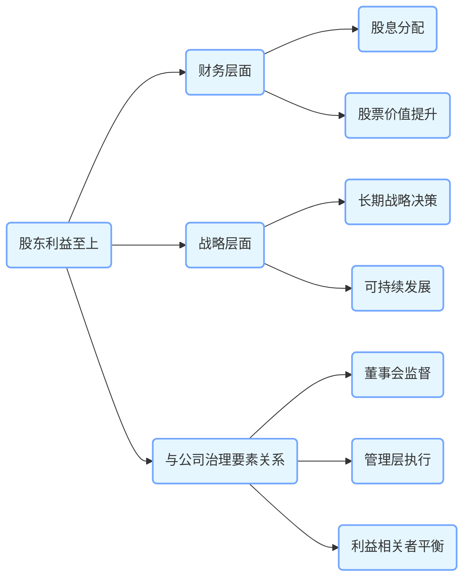

# 巴菲特的公司治理观：股东利益至上的原则

> 关键词：巴菲特、公司治理观、股东利益至上、伯克希尔·哈撒韦、价值投资、长期主义、企业战略

> 摘要：本文深入探讨了巴菲特的公司治理观，着重剖析其“股东利益至上”原则的内涵、形成背景、具体实践及深远影响。通过对相关理论和实际案例的研究，揭示该原则在企业经营管理中的重要性，以及如何助力企业实现长期价值增长和股东财富最大化。同时，分析这一治理观在不同市场环境下的适应性和面临的挑战，为企业管理者、投资者和研究人员提供有价值的参考和借鉴。

## 1. 背景介绍 
### 1.1 目的和范围
本文旨在全面且深入地研究巴菲特的公司治理观，尤其是“股东利益至上”这一核心原则。研究范围涵盖该原则的理论基础、在伯克希尔·哈撒韦公司的具体实践、对企业经营决策的影响，以及在全球企业治理领域的借鉴意义。通过对相关文献、年报、案例的综合分析，试图揭示这一治理观的本质和价值，为企业治理和投资决策提供有益的启示。

### 1.2 预期读者
本文的预期读者包括企业管理者、投资者、金融从业者、经济学者以及对公司治理和投资理论感兴趣的人士。对于企业管理者，可从中学习如何构建以股东利益为导向的公司治理体系；投资者能了解巴菲特的投资理念和企业评估方法；金融从业者可深入理解公司治理与资本市场的关系；经济学者可对公司治理理论进行进一步的研究和探讨；而普通读者则能获得关于企业经营和投资的基础知识和独特见解。

### 1.3 文档结构概述
本文共分为十个部分。第一部分为背景介绍，阐述研究目的、预期读者和文档结构，并对相关术语进行解释。第二部分探讨核心概念与联系，分析“股东利益至上”原则的内涵及其与公司治理其他要素的关系。第三部分介绍核心算法原理及具体操作步骤，虽然巴菲特的治理观并非传统意义上的算法，但会阐述其决策逻辑和方法。第四部分讲解数学模型和公式，通过相关财务指标和估值模型来支撑其治理观。第五部分为项目实战，以伯克希尔·哈撒韦公司为例，介绍开发环境搭建、源代码（实际决策过程和案例）详细实现和代码解读（案例分析）。第六部分探讨实际应用场景，分析该治理观在不同行业和市场环境中的应用。第七部分推荐相关的工具和资源，包括学习资源、开发工具框架和论文著作。第八部分总结未来发展趋势与挑战，展望该治理观在未来经济环境中的发展和面临的问题。第九部分为附录，解答常见问题。第十部分提供扩展阅读和参考资料，方便读者进一步深入研究。

### 1.4 术语表
#### 1.4.1 核心术语定义
- **股东利益至上**：指在公司治理过程中，将股东的利益作为首要考虑因素，公司的决策和经营活动旨在实现股东财富的最大化。
- **公司治理**：是一套用于管理和控制公司的制度、机制和流程，旨在平衡公司各利益相关者的利益，确保公司的有效运作和长期发展。
- **价值投资**：一种投资策略，强调通过对公司基本面的分析，寻找被低估的股票，并长期持有，以获得公司内在价值增长带来的收益。
- **长期主义**：在决策和行动中，着眼于长期目标和利益，而非短期的波动和利益，注重可持续发展和长期价值创造。

#### 1.4.2 相关概念解释
- **伯克希尔·哈撒韦**：巴菲特领导的一家多元化投资公司，旗下拥有众多子公司，业务涵盖保险、能源、制造业、零售业等多个领域，是巴菲特公司治理观的实践载体。
- **护城河理论**：巴菲特提出的一种企业竞争优势理论，指企业拥有的一种可持续的竞争优势，如同城堡周围的护城河一样，能够保护企业免受竞争对手的侵蚀，确保企业长期获得稳定的利润。

#### 1.4.3 缩略词列表
- **ROE**：Return on Equity，净资产收益率，衡量公司盈利能力的重要指标，反映股东权益的收益水平。
- **EPS**：Earnings Per Share，每股收益，指税后利润与股本总数的比率，是普通股股东每持有一股所能享有的企业净利润或需承担的企业净亏损。

## 2. 核心概念与联系 

### 2.1 “股东利益至上”原则的内涵
“股东利益至上”原则是巴菲特公司治理观的核心。在巴菲特看来，股东是公司的所有者，公司的资源和资产属于股东，因此公司的一切决策和经营活动都应该以股东的利益为出发点和落脚点。这一原则不仅仅是追求短期的股价上涨或利润最大化，更强调长期的股东财富增长。

从财务角度来看，股东利益的体现主要包括股息分配和股票价值的提升。巴菲特注重公司的盈利能力和现金流状况，通过合理的资本配置和业务拓展，确保公司能够持续创造价值，为股东带来稳定的回报。例如，伯克希尔·哈撒韦公司在选择投资标的时，会优先考虑那些具有持续竞争优势、能够产生大量自由现金流的企业，因为这些企业更有可能为股东创造长期的财富。

从战略角度来看，“股东利益至上”原则要求公司管理层制定的战略决策符合股东的长期利益。这可能意味着在某些情况下，公司会放弃短期的高收益项目，而选择那些虽然回报周期较长但更具可持续性的项目。例如，巴菲特在投资时，会避开那些高风险、高波动的行业，而倾向于投资那些具有稳定需求和可预测现金流的行业，如消费、能源等行业。

### 2.2 与公司治理其他要素的关系
“股东利益至上”原则与公司治理的其他要素密切相关，相互影响。

- **与董事会的关系**：董事会是公司治理的核心机构，负责监督公司管理层的决策和经营活动。在巴菲特的治理观中，董事会应该以股东利益为导向，确保管理层的决策符合股东的长期利益。伯克希尔·哈撒韦公司的董事会成员大多具有丰富的商业经验和专业知识，他们能够独立、客观地监督管理层的决策，保护股东的利益。
- **与管理层的关系**：管理层是公司日常经营的执行者，他们的决策和行动直接影响公司的业绩和股东的利益。巴菲特强调管理层应该具备诚信、能力和对股东的责任感。他会选择那些与公司文化和价值观相符的管理层，并给予他们充分的自主权，让他们能够在符合股东利益的前提下自由地经营公司。
- **与利益相关者的关系**：虽然“股东利益至上”是核心原则，但巴菲特也认识到公司的利益相关者包括员工、客户、供应商、社区等，他们的利益也会影响公司的长期发展。因此，在追求股东利益的同时，公司也需要考虑其他利益相关者的利益，实现各方利益的平衡。例如，伯克希尔·哈撒韦公司注重员工的培训和发展，为员工提供良好的工作环境和福利待遇，以提高员工的忠诚度和工作效率；同时，公司也注重与客户和供应商的合作，建立长期稳定的合作关系，以确保公司的业务能够顺利开展。

### 2.3 核心概念原理和架构的文本示意图
```plaintext
股东利益至上
|
|-- 财务层面
|   |-- 股息分配
|   |-- 股票价值提升
|
|-- 战略层面
|   |-- 长期战略决策
|   |-- 可持续发展
|
|-- 与公司治理要素关系
|   |-- 董事会监督
|   |-- 管理层执行
|   |-- 利益相关者平衡
```

### 2.4 Mermaid 流程图


## 3. 核心算法原理 & 具体操作步骤 

### 3.1 决策逻辑和方法
虽然巴菲特的公司治理观并非传统意义上的算法，但他有一套独特的决策逻辑和方法，这些方法可以帮助他做出符合股东利益的决策。

- **基本面分析**：巴菲特非常重视对公司基本面的分析，他会研究公司的财务报表、业务模式、竞争优势、管理层素质等方面的信息，以评估公司的内在价值。例如，他会关注公司的净资产收益率（ROE）、每股收益（EPS）、毛利率、净利率等财务指标，以及公司在行业中的地位、市场份额、品牌影响力等非财务指标。
- **估值模型**：在评估公司的内在价值时，巴菲特会使用一些估值模型，如现金流折现模型（DCF）。该模型通过预测公司未来的现金流，并将其折现到当前，以确定公司的内在价值。巴菲特认为，只有当公司的股价低于其内在价值时，才是一个合适的投资机会。
- **风险评估**：巴菲特在决策过程中非常注重风险评估，他会考虑各种可能的风险因素，如市场风险、行业风险、公司特定风险等，并采取相应的措施来降低风险。例如，他会通过分散投资来降低市场风险，选择具有稳定现金流和低负债的公司来降低公司特定风险。

### 3.2 具体操作步骤
以下是巴菲特在投资决策和公司治理中遵循的具体操作步骤：

#### 3.2.1 筛选投资标的
- **行业分析**：首先，巴菲特会对不同行业进行分析，选择那些具有长期发展潜力、竞争格局稳定、需求增长趋势明确的行业。例如，他会关注消费、能源、金融等行业，因为这些行业通常具有较强的抗周期性和稳定的现金流。
- **公司筛选**：在确定了目标行业后，巴菲特会对行业内的公司进行筛选，选择那些具有强大竞争优势、优秀管理层、良好财务状况的公司。他会通过研究公司的年报、财务报表、新闻报道等信息，对公司进行全面的评估。

#### 3.2.2 评估公司价值
- **财务分析**：对筛选出的公司进行详细的财务分析，计算各种财务指标，如ROE、EPS、毛利率、净利率等，以评估公司的盈利能力和财务健康状况。
- **现金流预测**：使用现金流折现模型（DCF）对公司未来的现金流进行预测，并将其折现到当前，以确定公司的内在价值。在预测现金流时，需要考虑公司的业务模式、市场前景、竞争环境等因素。
- **估值比较**：将公司的内在价值与当前股价进行比较，如果股价低于内在价值，则认为该公司具有投资价值。

#### 3.2.3 决策投资
- **风险评估**：在决定投资之前，需要对投资的风险进行评估，考虑各种可能的风险因素，如市场风险、行业风险、公司特定风险等。
- **投资组合配置**：根据风险评估的结果，合理配置投资组合，分散投资风险。巴菲特通常会持有多只股票，以降低单一股票的风险。
- **长期持有**：一旦做出投资决策，巴菲特会长期持有股票，相信公司的内在价值会随着时间的推移而逐渐体现出来。

### 3.3 Python 源代码示例
以下是一个简单的 Python 代码示例，用于计算公司的净资产收益率（ROE）和每股收益（EPS）：

```python
# 定义一个公司类
class Company:
    def __init__(self, net_income, shareholders_equity, shares_outstanding):
        # 净利润
        self.net_income = net_income
        # 股东权益
        self.shareholders_equity = shareholders_equity
        # 流通股数
        self.shares_outstanding = shares_outstanding

    def calculate_roe(self):
        # 计算净资产收益率
        if self.shareholders_equity == 0:
            return 0
        return self.net_income / self.shareholders_equity

    def calculate_eps(self):
        # 计算每股收益
        if self.shares_outstanding == 0:
            return 0
        return self.net_income / self.shares_outstanding

# 创建一个公司实例
company = Company(1000000, 5000000, 100000)

# 计算 ROE 和 EPS
roe = company.calculate_roe()
eps = company.calculate_eps()

print(f"净资产收益率 (ROE): {roe * 100}%")
print(f"每股收益 (EPS): {eps}")
```

在这个示例中，我们定义了一个 `Company` 类，用于表示一个公司。该类包含了公司的净利润、股东权益和流通股数等属性，并提供了计算净资产收益率（ROE）和每股收益（EPS）的方法。最后，我们创建了一个公司实例，并计算了该公司的 ROE 和 EPS。

## 4. 数学模型和公式 & 详细讲解 & 举例说明 

### 4.1 现金流折现模型（DCF）
现金流折现模型（DCF）是巴菲特常用的估值模型之一，用于评估公司的内在价值。该模型的基本思想是，公司的内在价值等于其未来所有现金流的现值之和。

#### 4.1.1 数学公式
$$V = \sum_{t=1}^{n} \frac{CF_t}{(1 + r)^t} + \frac{TV}{(1 + r)^n}$$

其中：
- $V$ 表示公司的内在价值
- $CF_t$ 表示第 $t$ 期的自由现金流
- $r$ 表示折现率
- $n$ 表示预测期数
- $TV$ 表示终值

#### 4.1.2 详细讲解
- **自由现金流（CF）**：自由现金流是指公司在满足了所有必要的资本支出后剩余的现金流，它反映了公司实际可用于分配给股东或进行再投资的现金流量。计算自由现金流的公式为：
$$FCF = EBIT(1 - T) + D&A - CAPEX - \Delta NWC$$

其中：
- $EBIT$ 表示息税前利润
- $T$ 表示所得税税率
- $D&A$ 表示折旧和摊销
- $CAPEX$ 表示资本支出
- $\Delta NWC$ 表示净营运资本的变化

- **折现率（r）**：折现率是用于将未来现金流折现到当前的利率，它反映了投资者对投资回报的要求和对风险的评估。折现率通常可以使用加权平均资本成本（WACC）来计算，公式为：
$$WACC = w_d \times r_d(1 - T) + w_e \times r_e$$

其中：
- $w_d$ 表示债务权重
- $r_d$ 表示债务成本
- $T$ 表示所得税税率
- $w_e$ 表示股权权重
- $r_e$ 表示股权成本

- **终值（TV）**：终值是指预测期结束后公司的价值，通常可以使用永续增长模型来计算，公式为：
$$TV = \frac{CF_{n+1}}{r - g}$$

其中：
- $CF_{n+1}$ 表示预测期结束后下一期的自由现金流
- $g$ 表示永续增长率

#### 4.1.3 举例说明
假设我们要评估一家公司的内在价值，预测期为 5 年，相关数据如下：

| 年份 | 自由现金流（CF） |
|------|------------------|
| 1    | 100              |
| 2    | 120              |
| 3    | 140              |
| 4    | 160              |
| 5    | 180              |

预测期结束后，公司的自由现金流将以 3% 的永续增长率增长，折现率为 10%。

首先，计算预测期内的现金流现值：

$$PV_1 = \frac{100}{(1 + 0.1)^1} = 90.91$$
$$PV_2 = \frac{120}{(1 + 0.1)^2} = 99.17$$
$$PV_3 = \frac{140}{(1 + 0.1)^3} = 105.18$$
$$PV_4 = \frac{160}{(1 + 0.1)^4} = 109.28$$
$$PV_5 = \frac{180}{(1 + 0.1)^5} = 111.77$$

然后，计算终值：

$$CF_{6} = 180 \times (1 + 0.03) = 185.4$$
$$TV = \frac{185.4}{0.1 - 0.03} = 2648.57$$

终值的现值为：

$$PV_{TV} = \frac{2648.57}{(1 + 0.1)^5} = 1643.42$$

最后，计算公司的内在价值：

$$V = 90.91 + 99.17 + 105.18 + 109.28 + 111.77 + 1643.42 = 2159.73$$

因此，该公司的内在价值为 2159.73。

### 4.2 净资产收益率（ROE）
净资产收益率（ROE）是衡量公司盈利能力的重要指标，反映了股东权益的收益水平。

#### 4.2.1 数学公式
$$ROE = \frac{Net Income}{Shareholders' Equity}$$

其中：
- $Net Income$ 表示净利润
- $Shareholders' Equity$ 表示股东权益

#### 4.2.2 详细讲解
ROE 越高，说明公司利用自有资本获取收益的能力越强，股东的回报越高。一般来说，ROE 持续保持在 15% 以上的公司被认为具有较强的盈利能力。

ROE 可以进一步分解为三个因素，即杜邦分析：

$$ROE = \frac{Net Income}{Sales} \times \frac{Sales}{Assets} \times \frac{Assets}{Shareholders' Equity}$$

其中：
- $\frac{Net Income}{Sales}$ 表示销售净利率，反映了公司的盈利能力
- $\frac{Sales}{Assets}$ 表示总资产周转率，反映了公司的资产运营效率
- $\frac{Assets}{Shareholders' Equity}$ 表示权益乘数，反映了公司的财务杠杆水平

通过杜邦分析，可以深入了解 ROE 的驱动因素，找出公司盈利能力的优势和不足。

#### 4.2.3 举例说明
假设一家公司的净利润为 100 万元，股东权益为 500 万元，则该公司的 ROE 为：

$$ROE = \frac{100}{500} = 0.2 = 20\%$$

这意味着该公司每投入 1 元的股东权益，可以获得 0.2 元的净利润，股东的回报较高。

## 5. 项目实战：代码实际案例和详细解释说明 

### 5.1  开发环境搭建
在进行基于巴菲特公司治理观的投资分析项目实战时，我们可以使用 Python 作为开发语言，以下是搭建开发环境的步骤：

#### 5.1.1 安装 Python
首先，需要从 Python 官方网站（https://www.python.org/downloads/）下载并安装 Python 3.x 版本。安装完成后，打开命令行工具，输入 `python --version` 命令，检查 Python 是否安装成功。

#### 5.1.2 安装必要的库
我们需要安装一些必要的 Python 库，如 `pandas`、`numpy`、`matplotlib` 等，用于数据处理、分析和可视化。可以使用 `pip` 命令进行安装：

```sh
pip install pandas numpy matplotlib
```

#### 5.1.3 选择开发工具
可以选择使用 Jupyter Notebook 或 PyCharm 等开发工具进行项目开发。Jupyter Notebook 适合进行交互式的数据分析和代码演示，而 PyCharm 则更适合进行大型项目的开发和调试。

### 5.2  源代码详细实现和代码解读
以下是一个简单的投资分析项目实战代码示例，用于筛选具有高 ROE 和稳定现金流的公司：

```python
import pandas as pd

# 读取公司财务数据文件（假设文件名为 financial_data.csv）
data = pd.read_csv('financial_data.csv')

# 筛选出 ROE 大于 15% 的公司
roe_threshold = 0.15
high_roe_companies = data[data['ROE'] > roe_threshold]

# 筛选出自由现金流为正的公司
positive_fcf_companies = high_roe_companies[high_roe_companies['Free Cash Flow'] > 0]

# 按照 ROE 降序排序
sorted_companies = positive_fcf_companies.sort_values(by='ROE', ascending=False)

# 选取前 10 家公司
top_10_companies = sorted_companies.head(10)

# 输出结果
print(top_10_companies[['Company Name', 'ROE', 'Free Cash Flow']])
```

#### 5.2.1 代码解读
- **读取数据**：使用 `pandas` 库的 `read_csv` 函数读取公司财务数据文件，将数据存储在 `data` 变量中。
- **筛选高 ROE 公司**：设置 ROE 阈值为 15%，使用布尔索引筛选出 ROE 大于该阈值的公司，存储在 `high_roe_companies` 变量中。
- **筛选自由现金流为正的公司**：在高 ROE 公司中，进一步筛选出自由现金流为正的公司，存储在 `positive_fcf_companies` 变量中。
- **排序**：使用 `sort_values` 函数按照 ROE 降序排序，存储在 `sorted_companies` 变量中。
- **选取前 10 家公司**：使用 `head` 函数选取排序后的前 10 家公司，存储在 `top_10_companies` 变量中。
- **输出结果**：打印出前 10 家公司的名称、ROE 和自由现金流。

### 5.3  代码解读与分析
通过上述代码，我们实现了一个简单的投资分析流程，筛选出了具有高 ROE 和稳定现金流的公司。这与巴菲特的公司治理观和投资理念相契合，因为高 ROE 表示公司具有较强的盈利能力，而稳定的现金流则保证了公司的财务健康和可持续发展。

在实际应用中，我们可以进一步完善这个流程，例如增加更多的筛选条件，如公司的估值指标、行业地位等，以提高筛选的准确性。同时，我们还可以对筛选出的公司进行更深入的分析，如财务报表分析、行业竞争分析等，以评估公司的内在价值和投资潜力。

## 6. 实际应用场景 

### 6.1 企业经营决策
在企业经营决策中，“股东利益至上”原则可以为管理层提供明确的决策方向。例如，在制定战略规划时，管理层需要考虑公司的长期发展目标和股东的利益，选择那些能够为股东创造最大价值的战略方案。在进行投资决策时，需要对投资项目进行严格的评估和筛选，确保投资项目具有良好的回报和较低的风险，符合股东的利益。

### 6.2 投资决策
对于投资者来说，巴菲特的公司治理观和“股东利益至上”原则可以作为投资决策的重要参考。投资者可以通过分析公司的基本面，如财务状况、竞争优势、管理层素质等，评估公司的内在价值，并选择那些具有较高投资价值的公司进行投资。同时，投资者还可以关注公司的治理结构和股东回报政策，选择那些治理良好、注重股东利益的公司进行投资。

### 6.3 公司治理改进
对于那些治理结构不完善、股东利益得不到有效保障的公司来说，可以借鉴巴菲特的公司治理观，改进公司的治理结构和决策机制。例如，建立独立的董事会，加强对管理层的监督和约束；制定合理的股东回报政策，提高股东的满意度和忠诚度；加强信息披露，提高公司的透明度和公信力。

### 6.4 行业整合与并购
在行业整合和并购过程中，“股东利益至上”原则可以帮助企业做出正确的决策。企业在进行并购时，需要考虑并购对股东利益的影响，评估并购的协同效应和风险，确保并购能够为股东带来价值提升。同时，在行业整合过程中，企业还可以通过优化资源配置、提高行业集中度等方式，实现股东利益的最大化。

## 7. 工具和资源推荐
### 7.1 学习资源推荐
#### 7.1.1 书籍推荐
- 《聪明的投资者》（The Intelligent Investor）：作者是本杰明·格雷厄姆（Benjamin Graham），这本书是价值投资的经典之作，巴菲特称这本书是他投资生涯的启蒙读物。书中介绍了价值投资的基本理念和方法，对投资者具有很高的指导价值。
- 《巴菲特致股东的信：股份公司教程》（Letters to Shareholders of Berkshire Hathaway Inc.）：这本书收录了巴菲特历年写给伯克希尔·哈撒韦公司股东的信，通过这些信件，读者可以深入了解巴菲特的投资理念、公司治理观和人生智慧。
- 《穷查理宝典：查理·芒格的智慧箴言录》（Poor Charlie's Almanack: The Wit and Wisdom of Charles T. Munger）：作者是查理·芒格（Charlie Munger），他是巴菲特的长期合作伙伴。这本书介绍了芒格的多元思维模型和投资哲学，对投资者和企业管理者具有很大的启发作用。

#### 7.1.2 在线课程
- Coursera 平台上的“投资学原理”（Principles of Investing）课程：该课程由宾夕法尼亚大学的教授授课，介绍了投资学的基本原理和方法，包括资产定价、投资组合理论、风险管理等内容。
- edX 平台上的“金融市场”（Financial Markets）课程：该课程由耶鲁大学的教授授课，探讨了金融市场的运行机制和投资策略，对理解金融市场和投资决策具有很大的帮助。

#### 7.1.3 技术博客和网站
- 伯克希尔·哈撒韦公司官方网站（https://www.berkshirehathaway.com/）：该网站提供了巴菲特历年写给股东的信、公司年报、财务报表等重要信息，是了解巴菲特公司治理观和投资理念的重要渠道。
- 雪球网（https://xueqiu.com/）：这是一个专注于投资交流和分享的社区，用户可以在上面获取各种投资资讯、研究报告和投资者的经验分享。
- Seeking Alpha（https://seekingalpha.com/）：这是一个全球知名的金融投资网站，提供了大量的股票分析、投资策略和市场评论文章。

### 7.2 开发工具框架推荐
#### 7.2.1 IDE和编辑器
- PyCharm：这是一款专门为 Python 开发设计的集成开发环境（IDE），具有强大的代码编辑、调试、自动完成等功能，适合进行大型 Python 项目的开发。
- Jupyter Notebook：这是一个交互式的开发环境，适合进行数据分析、数据可视化和代码演示。用户可以在浏览器中编写和运行代码，并实时查看代码的执行结果。

#### 7.2.2 调试和性能分析工具
- PDB：这是 Python 自带的调试工具，可以帮助用户在代码中设置断点、单步执行、查看变量值等，方便进行代码调试。
- cProfile：这是 Python 自带的性能分析工具，可以帮助用户分析代码的运行时间和性能瓶颈，优化代码性能。

#### 7.2.3 相关框架和库
- Pandas：这是一个用于数据处理和分析的 Python 库，提供了高效的数据结构和数据分析工具，如数据读取、数据清洗、数据聚合等功能。
- NumPy：这是一个用于科学计算的 Python 库，提供了高效的数组操作和数学函数，是许多数据分析和机器学习库的基础。
- Matplotlib：这是一个用于数据可视化的 Python 库，提供了丰富的绘图函数和工具，如折线图、柱状图、散点图等，方便用户将数据以直观的图形展示出来。

### 7.3 相关论文著作推荐
#### 7.3.1 经典论文
- Jensen, M. C., & Meckling, W. H. (1976). Theory of the firm: Managerial behavior, agency costs and ownership structure. Journal of Financial Economics, 3(4), 305-360. 这篇论文提出了代理理论，探讨了公司管理层与股东之间的利益冲突和代理成本问题，对公司治理理论的发展产生了深远的影响。
- Fama, E. F., & French, K. R. (1992). The cross-section of expected stock returns. The Journal of Finance, 47(2), 427-465. 这篇论文提出了 Fama-French 三因子模型，用于解释股票收益率的差异，是资产定价领域的经典论文。

#### 7.3.2 最新研究成果
- Bebchuk, L. A., & Tallarita, K. (2020). The long-term effects of shareholder activism. Review of Financial Studies, 33(11), 4849-4893. 这篇论文研究了股东 activism对公司长期业绩的影响，为理解股东在公司治理中的作用提供了新的视角。
- Gompers, P. A., Ishii, J. L., & Metrick, A. (2003). Corporate governance and equity prices. The Quarterly Journal of Economics, 118(1), 107-155. 这篇论文研究了公司治理与股票价格之间的关系，发现良好的公司治理可以提高公司的市场价值。

#### 7.3.3 应用案例分析
- Brav, A., Jiang, W., Partnoy, F., & Thomas, R. (2008). Hedge fund activism, corporate governance, and firm performance. The Journal of Finance, 63(4), 1729-1775. 这篇论文通过对对冲基金 activism 的案例分析，探讨了股东积极主义对公司治理和业绩的影响。
- Cremers, K. J. M., & Nair, V. B. (2005). Governance mechanisms and equity prices. The Journal of Finance, 60(6), 2859-2894. 这篇论文通过对不同公司治理机制的案例分析，研究了公司治理对股票价格的影响。

## 8. 总结：未来发展趋势与挑战
### 8.1 未来发展趋势
- **更加注重长期价值创造**：随着市场环境的变化和投资者观念的转变，未来企业将更加注重长期价值创造，而不仅仅是追求短期的利润增长。“股东利益至上”原则将更加注重长期股东财富的增长，鼓励企业进行长期投资和战略布局。
- **多元化的股东参与**：未来股东的参与将更加多元化，不仅包括机构投资者，还包括个人投资者、员工等。股东将更加积极地参与公司治理，通过投票、提案等方式表达自己的意见和诉求，对公司的决策产生更大的影响。
- **数字化转型与公司治理创新**：随着数字化技术的发展，企业将面临数字化转型的挑战和机遇。在公司治理方面，数字化技术将为企业提供更加高效、透明的治理工具和手段，如区块链技术可以用于股东投票和股权管理，提高公司治理的效率和公正性。
- **社会责任与股东利益的融合**：未来企业将更加注重社会责任的履行，将社会责任纳入公司治理的框架中。企业在追求股东利益的同时，也需要考虑社会利益和环境利益，实现股东利益与社会责任的融合。

### 8.2 面临的挑战
- **短期利益与长期利益的平衡**：在实际经营中，企业往往面临短期利益与长期利益的冲突。例如，为了追求短期的利润增长，企业可能会削减研发投入、降低产品质量等，从而损害公司的长期发展潜力。如何在短期利益与长期利益之间找到平衡，是企业面临的一个重要挑战。
- **股东利益的多元化**：不同股东的利益诉求可能存在差异，例如，机构投资者可能更注重短期的股价波动和分红，而个人投资者可能更注重公司的长期发展前景。如何协调不同股东的利益诉求，实现股东利益的最大化，是企业需要解决的一个难题。
- **市场环境的不确定性**：市场环境的不确定性增加了企业经营的风险，例如，宏观经济波动、行业竞争加剧、政策变化等因素都可能对企业的业绩和股东利益产生影响。企业需要具备较强的风险管理能力，及时应对市场环境的变化，保护股东的利益。
- **公司治理的复杂性**：随着企业规模的扩大和业务的多元化，公司治理的复杂性也在增加。如何建立有效的公司治理机制，加强对管理层的监督和约束，提高公司的决策效率和治理水平，是企业面临的一个重要挑战。

## 9. 附录：常见问题与解答
### 9.1 什么是“股东利益至上”原则？
“股东利益至上”原则是指在公司治理过程中，将股东的利益作为首要考虑因素，公司的决策和经营活动旨在实现股东财富的最大化。这一原则不仅仅是追求短期的股价上涨或利润最大化，更强调长期的股东财富增长。

### 9.2 巴菲特的公司治理观与其他公司治理理论有什么不同？
巴菲特的公司治理观强调股东利益至上，注重长期价值创造和企业的内在价值。与其他公司治理理论相比，巴菲特更注重公司的基本面分析和管理层的素质，强调通过合理的资本配置和业务拓展，实现股东财富的长期增长。同时，巴菲特也非常重视企业的社会责任，认为企业在追求股东利益的同时，也需要考虑其他利益相关者的利益。

### 9.3 如何衡量股东利益是否得到了保障？
可以通过一些财务指标来衡量股东利益是否得到了保障，如净资产收益率（ROE）、每股收益（EPS）、股息率等。ROE 反映了股东权益的收益水平，EPS 反映了普通股股东每持有一股所能享有的企业净利润，股息率反映了股东从公司获得的股息收益。此外，还可以关注公司的股价表现、市值增长等情况，以及公司的治理结构和决策机制是否合理、透明。

### 9.4 “股东利益至上”原则是否会忽视其他利益相关者的利益？
“股东利益至上”原则并不意味着忽视其他利益相关者的利益。实际上，巴菲特认为公司的利益相关者包括员工、客户、供应商、社区等，他们的利益也会影响公司的长期发展。因此，在追求股东利益的同时，公司也需要考虑其他利益相关者的利益，实现各方利益的平衡。例如，公司可以通过提供良好的工作环境和福利待遇来吸引和留住优秀的员工，通过提供优质的产品和服务来满足客户的需求，通过建立长期稳定的合作关系来与供应商共同发展，通过积极参与社会公益活动来回报社区。

### 9.5 如何在实际企业中应用“股东利益至上”原则？
在实际企业中应用“股东利益至上”原则，可以从以下几个方面入手：
- **明确股东利益目标**：企业需要明确股东的利益目标，如长期股东财富增长、稳定的股息分配等，并将这些目标纳入公司的战略规划和决策中。
- **加强公司治理**：建立健全的公司治理机制，加强对管理层的监督和约束，确保管理层的决策符合股东的利益。例如，建立独立的董事会、设立审计委员会、加强信息披露等。
- **优化资本配置**：通过合理的资本配置，提高公司的资金使用效率，实现股东财富的最大化。例如，选择具有良好回报和较低风险的投资项目，合理安排债务和股权融资比例等。
- **关注企业长期发展**：注重企业的长期发展，而不仅仅是追求短期的利润增长。例如，加大研发投入、提升品牌价值、拓展市场份额等，以提高企业的核心竞争力和可持续发展能力。
- **平衡利益相关者关系**：在追求股东利益的同时，考虑其他利益相关者的利益，实现各方利益的平衡。例如，关注员工的福利和发展、提供优质的产品和服务、与供应商建立良好的合作关系等。

## 10. 扩展阅读 & 参考资料
### 10.1 扩展阅读
- 《投资最重要的事》（The Most Important Thing Illuminated: Uncommon Sense for the Thoughtful Investor），作者：霍华德·马克斯（Howard Marks），这本书介绍了投资中的一些重要原则和方法，对投资者具有很高的参考价值。
- 《金融炼金术》（The Alchemy of Finance），作者：乔治·索罗斯（George Soros），这本书介绍了索罗斯的投资哲学和市场分析方法，对理解金融市场的运行机制和投资决策具有很大的帮助。
- 《伟大的博弈：华尔街金融帝国的崛起（1653-2011）》（The Great Game: The Emergence of Wall Street as a World Power, 1653 - 2011），作者：约翰·斯蒂尔·戈登（John Steele Gordon），这本书讲述了华尔街的发展历程和金融市场的演变，对了解金融市场的历史和文化具有重要意义。

### 10.2 参考资料
- Berkshire Hathaway Annual Reports. 伯克希尔·哈撒韦公司历年的年报，可从公司官方网站（https://www.berkshirehathaway.com/）获取。
- Warren Buffett's Letters to Shareholders. 巴菲特历年写给股东的信，可从公司官方网站（https://www.berkshirehathaway.com/）获取。
- Academic Journals: Journal of Financial Economics, The Journal of Finance, The Quarterly Journal of Economics, etc. 相关的学术期刊，可通过学术数据库如 JSTOR、EBSCOhost 等获取。