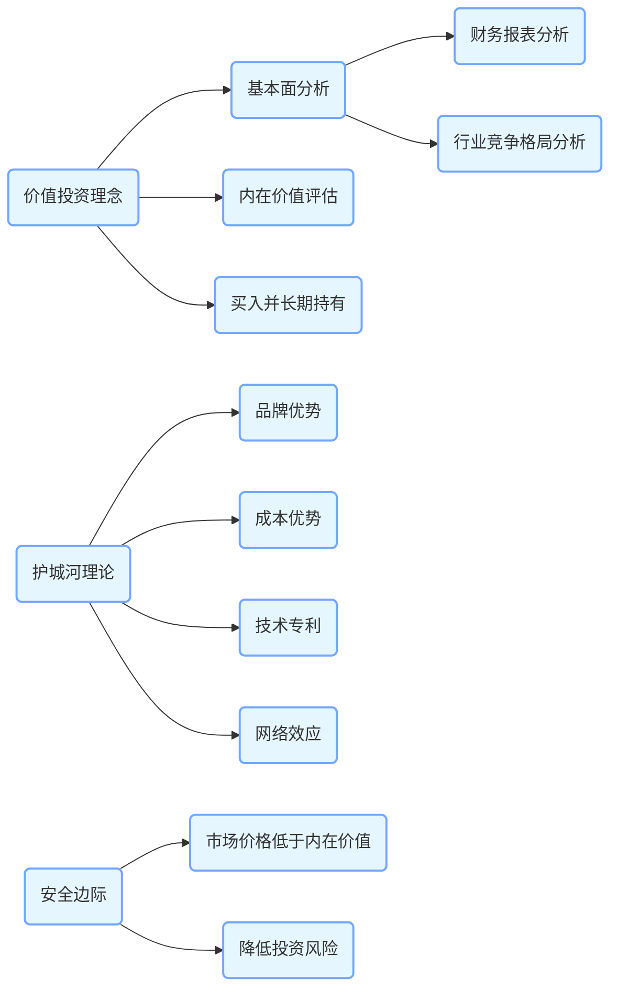

# 巴菲特的创新能力评估：如何在快速变化的市场中保持领先

> 关键词：巴菲特、创新能力、快速变化市场、投资策略、价值投资、领先优势、市场适应

> 摘要：本文旨在深入评估巴菲特的创新能力，探讨他如何在快速变化的市场中保持领先地位。通过对巴菲特投资理念、策略的剖析，结合核心概念、算法原理、数学模型等多方面的研究，以及实际案例的分析，揭示其成功的关键因素。同时，分析其在不同应用场景中的表现，推荐相关学习资源、开发工具和论文著作，最后总结其未来发展趋势与挑战，并解答常见问题，为投资者和相关研究人员提供全面且深入的参考。

## 1. 背景介绍 
### 1.1 目的和范围
本研究的主要目的是全面评估巴菲特的创新能力，探究他在快速变化的市场环境下维持领先优势的方法和策略。研究范围涵盖巴菲特的投资生涯，包括他所采用的投资理念、决策过程、对市场变化的应对措施等方面。通过对这些内容的研究，希望能为投资者和市场参与者提供有价值的参考，帮助他们更好地理解在快速变化的市场中如何进行有效的投资决策。

### 1.2 预期读者
本文预期读者包括对投资领域感兴趣的个人投资者、金融专业学生、投资机构从业者以及相关领域的研究人员。无论是希望学习投资技巧的初学者，还是寻求深入理解投资策略的专业人士，都能从本文中获得有价值的信息和启示。

### 1.3 文档结构概述
本文将按照以下结构展开：首先介绍相关的背景信息，包括目的、预期读者和文档结构概述等内容。接着阐述核心概念与联系，通过文本示意图和 Mermaid 流程图展示关键概念之间的关系。然后详细讲解核心算法原理和具体操作步骤，并结合 Python 源代码进行说明。随后介绍数学模型和公式，并通过举例进行详细讲解。再通过项目实战部分，展示代码实际案例并进行详细解释说明。之后分析实际应用场景，推荐相关的工具和资源。最后总结未来发展趋势与挑战，解答常见问题，并提供扩展阅读和参考资料。

### 1.4 术语表
#### 1.4.1 核心术语定义
- **价值投资**：一种投资策略，强调通过对公司基本面的分析，寻找被低估的股票，并长期持有以获取价值回归带来的收益。
- **护城河理论**：巴菲特提出的概念，指企业所拥有的可持续竞争优势，如同城堡周围的护城河一样，保护企业免受竞争对手的侵蚀。
- **安全边际**：在投资中，指股票的市场价格低于其内在价值的幅度，为投资者提供一定的保护。

#### 1.4.2 相关概念解释
- **市场效率**：指市场价格反映所有可用信息的程度。有效市场假说认为，在强有效市场中，市场价格已经完全反映了所有信息，投资者难以通过分析信息获得超额收益。
- **风险与收益**：投资中的两个重要概念，一般来说，风险越高，预期收益也越高，但高风险并不一定能带来高收益。投资者需要在风险和收益之间进行权衡。

#### 1.4.3 缩略词列表
- **EPS**：每股收益（Earnings Per Share），指公司净利润与发行在外普通股股数的比值，反映了公司的盈利能力。
- **ROE**：净资产收益率（Return on Equity），指公司净利润与股东权益的比值，衡量了公司运用自有资本的效率。

## 2. 核心概念与联系 

### 价值投资理念
价值投资是巴菲特投资策略的核心。其基本原理是通过对公司财务报表、行业竞争格局等基本面因素的深入分析，评估公司的内在价值。如果股票的市场价格低于其内在价值，就认为该股票具有投资价值，投资者可以买入并长期持有，等待价值回归。

### 护城河理论
护城河理论是价值投资的重要补充。巴菲特认为，具有宽阔护城河的企业能够在长期竞争中保持优势，从而为投资者带来稳定的回报。护城河的来源包括品牌优势、成本优势、技术专利、网络效应等。

### 安全边际
安全边际是价值投资中的一个重要原则。它要求投资者在买入股票时，要确保股票的市场价格低于其内在价值一定的幅度，以降低投资风险。安全边际的存在可以在市场波动时为投资者提供一定的保护，即使公司的实际表现不如预期，投资者也不至于遭受重大损失。

### 文本示意图
```plaintext
价值投资理念
    |
    |-- 基本面分析
    |       |
    |       |-- 财务报表分析
    |       |-- 行业竞争格局分析
    |
    |-- 内在价值评估
    |
    |-- 买入并长期持有

护城河理论
    |
    |-- 品牌优势
    |-- 成本优势
    |-- 技术专利
    |-- 网络效应

安全边际
    |
    |-- 市场价格低于内在价值
    |-- 降低投资风险
```

### Mermaid 流程图


## 3. 核心算法原理 & 具体操作步骤 

### 内在价值评估算法原理
内在价值评估是价值投资的关键步骤。一种常用的方法是现金流折现法（Discounted Cash Flow, DCF）。该方法的基本思想是将公司未来的现金流折现到当前时刻，以确定公司的内在价值。

### Python 源代码实现
```python
import numpy as np

def dcf_valuation(free_cash_flows, discount_rate, growth_rate, perpetuity_growth_rate):
    """
    现金流折现法计算公司内在价值
    :param free_cash_flows: 未来若干年的自由现金流列表
    :param discount_rate: 折现率
    :param growth_rate: 预测期内的增长率
    :param perpetuity_growth_rate: 永续增长率
    :return: 公司的内在价值
    """
    n = len(free_cash_flows)
    discounted_cash_flows = []
    for i in range(n):
        discounted_cash_flow = free_cash_flows[i] / (1 + discount_rate) ** (i + 1)
        discounted_cash_flows.append(discounted_cash_flow)

    # 计算预测期最后一年的现金流
    last_cash_flow = free_cash_flows[-1] * (1 + growth_rate)
    # 计算永续价值
    perpetuity_value = last_cash_flow / (discount_rate - perpetuity_growth_rate)
    # 将永续价值折现到当前时刻
    discounted_perpetuity_value = perpetuity_value / (1 + discount_rate) ** n

    # 计算内在价值
    intrinsic_value = np.sum(discounted_cash_flows) + discounted_perpetuity_value
    return intrinsic_value

# 示例数据
free_cash_flows = [100, 110, 120, 130, 140]
discount_rate = 0.1
growth_rate = 0.05
perpetuity_growth_rate = 0.02

# 计算内在价值
intrinsic_value = dcf_valuation(free_cash_flows, discount_rate, growth_rate, perpetuity_growth_rate)
print(f"公司的内在价值为: {intrinsic_value}")
```

### 具体操作步骤
1. **收集数据**：收集公司过去的财务报表，包括利润表、资产负债表和现金流量表，以获取自由现金流数据。
2. **预测未来现金流**：根据公司的历史业绩、行业发展趋势等因素，预测公司未来若干年的自由现金流。
3. **确定折现率**：折现率反映了投资者对投资回报的要求，通常可以使用资本资产定价模型（CAPM）来确定。
4. **确定增长率**：包括预测期内的增长率和永续增长率。预测期内的增长率可以根据公司的业务发展情况进行估计，永续增长率一般取一个较低的数值。
5. **计算内在价值**：使用现金流折现法公式计算公司的内在价值。
6. **比较市场价格和内在价值**：如果市场价格低于内在价值，且存在一定的安全边际，则可以考虑买入该股票。

## 4. 数学模型和公式 & 详细讲解 & 举例说明 

### 现金流折现法公式
现金流折现法的基本公式为：
$$
V = \sum_{t=1}^{n} \frac{FCF_t}{(1 + r)^t} + \frac{FCF_{n+1}}{(r - g)} \times \frac{1}{(1 + r)^n}
$$
其中：
- $V$ 表示公司的内在价值
- $FCF_t$ 表示第 $t$ 年的自由现金流
- $r$ 表示折现率
- $n$ 表示预测期的年数
- $g$ 表示永续增长率

### 详细讲解
- **预测期现金流折现**：$\sum_{t=1}^{n} \frac{FCF_t}{(1 + r)^t}$ 表示将预测期内每年的自由现金流折现到当前时刻。随着时间的推移，未来现金流的现值逐渐减小，因为存在货币的时间价值。
- **永续价值折现**：$\frac{FCF_{n+1}}{(r - g)} \times \frac{1}{(1 + r)^n}$ 表示将预测期结束后的永续价值折现到当前时刻。永续价值是假设公司在预测期结束后将以永续增长率 $g$ 持续增长的情况下的价值。

### 举例说明
假设一家公司未来 5 年的自由现金流分别为 100 万元、110 万元、120 万元、130 万元和 140 万元，折现率为 10%，预测期内的增长率为 5%，永续增长率为 2%。

1. 计算预测期现金流折现：
    - 第 1 年：$\frac{100}{(1 + 0.1)^1} \approx 90.91$ 万元
    - 第 2 年：$\frac{110}{(1 + 0.1)^2} \approx 90.91$ 万元
    - 第 3 年：$\frac{120}{(1 + 0.1)^3} \approx 90.16$ 万元
    - 第 4 年：$\frac{130}{(1 + 0.1)^4} \approx 88.72$ 万元
    - 第 5 年：$\frac{140}{(1 + 0.1)^5} \approx 86.93$ 万元
    - 预测期现金流折现总和：$90.91 + 90.91 + 90.16 + 88.72 + 86.93 = 447.63$ 万元

2. 计算永续价值：
    - 第 6 年的现金流：$140 \times (1 + 0.05) = 147$ 万元
    - 永续价值：$\frac{147}{(0.1 - 0.02)} = 1837.5$ 万元
    - 永续价值折现：$\frac{1837.5}{(1 + 0.1)^5} \approx 1138.14$ 万元

3. 计算内在价值：
    - 内在价值：$447.63 + 1138.14 = 1585.77$ 万元

因此，该公司的内在价值约为 1585.77 万元。

## 5. 项目实战：代码实际案例和详细解释说明 

### 5.1  开发环境搭建
- **Python 安装**：从 Python 官方网站（https://www.python.org/downloads/）下载并安装 Python 3.x 版本。
- **开发工具**：推荐使用 PyCharm 作为开发工具，它提供了丰富的功能和良好的代码编辑体验。
- **依赖库安装**：在命令行中使用以下命令安装所需的依赖库：
```sh
pip install numpy
```

### 5.2  源代码详细实现和代码解读
```python
import numpy as np

def dcf_valuation(free_cash_flows, discount_rate, growth_rate, perpetuity_growth_rate):
    """
    现金流折现法计算公司内在价值
    :param free_cash_flows: 未来若干年的自由现金流列表
    :param discount_rate: 折现率
    :param growth_rate: 预测期内的增长率
    :param perpetuity_growth_rate: 永续增长率
    :return: 公司的内在价值
    """
    n = len(free_cash_flows)
    discounted_cash_flows = []
    for i in range(n):
        discounted_cash_flow = free_cash_flows[i] / (1 + discount_rate) ** (i + 1)
        discounted_cash_flows.append(discounted_cash_flow)

    # 计算预测期最后一年的现金流
    last_cash_flow = free_cash_flows[-1] * (1 + growth_rate)
    # 计算永续价值
    perpetuity_value = last_cash_flow / (discount_rate - perpetuity_growth_rate)
    # 将永续价值折现到当前时刻
    discounted_perpetuity_value = perpetuity_value / (1 + discount_rate) ** n

    # 计算内在价值
    intrinsic_value = np.sum(discounted_cash_flows) + discounted_perpetuity_value
    return intrinsic_value

# 示例数据
free_cash_flows = [100, 110, 120, 130, 140]
discount_rate = 0.1
growth_rate = 0.05
perpetuity_growth_rate = 0.02

# 计算内在价值
intrinsic_value = dcf_valuation(free_cash_flows, discount_rate, growth_rate, perpetuity_growth_rate)
print(f"公司的内在价值为: {intrinsic_value}")
```

### 代码解读与分析
- **导入库**：`import numpy as np` 导入 `numpy` 库，用于进行数值计算。
- **定义函数**：`dcf_valuation` 函数实现了现金流折现法的计算逻辑。函数接受未来若干年的自由现金流列表、折现率、预测期内的增长率和永续增长率作为参数，返回公司的内在价值。
- **预测期现金流折现**：通过 `for` 循环遍历未来若干年的自由现金流，将每年的自由现金流折现到当前时刻，并存储在 `discounted_cash_flows` 列表中。
- **永续价值计算**：计算预测期最后一年的现金流，然后根据永续增长率计算永续价值，并将其折现到当前时刻。
- **内在价值计算**：将预测期现金流折现总和和永续价值折现相加，得到公司的内在价值。
- **示例数据和计算**：定义示例数据，调用 `dcf_valuation` 函数计算公司的内在价值，并打印结果。

## 6. 实际应用场景 
### 股票投资决策
投资者可以使用巴菲特的价值投资理念和现金流折现法来评估股票的内在价值，从而做出投资决策。如果股票的市场价格低于其内在价值，且存在一定的安全边际，则可以考虑买入该股票；如果市场价格高于内在价值，则可以考虑卖出或不买入。

### 企业并购估值
在企业并购中，收购方可以使用现金流折现法来评估目标企业的内在价值，以确定合理的收购价格。通过对目标企业未来现金流的预测和折现，可以更准确地评估其价值，避免过高或过低的收购价格。

### 项目投资评估
在进行项目投资时，投资者可以使用现金流折现法来评估项目的可行性和投资回报率。通过对项目未来现金流的预测和折现，可以计算出项目的净现值（NPV）和内部收益率（IRR）等指标，从而判断项目是否值得投资。

## 7. 工具和资源推荐
### 7.1 学习资源推荐
#### 7.1.1 书籍推荐
- 《聪明的投资者》（The Intelligent Investor）：本杰明·格雷厄姆（Benjamin Graham）著，被誉为投资界的圣经，介绍了价值投资的基本理念和方法。
- 《巴菲特致股东的信：股份公司教程》（Letters to Shareholders of Berkshire Hathaway）：沃伦·巴菲特（Warren Buffett）著，通过巴菲特致股东的信，深入了解他的投资理念和决策过程。
- 《穷查理宝典：查理·芒格的智慧箴言录》（Poor Charlie's Almanack: The Wit and Wisdom of Charles T. Munger）：查理·芒格（Charlie Munger）著，介绍了芒格的多元思维模型和投资哲学。

#### 7.1.2 在线课程
- Coursera 上的“投资学原理”（Principles of Investing）课程：由宾夕法尼亚大学教授授课，系统介绍了投资学的基本原理和方法。
- edX 上的“金融市场”（Financial Markets）课程：由耶鲁大学教授授课，深入讲解了金融市场的运作机制和投资策略。

#### 7.1.3 技术博客和网站
- Seeking Alpha（https://seekingalpha.com/）：提供股票分析、投资策略和市场评论等内容，是投资者获取信息和交流的重要平台。
- Morningstar（https://www.morningstar.com/）：提供基金评级、股票分析和投资研究等服务，是投资者进行投资决策的重要参考。

### 7.2 开发工具框架推荐
#### 7.2.1 IDE和编辑器
- PyCharm：功能强大的 Python 集成开发环境，提供代码编辑、调试、版本控制等功能。
- Jupyter Notebook：交互式的编程环境，适合进行数据分析和模型开发。

#### 7.2.2 调试和性能分析工具
- pdb：Python 内置的调试工具，可以帮助开发者定位和解决代码中的问题。
- cProfile：Python 内置的性能分析工具，可以分析代码的运行时间和函数调用情况。

#### 7.2.3 相关框架和库
- numpy：用于进行数值计算和数组操作的 Python 库。
- pandas：用于数据处理和分析的 Python 库。
- scikit-learn：用于机器学习和数据分析的 Python 库。

### 7.3 相关论文著作推荐
#### 7.3.1 经典论文
- “The Superinvestors of Graham-and-Doddsville”：沃伦·巴菲特著，阐述了价值投资的有效性和成功案例。
- “Capital Asset Prices: A Theory of Market Equilibrium Under Conditions of Risk”：威廉·夏普（William Sharpe）著，提出了资本资产定价模型（CAPM）。

#### 7.3.2 最新研究成果
- 关注顶级金融期刊，如《Journal of Finance》、《Review of Financial Studies》等，了解最新的投资研究成果。

#### 7.3.3 应用案例分析
- 分析巴菲特的投资案例，如伯克希尔·哈撒韦公司对可口可乐、苹果等公司的投资，深入了解他的投资策略和决策过程。

## 8. 总结：未来发展趋势与挑战
### 未来发展趋势
- **科技与投资的融合**：随着科技的不断发展，人工智能、大数据等技术将在投资领域得到更广泛的应用。巴菲特的投资理念也可能会与这些技术相结合，提高投资决策的效率和准确性。
- **可持续投资的兴起**：越来越多的投资者开始关注企业的社会责任和可持续发展，可持续投资将成为未来的发展趋势。巴菲特可能会在投资决策中更加注重企业的环境、社会和治理（ESG）因素。
- **全球市场的一体化**：随着全球经济的一体化，投资市场的互联互通性将不断增强。巴菲特可能会更加关注全球市场的机会，扩大投资范围。

### 挑战
- **快速变化的市场环境**：市场环境的快速变化给投资者带来了更大的挑战。巴菲特需要不断调整投资策略，以适应市场的变化。
- **新兴技术的冲击**：新兴技术的发展可能会对传统行业造成冲击，一些曾经具有宽阔护城河的企业可能会面临挑战。巴菲特需要准确判断新兴技术对企业的影响，避免投资失误。
- **竞争加剧**：随着投资市场的发展，竞争日益激烈。越来越多的投资者采用价值投资策略，寻找被低估的股票，这可能会导致股票价格更快地回归内在价值，降低投资机会。

## 9. 附录：常见问题与解答
### 问题 1：现金流折现法的局限性是什么？
现金流折现法的局限性主要包括：
- **预测的不确定性**：未来现金流和增长率的预测具有很大的不确定性，可能会导致内在价值的计算结果不准确。
- **折现率的选择**：折现率的选择主观因素较大，不同的折现率会导致不同的内在价值计算结果。
- **永续增长率的假设**：永续增长率的假设在现实中可能不成立，企业的增长可能不会永远持续下去。

### 问题 2：如何确定安全边际的大小？
安全边际的大小没有固定的标准，通常需要根据市场情况、行业特点和公司的具体情况来确定。一般来说，在市场波动较大、行业竞争激烈或公司面临较大不确定性时，需要更大的安全边际。投资者可以根据自己的风险承受能力和投资目标来调整安全边际的大小。

### 问题 3：巴菲特的投资策略是否适用于所有投资者？
巴菲特的投资策略并不适用于所有投资者。巴菲特的投资策略强调长期投资和价值投资，需要投资者具备较强的基本面分析能力和耐心。对于一些短期投资者或缺乏专业知识的投资者来说，可能难以实施该策略。此外，巴菲特的投资规模较大，其投资决策可能会对市场产生影响，普通投资者可能无法复制其投资行为。

## 10. 扩展阅读 & 参考资料
- Graham, B., & Dodd, D. L. (1934). Security Analysis. McGraw-Hill.
- Buffett, W. E. (2014). The Essays of Warren Buffett: Lessons for Corporate America. Cunningham, L. A. (Ed.).
- Munger, C. T. (2005). Poor Charlie's Almanack: The Wit and Wisdom of Charles T. Munger. Donning Company Publishers.
- Sharpe, W. F. (1964). Capital Asset Prices: A Theory of Market Equilibrium Under Conditions of Risk. The Journal of Finance, 19(3), 425-442.
- Seeking Alpha website: https://seekingalpha.com/
- Morningstar website: https://www.morningstar.com/
- Coursera website: https://www.coursera.org/
- edX website: https://www.edx.org/