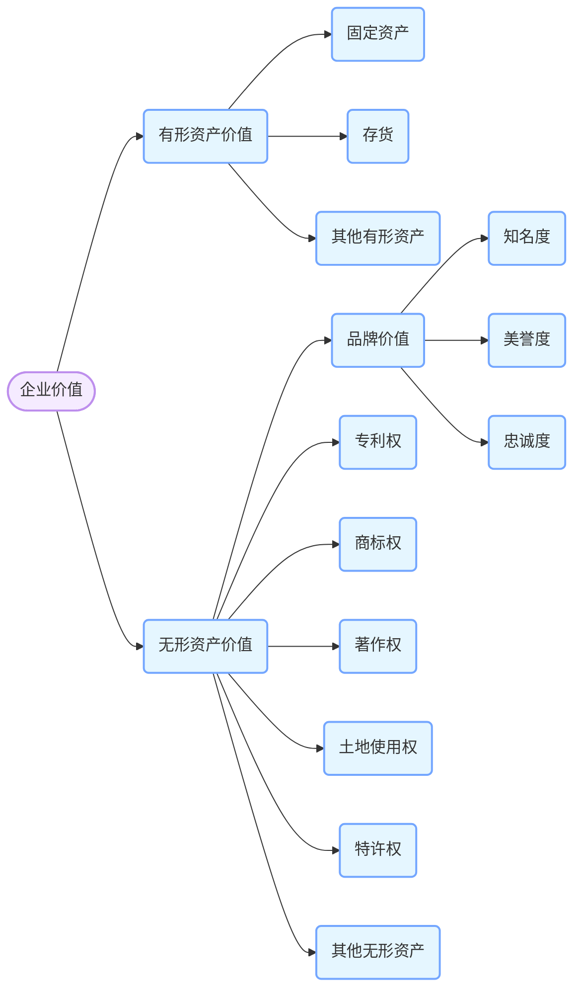

# 巴菲特的品牌价值评估：无形资产在企业价值中的重要性

> 关键词：巴菲特、品牌价值评估、无形资产、企业价值、经济商誉、价值投资

> 摘要：本文聚焦于巴菲特的品牌价值评估理念，深入探讨无形资产在企业价值中的重要性。通过对巴菲特投资思想的剖析，阐述品牌等无形资产如何影响企业的长期竞争力和财务表现。详细介绍品牌价值评估的核心概念、相关算法原理以及数学模型，结合实际案例展示无形资产在企业中的关键作用。同时，提供学习资源、开发工具以及相关论文著作推荐，最后对无形资产在企业价值评估领域的未来发展趋势与挑战进行总结，并解答常见问题，为读者全面呈现无形资产与企业价值的紧密联系。

## 1. 背景介绍 
### 1.1 目的和范围
本文章的目的在于深入研究巴菲特的品牌价值评估方法，以及无形资产在企业价值评估体系中的重要性。我们将探讨巴菲特的投资哲学中如何重视品牌等无形资产，以及这些资产如何在企业的长期发展中创造价值。范围涵盖品牌价值评估的基本概念、核心算法、数学模型、实际案例分析，以及相关的学习资源和未来发展趋势等方面，旨在为投资者、企业管理者和对价值评估感兴趣的读者提供全面而深入的理解。

### 1.2 预期读者
本文预期读者包括但不限于专业投资者、企业管理者、财务分析师、经济学研究者以及对价值投资和企业价值评估感兴趣的广大读者。无论是希望从巴菲特的投资理念中汲取经验的投资者，还是需要了解无形资产对企业价值影响的企业管理者，都能从本文中获得有价值的信息和启示。

### 1.3 文档结构概述
本文将按照以下结构展开：首先介绍背景信息，包括目的、预期读者和文档结构概述等内容；接着阐述核心概念与联系，包括品牌价值、无形资产、企业价值等概念的原理和相互关系，并通过文本示意图和 Mermaid 流程图进行展示；然后详细讲解核心算法原理和具体操作步骤，使用 Python 源代码进行说明；再介绍数学模型和公式，并通过举例进行详细讲解；之后通过项目实战展示代码实际案例和详细解释；接着探讨无形资产在企业中的实际应用场景；随后推荐相关的学习资源、开发工具和论文著作；最后总结未来发展趋势与挑战，解答常见问题，并提供扩展阅读和参考资料。

### 1.4 术语表
#### 1.4.1 核心术语定义
- **品牌价值**：品牌所具有的经济价值，它反映了消费者对品牌的认知、信任和忠诚度，以及品牌在市场中所占据的地位和影响力。
- **无形资产**：企业拥有或控制的没有实物形态的可辨认非货币性资产，包括专利权、商标权、著作权、土地使用权、特许权、品牌等。
- **企业价值**：企业整体的经济价值，是企业未来预期现金流量的现值，包括有形资产价值和无形资产价值。
- **经济商誉**：巴菲特提出的概念，指企业由于品牌、声誉、客户关系等因素而获得的超过有形资产正常盈利水平的那部分价值。

#### 1.4.2 相关概念解释
- **价值投资**：一种投资策略，强调通过分析企业的基本面，寻找被低估的股票进行投资，以获得长期的资本增值。巴菲特是价值投资的代表人物，他非常重视企业的内在价值，尤其是无形资产所带来的价值。
- **护城河**：巴菲特用来形容企业竞争优势的概念，指企业能够抵御竞争对手的攻击，保持长期盈利的能力。品牌是企业护城河的重要组成部分，强大的品牌可以帮助企业吸引客户、提高市场份额、获得更高的利润。

#### 1.4.3 缩略词列表
- **DCF**：Discounted Cash Flow，贴现现金流，一种用于评估企业价值的方法，通过预测企业未来的现金流量并折现到当前来计算企业的价值。

## 2. 核心概念与联系 

### 核心概念原理

#### 品牌价值
品牌价值是品牌在市场中所具有的经济价值，它是由品牌的知名度、美誉度、忠诚度等因素共同决定的。一个强大的品牌可以吸引消费者购买其产品或服务，提高市场份额，从而为企业带来更高的利润。品牌价值的形成需要长期的投入和积累，包括广告宣传、产品质量控制、客户服务等方面。

#### 无形资产
无形资产是企业拥有或控制的没有实物形态的可辨认非货币性资产。无形资产虽然没有实物形态，但它们对企业的价值创造具有重要作用。例如，专利权可以保护企业的技术创新，商标权可以保护企业的品牌形象，著作权可以保护企业的文学、艺术和科学作品，土地使用权可以为企业提供生产经营的场所，特许权可以为企业带来特定的经营权利，品牌可以为企业带来客户和市场份额。

#### 企业价值
企业价值是企业整体的经济价值，它是企业未来预期现金流量的现值。企业价值包括有形资产价值和无形资产价值。有形资产是指企业拥有或控制的具有实物形态的资产，如固定资产、存货等。无形资产是指企业拥有或控制的没有实物形态的可辨认非货币性资产，如品牌、专利、商标等。无形资产在企业价值中所占的比重越来越大，尤其是在一些高科技企业和服务型企业中，无形资产的价值甚至超过了有形资产的价值。

### 架构的文本示意图

```plaintext
企业价值
├── 有形资产价值
│   ├── 固定资产
│   ├── 存货
│   └── 其他有形资产
└── 无形资产价值
    ├── 品牌价值
    │   ├── 知名度
    │   ├── 美誉度
    │   └── 忠诚度
    ├── 专利权
    ├── 商标权
    ├── 著作权
    ├── 土地使用权
    ├── 特许权
    └── 其他无形资产
```

### Mermaid 流程图



## 3. 核心算法原理 & 具体操作步骤 

### 品牌价值评估的核心算法原理

品牌价值评估的方法有很多种，其中比较常用的方法是基于市场法、收益法和成本法。这里我们主要介绍基于收益法的品牌价值评估方法，该方法的核心思想是通过预测品牌未来的收益，并将其折现到当前来计算品牌的价值。

#### 收益法的基本原理
收益法是一种基于未来收益的评估方法，它认为资产的价值等于其未来预期收益的现值。在品牌价值评估中，我们可以将品牌看作是一种能够为企业带来未来收益的资产，通过预测品牌未来的收益，并将其折现到当前来计算品牌的价值。

#### 具体步骤
1. **预测品牌未来的收益**：首先需要预测品牌在未来一定时期内的收益。这可以通过分析品牌的历史销售数据、市场份额、竞争环境等因素来进行预测。
2. **确定折现率**：折现率是将未来收益折现到当前的比率，它反映了资金的时间价值和风险程度。折现率的确定需要考虑市场利率、行业风险、企业风险等因素。
3. **计算品牌价值**：将预测的品牌未来收益按照折现率折现到当前，得到品牌的价值。

### Python 源代码实现

```python
import numpy as np

def brand_value_evaluation(future_earnings, discount_rate, years):
    """
    基于收益法的品牌价值评估函数

    参数:
    future_earnings (list): 品牌未来每年的收益列表
    discount_rate (float): 折现率
    years (int): 预测的年数

    返回:
    float: 品牌的价值
    """
    brand_value = 0
    for i in range(years):
        discounted_earning = future_earnings[i] / (1 + discount_rate) ** (i + 1)
        brand_value += discounted_earning
    return brand_value

# 示例数据
future_earnings = [100, 120, 140, 160, 180]  # 品牌未来5年的收益
discount_rate = 0.1  # 折现率为10%
years = 5  # 预测的年数为5年

# 计算品牌价值
brand_value = brand_value_evaluation(future_earnings, discount_rate, years)
print(f"品牌的价值为: {brand_value}")
```

### 代码解释
1. **函数定义**：`brand_value_evaluation` 函数接受三个参数：`future_earnings` 表示品牌未来每年的收益列表，`discount_rate` 表示折现率，`years` 表示预测的年数。
2. **计算品牌价值**：在函数内部，我们使用一个循环遍历未来的每一年，将每年的收益按照折现率折现到当前，并累加到 `brand_value` 中。
3. **返回结果**：最后返回计算得到的品牌价值。

## 4. 数学模型和公式 & 详细讲解 & 举例说明 

### 数学模型和公式

基于收益法的品牌价值评估的数学模型可以用以下公式表示：

$$
V = \sum_{i=1}^{n} \frac{E_i}{(1 + r)^i}
$$

其中：
- $V$ 表示品牌的价值
- $E_i$ 表示品牌在第 $i$ 年的预期收益
- $r$ 表示折现率
- $n$ 表示预测的年数

### 详细讲解

这个公式的核心思想是将品牌未来每年的预期收益按照折现率折现到当前，然后将这些折现后的收益相加，得到品牌的价值。折现率 $r$ 反映了资金的时间价值和风险程度，它越高，说明未来收益的现值越低。预测的年数 $n$ 越长，说明我们对品牌未来收益的预测越远，但同时也增加了预测的不确定性。

### 举例说明

假设某品牌未来 3 年的预期收益分别为 100 万元、120 万元和 140 万元，折现率为 10%。我们可以使用上述公式计算该品牌的价值：

- 第 1 年的预期收益折现到当前的价值为：$\frac{100}{(1 + 0.1)^1} = \frac{100}{1.1} \approx 90.91$（万元）
- 第 2 年的预期收益折现到当前的价值为：$\frac{120}{(1 + 0.1)^2} = \frac{120}{1.21} \approx 99.17$（万元）
- 第 3 年的预期收益折现到当前的价值为：$\frac{140}{(1 + 0.1)^3} = \frac{140}{1.331} \approx 105.18$（万元）

将这三年的折现后的收益相加，得到该品牌的价值为：$90.91 + 99.17 + 105.18 = 295.26$（万元）

## 5. 项目实战：代码实际案例和详细解释说明 

### 5.1  开发环境搭建
- **Python 环境**：确保你已经安装了 Python 3.x 版本。你可以从 Python 官方网站（https://www.python.org/downloads/） 下载并安装最新版本的 Python。
- **开发工具**：推荐使用 PyCharm 或 Jupyter Notebook 作为开发工具。PyCharm 是一款功能强大的 Python 集成开发环境，提供了代码编辑、调试、运行等功能。Jupyter Notebook 是一个交互式的开发环境，适合进行数据探索和代码演示。

### 5.2  源代码详细实现和代码解读

```python
import numpy as np
import pandas as pd
import matplotlib.pyplot as plt

# 读取品牌历史销售数据
data = pd.read_csv('brand_sales_data.csv')

# 提取销售数据
sales_data = data['sales'].values

# 预测未来 5 年的收益
def predict_future_earnings(sales_data, growth_rate, years):
    """
    预测品牌未来的收益

    参数:
    sales_data (array): 品牌历史销售数据
    growth_rate (float): 销售增长率
    years (int): 预测的年数

    返回:
    array: 品牌未来每年的收益
    """
    last_sales = sales_data[-1]
    future_earnings = []
    for i in range(years):
        next_sales = last_sales * (1 + growth_rate)
        future_earnings.append(next_sales)
        last_sales = next_sales
    return np.array(future_earnings)

# 计算品牌价值
def brand_value_evaluation(future_earnings, discount_rate, years):
    """
    基于收益法的品牌价值评估函数

    参数:
    future_earnings (array): 品牌未来每年的收益
    discount_rate (float): 折现率
    years (int): 预测的年数

    返回:
    float: 品牌的价值
    """
    brand_value = 0
    for i in range(years):
        discounted_earning = future_earnings[i] / (1 + discount_rate) ** (i + 1)
        brand_value += discounted_earning
    return brand_value

# 假设销售增长率为 10%，折现率为 15%，预测 5 年的收益
growth_rate = 0.1
discount_rate = 0.15
years = 5

# 预测未来 5 年的收益
future_earnings = predict_future_earnings(sales_data, growth_rate, years)

# 计算品牌价值
brand_value = brand_value_evaluation(future_earnings, discount_rate, years)
print(f"品牌的价值为: {brand_value}")

# 绘制历史销售数据和未来预测收益曲线
plt.plot(range(len(sales_data)), sales_data, label='Historical Sales')
plt.plot(range(len(sales_data), len(sales_data) + years), future_earnings, label='Future Earnings')
plt.xlabel('Year')
plt.ylabel('Sales')
plt.title('Brand Sales Data and Future Earnings Prediction')
plt.legend()
plt.show()
```

### 5.3  代码解读与分析

1. **数据读取**：使用 `pandas` 库读取品牌历史销售数据文件 `brand_sales_data.csv`，并提取销售数据。
2. **预测未来收益**：定义 `predict_future_earnings` 函数，根据历史销售数据和销售增长率预测未来 5 年的收益。
3. **计算品牌价值**：定义 `brand_value_evaluation` 函数，使用收益法计算品牌的价值。
4. **绘制曲线**：使用 `matplotlib` 库绘制历史销售数据和未来预测收益曲线，直观展示品牌的销售趋势。

通过这个项目实战，我们可以看到如何使用 Python 实现品牌价值评估，并通过可视化工具展示品牌的销售趋势。

## 6. 实际应用场景 

### 企业并购
在企业并购中，品牌价值评估是非常重要的环节。收购方需要了解被收购企业的品牌价值，以便确定合理的收购价格。一个强大的品牌可以为收购方带来客户、市场份额和利润，从而提高收购的价值。例如，可口可乐公司在收购其他饮料品牌时，会对目标品牌的价值进行评估，以确保收购的合理性和可行性。

### 品牌授权
品牌授权是企业利用品牌价值获取收益的一种方式。品牌所有者可以将品牌授权给其他企业使用，收取授权费用。在品牌授权过程中，需要对品牌价值进行评估，以确定合理的授权费用。例如，迪士尼公司将其卡通形象授权给玩具制造商、服装制造商等企业使用，通过品牌授权获得了丰厚的收益。

### 企业融资
在企业融资过程中，品牌价值可以作为企业的重要资产，为企业提供融资支持。银行等金融机构在评估企业的信用风险时，会考虑企业的品牌价值。一个强大的品牌可以提高企业的信用评级，降低融资成本。例如，苹果公司凭借其强大的品牌价值，在融资市场上具有较高的信用评级，能够以较低的成本获得融资。

### 企业战略决策
品牌价值评估可以为企业的战略决策提供重要依据。企业可以根据品牌价值的变化情况，调整品牌战略，加强品牌建设，提高品牌价值。例如，当企业发现品牌价值下降时，可以通过加大广告宣传、提高产品质量、改善客户服务等方式来提升品牌价值。

## 7. 工具和资源推荐
### 7.1 学习资源推荐
#### 7.1.1 书籍推荐
- 《巴菲特致股东的信：投资者和公司高管教程》：这本书收录了巴菲特历年致股东的信，通过这些信件，我们可以深入了解巴菲特的投资理念和方法，包括他对品牌价值和无形资产的重视。
- 《价值投资：从格雷厄姆到巴菲特》：本书系统地介绍了价值投资的理论和方法，从格雷厄姆的基本面分析到巴菲特的长期投资策略，对品牌价值评估和无形资产在企业价值中的作用有深入的探讨。
- 《品牌洗脑：世界著名品牌只做不说的营销秘密》：这本书揭示了品牌营销的秘密，帮助读者了解品牌是如何影响消费者的认知和行为的，从而更好地理解品牌价值的形成机制。

#### 7.1.2 在线课程
- Coursera 平台上的《Financial Markets》：该课程由耶鲁大学教授罗伯特·席勒（Robert Shiller）主讲，涵盖了金融市场的各个方面，包括企业价值评估、投资策略等内容，对品牌价值评估有一定的涉及。
- edX 平台上的《Valuation: Measuring and Managing the Value of Companies》：这门课程由麦肯锡公司的专家主讲，系统地介绍了企业价值评估的方法和技巧，对无形资产的评估有详细的讲解。

#### 7.1.3 技术博客和网站
- Seeking Alpha：这是一个知名的金融投资网站，提供大量的股票分析、投资策略和企业价值评估的文章，其中不乏关于品牌价值和无形资产的研究和讨论。
- Brand Finance：该网站专注于品牌价值评估，定期发布全球品牌价值排行榜，提供品牌价值评估的方法和案例分析。

### 7.2 开发工具框架推荐
#### 7.2.1 IDE和编辑器
- PyCharm：一款功能强大的 Python 集成开发环境，提供了代码编辑、调试、运行等功能，适合进行品牌价值评估相关的 Python 代码开发。
- Jupyter Notebook：一个交互式的开发环境，适合进行数据探索和代码演示，方便对品牌销售数据进行分析和可视化。

#### 7.2.2 调试和性能分析工具
- Py-Spy：一个轻量级的 Python 性能分析工具，可以帮助我们分析 Python 代码的性能瓶颈，优化品牌价值评估算法的性能。
- PDB：Python 自带的调试工具，可以帮助我们调试 Python 代码，查找和解决代码中的问题。

#### 7.2.3 相关框架和库
- Pandas：一个强大的数据处理和分析库，提供了数据读取、清洗、转换等功能，适合处理品牌销售数据。
- Numpy：一个用于科学计算的 Python 库，提供了高效的数组操作和数学函数，适合进行品牌价值评估算法的实现。
- Matplotlib：一个用于数据可视化的 Python 库，提供了丰富的绘图功能，适合绘制品牌销售数据和未来预测收益曲线。

### 7.3 相关论文著作推荐
#### 7.3.1 经典论文
- "The Theory of Rational Option Pricing" by Fischer Black and Myron Scholes：这篇论文提出了著名的布莱克 - 斯科尔斯期权定价模型，对金融资产的定价理论有重要贡献，也为品牌价值评估提供了一定的理论基础。
- "The Capital Asset Pricing Model: Theory and Evidence" by Eugene F. Fama and Kenneth R. French：该论文对资本资产定价模型进行了深入的研究和探讨，对企业价值评估和投资决策有重要的指导意义。

#### 7.3.2 最新研究成果
- "Brand Value and Firm Performance: A Meta - analysis" by [Author Name]：这篇论文通过元分析的方法，对品牌价值与企业绩效之间的关系进行了系统的研究，为品牌价值评估提供了新的视角和方法。
- "Intangible Assets and Corporate Valuation: A Review of the Literature" by [Author Name]：该论文对无形资产在企业价值评估中的作用进行了全面的综述，总结了最新的研究成果和发展趋势。

#### 7.3.3 应用案例分析
- "Case Study: The Valuation of Apple's Brand" by [Author Name]：这篇案例分析文章详细介绍了苹果公司品牌价值的评估过程和方法，为我们提供了一个实际的应用案例。
- "Brand Valuation in the Context of Mergers and Acquisitions: A Case Study of the [Company Name] Acquisition" by [Author Name]：该案例分析文章探讨了在企业并购背景下品牌价值评估的方法和应用，对企业并购决策有重要的参考价值。

## 8. 总结：未来发展趋势与挑战

### 未来发展趋势

#### 数字化转型推动品牌价值评估的创新
随着数字化时代的到来，企业的品牌传播和营销方式发生了巨大的变化。社交媒体、电子商务等数字化渠道的兴起，为品牌价值评估带来了新的机遇和挑战。未来，品牌价值评估将更加注重数字化指标的分析，如社交媒体关注度、在线销售数据等，以更准确地反映品牌的市场影响力和价值。

#### 无形资产在企业价值中的比重不断增加
随着科技的不断进步和知识经济的发展，无形资产在企业价值中的比重将不断增加。尤其是在高科技企业和服务型企业中，品牌、专利、技术等无形资产将成为企业核心竞争力的重要组成部分。因此，未来的企业价值评估将更加重视无形资产的评估，品牌价值评估也将变得更加重要。

#### 跨学科融合的趋势加强
品牌价值评估涉及到经济学、管理学、市场营销学、统计学等多个学科领域。未来，品牌价值评估将更加注重跨学科的融合，综合运用不同学科的理论和方法，提高品牌价值评估的准确性和可靠性。

### 挑战

#### 数据质量和可靠性问题
品牌价值评估需要大量的数据支持，包括品牌销售数据、市场份额数据、消费者调查数据等。然而，这些数据的质量和可靠性往往存在问题，如数据不准确、不完整、过时等。这些问题将影响品牌价值评估的准确性和可靠性。

#### 评估方法的局限性
目前，品牌价值评估的方法有很多种，但每种方法都有其局限性。例如，基于收益法的评估方法需要对未来收益进行预测，而未来收益的预测往往存在很大的不确定性；基于市场法的评估方法需要有可比的市场交易案例，但在实际应用中，很难找到完全可比的案例。因此，如何选择合适的评估方法，提高评估结果的准确性和可靠性，是品牌价值评估面临的一个重要挑战。

#### 无形资产的复杂性
无形资产具有无形性、不确定性、难以计量等特点，这使得无形资产的评估比有形资产的评估更加复杂。例如，品牌的价值不仅取决于品牌的知名度、美誉度、忠诚度等因素，还受到市场竞争、消费者偏好、技术创新等多种因素的影响。因此，如何准确地评估无形资产的价值，是品牌价值评估面临的另一个重要挑战。

## 9. 附录：常见问题与解答

### 1. 品牌价值评估的结果是否准确？
品牌价值评估的结果是基于一定的假设和方法得出的，具有一定的主观性和不确定性。因此，品牌价值评估的结果并不是绝对准确的，只能作为参考。在实际应用中，需要结合其他因素进行综合分析和判断。

### 2. 品牌价值评估的方法有哪些？
品牌价值评估的方法主要有市场法、收益法和成本法。市场法是通过比较类似品牌的市场交易价格来评估品牌的价值；收益法是通过预测品牌未来的收益，并将其折现到当前来计算品牌的价值；成本法是通过计算创建品牌所需的成本来评估品牌的价值。

### 3. 无形资产包括哪些内容？
无形资产包括专利权、商标权、著作权、土地使用权、特许权、品牌等。这些资产虽然没有实物形态，但它们对企业的价值创造具有重要作用。

### 4. 品牌价值和企业价值有什么关系？
品牌价值是企业价值的重要组成部分。一个强大的品牌可以为企业带来客户、市场份额和利润，从而提高企业的价值。因此，品牌价值的提升有助于企业价值的提升。

### 5. 如何提高品牌价值？
提高品牌价值可以从以下几个方面入手：加强品牌建设，提高品牌的知名度、美誉度和忠诚度；提高产品质量和服务水平，满足消费者的需求；加强品牌传播和营销，提高品牌的市场影响力；不断创新，推出符合市场需求的新产品和新服务。

## 10. 扩展阅读 & 参考资料

### 扩展阅读
- 《竞争战略》：这本书由迈克尔·波特（Michael Porter）所著，深入探讨了企业的竞争战略，对理解品牌在市场竞争中的作用有很大的帮助。
- 《定位》：作者是艾·里斯（Al Ries）和杰克·特劳特（Jack Trout），介绍了品牌定位的理论和方法，对品牌建设和品牌价值提升有重要的指导意义。

### 参考资料
- 《Financial Management and Analysis》：这本书提供了企业财务管理和分析的基本理论和方法，对品牌价值评估和企业价值评估有一定的参考价值。
- 相关财经媒体和研究机构发布的报告和文章，如《金融时报》、《华尔街日报》、麦肯锡公司的研究报告等，这些资料可以提供最新的市场信息和研究成果。