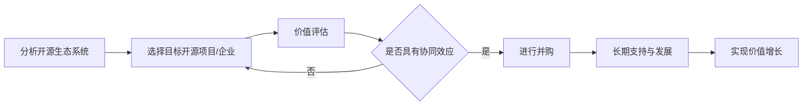

# 巴菲特的并购策略在开源生态系统中的新思路

> 关键词：巴菲特并购策略、开源生态系统、企业并购、开源项目、协同效应

> 摘要：本文旨在探讨巴菲特的并购策略在开源生态系统中的新思路。首先介绍了巴菲特并购策略的核心要点和开源生态系统的基本概念与特点。接着分析了将巴菲特并购策略应用于开源生态系统的可行性和独特挑战。通过深入探讨在开源环境下的价值评估、协同效应实现等方面，提出了一系列创新的思路和方法。结合实际案例详细阐述如何在开源生态系统中运用这些新思路。最后对未来的发展趋势进行了展望，并指出可能面临的挑战。

## 1. 背景介绍 
### 1.1 目的和范围
本研究的目的是探索如何将巴菲特成功的并购策略应用到开源生态系统中，为开源项目的发展和相关企业的并购决策提供新的思路和方法。范围涵盖了巴菲特并购策略的主要原则，开源生态系统的各个方面，包括开源项目的特点、开源社区的运作模式等，以及两者结合的具体应用场景和实践案例。

### 1.2 预期读者
本文预期读者包括对开源生态系统和企业并购感兴趣的投资者、开源项目的开发者和维护者、开源相关企业的管理者、研究企业战略和开源经济的学者等。

### 1.3 文档结构概述
本文首先介绍相关背景知识，包括巴菲特并购策略和开源生态系统的基本概念。然后分析核心概念及其联系，阐述将巴菲特并购策略应用于开源生态系统的原理和架构。接着详细讲解核心算法原理和具体操作步骤，给出数学模型和公式。通过项目实战展示实际案例和代码实现。探讨实际应用场景，推荐相关工具和资源。最后总结未来发展趋势与挑战，解答常见问题并提供扩展阅读和参考资料。

### 1.4 术语表
#### 1.4.1 核心术语定义
- **巴菲特并购策略**：指巴菲特在长期的投资和企业并购活动中形成的一套具有独特理念和方法的策略，强调价值投资、寻找优质企业、注重协同效应等。
- **开源生态系统**：由开源软件、开源项目、开发者社区、用户群体、相关企业等组成的一个相互关联、相互影响的生态系统。
- **开源项目**：指源代码公开，遵循特定开源许可证，允许用户自由使用、修改和分发的软件项目。

#### 1.4.2 相关概念解释
- **协同效应**：指两个或多个事物结合在一起产生的效果大于它们单独作用的效果之和。在并购中，协同效应可以体现在业务、技术、市场等多个方面。
- **价值投资**：一种投资理念，强调通过分析企业的基本面，寻找被低估的具有长期投资价值的企业进行投资。

#### 1.4.3 缩略词列表
- **FOSS**：Free and Open - Source Software，自由和开源软件。

## 2. 核心概念与联系 

### 2.1 巴菲特并购策略核心要点
巴菲特的并购策略基于价值投资理念，主要包括以下几个核心要点：
1. **寻找优质企业**：注重企业的长期竞争优势，如品牌、技术、管理团队等。
2. **合理估值**：通过对企业财务状况、未来现金流等进行分析，确定企业的合理价值。
3. **协同效应**：在并购中寻找能够与现有业务产生协同效应的目标企业，实现资源共享和优势互补。
4. **长期持有**：一旦投资，倾向于长期持有目标企业，分享企业的长期成长。

### 2.2 开源生态系统特点
开源生态系统具有以下特点：
1. **开放性**：源代码公开，任何人都可以参与项目的开发和改进。
2. **社区驱动**：由开发者社区共同维护和发展项目，社区成员的贡献和参与度对项目的成功至关重要。
3. **快速迭代**：由于众多开发者的参与，开源项目能够快速响应市场需求，进行功能更新和修复。
4. **多元化**：开源生态系统涵盖了各种不同类型的软件项目，从操作系统到应用程序，涉及多个领域。

### 2.3 两者联系的原理和架构
将巴菲特并购策略应用于开源生态系统的原理在于，虽然开源生态系统与传统企业有很大不同，但其中的开源项目和相关企业也具有自身的价值和发展潜力。可以借鉴巴菲特的价值投资理念，对开源项目和企业进行评估和选择。

架构上，首先需要建立一套适合开源生态系统的价值评估体系，考虑开源项目的技术创新性、社区活跃度、用户基础等因素。然后在并购过程中，注重寻找能够与现有开源业务或企业产生协同效应的目标。最后，通过长期的投入和支持，促进开源项目的发展，实现价值的增长。

以下是一个Mermaid流程图展示这个过程：


## 3. 核心算法原理 & 具体操作步骤 

### 3.1 核心算法原理
在开源生态系统中，对开源项目和相关企业的价值评估是关键。我们可以采用一种综合评估算法，结合多个因素来确定其价值。以下是一个简化的Python示例：

```python
class OpenSourceValueEvaluator:
    def __init__(self, technical_innovation, community_activity, user_base, market_potential):
        self.technical_innovation = technical_innovation
        self.community_activity = community_activity
        self.user_base = user_base
        self.market_potential = market_potential

    def calculate_value(self):
        # 这里假设每个因素有不同的权重
        weight_tech = 0.3
        weight_community = 0.2
        weight_user = 0.3
        weight_market = 0.2

        value = (self.technical_innovation * weight_tech +
                 self.community_activity * weight_community +
                 self.user_base * weight_user +
                 self.market_potential * weight_market)
        return value
```

### 3.2 具体操作步骤
1. **分析开源生态系统**：了解当前开源生态系统的整体情况，包括不同领域的热门开源项目、活跃的开发者社区等。
2. **选择目标开源项目/企业**：根据自身的战略需求和发展方向，筛选出潜在的目标开源项目或相关企业。
3. **收集数据**：针对每个目标，收集关于技术创新性、社区活跃度、用户基础、市场潜力等方面的数据。
4. **价值评估**：使用上述算法对目标进行价值评估，确定其合理价值。
5. **协同效应分析**：分析目标与现有业务或企业之间是否存在协同效应，如技术互补、市场拓展等。
6. **决策与并购**：根据价值评估和协同效应分析结果，做出是否进行并购的决策。如果决定并购，进行相关的谈判和交易。
7. **长期支持与发展**：并购完成后，对开源项目或企业提供长期的支持和资源投入，促进其发展和价值增长。

## 4. 数学模型和公式 & 详细讲解 & 举例说明 

### 4.1 数学模型和公式
设开源项目或企业的价值为 $V$，技术创新性为 $T$，社区活跃度为 $C$，用户基础为 $U$，市场潜力为 $M$，各因素的权重分别为 $w_T$，$w_C$，$w_U$，$w_M$，且 $w_T + w_C + w_U + w_M = 1$。则价值计算公式为：

$$V = w_TT + w_CC + w_UU + w_MM$$

### 4.2 详细讲解
- **技术创新性 ($T$)**：反映了开源项目在技术上的领先程度和创新能力。可以通过技术专利数量、技术架构的先进性、新功能的推出频率等指标来衡量。
- **社区活跃度 ($C$)**：体现了开发者社区的参与度和贡献度。可以用代码提交数量、社区论坛的活跃度、开发者的数量和质量等指标来衡量。
- **用户基础 ($U$)**：表示开源项目的用户数量和用户忠诚度。可以通过下载量、用户反馈数量、用户留存率等指标来衡量。
- **市场潜力 ($M$)**：预测开源项目在未来市场中的发展前景。可以考虑市场规模、竞争态势、行业趋势等因素。

### 4.3 举例说明
假设一个开源项目的技术创新性评分为 8 分，社区活跃度评分为 7 分，用户基础评分为 6 分，市场潜力评分为 7 分，各因素权重分别为 $w_T = 0.3$，$w_C = 0.2$，$w_U = 0.3$，$w_M = 0.2$。则该项目的价值为：

$$V = 0.3\times8 + 0.2\times7 + 0.3\times6 + 0.2\times7$$
$$V = 2.4 + 1.4 + 1.8 + 1.4$$
$$V = 7$$

## 5. 项目实战：代码实际案例和详细解释说明 

### 5.1  开发环境搭建
为了实现上述的价值评估算法，我们可以使用Python语言进行开发。开发环境搭建步骤如下：
1. **安装Python**：从Python官方网站（https://www.python.org/downloads/）下载并安装Python 3.x版本。
2. **选择开发工具**：可以使用PyCharm、VS Code等集成开发环境（IDE），也可以使用简单的文本编辑器如Sublime Text。

### 5.2  源代码详细实现和代码解读
以下是一个完整的Python代码示例，包含了价值评估类的实现和使用示例：

```python
class OpenSourceValueEvaluator:
    def __init__(self, technical_innovation, community_activity, user_base, market_potential):
        """
        初始化开源项目或企业的各项评估因素
        :param technical_innovation: 技术创新性评分
        :param community_activity: 社区活跃度评分
        :param user_base: 用户基础评分
        :param market_potential: 市场潜力评分
        """
        self.technical_innovation = technical_innovation
        self.community_activity = community_activity
        self.user_base = user_base
        self.market_potential = market_potential

    def calculate_value(self):
        """
        计算开源项目或企业的价值
        :return: 价值得分
        """
        # 这里假设每个因素有不同的权重
        weight_tech = 0.3
        weight_community = 0.2
        weight_user = 0.3
        weight_market = 0.2

        value = (self.technical_innovation * weight_tech +
                 self.community_activity * weight_community +
                 self.user_base * weight_user +
                 self.market_potential * weight_market)
        return value

# 使用示例
if __name__ == "__main__":
    # 假设某开源项目的各项评分
    tech_score = 8
    community_score = 7
    user_score = 6
    market_score = 7

    evaluator = OpenSourceValueEvaluator(tech_score, community_score, user_score, market_score)
    value = evaluator.calculate_value()
    print(f"该开源项目的价值为: {value}")
```

### 5.3  代码解读与分析
- **类的定义**：`OpenSourceValueEvaluator` 类用于封装开源项目或企业的各项评估因素，并提供计算价值的方法。
- **`__init__` 方法**：用于初始化技术创新性、社区活跃度、用户基础和市场潜力等评估因素。
- **`calculate_value` 方法**：根据各因素的权重计算开源项目或企业的价值。
- **使用示例**：创建一个 `OpenSourceValueEvaluator` 实例，传入各项评分，调用 `calculate_value` 方法计算价值并输出结果。

## 6. 实际应用场景 
### 6.1 企业并购开源项目
企业可以通过并购有潜力的开源项目来增强自身的技术实力和市场竞争力。例如，谷歌收购了Android开源项目，通过对其进行进一步的开发和推广，使其成为全球最流行的移动操作系统之一。在这个过程中，谷歌运用了类似巴菲特并购策略的思路，评估了Android项目的技术创新性、社区活跃度和市场潜力，认为其具有巨大的发展前景，通过并购实现了与自身业务的协同发展。

### 6.2 开源基金会整合项目
开源基金会可以通过整合不同的开源项目，实现资源共享和协同发展。例如，Linux基金会通过整合多个Linux相关的开源项目，促进了Linux生态系统的发展。在整合过程中，基金会可以借鉴巴菲特的协同效应理念，选择那些能够相互补充、共同发展的项目进行整合。

### 6.3 风险投资支持开源创业
风险投资机构可以运用巴菲特的价值投资理念，对开源创业项目进行评估和投资。通过关注项目的技术创新性、社区活跃度和市场潜力，选择有潜力的项目进行投资，支持其发展壮大。例如，红帽公司在早期获得了风险投资的支持，通过不断发展和壮大，成为了开源领域的知名企业。

## 7. 工具和资源推荐
### 7.1 学习资源推荐
#### 7.1.1 书籍推荐
- 《巴菲特致股东的信：投资者和公司高管教程》：深入了解巴菲特的投资理念和并购策略。
- 《开源软件时代》：介绍开源软件的发展历程、技术原理和商业模式。
- 《代码大全》：提供软件开发的最佳实践和技术指导，对于理解开源项目的开发和维护有很大帮助。

#### 7.1.2 在线课程
- Coursera上的“投资学原理”：讲解投资的基本原理和方法，包括价值投资理念。
- edX上的“开源软件基础”：介绍开源软件的概念、技术和社区管理。

#### 7.1.3 技术博客和网站
- Hacker News：关注科技领域的最新动态和开源项目的发展。
- GitHub Blog：提供关于开源项目开发和管理的最新资讯和技术文章。

### 7.2 开发工具框架推荐
#### 7.2.1 IDE和编辑器
- PyCharm：专业的Python集成开发环境，提供丰富的代码编辑、调试和版本控制功能。
- VS Code：轻量级的代码编辑器，支持多种编程语言和插件扩展。

#### 7.2.2 调试和性能分析工具
- PDB：Python内置的调试工具，用于调试Python代码。
- cProfile：Python的性能分析工具，用于分析代码的性能瓶颈。

#### 7.2.3 相关框架和库
- NumPy：用于科学计算的Python库，提供高效的数组操作和数学函数。
- Pandas：用于数据处理和分析的Python库，方便对开源项目的相关数据进行处理和分析。

### 7.3 相关论文著作推荐
#### 7.3.1 经典论文
- “The Cathedral and the Bazaar”：阐述了开源软件开发的两种模式，对理解开源生态系统有重要意义。
- “Open Source Software Development: Principles and Practice”：系统地介绍了开源软件开发的原理和实践。

#### 7.3.2 最新研究成果
可以通过IEEE Xplore、ACM Digital Library等学术数据库搜索关于开源生态系统和企业并购的最新研究论文。

#### 7.3.3 应用案例分析
- 分析谷歌收购Android、红帽公司的发展历程等实际案例的相关研究报告和论文，了解巴菲特并购策略在开源生态系统中的具体应用。

## 8. 总结：未来发展趋势与挑战
### 8.1 未来发展趋势
- **开源与商业的融合加深**：越来越多的企业将通过并购开源项目或与开源社区合作，实现商业利益和开源价值的双赢。
- **开源生态系统的全球化**：随着互联网的发展，开源生态系统将更加全球化，不同地区的开发者和企业将更加紧密地合作。
- **人工智能和开源的结合**：人工智能技术将在开源项目的开发和管理中发挥越来越重要的作用，提高开发效率和质量。

### 8.2 挑战
- **开源许可证的复杂性**：不同的开源许可证有不同的规定和限制，在并购开源项目时需要充分了解和遵守相关许可证的要求，避免法律风险。
- **社区文化的冲突**：开源社区有自己独特的文化和价值观，企业在并购开源项目后，需要处理好与社区文化的冲突，保持社区的活力和创新能力。
- **价值评估的准确性**：由于开源项目的特殊性，其价值评估存在一定的难度，如何准确评估开源项目的价值是一个挑战。

## 9. 附录：常见问题与解答
### 9.1 如何确定开源项目的技术创新性？
可以从技术专利数量、技术架构的先进性、新功能的推出频率、与行业标准的符合程度等方面进行评估。

### 9.2 如何衡量开源社区的活跃度？
可以通过代码提交数量、社区论坛的活跃度、开发者的数量和质量、社区活动的参与度等指标来衡量。

### 9.3 企业并购开源项目后如何管理社区？
企业需要尊重开源社区的文化和价值观，保持社区的自治性和开放性。可以通过提供资源支持、参与社区讨论、鼓励开发者贡献等方式来管理社区。

### 9.4 开源许可证对并购有哪些影响？
不同的开源许可证对代码的使用、修改和分发有不同的规定，企业在并购开源项目时需要确保遵守相关许可证的要求，否则可能面临法律风险。

## 10. 扩展阅读 & 参考资料
### 10.1 扩展阅读
- 《创新者的窘境》：探讨了企业在面对技术创新时的挑战和应对策略，对于理解开源生态系统中的创新和变革有一定的启示。
- 《浪潮之巅》：介绍了科技行业的发展历程和重要企业的兴衰，有助于了解开源生态系统在科技发展中的地位和作用。

### 10.2 参考资料
- 巴菲特的官方网站和相关演讲资料。
- 各开源基金会的官方文档和报告。
- 相关学术期刊和会议论文。