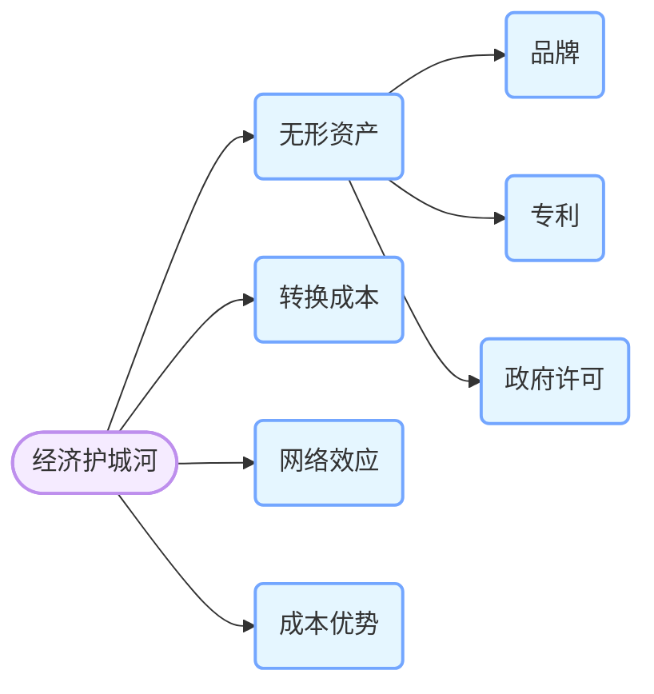

# 巴菲特的护城河理论及其实际应用

> 关键词：巴菲特、护城河理论、经济护城河、竞争优势、企业价值、实际应用、投资策略

> 摘要：本文深入探讨了巴菲特的护城河理论，旨在全面剖析该理论的核心概念、形成原理、数学模型以及实际应用场景。首先介绍了护城河理论提出的背景和预期读者，对相关术语进行了明确的定义和解释。接着详细阐述了护城河理论的核心概念，包括无形资产、转换成本、网络效应、成本优势等，并用文本示意图和 Mermaid 流程图展示其架构。在核心算法原理部分，通过 Python 源代码示例说明如何评估企业护城河。数学模型和公式部分用公式量化企业护城河与价值的关系并举例。项目实战部分搭建开发环境，给出代码案例并解读。然后探讨了护城河理论在投资决策、企业战略制定等实际应用场景。还推荐了学习资源、开发工具框架以及相关论文著作。最后总结了护城河理论的未来发展趋势与挑战，解答常见问题并提供扩展阅读与参考资料，帮助读者全面理解和运用巴菲特的护城河理论。

## 1. 背景介绍 
### 1.1 目的和范围
巴菲特的护城河理论自提出以来，在投资界和企业战略领域引起了广泛的关注和讨论。本文章的目的在于深入解析这一理论，不仅要阐述其核心概念和原理，还要探讨其在实际投资和企业经营中的应用方法和策略。范围涵盖了护城河理论的各个方面，包括其形成的原因、不同类型的护城河、如何评估企业的护城河以及如何利用该理论进行投资决策和企业战略制定等。

### 1.2 预期读者
本文预期读者包括对投资领域感兴趣的个人投资者、专业的投资分析师、金融机构从业者、企业管理者以及对商业竞争和企业战略有研究需求的学者和学生等。无论是希望通过投资实现资产增值的个人，还是致力于提升企业竞争力的管理者，都能从本文中获取关于护城河理论的深入知识和实际应用的指导。

### 1.3 文档结构概述
本文将按照以下结构进行阐述：首先介绍护城河理论的背景信息，包括目的、预期读者和术语表；接着详细讲解核心概念与联系，通过文本示意图和 Mermaid 流程图展示其架构；然后阐述核心算法原理和具体操作步骤，用 Python 代码示例说明；再介绍数学模型和公式，并举例说明；之后通过项目实战，给出代码实际案例并详细解释；探讨实际应用场景；推荐相关的工具和资源；总结未来发展趋势与挑战；解答常见问题；最后提供扩展阅读与参考资料。

### 1.4 术语表
#### 1.4.1 核心术语定义
- **经济护城河**：是指企业抵御竞争对手对其攻击的可持续竞争优势，就像中世纪城堡周围的护城河保护城堡免受外敌入侵一样，企业的经济护城河保护其长期保持较高的盈利能力和市场地位。
- **无形资产**：包括品牌、专利、政府许可等，这些资产虽然没有实物形态，但能为企业带来独特的竞争优势，例如品牌能使消费者对企业产品产生忠诚度，专利能保护企业的技术创新成果。
- **转换成本**：是指客户从现有供应商转向其他供应商时所面临的一次性成本，包括时间、金钱、精力等方面的成本，转换成本越高，客户越不容易更换供应商。
- **网络效应**：是指产品或服务的价值随着用户数量的增加而增加的现象，例如社交网络平台，用户越多，其对新用户的吸引力就越大，网络效应能帮助企业形成强大的竞争壁垒。
- **成本优势**：企业通过优化生产流程、降低原材料采购成本、提高运营效率等方式，使其产品或服务的成本低于竞争对手，从而在市场上获得价格优势。

#### 1.4.2 相关概念解释
- **可持续竞争优势**：是指企业在长期内能够保持的、优于竞争对手的优势，这种优势不是短期的、偶然的，而是基于企业的核心竞争力和独特资源形成的，能够持续为企业带来经济利益。
- **超额利润**：是指企业的利润超过行业平均利润的部分，具有经济护城河的企业通常能够获得超额利润，因为其竞争优势使其能够在市场上获得更高的定价权或更低的成本。

#### 1.4.3 缩略词列表
目前在本文中暂未涉及相关缩略词。

## 2. 核心概念与联系 
### 核心概念原理
巴菲特的护城河理论强调企业的可持续竞争优势对于其长期价值的重要性。企业的经济护城河主要由以下几种类型构成：
- **无形资产**：
    - **品牌**：强大的品牌能够使消费者对企业的产品或服务产生信任和认同感，愿意为其支付更高的价格。例如，苹果公司的品牌在全球范围内具有极高的知名度和美誉度，消费者愿意为苹果产品支付较高的溢价，这使得苹果公司能够获得较高的利润率。
    - **专利**：专利保护企业的技术创新成果，防止竞争对手模仿。制药企业通常依靠专利来保护其研发的新药，在专利有效期内，企业能够独家生产和销售该药物，从而获得高额利润。
    - **政府许可**：某些行业需要政府颁发的许可证才能经营，这限制了潜在竞争对手的进入。例如，公用事业行业，如电力、供水等，通常需要政府的特许经营权，具有政府许可的企业能够在一定区域内形成垄断或寡头垄断地位。
- **转换成本**：当客户从现有供应商转向其他供应商时，会面临各种成本。例如，企业更换办公软件需要支付软件购买费用、员工培训费用，还可能面临数据迁移的风险和成本。因此，客户通常会倾向于继续使用现有的供应商，这使得企业能够保持稳定的客户群体。
- **网络效应**：以社交网络平台为例，用户在社交网络上积累了大量的社交关系和个人数据。随着用户数量的增加，平台的价值也不断提升，新用户更愿意选择用户数量多的平台，因为这样可以与更多的人进行交流和互动。这种网络效应使得先进入市场的社交网络平台能够形成强大的竞争壁垒，后来者很难与之竞争。
- **成本优势**：企业可以通过多种方式实现成本优势。例如，沃尔玛通过大规模采购、优化物流配送系统等方式降低了商品的采购成本和运营成本，从而能够以较低的价格销售商品，吸引了大量的消费者，在零售行业占据了重要的市场地位。

### 架构的文本示意图
```plaintext
经济护城河
├── 无形资产
│   ├── 品牌
│   ├── 专利
│   └── 政府许可
├── 转换成本
├── 网络效应
└── 成本优势
```

### Mermaid 流程图


## 3. 核心算法原理 & 具体操作步骤 
### 核心算法原理
评估企业的经济护城河并没有一个固定的、精确的算法，但可以通过一些指标和方法来综合判断。以下是一种基于财务数据和定性分析的评估思路：

- **盈利能力指标**：
    - **净资产收益率（ROE）**：反映了企业运用自有资本的效率，具有经济护城河的企业通常能够长期保持较高的 ROE。计算公式为：$ROE = \frac{净利润}{净资产} \times 100\%$
    - **毛利率**：体现了企业产品或服务的盈利能力，较高的毛利率可能意味着企业具有品牌优势、成本优势或其他竞争优势。计算公式为：$毛利率 = \frac{营业收入 - 营业成本}{营业收入} \times 100\%$
- **现金流指标**：
    - **自由现金流**：是指企业在满足了所有运营和资本支出后剩余的现金流量，自由现金流充足的企业更有能力抵御竞争和经济环境的变化。计算公式为：$自由现金流 = 经营活动现金流量 - 资本支出$
- **定性分析**：
    - 分析企业的无形资产、转换成本、网络效应和成本优势等方面的情况，评估其竞争优势的可持续性。

### 具体操作步骤
以下是使用 Python 代码实现对企业护城河评估的示例，假设我们已经获取了企业的财务数据。

```python
import pandas as pd

# 定义一个函数来计算 ROE
def calculate_roe(net_income, net_assets):
    """
    计算净资产收益率（ROE）
    :param net_income: 净利润
    :param net_assets: 净资产
    :return: ROE
    """
    return (net_income / net_assets) * 100

# 定义一个函数来计算毛利率
def calculate_gross_margin(revenue, cost_of_goods_sold):
    """
    计算毛利率
    :param revenue: 营业收入
    :param cost_of_goods_sold: 营业成本
    :return: 毛利率
    """
    return ((revenue - cost_of_goods_sold) / revenue) * 100

# 示例财务数据
financial_data = {
    'net_income': 1000000,  # 净利润
    'net_assets': 5000000,  # 净资产
    'revenue': 3000000,     # 营业收入
    'cost_of_goods_sold': 1500000  # 营业成本
}

# 将数据转换为 DataFrame
df = pd.DataFrame([financial_data])

# 计算 ROE 和毛利率
df['ROE'] = df.apply(lambda row: calculate_roe(row['net_income'], row['net_assets']), axis=1)
df['gross_margin'] = df.apply(lambda row: calculate_gross_margin(row['revenue'], row['cost_of_goods_sold']), axis=1)

# 打印结果
print("ROE: {:.2f}%".format(df['ROE'][0]))
print("毛利率: {:.2f}%".format(df['gross_margin'][0]))
```

### 代码解释
1. **导入必要的库**：导入 `pandas` 库，用于数据处理和分析。
2. **定义计算函数**：定义 `calculate_roe` 函数和 `calculate_gross_margin` 函数，分别用于计算净资产收益率和毛利率。
3. **示例财务数据**：定义一个包含净利润、净资产、营业收入和营业成本的字典 `financial_data`。
4. **数据转换**：将字典转换为 `pandas` 的 `DataFrame`。
5. **计算指标**：使用 `apply` 方法调用定义的函数，计算 ROE 和毛利率，并将结果添加到 `DataFrame` 中。
6. **打印结果**：打印计算得到的 ROE 和毛利率，保留两位小数。

## 4. 数学模型和公式 & 详细讲解 & 举例说明 
### 数学模型和公式
- **企业价值模型**：根据现金流折现模型，企业的价值可以表示为未来自由现金流的现值之和。公式为：
$$V = \sum_{t=1}^{n} \frac{FCF_t}{(1 + r)^t}$$
其中，$V$ 表示企业的价值，$FCF_t$ 表示第 $t$ 期的自由现金流，$r$ 表示折现率，$n$ 表示预测期数。

- **护城河与企业价值的关系**：具有经济护城河的企业通常能够获得更高的自由现金流和更低的风险，从而提高企业的价值。可以通过调整折现率和自由现金流的预测来体现护城河的影响。例如，对于具有强大护城河的企业，可以适当降低折现率，提高自由现金流的预测值。

### 详细讲解
- **现金流折现模型**：该模型的基本思想是，企业的价值取决于其未来能够产生的现金流量。由于未来的现金流量存在不确定性，需要将其折现到当前时刻，以反映其真实的价值。折现率 $r$ 反映了投资者对资金时间价值和风险的要求，风险越高，折现率越高。
- **护城河的影响**：经济护城河能够增强企业的竞争力和稳定性，降低企业面临的风险。因此，对于具有护城河的企业，投资者可以接受较低的回报率，即降低折现率。同时，护城河能够帮助企业获得更高的市场份额和盈利能力，从而提高未来的自由现金流。

### 举例说明
假设一家企业未来 5 年的自由现金流预测如下：

| 年份 | 自由现金流（万元） |
|------|---------------------|
| 1    | 100                 |
| 2    | 120                 |
| 3    | 140                 |
| 4    | 160                 |
| 5    | 180                 |

如果该企业没有明显的经济护城河，投资者要求的折现率为 10%。则该企业的价值为：

$$V = \frac{100}{(1 + 0.1)^1} + \frac{120}{(1 + 0.1)^2} + \frac{140}{(1 + 0.1)^3} + \frac{160}{(1 + 0.1)^4} + \frac{180}{(1 + 0.1)^5}$$

```python
import numpy as np

cash_flows = np.array([100, 120, 140, 160, 180])
discount_rate = 0.1
years = np.arange(1, len(cash_flows) + 1)

value = np.sum(cash_flows / (1 + discount_rate) ** years)
print("企业价值（无护城河）: {:.2f} 万元".format(value))
```

如果该企业具有强大的经济护城河，投资者认为其风险较低，要求的折现率为 8%。则该企业的价值为：

$$V = \frac{100}{(1 + 0.08)^1} + \frac{120}{(1 + 0.08)^2} + \frac{140}{(1 + 0.08)^3} + \frac{160}{(1 + 0.08)^4} + \frac{180}{(1 + 0.08)^5}$$

```python
discount_rate_with_moat = 0.08
value_with_moat = np.sum(cash_flows / (1 + discount_rate_with_moat) ** years)
print("企业价值（有护城河）: {:.2f} 万元".format(value_with_moat))
```

从上述例子可以看出，由于经济护城河的存在，降低了折现率，企业的价值得到了显著提升。

## 5. 项目实战：代码实际案例和详细解释说明 
### 5.1  开发环境搭建
- **Python 安装**：首先需要安装 Python 环境，建议使用 Python 3.7 及以上版本。可以从 Python 官方网站（https://www.python.org/downloads/）下载并安装。
- **开发工具**：可以使用 PyCharm、Jupyter Notebook 等开发工具。PyCharm 是一款功能强大的 Python 集成开发环境，适合进行大型项目的开发；Jupyter Notebook 则更适合进行交互式的数据探索和代码演示。
- **库安装**：需要安装一些必要的 Python 库，如 `pandas`、`numpy` 等。可以使用 `pip` 命令进行安装：
```sh
pip install pandas numpy
```

### 5.2  源代码详细实现和代码解读
以下是一个更完整的项目实战案例，用于评估多家企业的护城河情况。假设我们有一个包含多家企业财务数据的 CSV 文件 `financial_data.csv`，文件内容如下：

| 企业名称 | 净利润（万元） | 净资产（万元） | 营业收入（万元） | 营业成本（万元） |
|----------|----------------|----------------|------------------|------------------|
| 企业 A   | 500            | 2000           | 1500             | 800              |
| 企业 B   | 800            | 3000           | 2500             | 1200             |
| 企业 C   | 300            | 1500           | 1000             | 600              |

```python
import pandas as pd

# 读取 CSV 文件
data = pd.read_csv('financial_data.csv')

# 定义计算 ROE 和毛利率的函数
def calculate_roe(net_income, net_assets):
    return (net_income / net_assets) * 100

def calculate_gross_margin(revenue, cost_of_goods_sold):
    return ((revenue - cost_of_goods_sold) / revenue) * 100

# 计算 ROE 和毛利率
data['ROE'] = data.apply(lambda row: calculate_roe(row['净利润（万元）'], row['净资产（万元）']), axis=1)
data['毛利率'] = data.apply(lambda row: calculate_gross_margin(row['营业收入（万元）'], row['营业成本（万元）']), axis=1)

# 定义评估函数，根据 ROE 和毛利率评估企业的护城河情况
def evaluate_moat(roe, gross_margin):
    if roe > 15 and gross_margin > 40:
        return '宽护城河'
    elif roe > 10 and gross_margin > 30:
        return '窄护城河'
    else:
        return '无明显护城河'

# 评估每家企业的护城河情况
data['护城河评估'] = data.apply(lambda row: evaluate_moat(row['ROE'], row['毛利率']), axis=1)

# 打印结果
print(data[['企业名称', 'ROE', '毛利率', '护城河评估']])
```

### 5.3  代码解读与分析
1. **读取数据**：使用 `pandas` 的 `read_csv` 函数读取包含企业财务数据的 CSV 文件。
2. **定义计算函数**：定义 `calculate_roe` 函数和 `calculate_gross_margin` 函数，分别用于计算净资产收益率和毛利率。
3. **计算指标**：使用 `apply` 方法调用定义的函数，计算每家企业的 ROE 和毛利率，并将结果添加到 `DataFrame` 中。
4. **定义评估函数**：定义 `evaluate_moat` 函数，根据 ROE 和毛利率的阈值评估企业的护城河情况。这里设置的阈值是一个示例，实际应用中可以根据具体情况进行调整。
5. **评估护城河**：使用 `apply` 方法调用 `evaluate_moat` 函数，评估每家企业的护城河情况，并将结果添加到 `DataFrame` 中。
6. **打印结果**：打印每家企业的名称、ROE、毛利率和护城河评估结果。

通过这个项目实战案例，我们可以对多家企业的护城河情况进行快速评估，为投资决策或企业战略制定提供参考。

## 6. 实际应用场景 
### 投资决策
- **筛选优质股票**：投资者可以使用护城河理论筛选具有竞争优势的企业的股票。具有经济护城河的企业通常能够在长期内保持较高的盈利能力和市场地位，其股票更有可能为投资者带来稳定的回报。例如，巴菲特长期持有可口可乐的股票，可口可乐具有强大的品牌护城河，其产品在全球范围内具有极高的知名度和市场份额，能够持续为股东创造价值。
- **评估投资风险**：经济护城河可以作为评估投资风险的重要指标。具有护城河的企业能够更好地抵御市场竞争和经济环境的变化，其股票的风险相对较低。投资者可以通过分析企业的护城河情况，选择风险较低的投资标的，降低投资组合的整体风险。

### 企业战略制定
- **构建竞争优势**：企业管理者可以借鉴护城河理论，制定战略来构建和强化企业的竞争优势。例如，企业可以通过加大研发投入来获得专利，提升品牌形象来增强品牌护城河，优化供应链来降低成本，形成成本优势等。
- **应对竞争对手挑战**：了解竞争对手的护城河情况，有助于企业制定相应的竞争策略。如果竞争对手具有强大的品牌护城河，企业可以通过差异化的产品或服务来吸引消费者；如果竞争对手具有成本优势，企业可以通过提高生产效率或创新商业模式来降低成本，缩小差距。

### 行业分析
- **判断行业竞争格局**：通过分析行业内企业的护城河情况，可以判断行业的竞争格局。如果行业内大多数企业都具有较强的护城河，说明行业竞争壁垒较高，新进入者难以进入；如果行业内企业的护城河普遍较弱，说明行业竞争激烈，企业面临较大的竞争压力。
- **预测行业发展趋势**：护城河理论可以帮助分析行业的发展趋势。例如，随着科技的发展和消费者需求的变化，某些行业的护城河可能会发生变化。企业和投资者需要关注这些变化，及时调整战略和投资策略。

## 7. 工具和资源推荐
### 7.1 学习资源推荐
#### 7.1.1 书籍推荐
- 《巴菲特的护城河》：这本书由帕特·多尔西所著，是深入了解护城河理论的经典著作。书中详细阐述了护城河理论的核心概念、评估方法以及如何运用该理论进行投资决策。
- 《聪明的投资者》：本杰明·格雷厄姆的经典之作，巴菲特称这本书是他投资的启蒙书籍。书中介绍了价值投资的基本理念和方法，与护城河理论密切相关。
- 《穷查理宝典》：收录了查理·芒格的演讲和文章，芒格是巴菲特的长期合作伙伴，他的投资智慧和思维方式对护城河理论的发展和应用具有重要的影响。

#### 7.1.2 在线课程
- Coursera 上的“投资学原理”课程：该课程由知名大学的教授授课，系统地介绍了投资学的基本原理和方法，包括如何评估企业的价值和竞争优势，与护城河理论相关的内容丰富。
- 网易云课堂上的“价值投资实战”课程：课程结合实际案例，讲解价值投资的实战技巧，其中涉及到如何运用护城河理论进行股票筛选和投资决策。

#### 7.1.3 技术博客和网站
- 雪球网：是一个专注于投资交流的社区，有大量的投资者分享关于企业分析、投资策略的文章和观点，其中不乏对护城河理论的讨论和应用案例。
- 价值投资网：提供价值投资相关的资讯、研究报告和学习资源，对护城河理论的研究和应用有深入的探讨。

### 7.2 开发工具框架推荐
#### 7.2.1 IDE和编辑器
- PyCharm：功能强大的 Python 集成开发环境，提供代码编辑、调试、版本控制等一系列功能，适合进行复杂的数据分析和项目开发。
- Jupyter Notebook：交互式的开发环境，支持代码、文本、图表等多种形式的展示，非常适合进行数据探索和代码演示，对于学习和实践护城河理论的相关代码很有帮助。

#### 7.2.2 调试和性能分析工具
- PDB：Python 自带的调试工具，可以帮助开发者逐行调试代码，查找代码中的错误和问题。
- cProfile：Python 的性能分析工具，可以分析代码的运行时间和函数调用情况，帮助开发者优化代码性能。

#### 7.2.3 相关框架和库
- Pandas：用于数据处理和分析的 Python 库，提供了高效的数据结构和数据操作方法，在处理企业财务数据和进行指标计算时非常有用。
- Numpy：Python 的数值计算库，提供了高效的数组和矩阵运算功能，在进行数学模型计算和数据处理时经常会用到。

### 7.3 相关论文著作推荐
#### 7.3.1 经典论文
- “The Economic Consequences of Corporate Financial Reporting”：该论文探讨了企业财务报告对经济后果的影响，与护城河理论中通过财务指标评估企业价值和竞争优势的方法相关。
- “Competitive Advantage: Creating and Sustaining Superior Performance”：迈克尔·波特的经典论文，阐述了企业竞争优势的来源和构建方法，为护城河理论的发展提供了重要的理论基础。

#### 7.3.2 最新研究成果
- 可以关注顶级学术期刊如《Journal of Financial Economics》《The Review of Financial Studies》等，这些期刊上经常发表关于企业价值评估、竞争优势等方面的最新研究成果，与护城河理论密切相关。

#### 7.3.3 应用案例分析
- 一些商业杂志如《哈佛商业评论》《麦肯锡季刊》等会发表企业战略和竞争优势的应用案例分析，通过这些案例可以学习到护城河理论在实际企业中的应用方法和策略。

## 8. 总结：未来发展趋势与挑战
### 未来发展趋势
- **数字化转型对护城河的影响**：随着数字化时代的到来，企业的竞争环境发生了巨大的变化。数字化技术的应用为企业带来了新的竞争优势来源，如数据资产、数字化平台等。具有强大数字化能力的企业能够构建新的护城河，例如互联网巨头通过大数据和人工智能技术实现精准营销和个性化服务，提高用户粘性和转换成本。
- **可持续发展成为新的护城河要素**：消费者和投资者对企业的社会责任和可持续发展越来越关注。企业在环境保护、社会责任和公司治理（ESG）方面的表现将成为影响其竞争优势的重要因素。具有良好 ESG 表现的企业能够吸引更多的消费者和投资者，形成新的护城河。
- **跨行业竞争加剧，护城河边界模糊**：随着科技的发展和商业模式的创新，跨行业竞争越来越普遍。例如，科技公司进入金融领域，传统制造业企业涉足服务领域等。这使得企业的护城河边界变得模糊，企业需要不断拓展和重塑自己的护城河，以应对跨行业竞争的挑战。

### 挑战
- **评估难度增加**：随着企业竞争环境的变化和护城河要素的多元化，评估企业的护城河变得更加困难。例如，对于数据资产和数字化平台等新型护城河要素，目前还缺乏统一的评估标准和方法。此外，企业的竞争优势也越来越难以持久，需要不断跟踪和评估。
- **新兴技术带来的不确定性**：新兴技术如人工智能、区块链、物联网等的发展为企业带来了机遇，但也带来了不确定性。这些技术可能会颠覆现有的商业模式和竞争格局，使得企业的护城河在短时间内消失。企业需要不断创新和适应技术变化，以保持自己的竞争优势。
- **全球经济和政治环境的影响**：全球经济和政治环境的不稳定也会对企业的护城河产生影响。例如，贸易摩擦、政策变化等可能会影响企业的供应链、市场份额和盈利能力。企业需要具备更强的风险管理能力，以应对外部环境的变化。

## 9. 附录：常见问题与解答
### 问题 1：如何确定企业的护城河是可持续的？
解答：确定企业护城河的可持续性需要综合考虑多个因素。首先，要分析企业护城河的来源，如无形资产、转换成本、网络效应和成本优势等，评估这些优势是否具有长期的稳定性。例如，品牌护城河需要考虑品牌的历史、声誉和消费者忠诚度；专利护城河需要关注专利的有效期和技术的更新换代。其次，要关注行业的发展趋势和竞争格局，判断企业的护城河是否能够抵御行业变化和竞争对手的挑战。最后，要跟踪企业的财务数据和经营业绩，看其是否能够长期保持较高的盈利能力和市场地位。

### 问题 2：护城河理论适用于所有行业吗？
解答：护城河理论适用于大多数行业，但不同行业的护城河要素和表现形式可能会有所不同。例如，在科技行业，技术创新和专利可能是重要的护城河要素；在消费行业，品牌和渠道可能更为关键；在公用事业行业，政府许可和成本优势是主要的护城河来源。因此，在应用护城河理论时，需要结合行业特点进行具体分析。

### 问题 3：如何量化企业的护城河？
解答：量化企业的护城河并没有一个精确的方法，但可以通过一些财务指标和定性分析来综合评估。财务指标如净资产收益率（ROE）、毛利率、自由现金流等可以反映企业的盈利能力和财务状况，具有较高 ROE 和毛利率、充足自由现金流的企业可能具有较强的护城河。定性分析则需要考虑企业的无形资产、转换成本、网络效应和成本优势等方面的情况，评估其竞争优势的可持续性。可以根据这些指标和分析结果，对企业的护城河进行打分或评级，以实现一定程度的量化。

### 问题 4：企业的护城河会消失吗？
解答：企业的护城河是有可能消失的。随着行业的发展和竞争环境的变化，企业的竞争优势可能会受到挑战。例如，技术创新可能会使企业的专利护城河失效；消费者需求的变化可能会削弱企业的品牌护城河；新的竞争对手可能会打破企业的网络效应和成本优势。因此，企业需要不断创新和提升自己的竞争力，以维护和强化自己的护城河。

## 10. 扩展阅读 & 参考资料
### 扩展阅读
- 《创新者的窘境》：克莱顿·克里斯坦森的著作，探讨了企业在面对技术创新和市场变化时如何避免失败，与护城河理论中企业需要不断适应变化以保持竞争优势的观点相关。
- 《从优秀到卓越》：吉姆·柯林斯的经典之作，研究了优秀企业如何实现向卓越企业的跨越，其中涉及到企业竞争优势的构建和保持，对理解护城河理论有一定的帮助。

### 参考资料
- 帕特·多尔西. 《巴菲特的护城河》. 机械工业出版社.
- 本杰明·格雷厄姆. 《聪明的投资者》. 人民邮电出版社.
- 查理·芒格. 《穷查理宝典》. 中信出版社.
- 迈克尔·波特. “Competitive Advantage: Creating and Sustaining Superior Performance”. Free Press.
- 相关学术期刊如《Journal of Financial Economics》《The Review of Financial Studies》《哈佛商业评论》《麦肯锡季刊》等发表的论文和文章。