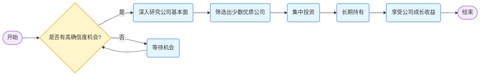

# 巴菲特的集中投资策略：高确信度机会的重要性

> 关键词：巴菲特、集中投资策略、高确信度机会、价值投资、投资组合、长期收益、风险控制

> 摘要：本文深入探讨了巴菲特的集中投资策略，重点阐述了高确信度机会在该策略中的关键作用。通过介绍集中投资策略的背景，剖析其核心概念与联系，讲解相关算法原理和数学模型，结合项目实战案例分析，探讨实际应用场景，推荐学习资源、开发工具和相关论文著作等，全面呈现集中投资策略的理论与实践。同时，对该策略的未来发展趋势与挑战进行总结，并解答常见问题，为投资者提供全面且深入的参考，帮助其更好地理解和运用集中投资策略，把握高确信度机会，实现长期稳健的投资收益。

## 1. 背景介绍 
### 1.1 目的和范围
本文的目的在于深入剖析巴菲特的集中投资策略，特别是高确信度机会在这一策略中的重要性。我们将从理论原理、实际操作、数学模型、案例分析等多个角度全面探讨集中投资策略，帮助投资者更好地理解和运用这一策略。范围涵盖集中投资策略的各个方面，包括其核心概念、算法原理、实际应用场景以及未来发展趋势等。

### 1.2 预期读者
本文预期读者主要包括对投资领域感兴趣的个人投资者、金融从业者、研究学者以及关注巴菲特投资理念的人群。无论是希望提升投资知识的初学者，还是寻求优化投资策略的专业人士，都能从本文中获得有价值的信息和启示。

### 1.3 文档结构概述
本文将按照以下结构展开：首先介绍集中投资策略的背景，包括目的、预期读者和文档结构概述等；接着阐述集中投资策略的核心概念与联系，通过文本示意图和 Mermaid 流程图进行说明；然后讲解核心算法原理和具体操作步骤，结合 Python 源代码详细阐述；之后介绍数学模型和公式，并进行详细讲解和举例说明；再通过项目实战案例，展示代码实现和解读分析；探讨实际应用场景；推荐相关的工具和资源；总结未来发展趋势与挑战；解答常见问题；最后提供扩展阅读和参考资料。

### 1.4 术语表
#### 1.4.1 核心术语定义
- **集中投资策略**：指投资者将大部分资金集中投资于少数经过深入研究和筛选的优质资产，而不是广泛分散投资于众多资产的一种投资策略。
- **高确信度机会**：指投资者经过充分的研究和分析，对某一投资机会的未来发展和收益具有高度信心和确定性的投资机会。
- **价值投资**：一种基于对企业内在价值的评估，寻找被市场低估的股票进行投资的策略，强调长期投资和基本面分析。

#### 1.4.2 相关概念解释
- **投资组合**：由投资者持有的多种资产组成的集合，通过合理配置不同资产，可以降低风险并实现一定的收益目标。
- **长期收益**：指投资者在较长时间内（通常为数年甚至数十年）从投资中获得的总收益，强调投资的持续性和稳定性。
- **风险控制**：通过各种方法和手段，对投资过程中可能面临的风险进行识别、评估和管理，以降低风险对投资收益的影响。

#### 1.4.3 缩略词列表
- **ROE**：Return on Equity，净资产收益率，反映股东权益的收益水平。
- **EPS**：Earnings Per Share，每股收益，衡量公司盈利能力的重要指标。

## 2. 核心概念与联系 

### 集中投资策略的核心概念
集中投资策略的核心在于将投资组合集中于少数几只股票，而不是像传统的分散投资那样广泛持有大量股票。巴菲特认为，与其对众多公司有一点点了解，不如对少数几家公司有深入透彻的了解。通过集中投资于那些具有持续竞争优势、管理优秀、财务状况良好的公司，投资者可以在长期内获得超越市场平均水平的收益。

### 高确信度机会的概念
高确信度机会是集中投资策略的关键。巴菲特强调，投资者应该等待那些自己有高度信心的投资机会出现。这些机会通常是基于对公司基本面的深入研究，包括公司的商业模式、竞争优势、财务报表、管理层能力等。只有当投资者对某一投资机会的未来发展和收益有足够的把握时，才应该果断出手。

### 两者的联系
集中投资策略依赖于高确信度机会的存在。如果没有高确信度机会，盲目地集中投资可能会带来巨大的风险。而高确信度机会的出现为集中投资提供了合理的依据。通过集中投资于高确信度机会，投资者可以充分发挥自己的研究优势，提高投资的成功率和收益水平。

### 文本示意图
```plaintext
集中投资策略
|
|-- 基于高确信度机会
|   |-- 深入研究公司基本面
|   |   |-- 商业模式
|   |   |-- 竞争优势
|   |   |-- 财务报表
|   |   |-- 管理层能力
|   |
|   |-- 筛选出少数优质公司
|
|-- 长期持有
|   |-- 享受公司成长带来的收益
|
|-- 风险控制
|   |-- 确保投资的安全性
```

### Mermaid 流程图


## 3. 核心算法原理 & 具体操作步骤 

### 核心算法原理
集中投资策略的核心算法原理可以用以下几个步骤来概括：
1. **公司筛选**：通过对大量公司的基本面进行分析，筛选出具有持续竞争优势、良好财务状况和优秀管理层的公司。
2. **确信度评估**：对筛选出的公司进行深入研究，评估投资该公司的确信度。确信度的评估可以基于多个因素，如公司的行业地位、市场份额、盈利能力、现金流等。
3. **投资组合构建**：根据确信度评估的结果，将资金集中投资于确信度较高的少数公司。投资组合的构建需要考虑风险控制和收益目标的平衡。
4. **长期持有**：一旦投资组合构建完成，投资者应该长期持有这些股票，享受公司成长带来的收益。

### 具体操作步骤
以下是使用 Python 实现集中投资策略的具体操作步骤和示例代码：

```python
import pandas as pd
import numpy as np

# 步骤 1: 公司筛选
def company_screening(data):
    # 假设 data 是一个包含公司基本面信息的 DataFrame
    # 筛选出 ROE 大于 15% 且 EPS 增长稳定的公司
    screened_data = data[(data['ROE'] > 0.15) & (data['EPS_growth'] > 0)]
    return screened_data

# 步骤 2: 确信度评估
def confidence_evaluation(data):
    # 假设确信度评估基于 ROE、EPS 增长和市场份额
    data['confidence_score'] = data['ROE'] * 0.4 + data['EPS_growth'] * 0.4 + data['market_share'] * 0.2
    return data

# 步骤 3: 投资组合构建
def portfolio_construction(data, num_stocks):
    # 按照确信度分数排序，选择确信度最高的 num_stocks 只股票
    sorted_data = data.sort_values(by='confidence_score', ascending=False)
    portfolio = sorted_data.head(num_stocks)
    # 等权重分配资金
    portfolio['weight'] = 1 / num_stocks
    return portfolio

# 步骤 4: 长期持有
def long_term_holding(portfolio, initial_investment):
    # 计算每个股票的投资金额
    portfolio['investment_amount'] = portfolio['weight'] * initial_investment
    return portfolio

# 示例数据
data = pd.DataFrame({
    'company_name': ['A', 'B', 'C', 'D', 'E'],
    'ROE': [0.2, 0.12, 0.18, 0.16, 0.22],
    'EPS_growth': [0.1, 0.05, 0.12, 0.08, 0.15],
    'market_share': [0.3, 0.2, 0.25, 0.15, 0.35]
})

# 执行集中投资策略
screened_data = company_screening(data)
evaluated_data = confidence_evaluation(screened_data)
portfolio = portfolio_construction(evaluated_data, num_stocks=3)
final_portfolio = long_term_holding(portfolio, initial_investment=100000)

print(final_portfolio)
```

### 代码解释
- **company_screening 函数**：根据 ROE 和 EPS 增长筛选出符合条件的公司。
- **confidence_evaluation 函数**：计算每个公司的确信度分数，综合考虑 ROE、EPS 增长和市场份额。
- **portfolio_construction 函数**：按照确信度分数排序，选择确信度最高的几只股票，并等权重分配资金。
- **long_term_holding 函数**：计算每个股票的投资金额。

通过以上步骤，我们可以实现一个简单的集中投资策略。

## 4. 数学模型和公式 & 详细讲解 & 举例说明 

### 数学模型
集中投资策略的数学模型主要涉及投资组合的构建和收益计算。以下是一些关键的数学模型和公式：

#### 投资组合的预期收益率
投资组合的预期收益率 $E(R_p)$ 可以通过以下公式计算：

$$E(R_p) = \sum_{i=1}^{n} w_i E(R_i)$$

其中，$w_i$ 是第 $i$ 只股票在投资组合中的权重，$E(R_i)$ 是第 $i$ 只股票的预期收益率，$n$ 是投资组合中股票的数量。

#### 投资组合的风险（标准差）
投资组合的风险可以用标准差 $\sigma_p$ 来衡量，计算公式如下：

$$\sigma_p = \sqrt{\sum_{i=1}^{n} \sum_{j=1}^{n} w_i w_j \sigma_{ij}}$$

其中，$\sigma_{ij}$ 是第 $i$ 只股票和第 $j$ 只股票的协方差。

### 详细讲解
- **预期收益率**：投资组合的预期收益率是各个股票预期收益率的加权平均值。权重反映了每个股票在投资组合中的相对重要性。通过合理选择股票和分配权重，可以提高投资组合的预期收益率。
- **风险（标准差）**：投资组合的风险不仅取决于各个股票的风险，还取决于股票之间的相关性。当股票之间的相关性较低时，投资组合的风险可以得到有效降低。

### 举例说明
假设我们有一个投资组合，包含三只股票 A、B、C，它们的预期收益率分别为 10%、15%、20%，权重分别为 0.3、0.4、0.3。则投资组合的预期收益率为：

$$E(R_p) = 0.3 \times 0.1 + 0.4 \times 0.15 + 0.3 \times 0.2 = 0.15 = 15\%$$

假设三只股票的协方差矩阵如下：

|  | A | B | C |
|---|---|---|---|
| A | 0.04 | 0.02 | 0.01 |
| B | 0.02 | 0.06 | 0.03 |
| C | 0.01 | 0.03 | 0.09 |

则投资组合的风险（标准差）为：

$$\sigma_p = \sqrt{0.3^2 \times 0.04 + 0.4^2 \times 0.06 + 0.3^2 \times 0.09 + 2 \times 0.3 \times 0.4 \times 0.02 + 2 \times 0.3 \times 0.3 \times 0.01 + 2 \times 0.4 \times 0.3 \times 0.03} \approx 0.073 = 7.3\%$$

通过这个例子，我们可以看到如何计算投资组合的预期收益率和风险，以及如何通过合理配置权重来优化投资组合。

## 5. 项目实战：代码实际案例和详细解释说明 

### 5.1  开发环境搭建
在进行集中投资策略的项目实战之前，我们需要搭建相应的开发环境。以下是具体步骤：

1. **安装 Python**：可以从 Python 官方网站（https://www.python.org/downloads/）下载并安装最新版本的 Python。
2. **安装必要的库**：我们需要安装一些常用的 Python 库，如 pandas、numpy 等。可以使用以下命令进行安装：
```sh
pip install pandas numpy
```
3. **选择开发工具**：可以选择使用 Jupyter Notebook、PyCharm 等开发工具。这里我们推荐使用 Jupyter Notebook，它可以方便地进行代码编写、调试和结果展示。

### 5.2  源代码详细实现和代码解读
以下是一个完整的集中投资策略的项目实战代码示例：

```python
import pandas as pd
import numpy as np

# 模拟公司基本面数据
def generate_data(num_companies):
    np.random.seed(42)
    company_names = [f'Company_{i}' for i in range(num_companies)]
    roe = np.random.uniform(0.1, 0.3, num_companies)
    eps_growth = np.random.uniform(0.05, 0.2, num_companies)
    market_share = np.random.uniform(0.1, 0.5, num_companies)
    data = pd.DataFrame({
        'company_name': company_names,
        'ROE': roe,
        'EPS_growth': eps_growth,
        'market_share': market_share
    })
    return data

# 公司筛选
def company_screening(data):
    screened_data = data[(data['ROE'] > 0.15) & (data['EPS_growth'] > 0.1)]
    return screened_data

# 确信度评估
def confidence_evaluation(data):
    data['confidence_score'] = data['ROE'] * 0.4 + data['EPS_growth'] * 0.4 + data['market_share'] * 0.2
    return data

# 投资组合构建
def portfolio_construction(data, num_stocks):
    sorted_data = data.sort_values(by='confidence_score', ascending=False)
    portfolio = sorted_data.head(num_stocks)
    portfolio['weight'] = 1 / num_stocks
    return portfolio

# 长期持有
def long_term_holding(portfolio, initial_investment):
    portfolio['investment_amount'] = portfolio['weight'] * initial_investment
    return portfolio

# 主函数
def main():
    num_companies = 20
    initial_investment = 100000
    num_stocks = 5

    # 生成数据
    data = generate_data(num_companies)

    # 公司筛选
    screened_data = company_screening(data)

    # 确信度评估
    evaluated_data = confidence_evaluation(screened_data)

    # 投资组合构建
    portfolio = portfolio_construction(evaluated_data, num_stocks)

    # 长期持有
    final_portfolio = long_term_holding(portfolio, initial_investment)

    print(final_portfolio)

if __name__ == '__main__':
    main()
```

### 代码解读与分析
- **generate_data 函数**：模拟生成公司的基本面数据，包括 ROE、EPS 增长和市场份额。
- **company_screening 函数**：根据 ROE 和 EPS 增长筛选出符合条件的公司。
- **confidence_evaluation 函数**：计算每个公司的确信度分数，综合考虑 ROE、EPS 增长和市场份额。
- **portfolio_construction 函数**：按照确信度分数排序，选择确信度最高的几只股票，并等权重分配资金。
- **long_term_holding 函数**：计算每个股票的投资金额。
- **main 函数**：主函数，依次调用上述函数，完成集中投资策略的整个流程。

通过这个项目实战，我们可以看到如何使用 Python 实现集中投资策略，并对代码进行详细的解读和分析。

## 6. 实际应用场景 
### 个人投资者
对于个人投资者来说，集中投资策略可以帮助他们更好地管理自己的投资组合。通过深入研究少数几家公司，个人投资者可以提高对投资机会的确信度，从而做出更明智的投资决策。同时，集中投资策略可以减少投资者的交易成本和时间成本，提高投资效率。

### 机构投资者
机构投资者如基金公司、保险公司等也可以采用集中投资策略。对于大型机构投资者来说，他们有更丰富的资源和专业的研究团队，可以对公司进行更深入的研究和分析。通过集中投资于高确信度机会，机构投资者可以在控制风险的前提下，实现更高的收益目标。

### 长期投资
集中投资策略特别适合长期投资。巴菲特认为，股票投资应该是长期的，投资者应该关注公司的长期发展前景，而不是短期的市场波动。通过集中投资于具有持续竞争优势的公司，投资者可以在长期内享受公司成长带来的收益。

### 价值投资
集中投资策略与价值投资理念密切相关。价值投资者通过对公司基本面的分析，寻找被市场低估的股票进行投资。集中投资策略可以帮助价值投资者更好地集中资源，深入研究少数几家被低估的公司，从而提高投资的成功率。

## 7. 工具和资源推荐
### 7.1 学习资源推荐
#### 7.1.1 书籍推荐
- 《聪明的投资者》（The Intelligent Investor）：本杰明·格雷厄姆（Benjamin Graham）著，被誉为投资界的圣经，介绍了价值投资的基本理念和方法。
- 《巴菲特致股东的信》（Letters to Shareholders）：沃伦·巴菲特（Warren Buffett）著，收录了巴菲特历年致股东的信，展示了他的投资思想和经验。
- 《滚雪球：巴菲特和他的财富人生》（The Snowball: Warren Buffett and the Business of Life）：艾丽斯·施罗德（Alice Schroeder）著，是一本关于巴菲特的传记，深入介绍了他的成长历程和投资哲学。

#### 7.1.2 在线课程
- Coursera 上的“投资学原理”（Principles of Investing）：由知名教授授课，系统介绍投资学的基本原理和方法。
- edX 上的“价值投资基础”（Foundations of Value Investing）：讲解价值投资的核心概念和实践技巧。

#### 7.1.3 技术博客和网站
- 雪球网（https://xueqiu.com/）：国内知名的投资社区，提供股票、基金等投资相关的资讯、分析和交流平台。
- 价值投资网（https://www.valueinvestorsclub.com/）：专注于价值投资的网站，分享价值投资的研究成果和投资案例。

### 7.2 开发工具框架推荐
#### 7.2.1 IDE和编辑器
- Jupyter Notebook：一个交互式的开发环境，适合进行数据分析和代码调试。
- PyCharm：一款专业的 Python 集成开发环境，提供丰富的功能和插件。

#### 7.2.2 调试和性能分析工具
- IPython：一个增强的 Python 解释器，提供强大的调试和交互功能。
- cProfile：Python 内置的性能分析工具，可以帮助开发者找出代码中的性能瓶颈。

#### 7.2.3 相关框架和库
- pandas：一个强大的数据处理和分析库，提供了丰富的数据结构和函数。
- numpy：一个用于科学计算的基础库，提供了高效的数组操作和数学函数。

### 7.3 相关论文著作推荐
#### 7.3.1 经典论文
- 《证券分析》（Security Analysis）：本杰明·格雷厄姆和戴维·多德（David Dodd）著，奠定了价值投资的理论基础。
- 《有效市场假说》（Efficient Markets Hypothesis）：尤金·法玛（Eugene F. Fama）提出，探讨了市场效率和股票价格的关系。

#### 7.3.2 最新研究成果
- 关注顶尖学术期刊如《金融杂志》（Journal of Finance）、《金融经济学杂志》（Journal of Financial Economics）等，了解投资领域的最新研究成果。

#### 7.3.3 应用案例分析
- 研究巴菲特等投资大师的投资案例，分析他们的投资决策过程和策略，从中汲取经验和教训。

## 8. 总结：未来发展趋势与挑战
### 未来发展趋势
- **数字化和智能化**：随着科技的不断发展，投资领域将越来越多地应用数字化和智能化技术。投资者可以利用大数据、人工智能等技术更高效地筛选投资机会，评估确信度，优化投资组合。
- **全球化**：全球经济一体化的趋势将继续加强，投资者将有更多的机会投资于全球范围内的优质资产。集中投资策略也将在更广阔的市场中得到应用和发展。
- **社会责任投资**：越来越多的投资者开始关注企业的社会责任和可持续发展。未来，集中投资策略可能会更多地考虑企业的环境、社会和治理（ESG）因素，选择具有良好社会形象和可持续发展能力的公司进行投资。

### 挑战
- **市场不确定性**：市场环境复杂多变，充满了不确定性。即使是高确信度机会，也可能受到宏观经济、政策变化、行业竞争等因素的影响，导致投资收益不及预期。
- **信息不对称**：在投资过程中，投资者可能面临信息不对称的问题。一些公司可能会隐瞒或虚报重要信息，影响投资者对公司的确信度评估。
- **情绪影响**：投资者的情绪也会对集中投资策略的实施产生影响。在市场波动较大时，投资者可能会因为恐惧或贪婪而做出错误的决策，偏离集中投资策略的原则。

## 9. 附录：常见问题与解答
### 问题 1：集中投资策略的风险是否很高？
答：集中投资策略的风险相对较高，因为它将大部分资金集中投资于少数几只股票。如果这些股票表现不佳，投资组合的损失可能会比较大。但是，如果投资者能够准确地筛选出高确信度机会，并且进行充分的风险控制，集中投资策略也可以在长期内获得较高的收益。

### 问题 2：如何评估投资机会的确信度？
答：评估投资机会的确信度需要综合考虑多个因素，包括公司的基本面、行业前景、管理层能力、财务状况等。投资者可以通过深入研究公司的年报、季报，分析行业数据，与公司管理层交流等方式来获取相关信息，从而评估投资机会的确信度。

### 问题 3：集中投资策略适合所有投资者吗？
答：集中投资策略并不适合所有投资者。它需要投资者具备较强的研究能力、风险承受能力和投资经验。对于缺乏专业知识和经验的投资者来说，分散投资可能是更合适的选择。

### 问题 4：如何进行风险控制？
答：进行风险控制可以采取多种方法，如合理配置投资组合、设定止损点、定期评估投资组合等。投资者应该根据自己的风险承受能力和投资目标，制定适合自己的风险控制策略。

## 10. 扩展阅读 & 参考资料
### 扩展阅读
- 《投资最重要的事》（The Most Important Thing Illuminated）：霍华德·马克斯（Howard Marks）著，介绍了投资中的重要原则和策略。
- 《金融炼金术》（The Alchemy of Finance）：乔治·索罗斯（George Soros）著，探讨了金融市场的运行规律和投资哲学。

### 参考资料
- 沃伦·巴菲特的官方网站：https://www.berkshirehathaway.com/
- 金融数据提供商：雅虎财经（https://finance.yahoo.com/）、晨星（https://www.morningstar.com/）等。