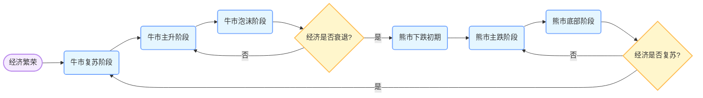

# 市场周期理论：理解牛熊交替的规律

> 关键词：市场周期理论、牛熊交替、经济周期、金融市场、投资策略、周期规律、市场趋势

> 摘要：本文围绕市场周期理论展开，深入剖析牛熊交替的规律。首先介绍市场周期理论的背景知识，包括其目的、预期读者和文档结构等内容。接着阐述核心概念及联系，以清晰的示意图和流程图呈现其架构。通过Python代码详细讲解核心算法原理与具体操作步骤，结合数学模型和公式进一步阐释。在项目实战部分，给出代码实际案例并进行详细解释。同时探讨该理论的实际应用场景，推荐相关的学习资源、开发工具框架和论文著作。最后总结市场周期理论的未来发展趋势与挑战，解答常见问题并提供扩展阅读与参考资料，帮助读者全面理解市场周期理论及牛熊交替规律，为投资决策等提供有力支持。

## 1. 背景介绍 
### 1.1 目的和范围
市场周期理论的研究目的在于揭示金融市场中牛熊交替的内在规律，帮助投资者、金融从业者以及经济研究者更好地理解市场动态，从而做出更为合理的决策。其范围涵盖了股票市场、债券市场、期货市场等各类金融市场，同时也涉及宏观经济层面的经济周期波动对市场的影响。通过对市场周期理论的研究，可以预测市场趋势，评估投资风险，优化资产配置，提高投资回报率，并为宏观经济政策的制定提供参考依据。

### 1.2 预期读者
本文的预期读者主要包括以下几类人群：
- **投资者**：无论是个人投资者还是机构投资者，都希望通过了解市场周期理论来把握市场时机，制定更有效的投资策略，降低投资风险，实现资产的保值增值。
- **金融从业者**：如证券分析师、基金经理、投资顾问等，他们需要深入理解市场周期理论，以便为客户提供专业的投资建议和金融服务。
- **经济研究者**：市场周期理论是宏观经济学和金融经济学的重要研究领域，经济研究者可以通过对该理论的研究，深入探讨经济波动的原因和机制，为经济理论的发展做出贡献。
- **政策制定者**：政府部门的政策制定者需要了解市场周期理论，以便制定合理的宏观经济政策，调节经济运行，促进经济的稳定增长。

### 1.3 文档结构概述
本文将按照以下结构进行阐述：
- **核心概念与联系**：介绍市场周期理论的核心概念，包括牛市、熊市、经济周期等，并通过示意图和流程图展示它们之间的联系。
- **核心算法原理 & 具体操作步骤**：运用Python代码详细讲解用于分析市场周期的核心算法原理，并给出具体的操作步骤。
- **数学模型和公式 & 详细讲解 & 举例说明**：介绍市场周期理论中涉及的数学模型和公式，对其进行详细讲解，并通过实际例子进行说明。
- **项目实战：代码实际案例和详细解释说明**：给出一个实际的项目案例，包括开发环境搭建、源代码实现、代码解读与分析。
- **实际应用场景**：探讨市场周期理论在投资决策、风险管理、宏观经济政策制定等方面的实际应用场景。
- **工具和资源推荐**：推荐相关的学习资源、开发工具框架和论文著作，帮助读者进一步深入学习和研究市场周期理论。
- **总结：未来发展趋势与挑战**：总结市场周期理论的发展现状，分析其未来发展趋势和面临的挑战。
- **附录：常见问题与解答**：解答读者在学习和应用市场周期理论过程中常见的问题。
- **扩展阅读 & 参考资料**：提供相关的扩展阅读材料和参考资料，方便读者进一步深入学习。

### 1.4 术语表
#### 1.4.1 核心术语定义
- **牛市**：指市场行情普遍看涨，延续时间较长的大升市。在牛市中，投资者对市场前景充满信心，股票、债券等资产价格持续上涨，交易量也相应增加。
- **熊市**：与牛市相反，指市场行情普遍看淡，延续时间相对较长的大跌市。在熊市中，投资者对市场前景悲观，资产价格不断下跌，交易量萎缩。
- **经济周期**：也称商业周期、景气循环，是指经济活动沿着经济发展的总体趋势所经历的有规律的扩张和收缩。经济周期一般分为繁荣、衰退、萧条和复苏四个阶段。
- **市场周期**：指金融市场中价格和交易量等指标随时间的周期性波动。市场周期与经济周期密切相关，但又具有一定的独立性。
- **周期长度**：指一个完整的市场周期或经济周期所经历的时间。不同的市场和经济环境下，周期长度可能会有所不同。

#### 1.4.2 相关概念解释
- **领先指标**：指先于市场或经济变化而变化的指标，如消费者信心指数、采购经理人指数等。领先指标可以帮助投资者和经济研究者提前预测市场和经济的变化趋势。
- **同步指标**：指与市场或经济变化同步的指标，如国内生产总值、工业生产指数等。同步指标可以反映当前市场和经济的运行状况。
- **滞后指标**：指在市场或经济变化之后才发生变化的指标，如失业率、通货膨胀率等。滞后指标可以用于验证市场和经济变化的趋势。
- **市场情绪**：指投资者对市场的总体看法和心理状态，包括乐观、悲观、恐惧、贪婪等情绪。市场情绪对市场周期的形成和发展具有重要影响。

#### 1.4.3 缩略词列表
- **GDP**：国内生产总值（Gross Domestic Product）
- **PMI**：采购经理人指数（Purchasing Managers' Index）
- **CPI**：消费者物价指数（Consumer Price Index）
- **PPI**：生产者物价指数（Producer Price Index）
- **FED**：美国联邦储备系统（Federal Reserve System）

## 2. 核心概念与联系 
市场周期理论的核心概念主要包括牛市、熊市、经济周期等，它们之间存在着密切的联系。

### 核心概念原理
- **牛市**：牛市的形成通常与宏观经济的繁荣、企业盈利的增长、货币政策的宽松等因素有关。在牛市中，投资者对市场前景充满信心，大量资金涌入市场，推动资产价格不断上涨。牛市一般可以分为三个阶段：第一阶段是复苏阶段，市场在经历了熊市的低迷后开始逐渐回升；第二阶段是主升阶段，市场情绪高涨，资产价格快速上涨；第三阶段是泡沫阶段，市场过度乐观，资产价格出现泡沫。
- **熊市**：熊市的形成通常与宏观经济的衰退、企业盈利的下降、货币政策的收紧等因素有关。在熊市中，投资者对市场前景悲观，纷纷抛售资产，导致资产价格不断下跌。熊市一般也可以分为三个阶段：第一阶段是下跌初期，市场开始出现调整；第二阶段是主跌阶段，市场情绪恐慌，资产价格大幅下跌；第三阶段是底部阶段，市场逐渐企稳，资产价格开始止跌回升。
- **经济周期**：经济周期是宏观经济运行的一种周期性波动，它反映了经济活动的扩张和收缩。经济周期一般分为繁荣、衰退、萧条和复苏四个阶段。繁荣阶段是经济活动的高峰期，企业生产旺盛，就业充分，物价上涨；衰退阶段是经济活动从繁荣向萧条的过渡阶段，企业生产放缓，就业减少，物价下跌；萧条阶段是经济活动的低谷期，企业生产停滞，失业严重，物价低迷；复苏阶段是经济活动从萧条向繁荣的过渡阶段，企业生产逐渐恢复，就业增加，物价回升。

### 架构的文本示意图
市场周期与经济周期的关系可以用以下文本示意图表示：

经济周期：繁荣 -> 衰退 -> 萧条 -> 复苏
市场周期：牛市（复苏、主升、泡沫） -> 熊市（下跌初期、主跌、底部）

在经济周期的繁荣阶段，通常伴随着牛市的出现；在经济周期的衰退阶段，市场可能会从牛市转向熊市；在经济周期的萧条阶段，熊市通常会持续；在经济周期的复苏阶段，市场可能会从熊市转向牛市。

### Mermaid 流程图


该流程图展示了经济周期与市场周期之间的动态关系。当经济处于繁荣阶段时，市场进入牛市的复苏阶段，随后依次经历主升阶段和泡沫阶段。当经济出现衰退迹象时，市场进入熊市的下跌初期，接着是主跌阶段和底部阶段。当经济开始复苏时，市场又会重新进入牛市的复苏阶段，如此循环往复。

## 3. 核心算法原理 & 具体操作步骤 
### 核心算法原理
在分析市场周期时，我们可以使用移动平均线（Moving Average）和相对强弱指数（Relative Strength Index，RSI）等技术指标来判断市场的趋势和买卖信号。

#### 移动平均线
移动平均线是一种平滑价格数据的技术分析工具，它通过计算一定时间内的平均价格来反映价格的趋势。常见的移动平均线有简单移动平均线（Simple Moving Average，SMA）和指数移动平均线（Exponential Moving Average，EMA）。

简单移动平均线的计算公式为：
$$SMA_n=\frac{\sum_{i=0}^{n-1}P_{t-i}}{n}$$
其中，$SMA_n$ 表示 $n$ 期的简单移动平均线，$P_{t-i}$ 表示第 $t-i$ 期的价格，$n$ 表示移动平均线的周期。

指数移动平均线的计算公式为：
$$EMA_t=\alpha P_t+(1 - \alpha)EMA_{t-1}$$
其中，$EMA_t$ 表示第 $t$ 期的指数移动平均线，$P_t$ 表示第 $t$ 期的价格，$\alpha=\frac{2}{n + 1}$ 是平滑系数，$n$ 表示移动平均线的周期。

当短期移动平均线向上穿过长期移动平均线时，通常被视为买入信号；当短期移动平均线向下穿过长期移动平均线时，通常被视为卖出信号。

#### 相对强弱指数
相对强弱指数是一种衡量证券价格变动幅度的技术分析工具，它通过比较一段时间内证券的平均涨幅和平均跌幅来判断证券的强弱程度。相对强弱指数的计算公式为：
$$RSI = 100-\frac{100}{1 + RS}$$
其中，$RS=\frac{\text{平均涨幅}}{\text{平均跌幅}}$。

相对强弱指数的取值范围在 0 到 100 之间，一般认为，当 RSI 超过 70 时，证券处于超买状态，可能会出现回调；当 RSI 低于 30 时，证券处于超卖状态，可能会出现反弹。

### 具体操作步骤
以下是使用 Python 实现移动平均线和相对强弱指数的具体操作步骤：

```python
import pandas as pd
import numpy as np
import matplotlib.pyplot as plt

# 读取股票价格数据
def read_stock_data(file_path):
    data = pd.read_csv(file_path)
    data['Date'] = pd.to_datetime(data['Date'])
    data.set_index('Date', inplace=True)
    return data

# 计算简单移动平均线
def calculate_sma(data, period):
    data[f'SMA_{period}'] = data['Close'].rolling(window=period).mean()
    return data

# 计算指数移动平均线
def calculate_ema(data, period):
    data[f'EMA_{period}'] = data['Close'].ewm(span=period, adjust=False).mean()
    return data

# 计算相对强弱指数
def calculate_rsi(data, period=14):
    delta = data['Close'].diff()
    up = delta.clip(lower=0)
    down = -delta.clip(upper=0)
    avg_gain = up.rolling(window=period).mean()
    avg_loss = down.rolling(window=period).mean()
    rs = avg_gain / avg_loss
    data['RSI'] = 100 - (100 / (1 + rs))
    return data

# 主函数
def main():
    file_path = 'stock_data.csv'  # 替换为实际的股票数据文件路径
    data = read_stock_data(file_path)
    
    # 计算 5 日和 20 日简单移动平均线
    data = calculate_sma(data, 5)
    data = calculate_sma(data, 20)
    
    # 计算 5 日和 20 日指数移动平均线
    data = calculate_ema(data, 5)
    data = calculate_ema(data, 20)
    
    # 计算相对强弱指数
    data = calculate_rsi(data)
    
    # 绘制图表
    plt.figure(figsize=(12, 8))
    plt.subplot(2, 1, 1)
    plt.plot(data['Close'], label='Close Price')
    plt.plot(data['SMA_5'], label='SMA 5')
    plt.plot(data['SMA_20'], label='SMA 20')
    plt.plot(data['EMA_5'], label='EMA 5')
    plt.plot(data['EMA_20'], label='EMA 20')
    plt.title('Stock Price with Moving Averages')
    plt.xlabel('Date')
    plt.ylabel('Price')
    plt.legend()
    
    plt.subplot(2, 1, 2)
    plt.plot(data['RSI'], label='RSI')
    plt.axhline(y=70, color='r', linestyle='--', label='Overbought')
    plt.axhline(y=30, color='g', linestyle='--', label='Oversold')
    plt.title('Relative Strength Index (RSI)')
    plt.xlabel('Date')
    plt.ylabel('RSI')
    plt.legend()
    
    plt.tight_layout()
    plt.show()

if __name__ == '__main__':
    main()
```

### 代码解释
1. **读取股票价格数据**：使用 `pandas` 库读取股票价格数据，并将日期列转换为日期时间类型，设置日期列为索引。
2. **计算简单移动平均线**：使用 `rolling` 方法计算指定周期的简单移动平均线。
3. **计算指数移动平均线**：使用 `ewm` 方法计算指定周期的指数移动平均线。
4. **计算相对强弱指数**：首先计算价格的差值，然后分别计算平均涨幅和平均跌幅，最后根据公式计算相对强弱指数。
5. **绘制图表**：使用 `matplotlib` 库绘制股票价格、移动平均线和相对强弱指数的图表，直观地展示市场的趋势和买卖信号。

## 4. 数学模型和公式 & 详细讲解 & 举例说明 
### 移动平均线的数学模型和公式
#### 简单移动平均线（SMA）
简单移动平均线的计算公式为：
$$SMA_n=\frac{\sum_{i=0}^{n-1}P_{t-i}}{n}$$
其中，$SMA_n$ 表示 $n$ 期的简单移动平均线，$P_{t-i}$ 表示第 $t-i$ 期的价格，$n$ 表示移动平均线的周期。

例如，假设我们有以下 5 天的股票收盘价数据：[10, 12, 14, 16, 18]，我们要计算 3 日简单移动平均线。

- 第 3 天的 3 日简单移动平均线：$SMA_3=\frac{10 + 12 + 14}{3}=12$
- 第 4 天的 3 日简单移动平均线：$SMA_3=\frac{12 + 14 + 16}{3}=14$
- 第 5 天的 3 日简单移动平均线：$SMA_3=\frac{14 + 16 + 18}{3}=16$

#### 指数移动平均线（EMA）
指数移动平均线的计算公式为：
$$EMA_t=\alpha P_t+(1 - \alpha)EMA_{t-1}$$
其中，$EMA_t$ 表示第 $t$ 期的指数移动平均线，$P_t$ 表示第 $t$ 期的价格，$\alpha=\frac{2}{n + 1}$ 是平滑系数，$n$ 表示移动平均线的周期。

假设我们要计算 3 日指数移动平均线，平滑系数 $\alpha=\frac{2}{3 + 1}=0.5$。初始时，我们可以将 $EMA_0$ 设为第一天的价格。

- 第 1 天的 3 日指数移动平均线：$EMA_1 = P_1 = 10$
- 第 2 天的 3 日指数移动平均线：$EMA_2 = 0.5\times12+(1 - 0.5)\times10 = 11$
- 第 3 天的 3 日指数移动平均线：$EMA_3 = 0.5\times14+(1 - 0.5)\times11 = 12.5$

### 相对强弱指数（RSI）的数学模型和公式
相对强弱指数的计算公式为：
$$RSI = 100-\frac{100}{1 + RS}$$
其中，$RS=\frac{\text{平均涨幅}}{\text{平均跌幅}}$。

计算相对强弱指数的步骤如下：
1. 计算价格的差值：$\Delta P_t = P_t - P_{t-1}$
2. 分离涨幅和跌幅：$U_t=\max(\Delta P_t, 0)$，$D_t=\max(-\Delta P_t, 0)$
3. 计算平均涨幅和平均跌幅：$\text{平均涨幅}=\frac{\sum_{i=0}^{n-1}U_{t-i}}{n}$，$\text{平均跌幅}=\frac{\sum_{i=0}^{n-1}D_{t-i}}{n}$
4. 计算相对强度：$RS=\frac{\text{平均涨幅}}{\text{平均跌幅}}$
5. 计算相对强弱指数：$RSI = 100-\frac{100}{1 + RS}$

例如，假设我们有以下 14 天的股票收盘价数据：[100, 102, 105, 103, 101, 104, 106, 108, 107, 105, 103, 106, 109, 110]，我们要计算 14 日相对强弱指数。

1. 计算价格的差值：$\Delta P = [2, 3, -2, -2, 3, 2, 2, -1, -2, -2, 3, 3, 1]$
2. 分离涨幅和跌幅：$U = [2, 3, 0, 0, 3, 2, 2, 0, 0, 0, 3, 3, 1]$，$D = [0, 0, 2, 2, 0, 0, 0, 1, 2, 2, 0, 0, 0]$
3. 计算平均涨幅和平均跌幅：$\text{平均涨幅}=\frac{2 + 3 + 0 + 0 + 3 + 2 + 2 + 0 + 0 + 0 + 3 + 3 + 1}{14}\approx1.36$，$\text{平均跌幅}=\frac{0 + 0 + 2 + 2 + 0 + 0 + 0 + 1 + 2 + 2 + 0 + 0 + 0}{14}\approx0.64$
4. 计算相对强度：$RS=\frac{1.36}{0.64}\approx2.125$
5. 计算相对强弱指数：$RSI = 100-\frac{100}{1 + 2.125}\approx67.9$

## 5. 项目实战：代码实际案例和详细解释说明 
### 5.1  开发环境搭建
在进行项目实战之前，我们需要搭建相应的开发环境。以下是具体的步骤：

#### 安装 Python
首先，你需要安装 Python 解释器。可以从 Python 官方网站（https://www.python.org/downloads/） 下载适合你操作系统的 Python 安装包，并按照安装向导进行安装。

#### 安装必要的库
我们需要安装 `pandas`、`numpy` 和 `matplotlib` 等库。可以使用以下命令进行安装：
```sh
pip install pandas numpy matplotlib
```

#### 准备数据
我们需要准备股票价格数据，可以从雅虎财经、Tushare 等数据源获取股票价格数据，并将其保存为 CSV 文件。

### 5.2  源代码详细实现和代码解读
以下是完整的源代码：

```python
import pandas as pd
import numpy as np
import matplotlib.pyplot as plt

# 读取股票价格数据
def read_stock_data(file_path):
    data = pd.read_csv(file_path)
    data['Date'] = pd.to_datetime(data['Date'])
    data.set_index('Date', inplace=True)
    return data

# 计算简单移动平均线
def calculate_sma(data, period):
    data[f'SMA_{period}'] = data['Close'].rolling(window=period).mean()
    return data

# 计算指数移动平均线
def calculate_ema(data, period):
    data[f'EMA_{period}'] = data['Close'].ewm(span=period, adjust=False).mean()
    return data

# 计算相对强弱指数
def calculate_rsi(data, period=14):
    delta = data['Close'].diff()
    up = delta.clip(lower=0)
    down = -delta.clip(upper=0)
    avg_gain = up.rolling(window=period).mean()
    avg_loss = down.rolling(window=period).mean()
    rs = avg_gain / avg_loss
    data['RSI'] = 100 - (100 / (1 + rs))
    return data

# 生成买卖信号
def generate_signals(data):
    data['SMA_Signal'] = 0
    data.loc[data['SMA_5'] > data['SMA_20'], 'SMA_Signal'] = 1
    data.loc[data['SMA_5'] < data['SMA_20'], 'SMA_Signal'] = -1
    
    data['RSI_Signal'] = 0
    data.loc[data['RSI'] < 30, 'RSI_Signal'] = 1
    data.loc[data['RSI'] > 70, 'RSI_Signal'] = -1
    
    data['Combined_Signal'] = data['SMA_Signal'] + data['RSI_Signal']
    return data

# 计算回测结果
def backtest(data):
    initial_capital = 100000
    positions = pd.DataFrame(index=data.index).fillna(0.0)
    positions['Stock'] = data['Combined_Signal']
    
    portfolio = positions.multiply(data['Close'], axis=0)
    pos_diff = positions.diff()
    
    portfolio['holdings'] = (positions.multiply(data['Close'], axis=0)).sum(axis=1)
    portfolio['cash'] = initial_capital - (pos_diff.multiply(data['Close'], axis=0)).sum(axis=1).cumsum()
    portfolio['total'] = portfolio['cash'] + portfolio['holdings']
    portfolio['returns'] = portfolio['total'].pct_change()
    
    return portfolio

# 主函数
def main():
    file_path = 'stock_data.csv'  # 替换为实际的股票数据文件路径
    data = read_stock_data(file_path)
    
    # 计算 5 日和 20 日简单移动平均线
    data = calculate_sma(data, 5)
    data = calculate_sma(data, 20)
    
    # 计算 5 日和 20 日指数移动平均线
    data = calculate_ema(data, 5)
    data = calculate_ema(data, 20)
    
    # 计算相对强弱指数
    data = calculate_rsi(data)
    
    # 生成买卖信号
    data = generate_signals(data)
    
    # 回测
    portfolio = backtest(data)
    
    # 绘制图表
    plt.figure(figsize=(12, 8))
    plt.subplot(3, 1, 1)
    plt.plot(data['Close'], label='Close Price')
    plt.plot(data['SMA_5'], label='SMA 5')
    plt.plot(data['SMA_20'], label='SMA 20')
    plt.plot(data['EMA_5'], label='EMA 5')
    plt.plot(data['EMA_20'], label='EMA 20')
    plt.title('Stock Price with Moving Averages')
    plt.xlabel('Date')
    plt.ylabel('Price')
    plt.legend()
    
    plt.subplot(3, 1, 2)
    plt.plot(data['RSI'], label='RSI')
    plt.axhline(y=70, color='r', linestyle='--', label='Overbought')
    plt.axhline(y=30, color='g', linestyle='--', label='Oversold')
    plt.title('Relative Strength Index (RSI)')
    plt.xlabel('Date')
    plt.ylabel('RSI')
    plt.legend()
    
    plt.subplot(3, 1, 3)
    plt.plot(portfolio['total'], label='Portfolio Value')
    plt.title('Portfolio Value over Time')
    plt.xlabel('Date')
    plt.ylabel('Value')
    plt.legend()
    
    plt.tight_layout()
    plt.show()

if __name__ == '__main__':
    main()
```

### 5.3  代码解读与分析
1. **读取股票价格数据**：`read_stock_data` 函数用于读取 CSV 文件中的股票价格数据，并将日期列转换为日期时间类型，设置日期列为索引。
2. **计算移动平均线**：`calculate_sma` 函数用于计算简单移动平均线，`calculate_ema` 函数用于计算指数移动平均线。
3. **计算相对强弱指数**：`calculate_rsi` 函数用于计算相对强弱指数。
4. **生成买卖信号**：`generate_signals` 函数根据移动平均线和相对强弱指数生成买卖信号。当短期移动平均线大于长期移动平均线时，生成买入信号；当短期移动平均线小于长期移动平均线时，生成卖出信号。当相对强弱指数低于 30 时，生成买入信号；当相对强弱指数高于 70 时，生成卖出信号。最后，将两种信号相加得到综合信号。
5. **回测**：`backtest` 函数用于进行回测，计算投资组合的价值和收益率。初始资本设为 100000，根据买卖信号进行买入和卖出操作，计算持仓价值、现金余额和总价值，并计算收益率。
6. **绘制图表**：使用 `matplotlib` 库绘制股票价格、移动平均线、相对强弱指数和投资组合价值的图表，直观地展示市场趋势和投资组合的表现。

通过这个项目实战，我们可以更好地理解市场周期理论，并将其应用到实际的投资决策中。

## 6. 实际应用场景 
市场周期理论在金融市场和宏观经济领域有着广泛的实际应用场景，以下是一些主要的应用场景：

### 投资决策
投资者可以根据市场周期理论来判断市场的趋势和阶段，从而制定合理的投资策略。在牛市初期，投资者可以加大股票等风险资产的配置比例，以获取更高的收益；在牛市后期，投资者可以逐渐减少风险资产的配置比例，增加债券等稳健资产的配置比例，以降低风险。在熊市初期，投资者应该及时卖出股票等风险资产，避免损失；在熊市后期，投资者可以逐渐买入股票等风险资产，等待市场的复苏。

例如，在 2008 年全球金融危机期间，市场处于熊市阶段，许多投资者及时卖出股票，避免了巨大的损失。而在 2009 年市场开始复苏后，一些投资者逐渐买入股票，获得了丰厚的收益。

### 风险管理
市场周期理论可以帮助投资者和金融机构更好地管理风险。通过对市场周期的分析，投资者可以预测市场的波动情况，合理调整资产配置，降低投资组合的风险。金融机构可以根据市场周期的变化，调整信贷政策和风险管理策略，防范金融风险。

例如，银行在经济繁荣阶段可以适当放宽信贷政策，增加贷款投放；在经济衰退阶段，银行应该收紧信贷政策，加强风险管理，防范不良贷款的增加。

### 宏观经济政策制定
政府部门的政策制定者可以根据市场周期理论来制定宏观经济政策，调节经济运行，促进经济的稳定增长。在经济繁荣阶段，政府可以采取紧缩性的财政政策和货币政策，抑制通货膨胀；在经济衰退阶段，政府可以采取扩张性的财政政策和货币政策，刺激经济增长。

例如，在 2008 年全球金融危机期间，各国政府纷纷采取扩张性的财政政策和货币政策，如降低利率、增加政府支出等，以刺激经济增长，缓解金融危机的影响。

### 行业分析和投资选择
市场周期理论可以帮助投资者分析不同行业在市场周期中的表现，从而选择具有潜力的行业进行投资。一些行业在牛市中表现较好，如科技、消费等行业；一些行业在熊市中表现相对稳定，如公用事业、医药等行业。

例如，在 2020 年新冠疫情期间，科技行业和医药行业表现相对较好，而旅游、航空等行业受到较大冲击。投资者可以根据市场周期和行业趋势，选择合适的行业进行投资。

## 7. 工具和资源推荐
### 7.1 学习资源推荐
#### 7.1.1 书籍推荐
- 《聪明的投资者》（The Intelligent Investor）：作者是本杰明·格雷厄姆（Benjamin Graham），这本书是价值投资的经典之作，对市场周期理论和投资策略有深入的阐述。
- 《金融炼金术》（The Alchemy of Finance）：作者是乔治·索罗斯（George Soros），这本书介绍了索罗斯的反身性理论，对市场周期的形成和发展有独特的见解。
- 《周期》（Mastering the Market Cycle）：作者是霍华德·马克斯（Howard Marks），这本书系统地阐述了市场周期的理论和实践，对投资者理解市场周期有很大的帮助。

#### 7.1.2 在线课程
- Coursera 上的《投资学原理》（Principles of Investing）：该课程由哥伦比亚大学教授授课，介绍了投资学的基本原理和方法，包括市场周期理论和投资策略。
- edX 上的《金融市场》（Financial Markets）：该课程由耶鲁大学教授授课，涵盖了金融市场的各个方面，包括市场周期、资产定价等内容。
- 中国大学 MOOC 上的《证券投资学》：该课程由国内知名高校教授授课，介绍了证券投资的基本理论和方法，对市场周期理论有详细的讲解。

#### 7.1.3 技术博客和网站
- 雪球（https://xueqiu.com/）：是国内知名的投资社区，提供股票、基金等金融产品的行情、分析和讨论，有很多关于市场周期和投资策略的文章和讨论。
- 东方财富网（https://www.eastmoney.com/）：是国内最大的财经网站之一，提供全面的财经资讯、行情数据和分析工具，对市场周期和宏观经济有深入的报道和分析。
- Seeking Alpha（https://seekingalpha.com/）：是国外知名的投资研究网站，提供全球金融市场的分析和评论，有很多关于市场周期和投资策略的高质量文章。

### 7.2 开发工具框架推荐
#### 7.2.1 IDE和编辑器
- PyCharm：是一款专业的 Python 集成开发环境，具有代码编辑、调试、代码分析等功能，适合开发 Python 金融分析程序。
- Jupyter Notebook：是一款交互式的开发环境，适合进行数据探索、分析和可视化，在金融数据分析和研究中广泛应用。
- Visual Studio Code：是一款轻量级的代码编辑器，支持多种编程语言和插件，具有丰富的扩展功能，适合快速开发和调试 Python 程序。

#### 7.2.2 调试和性能分析工具
- pdb：是 Python 内置的调试工具，可以帮助开发者在程序运行过程中进行调试，查看变量的值和程序的执行流程。
- cProfile：是 Python 内置的性能分析工具，可以帮助开发者分析程序的性能瓶颈，找出耗时较长的代码段。
- Py-Spy：是一款跨平台的 Python 性能分析工具，可以在不修改代码的情况下对 Python 程序进行性能分析，提供详细的性能报告。

#### 7.2.3 相关框架和库
- Pandas：是 Python 中用于数据处理和分析的强大库，提供了高效的数据结构和数据操作方法，适合处理金融数据。
- NumPy：是 Python 中用于科学计算的基础库，提供了高效的数组操作和数学函数，在金融计算中广泛应用。
- Matplotlib：是 Python 中用于数据可视化的库，提供了丰富的绘图函数和工具，适合绘制金融数据的图表。
- TA-Lib：是一个技术分析库，提供了各种技术分析指标的计算函数，如移动平均线、相对强弱指数等，方便开发者进行技术分析。

### 7.3 相关论文著作推荐
#### 7.3.1 经典论文
- Eugene F. Fama, “Efficient Capital Markets: A Review of Theory and Empirical Work,” The Journal of Finance, 1970. 这篇论文提出了有效市场假说，对金融市场的效率和定价机制进行了深入探讨，对市场周期理论的发展有重要影响。
- Robert J. Shiller, “Do Stock Prices Move Too Much to Be Justified by Subsequent Changes in Dividends?,” The American Economic Review, 1981. 这篇论文对股票价格的波动进行了研究，提出了股票价格可能存在过度波动的观点，对市场周期理论的研究有重要启示。

#### 7.3.2 最新研究成果
- John Y. Campbell and Robert J. Shiller, “Valuation Ratios and the Long-Run Stock Market Outlook,” The Journal of Portfolio Management, 1998. 这篇论文研究了估值比率与股票市场长期走势的关系，为市场周期的预测提供了新的方法和思路。
- Andrew W. Lo and A. Craig MacKinlay, “A Non-Random Walk Down Wall Street,” Princeton University Press, 1999. 这本书对有效市场假说进行了质疑和挑战，提出了市场存在非随机波动的观点，对市场周期理论的发展有重要贡献。

#### 7.3.3 应用案例分析
- 一些金融机构和研究机构发布的关于市场周期分析和投资策略的报告和案例研究，如高盛、摩根大通等金融机构的研究报告，对市场周期理论的实际应用有重要参考价值。

## 8. 总结：未来发展趋势与挑战
### 未来发展趋势
- **与大数据和人工智能的结合**：随着大数据和人工智能技术的发展，市场周期理论将与这些技术更加紧密地结合。通过对海量金融数据的分析和挖掘，可以更准确地识别市场周期的特征和规律，提高市场预测的准确性。人工智能算法可以自动学习市场周期的模式和趋势，为投资者提供更加个性化的投资建议和决策支持。
- **跨市场和跨领域的研究**：市场周期不仅存在于金融市场，还与宏观经济、行业发展等密切相关。未来，市场周期理论的研究将更加注重跨市场和跨领域的分析，综合考虑不同市场和领域之间的相互影响和传导机制，以更全面地理解市场周期的形成和发展。
- **风险管理的精细化**：随着金融市场的不断发展和创新，市场风险的复杂性和多样性也在增加。市场周期理论将在风险管理中发挥更加重要的作用，通过对市场周期的分析和预测，实现风险管理的精细化和个性化。投资者和金融机构可以根据市场周期的不同阶段，采取不同的风险管理策略，降低风险损失。

### 面临的挑战
- **市场的不确定性**：金融市场受到多种因素的影响，如宏观经济政策、政治事件、自然灾害等，这些因素的不确定性使得市场周期的预测变得更加困难。即使使用先进的技术和方法，也难以完全准确地预测市场周期的转折点和走势。
- **数据质量和可用性**：市场周期分析需要大量的金融数据作为支撑，数据的质量和可用性直接影响分析结果的准确性。然而，金融数据往往存在噪声、缺失值等问题，同时，一些数据的获取也受到限制，这给市场周期理论的研究和应用带来了一定的挑战。
- **模型的局限性**：现有的市场周期理论模型大多基于历史数据和假设条件，存在一定的局限性。市场是不断变化和发展的，新的市场现象和规律可能无法被现有的模型所解释和预测。因此，需要不断改进和完善市场周期理论模型，以适应市场的变化。

## 9. 附录：常见问题与解答
### 1. 市场周期理论是否适用于所有金融市场？
市场周期理论适用于大多数金融市场，如股票市场、债券市场、期货市场等。但不同的金融市场具有不同的特点和运行规律，市场周期的表现形式和特征可能会有所不同。在应用市场周期理论时，需要结合具体市场的特点进行分析和判断。

### 2. 如何判断市场处于牛市还是熊市？
可以通过多种方法判断市场处于牛市还是熊市，如观察市场指数的走势、成交量的变化、宏观经济数据、投资者情绪等。一般来说，牛市中市场指数持续上涨，成交量逐渐放大，投资者情绪乐观；熊市中市场指数持续下跌，成交量逐渐萎缩，投资者情绪悲观。

### 3. 市场周期的长度是否固定？
市场周期的长度不是固定的，它受到多种因素的影响，如宏观经济环境、政策变化、市场情绪等。不同的市场周期可能具有不同的长度，短的可能只有几个月，长的可能持续数年。

### 4. 如何利用市场周期理论进行投资？
可以根据市场周期的不同阶段制定不同的投资策略。在牛市初期，加大股票等风险资产的配置比例；在牛市后期，逐渐减少风险资产的配置比例，增加债券等稳健资产的配置比例。在熊市初期，及时卖出股票等风险资产；在熊市后期，逐渐买入股票等风险资产。同时，还可以结合技术分析和基本面分析等方法，选择具有潜力的投资标的。

### 5. 市场周期理论与有效市场假说有什么关系？
市场周期理论与有效市场假说存在一定的矛盾和争议。有效市场假说认为市场是有效的，价格已经反映了所有的信息，市场无法被预测。而市场周期理论认为市场存在周期性的波动，通过对市场周期的分析和预测，可以获取超额收益。实际上，市场既不是完全有效的，也不是完全无效的，市场周期理论和有效市场假说可以相互补充，帮助投资者更好地理解市场。

## 10. 扩展阅读 & 参考资料
### 扩展阅读
- 《非理性繁荣》（Irrational Exuberance）：作者是罗伯特·席勒（Robert J. Shiller），这本书探讨了金融市场中的非理性行为和泡沫现象，与市场周期理论密切相关。
- 《黑天鹅》（The Black Swan）：作者是纳西姆·尼古拉斯·塔勒布（Nassim Nicholas Taleb），这本书介绍了黑天鹅事件的概念和影响，提醒投资者要注意市场中的不确定性和风险。
- 《投资最重要的事》（The Most Important Thing Illuminated）：作者是霍华德·马克斯（Howard Marks），这本书介绍了投资的基本原则和方法，对市场周期理论和投资策略有深入的阐述。

### 参考资料
- 雅虎财经（https://finance.yahoo.com/）：提供全球金融市场的行情数据和财经资讯。
- 中国人民银行（https://www.pbc.gov.cn/）：提供中国宏观经济数据和货币政策信息。
- 国家统计局（https://www.stats.gov.cn/）：提供中国宏观经济数据和统计信息。
- 美联储（https://www.federalreserve.gov/）：提供美国宏观经济数据和货币政策信息。