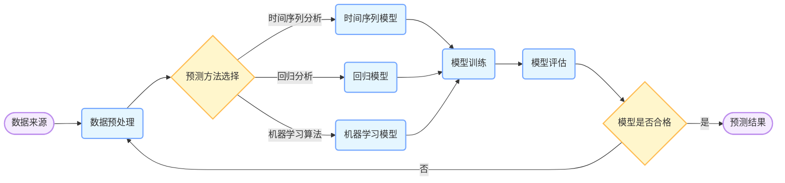

# 市场趋势预测模型

> 关键词：市场趋势预测、预测模型、数据分析、机器学习、时间序列分析、回归分析、经济指标

> 摘要：本文围绕市场趋势预测模型展开深入探讨。首先介绍了市场趋势预测的背景，包括目的、预期读者、文档结构和相关术语。接着阐述了核心概念与联系，通过文本示意图和 Mermaid 流程图展示其架构。详细讲解了核心算法原理，并用 Python 源代码进行具体操作步骤的演示。给出了数学模型和公式，并举例说明。通过项目实战，展示了代码实际案例及详细解释。分析了该模型在不同场景下的实际应用。推荐了学习资源、开发工具框架以及相关论文著作。最后总结了未来发展趋势与挑战，提供常见问题解答和扩展阅读参考资料，旨在为读者全面呈现市场趋势预测模型的理论与实践知识。

## 1. 背景介绍 
### 1.1 目的和范围
市场趋势预测在当今经济环境中具有至关重要的作用。其目的在于通过对市场相关数据的分析和处理，预测未来市场的走向，包括价格波动、需求变化、竞争态势等方面。这有助于企业制定合理的生产、销售和投资策略，政府部门进行宏观经济调控，投资者做出明智的投资决策。

本文章的范围涵盖了市场趋势预测模型的基本概念、核心算法、数学模型、实际应用以及相关工具和资源。从理论基础到实际操作，全面介绍市场趋势预测模型的各个方面，旨在为读者提供一个系统的学习和参考框架。

### 1.2 预期读者
本文预期读者包括但不限于以下几类人群：
- **企业管理人员**：希望通过市场趋势预测来优化企业战略决策，提高企业竞争力和经济效益。
- **投资者**：包括股票、基金、期货等各类投资者，需要借助市场趋势预测来把握投资机会，降低投资风险。
- **研究人员**：从事市场分析、经济预测、机器学习等相关领域的研究人员，对市场趋势预测模型的理论和方法进行深入研究。
- **学生**：学习经济学、统计学、计算机科学等相关专业的学生，希望通过本文了解市场趋势预测模型的基本原理和应用。

### 1.3 文档结构概述
本文将按照以下结构进行组织：
1. **背景介绍**：介绍市场趋势预测的目的、预期读者、文档结构和相关术语。
2. **核心概念与联系**：阐述市场趋势预测模型的核心概念，包括数据来源、预测方法、模型评估等，并通过文本示意图和 Mermaid 流程图展示其架构。
3. **核心算法原理 & 具体操作步骤**：详细讲解市场趋势预测模型中常用的算法，如时间序列分析、回归分析、机器学习算法等，并用 Python 源代码进行具体操作步骤的演示。
4. **数学模型和公式 & 详细讲解 & 举例说明**：给出市场趋势预测模型中涉及的数学模型和公式，如线性回归模型、ARIMA 模型等，并通过具体例子进行详细讲解。
5. **项目实战：代码实际案例和详细解释说明**：通过一个实际的市场趋势预测项目，展示代码的实现过程和详细解释。
6. **实际应用场景**：分析市场趋势预测模型在不同领域的实际应用场景，如金融市场、房地产市场、消费品市场等。
7. **工具和资源推荐**：推荐学习市场趋势预测模型的相关资源，包括书籍、在线课程、技术博客和网站等，以及开发工具框架和相关论文著作。
8. **总结：未来发展趋势与挑战**：总结市场趋势预测模型的发展趋势和面临的挑战。
9. **附录：常见问题与解答**：解答读者在学习和应用市场趋势预测模型过程中常见的问题。
10. **扩展阅读 & 参考资料**：提供扩展阅读的相关资料和参考文献。

### 1.4 术语表
#### 1.4.1 核心术语定义
- **市场趋势预测**：通过对市场相关数据的分析和处理，预测未来市场的走向和变化趋势。
- **预测模型**：用于进行市场趋势预测的数学模型或算法，包括时间序列模型、回归模型、机器学习模型等。
- **数据挖掘**：从大量的数据中发现有价值的信息和知识的过程。
- **时间序列分析**：对按时间顺序排列的数据进行分析和建模的方法，用于预测未来的趋势和变化。
- **回归分析**：研究变量之间关系的统计方法，用于建立因变量与自变量之间的数学模型。
- **机器学习**：让计算机通过数据学习模式和规律，并利用这些模式和规律进行预测和决策的技术。

#### 1.4.2 相关概念解释
- **数据预处理**：在进行数据分析和建模之前，对原始数据进行清洗、转换、归一化等处理，以提高数据的质量和可用性。
- **模型评估**：使用评估指标对预测模型的性能进行评估，如均方误差（MSE）、平均绝对误差（MAE）、决定系数（R²）等。
- **特征工程**：从原始数据中提取和选择有价值的特征，以提高模型的预测性能。
- **过拟合**：模型在训练数据上表现良好，但在测试数据上表现不佳的现象。
- **欠拟合**：模型在训练数据和测试数据上的表现都不佳的现象。

#### 1.4.3 缩略词列表
- **MSE**：Mean Squared Error，均方误差
- **MAE**：Mean Absolute Error，平均绝对误差
- **R²**：Coefficient of Determination，决定系数
- **ARIMA**：AutoRegressive Integrated Moving Average，自回归积分滑动平均模型
- **LSTM**：Long Short-Term Memory，长短期记忆网络

## 2. 核心概念与联系 
市场趋势预测模型涉及多个核心概念，这些概念相互关联，共同构成了市场趋势预测的体系。

### 核心概念原理
- **数据来源**：市场趋势预测的数据来源广泛，包括市场交易数据（如股票价格、成交量等）、宏观经济数据（如 GDP、通货膨胀率等）、行业数据（如行业销售额、市场份额等）、社交媒体数据（如消费者评价、舆情信息等）。这些数据是进行市场趋势预测的基础。
- **预测方法**：常见的预测方法包括时间序列分析、回归分析、机器学习算法等。时间序列分析适用于处理按时间顺序排列的数据，通过分析数据的趋势、季节性和周期性等特征来进行预测。回归分析用于研究变量之间的关系，通过建立因变量与自变量之间的数学模型来进行预测。机器学习算法则通过对大量数据的学习和训练，自动发现数据中的模式和规律，从而进行预测。
- **模型评估**：在建立预测模型后，需要使用评估指标对模型的性能进行评估。常用的评估指标包括均方误差（MSE）、平均绝对误差（MAE）、决定系数（R²）等。这些指标可以帮助我们判断模型的预测准确性和可靠性。

### 架构的文本示意图
市场趋势预测模型的架构可以用以下文本示意图表示：

```plaintext
数据来源
|-- 市场交易数据
|-- 宏观经济数据
|-- 行业数据
|-- 社交媒体数据

数据预处理
|-- 数据清洗
|-- 数据转换
|-- 数据归一化

预测方法
|-- 时间序列分析
|   |-- ARIMA 模型
|   |-- SARIMA 模型
|-- 回归分析
|   |-- 线性回归模型
|   |-- 非线性回归模型
|-- 机器学习算法
|   |-- 决策树
|   |-- 随机森林
|   |-- 支持向量机
|   |-- 神经网络

模型评估
|-- 均方误差（MSE）
|-- 平均绝对误差（MAE）
|-- 决定系数（R²）

预测结果
```

### Mermaid 流程图


## 3. 核心算法原理 & 具体操作步骤 
### 时间序列分析 - ARIMA 模型
#### 算法原理
ARIMA（AutoRegressive Integrated Moving Average）模型是一种常用的时间序列预测模型，它结合了自回归（AR）、差分（I）和移动平均（MA）三个部分。

自回归（AR）部分表示当前值与过去值之间的线性关系，即：

$$y_t = c + \sum_{i=1}^{p} \phi_i y_{t-i} + \epsilon_t$$

其中，$y_t$ 是时间序列在时间 $t$ 的值，$c$ 是常数，$\phi_i$ 是自回归系数，$p$ 是自回归阶数，$\epsilon_t$ 是误差项。

差分（I）部分用于处理非平稳时间序列，通过对时间序列进行差分操作，使其变得平稳。

移动平均（MA）部分表示当前值与过去误差项之间的线性关系，即：

$$y_t = c + \epsilon_t + \sum_{i=1}^{q} \theta_i \epsilon_{t-i}$$

其中，$\theta_i$ 是移动平均系数，$q$ 是移动平均阶数。

ARIMA 模型的一般形式为 $ARIMA(p, d, q)$，其中 $p$ 是自回归阶数，$d$ 是差分阶数，$q$ 是移动平均阶数。

#### 具体操作步骤
以下是使用 Python 实现 ARIMA 模型进行时间序列预测的具体操作步骤：

```python
import pandas as pd
import numpy as np
from statsmodels.tsa.arima.model import ARIMA
import matplotlib.pyplot as plt

# 生成示例时间序列数据
np.random.seed(0)
time_index = pd.date_range(start='2020-01-01', periods=100, freq='D')
data = np.random.randn(100).cumsum()
time_series = pd.Series(data, index=time_index)

# 划分训练集和测试集
train_size = int(len(time_series) * 0.8)
train_data = time_series[:train_size]
test_data = time_series[train_size:]

# 拟合 ARIMA 模型
p, d, q = 1, 1, 1  # 定义 ARIMA 模型的阶数
model = ARIMA(train_data, order=(p, d, q))
model_fit = model.fit()

# 进行预测
predictions = model_fit.forecast(steps=len(test_data))

# 绘制结果
plt.figure(figsize=(12, 6))
plt.plot(train_data, label='Train Data')
plt.plot(test_data, label='Test Data')
plt.plot(test_data.index, predictions, label='Predictions', color='r')
plt.title('ARIMA Time Series Forecasting')
plt.xlabel('Date')
plt.ylabel('Value')
plt.legend()
plt.show()
```

### 回归分析 - 线性回归模型
#### 算法原理
线性回归模型用于研究因变量 $y$ 与自变量 $x_1, x_2, \cdots, x_n$ 之间的线性关系，其一般形式为：

$$y = \beta_0 + \beta_1 x_1 + \beta_2 x_2 + \cdots + \beta_n x_n + \epsilon$$

其中，$\beta_0$ 是截距，$\beta_1, \beta_2, \cdots, \beta_n$ 是回归系数，$\epsilon$ 是误差项。

线性回归模型的目标是通过最小化误差项的平方和来估计回归系数，即：

$$\min_{\beta_0, \beta_1, \cdots, \beta_n} \sum_{i=1}^{m} (y_i - \hat{y}_i)^2$$

其中，$y_i$ 是实际值，$\hat{y}_i$ 是预测值。

#### 具体操作步骤
以下是使用 Python 实现线性回归模型进行预测的具体操作步骤：

```python
import numpy as np
import pandas as pd
from sklearn.linear_model import LinearRegression
from sklearn.model_selection import train_test_split
from sklearn.metrics import mean_squared_error
import matplotlib.pyplot as plt

# 生成示例数据
np.random.seed(0)
x = np.random.randn(100, 1)
y = 2 * x + 1 + np.random.randn(100, 1)

# 划分训练集和测试集
x_train, x_test, y_train, y_test = train_test_split(x, y, test_size=0.2, random_state=0)

# 拟合线性回归模型
model = LinearRegression()
model.fit(x_train, y_train)

# 进行预测
y_pred = model.predict(x_test)

# 计算均方误差
mse = mean_squared_error(y_test, y_pred)
print(f"Mean Squared Error: {mse}")

# 绘制结果
plt.figure(figsize=(12, 6))
plt.scatter(x_test, y_test, label='Actual Data')
plt.plot(x_test, y_pred, color='r', label='Predictions')
plt.title('Linear Regression Prediction')
plt.xlabel('X')
plt.ylabel('Y')
plt.legend()
plt.show()
```

## 4. 数学模型和公式 & 详细讲解 & 举例说明 
### 线性回归模型
#### 数学模型和公式
线性回归模型的数学模型为：

$$y = \beta_0 + \beta_1 x_1 + \beta_2 x_2 + \cdots + \beta_n x_n + \epsilon$$

其中，$y$ 是因变量，$x_1, x_2, \cdots, x_n$ 是自变量，$\beta_0$ 是截距，$\beta_1, \beta_2, \cdots, \beta_n$ 是回归系数，$\epsilon$ 是误差项。

回归系数的估计可以通过最小二乘法来实现，即最小化误差项的平方和：

$$\min_{\beta_0, \beta_1, \cdots, \beta_n} \sum_{i=1}^{m} (y_i - \hat{y}_i)^2$$

其中，$y_i$ 是实际值，$\hat{y}_i$ 是预测值，$\hat{y}_i = \beta_0 + \beta_1 x_{i1} + \beta_2 x_{i2} + \cdots + \beta_n x_{in}$。

#### 详细讲解
最小二乘法的目标是找到一组回归系数 $\beta_0, \beta_1, \cdots, \beta_n$，使得误差项的平方和最小。通过对误差项的平方和求偏导数，并令其等于 0，可以得到回归系数的估计值。

对于简单线性回归模型（$n = 1$），回归系数的估计值为：

$$\hat{\beta}_1 = \frac{\sum_{i=1}^{m} (x_i - \bar{x})(y_i - \bar{y})}{\sum_{i=1}^{m} (x_i - \bar{x})^2}$$

$$\hat{\beta}_0 = \bar{y} - \hat{\beta}_1 \bar{x}$$

其中，$\bar{x}$ 和 $\bar{y}$ 分别是 $x$ 和 $y$ 的均值。

#### 举例说明
假设我们有以下数据：

| $x$ | $y$ |
|---|---|
| 1 | 3 |
| 2 | 5 |
| 3 | 7 |
| 4 | 9 |
| 5 | 11 |

首先，计算 $x$ 和 $y$ 的均值：

$$\bar{x} = \frac{1 + 2 + 3 + 4 + 5}{5} = 3$$

$$\bar{y} = \frac{3 + 5 + 7 + 9 + 11}{5} = 7$$

然后，计算回归系数 $\hat{\beta}_1$：

$$\sum_{i=1}^{5} (x_i - \bar{x})(y_i - \bar{y}) = (1 - 3)(3 - 7) + (2 - 3)(5 - 7) + (3 - 3)(7 - 7) + (4 - 3)(9 - 7) + (5 - 3)(11 - 7) = 20$$

$$\sum_{i=1}^{5} (x_i - \bar{x})^2 = (1 - 3)^2 + (2 - 3)^2 + (3 - 3)^2 + (4 - 3)^2 + (5 - 3)^2 = 10$$

$$\hat{\beta}_1 = \frac{20}{10} = 2$$

最后，计算回归系数 $\hat{\beta}_0$：

$$\hat{\beta}_0 = \bar{y} - \hat{\beta}_1 \bar{x} = 7 - 2 \times 3 = 1$$

因此，线性回归模型为 $y = 1 + 2x$。

### ARIMA 模型
#### 数学模型和公式
ARIMA 模型的数学模型为：

$$\phi(B)(1 - B)^d y_t = \theta(B) \epsilon_t$$

其中，$\phi(B)$ 是自回归算子，$\theta(B)$ 是移动平均算子，$B$ 是滞后算子，$(1 - B)^d$ 是差分算子。

自回归算子 $\phi(B)$ 的定义为：

$$\phi(B) = 1 - \phi_1 B - \phi_2 B^2 - \cdots - \phi_p B^p$$

移动平均算子 $\theta(B)$ 的定义为：

$$\theta(B) = 1 + \theta_1 B + \theta_2 B^2 + \cdots + \theta_q B^q$$

#### 详细讲解
ARIMA 模型的核心是通过自回归、差分和移动平均三个部分来捕捉时间序列的趋势、季节性和周期性等特征。自回归部分考虑了当前值与过去值之间的线性关系，差分部分用于处理非平稳时间序列，移动平均部分考虑了当前值与过去误差项之间的线性关系。

在实际应用中，需要确定 ARIMA 模型的阶数 $p, d, q$。可以通过观察时间序列的自相关函数（ACF）和偏自相关函数（PACF）来初步确定阶数，然后使用信息准则（如 AIC、BIC）来选择最优的阶数。

#### 举例说明
假设我们有一个时间序列 $y_t$，通过观察其自相关函数和偏自相关函数，初步确定 $p = 1$，$d = 1$，$q = 1$，则 ARIMA 模型为 $ARIMA(1, 1, 1)$。

该模型的具体形式为：

$$(1 - \phi_1 B)(1 - B) y_t = (1 + \theta_1 B) \epsilon_t$$

其中，$\phi_1$ 和 $\theta_1$ 是待估计的参数。

通过对时间序列进行拟合，可以得到参数 $\phi_1$ 和 $\theta_1$ 的估计值，从而得到具体的 ARIMA 模型。

## 5. 项目实战：代码实际案例和详细解释说明 
### 5.1  开发环境搭建
本项目使用 Python 进行开发，需要安装以下库：
- **pandas**：用于数据处理和分析。
- **numpy**：用于数值计算。
- **statsmodels**：用于统计建模和时间序列分析。
- **scikit-learn**：用于机器学习算法。
- **matplotlib**：用于数据可视化。

可以使用以下命令安装这些库：

```sh
pip install pandas numpy statsmodels scikit-learn matplotlib
```

### 5.2  源代码详细实现和代码解读
以下是一个完整的市场趋势预测项目示例，使用 ARIMA 模型对股票价格进行预测：

```python
import pandas as pd
import numpy as np
from statsmodels.tsa.arima.model import ARIMA
import matplotlib.pyplot as plt
from sklearn.metrics import mean_squared_error

# 读取股票价格数据
data = pd.read_csv('stock_prices.csv', index_col='Date', parse_dates=True)
prices = data['Close']

# 划分训练集和测试集
train_size = int(len(prices) * 0.8)
train_data = prices[:train_size]
test_data = prices[train_size:]

# 拟合 ARIMA 模型
p, d, q = 1, 1, 1  # 定义 ARIMA 模型的阶数
model = ARIMA(train_data, order=(p, d, q))
model_fit = model.fit()

# 进行预测
predictions = model_fit.forecast(steps=len(test_data))

# 计算均方误差
mse = mean_squared_error(test_data, predictions)
print(f"Mean Squared Error: {mse}")

# 绘制结果
plt.figure(figsize=(12, 6))
plt.plot(train_data, label='Train Data')
plt.plot(test_data, label='Test Data')
plt.plot(test_data.index, predictions, label='Predictions', color='r')
plt.title('ARIMA Stock Price Forecasting')
plt.xlabel('Date')
plt.ylabel('Stock Price')
plt.legend()
plt.show()
```

### 5.3  代码解读与分析
1. **数据读取**：使用 `pandas` 库读取股票价格数据，并将日期列作为索引。
2. **数据划分**：将数据划分为训练集和测试集，其中训练集占 80%，测试集占 20%。
3. **模型拟合**：使用 `statsmodels` 库中的 `ARIMA` 模型对训练数据进行拟合，指定模型的阶数为 $(1, 1, 1)$。
4. **预测**：使用拟合好的模型对测试数据进行预测。
5. **评估**：使用均方误差（MSE）评估模型的预测性能。
6. **可视化**：使用 `matplotlib` 库绘制训练数据、测试数据和预测结果的折线图，直观展示模型的预测效果。

## 6. 实际应用场景 
### 金融市场
在金融市场中，市场趋势预测模型可以用于股票价格预测、汇率预测、债券收益率预测等。投资者可以根据预测结果制定投资策略，降低投资风险，提高投资收益。例如，通过对股票价格的预测，投资者可以选择合适的买入和卖出时机；通过对汇率的预测，企业可以进行外汇风险管理。

### 房地产市场
在房地产市场中，市场趋势预测模型可以用于房价预测、房地产需求预测等。开发商可以根据预测结果制定开发计划，政府部门可以进行房地产市场调控。例如，通过对房价的预测，开发商可以合理确定楼盘的定价；政府部门可以根据房地产需求预测制定土地供应计划。

### 消费品市场
在消费品市场中，市场趋势预测模型可以用于产品销售预测、市场需求预测等。企业可以根据预测结果制定生产计划、库存管理策略和市场营销策略。例如，通过对产品销售的预测，企业可以合理安排生产，避免库存积压或缺货；通过对市场需求的预测，企业可以开发新的产品，满足消费者的需求。

### 能源市场
在能源市场中，市场趋势预测模型可以用于能源价格预测、能源需求预测等。能源企业可以根据预测结果制定生产计划、投资计划和定价策略。例如，通过对石油价格的预测，石油企业可以合理安排开采和生产；通过对电力需求的预测，电力企业可以合理安排发电和输电。

## 7. 工具和资源推荐
### 7.1 学习资源推荐
#### 7.1.1 书籍推荐
- 《Python 数据分析实战》：介绍了使用 Python 进行数据分析的方法和技巧，包括数据处理、数据可视化、机器学习等方面的内容。
- 《时间序列分析及其应用》：系统介绍了时间序列分析的理论和方法，包括 ARIMA 模型、GARCH 模型等。
- 《机器学习实战》：通过实际案例介绍了机器学习的基本算法和应用，包括决策树、随机森林、支持向量机等。

#### 7.1.2 在线课程
- Coursera 上的 “Data Science Specialization”：由约翰霍普金斯大学提供，涵盖了数据科学的各个方面，包括数据处理、数据分析、机器学习等。
- edX 上的 “Introduction to Machine Learning”：由麻省理工学院提供，介绍了机器学习的基本概念和算法。
- Udemy 上的 “Python for Data Science and Machine Learning Bootcamp”：通过实际案例介绍了使用 Python 进行数据科学和机器学习的方法和技巧。

#### 7.1.3 技术博客和网站
- Kaggle：一个数据科学和机器学习的竞赛平台，提供了大量的数据集、代码示例和技术文章。
- Towards Data Science：一个专注于数据科学和机器学习的技术博客，提供了最新的技术文章和研究成果。
- Analytics Vidhya：一个数据科学和机器学习的社区，提供了教程、案例分析和技术文章。

### 7.2 开发工具框架推荐
#### 7.2.1 IDE和编辑器
- PyCharm：一个专业的 Python 集成开发环境，提供了代码编辑、调试、版本控制等功能。
- Jupyter Notebook：一个交互式的笔记本环境，适合进行数据分析和机器学习实验。
- Visual Studio Code：一个轻量级的代码编辑器，支持多种编程语言，提供了丰富的插件和扩展。

#### 7.2.2 调试和性能分析工具
- pdb：Python 内置的调试器，可以帮助我们调试代码。
- cProfile：Python 内置的性能分析工具，可以帮助我们分析代码的性能瓶颈。
- Scikit-learn 中的 GridSearchCV：用于模型调优和参数选择，可以帮助我们找到最优的模型参数。

#### 7.2.3 相关框架和库
- Pandas：用于数据处理和分析，提供了高效的数据结构和数据操作方法。
- NumPy：用于数值计算，提供了高效的数组和矩阵操作方法。
- Scikit-learn：用于机器学习，提供了各种机器学习算法和工具。
- Statsmodels：用于统计建模和时间序列分析，提供了各种统计模型和方法。
- TensorFlow 和 PyTorch：用于深度学习，提供了高效的深度学习框架和工具。

### 7.3 相关论文著作推荐
#### 7.3.1 经典论文
- Box, G. E. P., & Jenkins, G. M. (1970). Time Series Analysis: Forecasting and Control. 这本书是时间序列分析领域的经典著作，系统介绍了 ARIMA 模型的理论和方法。
- Hastie, T., Tibshirani, R., & Friedman, J. (2009). The Elements of Statistical Learning: Data Mining, Inference, and Prediction. 这本书是统计学习领域的经典著作，介绍了各种机器学习算法和方法。

#### 7.3.2 最新研究成果
- 在 IEEE Transactions on Neural Networks and Learning Systems、Journal of Machine Learning Research 等期刊上可以找到关于市场趋势预测模型的最新研究成果。

#### 7.3.3 应用案例分析
- 可以在 Kaggle 等平台上找到各种市场趋势预测的应用案例，学习他人的经验和方法。

## 8. 总结：未来发展趋势与挑战
### 未来发展趋势
- **多源数据融合**：未来的市场趋势预测模型将融合更多来源的数据，包括社交媒体数据、物联网数据等，以提高预测的准确性和可靠性。
- **深度学习的应用**：深度学习算法，如神经网络、循环神经网络等，将在市场趋势预测中得到更广泛的应用，以处理复杂的非线性关系和时间序列数据。
- **实时预测**：随着数据采集和处理技术的不断发展，市场趋势预测将实现实时化，及时为决策者提供准确的信息。
- **个性化预测**：根据不同用户的需求和偏好，提供个性化的市场趋势预测服务。

### 挑战
- **数据质量问题**：市场数据往往存在噪声、缺失值等问题，需要进行有效的数据预处理，以提高数据的质量。
- **模型复杂度和可解释性**：深度学习模型等复杂模型虽然在预测性能上有优势，但往往缺乏可解释性，难以理解模型的决策过程。
- **不确定性和风险**：市场趋势受到多种因素的影响，存在很大的不确定性和风险，如何准确评估和管理这些不确定性和风险是一个挑战。
- **数据安全和隐私**：在数据融合和共享的过程中，需要保障数据的安全和隐私，防止数据泄露和滥用。

## 9. 附录：常见问题与解答
### 问题 1：如何选择合适的预测模型？
答：选择合适的预测模型需要考虑多个因素，包括数据的特点、预测的目标、模型的复杂度和可解释性等。一般来说，可以先对数据进行探索性分析，观察数据的趋势、季节性和周期性等特征，然后选择合适的模型进行尝试。可以使用交叉验证等方法对不同模型的性能进行评估，选择性能最优的模型。

### 问题 2：如何处理缺失值和异常值？
答：处理缺失值的方法包括删除缺失值、插补缺失值等。插补缺失值的方法有均值插补、中位数插补、线性插值等。处理异常值的方法包括删除异常值、替换异常值等。需要根据数据的特点和分析的目的选择合适的处理方法。

### 问题 3：如何评估预测模型的性能？
答：可以使用多种评估指标来评估预测模型的性能，如均方误差（MSE）、平均绝对误差（MAE）、决定系数（R²）等。不同的评估指标适用于不同的情况，需要根据具体问题选择合适的评估指标。

### 问题 4：如何进行模型调优？
答：模型调优的方法包括网格搜索、随机搜索等。通过对模型的参数进行调整，找到最优的参数组合，以提高模型的性能。

## 10. 扩展阅读 & 参考资料
### 扩展阅读
- 《金融时间序列分析》：深入介绍了金融时间序列分析的理论和方法，包括 ARCH 模型、GARCH 模型等。
- 《大数据时代》：探讨了大数据对社会和经济的影响，以及如何利用大数据进行决策和预测。
- 《人工智能：现代方法》：全面介绍了人工智能的理论和方法，包括机器学习、自然语言处理、计算机视觉等。

### 参考资料
- Box, G. E. P., & Jenkins, G. M. (1970). Time Series Analysis: Forecasting and Control.
- Hastie, T., Tibshirani, R., & Friedman, J. (2009). The Elements of Statistical Learning: Data Mining, Inference, and Prediction.
- Kaggle 官方文档：https://www.kaggle.com/docs
- Scikit-learn 官方文档：https://scikit-learn.org/stable/documentation.html
- Statsmodels 官方文档：https://www.statsmodels.org/stable/index.html