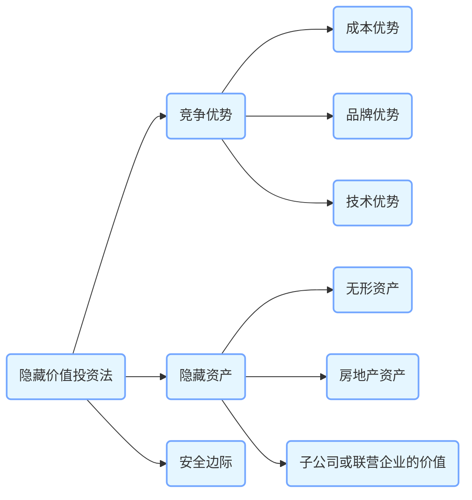

# 布鲁斯·格林沃尔德的隐藏价值投资法

> 关键词：布鲁斯·格林沃尔德、隐藏价值投资法、价值投资、竞争优势、财务分析

> 摘要：本文深入探讨了布鲁斯·格林沃尔德的隐藏价值投资法。首先介绍了该投资法产生的背景，包括其目的、适用读者群体等内容。接着阐述了隐藏价值投资法的核心概念，如竞争优势、隐藏资产等，并通过示意图和流程图展示其内在联系。详细讲解了该投资法的核心算法原理和具体操作步骤，用Python代码进行辅助说明。从数学模型和公式的角度对投资分析进行解读并举例。通过项目实战案例，从开发环境搭建到代码实现与解读，让读者更清晰地理解该投资法的应用。还介绍了该投资法的实际应用场景，推荐了相关的学习资源、开发工具框架以及论文著作。最后总结了其未来发展趋势与挑战，解答常见问题，并提供扩展阅读与参考资料，旨在为投资者全面剖析布鲁斯·格林沃尔德的隐藏价值投资法，帮助他们更好地应用于投资实践。

## 1. 背景介绍 
### 1.1 目的和范围
布鲁斯·格林沃尔德的隐藏价值投资法旨在帮助投资者发现那些被市场低估的具有潜在价值的投资标的。在资本市场中，许多公司的价值并没有被市场充分认识和反映，这些公司可能拥有一些隐藏的资产、独特的竞争优势或者处于被暂时忽视的行业中。该投资法的目的就是通过一套系统的分析方法，挖掘出这些隐藏的价值，为投资者带来超额的投资回报。

其范围涵盖了股票、债券等多种金融资产领域，尤其适用于对上市公司的价值评估和投资决策。无论是个人投资者还是专业的投资机构，都可以借助该投资法来筛选具有投资潜力的公司，优化投资组合，提高投资收益。

### 1.2 预期读者
- **个人投资者**：对于那些希望通过长期投资实现资产增值的个人投资者来说，布鲁斯·格林沃尔德的隐藏价值投资法提供了一种系统、理性的投资思路。它可以帮助个人投资者避免盲目跟风和情绪化的投资决策，更加科学地选择投资标的。
- **专业投资机构从业者**：投资经理、分析师等专业人士可以将该投资法作为一种重要的分析工具，用于深入研究公司的基本面，挖掘潜在的投资机会。在构建投资组合和进行风险管理时，该投资法也能提供有价值的参考。
- **金融专业学生**：对于正在学习金融投资相关课程的学生来说，布鲁斯·格林沃尔德的隐藏价值投资法是一个很好的实践案例。通过学习该投资法，学生可以更好地理解价值投资的理念和方法，提高自己的投资分析能力。

### 1.3 文档结构概述
本文将按照以下结构对布鲁斯·格林沃尔德的隐藏价值投资法进行详细介绍：
1. **核心概念与联系**：阐述隐藏价值投资法的核心概念，如竞争优势、隐藏资产等，并通过示意图和流程图展示这些概念之间的内在联系。
2. **核心算法原理 & 具体操作步骤**：详细讲解该投资法的核心算法原理，并用Python代码进行实现和解释，同时说明具体的操作步骤。
3. **数学模型和公式 & 详细讲解 & 举例说明**：从数学模型和公式的角度对投资分析进行解读，并通过实际例子进行说明。
4. **项目实战：代码实际案例和详细解释说明**：通过一个具体的项目实战案例，展示如何运用隐藏价值投资法进行投资分析，包括开发环境搭建、源代码实现和代码解读。
5. **实际应用场景**：介绍该投资法在不同市场环境和投资领域中的实际应用场景。
6. **工具和资源推荐**：推荐相关的学习资源、开发工具框架以及论文著作，帮助读者进一步深入学习和应用该投资法。
7. **总结：未来发展趋势与挑战**：总结布鲁斯·格林沃尔德的隐藏价值投资法的未来发展趋势，并分析可能面临的挑战。
8. **附录：常见问题与解答**：解答读者在学习和应用该投资法过程中可能遇到的常见问题。
9. **扩展阅读 & 参考资料**：提供相关的扩展阅读材料和参考资料，方便读者进一步研究。

### 1.4 术语表
#### 1.4.1 核心术语定义
- **隐藏价值**：指公司中那些没有被市场充分认识和反映的价值，可能包括隐藏资产、未被发现的竞争优势、潜在的成长机会等。
- **竞争优势**：公司在市场竞争中相对于其他竞争对手所具有的优势，如成本优势、品牌优势、技术优势等。竞争优势是公司创造价值和持续盈利的关键因素。
- **经济商誉**：是指公司由于其品牌、声誉、客户忠诚度等因素而获得的超过其有形资产价值的额外价值。经济商誉是公司隐藏价值的重要组成部分。
- **安全边际**：在投资中，安全边际是指股票的内在价值与市场价格之间的差额。安全边际越大，投资的风险就越低。

#### 1.4.2 相关概念解释
- **价值投资**：一种投资策略，强调通过分析公司的基本面，寻找被市场低估的股票，并长期持有，以获得股票价值回归带来的收益。布鲁斯·格林沃尔德的隐藏价值投资法是价值投资的一种具体应用。
- **基本面分析**：通过对公司的财务报表、行业竞争状况、管理层能力等基本面因素进行分析，评估公司的内在价值和投资价值。基本面分析是隐藏价值投资法的重要基础。
- **市场效率**：指市场价格反映所有可用信息的程度。在有效市场中，股票价格能够及时、准确地反映公司的内在价值；而在无效市场中，股票价格可能会偏离其内在价值，从而为投资者提供了挖掘隐藏价值的机会。

#### 1.4.3 缩略词列表
- **PE**：市盈率（Price Earnings Ratio），是指股票价格与每股收益的比率，用于衡量股票的估值水平。
- **PB**：市净率（Price to Book Ratio），是指股票价格与每股净资产的比率，用于衡量股票的估值水平。
- **ROE**：净资产收益率（Return on Equity），是指公司净利润与净资产的比率，用于衡量公司的盈利能力。

## 2. 核心概念与联系 
### 核心概念原理
布鲁斯·格林沃尔德的隐藏价值投资法基于以下几个核心概念：

#### 竞争优势
竞争优势是公司在市场中生存和发展的关键。具有竞争优势的公司能够在市场中获得更高的利润和市场份额，从而创造更多的价值。竞争优势可以分为以下几种类型：
- **成本优势**：公司通过降低生产成本、提高生产效率等方式，使其产品或服务的成本低于竞争对手，从而在价格上具有优势。例如，沃尔玛通过大规模采购和高效的物流管理，实现了成本的降低，从而能够以较低的价格销售商品，吸引了大量的消费者。
- **品牌优势**：公司通过长期的品牌建设和市场推广，树立了良好的品牌形象和声誉，使消费者对其产品或服务产生了高度的信任和忠诚度。例如，可口可乐作为全球知名的饮料品牌，具有强大的品牌优势，消费者愿意为其产品支付更高的价格。
- **技术优势**：公司通过持续的研发投入和技术创新，掌握了先进的技术和工艺，使其产品或服务具有更高的质量和性能，从而在市场中具有竞争优势。例如，苹果公司通过不断推出创新的产品和技术，如iPhone、iPad等，在全球智能手机和平板电脑市场中占据了领先地位。

#### 隐藏资产
隐藏资产是指公司中那些没有被市场充分认识和反映的资产。隐藏资产可以包括以下几种类型：
- **无形资产**：如品牌、专利、商标、客户关系等。这些无形资产虽然没有在公司的财务报表中体现出其真实价值，但它们对公司的盈利能力和市场竞争力具有重要的影响。例如，谷歌的搜索引擎技术和品牌价值是其重要的隐藏资产，为公司带来了巨大的收益。
- **房地产资产**：公司持有的房地产资产可能由于历史成本计价等原因，其账面价值远低于市场价值。例如，一些老企业可能在城市中心拥有大量的土地和房产，这些资产的市场价值可能非常高，但在公司的财务报表中却没有得到充分反映。
- **子公司或联营企业的价值**：公司拥有的子公司或联营企业可能具有较高的价值，但由于信息披露不充分等原因，其价值没有被市场充分认识。例如，一家母公司旗下的子公司可能在某个新兴领域具有领先的技术和市场地位，但市场对其价值的评估可能偏低。

#### 安全边际
安全边际是隐藏价值投资法中的一个重要概念。它是指股票的内在价值与市场价格之间的差额。安全边际越大，投资的风险就越低。在进行投资决策时，投资者应该寻找那些具有较大安全边际的股票，以降低投资风险。例如，如果一只股票的内在价值为100元，而市场价格为50元，那么其安全边际为50元，投资者在购买该股票时就具有较大的安全保障。

### 架构的文本示意图
```plaintext
隐藏价值投资法
|-- 竞争优势
|   |-- 成本优势
|   |-- 品牌优势
|   |-- 技术优势
|-- 隐藏资产
|   |-- 无形资产
|   |-- 房地产资产
|   |-- 子公司或联营企业的价值
|-- 安全边际
```

### Mermaid 流程图


## 3. 核心算法原理 & 具体操作步骤 
### 核心算法原理
布鲁斯·格林沃尔德的隐藏价值投资法的核心算法原理是通过对公司的基本面进行深入分析，评估公司的内在价值，并与市场价格进行比较，寻找具有较大安全边际的投资标的。具体步骤如下：

1. **评估公司的竞争优势**：通过分析公司的行业竞争状况、市场份额、产品或服务的差异化程度等因素，评估公司的竞争优势。具有竞争优势的公司通常具有较高的盈利能力和市场竞争力，能够创造更多的价值。
2. **挖掘公司的隐藏资产**：通过对公司的财务报表、资产负债表、行业研究等进行深入分析，挖掘公司的隐藏资产。隐藏资产的发现可以增加公司的内在价值。
3. **计算公司的内在价值**：基于公司的竞争优势和隐藏资产，采用合适的估值方法（如现金流折现法、市盈率法、市净率法等）计算公司的内在价值。
4. **比较内在价值与市场价格**：将计算得到的公司内在价值与市场价格进行比较，如果内在价值高于市场价格，且存在较大的安全边际，则认为该股票具有投资价值。

### 具体操作步骤

#### 步骤1：收集公司信息
收集公司的财务报表、年度报告、行业研究报告、新闻资讯等信息，了解公司的基本情况、经营业绩、行业竞争状况等。

#### 步骤2：分析公司的竞争优势
- **成本分析**：比较公司与竞争对手的生产成本、运营成本等，分析公司是否具有成本优势。
- **品牌分析**：评估公司的品牌知名度、品牌忠诚度、品牌价值等，分析公司是否具有品牌优势。
- **技术分析**：研究公司的研发投入、技术创新能力、专利情况等，分析公司是否具有技术优势。

#### 步骤3：挖掘公司的隐藏资产
- **无形资产分析**：评估公司的品牌、专利、商标、客户关系等无形资产的价值。
- **房地产资产分析**：了解公司持有的房地产资产的情况，评估其市场价值。
- **子公司或联营企业分析**：分析公司拥有的子公司或联营企业的经营状况和价值。

#### 步骤4：计算公司的内在价值
- **现金流折现法**：预测公司未来的现金流，并将其折现到当前，计算公司的内在价值。
- **市盈率法**：根据公司的盈利水平和行业平均市盈率，计算公司的内在价值。
- **市净率法**：根据公司的净资产和行业平均市净率，计算公司的内在价值。

#### 步骤5：比较内在价值与市场价格
将计算得到的公司内在价值与市场价格进行比较，如果内在价值高于市场价格，且安全边际较大，则可以考虑投资该股票。

### Python源代码实现
以下是一个简单的Python代码示例，用于演示如何使用市盈率法计算公司的内在价值，并比较内在价值与市场价格：

```python
# 定义公司的每股收益和行业平均市盈率
eps = 2.0  # 每股收益
industry_pe = 15  # 行业平均市盈率

# 计算公司的内在价值
intrinsic_value = eps * industry_pe

# 定义市场价格
market_price = 20.0

# 计算安全边际
safety_margin = (intrinsic_value - market_price) / intrinsic_value

# 输出结果
print(f"公司的内在价值: {intrinsic_value} 元")
print(f"市场价格: {market_price} 元")
print(f"安全边际: {safety_margin * 100:.2f}%")

if safety_margin > 0:
    print("该股票具有投资价值")
else:
    print("该股票不具有投资价值")
```

### 代码解释
1. **定义每股收益和行业平均市盈率**：`eps` 表示公司的每股收益，`industry_pe` 表示行业平均市盈率。
2. **计算公司的内在价值**：通过每股收益乘以行业平均市盈率，得到公司的内在价值。
3. **定义市场价格**：`market_price` 表示股票的市场价格。
4. **计算安全边际**：安全边际的计算公式为 `(内在价值 - 市场价格) / 内在价值`。
5. **输出结果**：打印公司的内在价值、市场价格、安全边际，并根据安全边际的大小判断该股票是否具有投资价值。

## 4. 数学模型和公式 & 详细讲解 & 举例说明 
### 数学模型和公式
#### 现金流折现法
现金流折现法（Discounted Cash Flow, DCF）是一种常用的估值方法，其基本原理是将公司未来的现金流折现到当前，计算公司的内在价值。其数学模型和公式如下：

$$V = \sum_{t=1}^{n} \frac{CF_t}{(1 + r)^t} + \frac{TV}{(1 + r)^n}$$

其中：
- $V$ 表示公司的内在价值
- $CF_t$ 表示第 $t$ 期的现金流
- $r$ 表示折现率
- $n$ 表示预测期数
- $TV$ 表示终值

#### 市盈率法
市盈率法是一种简单的估值方法，其基本原理是根据公司的盈利水平和行业平均市盈率，计算公司的内在价值。其数学模型和公式如下：

$$V = EPS \times PE$$

其中：
- $V$ 表示公司的内在价值
- $EPS$ 表示每股收益
- $PE$ 表示市盈率

#### 市净率法
市净率法是一种基于公司净资产的估值方法，其基本原理是根据公司的净资产和行业平均市净率，计算公司的内在价值。其数学模型和公式如下：

$$V = BV \times PB$$

其中：
- $V$ 表示公司的内在价值
- $BV$ 表示每股净资产
- $PB$ 表示市净率

### 详细讲解
#### 现金流折现法
现金流折现法的核心思想是将公司未来的现金流折现到当前，考虑了货币的时间价值。在使用现金流折现法时，需要预测公司未来的现金流、确定折现率和预测期数。预测期数通常为5 - 10年，终值可以采用永续增长模型进行计算。折现率通常采用加权平均资本成本（WACC），反映了公司的融资成本和风险水平。

#### 市盈率法
市盈率法的优点是简单易懂，容易计算。在使用市盈率法时，需要确定公司的每股收益和行业平均市盈率。每股收益可以从公司的财务报表中获取，行业平均市盈率可以参考同行业其他公司的市盈率。市盈率法适用于盈利稳定的公司。

#### 市净率法
市净率法的优点是基于公司的净资产，相对比较稳健。在使用市净率法时，需要确定公司的每股净资产和行业平均市净率。每股净资产可以从公司的资产负债表中获取，行业平均市净率可以参考同行业其他公司的市净率。市净率法适用于资产规模较大、净资产稳定的公司。

### 举例说明
#### 现金流折现法举例
假设某公司未来5年的现金流分别为100万元、120万元、140万元、160万元、180万元，预测期后公司的现金流以3%的增长率永续增长，折现率为10%。则该公司的内在价值计算如下：

1. **计算预测期内现金流的现值**：
   - 第1年现金流的现值：$PV_1 = \frac{100}{(1 + 0.1)^1} = 90.91$（万元）
   - 第2年现金流的现值：$PV_2 = \frac{120}{(1 + 0.1)^2} = 99.17$（万元）
   - 第3年现金流的现值：$PV_3 = \frac{140}{(1 + 0.1)^3} = 105.18$（万元）
   - 第4年现金流的现值：$PV_4 = \frac{160}{(1 + 0.1)^4} = 109.29$（万元）
   - 第5年现金流的现值：$PV_5 = \frac{180}{(1 + 0.1)^5} = 111.73$（万元）
2. **计算终值**：
   - 第5年末的终值：$TV = \frac{180 \times (1 + 0.03)}{0.1 - 0.03} = 2657.14$（万元）
   - 终值的现值：$PV_{TV} = \frac{2657.14}{(1 + 0.1)^5} = 1653.94$（万元）
3. **计算公司的内在价值**：
   - $V = PV_1 + PV_2 + PV_3 + PV_4 + PV_5 + PV_{TV} = 90.91 + 99.17 + 105.18 + 109.29 + 111.73 + 1653.94 = 2169.22$（万元）

#### 市盈率法举例
假设某公司的每股收益为2元，行业平均市盈率为15倍。则该公司的内在价值计算如下：

$V = EPS \times PE = 2 \times 15 = 30$（元）

#### 市净率法举例
假设某公司的每股净资产为10元，行业平均市净率为2倍。则该公司的内在价值计算如下：

$V = BV \times PB = 10 \times 2 = 20$（元）

## 5. 项目实战：代码实际案例和详细解释说明 
### 5.1  开发环境搭建
#### 安装Python
首先，需要安装Python开发环境。可以从Python官方网站（https://www.python.org/downloads/）下载适合自己操作系统的Python安装包，并按照安装向导进行安装。

#### 安装必要的库
在使用Python进行投资分析时，需要安装一些必要的库，如`pandas`、`numpy`等。可以使用`pip`命令进行安装：

```sh
pip install pandas numpy
```

### 5.2  源代码详细实现和代码解读
以下是一个使用Python进行股票投资分析的实际案例，通过市盈率法计算公司的内在价值，并比较内在价值与市场价格：

```python
import pandas as pd

# 定义公司数据
company_data = {
    "股票代码": ["000001"],
    "每股收益": [2.0],
    "行业平均市盈率": [15],
    "市场价格": [20.0]
}

# 创建DataFrame
df = pd.DataFrame(company_data)

# 计算公司的内在价值
df["内在价值"] = df["每股收益"] * df["行业平均市盈率"]

# 计算安全边际
df["安全边际"] = (df["内在价值"] - df["市场价格"]) / df["内在价值"]

# 判断是否具有投资价值
df["是否具有投资价值"] = df["安全边际"] > 0

# 输出结果
print(df)
```

### 5.3  代码解读与分析
1. **导入必要的库**：`pandas` 是一个强大的数据分析库，用于处理和分析数据。
2. **定义公司数据**：使用字典 `company_data` 定义公司的相关数据，包括股票代码、每股收益、行业平均市盈率和市场价格。
3. **创建DataFrame**：使用 `pd.DataFrame()` 函数将字典转换为 `DataFrame` 对象，方便进行数据处理和分析。
4. **计算公司的内在价值**：通过每股收益乘以行业平均市盈率，计算公司的内在价值，并将结果存储在新的列 `内在价值` 中。
5. **计算安全边际**：根据内在价值和市场价格，计算安全边际，并将结果存储在新的列 `安全边际` 中。
6. **判断是否具有投资价值**：根据安全边际的大小，判断该股票是否具有投资价值，并将结果存储在新的列 `是否具有投资价值` 中。
7. **输出结果**：使用 `print()` 函数输出 `DataFrame` 对象，显示计算结果。

## 6. 实际应用场景 
### 股票投资
在股票投资中，布鲁斯·格林沃尔德的隐藏价值投资法可以帮助投资者筛选出被市场低估的股票。通过分析公司的竞争优势、隐藏资产等因素，计算公司的内在价值，并与市场价格进行比较，投资者可以找到具有较大安全边际的投资标的，从而获得超额的投资回报。例如，在2008年金融危机期间，许多优质公司的股票价格大幅下跌，市场出现了大量被低估的股票。运用隐藏价值投资法，投资者可以挖掘出这些被低估的股票，在市场复苏时获得丰厚的收益。

### 债券投资
在债券投资中，隐藏价值投资法也可以发挥重要作用。投资者可以通过分析债券发行公司的基本面，评估其偿债能力和信用风险。如果债券发行公司具有较强的竞争优势和隐藏资产，其债券的违约风险相对较低，投资者可以考虑投资该债券。此外，投资者还可以通过比较债券的内在价值和市场价格，寻找被低估的债券，获得更高的投资收益。

### 并购重组
在并购重组中，隐藏价值投资法可以帮助企业评估目标公司的价值。通过分析目标公司的竞争优势、隐藏资产等因素，企业可以更准确地评估目标公司的内在价值，从而制定合理的并购价格。例如，一家企业在收购另一家企业时，如果能够发现目标公司的隐藏资产和潜在价值，就可以在谈判中占据更有利的地位，获得更好的并购效果。

### 风险投资
在风险投资中，隐藏价值投资法可以帮助投资者筛选出具有潜力的创业公司。虽然创业公司通常处于早期阶段，没有稳定的盈利和财务数据，但投资者可以通过分析创业公司的商业模式、技术创新能力、团队素质等因素，评估其竞争优势和潜在价值。如果创业公司具有独特的竞争优势和隐藏价值，投资者可以考虑对其进行投资，在公司成长壮大后获得高额的回报。

## 7. 工具和资源推荐
### 7.1 学习资源推荐
#### 7.1.1 书籍推荐
- 《价值投资：从格雷厄姆到巴菲特》：这本书系统地介绍了价值投资的理论和方法，包括格雷厄姆、巴菲特等价值投资大师的投资理念和实践经验。通过阅读这本书，读者可以深入了解价值投资的核心思想和操作技巧。
- 《聪明的投资者》：本杰明·格雷厄姆的经典著作，被誉为价值投资的圣经。书中详细阐述了价值投资的基本原则和方法，以及如何在市场中寻找被低估的股票。对于想要学习价值投资的读者来说，这本书是必读书籍之一。
- 《竞争优势：透视企业护城河》：作者通过深入研究企业的竞争优势，揭示了企业持续盈利的秘密。书中介绍了如何识别企业的竞争优势，以及如何评估竞争优势的可持续性。对于理解布鲁斯·格林沃尔德的隐藏价值投资法中的竞争优势概念具有重要的参考价值。

#### 7.1.2 在线课程
- Coursera上的“价值投资原理”课程：该课程由知名教授授课，系统地介绍了价值投资的原理和方法。课程内容包括财务报表分析、估值模型、投资策略等方面，通过案例分析和实践操作，帮助学员掌握价值投资的核心技能。
- 网易云课堂上的“股票投资实战技巧”课程：该课程结合实际案例，讲解了股票投资的实战技巧和方法。课程内容包括基本面分析、技术分析、投资组合管理等方面，适合想要提高股票投资能力的学员学习。

#### 7.1.3 技术博客和网站
- 雪球网：一个专注于投资交流的社区，汇聚了众多的投资者和投资专家。在雪球网上，投资者可以分享自己的投资经验和观点，学习他人的投资策略，还可以获取最新的市场信息和公司动态。
- 东方财富网：提供全面的金融信息和数据服务，包括股票行情、基金净值、财经新闻等。投资者可以通过东方财富网获取公司的财务报表、行业数据等信息，为投资分析提供支持。

### 7.2 开发工具框架推荐
#### 7.2.1 IDE和编辑器
- PyCharm：一款专业的Python集成开发环境，具有代码编辑、调试、版本控制等功能。PyCharm提供了丰富的插件和工具，方便开发者进行Python开发。
- Jupyter Notebook：一个交互式的开发环境，支持Python、R等多种编程语言。Jupyter Notebook可以将代码、文本、图表等内容整合在一起，方便进行数据分析和可视化。

#### 7.2.2 调试和性能分析工具
- pdb：Python自带的调试工具，可以帮助开发者定位代码中的错误。通过设置断点、单步执行等操作，开发者可以逐步调试代码，找出问题所在。
- cProfile：Python的性能分析工具，可以帮助开发者分析代码的性能瓶颈。通过分析函数的调用次数、执行时间等信息，开发者可以优化代码，提高程序的运行效率。

#### 7.2.3 相关框架和库
- pandas：一个强大的数据分析库，提供了数据结构和数据分析工具，方便进行数据处理和分析。
- numpy：一个用于科学计算的库，提供了高效的数组操作和数学函数，为数据分析和计算提供了支持。
- matplotlib：一个用于数据可视化的库，可以绘制各种类型的图表，如折线图、柱状图、散点图等，帮助开发者直观地展示数据。

### 7.3 相关论文著作推荐
#### 7.3.1 经典论文
- 《The Intelligent Investor》：本杰明·格雷厄姆的经典论文，阐述了价值投资的基本原则和方法，对价值投资理论的发展产生了深远的影响。
- 《Security Analysis》：本杰明·格雷厄姆和大卫·多德合著的经典著作，被誉为价值投资的奠基之作。书中详细介绍了证券分析的方法和技巧，为投资者提供了重要的参考。

#### 7.3.2 最新研究成果
- 《The Little Book of Valuation》：阿斯沃斯·达摩达兰的著作，介绍了最新的估值方法和技术，包括现金流折现法、相对估值法等。书中结合实际案例，讲解了如何运用这些方法进行企业估值。
- 《Investment Fables》：阿斯沃斯·达摩达兰的另一本著作，通过分析各种投资神话和误区，帮助投资者树立正确的投资观念。书中还介绍了一些实用的投资策略和方法。

#### 7.3.3 应用案例分析
- 《Value Investing: Tools and Techniques for Intelligent Investment》：詹姆斯·蒙蒂尔的著作，通过大量的实际案例，介绍了价值投资的工具和技术。书中详细分析了如何运用价值投资法进行股票投资、债券投资等，为投资者提供了实践指导。

## 8. 总结：未来发展趋势与挑战
### 未来发展趋势
#### 与科技的融合
随着科技的不断发展，布鲁斯·格林沃尔德的隐藏价值投资法将与大数据、人工智能等技术更加紧密地结合。通过大数据分析，投资者可以获取更全面、更准确的公司信息和市场数据，从而更精准地挖掘公司的隐藏价值。人工智能技术可以帮助投资者进行复杂的数据分析和模型计算，提高投资决策的效率和准确性。

#### 国际化发展
随着全球经济一体化的深入，投资市场的国际化程度越来越高。布鲁斯·格林沃尔德的隐藏价值投资法将在全球范围内得到更广泛的应用。投资者可以利用该投资法在全球市场中寻找被低估的投资标的，实现资产的全球配置。

#### 多元化应用
除了股票、债券等传统投资领域，布鲁斯·格林沃尔德的隐藏价值投资法还将在新兴领域得到应用，如数字货币、区块链、人工智能等。在这些新兴领域中，投资者可以通过分析项目的竞争优势、潜在价值等因素，寻找具有投资价值的项目。

### 挑战
#### 信息获取的难度
在实际投资中，获取准确、全面的公司信息和市场数据是非常困难的。有些公司可能会隐瞒或虚报信息，导致投资者难以准确评估公司的价值。此外，市场信息的更新速度非常快，投资者需要及时获取最新的信息，才能做出正确的投资决策。

#### 市场的不确定性
市场是复杂多变的，受到宏观经济、政策法规、行业竞争等多种因素的影响。即使投资者通过隐藏价值投资法找到了被低估的投资标的，也不能保证其价格一定会回归价值。市场的不确定性可能会导致投资损失。

#### 投资者的心理因素
投资者的心理因素对投资决策有着重要的影响。在市场波动较大时，投资者可能会受到恐惧、贪婪等情绪的影响，做出不理性的投资决策。例如，在市场下跌时，投资者可能会恐慌抛售股票，而错过投资机会。

## 9. 附录：常见问题与解答
### 问题1：如何准确评估公司的竞争优势？
解答：评估公司的竞争优势需要从多个方面进行分析，包括成本优势、品牌优势、技术优势等。可以通过比较公司与竞争对手的生产成本、市场份额、品牌知名度、研发投入等因素，来评估公司的竞争优势。此外，还可以关注公司的创新能力、客户忠诚度等方面，这些因素也能反映公司的竞争优势。

### 问题2：如何挖掘公司的隐藏资产？
解答：挖掘公司的隐藏资产需要对公司的财务报表、资产负债表、行业研究等进行深入分析。可以关注公司的无形资产，如品牌、专利、商标等；房地产资产，如土地、房产等；子公司或联营企业的价值等。此外，还可以通过实地调研、与公司管理层沟通等方式，获取更多关于公司隐藏资产的信息。

### 问题3：现金流折现法中的折现率如何确定？
解答：现金流折现法中的折现率通常采用加权平均资本成本（WACC）。WACC反映了公司的融资成本和风险水平，其计算公式为：

$$WACC = E/V \times Re + D/V \times Rd \times (1 - Tc)$$

其中：
- $E$ 表示股权价值
- $V$ 表示公司总价值（股权价值 + 债务价值）
- $Re$ 表示股权成本
- $D$ 表示债务价值
- $Rd$ 表示债务成本
- $Tc$ 表示公司所得税税率

股权成本可以采用资本资产定价模型（CAPM）进行计算，债务成本可以根据公司的债务利率确定。

### 问题4：安全边际的大小如何确定？
解答：安全边际的大小没有固定的标准，通常需要根据市场情况、投资标的的风险水平等因素进行确定。一般来说，安全边际越大，投资的风险就越低。在市场波动较大、投资标的风险较高时，可以适当提高安全边际的要求；在市场稳定、投资标的风险较低时，可以适当降低安全边际的要求。

## 10. 扩展阅读 & 参考资料
### 扩展阅读
- 《巴菲特致股东的信》：沃伦·巴菲特每年写给股东的信，分享了他的投资理念、决策过程和对市场的看法。通过阅读这些信件，读者可以深入了解巴菲特的投资思想和实践经验。
- 《穷查理宝典》：收录了查理·芒格的演讲、文章和访谈等内容，展示了他的多元思维模型和投资智慧。查理·芒格是巴菲特的重要合作伙伴，他的思想对巴菲特的投资决策产生了重要的影响。

### 参考资料
- 布鲁斯·格林沃尔德的相关著作和论文
- 金融时报、华尔街日报等财经媒体的相关报道
- 各大金融机构的研究报告和分析文章