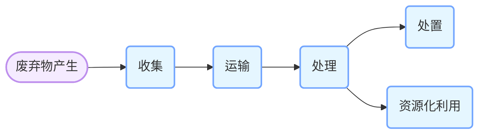

# 废弃物管理技术公司的投资价值分析

> 关键词：废弃物管理技术、投资价值、环保产业、市场趋势、财务分析

> 摘要：本文旨在对废弃物管理技术公司的投资价值进行全面深入的分析。随着全球对环境保护和可持续发展的关注度不断提高，废弃物管理技术领域迎来了新的发展机遇。通过对该领域的背景介绍、核心概念剖析、相关算法与数学模型的探讨，结合项目实战案例和实际应用场景分析，同时推荐相关的工具和资源，帮助投资者更全面地了解废弃物管理技术公司的投资潜力和面临的挑战，为投资决策提供科学依据。

## 1. 背景介绍 
### 1.1 目的和范围
本分析的目的在于系统评估废弃物管理技术公司的投资价值，为投资者提供全面、深入的信息和参考。范围涵盖废弃物管理技术的各个方面，包括技术原理、市场需求、财务状况、发展趋势等，通过多维度的分析来确定该类公司是否具备投资吸引力和潜力。

### 1.2 预期读者
本文预期读者主要包括投资者，如个人投资者、机构投资者等，他们希望通过对废弃物管理技术公司的投资价值分析来做出合理的投资决策；同时也适合对环保产业和废弃物管理技术感兴趣的研究人员、行业从业者，帮助他们更好地了解该领域的发展现状和趋势。

### 1.3 文档结构概述
本文首先介绍背景信息，包括目的、预期读者和文档结构。接着阐述废弃物管理技术的核心概念与联系，深入剖析其原理和架构。然后讲解核心算法原理及具体操作步骤，并给出相应的数学模型和公式。通过项目实战案例展示代码实现和详细解释。分析实际应用场景，推荐相关的工具和资源。最后总结未来发展趋势与挑战，提供常见问题解答和扩展阅读参考资料。

### 1.4 术语表
#### 1.4.1 核心术语定义
- **废弃物管理技术**：指对各种废弃物进行收集、运输、处理、处置和资源化利用的一系列技术和方法的统称。
- **投资价值**：指资产对于具有明确投资目标的特定投资者或某一类投资者所具有的价值。
- **资源化利用**：将废弃物转化为可再利用的资源或产品的过程。

#### 1.4.2 相关概念解释
- **环保产业**：是指在国民经济结构中，以防治环境污染、改善生态环境、保护自然资源为目的而进行的技术开发、产品生产、商业流通、资源利用、信息服务、工程承包等活动的总称。
- **可持续发展**：既满足当代人的需求，又不损害后代人满足其需求的能力的发展模式。

#### 1.4.3 缩略词列表
- **BOT**：Build - Operate - Transfer，建设 - 运营 - 移交
- **PPP**：Public - Private Partnership，公私合营模式

## 2. 核心概念与联系 

### 2.1 废弃物管理技术的核心概念
废弃物管理技术的核心目标是实现废弃物的减量化、无害化和资源化。减量化是指通过各种手段减少废弃物的产生量；无害化是指对废弃物进行处理，使其不对环境和人体健康造成危害；资源化是指将废弃物转化为有价值的资源或产品。

### 2.2 废弃物管理技术的架构
废弃物管理技术的架构主要包括废弃物的收集、运输、处理和处置环节。收集环节负责将分散的废弃物集中起来；运输环节将收集到的废弃物运送到处理或处置场所；处理环节采用物理、化学、生物等方法对废弃物进行处理，使其达到无害化或资源化的目的；处置环节则是将无法再利用的废弃物进行最终的安全处置。

### 2.3 文本示意图
废弃物管理技术架构可以用以下文本描述：

废弃物产生 -> 收集（分类收集、集中收集） -> 运输（专业运输车辆、合理运输路线） -> 处理（物理处理、化学处理、生物处理） -> 处置（填埋、焚烧、堆肥等） -> 资源化利用（生产建筑材料、能源回收等）

### 2.4 Mermaid 流程图


## 3. 核心算法原理 & 具体操作步骤 

### 3.1 废弃物处理成本估算算法
在废弃物管理中，准确估算处理成本是非常重要的。以下是一个简单的废弃物处理成本估算算法的 Python 实现：

```python
# 定义废弃物处理成本估算函数
def waste_processing_cost(weight, unit_cost):
    """
    计算废弃物处理成本
    :param weight: 废弃物重量（吨）
    :param unit_cost: 单位处理成本（元/吨）
    :return: 处理成本（元）
    """
    return weight * unit_cost

# 示例数据
waste_weight = 10  # 废弃物重量为 10 吨
unit_processing_cost = 200  # 单位处理成本为 200 元/吨

# 计算处理成本
cost = waste_processing_cost(waste_weight, unit_processing_cost)
print(f"废弃物处理成本为: {cost} 元")
```

### 3.2 具体操作步骤
1. **数据收集**：收集废弃物的重量和单位处理成本等相关数据。
2. **调用函数**：将收集到的数据作为参数传递给 `waste_processing_cost` 函数。
3. **获取结果**：函数返回计算得到的处理成本。

### 3.3 算法解释
该算法的原理非常简单，就是将废弃物的重量乘以单位处理成本，得到总的处理成本。这个算法可以帮助废弃物管理技术公司快速估算处理成本，为成本控制和定价提供参考。

## 4. 数学模型和公式 & 详细讲解 & 举例说明 

### 4.1 废弃物处理成本数学模型
废弃物处理成本 $C$ 可以用以下公式表示：

$$C = W \times U$$

其中，$C$ 表示废弃物处理成本（元），$W$ 表示废弃物重量（吨），$U$ 表示单位处理成本（元/吨）。

### 4.2 详细讲解
这个公式的原理是基于成本的基本计算方法，即总成本等于单位成本乘以数量。在废弃物处理中，废弃物的重量就是数量，单位处理成本就是每单位重量的成本。

### 4.3 举例说明
假设某废弃物管理技术公司处理一批废弃物，重量为 20 吨，单位处理成本为 150 元/吨。根据上述公式，处理成本为：

$$C = 20 \times 150 = 3000$$（元）

所以，这批废弃物的处理成本为 3000 元。

## 5. 项目实战：代码实际案例和详细解释说明 

### 5.1 开发环境搭建
本项目实战使用 Python 语言进行开发，开发环境搭建步骤如下：
1. **安装 Python**：从 Python 官方网站（https://www.python.org/downloads/）下载并安装 Python 3.x 版本。
2. **安装开发工具**：推荐使用 PyCharm 或 Visual Studio Code 作为开发工具。
3. **创建虚拟环境**：在命令行中使用以下命令创建虚拟环境：
```bash
python -m venv waste_management_env
```
4. **激活虚拟环境**：
    - Windows 系统：
```bash
waste_management_env\Scripts\activate
```
    - Linux/Mac 系统：
```bash
source waste_management_env/bin/activate
```

### 5.2 源代码详细实现和代码解读
以下是一个更复杂的废弃物管理模拟系统的 Python 代码实现：

```python
class Waste:
    def __init__(self, type, weight):
        """
        初始化废弃物对象
        :param type: 废弃物类型
        :param weight: 废弃物重量
        """
        self.type = type
        self.weight = weight

class WasteManagementSystem:
    def __init__(self):
        """
        初始化废弃物管理系统
        """
        self.wastes = []

    def add_waste(self, waste):
        """
        向系统中添加废弃物
        :param waste: 废弃物对象
        """
        self.wastes.append(waste)

    def calculate_total_weight(self):
        """
        计算系统中废弃物的总重量
        :return: 总重量
        """
        total_weight = 0
        for waste in self.wastes:
            total_weight += waste.weight
        return total_weight

    def calculate_processing_cost(self, unit_cost):
        """
        计算废弃物处理成本
        :param unit_cost: 单位处理成本
        :return: 处理成本
        """
        total_weight = self.calculate_total_weight()
        return total_weight * unit_cost

# 示例使用
waste1 = Waste("塑料", 5)
waste2 = Waste("纸张", 3)

wms = WasteManagementSystem()
wms.add_waste(waste1)
wms.add_waste(waste2)

total_weight = wms.calculate_total_weight()
unit_processing_cost = 180
processing_cost = wms.calculate_processing_cost(unit_processing_cost)

print(f"废弃物总重量为: {total_weight} 吨")
print(f"废弃物处理成本为: {processing_cost} 元")
```

### 5.3 代码解读与分析
- **Waste 类**：用于表示废弃物对象，包含废弃物的类型和重量两个属性。
- **WasteManagementSystem 类**：表示废弃物管理系统，包含一个废弃物列表。
    - `add_waste` 方法：用于向系统中添加废弃物。
    - `calculate_total_weight` 方法：计算系统中废弃物的总重量。
    - `calculate_processing_cost` 方法：根据单位处理成本计算废弃物的处理成本。

通过这个模拟系统，我们可以方便地管理废弃物，并计算处理成本，为实际的废弃物管理工作提供了一个简单的模型。

## 6. 实际应用场景 

### 6.1 城市废弃物管理
在城市中，每天都会产生大量的生活垃圾、建筑垃圾等废弃物。废弃物管理技术公司可以通过合理的收集、运输和处理方案，对这些废弃物进行有效的管理。例如，采用垃圾分类收集的方式，将可回收物进行资源化利用，减少填埋和焚烧的废弃物量，降低对环境的影响。

### 6.2 工业废弃物处理
工业生产过程中会产生各种废弃物，如废渣、废水、废气等。废弃物管理技术公司可以根据不同工业行业的特点，采用专业的处理技术，对工业废弃物进行无害化处理和资源化利用。例如，将废渣用于生产建筑材料，将废水进行处理后回用等。

### 6.3 农业废弃物综合利用
农业生产中也会产生大量的废弃物，如农作物秸秆、畜禽粪便等。废弃物管理技术公司可以将这些农业废弃物进行综合利用，如将秸秆用于生物质发电、制作有机肥料，将畜禽粪便进行厌氧发酵生产沼气等，实现农业废弃物的资源化和能源化利用。

## 7. 工具和资源推荐
### 7.1 学习资源推荐
#### 7.1.1 书籍推荐
- 《废弃物处理与处置》：系统介绍了废弃物处理的各种技术和方法，包括物理处理、化学处理、生物处理等。
- 《环境科学与工程原理》：涵盖了环境科学和工程的基本原理，对于理解废弃物管理的相关知识有很大帮助。
- 《循环经济与废弃物管理》：探讨了循环经济理念在废弃物管理中的应用，以及如何实现废弃物的资源化利用。

#### 7.1.2 在线课程
- Coursera 上的“Environmental Science and Sustainability”：提供了环境科学和可持续发展的全面知识，包括废弃物管理的相关内容。
- edX 上的“Waste Management and Resource Recovery”：专门讲解废弃物管理和资源回收的课程。

#### 7.1.3 技术博客和网站
- 中国环保在线（https://www.chinaenvironment.com/）：提供环保行业的最新资讯、技术文章和政策解读。
- 北极星环保网（https://hb.bjx.com.cn/）：专注于环保领域的新闻报道和技术交流。

### 7.2 开发工具框架推荐
#### 7.2.1 IDE和编辑器
- PyCharm：功能强大的 Python 集成开发环境，提供代码编辑、调试、版本控制等功能。
- Visual Studio Code：轻量级的代码编辑器，支持多种编程语言，通过安装插件可以实现 Python 开发的各种功能。

#### 7.2.2 调试和性能分析工具
- PDB：Python 内置的调试工具，可以帮助开发者定位代码中的问题。
- cProfile：Python 的性能分析工具，可以分析代码的执行时间和函数调用情况。

#### 7.2.3 相关框架和库
- Pandas：用于数据处理和分析的 Python 库，可以方便地处理废弃物管理中的各种数据。
- Matplotlib：用于数据可视化的 Python 库，可以将废弃物管理数据以图表的形式展示出来。

### 7.3 相关论文著作推荐
#### 7.3.1 经典论文
- “A Review of Waste Management Technologies for Sustainable Development”：对废弃物管理技术进行了全面的综述，分析了不同技术的优缺点和应用前景。
- “Resource Recovery from Solid Wastes: A Review”：探讨了从固体废弃物中回收资源的技术和方法。

#### 7.3.2 最新研究成果
- 关注《Journal of Environmental Management》《Waste Management》等学术期刊，获取废弃物管理技术领域的最新研究成果。

#### 7.3.3 应用案例分析
- 可以参考一些国际知名的废弃物管理项目案例，如新加坡的废弃物管理模式、德国的循环经济实践等，从中学习先进的管理经验和技术应用。

## 8. 总结：未来发展趋势与挑战 

### 8.1 未来发展趋势
- **技术创新**：随着科技的不断进步，废弃物管理技术将不断创新。例如，新型的垃圾分类技术、高效的废弃物处理设备、智能化的废弃物管理系统等将不断涌现，提高废弃物管理的效率和水平。
- **资源化利用**：未来，废弃物的资源化利用将成为发展的重点。越来越多的废弃物将被转化为有价值的资源或产品，实现资源的循环利用，减少对自然资源的依赖。
- **绿色发展**：在可持续发展的背景下，废弃物管理技术公司将更加注重绿色发展。采用环保、节能的技术和方法，减少对环境的影响，实现经济、社会和环境的协调发展。

### 8.2 挑战
- **技术难题**：一些废弃物的处理和资源化利用仍然面临技术难题，如某些危险废弃物的无害化处理、复杂废弃物的分类和回收等。需要不断加大研发投入，攻克这些技术难题。
- **政策法规**：废弃物管理行业受到政策法规的严格监管。政策法规的变化可能会对废弃物管理技术公司的运营和发展产生影响，需要公司及时调整战略，适应政策法规的要求。
- **市场竞争**：随着废弃物管理市场的不断扩大，市场竞争也日益激烈。废弃物管理技术公司需要不断提升自身的核心竞争力，提高服务质量和技术水平，以在市场竞争中占据优势。

## 9. 附录：常见问题与解答 

### 9.1 废弃物管理技术公司的盈利模式有哪些？
废弃物管理技术公司的盈利模式主要包括以下几种：
- **处理服务收费**：为客户提供废弃物处理服务，收取处理费用。
- **资源化产品销售**：将废弃物转化为资源化产品，如建筑材料、能源等，通过销售这些产品获得收入。
- **政府补贴**：符合相关政策要求的废弃物管理项目可以获得政府的补贴。

### 9.2 如何评估废弃物管理技术公司的技术实力？
可以从以下几个方面评估废弃物管理技术公司的技术实力：
- **技术研发能力**：查看公司的研发团队、研发投入和研发成果。
- **技术应用案例**：了解公司在实际项目中应用的技术和取得的效果。
- **技术创新能力**：关注公司是否有新的技术研发和创新举措。

### 9.3 废弃物管理技术公司面临的环境风险有哪些？
废弃物管理技术公司面临的环境风险主要包括：
- **处理不当导致的环境污染**：如果废弃物处理过程中操作不当，可能会导致土壤、水和空气等环境污染。
- **废弃物泄漏风险**：在废弃物收集、运输和处理过程中，可能会发生废弃物泄漏事件，对环境造成危害。

## 10. 扩展阅读 & 参考资料 
- 《中国废弃物管理行业发展报告》
- 《全球废弃物管理技术前沿研究》
- 相关学术期刊文章和行业报告

以上内容仅供参考，实际投资决策需要结合更多的信息和专业的投资分析。希望本文能够为投资者和相关从业者提供有益的参考和启示。