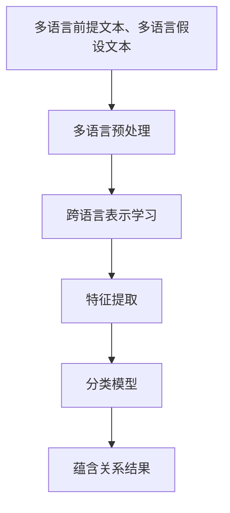

# 开发AI Agent的多语言文本蕴含识别

> 关键词：AI Agent、多语言、文本蕴含识别、自然语言处理、机器学习、深度学习、跨语言技术

> 摘要：本文聚焦于开发AI Agent的多语言文本蕴含识别技术。首先介绍了该技术的背景，包括目的、预期读者等内容。接着深入探讨核心概念与联系，详细阐述核心算法原理及具体操作步骤，借助Python代码进行展示。通过数学模型和公式进一步剖析其理论基础，并举例说明。在项目实战部分，给出开发环境搭建、源代码实现与解读。同时探讨了实际应用场景，推荐了相关的工具和资源。最后总结未来发展趋势与挑战，解答常见问题并提供扩展阅读和参考资料，旨在为读者全面呈现多语言文本蕴含识别技术的全貌，助力相关领域的研究与开发。

## 1. 背景介绍 
### 1.1 目的和范围
多语言文本蕴含识别是自然语言处理领域的重要任务，旨在判断一个文本（前提）是否蕴含另一个文本（假设），并且支持多种语言。开发AI Agent实现多语言文本蕴含识别的目的在于打破语言障碍，使得智能系统能够在不同语言环境下理解文本之间的逻辑关系。其范围涵盖了多种自然语言，如英语、中文、法语、德语等，并且涉及到多种应用场景，如信息检索、问答系统、机器翻译评估等。

### 1.2 预期读者
本文预期读者包括自然语言处理领域的研究人员、人工智能开发者、对多语言文本处理技术感兴趣的技术爱好者等。对于希望深入了解多语言文本蕴含识别技术的原理、算法和实现方法的人群具有参考价值。

### 1.3 文档结构概述
本文首先介绍背景信息，让读者了解多语言文本蕴含识别的相关背景和预期读者。接着阐述核心概念与联系，帮助读者理解该技术的基本原理和架构。然后详细讲解核心算法原理及具体操作步骤，结合Python代码进行说明。通过数学模型和公式进一步剖析技术的理论基础。在项目实战部分，给出开发环境搭建、源代码实现与解读。探讨实际应用场景，为读者展示该技术的应用价值。推荐相关的工具和资源，方便读者深入学习和研究。最后总结未来发展趋势与挑战，解答常见问题并提供扩展阅读和参考资料。

### 1.4 术语表
#### 1.4.1 核心术语定义
- **AI Agent**：人工智能代理，是一种能够感知环境、进行决策并采取行动以实现特定目标的智能实体。
- **文本蕴含识别**：判断一个文本（前提）是否在逻辑上蕴含另一个文本（假设）的任务。如果前提的含义能够推出假设的含义，则认为存在蕴含关系。
- **多语言**：支持多种不同的自然语言，如英语、中文、法语等。

#### 1.4.2 相关概念解释
- **自然语言处理（NLP）**：研究如何让计算机理解和处理人类语言的技术领域，包括文本分类、情感分析、机器翻译等任务。
- **机器学习**：让计算机通过数据学习模式和规律，从而实现预测和决策的技术。在多语言文本蕴含识别中，机器学习算法可以用于训练模型。
- **深度学习**：机器学习的一个分支，通过构建深度神经网络来学习数据的复杂表示。在多语言文本处理中，深度学习模型如Transformer等取得了很好的效果。

#### 1.4.3 缩略词列表
- **NLP**：自然语言处理（Natural Language Processing）
- **ML**：机器学习（Machine Learning）
- **DL**：深度学习（Deep Learning）

## 2. 核心概念与联系 

### 文本蕴含识别的基本原理
文本蕴含识别的核心是判断两个文本之间的逻辑关系。给定一个前提文本 $P$ 和一个假设文本 $H$，需要判断 $P$ 是否蕴含 $H$。蕴含关系可以分为三种类型：蕴含（$P$ 蕴含 $H$）、矛盾（$P$ 与 $H$ 矛盾）和中性（$P$ 与 $H$ 既不蕴含也不矛盾）。

### 多语言的挑战与解决方案
多语言文本蕴含识别面临着语言差异、文化差异等挑战。不同语言的语法结构、词汇表达等各不相同，这给文本的理解和比较带来了困难。为了解决这些问题，需要采用跨语言的表示学习方法，将不同语言的文本映射到同一个语义空间中，使得在这个空间中可以进行有效的比较。

### 文本示意图
```plaintext
           输入：多语言前提文本、多语言假设文本
                   |
                   | 多语言预处理（分词、词性标注等）
                   v
            跨语言表示学习（将不同语言文本映射到同一语义空间）
                   |
                   | 特征提取
                   v
            分类模型（判断蕴含关系：蕴含、矛盾、中性）
                   |
                   v
           输出：蕴含关系结果
```

### Mermaid 流程图


## 3. 核心算法原理 & 具体操作步骤 

### 核心算法原理
在多语言文本蕴含识别中，常用的算法是基于预训练语言模型的方法。预训练语言模型如BERT、XLM - RoBERTa等，它们在大规模的多语言语料上进行预训练，学习到了丰富的语言知识和语义表示。

具体来说，我们可以将前提文本和假设文本拼接在一起，作为预训练语言模型的输入。模型会输出每个词的表示向量，然后我们可以通过池化操作（如取[CLS]标记的向量）得到整个文本对的表示向量。最后，将这个表示向量输入到一个分类器中，判断文本对的蕴含关系。

### 具体操作步骤
1. **数据准备**：收集多语言的文本蕴含识别数据集，如XNLI数据集。对数据进行预处理，包括分词、去除停用词等操作。
2. **加载预训练模型**：选择合适的预训练语言模型，如XLM - RoBERTa，加载其预训练权重。
3. **构建分类模型**：在预训练模型的基础上，添加一个分类器，如全连接层，用于判断文本对的蕴含关系。
4. **训练模型**：使用准备好的数据集对模型进行训练，调整模型的参数以最小化损失函数。
5. **评估模型**：使用测试数据集对训练好的模型进行评估，计算准确率、召回率等指标。

### Python源代码
```python
import torch
from torch.utils.data import Dataset, DataLoader
from transformers import AutoTokenizer, AutoModelForSequenceClassification, AdamW
from sklearn.metrics import accuracy_score

# 定义数据集类
class TextEntailmentDataset(Dataset):
    def __init__(self, texts, labels, tokenizer, max_length):
        self.texts = texts
        self.labels = labels
        self.tokenizer = tokenizer
        self.max_length = max_length

    def __len__(self):
        return len(self.texts)

    def __getitem__(self, idx):
        text = self.texts[idx]
        label = self.labels[idx]
        encoding = self.tokenizer(text[0], text[1], return_tensors='pt', padding='max_length', truncation=True, max_length=self.max_length)
        input_ids = encoding['input_ids'].squeeze()
        attention_mask = encoding['attention_mask'].squeeze()
        return {
            'input_ids': input_ids,
            'attention_mask': attention_mask,
            'labels': torch.tensor(label, dtype=torch.long)
        }

# 训练函数
def train(model, dataloader, optimizer, device):
    model.train()
    total_loss = 0
    for batch in dataloader:
        input_ids = batch['input_ids'].to(device)
        attention_mask = batch['attention_mask'].to(device)
        labels = batch['labels'].to(device)

        optimizer.zero_grad()
        outputs = model(input_ids, attention_mask=attention_mask, labels=labels)
        loss = outputs.loss
        total_loss += loss.item()
        loss.backward()
        optimizer.step()
    return total_loss / len(dataloader)

# 评估函数
def evaluate(model, dataloader, device):
    model.eval()
    predictions = []
    true_labels = []
    with torch.no_grad():
        for batch in dataloader:
            input_ids = batch['input_ids'].to(device)
            attention_mask = batch['attention_mask'].to(device)
            labels = batch['labels'].to(device)

            outputs = model(input_ids, attention_mask=attention_mask)
            logits = outputs.logits
            preds = torch.argmax(logits, dim=1)
            predictions.extend(preds.cpu().tolist())
            true_labels.extend(labels.cpu().tolist())
    accuracy = accuracy_score(true_labels, predictions)
    return accuracy

# 主函数
def main():
    # 超参数设置
    max_length = 128
    batch_size = 16
    num_epochs = 3
    learning_rate = 2e-5

    # 加载预训练模型和分词器
    model_name = 'xlm-roberta-base'
    tokenizer = AutoTokenizer.from_pretrained(model_name)
    model = AutoModelForSequenceClassification.from_pretrained(model_name, num_labels=3)

    # 模拟数据集
    texts = [('This is a premise', 'This is a hypothesis'), ('Another premise', 'Another hypothesis')]
    labels = [0, 1]

    # 创建数据集和数据加载器
    dataset = TextEntailmentDataset(texts, labels, tokenizer, max_length)
    dataloader = DataLoader(dataset, batch_size=batch_size, shuffle=True)

    # 设备设置
    device = torch.device('cuda' if torch.cuda.is_available() else 'cpu')
    model.to(device)

    # 优化器
    optimizer = AdamW(model.parameters(), lr=learning_rate)

    # 训练和评估
    for epoch in range(num_epochs):
        train_loss = train(model, dataloader, optimizer, device)
        accuracy = evaluate(model, dataloader, device)
        print(f'Epoch {epoch + 1}: Loss = {train_loss}, Accuracy = {accuracy}')

if __name__ == '__main__':
    main()
```

## 4. 数学模型和公式 & 详细讲解 & 举例说明 

### 预训练语言模型的数学原理
预训练语言模型通常基于Transformer架构，其核心是注意力机制。注意力机制可以计算输入序列中不同位置之间的相关性，从而更好地捕捉序列中的语义信息。

Transformer的注意力计算可以表示为：
$$Attention(Q, K, V) = softmax(\frac{QK^T}{\sqrt{d_k}})V$$
其中，$Q$ 是查询矩阵，$K$ 是键矩阵，$V$ 是值矩阵，$d_k$ 是键的维度。

### 分类模型的数学原理
在多语言文本蕴含识别中，分类模型通常是一个全连接层，其输入是预训练语言模型输出的文本表示向量 $h$，输出是每个类别（蕴含、矛盾、中性）的得分 $s$。

全连接层的计算可以表示为：
$$s = W_hh + b$$
其中，$W_h$ 是权重矩阵，$b$ 是偏置向量。

最后，通过softmax函数将得分转换为概率分布：
$$p_i = \frac{e^{s_i}}{\sum_{j=1}^{C}e^{s_j}}$$
其中，$p_i$ 是第 $i$ 个类别的概率，$C$ 是类别数（这里 $C = 3$）。

### 举例说明
假设我们有一个前提文本 $P$：“The cat is on the mat.” 和一个假设文本 $H$：“A feline is on a cushion.”

首先，将这两个文本输入到预训练语言模型中，模型会输出每个词的表示向量。然后，通过池化操作得到整个文本对的表示向量 $h$。接着，将 $h$ 输入到全连接层中，得到得分向量 $s$。假设 $s = [0.2, 0.7, 0.1]$，表示蕴含、矛盾、中性的得分分别为 $0.2$、$0.7$、$0.1$。最后，通过softmax函数计算概率分布：
$$p_{entailment} = \frac{e^{0.2}}{e^{0.2} + e^{0.7} + e^{0.1}} \approx 0.23$$
$$p_{contradiction} = \frac{e^{0.7}}{e^{0.2} + e^{0.7} + e^{0.1}} \approx 0.63$$
$$p_{neutral} = \frac{e^{0.1}}{e^{0.2} + e^{0.7} + e^{0.1}} \approx 0.14$$
根据概率分布，我们可以判断文本对的蕴含关系为矛盾。

## 5. 项目实战：代码实际案例和详细解释说明 

### 5.1  开发环境搭建
1. **安装Python**：确保你已经安装了Python 3.6或更高版本。可以从Python官方网站（https://www.python.org/downloads/）下载并安装。
2. **安装依赖库**：使用pip安装所需的库，包括`torch`、`transformers`、`sklearn`等。
```bash
pip install torch transformers scikit-learn
```
3. **GPU支持（可选）**：如果你的机器有NVIDIA GPU，可以安装CUDA和cuDNN，以加速模型的训练和推理。

### 5.2  源代码详细实现和代码解读
以下是对前面给出的Python代码的详细解读：

#### 数据集类 `TextEntailmentDataset`
```python
class TextEntailmentDataset(Dataset):
    def __init__(self, texts, labels, tokenizer, max_length):
        self.texts = texts
        self.labels = labels
        self.tokenizer = tokenizer
        self.max_length = max_length

    def __len__(self):
        return len(self.texts)

    def __getitem__(self, idx):
        text = self.texts[idx]
        label = self.labels[idx]
        encoding = self.tokenizer(text[0], text[1], return_tensors='pt', padding='max_length', truncation=True, max_length=self.max_length)
        input_ids = encoding['input_ids'].squeeze()
        attention_mask = encoding['attention_mask'].squeeze()
        return {
            'input_ids': input_ids,
            'attention_mask': attention_mask,
            'labels': torch.tensor(label, dtype=torch.long)
        }
```
- `__init__` 方法：初始化数据集，接收文本列表、标签列表、分词器和最大长度作为参数。
- `__len__` 方法：返回数据集的长度。
- `__getitem__` 方法：根据索引获取一个样本，对文本进行分词和编码，返回输入ID、注意力掩码和标签。

#### 训练函数 `train`
```python
def train(model, dataloader, optimizer, device):
    model.train()
    total_loss = 0
    for batch in dataloader:
        input_ids = batch['input_ids'].to(device)
        attention_mask = batch['attention_mask'].to(device)
        labels = batch['labels'].to(device)

        optimizer.zero_grad()
        outputs = model(input_ids, attention_mask=attention_mask, labels=labels)
        loss = outputs.loss
        total_loss += loss.item()
        loss.backward()
        optimizer.step()
    return total_loss / len(dataloader)
```
- `model.train()`：将模型设置为训练模式。
- 遍历数据加载器中的每个批次，将数据移动到指定设备（CPU或GPU）上。
- 清空优化器的梯度，前向传播计算损失，反向传播更新模型参数。
- 返回平均损失。

#### 评估函数 `evaluate`
```python
def evaluate(model, dataloader, device):
    model.eval()
    predictions = []
    true_labels = []
    with torch.no_grad():
        for batch in dataloader:
            input_ids = batch['input_ids'].to(device)
            attention_mask = batch['attention_mask'].to(device)
            labels = batch['labels'].to(device)

            outputs = model(input_ids, attention_mask=attention_mask)
            logits = outputs.logits
            preds = torch.argmax(logits, dim=1)
            predictions.extend(preds.cpu().tolist())
            true_labels.extend(labels.cpu().tolist())
    accuracy = accuracy_score(true_labels, predictions)
    return accuracy
```
- `model.eval()`：将模型设置为评估模式。
- 遍历数据加载器中的每个批次，前向传播得到预测结果。
- 使用`torch.argmax`函数获取预测的类别索引，计算准确率。

#### 主函数 `main`
```python
def main():
    # 超参数设置
    max_length = 128
    batch_size = 16
    num_epochs = 3
    learning_rate = 2e-5

    # 加载预训练模型和分词器
    model_name = 'xlm-roberta-base'
    tokenizer = AutoTokenizer.from_pretrained(model_name)
    model = AutoModelForSequenceClassification.from_pretrained(model_name, num_labels=3)

    # 模拟数据集
    texts = [('This is a premise', 'This is a hypothesis'), ('Another premise', 'Another hypothesis')]
    labels = [0, 1]

    # 创建数据集和数据加载器
    dataset = TextEntailmentDataset(texts, labels, tokenizer, max_length)
    dataloader = DataLoader(dataset, batch_size=batch_size, shuffle=True)

    # 设备设置
    device = torch.device('cuda' if torch.cuda.is_available() else 'cpu')
    model.to(device)

    # 优化器
    optimizer = AdamW(model.parameters(), lr=learning_rate)

    # 训练和评估
    for epoch in range(num_epochs):
        train_loss = train(model, dataloader, optimizer, device)
        accuracy = evaluate(model, dataloader, device)
        print(f'Epoch {epoch + 1}: Loss = {train_loss}, Accuracy = {accuracy}')

if __name__ == '__main__':
    main()
```
- 设置超参数，如最大长度、批次大小、训练轮数和学习率。
- 加载预训练模型和分词器。
- 模拟数据集，创建数据集和数据加载器。
- 将模型移动到指定设备上，定义优化器。
- 进行训练和评估，打印每一轮的损失和准确率。

### 5.3  代码解读与分析
通过上述代码，我们实现了一个简单的多语言文本蕴含识别模型。代码的核心是使用预训练语言模型XLM - RoBERTa，将前提文本和假设文本拼接后输入到模型中，通过分类器判断文本对的蕴含关系。

在训练过程中，使用交叉熵损失函数来优化模型的参数。在评估过程中，计算准确率来评估模型的性能。

需要注意的是，这里使用的是模拟数据集，实际应用中需要使用真实的多语言文本蕴含识别数据集，如XNLI数据集。

## 6. 实际应用场景 
### 信息检索
在信息检索系统中，多语言文本蕴含识别可以帮助判断查询文本与文档之间的蕴含关系，从而提高检索的准确性。例如，用户输入一个查询“苹果公司的新产品有哪些？”，系统可以使用文本蕴含识别技术判断文档是否蕴含与苹果公司新产品相关的信息，从而筛选出更相关的文档。

### 问答系统
在问答系统中，多语言文本蕴含识别可以用于判断问题与答案之间的逻辑关系。例如，当用户提出一个问题时，系统可以使用该技术判断候选答案是否蕴含问题的答案，从而选择最合适的答案返回给用户。

### 机器翻译评估
在机器翻译评估中，多语言文本蕴含识别可以用于判断翻译结果与原文之间的语义一致性。例如，将翻译结果作为假设文本，原文作为前提文本，通过判断蕴含关系来评估翻译的质量。

### 文本摘要
在文本摘要任务中，多语言文本蕴含识别可以用于判断摘要与原文之间的逻辑关系。确保摘要能够准确地概括原文的主要内容，即摘要蕴含原文的关键信息。

## 7. 工具和资源推荐
### 7.1 学习资源推荐
#### 7.1.1 书籍推荐
- 《自然语言处理入门》：介绍了自然语言处理的基本概念、算法和应用，适合初学者。
- 《深度学习》：全面介绍了深度学习的理论和方法，包括神经网络、卷积神经网络、循环神经网络等。
- 《Python自然语言处理》：详细介绍了使用Python进行自然语言处理的方法和技巧。

#### 7.1.2 在线课程
- Coursera上的“Natural Language Processing Specialization”：由顶尖大学的教授授课，系统地介绍了自然语言处理的各个方面。
- edX上的“Deep Learning for Natural Language Processing”：专注于深度学习在自然语言处理中的应用。
- 哔哩哔哩上的一些自然语言处理相关的教程：有很多博主分享了自然语言处理的学习经验和代码实现。

#### 7.1.3 技术博客和网站
- arXiv：提供了大量的学术论文，包括自然语言处理领域的最新研究成果。
- Medium：有很多技术博客分享自然语言处理的实践经验和技术文章。
- Hugging Face Blog：Hugging Face团队分享的关于自然语言处理模型和技术的博客文章。

### 7.2 开发工具框架推荐
#### 7.2.1 IDE和编辑器
- PyCharm：功能强大的Python集成开发环境，提供了代码编辑、调试、版本控制等功能。
- Visual Studio Code：轻量级的代码编辑器，支持多种编程语言，有丰富的插件可以扩展功能。
- Jupyter Notebook：交互式的开发环境，适合进行数据分析和模型训练的实验。

#### 7.2.2 调试和性能分析工具
- PyTorch Profiler：用于分析PyTorch模型的性能，找出性能瓶颈。
- TensorBoard：用于可视化深度学习模型的训练过程和性能指标。
- cProfile：Python的内置性能分析工具，可以分析代码的执行时间和调用次数。

#### 7.2.3 相关框架和库
- PyTorch：开源的深度学习框架，提供了丰富的神经网络层和优化算法。
- Transformers：Hugging Face开发的自然语言处理库，提供了多种预训练语言模型和工具。
- NLTK：自然语言处理工具包，提供了分词、词性标注、命名实体识别等功能。

### 7.3 相关论文著作推荐
#### 7.3.1 经典论文
- “Attention Is All You Need”：介绍了Transformer架构，是自然语言处理领域的经典论文。
- “BERT: Pre-training of Deep Bidirectional Transformers for Language Understanding”：提出了BERT预训练语言模型，开创了预训练语言模型的先河。
- “Unsupervised Cross-lingual Representation Learning at Scale”：介绍了XLM - RoBERTa多语言预训练模型的训练方法。

#### 7.3.2 最新研究成果
- 关注ACL（Association for Computational Linguistics）、EMNLP（Conference on Empirical Methods in Natural Language Processing）等自然语言处理领域的顶级会议，了解最新的研究成果。
- 关注相关学术期刊，如Journal of Artificial Intelligence Research（JAIR）、Transactions of the Association for Computational Linguistics（TACL）等。

#### 7.3.3 应用案例分析
- 可以在相关的技术博客和学术论文中找到多语言文本蕴含识别技术在实际应用中的案例分析，了解其在不同场景下的应用效果和挑战。

## 8. 总结：未来发展趋势与挑战
### 未来发展趋势
- **更强大的预训练模型**：随着计算资源的不断增加和算法的不断改进，未来会出现更强大的多语言预训练模型，能够更好地捕捉不同语言之间的语义信息。
- **跨语言知识融合**：将不同语言的知识进行融合，使得模型能够更好地理解多语言文本的含义，提高多语言文本蕴含识别的性能。
- **与其他技术的结合**：将多语言文本蕴含识别技术与计算机视觉、语音识别等技术结合，实现多模态的自然语言处理。

### 挑战
- **语言多样性**：世界上有数千种语言，每种语言都有其独特的语法结构、词汇表达和文化背景，如何处理语言的多样性是一个巨大的挑战。
- **数据稀缺性**：对于一些小语种，可用的文本数据非常有限，这给模型的训练带来了困难。
- **计算资源需求**：训练和部署多语言文本蕴含识别模型需要大量的计算资源，如何在有限的资源下提高模型的效率是一个需要解决的问题。

## 9. 附录：常见问题与解答
### 问题1：多语言文本蕴含识别和单语言文本蕴含识别有什么区别？
解答：多语言文本蕴含识别需要处理多种不同的语言，面临语言差异、文化差异等挑战。而单语言文本蕴含识别只需要处理一种语言，相对来说问题更简单。在多语言文本蕴含识别中，需要采用跨语言的表示学习方法，将不同语言的文本映射到同一个语义空间中，以便进行有效的比较。

### 问题2：如何选择合适的预训练模型？
解答：选择预训练模型时，需要考虑模型的性能、语言支持、计算资源等因素。如果需要支持多种语言，可以选择XLM - RoBERTa等多语言预训练模型。如果只处理单语言任务，可以选择BERT等单语言预训练模型。同时，还需要考虑模型的大小和复杂度，根据自己的计算资源选择合适的模型。

### 问题3：如何处理数据稀缺的小语种？
解答：对于数据稀缺的小语种，可以采用迁移学习的方法，利用其他语言的大量数据来训练模型，然后在小语种数据上进行微调。还可以使用数据增强技术，如回译、同义词替换等，扩充小语种的数据。

### 问题4：如何提高多语言文本蕴含识别模型的性能？
解答：可以从以下几个方面提高模型的性能：选择更强大的预训练模型、增加训练数据、调整超参数、采用更复杂的模型结构、进行模型融合等。同时，还需要注意数据的质量和多样性，避免过拟合和欠拟合的问题。

## 10. 扩展阅读 & 参考资料
### 扩展阅读
- 阅读自然语言处理领域的其他相关技术，如文本分类、情感分析、机器翻译等，了解它们之间的联系和区别。
- 关注人工智能领域的最新发展动态，了解其他相关技术对多语言文本蕴含识别技术的影响。

### 参考资料
- Hugging Face官方文档：https://huggingface.co/docs
- PyTorch官方文档：https://pytorch.org/docs/stable/index.html
- XNLI数据集：https://cims.nyu.edu/~sbowman/xnli/