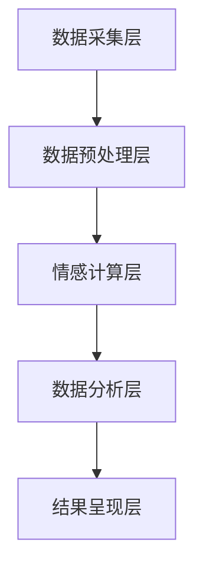

# 开发AI Agent的情感计算在社交媒体分析中的应用

> 关键词：AI Agent、情感计算、社交媒体分析、自然语言处理、机器学习、数据挖掘、舆情监测

> 摘要：本文聚焦于开发AI Agent的情感计算在社交媒体分析中的应用。首先介绍了相关背景，包括目的、预期读者等内容。接着深入阐述了核心概念与联系，如AI Agent、情感计算等概念及其关系，并通过文本示意图和Mermaid流程图进行展示。详细讲解了核心算法原理，以Python代码进行呈现，同时给出相关数学模型和公式。通过项目实战，展示了代码实际案例并进行详细解释。探讨了其在舆情监测、品牌形象塑造等实际应用场景。推荐了学习资源、开发工具框架和相关论文著作。最后总结了未来发展趋势与挑战，还包含常见问题解答和扩展阅读参考资料，旨在全面介绍情感计算在社交媒体分析中的应用，为相关领域的研究和实践提供有价值的参考。

## 1. 背景介绍 
### 1.1 目的和范围
社交媒体已经成为人们生活中不可或缺的一部分，每天都会产生海量的文本数据。这些数据蕴含着丰富的用户情感信息，对企业、政府和社会各界都具有重要价值。开发AI Agent的情感计算在社交媒体分析中的应用，旨在通过技术手段自动识别和分析社交媒体文本中的情感倾向，从而帮助企业了解消费者的需求和满意度，辅助政府进行舆情监测和引导，以及为社会研究提供数据支持。

本文章的范围涵盖了情感计算的基本概念、核心算法、数学模型，以及在社交媒体分析中的具体应用场景。同时，还会介绍相关的开发工具、学习资源和研究成果，为读者提供一个全面的技术参考。

### 1.2 预期读者
本文预期读者包括但不限于以下几类人群：
- **技术开发者**：对AI Agent、情感计算和自然语言处理技术感兴趣，希望深入了解相关算法和实现细节，以便在实际项目中应用。
- **市场营销人员**：希望通过社交媒体分析了解消费者的情感和需求，从而制定更有效的营销策略，提升品牌形象和市场竞争力。
- **政府工作人员**：负责舆情监测和社会稳定工作，需要借助情感计算技术及时掌握公众的情绪和态度，为政策制定和决策提供依据。
- **科研人员**：从事人工智能、自然语言处理、社会科学等领域的研究，希望从本文中获取相关的研究思路和方法，推动该领域的学术发展。

### 1.3 文档结构概述
本文将按照以下结构进行组织：
- **核心概念与联系**：介绍AI Agent、情感计算和社交媒体分析的基本概念，以及它们之间的关系，并通过文本示意图和Mermaid流程图进行展示。
- **核心算法原理 & 具体操作步骤**：详细讲解情感计算的核心算法，如机器学习算法和深度学习算法，并使用Python代码进行实现。
- **数学模型和公式 & 详细讲解 & 举例说明**：给出情感计算的数学模型和公式，对其进行详细讲解，并通过具体例子进行说明。
- **项目实战：代码实际案例和详细解释说明**：通过一个实际的项目案例，展示如何使用Python代码实现情感计算在社交媒体分析中的应用，并对代码进行详细解释。
- **实际应用场景**：探讨情感计算在社交媒体分析中的具体应用场景，如舆情监测、品牌形象塑造、产品推荐等。
- **工具和资源推荐**：推荐相关的学习资源、开发工具框架和论文著作，帮助读者进一步深入学习和研究。
- **总结：未来发展趋势与挑战**：总结情感计算在社交媒体分析中的应用现状，分析未来的发展趋势和面临的挑战。
- **附录：常见问题与解答**：解答读者在学习和实践过程中可能遇到的常见问题。
- **扩展阅读 & 参考资料**：提供相关的扩展阅读材料和参考资料，方便读者进一步查阅。

### 1.4 术语表
#### 1.4.1 核心术语定义
- **AI Agent（人工智能智能体）**：是一种能够感知环境、做出决策并采取行动的智能实体，它可以通过学习和推理来实现特定的任务。
- **情感计算**：是指通过计算机技术对人类情感进行识别、分析、理解和表达的过程，旨在让计算机能够感知和处理人类的情感信息。
- **社交媒体分析**：是指对社交媒体平台上的文本、图像、视频等数据进行收集、整理、分析和挖掘，以获取有价值的信息和知识。
- **自然语言处理（NLP）**：是指计算机科学与语言学的交叉领域，旨在让计算机能够理解和处理人类语言，包括文本分类、情感分析、机器翻译等任务。
- **机器学习**：是一门多领域交叉学科，涉及概率论、统计学、逼近论、凸分析、算法复杂度理论等多门学科。它专门研究计算机怎样模拟或实现人类的学习行为，以获取新的知识或技能，重新组织已有的知识结构使之不断改善自身的性能。

#### 1.4.2 相关概念解释
- **情感倾向**：是指文本中表达的积极、消极或中性的情感态度。
- **语料库**：是指用于训练和测试机器学习模型的文本数据集，通常包含大量的标注数据。
- **特征提取**：是指从文本数据中提取出能够反映文本特征的信息，如词频、词性、句法结构等。
- **模型训练**：是指使用标注好的语料库对机器学习模型进行训练，使其能够学习到文本数据中的模式和规律。
- **模型评估**：是指使用测试数据集对训练好的模型进行评估，以衡量模型的性能和准确性。

#### 1.4.3 缩略词列表
- **NLP**：Natural Language Processing（自然语言处理）
- **ML**：Machine Learning（机器学习）
- **DL**：Deep Learning（深度学习）
- **SVM**：Support Vector Machine（支持向量机）
- **CNN**：Convolutional Neural Network（卷积神经网络）
- **LSTM**：Long Short - Term Memory（长短期记忆网络）

## 2. 核心概念与联系 
### 核心概念原理
#### AI Agent
AI Agent是一种具有自主性、反应性、社会性和适应性的智能实体。自主性是指AI Agent能够在没有人类干预的情况下自主地感知环境、做出决策并采取行动；反应性是指AI Agent能够对环境中的变化做出及时的反应；社会性是指AI Agent能够与其他智能体进行交互和协作；适应性是指AI Agent能够通过学习和经验不断调整自己的行为和策略。

在社交媒体分析中，AI Agent可以作为一个自动化的分析工具，负责收集、处理和分析社交媒体数据。它可以通过网络爬虫技术从社交媒体平台上收集用户的文本数据，然后使用自然语言处理和情感计算技术对这些数据进行分析，提取出有用的信息和知识。

#### 情感计算
情感计算的核心思想是将人类的情感信息转化为计算机能够处理的数字信息，从而实现对情感的识别、分析、理解和表达。情感计算主要涉及以下几个方面：
- **情感识别**：通过分析文本、语音、图像等数据，识别出其中包含的情感信息，如积极、消极或中性情感。
- **情感分析**：对识别出的情感信息进行深入分析，了解情感的强度、原因和影响等。
- **情感理解**：结合上下文和背景知识，理解情感信息的含义和意图。
- **情感表达**：将计算机处理后的情感信息以合适的方式表达出来，如文本、语音、图像等。

#### 社交媒体分析
社交媒体分析是指对社交媒体平台上的各种数据进行收集、整理、分析和挖掘，以获取有价值的信息和知识。社交媒体分析主要包括以下几个方面：
- **数据收集**：通过网络爬虫技术从社交媒体平台上收集用户的文本、图像、视频等数据。
- **数据预处理**：对收集到的数据进行清洗、降噪、分词等处理，以便后续的分析和挖掘。
- **数据分析**：使用自然语言处理、机器学习、数据挖掘等技术对预处理后的数据进行分析，提取出有用的信息和知识。
- **结果呈现**：将分析结果以图表、报表、可视化等方式呈现出来，以便用户直观地了解和理解。

### 架构的文本示意图
AI Agent的情感计算在社交媒体分析中的应用架构主要包括以下几个部分：
1. **数据采集层**：通过网络爬虫技术从社交媒体平台上收集用户的文本数据。
2. **数据预处理层**：对收集到的数据进行清洗、降噪、分词、词性标注等处理，将文本数据转化为计算机能够处理的数字特征。
3. **情感计算层**：使用机器学习、深度学习等算法对预处理后的数据进行情感分析，识别出文本中的情感倾向。
4. **数据分析层**：对情感分析结果进行进一步的分析和挖掘，如统计分析、关联分析、聚类分析等，以获取更有价值的信息和知识。
5. **结果呈现层**：将分析结果以图表、报表、可视化等方式呈现出来，以便用户直观地了解和理解。

### Mermaid 流程图


## 3. 核心算法原理 & 具体操作步骤 
### 机器学习算法 - 支持向量机（SVM）
支持向量机是一种常用的机器学习算法，用于分类和回归分析。在情感计算中，SVM可以用于文本分类，将文本分为积极、消极或中性情感。

#### 算法原理
SVM的核心思想是在特征空间中找到一个最优的超平面，使得不同类别的样本能够被最大程度地分开。具体来说，SVM通过求解一个二次规划问题来找到最优的超平面，该问题的目标是最大化分类间隔，同时满足分类的约束条件。

#### Python源代码实现
```python
from sklearn.feature_extraction.text import TfidfVectorizer
from sklearn.svm import SVC
from sklearn.model_selection import train_test_split
from sklearn.metrics import accuracy_score

# 示例数据
corpus = [
    "这部电影太棒了，我非常喜欢！",
    "这个产品质量太差了，我很失望。",
    "今天天气不错，心情也很好。",
    "这个服务太糟糕了，再也不会来了。"
]
labels = [1, 0, 1, 0]  # 1表示积极，0表示消极

# 数据预处理 - 特征提取
vectorizer = TfidfVectorizer()
X = vectorizer.fit_transform(corpus)

# 划分训练集和测试集
X_train, X_test, y_train, y_test = train_test_split(X, labels, test_size=0.2, random_state=42)

# 训练SVM模型
model = SVC(kernel='linear')
model.fit(X_train, y_train)

# 预测
y_pred = model.predict(X_test)

# 评估模型
accuracy = accuracy_score(y_test, y_pred)
print(f"模型准确率: {accuracy}")
```

### 深度学习算法 - 卷积神经网络（CNN）
卷积神经网络是一种专门用于处理具有网格结构数据的深度学习算法，如图像、文本等。在情感计算中，CNN可以用于文本分类，通过卷积层、池化层和全连接层来提取文本的特征，从而实现情感分析。

#### 算法原理
CNN的核心思想是通过卷积层对输入数据进行卷积操作，提取数据的局部特征。然后通过池化层对卷积层的输出进行下采样，减少数据的维度。最后通过全连接层将池化层的输出进行分类。

#### Python源代码实现
```python
import numpy as np
from tensorflow.keras.preprocessing.text import Tokenizer
from tensorflow.keras.preprocessing.sequence import pad_sequences
from tensorflow.keras.models import Sequential
from tensorflow.keras.layers import Embedding, Conv1D, GlobalMaxPooling1D, Dense

# 示例数据
corpus = [
    "这部电影太棒了，我非常喜欢！",
    "这个产品质量太差了，我很失望。",
    "今天天气不错，心情也很好。",
    "这个服务太糟糕了，再也不会来了。"
]
labels = np.array([1, 0, 1, 0])  # 1表示积极，0表示消极

# 数据预处理
tokenizer = Tokenizer()
tokenizer.fit_on_texts(corpus)
sequences = tokenizer.texts_to_sequences(corpus)
max_length = max([len(seq) for seq in sequences])
X = pad_sequences(sequences, maxlen=max_length)

# 构建CNN模型
model = Sequential()
model.add(Embedding(input_dim=len(tokenizer.word_index) + 1, output_dim=100, input_length=max_length))
model.add(Conv1D(128, 5, activation='relu'))
model.add(GlobalMaxPooling1D())
model.add(Dense(1, activation='sigmoid'))

# 编译模型
model.compile(optimizer='adam', loss='binary_crossentropy', metrics=['accuracy'])

# 训练模型
model.fit(X, labels, epochs=10, batch_size=1)

# 预测
new_text = ["这个产品真的很不错！"]
new_sequence = tokenizer.texts_to_sequences(new_text)
new_padded = pad_sequences(new_sequence, maxlen=max_length)
prediction = model.predict(new_padded)
print(f"预测结果: {prediction}")
```

## 4. 数学模型和公式 & 详细讲解 & 举例说明 
### 支持向量机（SVM）的数学模型
SVM的目标是在特征空间中找到一个最优的超平面，使得不同类别的样本能够被最大程度地分开。对于线性可分的数据集，超平面的方程可以表示为：
$$w^T x + b = 0$$
其中，$w$ 是超平面的法向量，$b$ 是偏置项，$x$ 是样本向量。

SVM的优化目标是最大化分类间隔，分类间隔可以表示为：
$$\frac{2}{\|w\|}$$
同时，需要满足分类的约束条件：
$$y_i(w^T x_i + b) \geq 1, i = 1, 2, \cdots, n$$
其中，$y_i$ 是样本 $x_i$ 的标签，$n$ 是样本的数量。

将上述优化问题转化为拉格朗日对偶问题，可以得到：
$$\max_{\alpha} \sum_{i=1}^{n} \alpha_i - \frac{1}{2} \sum_{i=1}^{n} \sum_{j=1}^{n} \alpha_i \alpha_j y_i y_j x_i^T x_j$$
$$s.t. \sum_{i=1}^{n} \alpha_i y_i = 0$$
$$0 \leq \alpha_i \leq C, i = 1, 2, \cdots, n$$
其中，$\alpha_i$ 是拉格朗日乘子，$C$ 是惩罚参数。

求解上述对偶问题，可以得到最优的拉格朗日乘子 $\alpha^*$，然后可以计算出最优的法向量 $w^*$ 和偏置项 $b^*$：
$$w^* = \sum_{i=1}^{n} \alpha_i^* y_i x_i$$
$$b^* = y_j - w^{*T} x_j$$
其中，$j$ 是任意一个支持向量的索引。

### 举例说明
假设有一个二维数据集，包含两个类别：正类和负类。数据集的样本点如下：
$$x_1 = [3, 3], y_1 = 1$$
$$x_2 = [4, 3], y_2 = 1$$
$$x_3 = [1, 1], y_3 = -1$$

使用SVM求解最优超平面的步骤如下：
1. 构造拉格朗日对偶问题。
2. 求解拉格朗日对偶问题，得到最优的拉格朗日乘子 $\alpha^*$。
3. 计算最优的法向量 $w^*$ 和偏置项 $b^*$。
4. 得到最优超平面的方程。

### 卷积神经网络（CNN）的数学模型
CNN的核心是卷积层，卷积层的输出可以表示为：
$$z_{i,j}^l = \sum_{m=0}^{M-1} \sum_{n=0}^{N-1} w_{m,n}^l x_{i+m,j+n}^{l-1} + b^l$$
其中，$z_{i,j}^l$ 是第 $l$ 层卷积层的输出，$w_{m,n}^l$ 是第 $l$ 层卷积核的权重，$x_{i+m,j+n}^{l-1}$ 是第 $l - 1$ 层的输入，$b^l$ 是偏置项，$M$ 和 $N$ 是卷积核的大小。

在卷积层之后，通常会使用激活函数对输出进行非线性变换，常用的激活函数有ReLU函数：
$$y_{i,j}^l = \max(0, z_{i,j}^l)$$

池化层的作用是对卷积层的输出进行下采样，常用的池化方法有最大池化：
$$p_{i,j}^l = \max_{m,n \in R} y_{i+m,j+n}^l$$
其中，$p_{i,j}^l$ 是第 $l$ 层池化层的输出，$R$ 是池化窗口的大小。

全连接层的输出可以表示为：
$$o_k = \sum_{i=1}^{D} w_{k,i} p_i + b_k$$
其中，$o_k$ 是全连接层的输出，$w_{k,i}$ 是权重，$p_i$ 是池化层的输出，$b_k$ 是偏置项，$D$ 是输入的维度。

### 举例说明
假设有一个输入图像的大小为 $5 \times 5$，卷积核的大小为 $3 \times 3$，步长为 $1$，填充为 $0$。卷积核的权重如下：
$$w = \begin{bmatrix}
1 & 0 & 1 \\
0 & 1 & 0 \\
1 & 0 & 1
\end{bmatrix}$$
输入图像如下：
$$x = \begin{bmatrix}
1 & 2 & 3 & 4 & 5 \\
6 & 7 & 8 & 9 & 10 \\
11 & 12 & 13 & 14 & 15 \\
16 & 17 & 18 & 19 & 20 \\
21 & 22 & 23 & 24 & 25
\end{bmatrix}$$

使用卷积核对输入图像进行卷积操作，得到的输出如下：
$$z = \begin{bmatrix}
22 & 30 & 38 \\
54 & 62 & 70 \\
86 & 94 & 102
\end{bmatrix}$$

然后使用ReLU函数对输出进行非线性变换，得到的结果如下：
$$y = \begin{bmatrix}
22 & 30 & 38 \\
54 & 62 & 70 \\
86 & 94 & 102
\end{bmatrix}$$

最后使用最大池化方法对输出进行下采样，池化窗口的大小为 $2 \times 2$，步长为 $2$，得到的结果如下：
$$p = \begin{bmatrix}
62 & 70 \\
94 & 102
\end{bmatrix}$$

## 5. 项目实战：代码实际案例和详细解释说明 
### 5.1  开发环境搭建
#### 安装Python
首先，需要安装Python环境。可以从Python官方网站（https://www.python.org/downloads/） 下载适合自己操作系统的Python版本，并按照安装向导进行安装。

#### 安装必要的库
在项目中，需要使用一些Python库，如`numpy`、`pandas`、`scikit-learn`、`tensorflow`等。可以使用`pip`命令进行安装：
```sh
pip install numpy pandas scikit-learn tensorflow
```

### 5.2  源代码详细实现和代码解读
#### 数据收集
使用`requests`库和`BeautifulSoup`库从社交媒体平台上收集用户的文本数据。以下是一个简单的示例代码：
```python
import requests
from bs4 import BeautifulSoup

url = 'https://example.com'  # 替换为实际的社交媒体页面URL
response = requests.get(url)
soup = BeautifulSoup(response.text, 'html.parser')

# 提取文本数据
texts = []
for element in soup.find_all('p'):
    texts.append(element.text)

print(texts)
```

#### 数据预处理
使用`nltk`库对收集到的文本数据进行预处理，包括分词、去除停用词、词干提取等操作。以下是一个示例代码：
```python
import nltk
from nltk.corpus import stopwords
from nltk.stem import PorterStemmer
from nltk.tokenize import word_tokenize
import string

nltk.download('punkt')
nltk.download('stopwords')

def preprocess_text(text):
    # 转换为小写
    text = text.lower()
    # 去除标点符号
    text = text.translate(str.maketrans('', '', string.punctuation))
    # 分词
    tokens = word_tokenize(text)
    # 去除停用词
    stop_words = set(stopwords.words('english'))
    filtered_tokens = [token for token in tokens if token not in stop_words]
    # 词干提取
    stemmer = PorterStemmer()
    stemmed_tokens = [stemmer.stem(token) for token in filtered_tokens]
    # 合并为文本
    preprocessed_text = ' '.join(stemmed_tokens)
    return preprocessed_text

# 示例数据
texts = ["This is a sample sentence.", "Another sample sentence here."]
preprocessed_texts = [preprocess_text(text) for text in texts]
print(preprocessed_texts)
```

#### 情感分析
使用`scikit-learn`库中的支持向量机（SVM）模型进行情感分析。以下是一个示例代码：
```python
from sklearn.feature_extraction.text import TfidfVectorizer
from sklearn.svm import SVC
from sklearn.model_selection import train_test_split
from sklearn.metrics import accuracy_score

# 示例数据
corpus = [
    "This movie is great! I really like it.",
    "This product is terrible. I'm very disappointed.",
    "The weather is nice today. I'm in a good mood.",
    "The service is so bad. I'll never come again."
]
labels = [1, 0, 1, 0]  # 1表示积极，0表示消极

# 数据预处理 - 特征提取
vectorizer = TfidfVectorizer()
X = vectorizer.fit_transform(corpus)

# 划分训练集和测试集
X_train, X_test, y_train, y_test = train_test_split(X, labels, test_size=0.2, random_state=42)

# 训练SVM模型
model = SVC(kernel='linear')
model.fit(X_train, y_train)

# 预测
y_pred = model.predict(X_test)

# 评估模型
accuracy = accuracy_score(y_test, y_pred)
print(f"模型准确率: {accuracy}")
```

### 5.3  代码解读与分析
#### 数据收集
使用`requests`库发送HTTP请求获取社交媒体页面的HTML内容，然后使用`BeautifulSoup`库解析HTML内容，提取出文本数据。

#### 数据预处理
首先将文本转换为小写，去除标点符号，然后使用`nltk`库进行分词、去除停用词和词干提取操作，最后将处理后的词合并为文本。

#### 情感分析
使用`TfidfVectorizer`将文本数据转换为TF-IDF特征向量，然后使用`train_test_split`函数将数据集划分为训练集和测试集。使用`SVC`模型进行训练，并使用`predict`方法进行预测，最后使用`accuracy_score`函数评估模型的准确率。

## 6. 实际应用场景 
### 舆情监测
政府和相关部门可以使用AI Agent的情感计算技术对社交媒体上的舆情信息进行实时监测和分析。通过识别公众的情感倾向，及时掌握社会热点事件和公众的情绪变化，以便采取相应的措施进行引导和处理，维护社会稳定。

### 品牌形象塑造
企业可以通过分析社交媒体上用户对品牌的评价和情感倾向，了解消费者的需求和满意度，及时发现品牌存在的问题和不足。根据分析结果，企业可以制定相应的营销策略，提升品牌形象和市场竞争力。

### 产品推荐
电商平台可以根据用户在社交媒体上的情感表达和偏好，为用户推荐符合其需求和兴趣的产品。通过个性化的产品推荐，提高用户的购买转化率和满意度。

### 市场调研
企业可以利用社交媒体分析了解市场趋势和消费者需求，为产品研发和市场推广提供参考依据。通过分析用户的情感和反馈，企业可以更好地把握市场动态，优化产品和服务。

## 7. 工具和资源推荐
### 7.1 学习资源推荐
#### 7.1.1 书籍推荐
- 《Python自然语言处理》：介绍了Python在自然语言处理领域的应用，包括文本预处理、情感分析、信息提取等内容。
- 《深度学习》：深度学习领域的经典著作，详细介绍了深度学习的基本原理、算法和应用。
- 《机器学习》：全面介绍了机器学习的基本概念、算法和模型，是机器学习领域的入门经典。

#### 7.1.2 在线课程
- Coursera上的“Natural Language Processing Specialization”：由斯坦福大学教授授课，系统介绍了自然语言处理的基本概念、算法和应用。
- edX上的“Deep Learning Specialization”：由吴恩达教授授课，深入介绍了深度学习的基本原理、算法和应用。
- 中国大学MOOC上的“机器学习”：由周志华教授授课，全面介绍了机器学习的基本概念、算法和模型。

#### 7.1.3 技术博客和网站
- Medium：一个技术博客平台，有很多关于人工智能、自然语言处理和情感计算的优秀文章。
- Towards Data Science：专注于数据科学和机器学习领域的技术博客，提供了很多实用的教程和案例。
- 机器之心：专注于人工智能领域的资讯和技术博客，及时报道人工智能领域的最新研究成果和应用案例。

### 7.2 开发工具框架推荐
#### 7.2.1 IDE和编辑器
- PyCharm：一款功能强大的Python集成开发环境，提供了代码编辑、调试、版本控制等功能。
- Jupyter Notebook：一个交互式的开发环境，适合进行数据探索、模型训练和结果展示。
- Visual Studio Code：一款轻量级的代码编辑器，支持多种编程语言和插件，具有丰富的扩展功能。

#### 7.2.2 调试和性能分析工具
- TensorBoard：TensorFlow提供的可视化工具，可以用于查看模型的训练过程、性能指标和参数分布等信息。
- PyTorch Profiler：PyTorch提供的性能分析工具，可以用于分析模型的运行时间、内存占用等性能指标。
- cProfile：Python自带的性能分析工具，可以用于分析Python代码的运行时间和函数调用关系。

#### 7.2.3 相关框架和库
- TensorFlow：一个开源的深度学习框架，提供了丰富的深度学习模型和工具，支持多种硬件平台。
- PyTorch：一个开源的深度学习框架，具有动态图和静态图两种模式，适合进行研究和开发。
- scikit-learn：一个开源的机器学习库，提供了丰富的机器学习算法和工具，适合进行数据挖掘和分析。
- NLTK：一个开源的自然语言处理库，提供了丰富的自然语言处理工具和语料库，适合进行文本处理和分析。

### 7.3 相关论文著作推荐
#### 7.3.1 经典论文
- “Sentiment Analysis: Mining Opinions, Sentiments, and Emotions”：全面介绍了情感分析的基本概念、算法和应用，是情感分析领域的经典论文。
- “Convolutional Neural Networks for Sentence Classification”：提出了一种基于卷积神经网络的文本分类方法，在情感分析领域取得了很好的效果。
- “Long Short-Term Memory”：介绍了长短期记忆网络（LSTM）的基本原理和应用，是深度学习领域的经典论文。

#### 7.3.2 最新研究成果
- 关注顶级学术会议和期刊，如ACL（Association for Computational Linguistics）、EMNLP（Conference on Empirical Methods in Natural Language Processing）、NeurIPS（Conference on Neural Information Processing Systems）等，及时了解情感计算领域的最新研究成果。

#### 7.3.3 应用案例分析
- 参考一些实际应用案例，了解情感计算在不同领域的应用场景和实现方法。例如，一些企业的技术博客和行业报告中会分享相关的应用案例。

## 8. 总结：未来发展趋势与挑战
### 未来发展趋势
- **多模态情感分析**：未来的情感计算将不仅仅局限于文本分析，还将结合语音、图像、视频等多模态数据进行综合分析，以更全面、准确地识别和理解人类的情感。
- **个性化情感服务**：根据用户的个人特征和偏好，提供个性化的情感服务。例如，为不同用户提供不同风格的情感表达和交互方式，提高用户的满意度和体验感。
- **情感智能体的发展**：AI Agent将具备更强的情感理解和表达能力，能够与人类进行更加自然、高效的情感交互。例如，情感陪伴机器人、智能客服等将得到更广泛的应用。
- **跨语言情感分析**：随着全球化的发展，跨语言的情感分析需求将越来越大。未来的情感计算技术将能够处理多种语言的文本数据，实现跨语言的情感分析和交流。

### 挑战
- **情感标注的主观性**：情感标注是情感计算的基础，但情感是一种主观的心理状态，不同的人对同一文本的情感理解可能存在差异。因此，如何提高情感标注的准确性和一致性是一个挑战。
- **数据的多样性和复杂性**：社交媒体数据具有多样性和复杂性的特点，包括语言的多样性、文本的不规范性、噪声数据的存在等。如何有效地处理这些数据，提取出有用的情感信息是一个挑战。
- **模型的可解释性**：深度学习模型在情感计算中取得了很好的效果，但这些模型往往是黑盒模型，难以解释其决策过程和结果。如何提高模型的可解释性，让用户更好地理解和信任模型是一个挑战。
- **隐私和安全问题**：情感计算涉及到用户的个人情感信息，这些信息属于敏感信息，需要保护用户的隐私和安全。如何在情感计算过程中有效地保护用户的隐私和安全是一个挑战。

## 9. 附录：常见问题与解答
### 问题1：情感计算的准确率有多高？
情感计算的准确率受到多种因素的影响，如数据质量、模型选择、特征提取方法等。一般来说，在特定的数据集和任务下，情感计算的准确率可以达到70% - 90%左右。但在实际应用中，由于数据的多样性和复杂性，准确率可能会有所下降。

### 问题2：如何选择合适的情感计算模型？
选择合适的情感计算模型需要考虑多个因素，如数据规模、数据类型、任务复杂度等。如果数据规模较小，可以选择传统的机器学习模型，如支持向量机、朴素贝叶斯等；如果数据规模较大，可以选择深度学习模型，如卷积神经网络、长短期记忆网络等。同时，还需要根据具体的任务需求和数据特点进行模型的调优和优化。

### 问题3：情感计算可以处理哪些类型的数据？
情感计算可以处理多种类型的数据，包括文本、语音、图像、视频等。不同类型的数据需要采用不同的处理方法和技术。例如，对于文本数据，可以使用自然语言处理技术进行分词、词性标注、情感分析等；对于语音数据，可以使用语音识别技术将语音转换为文本，然后进行情感分析。

### 问题4：如何提高情感计算的性能？
可以从以下几个方面提高情感计算的性能：
- **数据预处理**：对数据进行清洗、降噪、分词、去除停用词等预处理操作，提高数据的质量。
- **特征提取**：选择合适的特征提取方法，提取出能够反映文本情感信息的特征。
- **模型选择和调优**：选择合适的情感计算模型，并对模型进行调优和优化，提高模型的性能。
- **多模型融合**：将多个不同的情感计算模型进行融合，综合利用各个模型的优势，提高情感计算的准确率。

## 10. 扩展阅读 & 参考资料
### 扩展阅读
- 《情感计算》：深入介绍了情感计算的基本原理、技术和应用，是情感计算领域的经典著作。
- 《人工智能时代的情感交互》：探讨了人工智能时代情感交互的重要性和发展趋势，提供了很多有价值的思考和观点。
- 《社交媒体数据分析》：全面介绍了社交媒体数据分析的方法和技术，包括数据收集、预处理、分析和可视化等内容。

### 参考资料
- 相关学术论文和研究报告，可以在学术数据库如IEEE Xplore、ACM Digital Library、Google Scholar等中查找。
- 相关技术文档和官方网站，如TensorFlow、PyTorch、scikit-learn等框架的官方文档。
- 开源项目和代码库，如GitHub上的相关项目，可以参考和学习他人的实现方法和经验。