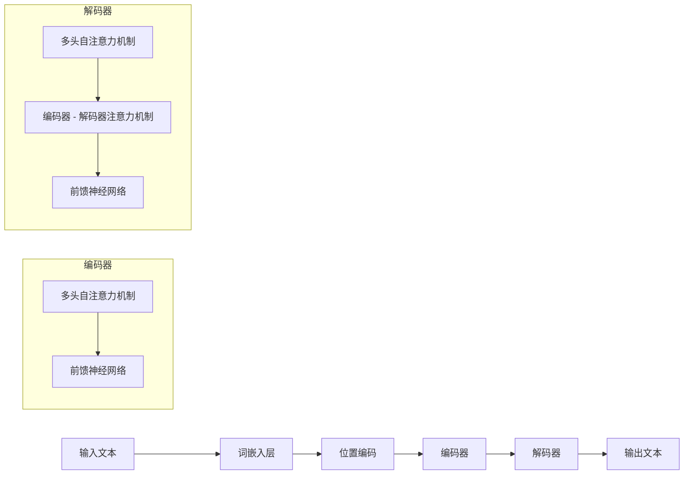

# 开发AI Agent的文本生成能力

> 关键词：AI Agent、文本生成、自然语言处理、深度学习、语言模型、Transformer、文本质量评估

> 摘要：本文围绕开发AI Agent的文本生成能力展开，深入探讨了相关核心概念、算法原理、数学模型等内容。通过详细的Python代码示例和项目实战，阐述了如何实现文本生成功能。同时介绍了其实际应用场景、相关工具和资源推荐。最后对未来发展趋势与挑战进行总结，并提供常见问题解答和扩展阅读参考资料，旨在为开发者和研究人员全面理解和开发AI Agent的文本生成能力提供有价值的参考。

## 1. 背景介绍 
### 1.1 目的和范围
随着人工智能技术的不断发展，AI Agent在各个领域的应用越来越广泛，其中文本生成能力是其重要的组成部分。开发AI Agent的文本生成能力的目的在于让AI Agent能够根据给定的输入，自动生成自然、流畅且有意义的文本内容。本文章的范围涵盖了从基础概念到实际开发的各个方面，包括核心算法原理、数学模型、项目实战以及应用场景等，旨在为读者提供全面且深入的技术指导。

### 1.2 预期读者
本文预期读者包括对自然语言处理、人工智能领域感兴趣的初学者，希望深入了解AI Agent文本生成技术的开发者，以及从事相关研究的科研人员。

### 1.3 文档结构概述
本文首先介绍背景信息，包括目的、预期读者和文档结构概述等。接着阐述核心概念与联系，包括相关概念的原理和架构。然后详细讲解核心算法原理和具体操作步骤，通过Python代码进行示例。之后介绍数学模型和公式，并举例说明。再通过项目实战展示代码实际案例和详细解释。随后介绍实际应用场景和相关工具与资源推荐。最后总结未来发展趋势与挑战，提供常见问题解答和扩展阅读参考资料。

### 1.4 术语表
#### 1.4.1 核心术语定义
- **AI Agent**：人工智能代理，是一种能够感知环境、进行决策并采取行动以实现特定目标的软件实体。
- **文本生成**：指计算机系统根据输入信息自动生成自然语言文本的过程。
- **语言模型**：用于对语言进行建模，预测下一个词出现的概率的模型。
- **Transformer**：一种基于自注意力机制的深度学习模型架构，在自然语言处理领域取得了显著成果。

#### 1.4.2 相关概念解释
- **自然语言处理（NLP）**：研究如何让计算机理解和处理人类语言的领域，文本生成是其重要的应用之一。
- **深度学习**：一种基于人工神经网络的机器学习方法，在处理复杂的自然语言任务中表现出色。

#### 1.4.3 缩略词列表
- **NLP**：Natural Language Processing（自然语言处理）
- **RNN**：Recurrent Neural Network（循环神经网络）
- **LSTM**：Long Short - Term Memory（长短期记忆网络）
- **GPT**：Generative Pretrained Transformer（生成式预训练Transformer）

## 2. 核心概念与联系 

### 2.1 文本生成的基本原理
文本生成的基本思想是根据输入的上下文信息，预测下一个词或字符，然后逐步生成完整的文本。这通常基于语言模型，语言模型会学习大量文本数据中的语言模式和规律，从而能够根据给定的输入生成合理的后续文本。

### 2.2 核心架构：Transformer
Transformer是一种非常强大的深度学习模型架构，它主要由编码器和解码器组成。编码器负责对输入的文本进行特征提取和编码，解码器则根据编码器的输出和之前生成的文本，逐步生成后续的文本。

以下是Transformer架构的文本示意图：
```plaintext
输入文本 -> 词嵌入层 -> 位置编码 -> 编码器（多头自注意力机制、前馈神经网络） -> 解码器（多头自注意力机制、编码器 - 解码器注意力机制、前馈神经网络） -> 输出文本
```

以下是Transformer架构的Mermaid流程图：


### 2.3 语言模型与文本生成的联系
语言模型为文本生成提供了概率分布，通过采样或选择概率最大的词等策略，从语言模型的概率分布中生成文本。不同的语言模型在文本生成的效果和效率上可能会有所差异。

## 3. 核心算法原理 & 具体操作步骤 

### 3.1 基于循环神经网络（RNN）的文本生成原理
RNN是一种能够处理序列数据的神经网络，它通过隐藏状态在时间步之间传递信息，从而对序列中的上下文信息进行建模。以下是一个简单的RNN文本生成的Python代码示例：

```python
import numpy as np
import tensorflow as tf
from tensorflow.keras.layers import SimpleRNN, Dense
from tensorflow.keras.models import Sequential

# 准备数据
text = "hello world"
vocab = sorted(set(text))
char_to_idx = {char: idx for idx, char in enumerate(vocab)}
idx_to_char = {idx: char for idx, char in enumerate(vocab)}

input_text = [char_to_idx[char] for char in text[:-1]]
target_text = [char_to_idx[char] for char in text[1:]]

input_text = np.array(input_text).reshape(-1, 1)
target_text = np.array(target_text)

# 构建模型
model = Sequential([
    SimpleRNN(64, input_shape=(1, 1)),
    Dense(len(vocab), activation='softmax')
])

# 编译模型
model.compile(optimizer='adam', loss='sparse_categorical_crossentropy')

# 训练模型
model.fit(input_text, target_text, epochs=100)

# 生成文本
start_char = 'h'
generated_text = start_char
current_char = char_to_idx[start_char]
for _ in range(10):
    next_char_probs = model.predict(np.array([[current_char]]))
    next_char_idx = np.argmax(next_char_probs)
    next_char = idx_to_char[next_char_idx]
    generated_text += next_char
    current_char = next_char_idx

print(generated_text)
```

### 3.2 基于Transformer的文本生成原理
Transformer通过自注意力机制能够更好地捕捉序列中的长距离依赖关系。以下是一个简化的基于Transformer的文本生成的Python代码示例：

```python
import tensorflow as tf
from tensorflow.keras.layers import Dense, Embedding, MultiHeadAttention
from tensorflow.keras.layers import LayerNormalization, Input
from tensorflow.keras.models import Model

# 定义Transformer解码器层
class TransformerDecoderLayer(tf.keras.layers.Layer):
    def __init__(self, d_model, num_heads, dff, rate=0.1):
        super(TransformerDecoderLayer, self).__init__()

        self.mha1 = MultiHeadAttention(num_heads=num_heads, key_dim=d_model)
        self.mha2 = MultiHeadAttention(num_heads=num_heads, key_dim=d_model)

        self.ffn = tf.keras.Sequential([
            Dense(dff, activation='relu'),
            Dense(d_model)
        ])

        self.layernorm1 = LayerNormalization(epsilon=1e-6)
        self.layernorm2 = LayerNormalization(epsilon=1e-6)
        self.layernorm3 = LayerNormalization(epsilon=1e-6)

        self.dropout1 = tf.keras.layers.Dropout(rate)
        self.dropout2 = tf.keras.layers.Dropout(rate)
        self.dropout3 = tf.keras.layers.Dropout(rate)

    def call(self, x, enc_output, training,
             look_ahead_mask, padding_mask):
        attn1 = self.mha1(x, x, x, look_ahead_mask)
        attn1 = self.dropout1(attn1, training=training)
        out1 = self.layernorm1(attn1 + x)

        attn2 = self.mha2(out1, enc_output, enc_output, padding_mask)
        attn2 = self.dropout2(attn2, training=training)
        out2 = self.layernorm2(attn2 + out1)

        ffn_output = self.ffn(out2)
        ffn_output = self.dropout3(ffn_output, training=training)
        out3 = self.layernorm3(ffn_output + out2)

        return out3

# 构建Transformer解码器模型
def build_transformer_decoder_model(vocab_size, d_model, num_heads, dff, num_layers):
    inputs = Input(shape=(None,))
    embedding = Embedding(vocab_size, d_model)(inputs)
    x = embedding
    for _ in range(num_layers):
        x = TransformerDecoderLayer(d_model, num_heads, dff)(x, None, True, None, None)
    outputs = Dense(vocab_size, activation='softmax')(x)
    model = Model(inputs=inputs, outputs=outputs)
    return model

# 示例使用
vocab_size = 100
d_model = 128
num_heads = 8
dff = 512
num_layers = 2

model = build_transformer_decoder_model(vocab_size, d_model, num_heads, dff, num_layers)
model.summary()
```

### 3.3 具体操作步骤
1. **数据准备**：收集和整理用于训练的文本数据，对数据进行预处理，如分词、构建词汇表等。
2. **模型选择和构建**：根据任务需求选择合适的模型架构，如RNN、Transformer等，并构建相应的模型。
3. **模型训练**：使用准备好的数据对模型进行训练，设置合适的训练参数，如学习率、批次大小、训练轮数等。
4. **文本生成**：在训练好的模型上，根据输入的上下文信息生成文本。可以采用不同的生成策略，如贪婪搜索、束搜索等。

## 4. 数学模型和公式 & 详细讲解 & 举例说明 

### 4.1 语言模型的数学定义
语言模型的目标是计算给定文本序列 $w_1, w_2, \cdots, w_T$ 的概率 $P(w_1, w_2, \cdots, w_T)$。根据链式法则，这个概率可以表示为：
$$P(w_1, w_2, \cdots, w_T) = \prod_{t=1}^{T} P(w_t | w_1, w_2, \cdots, w_{t - 1})$$

### 4.2 自注意力机制的数学公式
自注意力机制通过计算查询（Query）、键（Key）和值（Value）之间的相似度来确定每个位置的权重。具体公式如下：
- 计算注意力分数：
$$\text{Attention}(Q, K, V) = \text{softmax}\left(\frac{QK^T}{\sqrt{d_k}}\right)V$$
其中，$Q$ 是查询矩阵，$K$ 是键矩阵，$V$ 是值矩阵，$d_k$ 是键的维度。

### 4.3 举例说明
假设我们有一个简单的文本序列 `["the", "cat", "runs"]`，语言模型需要计算 $P(\text{"the"}, \text{"cat"}, \text{"runs"})$。根据链式法则：
$$P(\text{"the"}, \text{"cat"}, \text{"runs"}) = P(\text{"the"}) \times P(\text{"cat"} | \text{"the"}) \times P(\text{"runs"} | \text{"the"}, \text{"cat"})$$

对于自注意力机制，假设 $Q$、$K$ 和 $V$ 都是 $3 \times 5$ 的矩阵（$d_k = 5$），则注意力分数的计算过程如下：
1. 计算 $QK^T$，得到一个 $3 \times 3$ 的矩阵。
2. 将 $QK^T$ 除以 $\sqrt{d_k}=\sqrt{5}$。
3. 对结果应用 softmax 函数，得到注意力权重矩阵。
4. 将注意力权重矩阵与 $V$ 相乘，得到最终的注意力输出。

## 5. 项目实战：代码实际案例和详细解释说明 

### 5.1  开发环境搭建
1. **安装Python**：推荐使用Python 3.7及以上版本，可以从Python官方网站下载并安装。
2. **安装深度学习框架**：选择合适的深度学习框架，如TensorFlow或PyTorch。以TensorFlow为例，可以使用以下命令进行安装：
```sh
pip install tensorflow
```
3. **安装相关库**：根据项目需求，安装其他相关库，如NumPy、Pandas等。
```sh
pip install numpy pandas
```

### 5.2  源代码详细实现和代码解读
以下是一个基于GPT - 2模型的文本生成项目示例：

```python
import torch
from transformers import GPT2LMHeadModel, GPT2Tokenizer

# 加载预训练的GPT - 2模型和分词器
tokenizer = GPT2Tokenizer.from_pretrained('gpt2')
model = GPT2LMHeadModel.from_pretrained('gpt2')

# 输入文本
input_text = "Once upon a time"

# 对输入文本进行分词
input_ids = tokenizer.encode(input_text, return_tensors='pt')

# 生成文本
output = model.generate(input_ids, max_length=100, num_beams=5, no_repeat_ngram_size=2, early_stopping=True)

# 解码生成的文本
generated_text = tokenizer.decode(output[0], skip_special_tokens=True)

print(generated_text)
```

### 5.3  代码解读与分析
1. **加载预训练模型和分词器**：使用 `transformers` 库加载预训练的GPT - 2模型和对应的分词器。
2. **输入文本处理**：将输入的文本使用分词器进行分词，并转换为模型可以接受的张量形式。
3. **文本生成**：调用模型的 `generate` 方法生成文本，设置了一些生成参数，如最大长度、束搜索的束数、避免重复的n - gram大小等。
4. **解码生成的文本**：将生成的张量形式的文本使用分词器进行解码，得到最终的自然语言文本。

## 6. 实际应用场景 
### 6.1 内容创作
AI Agent的文本生成能力可以用于自动写作文章、故事、诗歌等，帮助作家和内容创作者提高创作效率。例如，一些新闻媒体使用AI生成简单的新闻报道，快速提供信息。

### 6.2 对话系统
在聊天机器人、智能客服等对话系统中，文本生成能力可以使AI Agent根据用户的输入生成自然流畅的回复，提高用户体验。

### 6.3 机器翻译
文本生成技术在机器翻译中也有重要应用，通过生成目标语言的文本，实现不同语言之间的翻译。

### 6.4 智能摘要
自动生成文本的摘要，帮助用户快速了解文本的核心内容，如在文档处理、信息检索等领域有广泛应用。

## 7. 工具和资源推荐
### 7.1 学习资源推荐
#### 7.1.1 书籍推荐
- 《深度学习》（Deep Learning）：由Ian Goodfellow、Yoshua Bengio和Aaron Courville所著，是深度学习领域的经典教材。
- 《自然语言处理入门》：介绍了自然语言处理的基本概念和方法，适合初学者。
- 《Attention Is All You Need》：Transformer模型的原始论文，深入理解Transformer架构的必读文献。

#### 7.1.2 在线课程
- Coursera上的“Natural Language Processing Specialization”：由顶尖大学的教授授课，系统地介绍了自然语言处理的各个方面。
- edX上的“Deep Learning for Natural Language Processing”：深入讲解了深度学习在自然语言处理中的应用。

#### 7.1.3 技术博客和网站
- Hugging Face博客：提供了关于Transformer模型和自然语言处理的最新研究成果和实践经验。
- Medium上的自然语言处理相关专栏：有很多优秀的技术文章和案例分享。

### 7.2 开发工具框架推荐
#### 7.2.1 IDE和编辑器
- PyCharm：功能强大的Python集成开发环境，提供了代码编辑、调试、版本控制等功能。
- Visual Studio Code：轻量级的代码编辑器，支持多种编程语言和插件扩展。

#### 7.2.2 调试和性能分析工具
- TensorBoard：TensorFlow的可视化工具，用于查看模型的训练过程、性能指标等。
- PyTorch Profiler：用于分析PyTorch模型的性能瓶颈，优化模型运行效率。

#### 7.2.3 相关框架和库
- Transformers：Hugging Face开发的库，提供了多种预训练的语言模型和工具，方便进行文本生成等任务。
- NLTK：自然语言工具包，包含了多种自然语言处理的工具和数据集。

### 7.3 相关论文著作推荐
#### 7.3.1 经典论文
- 《A Neural Probabilistic Language Model》：提出了神经网络语言模型的概念，为后续的语言模型发展奠定了基础。
- 《Long Short - Term Memory》：介绍了长短期记忆网络（LSTM），解决了传统RNN的梯度消失问题。

#### 7.3.2 最新研究成果
- 关注顶级学术会议，如ACL（Association for Computational Linguistics）、EMNLP（Conference on Empirical Methods in Natural Language Processing）等，了解最新的自然语言处理研究成果。

#### 7.3.3 应用案例分析
- 一些科技公司的博客和技术报告，会分享他们在实际项目中应用文本生成技术的案例和经验。

## 8. 总结：未来发展趋势与挑战
### 8.1 未来发展趋势
- **多模态文本生成**：结合图像、音频等多种模态信息，生成更加丰富和生动的文本内容。
- **个性化文本生成**：根据用户的偏好和历史数据，生成个性化的文本，提高用户满意度。
- **低资源语言的文本生成**：关注低资源语言的文本生成研究，促进语言的多样性和文化的传播。

### 8.2 挑战
- **文本质量评估**：目前缺乏统一、有效的文本质量评估标准和方法，难以准确衡量生成文本的质量。
- **伦理和安全问题**：文本生成技术可能被用于生成虚假信息、恶意内容等，需要解决相关的伦理和安全问题。
- **计算资源需求**：训练和运行大型的语言模型需要大量的计算资源，如何降低计算成本是一个挑战。

## 9. 附录：常见问题与解答
### 9.1 如何选择合适的文本生成模型？
需要考虑任务需求、数据规模、计算资源等因素。如果数据规模较小，可以选择一些轻量级的模型；如果对生成效果要求较高，可以选择预训练的大型语言模型。

### 9.2 如何提高生成文本的质量？
可以通过增加训练数据、调整模型参数、使用更好的生成策略等方法来提高生成文本的质量。

### 9.3 文本生成技术有哪些局限性？
文本生成技术可能存在生成内容缺乏逻辑、语法错误、重复内容等问题，还可能受到训练数据的偏见影响。

## 10. 扩展阅读 & 参考资料
- 《Natural Language Processing with Python》
- OpenAI官方文档
- Google Research Blog上关于自然语言处理的文章
- 相关学术期刊，如《Journal of Artificial Intelligence Research》《Transactions of the Association for Computational Linguistics》等。