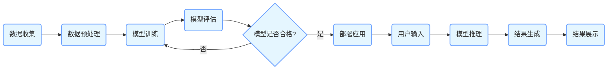

# 开发基于大模型的金融研究方法论评估生成器

> 关键词：大模型、金融研究方法论、评估生成器、自然语言处理、人工智能

> 摘要：本文旨在探讨如何开发基于大模型的金融研究方法论评估生成器。首先介绍了该项目的背景，包括目的、预期读者等内容。接着阐述了核心概念与联系，详细讲解了相关的算法原理、数学模型及公式。通过项目实战给出了代码实际案例及详细解释，分析了其实际应用场景。同时推荐了学习该技术所需的工具和资源，包括书籍、在线课程、开发工具等。最后对未来发展趋势与挑战进行了总结，并提供了常见问题与解答以及扩展阅读和参考资料，为开发基于大模型的金融研究方法论评估生成器提供全面而深入的指导。

## 1. 背景介绍 
### 1.1 目的和范围
在金融领域，研究方法论的科学性和有效性对于准确分析市场、做出合理决策至关重要。传统的金融研究方法论评估往往依赖于专家的主观判断，效率较低且缺乏一致性。开发基于大模型的金融研究方法论评估生成器的目的在于利用先进的人工智能技术，实现对金融研究方法论的自动化、客观化评估，并生成详细的评估报告和改进建议。

本项目的范围涵盖了从数据收集、预处理到模型训练、评估和应用的整个流程。具体包括对各种金融研究方法论的文本数据进行分析，构建合适的大模型来进行评估和生成任务，以及开发相应的软件系统来实现用户交互和功能展示。

### 1.2 预期读者
本文的预期读者包括金融领域的研究人员、分析师、投资经理，以及对人工智能在金融领域应用感兴趣的技术人员和研究学者。对于金融从业者来说，了解如何利用大模型评估金融研究方法论可以提高研究效率和质量；对于技术人员而言，本项目可以作为一个将大模型应用于实际业务场景的案例参考。

### 1.3 文档结构概述
本文将按照以下结构进行组织：首先介绍核心概念与联系，明确相关术语和原理；接着详细阐述核心算法原理和具体操作步骤，包括使用 Python 代码实现；然后讲解数学模型和公式，并通过举例说明；通过项目实战展示代码实际案例和详细解释；分析实际应用场景；推荐相关的工具和资源；最后总结未来发展趋势与挑战，提供常见问题与解答以及扩展阅读和参考资料。

### 1.4 术语表
#### 1.4.1 核心术语定义
- **大模型**：指具有大量参数和强大计算能力的人工智能模型，如 GPT 系列、BERT 等，能够处理复杂的自然语言处理任务。
- **金融研究方法论**：是指在金融研究过程中所采用的方法、原则和程序，包括数据收集、分析方法、模型构建等方面。
- **评估生成器**：是一个软件系统，能够对输入的金融研究方法论进行评估，并生成相应的评估报告和改进建议。

#### 1.4.2 相关概念解释
- **自然语言处理（NLP）**：是人工智能的一个分支，致力于让计算机理解和处理人类语言。在本项目中，NLP 技术用于对金融研究方法论的文本数据进行处理和分析。
- **机器学习**：是一门多领域交叉学科，涉及概率论、统计学、逼近论、凸分析、算法复杂度理论等多门学科。在本项目中，机器学习算法用于训练大模型，使其能够对金融研究方法论进行评估和生成。

#### 1.4.3 缩略词列表
- **NLP**：自然语言处理（Natural Language Processing）
- **GPT**：生成式预训练变换器（Generative Pretrained Transformer）
- **BERT**：基于双向编码器表示的预训练模型（Bidirectional Encoder Representations from Transformers）

## 2. 核心概念与联系 
### 核心概念原理
基于大模型的金融研究方法论评估生成器主要基于自然语言处理和机器学习技术。其核心原理是利用大模型对金融研究方法论的文本数据进行理解和分析，通过学习大量的金融研究案例和评估标准，来判断方法论的合理性、有效性和创新性。

大模型通常采用预训练 - 微调的方式进行训练。在预训练阶段，模型在大规模的文本数据上进行无监督学习，学习语言的通用模式和语义信息。在微调阶段，模型在特定的金融研究方法论数据集上进行有监督学习，使其能够适应具体的评估和生成任务。

### 架构的文本示意图
基于大模型的金融研究方法论评估生成器的架构主要包括数据层、模型层和应用层。

- **数据层**：负责收集和存储金融研究方法论的文本数据，包括研究报告、学术论文、行业文档等。同时，对数据进行预处理，如清洗、标注、分词等，以便模型能够更好地理解和处理。
- **模型层**：采用大模型作为核心处理单元，对预处理后的数据进行分析和评估。模型可以是预训练的语言模型，如 GPT、BERT 等，也可以是根据具体任务定制的模型。在模型训练过程中，使用监督学习或强化学习的方法，不断优化模型的性能。
- **应用层**：提供用户交互界面，用户可以输入金融研究方法论的文本数据，系统将调用模型进行评估和生成，并将结果以可视化的方式展示给用户。同时，应用层还可以提供数据管理、模型管理、结果分析等功能。

### Mermaid 流程图


## 3. 核心算法原理 & 具体操作步骤 
### 核心算法原理
本项目采用的核心算法是基于大模型的文本分类和生成算法。在文本分类方面，使用大模型对金融研究方法论的文本进行特征提取，然后通过分类器判断方法论的质量等级，如优秀、良好、一般、较差等。在文本生成方面，使用大模型根据输入的方法论文本和分类结果，生成相应的评估报告和改进建议。

### Python 源代码详细阐述
以下是一个基于 PyTorch 和 Transformers 库的简单示例代码，用于实现金融研究方法论的分类任务：

```python
import torch
from transformers import AutoTokenizer, AutoModelForSequenceClassification

# 加载预训练模型和分词器
model_name = "bert-base-uncased"
tokenizer = AutoTokenizer.from_pretrained(model_name)
model = AutoModelForSequenceClassification.from_pretrained(model_name, num_labels=4)

# 定义数据集
texts = [
    "这是一个优秀的金融研究方法论，采用了先进的数据分析技术和创新的模型构建方法。",
    "该方法论存在一些问题，数据来源不够可靠，分析方法也比较传统。",
    "方法论的思路比较清晰，但在具体实现上还有待完善。",
    "这个方法论的质量较差，缺乏必要的理论依据和实证分析。"
]
labels = [0, 3, 1, 2]  # 0: 优秀, 1: 良好, 2: 一般, 3: 较差

# 数据预处理
inputs = tokenizer(texts, padding=True, truncation=True, return_tensors="pt")
labels = torch.tensor(labels)

# 训练模型
optimizer = torch.optim.AdamW(model.parameters(), lr=1e-5)
for epoch in range(3):
    outputs = model(**inputs, labels=labels)
    loss = outputs.loss
    loss.backward()
    optimizer.step()
    optimizer.zero_grad()
    print(f"Epoch {epoch + 1}, Loss: {loss.item()}")

# 进行预测
test_text = "这个金融研究方法论的创新性不足，数据处理方法也比较简单。"
test_input = tokenizer(test_text, padding=True, truncation=True, return_tensors="pt")
with torch.no_grad():
    logits = model(**test_input).logits
    predicted_class_id = logits.argmax().item()
    print(f"预测结果: {predicted_class_id}")
```

### 具体操作步骤
1. **数据收集**：收集大量的金融研究方法论的文本数据，可以从学术数据库、行业报告、研究机构网站等渠道获取。
2. **数据预处理**：对收集到的数据进行清洗、标注、分词等处理，将文本数据转换为模型能够处理的格式。
3. **模型选择**：选择合适的大模型，如 GPT、BERT 等，并根据具体任务进行微调。
4. **模型训练**：使用预处理后的数据对模型进行训练，调整模型的参数，使其能够准确地对金融研究方法论进行分类和评估。
5. **模型评估**：使用测试数据集对训练好的模型进行评估，计算模型的准确率、召回率、F1 值等指标，评估模型的性能。
6. **模型部署**：将训练好的模型部署到生产环境中，开发相应的用户界面，实现用户交互和功能展示。

## 4. 数学模型和公式 & 详细讲解 & 举例说明 
### 数学模型
在基于大模型的金融研究方法论评估生成器中，主要涉及到两个数学模型：文本分类模型和文本生成模型。

#### 文本分类模型
文本分类模型通常采用基于深度学习的分类器，如多层感知机（MLP）、卷积神经网络（CNN）、循环神经网络（RNN）等。在本项目中，我们使用大模型作为特征提取器，然后通过一个全连接层进行分类。

假设输入的文本为 $x$，经过大模型处理后得到的特征向量为 $h = f(x)$，其中 $f$ 表示大模型的特征提取函数。分类器的输出为 $y = g(h)$，其中 $g$ 表示分类器的映射函数。最终的分类结果为 $\hat{y} = \arg\max_{i} y_i$，其中 $y_i$ 表示第 $i$ 个类别的得分。

#### 文本生成模型
文本生成模型通常采用基于生成对抗网络（GAN）、变分自编码器（VAE）或基于序列到序列（Seq2Seq）的模型。在本项目中，我们使用基于 Transformer 架构的语言模型进行文本生成。

假设输入的文本为 $x$，模型的目标是生成一个输出文本 $y$。模型通过最大化生成文本的概率 $P(y|x)$ 来进行训练。具体来说，模型的损失函数可以表示为：

$$
L = -\sum_{t=1}^{T} \log P(y_t|y_{<t}, x)
$$

其中 $T$ 表示输出文本的长度，$y_t$ 表示输出文本的第 $t$ 个词，$y_{<t}$ 表示输出文本的前 $t - 1$ 个词。

### 详细讲解
#### 文本分类模型
在文本分类模型中，大模型的作用是提取文本的语义特征。大模型通常由多个 Transformer 层组成，每个 Transformer 层包含多头自注意力机制和前馈神经网络。通过多头自注意力机制，模型可以捕捉文本中不同位置之间的依赖关系，从而更好地理解文本的语义信息。

分类器的作用是将大模型提取的特征向量映射到不同的类别上。通常使用一个全连接层作为分类器，全连接层的输入是大模型的输出特征向量，输出是每个类别的得分。最后，通过 softmax 函数将得分转换为概率分布，选择概率最大的类别作为最终的分类结果。

#### 文本生成模型
在文本生成模型中，基于 Transformer 架构的语言模型通过自回归的方式生成文本。模型从输入文本开始，逐步生成下一个词，直到生成结束符为止。在生成过程中，模型根据当前的输入和已经生成的文本，预测下一个词的概率分布，然后从概率分布中采样得到下一个词。

模型的训练过程是通过最大化生成文本的概率来进行的。具体来说，模型的损失函数是负对数似然损失，即最小化生成文本的负对数概率。通过不断调整模型的参数，使得模型能够生成更合理、更准确的文本。

### 举例说明
假设我们有一个金融研究方法论的文本：“本研究采用了回归分析方法，对市场数据进行了深入分析，得出了一些有价值的结论。”

#### 文本分类
使用文本分类模型对该文本进行分类，首先将文本输入到大模型中，得到特征向量。然后将特征向量输入到分类器中，得到每个类别的得分。假设分类器的输出为 $[0.1, 0.7, 0.1, 0.1]$，表示该文本属于“良好”类别的概率最大，因此最终的分类结果为“良好”。

#### 文本生成
使用文本生成模型根据该文本和分类结果生成评估报告和改进建议。假设生成的评估报告为：“该金融研究方法论采用了回归分析方法，对市场数据进行了深入分析，具有一定的合理性和有效性。但在数据来源和样本选择方面还有待进一步完善。” 改进建议为：“建议扩大数据来源，增加样本数量，以提高研究结果的可靠性。”

## 5. 项目实战：代码实际案例和详细解释说明 
### 5.1  开发环境搭建
#### 安装 Python
首先需要安装 Python 环境，建议使用 Python 3.7 及以上版本。可以从 Python 官方网站（https://www.python.org/downloads/） 下载并安装 Python。

#### 安装依赖库
在项目中，我们需要使用 PyTorch、Transformers、NLTK 等库。可以使用以下命令进行安装：

```bash
pip install torch transformers nltk
```

#### 下载预训练模型
在使用大模型之前，需要下载相应的预训练模型。可以使用 Transformers 库提供的 `from_pretrained` 方法自动下载模型。例如：

```python
from transformers import AutoTokenizer, AutoModelForSequenceClassification

model_name = "bert-base-uncased"
tokenizer = AutoTokenizer.from_pretrained(model_name)
model = AutoModelForSequenceClassification.from_pretrained(model_name, num_labels=4)
```

### 5.2  源代码详细实现和代码解读
以下是一个完整的基于大模型的金融研究方法论评估生成器的代码示例：

```python
import torch
from transformers import AutoTokenizer, AutoModelForSequenceClassification, AutoModelForCausalLM
import nltk
from nltk.tokenize import word_tokenize
nltk.download('punkt')

# 加载分类模型和分词器
classification_model_name = "bert-base-uncased"
classification_tokenizer = AutoTokenizer.from_pretrained(classification_model_name)
classification_model = AutoModelForSequenceClassification.from_pretrained(classification_model_name, num_labels=4)

# 加载生成模型和分词器
generation_model_name = "gpt2"
generation_tokenizer = AutoTokenizer.from_pretrained(generation_model_name)
generation_model = AutoModelForCausalLM.from_pretrained(generation_model_name)

# 定义分类标签
labels = {0: "优秀", 1: "良好", 2: "一般", 3: "较差"}

def classify_methodology(text):
    """
    对金融研究方法论进行分类
    :param text: 金融研究方法论的文本
    :return: 分类结果
    """
    inputs = classification_tokenizer(text, padding=True, truncation=True, return_tensors="pt")
    with torch.no_grad():
        logits = classification_model(**inputs).logits
        predicted_class_id = logits.argmax().item()
        return labels[predicted_class_id]

def generate_report(text, category):
    """
    根据分类结果生成评估报告和改进建议
    :param text: 金融研究方法论的文本
    :param category: 分类结果
    :return: 评估报告和改进建议
    """
    prompt = f"金融研究方法论: {text}\n分类结果: {category}\n评估报告和改进建议: "
    input_ids = generation_tokenizer.encode(prompt, return_tensors="pt")
    output = generation_model.generate(input_ids, max_length=200, num_beams=5, no_repeat_ngram_size=2, early_stopping=True)
    report = generation_tokenizer.decode(output[0], skip_special_tokens=True)
    return report

# 示例文本
methodology_text = "本研究采用了时间序列分析方法，对股票价格进行了预测，取得了较好的效果。"

# 分类
category = classify_methodology(methodology_text)
print(f"分类结果: {category}")

# 生成报告
report = generate_report(methodology_text, category)
print(f"评估报告和改进建议: {report}")
```

### 5.3  代码解读与分析
#### 分类部分
`classify_methodology` 函数用于对金融研究方法论的文本进行分类。首先，使用 `classification_tokenizer` 对输入的文本进行分词和编码，将其转换为模型能够处理的格式。然后，使用 `classification_model` 对编码后的文本进行分类，得到每个类别的得分。最后，选择得分最高的类别作为最终的分类结果。

#### 生成部分
`generate_report` 函数用于根据分类结果生成评估报告和改进建议。首先，构造一个提示文本，包含金融研究方法论的文本和分类结果。然后，使用 `generation_tokenizer` 对提示文本进行编码，将其输入到 `generation_model` 中进行生成。最后，使用 `generation_tokenizer` 对生成的文本进行解码，得到最终的评估报告和改进建议。

#### 整体流程
在主程序中，首先定义了一个示例的金融研究方法论文本。然后，调用 `classify_methodology` 函数对文本进行分类，得到分类结果。最后，调用 `generate_report` 函数根据分类结果生成评估报告和改进建议，并将结果打印输出。

## 6. 实际应用场景 
### 金融研究机构
金融研究机构可以使用基于大模型的金融研究方法论评估生成器来评估内部研究人员的研究成果，提高研究质量和效率。通过自动化的评估和生成功能，研究机构可以快速发现研究方法论中的问题，并提供针对性的改进建议，有助于提升研究团队的整体水平。

### 投资银行
投资银行在进行项目评估和投资决策时，需要对各种金融研究方法论进行深入分析。该评估生成器可以帮助投资银行快速评估研究报告的质量，判断研究结论的可靠性，从而为投资决策提供更科学的依据。

### 监管机构
监管机构可以利用该评估生成器对金融机构的研究报告进行审查，确保其研究方法论符合监管要求。通过对研究方法论的自动化评估，监管机构可以提高审查效率，及时发现潜在的风险和问题，维护金融市场的稳定。

### 学术研究
在学术研究领域，研究人员可以使用该评估生成器来评估自己和他人的研究方法论，促进学术交流和研究方法的改进。同时，该评估生成器也可以为学术期刊的审稿过程提供参考，提高审稿的公正性和准确性。

## 7. 工具和资源推荐
### 7.1 学习资源推荐
#### 7.1.1 书籍推荐
- 《深度学习》（Deep Learning）：由 Ian Goodfellow、Yoshua Bengio 和 Aaron Courville 合著，是深度学习领域的经典教材，全面介绍了深度学习的基本概念、算法和应用。
- 《自然语言处理入门》（Natural Language Processing in Action）：由 Hobson Lane、Cole Howard 和 Hannes Hapke 合著，是一本适合初学者的自然语言处理教材，通过实际案例介绍了自然语言处理的基本技术和方法。
- 《金融科技：应用与创新》（FinTech: Applications and Innovations）：由 David L. Olson 和 Daniel Z. Zhou 合著，介绍了金融科技的最新发展和应用，包括人工智能在金融领域的应用。

#### 7.1.2 在线课程
- Coursera 上的 “Deep Learning Specialization”：由 Andrew Ng 教授授课，是深度学习领域的经典在线课程，涵盖了深度学习的各个方面。
- edX 上的 “Natural Language Processing with Deep Learning”：由 Dan Jurafsky 和 Christopher Manning 教授授课，介绍了自然语言处理的深度学习方法和技术。
- Udemy 上的 “Financial Technology (FinTech) A-Z™: Crypto, AI & Blockchain”：介绍了金融科技的各个领域，包括人工智能在金融领域的应用。

#### 7.1.3 技术博客和网站
- Towards Data Science：是一个专注于数据科学和人工智能的技术博客，提供了大量的技术文章和案例分析。
- Medium：是一个综合性的技术博客平台，有很多关于自然语言处理和金融科技的文章。
- arXiv：是一个预印本论文库，提供了最新的学术研究成果，包括人工智能和金融领域的研究。

### 7.2 开发工具框架推荐
#### 7.2.1 IDE和编辑器
- PyCharm：是一款专业的 Python 集成开发环境，提供了丰富的代码编辑、调试和部署功能。
- Jupyter Notebook：是一个交互式的开发环境，适合进行数据探索和模型训练。
- Visual Studio Code：是一款轻量级的代码编辑器，支持多种编程语言和插件扩展。

#### 7.2.2 调试和性能分析工具
- PyTorch Profiler：是 PyTorch 提供的性能分析工具，可以帮助用户分析模型的性能瓶颈和优化方向。
- TensorBoard：是 TensorFlow 提供的可视化工具，也可以用于 PyTorch 模型的可视化和性能分析。
- cProfile：是 Python 内置的性能分析工具，可以帮助用户分析代码的执行时间和调用关系。

#### 7.2.3 相关框架和库
- PyTorch：是一个开源的深度学习框架，提供了丰富的深度学习模型和工具。
- Transformers：是 Hugging Face 开发的自然语言处理库，提供了大量的预训练模型和工具。
- NLTK：是一个开源的自然语言处理库，提供了丰富的自然语言处理工具和数据集。

### 7.3 相关论文著作推荐
#### 7.3.1 经典论文
- “Attention Is All You Need”：提出了 Transformer 架构，是自然语言处理领域的经典论文。
- “BERT: Pre-training of Deep Bidirectional Transformers for Language Understanding”：介绍了 BERT 模型，是自然语言处理领域的重要突破。
- “Generative Adversarial Nets”：提出了生成对抗网络（GAN），是生成式模型领域的经典论文。

#### 7.3.2 最新研究成果
- 关注 arXiv 上关于自然语言处理和金融科技的最新研究论文，了解该领域的最新发展动态。
- 参加相关的学术会议，如 ACL（Association for Computational Linguistics）、NeurIPS（Neural Information Processing Systems）等，获取最新的研究成果和技术趋势。

#### 7.3.3 应用案例分析
- 参考一些金融机构和科技公司的技术博客和研究报告，了解他们在实际应用中如何使用人工智能技术解决金融问题。
- 分析一些公开的金融数据集和竞赛案例，学习如何将人工智能技术应用于金融研究和决策。

## 8. 总结：未来发展趋势与挑战
### 未来发展趋势
#### 模型的不断优化
随着人工智能技术的不断发展，大模型的性能将不断提高。未来的大模型将具有更强的语言理解和生成能力，能够更准确地评估金融研究方法论，并生成更详细、更有针对性的评估报告和改进建议。

#### 多模态融合
除了文本数据，金融研究还涉及到大量的图像、音频、视频等多模态数据。未来的评估生成器将融合多模态数据，从多个角度对金融研究方法论进行评估，提高评估的准确性和全面性。

#### 个性化服务
未来的评估生成器将根据用户的需求和偏好，提供个性化的评估和生成服务。例如，根据用户的专业背景、研究领域等信息，为用户提供定制化的评估报告和改进建议。

#### 与金融业务的深度融合
评估生成器将与金融业务进行深度融合，成为金融机构日常业务的重要组成部分。例如，在投资决策、风险管理、产品设计等环节中，实时使用评估生成器对研究方法论进行评估，提高金融业务的效率和质量。

### 挑战
#### 数据质量和隐私问题
金融数据通常具有敏感性和隐私性，数据的收集、存储和使用需要遵守严格的法律法规。同时，数据的质量也直接影响模型的性能。如何保证数据的质量和隐私，是开发基于大模型的金融研究方法论评估生成器面临的重要挑战。

#### 模型的可解释性
大模型通常是黑盒模型，其决策过程难以解释。在金融领域，模型的可解释性尤为重要，因为金融决策往往涉及到大量的资金和风险。如何提高模型的可解释性，让用户能够理解模型的决策过程和依据，是一个亟待解决的问题。

#### 计算资源和成本
大模型的训练和推理需要大量的计算资源和时间，成本较高。如何优化模型的结构和算法，降低计算资源的需求，提高模型的效率和性能，是开发基于大模型的金融研究方法论评估生成器需要解决的技术难题。

#### 伦理和社会影响
人工智能技术的应用可能会带来一些伦理和社会问题，如偏见、歧视、失业等。在开发基于大模型的金融研究方法论评估生成器时，需要充分考虑这些问题，制定相应的伦理准则和社会政策，确保技术的健康发展和合理应用。

## 9. 附录：常见问题与解答
### 1. 如何选择合适的大模型？
选择合适的大模型需要考虑多个因素，如任务类型、数据规模、计算资源等。对于文本分类任务，可以选择 BERT、RoBERTa 等预训练模型；对于文本生成任务，可以选择 GPT、XLNet 等预训练模型。同时，还需要根据具体任务对模型进行微调，以提高模型的性能。

### 2. 如何处理金融研究方法论中的专业术语？
可以使用专业的金融词典和术语表对文本进行预处理，将专业术语转换为通用的词汇或短语。同时，在模型训练过程中，可以使用数据增强技术，如替换、插入、删除等，增加专业术语的多样性，提高模型对专业术语的理解能力。

### 3. 如何提高模型的泛化能力？
可以通过增加训练数据的多样性、使用正则化技术、进行模型融合等方法来提高模型的泛化能力。同时，还可以对模型进行交叉验证和调优，选择最优的模型参数和超参数。

### 4. 如何保证评估结果的准确性和可靠性？
可以通过以下方法保证评估结果的准确性和可靠性：
- 使用高质量的训练数据，确保数据的准确性和完整性。
- 对模型进行充分的训练和评估，选择性能最优的模型。
- 进行人工验证和审核，对模型的评估结果进行二次检查和修正。
- 不断更新和优化模型，适应金融市场的变化和发展。

## 10. 扩展阅读 & 参考资料
### 扩展阅读
- 《人工智能：现代方法》（Artificial Intelligence: A Modern Approach）：全面介绍了人工智能的基本概念、算法和应用，是人工智能领域的经典教材。
- 《金融工程学》（Financial Engineering）：介绍了金融工程的基本理论和方法，包括金融衍生品定价、风险管理等内容。
- 《大数据时代》（Big Data: A Revolution That Will Transform How We Live, Work, and Think）：探讨了大数据时代的机遇和挑战，以及大数据在各个领域的应用。

### 参考资料
- Hugging Face 官方文档：https://huggingface.co/docs
- PyTorch 官方文档：https://pytorch.org/docs/stable/index.html
- NLTK 官方文档：https://www.nltk.org/
- 金融行业相关报告和研究论文：可以从金融机构、研究机构和学术数据库中获取。