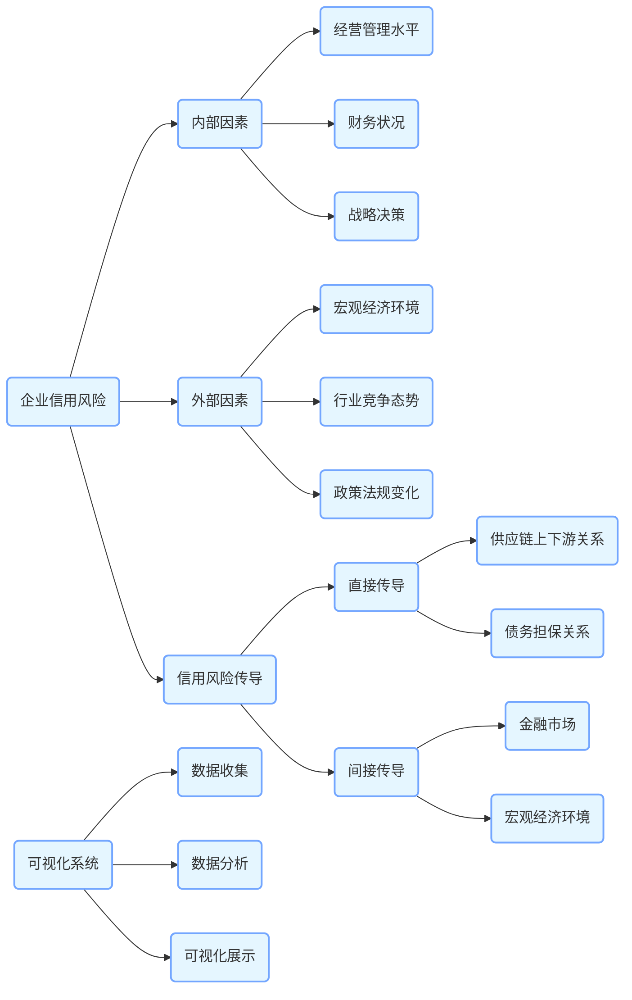

# 开发智能化的企业信用风险传导模拟与可视化系统

> 关键词：企业信用风险、风险传导模拟、可视化系统、智能化、数据分析

> 摘要：本文聚焦于开发智能化的企业信用风险传导模拟与可视化系统。首先介绍了该系统开发的背景，包括目的、预期读者等内容。接着阐述了系统涉及的核心概念及其联系，详细讲解了核心算法原理与具体操作步骤，运用 Python 代码进行了说明。还介绍了相关的数学模型和公式，并结合实例进行分析。通过项目实战，展示了系统的开发环境搭建、源代码实现与解读。探讨了系统的实际应用场景，推荐了学习资源、开发工具框架以及相关论文著作。最后总结了系统未来的发展趋势与挑战，提供了常见问题解答和扩展阅读参考资料，旨在为企业信用风险的管理和决策提供有效的技术支持和可视化解决方案。

## 1. 背景介绍 
### 1.1 目的和范围
在当今复杂多变的商业环境中，企业面临着各种信用风险。企业信用风险的传导不仅会影响单个企业的生存与发展，还可能对整个产业链、金融市场乃至宏观经济产生连锁反应。开发智能化的企业信用风险传导模拟与可视化系统的目的在于，通过对企业信用风险的量化分析、传导过程的模拟以及结果的可视化展示，帮助企业管理者、金融机构、监管部门等相关主体更好地理解和管理信用风险。

本系统的范围涵盖了企业信用风险数据的收集、整理、分析，信用风险传导模型的构建与模拟，以及模拟结果的可视化呈现。系统将考虑多种因素，如企业的财务状况、行业竞争环境、宏观经济形势等，以实现对企业信用风险传导的全面、准确模拟。

### 1.2 预期读者
本系统的预期读者包括但不限于以下几类：
- **企业管理者**：帮助他们了解企业自身面临的信用风险以及风险在企业内部和外部的传导路径，从而制定合理的风险管理策略，降低企业的信用风险暴露。
- **金融机构从业者**：如银行信贷人员、投资经理等，通过系统对借款企业或投资对象的信用风险传导进行评估，为信贷审批、投资决策提供科学依据。
- **监管部门人员**：用于监测和评估区域或行业内的企业信用风险状况，及时发现潜在的系统性风险，采取相应的监管措施，维护金融市场的稳定。
- **学术研究人员**：为他们的企业信用风险相关研究提供数据支持和模拟工具，推动信用风险理论和方法的发展。

### 1.3 文档结构概述
本文将按照以下结构进行阐述：
- **核心概念与联系**：介绍企业信用风险、风险传导等核心概念，以及它们之间的内在联系，并通过文本示意图和 Mermaid 流程图进行直观展示。
- **核心算法原理 & 具体操作步骤**：详细讲解用于信用风险评估和传导模拟的核心算法，包括算法的原理和具体实现步骤，并使用 Python 代码进行说明。
- **数学模型和公式 & 详细讲解 & 举例说明**：介绍构建信用风险传导模型所涉及的数学模型和公式，并结合实际例子进行详细讲解。
- **项目实战：代码实际案例和详细解释说明**：通过一个具体的项目实战，展示系统的开发环境搭建、源代码的实现和解读，帮助读者更好地理解系统的开发过程。
- **实际应用场景**：探讨系统在企业风险管理、金融机构信贷决策、监管部门风险监测等实际场景中的应用。
- **工具和资源推荐**：推荐相关的学习资源、开发工具框架以及论文著作，帮助读者进一步深入学习和研究企业信用风险传导模拟与可视化系统。
- **总结：未来发展趋势与挑战**：总结系统的发展现状，分析未来的发展趋势和面临的挑战。
- **附录：常见问题与解答**：解答读者在阅读和使用系统过程中可能遇到的常见问题。
- **扩展阅读 & 参考资料**：提供相关的扩展阅读材料和参考资料，方便读者进一步查阅。

### 1.4 术语表
#### 1.4.1 核心术语定义
- **企业信用风险**：指企业在经营活动中，由于各种原因导致其无法按时、足额履行债务或合同义务，从而给债权人或其他利益相关者带来损失的可能性。
- **信用风险传导**：指一个企业的信用风险通过各种渠道（如供应链、金融市场、行业竞争等）传播到其他企业或经济主体，导致其他企业或经济主体信用风险增加的过程。
- **可视化系统**：指将数据和信息以图形、图表、动画等直观的方式展示出来，帮助用户更快速、准确地理解和分析数据的系统。

#### 1.4.2 相关概念解释
- **风险暴露**：指企业在面临信用风险时可能遭受的最大损失金额。
- **违约概率**：指企业在未来一段时间内违约的可能性。
- **风险缓释**：指采取各种措施降低企业信用风险的过程，如担保、保险、信用衍生品等。

#### 1.4.3 缩略词列表
- **PD**：Probability of Default，违约概率
- **LGD**：Loss Given Default，违约损失率
- **EAD**：Exposure at Default，违约风险暴露

## 2. 核心概念与联系 
### 核心概念原理
企业信用风险是企业经营过程中面临的重要风险之一。其产生的原因主要包括企业内部因素和外部因素。内部因素如企业的经营管理水平、财务状况、战略决策等；外部因素如宏观经济环境、行业竞争态势、政策法规变化等。

信用风险传导是一个复杂的过程，涉及多个环节和多种因素。其传导机制主要包括直接传导和间接传导。直接传导是指通过企业之间的业务往来（如供应链上下游关系、债务担保关系等）将信用风险从一个企业传递到另一个企业；间接传导是指通过金融市场、宏观经济环境等因素的变化，影响企业的信用状况，进而导致信用风险的传导。

可视化系统的原理是将企业信用风险数据和信用风险传导过程通过图形、图像、动画等可视化手段进行展示。通过可视化展示，可以将复杂的数据和抽象的概念以直观的方式呈现给用户，帮助用户更好地理解和分析企业信用风险及其传导过程。

### 文本示意图
```plaintext
企业信用风险
├── 内部因素
│   ├── 经营管理水平
│   ├── 财务状况
│   └── 战略决策
├── 外部因素
│   ├── 宏观经济环境
│   ├── 行业竞争态势
│   └── 政策法规变化
└── 信用风险传导
    ├── 直接传导
    │   ├── 供应链上下游关系
    │   └── 债务担保关系
    └── 间接传导
        ├── 金融市场
        └── 宏观经济环境

可视化系统
├── 数据收集
├── 数据分析
└── 可视化展示
```

### Mermaid 流程图


## 3. 核心算法原理 & 具体操作步骤 
### 核心算法原理
本系统主要使用逻辑回归算法来评估企业的违约概率，使用蒙特卡罗模拟算法来模拟信用风险的传导过程。

#### 逻辑回归算法
逻辑回归是一种广泛应用于分类问题的统计学习方法。在企业信用风险评估中，我们可以将企业是否违约作为分类目标，通过逻辑回归算法建立企业特征与违约概率之间的关系。

逻辑回归的基本模型是一个线性模型，其表达式为：
$$z = \beta_0 + \beta_1x_1 + \beta_2x_2 + \cdots + \beta_nx_n$$
其中，$z$ 是线性组合的结果，$\beta_0$ 是截距，$\beta_1, \beta_2, \cdots, \beta_n$ 是特征的系数，$x_1, x_2, \cdots, x_n$ 是企业的特征变量。

为了将线性组合的结果转换为概率值，我们使用逻辑函数（也称为 sigmoid 函数）：
$$P(y = 1|x) = \frac{1}{1 + e^{-z}}$$
其中，$P(y = 1|x)$ 表示在给定特征 $x$ 的情况下，企业违约的概率。

#### 蒙特卡罗模拟算法
蒙特卡罗模拟是一种通过随机抽样来模拟复杂系统行为的方法。在信用风险传导模拟中，我们可以通过蒙特卡罗模拟来模拟企业信用风险在不同情景下的传导过程。

具体步骤如下：
1. 定义系统的初始状态，包括企业的信用状况、企业之间的关系等。
2. 确定系统的随机变量，如宏观经济环境的变化、企业的经营风险等。
3. 生成随机数，模拟随机变量的取值。
4. 根据随机变量的取值和系统的规则，更新系统的状态。
5. 重复步骤 3 和 4 多次，得到多个模拟结果。
6. 对模拟结果进行统计分析，得到信用风险传导的概率分布和统计特征。

### 具体操作步骤
#### 数据准备
首先，我们需要收集企业的相关数据，包括财务数据、经营数据、行业数据等。然后，对数据进行清洗和预处理，包括缺失值处理、异常值处理、数据标准化等。

#### 特征选择
从预处理后的数据中选择与企业信用风险相关的特征变量。可以使用相关性分析、方差分析等方法进行特征选择。

#### 模型训练
使用逻辑回归算法对训练数据进行训练，得到违约概率评估模型。可以使用交叉验证等方法来优化模型的参数。

#### 信用风险传导模拟
使用蒙特卡罗模拟算法对信用风险的传导过程进行模拟。在模拟过程中，根据企业的违约概率和企业之间的关系，更新企业的信用状况。

#### 可视化展示
将模拟结果进行可视化展示，如绘制风险传导路径图、风险概率分布图等。

### Python 源代码实现
```python
import numpy as np
import pandas as pd
from sklearn.linear_model import LogisticRegression
from sklearn.model_selection import train_test_split
from sklearn.preprocessing import StandardScaler
import matplotlib.pyplot as plt

# 数据准备
# 假设我们有一个包含企业特征和违约标签的数据集
data = pd.read_csv('enterprise_credit_data.csv')
X = data.drop('default_label', axis=1)
y = data['default_label']

# 数据预处理
scaler = StandardScaler()
X_scaled = scaler.fit_transform(X)

# 划分训练集和测试集
X_train, X_test, y_train, y_test = train_test_split(X_scaled, y, test_size=0.2, random_state=42)

# 模型训练
model = LogisticRegression()
model.fit(X_train, y_train)

# 预测违约概率
y_pred_proba = model.predict_proba(X_test)[:, 1]

# 蒙特卡罗模拟信用风险传导
num_simulations = 1000
num_enterprises = len(X_test)
risk_conduction_matrix = np.zeros((num_simulations, num_enterprises))

for i in range(num_simulations):
    # 初始化企业的信用状况
    enterprise_status = np.zeros(num_enterprises)
    # 随机选择一个初始违约企业
    initial_default_index = np.random.randint(0, num_enterprises)
    enterprise_status[initial_default_index] = 1
    # 模拟信用风险传导
    for j in range(num_enterprises):
        if enterprise_status[j] == 1:
            # 假设每个违约企业会影响其相邻企业的信用状况
            adjacent_enterprises = [k for k in range(num_enterprises) if k != j]
            for k in adjacent_enterprises:
                if np.random.rand() < y_pred_proba[k]:
                    enterprise_status[k] = 1
    risk_conduction_matrix[i, :] = enterprise_status

# 可视化展示
average_risk_conduction = np.mean(risk_conduction_matrix, axis=0)
plt.bar(range(num_enterprises), average_risk_conduction)
plt.xlabel('Enterprise Index')
plt.ylabel('Average Risk Conduction Probability')
plt.title('Enterprise Credit Risk Conduction Simulation')
plt.show()
```

## 4. 数学模型和公式 & 详细讲解 & 举例说明 
### 逻辑回归模型
#### 数学公式
逻辑回归模型的基本公式如下：

线性组合：
$$z = \beta_0 + \beta_1x_1 + \beta_2x_2 + \cdots + \beta_nx_n$$

逻辑函数：
$$P(y = 1|x) = \frac{1}{1 + e^{-z}}$$

其中，$y$ 是分类标签（$y = 1$ 表示违约，$y = 0$ 表示不违约），$x = (x_1, x_2, \cdots, x_n)$ 是企业的特征向量，$\beta = (\beta_0, \beta_1, \cdots, \beta_n)$ 是模型的参数。

#### 详细讲解
逻辑回归模型的目标是找到一组最优的参数 $\beta$，使得模型对训练数据的预测结果与真实标签之间的误差最小。通常使用最大似然估计方法来求解参数 $\beta$。

最大似然估计的目标是最大化似然函数：
$$L(\beta) = \prod_{i=1}^{m} P(y^{(i)} = 1|x^{(i)})^{y^{(i)}} (1 - P(y^{(i)} = 1|x^{(i)}))^{1 - y^{(i)}}$$
其中，$m$ 是训练数据的样本数量，$x^{(i)}$ 和 $y^{(i)}$ 分别是第 $i$ 个样本的特征向量和标签。

为了方便计算，通常对似然函数取对数，得到对数似然函数：
$$\ell(\beta) = \sum_{i=1}^{m} [y^{(i)} \log P(y^{(i)} = 1|x^{(i)}) + (1 - y^{(i)}) \log (1 - P(y^{(i)} = 1|x^{(i)}))]$$

然后使用梯度下降等优化算法来求解对数似然函数的最大值，得到最优的参数 $\beta$。

#### 举例说明
假设我们有一个包含两个特征 $x_1$ 和 $x_2$ 的企业信用风险数据集，训练数据如下：

| $x_1$ | $x_2$ | $y$ |
|-------|-------|-----|
| 1     | 2     | 0   |
| 2     | 3     | 0   |
| 3     | 4     | 1   |
| 4     | 5     | 1   |

我们使用逻辑回归模型来预测企业的违约概率。首先，我们需要计算线性组合 $z$：
$$z = \beta_0 + \beta_1x_1 + \beta_2x_2$$

假设我们已经通过训练得到了最优的参数 $\beta_0 = -5$，$\beta_1 = 1$，$\beta_2 = 1$。对于一个新的企业，其特征值为 $x_1 = 3$，$x_2 = 4$，则线性组合 $z$ 为：
$$z = -5 + 1 \times 3 + 1 \times 4 = 2$$

然后，我们使用逻辑函数计算违约概率：
$$P(y = 1|x) = \frac{1}{1 + e^{-2}} \approx 0.88$$

因此，该企业的违约概率约为 0.88。

### 蒙特卡罗模拟模型
#### 数学公式
蒙特卡罗模拟模型的基本思想是通过随机抽样来模拟复杂系统的行为。在信用风险传导模拟中，我们可以使用以下公式来更新企业的信用状况：

$$S_{t+1}^i = \begin{cases}
1, & \text{if } \text{random}(0, 1) < P_{default}^i \text{ and } \text{there is a risk - conduction path from a default enterprise to enterprise } i \\
0, & \text{otherwise}
\end{cases}$$

其中，$S_{t+1}^i$ 是企业 $i$ 在时间 $t + 1$ 的信用状况（$S = 1$ 表示违约，$S = 0$ 表示不违约），$P_{default}^i$ 是企业 $i$ 的违约概率，$\text{random}(0, 1)$ 是一个在 $[0, 1]$ 区间内均匀分布的随机数。

#### 详细讲解
蒙特卡罗模拟的步骤如下：
1. **定义系统的初始状态**：确定企业的初始信用状况和企业之间的关系。
2. **生成随机数**：根据随机变量的概率分布，生成随机数。
3. **更新系统状态**：根据随机数和系统的规则，更新企业的信用状况。
4. **重复步骤 2 和 3**：多次重复上述步骤，得到多个模拟结果。
5. **统计分析**：对模拟结果进行统计分析，得到信用风险传导的概率分布和统计特征。

#### 举例说明
假设我们有一个包含三个企业的简单系统，企业之间的关系为：企业 1 与企业 2 有业务往来，企业 2 与企业 3 有业务往来。三个企业的违约概率分别为 $P_1 = 0.1$，$P_2 = 0.2$，$P_3 = 0.3$。

我们进行 10 次蒙特卡罗模拟：
1. **第一次模拟**：随机选择企业 1 作为初始违约企业。生成随机数 $r_2 = 0.15$，$r_3 = 0.25$。由于 $r_2 < P_2$，企业 2 违约；由于企业 2 违约，且 $r_3 < P_3$，企业 3 也违约。
2. **第二次模拟**：随机选择企业 2 作为初始违约企业。生成随机数 $r_1 = 0.05$，$r_3 = 0.35$。由于 $r_1 < P_1$，企业 1 违约；由于 $r_3 > P_3$，企业 3 不违约。
3. $\cdots$
4. **第十次模拟**：进行类似的模拟操作。

最后，我们统计每个企业的违约次数，计算其违约概率。假设企业 1 在 10 次模拟中违约了 3 次，企业 2 违约了 5 次，企业 3 违约了 6 次，则企业 1、企业 2、企业 3 的模拟违约概率分别为 0.3、0.5、0.6。

## 5. 项目实战：代码实际案例和详细解释说明 
### 5.1  开发环境搭建
#### 操作系统
本项目可以在多种操作系统上进行开发，如 Windows、Linux（Ubuntu 等）、macOS。建议使用 Linux 或 macOS 系统，因为它们在开发环境的配置和命令行操作方面更加方便。

#### Python 环境
本项目使用 Python 语言进行开发，建议使用 Python 3.7 及以上版本。可以通过以下步骤安装 Python：
- **Windows**：从 Python 官方网站（https://www.python.org/downloads/）下载 Python 安装包，按照安装向导进行安装。安装过程中注意勾选“Add Python to PATH”选项。
- **Linux（Ubuntu）**：在终端中运行以下命令安装 Python：
```bash
sudo apt update
sudo apt install python3 python3-pip
```
- **macOS**：可以使用 Homebrew 进行安装，在终端中运行以下命令：
```bash
brew install python3
```

#### 依赖库安装
本项目需要安装一些 Python 依赖库，如 `numpy`、`pandas`、`scikit-learn`、`matplotlib` 等。可以使用 `pip` 进行安装，在终端中运行以下命令：
```bash
pip install numpy pandas scikit-learn matplotlib
```

### 5.2  源代码详细实现和代码解读
```python
import numpy as np
import pandas as pd
from sklearn.linear_model import LogisticRegression
from sklearn.model_selection import train_test_split
from sklearn.preprocessing import StandardScaler
import matplotlib.pyplot as plt

# 数据准备
# 假设我们有一个包含企业特征和违约标签的数据集
data = pd.read_csv('enterprise_credit_data.csv')
X = data.drop('default_label', axis=1)
y = data['default_label']

# 代码解读：
# 使用 pandas 库的 read_csv 函数读取 CSV 格式的数据集。
# 将数据集中的特征列（除了违约标签列）提取到 X 中，将违约标签列提取到 y 中。

# 数据预处理
scaler = StandardScaler()
X_scaled = scaler.fit_transform(X)

# 代码解读：
# 使用 StandardScaler 类对特征数据进行标准化处理，使得特征数据具有零均值和单位方差。
# fit_transform 方法先计算特征数据的均值和标准差，然后进行标准化变换。

# 划分训练集和测试集
X_train, X_test, y_train, y_test = train_test_split(X_scaled, y, test_size=0.2, random_state=42)

# 代码解读：
# 使用 train_test_split 函数将标准化后的特征数据 X_scaled 和标签数据 y 划分为训练集和测试集。
# test_size=0.2 表示将 20% 的数据作为测试集，80% 的数据作为训练集。
# random_state=42 是为了保证每次划分的结果一致，方便调试和复现。

# 模型训练
model = LogisticRegression()
model.fit(X_train, y_train)

# 代码解读：
# 创建一个 LogisticRegression 类的实例 model。
# 使用 fit 方法对训练集数据进行训练，得到逻辑回归模型。

# 预测违约概率
y_pred_proba = model.predict_proba(X_test)[:, 1]

# 代码解读：
# 使用 predict_proba 方法对测试集数据进行预测，得到每个样本的违约概率。
# [:, 1] 表示取每个样本的违约概率（第二列）。

# 蒙特卡罗模拟信用风险传导
num_simulations = 1000
num_enterprises = len(X_test)
risk_conduction_matrix = np.zeros((num_simulations, num_enterprises))

# 代码解读：
# 设定蒙特卡罗模拟的次数为 1000 次。
# 获取测试集中企业的数量。
# 创建一个全零的矩阵 risk_conduction_matrix，用于存储每次模拟的结果。

for i in range(num_simulations):
    # 初始化企业的信用状况
    enterprise_status = np.zeros(num_enterprises)
    # 随机选择一个初始违约企业
    initial_default_index = np.random.randint(0, num_enterprises)
    enterprise_status[initial_default_index] = 1
    # 模拟信用风险传导
    for j in range(num_enterprises):
        if enterprise_status[j] == 1:
            # 假设每个违约企业会影响其相邻企业的信用状况
            adjacent_enterprises = [k for k in range(num_enterprises) if k != j]
            for k in adjacent_enterprises:
                if np.random.rand() < y_pred_proba[k]:
                    enterprise_status[k] = 1
    risk_conduction_matrix[i, :] = enterprise_status

# 代码解读：
# 外层循环进行 1000 次模拟。
# 每次模拟开始时，初始化企业的信用状况为全零。
# 随机选择一个初始违约企业，将其信用状况标记为 1。
# 内层循环遍历每个企业，如果该企业违约，则遍历其相邻企业，根据相邻企业的违约概率和随机数判断是否违约。
# 将每次模拟的结果存储在 risk_conduction_matrix 中。

# 可视化展示
average_risk_conduction = np.mean(risk_conduction_matrix, axis=0)
plt.bar(range(num_enterprises), average_risk_conduction)
plt.xlabel('Enterprise Index')
plt.ylabel('Average Risk Conduction Probability')
plt.title('Enterprise Credit Risk Conduction Simulation')
plt.show()

# 代码解读：
# 计算每次模拟中每个企业的平均风险传导概率。
# 使用 matplotlib 库的 bar 函数绘制柱状图，展示每个企业的平均风险传导概率。
# 设置图表的标题、x 轴标签和 y 轴标签。
# 使用 show 方法显示图表。
```

### 5.3  代码解读与分析
#### 数据处理部分
- **数据读取**：使用 `pandas` 库的 `read_csv` 函数读取 CSV 格式的数据集，方便对数据进行操作和处理。
- **数据预处理**：使用 `StandardScaler` 对特征数据进行标准化处理，有助于提高模型的训练效果和收敛速度。
- **数据集划分**：使用 `train_test_split` 函数将数据集划分为训练集和测试集，保证模型的泛化能力。

#### 模型训练部分
- **模型选择**：选择逻辑回归模型进行企业违约概率的预测，逻辑回归是一种简单有效的分类模型，适用于二分类问题。
- **模型训练**：使用 `fit` 方法对训练集数据进行训练，得到逻辑回归模型的参数。

#### 蒙特卡罗模拟部分
- **模拟次数**：设定蒙特卡罗模拟的次数为 1000 次，模拟次数越多，模拟结果越接近真实情况。
- **风险传导模拟**：通过随机选择初始违约企业，根据企业的违约概率和相邻关系，模拟信用风险的传导过程。

#### 可视化部分
- **数据统计**：计算每个企业的平均风险传导概率，使用 `np.mean` 函数进行统计计算。
- **图表绘制**：使用 `matplotlib` 库的 `bar` 函数绘制柱状图，直观地展示每个企业的平均风险传导概率。

## 6. 实际应用场景 
### 企业风险管理
企业管理者可以使用本系统来评估企业自身面临的信用风险以及风险在企业内部和外部的传导路径。通过对不同情景下的信用风险传导进行模拟，企业管理者可以提前制定相应的风险管理策略，降低企业的信用风险暴露。例如，企业可以通过优化供应链管理、加强客户信用评估、调整债务结构等方式来降低信用风险。

### 金融机构信贷决策
金融机构如银行在进行信贷审批时，可以使用本系统对借款企业的信用风险进行评估和传导模拟。通过分析借款企业的违约概率以及信用风险在其上下游企业之间的传导情况，金融机构可以更准确地评估借款企业的还款能力和信用风险，从而做出合理的信贷决策。例如，银行可以根据模拟结果调整贷款利率、贷款额度、担保要求等信贷条件。

### 监管部门风险监测
监管部门可以使用本系统来监测和评估区域或行业内的企业信用风险状况。通过对大量企业的信用风险数据进行分析和模拟，监管部门可以及时发现潜在的系统性风险，采取相应的监管措施，维护金融市场的稳定。例如，监管部门可以根据模拟结果对高风险企业进行重点监管，要求企业加强风险管理、披露更多信息等。

### 学术研究
学术研究人员可以使用本系统作为研究工具，对企业信用风险的理论和方法进行深入研究。通过对不同的信用风险传导模型进行实验和验证，研究人员可以推动信用风险理论的发展，提出更有效的信用风险管理策略。例如，研究人员可以使用本系统研究宏观经济环境变化对企业信用风险传导的影响，探索新的信用风险度量方法等。

## 7. 工具和资源推荐
### 7.1 学习资源推荐
#### 7.1.1 书籍推荐
- 《信用风险评估与度量》：本书系统地介绍了信用风险评估和度量的理论、方法和技术，包括信用评级、违约概率模型、信用风险量化等内容，是学习信用风险领域的经典教材。
- 《Python 数据分析实战》：本书详细介绍了使用 Python 进行数据分析的方法和技巧，包括数据处理、数据分析、数据可视化等内容，对于学习如何使用 Python 进行企业信用风险数据分析和可视化非常有帮助。
- 《机器学习实战》：本书通过实际案例介绍了机器学习的基本算法和应用，包括分类算法、回归算法、聚类算法等，对于学习如何使用机器学习算法进行企业信用风险评估和传导模拟有很大的帮助。

#### 7.1.2 在线课程
- Coursera 上的“Machine Learning”课程：由斯坦福大学教授 Andrew Ng 讲授，是机器学习领域的经典课程，系统地介绍了机器学习的基本概念、算法和应用，对于学习如何使用机器学习算法进行企业信用风险评估和传导模拟非常有帮助。
- edX 上的“Data Science MicroMasters Program”课程：该课程涵盖了数据科学的各个方面，包括数据处理、数据分析、机器学习、数据可视化等内容，对于学习如何使用 Python 进行企业信用风险数据分析和可视化非常有帮助。
- 中国大学 MOOC 上的“Python 语言程序设计”课程：该课程由北京大学教授陈斌讲授，系统地介绍了 Python 语言的基本语法、数据结构、控制语句等内容，是学习 Python 语言的入门课程，对于初学者非常友好。

#### 7.1.3 技术博客和网站
- Medium：一个技术博客平台，上面有很多关于数据科学、机器学习、信用风险等领域的优秀文章，可以帮助读者了解最新的技术动态和研究成果。
- Towards Data Science：一个专注于数据科学和机器学习的技术博客，上面有很多关于数据科学、机器学习、信用风险等领域的实战教程和案例分析，可以帮助读者提高实际操作能力。
- Kaggle：一个数据科学竞赛平台，上面有很多关于信用风险评估、金融数据分析等领域的竞赛项目和数据集，可以帮助读者通过实践提高数据科学和机器学习能力。

### 7.2 开发工具框架推荐
#### 7.2.1 IDE和编辑器
- PyCharm：一款专业的 Python 集成开发环境（IDE），具有代码编辑、调试、代码分析等功能，对于开发 Python 项目非常方便。
- Jupyter Notebook：一个交互式的开发环境，支持多种编程语言，如 Python、R 等，适合进行数据探索、数据分析和模型开发。
- Visual Studio Code：一款轻量级的代码编辑器，支持多种编程语言和插件，具有丰富的扩展功能，对于开发 Python 项目也非常方便。

#### 7.2.2 调试和性能分析工具
- PDB：Python 自带的调试工具，可以帮助开发者在代码中设置断点、单步执行、查看变量值等，方便调试代码。
- cProfile：Python 自带的性能分析工具，可以帮助开发者分析代码的性能瓶颈，找出执行时间较长的函数和代码段。
- Py-Spy：一个跨平台的 Python 性能分析工具，可以实时监测 Python 程序的性能，找出性能瓶颈。

#### 7.2.3 相关框架和库
- NumPy：一个用于科学计算的 Python 库，提供了高效的多维数组对象和各种数学函数，是数据科学和机器学习的基础库。
- Pandas：一个用于数据处理和分析的 Python 库，提供了高效的数据结构和数据操作方法，如数据读取、数据清洗、数据统计等。
- Scikit-learn：一个用于机器学习的 Python 库，提供了各种机器学习算法和工具，如分类算法、回归算法、聚类算法等，方便开发者进行机器学习模型的开发和训练。
- Matplotlib：一个用于数据可视化的 Python 库，提供了各种绘图函数和工具，如折线图、柱状图、散点图等，方便开发者进行数据可视化展示。

### 7.3 相关论文著作推荐
#### 7.3.1 经典论文
- “On the Pricing of Corporate Debt: The Risk Structure of Interest Rates” by Robert C. Merton：该论文提出了著名的 Merton 模型，用于评估企业的信用风险，是信用风险评估领域的经典论文。
- “Credit Risk: Measurement, Evaluation, and Management” by Darrell Duffie and Kenneth J. Singleton：该论文系统地介绍了信用风险的度量、评估和管理方法，是信用风险领域的重要文献。
- “Machine Learning for Credit Risk Assessment” by Tomasz P. Michalak and Piotr Biecek：该论文介绍了如何使用机器学习算法进行信用风险评估，是机器学习在信用风险领域应用的重要论文。

#### 7.3.2 最新研究成果
- 关注顶级学术期刊如《Journal of Financial Economics》、《Review of Financial Studies》、《Management Science》等，这些期刊上经常发表关于信用风险、金融市场等领域的最新研究成果。
- 参加国际学术会议如 the American Finance Association (AFA) Annual Meeting、the Western Finance Association (WFA) Annual Meeting 等，这些会议上可以了解到信用风险领域的最新研究动态和前沿技术。

#### 7.3.3 应用案例分析
- 金融机构的年度报告和研究报告：许多金融机构会在其年度报告和研究报告中分享其在信用风险管理方面的实践经验和应用案例，可以从中了解到实际应用中的信用风险评估和管理方法。
- 咨询公司的研究报告：咨询公司如麦肯锡、波士顿咨询集团等会发布关于信用风险、金融科技等领域的研究报告和应用案例，可以从中了解到行业的最新趋势和最佳实践。

## 8. 总结：未来发展趋势与挑战
### 未来发展趋势
#### 智能化与自动化
随着人工智能技术的不断发展，企业信用风险传导模拟与可视化系统将越来越智能化和自动化。系统将能够自动收集、处理和分析大量的企业信用风险数据，自动构建信用风险传导模型，自动进行风险模拟和预警。例如，系统可以使用自然语言处理技术从新闻、社交媒体等非结构化数据中提取企业信用风险信息，使用深度学习算法构建更准确的信用风险评估模型。

#### 多源数据融合
未来的系统将不仅仅依赖于传统的企业财务数据，还将融合更多的多源数据，如市场数据、行业数据、社交媒体数据等。通过多源数据的融合，可以更全面、准确地评估企业的信用风险和风险传导情况。例如，结合社交媒体数据可以了解企业的品牌声誉和市场口碑，从而更好地评估企业的信用风险。

#### 可视化技术创新
可视化技术将不断创新，为用户提供更加直观、生动、交互性强的风险展示方式。例如，使用虚拟现实（VR）和增强现实（AR）技术，让用户身临其境地感受企业信用风险的传导过程；使用动态可视化技术，实时展示风险的变化情况和发展趋势。

#### 与区块链技术结合
区块链技术具有去中心化、不可篡改、安全可靠等特点，可以为企业信用风险传导模拟与可视化系统提供更可靠的数据来源和数据共享机制。通过区块链技术，可以实现企业信用数据的安全存储和共享，提高数据的可信度和透明度，从而更好地进行信用风险评估和传导模拟。

### 面临的挑战
#### 数据质量和隐私问题
数据质量是影响系统准确性和可靠性的关键因素。在实际应用中，企业信用风险数据可能存在数据缺失、数据错误、数据不一致等问题，需要进行有效的数据清洗和预处理。同时，随着数据的不断增加和共享，数据隐私问题也日益突出。如何在保证数据质量的前提下，保护企业和个人的隐私，是系统开发和应用中面临的重要挑战。

#### 模型复杂度和可解释性
为了提高信用风险评估和传导模拟的准确性，模型往往会变得越来越复杂。然而，复杂的模型可能会导致可解释性降低，用户难以理解模型的决策过程和结果。如何在提高模型准确性的同时，保证模型的可解释性，是系统开发中需要解决的问题。

#### 技术更新换代快
信息技术发展迅速，新的算法、工具和框架不断涌现。系统开发人员需要不断学习和掌握新的技术，及时更新和优化系统，以适应技术的发展和用户的需求。这对开发人员的技术水平和学习能力提出了较高的要求。

#### 行业标准和规范缺失
目前，企业信用风险传导模拟与可视化系统领域还缺乏统一的行业标准和规范。不同的系统在数据格式、模型算法、评估指标等方面存在差异，导致系统之间的兼容性和互操作性较差。建立统一的行业标准和规范，是促进系统发展和应用的重要保障。

## 9. 附录：常见问题与解答
### 1. 如何收集企业信用风险数据？
企业信用风险数据可以从多个渠道收集，包括企业的财务报表、信用评级机构的评级报告、金融机构的信贷数据、行业协会的统计数据、新闻媒体和社交媒体等。在收集数据时，需要注意数据的准确性、完整性和时效性。

### 2. 如何处理数据中的缺失值和异常值？
处理数据中的缺失值和异常值可以采用多种方法。对于缺失值，可以使用均值、中位数、众数等统计量进行填充，也可以使用插值法、机器学习算法等进行预测填充。对于异常值，可以使用统计方法（如 Z 分数法、箱线图法等）进行识别和处理，也可以根据业务逻辑进行判断和修正。

### 3. 如何选择合适的特征变量？
选择合适的特征变量可以使用多种方法，如相关性分析、方差分析、主成分分析等。在选择特征变量时，需要考虑特征变量与目标变量（企业违约概率）的相关性、特征变量之间的相关性、特征变量的可解释性等因素。

### 4. 如何评估模型的性能？
评估模型的性能可以使用多种指标，如准确率、召回率、F1 值、ROC 曲线、AUC 值等。不同的指标适用于不同的场景，需要根据具体的业务需求选择合适的评估指标。

### 5. 如何优化模型的参数？
优化模型的参数可以使用多种方法，如网格搜索、随机搜索、贝叶斯优化等。这些方法可以在一定的参数空间内搜索最优的参数组合，提高模型的性能。

### 6. 如何保证系统的安全性和稳定性？
保证系统的安全性和稳定性可以从多个方面入手，如数据加密、访问控制、备份恢复、容错处理等。在系统开发和部署过程中，需要遵循安全规范和最佳实践，采取有效的安全措施，确保系统的安全性和稳定性。

## 10. 扩展阅读 & 参考资料
### 扩展阅读
- 《金融风险管理》：进一步深入学习金融风险管理的理论和方法，包括市场风险、信用风险、操作风险等方面的内容。
- 《数据挖掘：概念与技术》：学习数据挖掘的基本概念、算法和应用，了解如何从大量数据中提取有价值的信息。
- 《人工智能：一种现代的方法》：全面了解人工智能的理论、算法和应用，包括机器学习、自然语言处理、计算机视觉等领域的内容。

### 参考资料
- 相关的学术论文和研究报告：可以从学术数据库（如 IEEE Xplore、ACM Digital Library、ScienceDirect 等）、金融机构的官方网站、咨询公司的研究报告等渠道获取。
- 相关的技术文档和教程：可以从编程语言的官方文档（如 Python 官方文档）、机器学习库的官方文档（如 Scikit-learn 官方文档）、数据可视化库的官方文档（如 Matplotlib 官方文档）等渠道获取。
- 相关的开源项目和代码示例：可以从 GitHub 等开源代码托管平台获取，学习他人的优秀代码和实践经验。