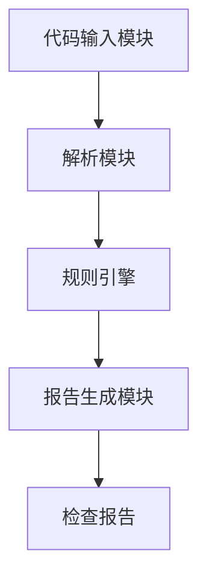

# 开发规范的智能执行：自动化检查

> 关键词：开发规范、自动化检查、智能执行、代码质量、静态分析工具

> 摘要：本文围绕开发规范的智能执行——自动化检查展开，深入探讨了其背景、核心概念、算法原理、数学模型等多方面内容。通过详细的Python代码示例展示了自动化检查的具体实现过程，并结合项目实战阐述了开发环境搭建、代码实现与解读等关键步骤。同时，分析了自动化检查在实际应用场景中的作用，推荐了相关的学习资源、开发工具框架以及论文著作。最后对未来发展趋势与挑战进行总结，并提供常见问题解答和扩展阅读参考资料，旨在帮助开发者更好地理解和应用自动化检查来提升代码质量和开发效率。

## 1. 背景介绍 
### 1.1 目的和范围
在软件开发过程中，开发规范的遵循对于保证代码的质量、可维护性和团队协作效率至关重要。然而，人工检查开发规范往往效率低下且容易出现遗漏。自动化检查作为一种智能执行开发规范的手段，能够快速、准确地对代码进行检查，发现潜在的问题。本文的范围涵盖了自动化检查的基本原理、实现方法、实际应用以及相关工具和资源的推荐等方面，旨在为开发者提供全面的关于开发规范自动化检查的知识体系。

### 1.2 预期读者
本文预期读者包括软件开发工程师、软件测试人员、软件项目管理人员以及对软件开发过程优化感兴趣的技术爱好者。对于软件开发工程师而言，可以通过本文学习如何利用自动化检查提升代码质量；软件测试人员可以借助自动化检查工具更高效地发现代码中的问题；软件项目管理人员能够更好地把控项目开发过程中的规范遵循情况；技术爱好者则可以了解到软件开发领域中这一重要的实践方法。

### 1.3 文档结构概述
本文首先介绍背景信息，让读者了解开发规范自动化检查的目的和适用人群。接着阐述核心概念与联系，通过文本示意图和Mermaid流程图清晰展示其原理和架构。然后详细讲解核心算法原理和具体操作步骤，使用Python源代码进行说明。之后介绍数学模型和公式，并举例说明。再通过项目实战展示代码实际案例和详细解释。随后分析实际应用场景，推荐相关的工具和资源。最后总结未来发展趋势与挑战，提供常见问题解答和扩展阅读参考资料。

### 1.4 术语表
#### 1.4.1 核心术语定义
- **开发规范**：指在软件开发过程中遵循的一系列规则和标准，包括代码风格、编程习惯、架构设计等方面的要求，旨在提高代码的可读性、可维护性和可扩展性。
- **自动化检查**：利用计算机程序自动对代码进行扫描和分析，以检查代码是否符合开发规范的过程。
- **静态分析工具**：一种在不执行代码的情况下对代码进行分析的工具，用于发现代码中的潜在问题，如语法错误、逻辑错误、安全漏洞等。

#### 1.4.2 相关概念解释
- **代码质量**：代码的质量是指代码满足功能需求、易于维护、可扩展、高效且安全等方面的程度。开发规范的遵循有助于提高代码质量。
- **持续集成**：一种软件开发实践，通过频繁地将代码集成到共享代码库中，并自动进行构建和测试，以尽早发现和解决集成问题。自动化检查可以作为持续集成流程的一部分。

#### 1.4.3 缩略词列表
- **CI**：Continuous Integration，持续集成
- **AST**：Abstract Syntax Tree，抽象语法树

## 2. 核心概念与联系 

### 核心概念原理
开发规范的自动化检查主要基于静态分析技术。静态分析工具会对源代码进行解析，将其转换为抽象语法树（AST）。抽象语法树是源代码的一种树形表示，它以一种结构化的方式呈现了代码的语法结构。通过对抽象语法树的遍历和分析，可以检查代码是否符合预定义的开发规范。

例如，在Python中，使用`ast`模块可以将Python代码解析为抽象语法树。以下是一个简单的Python代码示例和对应的抽象语法树结构说明：

```python
# 示例代码
def add(a, b):
    return a + b

# 解析为抽象语法树
import ast
tree = ast.parse('def add(a, b): return a + b')
```

在这个例子中，`ast.parse`函数将Python代码字符串解析为抽象语法树对象`tree`。通过对`tree`的遍历和分析，可以检查函数定义、参数使用等是否符合开发规范。

### 架构的文本示意图
开发规范自动化检查系统通常包含以下几个主要部分：

1. **代码输入模块**：负责接收待检查的源代码文件或代码库。
2. **解析模块**：将源代码解析为抽象语法树。
3. **规则引擎**：包含一系列预定义的开发规范规则，用于对抽象语法树进行检查。
4. **报告生成模块**：根据检查结果生成详细的报告，指出代码中不符合规范的地方。

其工作流程为：代码输入模块接收代码，解析模块将其解析为抽象语法树，规则引擎根据规则对抽象语法树进行检查，最后报告生成模块生成检查报告。

### Mermaid流程图


## 3. 核心算法原理 & 具体操作步骤 

### 核心算法原理
自动化检查的核心算法主要基于对抽象语法树的遍历和规则匹配。具体步骤如下：

1. **解析源代码**：使用相应的解析器将源代码解析为抽象语法树。
2. **遍历抽象语法树**：从抽象语法树的根节点开始，递归地遍历每个节点。
3. **规则匹配**：对于每个节点，检查其是否符合预定义的开发规范规则。如果不符合，则记录相应的问题。
4. **生成报告**：根据记录的问题生成详细的检查报告。

### 具体操作步骤及Python源代码实现
以下是一个简单的Python示例，用于检查Python代码中函数定义的参数数量是否超过3个：

```python
import ast

# 定义规则检查类
class FunctionParamChecker(ast.NodeVisitor):
    def __init__(self):
        self.issues = []

    def visit_FunctionDef(self, node):
        if len(node.args.args) > 3:
            issue = {
                'line': node.lineno,
                'message': f"Function {node.name} has more than 3 parameters"
            }
            self.issues.append(issue)
        self.generic_visit(node)

# 解析代码并进行检查
def check_code(code):
    tree = ast.parse(code)
    checker = FunctionParamChecker()
    checker.visit(tree)
    return checker.issues

# 示例代码
example_code = """
def add(a, b, c, d):
    return a + b + c + d
"""

# 执行检查
issues = check_code(example_code)
for issue in issues:
    print(f"Line {issue['line']}: {issue['message']}")
```

在这个示例中，我们定义了一个`FunctionParamChecker`类，继承自`ast.NodeVisitor`。在`visit_FunctionDef`方法中，我们检查函数定义的参数数量是否超过3个，如果超过则记录相应的问题。最后，我们使用`check_code`函数对示例代码进行检查，并打印出检查结果。

## 4. 数学模型和公式 & 详细讲解 & 举例说明 

### 数学模型
自动化检查可以用一个数学模型来描述。设 $C$ 表示源代码集合，$R$ 表示开发规范规则集合，$I$ 表示检查结果集合。则自动化检查过程可以表示为一个映射 $f: C \times R \to I$。

对于每个源代码文件 $c \in C$ 和规则 $r \in R$，$f(c, r)$ 表示对源代码 $c$ 应用规则 $r$ 后的检查结果。如果 $f(c, r)$ 为真，则表示代码 $c$ 符合规则 $r$；否则，表示代码 $c$ 不符合规则 $r$。

### 公式
设 $N$ 表示抽象语法树中的节点集合，$n \in N$ 表示一个节点。对于规则 $r$，可以定义一个谓词函数 $P_r(n)$，表示节点 $n$ 是否符合规则 $r$。则对于整个源代码 $c$，其是否符合规则 $r$ 可以表示为：

$$
\text{is_valid}(c, r) = \bigwedge_{n \in N(c)} P_r(n)
$$

其中，$N(c)$ 表示源代码 $c$ 对应的抽象语法树中的节点集合，$\bigwedge$ 表示逻辑与运算。

### 举例说明
假设我们有一个规则 $r$：函数名必须以小写字母开头。对于一个函数定义节点 $n$，谓词函数 $P_r(n)$ 可以定义为：

```python
def P_r(n):
    if isinstance(n, ast.FunctionDef):
        return n.name[0].islower()
    return True
```

对于一个源代码文件 $c$，其是否符合规则 $r$ 可以通过遍历抽象语法树中的所有函数定义节点，并对每个节点应用 $P_r$ 函数来判断。

## 5. 项目实战：代码实际案例和详细解释说明 

### 5.1  开发环境搭建
在进行开发规范自动化检查的项目实战之前，需要搭建相应的开发环境。以下是具体步骤：

1. **安装Python**：确保系统中安装了Python 3.x版本。可以从Python官方网站（https://www.python.org/downloads/）下载并安装。
2. **创建虚拟环境**：为了避免不同项目之间的依赖冲突，建议使用虚拟环境。可以使用`venv`模块创建虚拟环境：
```bash
python -m venv myenv
```
3. **激活虚拟环境**：在Windows系统中，使用以下命令激活虚拟环境：
```bash
myenv\Scripts\activate
```
在Linux或Mac系统中，使用以下命令激活虚拟环境：
```bash
source myenv/bin/activate
```
4. **安装必要的库**：在本项目中，我们需要使用`ast`模块，该模块是Python标准库的一部分，无需额外安装。如果需要使用其他静态分析工具，如`pylint`、`flake8`等，可以使用`pip`进行安装：
```bash
pip install pylint flake8
```

### 5.2  源代码详细实现和代码解读
以下是一个更完整的Python代码示例，用于实现一个简单的自动化检查工具，检查Python代码中的注释是否符合规范（要求每个函数都有文档字符串）：

```python
import ast

# 定义规则检查类
class CommentChecker(ast.NodeVisitor):
    def __init__(self):
        self.issues = []

    def visit_FunctionDef(self, node):
        docstring = ast.get_docstring(node)
        if not docstring:
            issue = {
                'line': node.lineno,
                'message': f"Function {node.name} is missing a docstring"
            }
            self.issues.append(issue)
        self.generic_visit(node)

# 解析代码并进行检查
def check_code(file_path):
    try:
        with open(file_path, 'r', encoding='utf-8') as file:
            code = file.read()
        tree = ast.parse(code)
        checker = CommentChecker()
        checker.visit(tree)
        return checker.issues
    except Exception as e:
        print(f"Error reading file: {e}")
        return []

# 主函数
if __name__ == "__main__":
    file_path = "example.py"
    issues = check_code(file_path)
    if issues:
        print("Code issues found:")
        for issue in issues:
            print(f"Line {issue['line']}: {issue['message']}")
    else:
        print("No issues found.")
```

### 代码解读与分析
1. **`CommentChecker`类**：继承自`ast.NodeVisitor`，用于遍历抽象语法树中的函数定义节点。在`visit_FunctionDef`方法中，使用`ast.get_docstring`函数获取函数的文档字符串，如果文档字符串为空，则记录相应的问题。
2. **`check_code`函数**：用于读取指定文件的代码，并将其解析为抽象语法树。然后创建`CommentChecker`对象，对抽象语法树进行遍历和检查，最后返回检查结果。
3. **主函数**：指定要检查的文件路径，调用`check_code`函数进行检查，并根据检查结果输出相应的信息。

## 6. 实际应用场景 
开发规范的自动化检查在软件开发的各个阶段都有广泛的应用：

### 代码审查
在代码审查过程中，自动化检查可以作为一种辅助工具，快速发现代码中不符合规范的地方，减轻审查人员的工作量。审查人员可以将更多的精力放在代码的逻辑正确性和架构设计上。

### 持续集成
在持续集成流程中，自动化检查可以作为一个重要的环节，在每次代码提交时自动对代码进行检查。如果检查不通过，则阻止代码的合并，从而保证代码库的质量。

### 项目维护
在项目的维护阶段，自动化检查可以帮助开发人员快速发现代码中的潜在问题，及时进行修复，提高代码的可维护性。

### 团队协作
在团队协作开发中，自动化检查可以确保所有团队成员遵循统一的开发规范，提高代码的一致性和可读性，促进团队协作效率的提升。

## 7. 工具和资源推荐
### 7.1 学习资源推荐
#### 7.1.1 书籍推荐
- 《Python源码剖析》：深入剖析Python解释器的实现原理，有助于理解Python代码的解析和执行过程，对于理解自动化检查的原理有很大帮助。
- 《代码大全》：全面介绍了软件开发的最佳实践和编程规范，对于制定和理解开发规范具有重要的参考价值。

#### 7.1.2 在线课程
- Coursera上的“Python for Everybody”：该课程涵盖了Python编程的基础知识，对于初学者来说是一个很好的入门课程。
- edX上的“Software Engineering Fundamentals”：介绍了软件工程的基本概念和方法，包括代码质量、开发规范等方面的内容。

#### 7.1.3 技术博客和网站
- Stack Overflow：一个知名的技术问答社区，开发者可以在上面查找关于自动化检查、静态分析工具等方面的问题和解决方案。
- Medium：上面有很多关于软件开发、代码质量等方面的技术文章，可以从中获取最新的技术动态和实践经验。

### 7.2 开发工具框架推荐
#### 7.2.1 IDE和编辑器
- PyCharm：一款功能强大的Python集成开发环境，内置了代码检查和静态分析功能，可以方便地进行开发规范的自动化检查。
- Visual Studio Code：一款轻量级的代码编辑器，通过安装相关的插件，如`Pylance`、`Flake8`等，可以实现自动化检查功能。

#### 7.2.2 调试和性能分析工具
- pdb：Python标准库中的调试工具，可以帮助开发者调试代码，定位问题。
- cProfile：Python标准库中的性能分析工具，可以分析代码的性能瓶颈，优化代码。

#### 7.2.3 相关框架和库
- pylint：一个Python静态分析工具，可以检查Python代码中的错误、代码风格问题等。
- flake8：一个集成了多个静态分析工具的框架，可以同时检查代码的语法错误、代码风格和复杂度等方面的问题。

### 7.3 相关论文著作推荐
#### 7.3.1 经典论文
- “Program Analysis through the Looking Glass: What We Found”：该论文深入探讨了程序分析的方法和技术，对于理解自动化检查的理论基础具有重要意义。
- “A Survey of Static Analysis”：对静态分析技术进行了全面的综述，介绍了静态分析的发展历程、应用场景和未来趋势。

#### 7.3.2 最新研究成果
- 可以关注ACM SIGPLAN、IEEE Transactions on Software Engineering等学术会议和期刊上的最新研究成果，了解自动化检查领域的最新技术和方法。

#### 7.3.3 应用案例分析
- 一些开源项目的文档中会介绍他们在开发过程中使用自动化检查的经验和实践案例，可以参考这些案例来学习如何在实际项目中应用自动化检查。

## 8. 总结：未来发展趋势与挑战
### 未来发展趋势
- **智能化**：随着人工智能技术的发展，自动化检查工具将越来越智能化。例如，利用机器学习算法自动学习开发规范，提高检查的准确性和效率。
- **集成化**：自动化检查工具将与更多的开发工具和平台进行集成，如集成到持续集成/持续部署（CI/CD）流程中，实现代码检查的自动化和无缝化。
- **跨语言支持**：未来的自动化检查工具将支持更多的编程语言，满足不同项目的需求。

### 挑战
- **规则的复杂性**：随着软件开发的不断发展，开发规范也越来越复杂。如何定义和管理这些规则，以及如何确保规则的一致性和有效性，是一个挑战。
- **误报和漏报问题**：自动化检查工具可能会出现误报和漏报的情况。误报会增加开发人员的工作量，漏报则可能导致代码中存在潜在的问题。如何提高检查的准确性，减少误报和漏报，是需要解决的问题。
- **性能问题**：对于大规模的代码库，自动化检查可能会消耗大量的时间和资源。如何优化检查算法，提高检查性能，是一个重要的挑战。

## 9. 附录：常见问题与解答
### 1. 自动化检查工具会取代人工代码审查吗？
不会。自动化检查工具可以快速发现一些常见的代码问题，但对于代码的逻辑正确性、架构设计等方面的问题，还需要人工进行审查。自动化检查工具和人工代码审查是相辅相成的关系。

### 2. 如何选择适合的自动化检查工具？
选择适合的自动化检查工具需要考虑以下因素：项目所使用的编程语言、开发团队的需求、工具的功能和性能等。可以根据项目的具体情况进行评估和选择。

### 3. 自动化检查工具的检查结果一定准确吗？
不一定。自动化检查工具可能会出现误报和漏报的情况。对于检查结果，需要开发人员进行进一步的确认和分析。

### 4. 如何配置自动化检查工具的规则？
不同的自动化检查工具配置规则的方式不同。一般来说，可以通过配置文件来定义规则。可以参考工具的官方文档来了解具体的配置方法。

## 10. 扩展阅读 & 参考资料
- 《Python官方文档》：https://docs.python.org/
- 《pylint官方文档》：https://pylint.pycqa.org/
- 《flake8官方文档》：https://flake8.pycqa.org/
- 相关学术论文和技术报告，可以在IEEE Xplore、ACM Digital Library等学术数据库中查找。