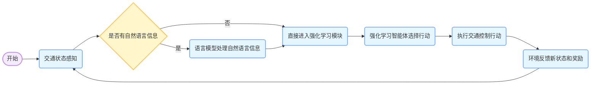

# 强化学习与语言模型结合的智能交通系统优化研究

> 关键词：强化学习、语言模型、智能交通系统、优化、交通控制

> 摘要：本文聚焦于强化学习与语言模型结合在智能交通系统优化中的应用。首先介绍了相关研究的背景，包括目的、预期读者等内容。详细阐述了强化学习和语言模型的核心概念及其联系，给出了相应的原理和架构示意图与流程图。深入探讨了核心算法原理，用Python代码进行了详细阐述，并介绍了相关的数学模型和公式。通过项目实战展示了代码的实际案例和详细解释。分析了该结合在智能交通系统中的实际应用场景。推荐了学习、开发工具框架以及相关论文著作等资源。最后总结了未来发展趋势与挑战，并对常见问题进行了解答，提供了扩展阅读和参考资料，旨在为智能交通系统的优化提供全面且深入的研究。

## 1. 背景介绍 
### 1.1 目的和范围
智能交通系统（Intelligent Transportation System，ITS）旨在运用先进的信息技术、通信技术、控制技术等提高交通系统的效率、安全性和可持续性。然而，传统的交通控制方法在面对日益复杂多变的交通状况时，往往难以达到理想的效果。强化学习作为一种能够在动态环境中进行决策优化的机器学习方法，语言模型作为一种能够处理自然语言信息的人工智能技术，将二者结合应用于智能交通系统中，有望为交通控制、交通规划等提供更智能、更高效的解决方案。

本研究的范围涵盖了强化学习与语言模型结合的基本原理、算法实现、在智能交通系统中的具体应用，以及相关的技术资源和未来发展趋势等方面。

### 1.2 预期读者
本文预期读者包括交通工程领域的研究人员和工程师，他们可以从中获取关于智能交通系统优化的新方法和新思路；人工智能领域的学者和开发者，有助于他们了解强化学习和语言模型在实际场景中的应用；对智能交通和人工智能交叉领域感兴趣的学生和爱好者，能够作为学习和研究的参考资料。

### 1.3 文档结构概述
本文首先介绍了研究的背景信息，包括目的、预期读者和文档结构等。接着详细阐述了强化学习和语言模型的核心概念及其联系，给出了相应的原理和架构示意图与流程图。然后深入探讨了核心算法原理，用Python代码进行了详细阐述，并介绍了相关的数学模型和公式。通过项目实战展示了代码的实际案例和详细解释。分析了该结合在智能交通系统中的实际应用场景。推荐了学习、开发工具框架以及相关论文著作等资源。最后总结了未来发展趋势与挑战，并对常见问题进行了解答，提供了扩展阅读和参考资料。

### 1.4 术语表
#### 1.4.1 核心术语定义
- **强化学习（Reinforcement Learning）**：一种机器学习范式，智能体通过与环境进行交互，在环境中采取行动并根据环境反馈的奖励信号来学习最优的行为策略，以最大化长期累积奖励。
- **语言模型（Language Model）**：一种对自然语言进行建模的模型，它能够根据给定的文本序列预测下一个词或字符的概率分布，常用于自然语言处理任务，如文本生成、机器翻译等。
- **智能交通系统（Intelligent Transportation System，ITS）**：将先进的信息技术、通信技术、控制技术、传感器技术和系统综合技术等有效地集成应用于整个交通运输管理体系，从而建立起一种在大范围内、全方位发挥作用的，实时、准确、高效的综合运输和管理系统。

#### 1.4.2 相关概念解释
- **策略（Policy）**：在强化学习中，策略是智能体根据当前状态选择行动的规则。它可以是确定性的，即对于每个状态只选择一个特定的行动；也可以是随机性的，即对于每个状态按照一定的概率分布选择行动。
- **状态（State）**：环境在某一时刻的描述，它包含了智能体决策所需的信息。在智能交通系统中，状态可以包括交通流量、车速、信号灯状态等。
- **奖励（Reward）**：环境在智能体采取行动后给予的反馈信号，用于评价智能体行动的好坏。奖励的设计直接影响智能体学习的目标和效果。

#### 1.4.3 缩略词列表
- **ITS**：Intelligent Transportation System（智能交通系统）
- **RL**：Reinforcement Learning（强化学习）
- **LM**：Language Model（语言模型）

## 2. 核心概念与联系 

### 强化学习原理
强化学习的基本原理是智能体（Agent）在环境（Environment）中进行交互。智能体根据当前状态（State）选择一个行动（Action），环境接收到行动后会转移到一个新的状态，并返回一个奖励（Reward）给智能体。智能体的目标是学习一个策略（Policy），使得长期累积奖励最大化。

其架构可以用以下文本示意图表示：

智能体 $\rightarrow$ 行动 $\rightarrow$ 环境 $\rightarrow$ 新状态、奖励 $\rightarrow$ 智能体

### 语言模型原理
语言模型的核心是对自然语言的概率建模。给定一个文本序列 $w_1, w_2, \cdots, w_n$，语言模型计算 $P(w_n|w_1, w_2, \cdots, w_{n - 1})$，即根据前面的词预测下一个词的概率。常见的语言模型有基于统计的 $n$-gram 模型和基于深度学习的神经网络语言模型，如 Transformer 架构的语言模型。

其架构可以用以下文本示意图表示：

输入文本序列 $\rightarrow$ 语言模型 $\rightarrow$ 下一个词的概率分布

### 强化学习与语言模型的联系
在智能交通系统中，强化学习可以用于交通控制决策，根据交通状态选择最优的交通控制策略，如信号灯配时调整等。而语言模型可以处理与交通相关的自然语言信息，如交通新闻、路况描述等。通过将语言模型处理后的信息作为强化学习的状态输入的一部分，或者将强化学习的决策结果用语言模型进行自然语言描述和解释，二者可以相互结合，提高智能交通系统的智能化水平。

### Mermaid 流程图


## 3. 核心算法原理 & 具体操作步骤 

### 强化学习算法原理 - Q-learning
Q-learning 是一种经典的无模型强化学习算法，其核心是学习一个动作价值函数 $Q(s, a)$，表示在状态 $s$ 下采取行动 $a$ 的预期累积奖励。算法通过不断更新 $Q$ 值来逼近最优的动作价值函数。

Q-learning 的更新公式为：

$Q(s_t, a_t) \leftarrow Q(s_t, a_t) + \alpha [r_{t + 1} + \gamma \max_{a} Q(s_{t + 1}, a) - Q(s_t, a_t)]$

其中，$s_t$ 是当前状态，$a_t$ 是当前行动，$r_{t + 1}$ 是采取行动后获得的奖励，$s_{t + 1}$ 是下一个状态，$\alpha$ 是学习率，$\gamma$ 是折扣因子。

### Python 代码实现 Q-learning
```python
import numpy as np

# 定义 Q-learning 类
class QLearningAgent:
    def __init__(self, state_size, action_size, learning_rate=0.1, discount_factor=0.9):
        self.state_size = state_size
        self.action_size = action_size
        self.learning_rate = learning_rate
        self.discount_factor = discount_factor
        # 初始化 Q 表
        self.q_table = np.zeros((state_size, action_size))

    def choose_action(self, state, epsilon=0.1):
        if np.random.uniform(0, 1) < epsilon:
            # 探索：随机选择一个行动
            action = np.random.choice(self.action_size)
        else:
            # 利用：选择 Q 值最大的行动
            action = np.argmax(self.q_table[state, :])
        return action

    def update_q_table(self, state, action, reward, next_state):
        # 根据 Q-learning 更新公式更新 Q 表
        max_q_next = np.max(self.q_table[next_state, :])
        self.q_table[state, action] += self.learning_rate * (reward + self.discount_factor * max_q_next - self.q_table[state, action])
```

### 具体操作步骤
1. **初始化**：初始化 Q 表，设置学习率 $\alpha$、折扣因子 $\gamma$ 和探索率 $\epsilon$ 等参数。
2. **环境交互**：智能体在环境中进行交互，根据当前状态选择行动，执行行动后获取环境反馈的新状态和奖励。
3. **Q 表更新**：根据 Q-learning 更新公式更新 Q 表。
4. **重复步骤 2 和 3**：不断重复环境交互和 Q 表更新的过程，直到达到终止条件。

### 语言模型的应用
在智能交通系统中，可以使用预训练的语言模型，如 BERT 或 GPT 系列模型，对交通相关的自然语言信息进行处理。例如，将交通新闻中的路况描述进行情感分析或信息提取，将处理后的结果作为强化学习的状态输入的一部分。以下是一个简单的使用 Transformers 库进行文本情感分析的示例：

```python
from transformers import AutoTokenizer, AutoModelForSequenceClassification
import torch

# 加载预训练的情感分析模型
tokenizer = AutoTokenizer.from_pretrained("distilbert-base-uncased-finetuned-sst-2-english")
model = AutoModelForSequenceClassification.from_pretrained("distilbert-base-uncased-finetuned-sst-2-english")

# 定义文本
text = "交通拥堵严重，出行非常困难。"

# 对文本进行编码
inputs = tokenizer(text, return_tensors="pt")

# 进行预测
with torch.no_grad():
    logits = model(**inputs).logits

# 获取预测结果
predicted_class_id = logits.argmax().item()
label = model.config.id2label[predicted_class_id]
print(f"情感标签: {label}")
```

## 4. 数学模型和公式 & 详细讲解 & 举例说明 

### 强化学习的数学模型
强化学习可以用马尔可夫决策过程（Markov Decision Process，MDP）来建模。一个 MDP 可以表示为一个五元组 $(S, A, P, R, \gamma)$，其中：
- $S$ 是状态空间，包含所有可能的状态。
- $A$ 是行动空间，包含所有可能的行动。
- $P(s'|s, a)$ 是状态转移概率，表示在状态 $s$ 下采取行动 $a$ 后转移到状态 $s'$ 的概率。
- $R(s, a)$ 是奖励函数，表示在状态 $s$ 下采取行动 $a$ 获得的即时奖励。
- $\gamma$ 是折扣因子，用于权衡即时奖励和未来奖励的重要性。

### 动作价值函数和状态价值函数
动作价值函数 $Q_{\pi}(s, a)$ 表示在策略 $\pi$ 下，从状态 $s$ 采取行动 $a$ 后获得的预期累积奖励：

$Q_{\pi}(s, a) = \mathbb{E}_{\pi} \left[ \sum_{t = 0}^{\infty} \gamma^t r_{t + 1} | s_0 = s, a_0 = a \right]$

状态价值函数 $V_{\pi}(s)$ 表示在策略 $\pi$ 下，从状态 $s$ 开始获得的预期累积奖励：

$V_{\pi}(s) = \mathbb{E}_{\pi} \left[ \sum_{t = 0}^{\infty} \gamma^t r_{t + 1} | s_0 = s \right]$

二者之间的关系为：

$V_{\pi}(s) = \sum_{a \in A} \pi(a|s) Q_{\pi}(s, a)$

### 最优动作价值函数和最优状态价值函数
最优动作价值函数 $Q^*(s, a)$ 表示在所有可能的策略中，从状态 $s$ 采取行动 $a$ 后获得的最大预期累积奖励：

$Q^*(s, a) = \max_{\pi} Q_{\pi}(s, a)$

最优状态价值函数 $V^*(s)$ 表示在所有可能的策略中，从状态 $s$ 开始获得的最大预期累积奖励：

$V^*(s) = \max_{\pi} V_{\pi}(s)$

### 举例说明
假设一个简单的交通信号灯控制问题，状态空间 $S = \{s_1, s_2\}$ 表示两种不同的交通流量状态（低流量和高流量），行动空间 $A = \{a_1, a_2\}$ 表示两种信号灯配时方案（短绿灯时间和长绿灯时间）。奖励函数 $R(s, a)$ 定义如下：

| 状态 $s$ | 行动 $a$ | 奖励 $R(s, a)$ |
| ---- | ---- | ---- |
| $s_1$ | $a_1$ | 10 |
| $s_1$ | $a_2$ | 5 |
| $s_2$ | $a_1$ | 3 |
| $s_2$ | $a_2$ | 8 |

折扣因子 $\gamma = 0.9$。

在状态 $s_1$ 下，最优行动是 $a_1$，因为 $Q^*(s_1, a_1) = 10 > Q^*(s_1, a_2) = 5$。在状态 $s_2$ 下，最优行动是 $a_2$，因为 $Q^*(s_2, a_2) = 8 > Q^*(s_2, a_1) = 3$。

## 5. 项目实战：代码实际案例和详细解释说明 

### 5.1  开发环境搭建
#### 安装 Python
首先需要安装 Python 环境，建议使用 Python 3.7 及以上版本。可以从 Python 官方网站（https://www.python.org/downloads/） 下载并安装。

#### 安装必要的库
使用以下命令安装强化学习和自然语言处理相关的库：
```sh
pip install numpy torch transformers
```

### 5.2  源代码详细实现和代码解读
以下是一个简单的智能交通信号灯控制的项目示例，结合了强化学习和语言模型。

```python
import numpy as np
from transformers import AutoTokenizer, AutoModelForSequenceClassification
import torch

# 定义 Q-learning 类
class QLearningAgent:
    def __init__(self, state_size, action_size, learning_rate=0.1, discount_factor=0.9):
        self.state_size = state_size
        self.action_size = action_size
        self.learning_rate = learning_rate
        self.discount_factor = discount_factor
        # 初始化 Q 表
        self.q_table = np.zeros((state_size, action_size))

    def choose_action(self, state, epsilon=0.1):
        if np.random.uniform(0, 1) < epsilon:
            # 探索：随机选择一个行动
            action = np.random.choice(self.action_size)
        else:
            # 利用：选择 Q 值最大的行动
            action = np.argmax(self.q_table[state, :])
        return action

    def update_q_table(self, state, action, reward, next_state):
        # 根据 Q-learning 更新公式更新 Q 表
        max_q_next = np.max(self.q_table[next_state, :])
        self.q_table[state, action] += self.learning_rate * (reward + self.discount_factor * max_q_next - self.q_table[state, action])

# 加载预训练的情感分析模型
tokenizer = AutoTokenizer.from_pretrained("distilbert-base-uncased-finetuned-sst-2-english")
model = AutoModelForSequenceClassification.from_pretrained("distilbert-base-uncased-finetuned-sst-2-english")

# 模拟交通环境
class TrafficEnvironment:
    def __init__(self):
        self.state_size = 2  # 两种交通状态：低流量和高流量
        self.action_size = 2  # 两种信号灯配时方案：短绿灯时间和长绿灯时间
        self.reward_table = {
            (0, 0): 10,
            (0, 1): 5,
            (1, 0): 3,
            (1, 1): 8
        }

    def reset(self):
        # 随机初始化状态
        self.state = np.random.choice(self.state_size)
        return self.state

    def step(self, action):
        # 获取奖励
        reward = self.reward_table[(self.state, action)]
        # 随机转移到下一个状态
        next_state = np.random.choice(self.state_size)
        self.state = next_state
        return next_state, reward

# 主训练循环
if __name__ == "__main__":
    env = TrafficEnvironment()
    agent = QLearningAgent(env.state_size, env.action_size)

    num_episodes = 1000
    for episode in range(num_episodes):
        state = env.reset()
        total_reward = 0
        done = False
        while not done:
            # 选择行动
            action = agent.choose_action(state)
            # 执行行动，获取新状态和奖励
            next_state, reward = env.step(action)
            # 更新 Q 表
            agent.update_q_table(state, action, reward, next_state)
            state = next_state
            total_reward += reward
        print(f"Episode {episode}: Total Reward = {total_reward}")

    # 模拟语言模型处理交通信息
    text = "交通拥堵严重，出行非常困难。"
    inputs = tokenizer(text, return_tensors="pt")
    with torch.no_grad():
        logits = model(**inputs).logits
    predicted_class_id = logits.argmax().item()
    label = model.config.id2label[predicted_class_id]
    print(f"情感标签: {label}")
```

### 5.3  代码解读与分析
1. **QLearningAgent 类**：实现了 Q-learning 算法，包括初始化 Q 表、选择行动和更新 Q 表的方法。
2. **TrafficEnvironment 类**：模拟了一个简单的交通环境，包括状态空间、行动空间和奖励表。提供了重置环境和执行行动的方法。
3. **主训练循环**：在每个训练周期中，智能体在环境中进行交互，根据当前状态选择行动，执行行动后获取环境反馈的新状态和奖励，并更新 Q 表。
4. **语言模型处理**：使用预训练的情感分析模型对交通相关的自然语言信息进行处理，输出情感标签。

通过这个项目示例，可以看到强化学习和语言模型在智能交通系统中的结合应用，强化学习用于交通信号灯控制决策，语言模型用于处理交通相关的自然语言信息。

## 6. 实际应用场景 
### 交通信号灯控制
在城市交通路口，通过强化学习可以根据实时的交通流量、车速等状态信息，动态调整信号灯的配时方案，以提高路口的通行效率。语言模型可以处理交通新闻、路况描述等自然语言信息，将这些信息作为强化学习的状态输入的一部分，帮助智能体做出更准确的决策。例如，如果语言模型分析出某条道路发生了交通事故，强化学习智能体可以根据这个信息调整相关路口的信号灯配时，引导车辆避开事故路段。

### 智能公交调度
对于公交系统，强化学习可以根据公交线路上的乘客流量、车辆位置等状态信息，优化公交车辆的调度方案，如调整发车间隔、改变行驶路线等。语言模型可以处理乘客的反馈信息、公交站点的公告等自然语言信息，为公交调度提供更多的参考。例如，如果语言模型分析出某个公交站点有大量乘客反映等待时间过长，强化学习智能体可以增加该站点的公交车辆投放。

### 自动驾驶
在自动驾驶领域，强化学习可以用于车辆的决策和控制，如加速、减速、转弯等。语言模型可以处理道路标识、交通规则等自然语言信息，帮助自动驾驶车辆更好地理解交通环境。例如，当遇到道路施工的提示信息时，语言模型可以将其处理为有用的信息，强化学习智能体根据这些信息做出相应的决策，如选择绕行路线。

### 交通流量预测
结合强化学习和语言模型可以对交通流量进行更准确的预测。强化学习可以根据历史交通数据和实时状态信息学习交通流量的变化规律，语言模型可以处理与交通相关的新闻、社交媒体信息等，提取有用的信息用于交通流量预测。例如，如果语言模型分析出某个大型活动即将在某个区域举行，强化学习模型可以根据这个信息预测该区域的交通流量将增加，并提前做好应对措施。

## 7. 工具和资源推荐
### 7.1 学习资源推荐
#### 7.1.1 书籍推荐
- 《强化学习：原理与Python实现》：这本书系统地介绍了强化学习的基本原理、算法和应用，通过Python代码示例帮助读者更好地理解和实现强化学习算法。
- 《自然语言处理入门》：全面介绍了自然语言处理的基本概念、技术和方法，适合初学者快速入门。
- 《智能交通系统》：详细介绍了智能交通系统的理论、技术和应用，为读者了解智能交通领域提供了全面的知识体系。

#### 7.1.2 在线课程
- Coursera 上的“Reinforcement Learning Specialization”：由顶尖大学的教授授课，深入讲解强化学习的理论和实践。
- edX 上的“Natural Language Processing with Deep Learning”：介绍了基于深度学习的自然语言处理技术和方法。
- 中国大学MOOC上的“智能交通系统概论”：系统介绍智能交通系统的基本概念、技术和应用。

#### 7.1.3 技术博客和网站
- OpenAI 博客：提供了关于强化学习、人工智能等领域的最新研究成果和技术动态。
- Hugging Face 博客：专注于自然语言处理领域，介绍了各种预训练语言模型和相关技术。
- 交通工程学会官网：发布智能交通领域的最新研究成果、行业动态和政策法规等信息。

### 7.2 开发工具框架推荐
#### 7.2.1 IDE和编辑器
- PyCharm：一款专业的 Python 集成开发环境，提供了丰富的代码编辑、调试和分析功能。
- Visual Studio Code：一款轻量级的代码编辑器，支持多种编程语言和插件扩展，适合快速开发和调试。

#### 7.2.2 调试和性能分析工具
- TensorBoard：用于可视化深度学习模型的训练过程和性能指标，帮助开发者进行模型调试和优化。
- cProfile：Python 内置的性能分析工具，可以分析代码的运行时间和函数调用情况，帮助开发者找出性能瓶颈。

#### 7.2.3 相关框架和库
- Stable Baselines3：一个基于 PyTorch 的强化学习库，提供了多种强化学习算法的实现，方便开发者快速搭建和训练强化学习模型。
- Transformers：由 Hugging Face 开发的自然语言处理库，提供了多种预训练语言模型的实现和使用接口，简化了自然语言处理任务的开发过程。

### 7.3 相关论文著作推荐
#### 7.3.1 经典论文
- “Reinforcement Learning: A Survey”：对强化学习领域进行了全面的综述，介绍了强化学习的基本概念、算法和应用。
- “Attention Is All You Need”：提出了 Transformer 架构，为自然语言处理领域带来了革命性的变化。
- “Intelligent Transportation Systems: A Review”：对智能交通系统的发展历程、技术和应用进行了系统的回顾和总结。

#### 7.3.2 最新研究成果
- 关注 AAAI、IJCAI、NeurIPS 等顶级人工智能会议的论文，这些会议收录了强化学习、自然语言处理和智能交通等领域的最新研究成果。
- 查阅《Transportation Research Part C: Emerging Technologies》、《Artificial Intelligence》等学术期刊，这些期刊发表了智能交通和人工智能交叉领域的前沿研究论文。

#### 7.3.3 应用案例分析
- 研究国内外智能交通系统的实际应用案例，了解强化学习和语言模型在实际交通场景中的应用效果和经验教训。例如，一些城市的智能交通管理系统中应用强化学习进行交通信号灯控制的案例分析。

## 8. 总结：未来发展趋势与挑战
### 未来发展趋势
- **多智能体协同**：在智能交通系统中，多个交通参与者（如车辆、信号灯、行人等）可以看作是多个智能体。未来的研究将更加注重多智能体之间的协同合作，通过强化学习和语言模型实现多智能体之间的信息交流和决策协调，提高整个交通系统的效率和安全性。
- **融合更多数据来源**：除了传统的交通传感器数据和自然语言信息外，未来的智能交通系统将融合更多的数据来源，如视频监控数据、社交媒体数据等。强化学习和语言模型可以更好地处理和利用这些多源数据，提高交通决策的准确性和智能性。
- **边缘计算与云计算结合**：为了满足智能交通系统对实时性和计算资源的需求，未来将采用边缘计算与云计算结合的方式。边缘设备可以实时处理局部的交通数据，进行快速决策；云计算则可以提供强大的计算能力，用于模型训练和全局优化。强化学习和语言模型可以在这种分布式计算环境中更好地发挥作用。

### 挑战
- **数据隐私和安全**：智能交通系统涉及大量的个人和交通数据，数据隐私和安全是一个重要的挑战。在使用强化学习和语言模型处理这些数据时，需要采取有效的措施保护数据的隐私和安全，防止数据泄露和恶意攻击。
- **模型可解释性**：强化学习和语言模型通常是复杂的黑盒模型，其决策过程难以解释。在智能交通系统中，需要对模型的决策进行解释，以便用户和监管机构理解和信任。提高模型的可解释性是一个亟待解决的问题。
- **环境适应性**：交通环境是复杂多变的，强化学习和语言模型需要具备良好的环境适应性。在不同的交通场景和条件下，模型需要能够快速调整和优化，以保证交通控制和决策的有效性。

## 9. 附录：常见问题与解答
### 问题 1：强化学习和语言模型结合的具体实现方式有哪些？
解答：强化学习和语言模型结合的实现方式有多种。一种方式是将语言模型处理后的自然语言信息作为强化学习的状态输入的一部分，帮助智能体更好地理解环境。另一种方式是将强化学习的决策结果用语言模型进行自然语言描述和解释，提高决策的可解释性。还可以通过语言模型生成交通相关的指令或建议，作为强化学习的奖励信号的一部分。

### 问题 2：在智能交通系统中，如何选择合适的强化学习算法和语言模型？
解答：选择合适的强化学习算法和语言模型需要考虑多个因素。对于强化学习算法，需要根据交通问题的特点和需求选择，如离散动作空间可以选择 Q-learning、深度 Q 网络（DQN）等算法，连续动作空间可以选择策略梯度算法等。对于语言模型，需要根据处理的自然语言任务和数据规模选择，如简单的文本分类任务可以选择轻量级的预训练语言模型，复杂的文本生成任务可以选择更强大的大型语言模型。

### 问题 3：如何评估强化学习和语言模型结合在智能交通系统中的效果？
解答：可以从多个方面评估强化学习和语言模型结合在智能交通系统中的效果。在交通效率方面，可以评估交通流量、车速、延误时间等指标；在安全性方面，可以评估事故发生率、冲突次数等指标；在用户体验方面，可以评估乘客的满意度、舒适度等指标。还可以通过对比实验，比较结合前后的性能差异，以验证结合的有效性。

### 问题 4：强化学习和语言模型在智能交通系统中的应用面临哪些技术难题？
解答：面临的技术难题包括数据隐私和安全问题，需要保护交通数据不被泄露和恶意攻击；模型可解释性问题，需要解释模型的决策过程，以便用户和监管机构理解和信任；环境适应性问题，需要模型能够在复杂多变的交通环境中快速调整和优化，保证交通控制和决策的有效性。

## 10. 扩展阅读 & 参考资料
### 扩展阅读
- 《深度学习》（Deep Learning）：由 Ian Goodfellow、Yoshua Bengio 和 Aaron Courville 所著，全面介绍了深度学习的理论和实践，为理解强化学习和语言模型提供了更深入的理论基础。
- 《交通流理论》：深入介绍了交通流的基本概念、模型和分析方法，有助于更好地理解智能交通系统中的交通现象和问题。

### 参考资料
- Sutton, R. S., & Barto, A. G. (2018). Reinforcement learning: An introduction. MIT press.
- Devlin, J., Chang, M. W., Lee, K., & Toutanova, K. (2018). BERT: Pre-training of Deep Bidirectional Transformers for Language Understanding. arXiv preprint arXiv:1810.04805.
- Federal Highway Administration. (2019). Intelligent Transportation Systems (ITS) Architecture.