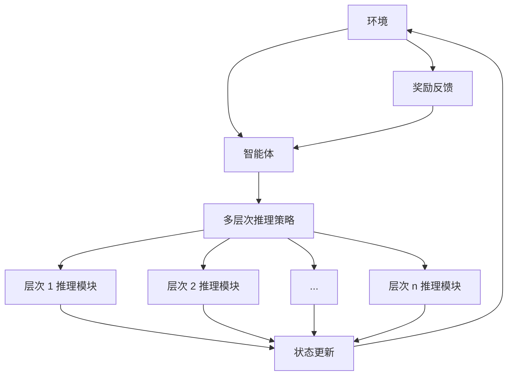

# 强化学习优化多层次推理策略的自适应调整

> 关键词：强化学习、多层次推理策略、自适应调整、马尔可夫决策过程、策略梯度算法

> 摘要：本文围绕强化学习优化多层次推理策略的自适应调整展开深入研究。首先介绍了相关的背景知识，包括研究的目的、预期读者等内容。详细阐述了强化学习、多层次推理策略以及自适应调整的核心概念与联系，并通过文本示意图和 Mermaid 流程图进行清晰展示。深入讲解了核心算法原理，利用 Python 源代码进行详细阐述。探讨了相关的数学模型和公式，并结合具体例子进行说明。通过项目实战，展示了开发环境搭建、源代码实现及解读分析。列举了实际应用场景，推荐了学习资源、开发工具框架以及相关论文著作。最后总结了未来发展趋势与挑战，还给出了常见问题解答和扩展阅读参考资料，旨在为读者全面呈现强化学习在优化多层次推理策略自适应调整方面的理论与实践内容。

## 1. 背景介绍 
### 1.1 目的和范围
在当今复杂的人工智能和机器学习领域，推理任务变得越来越复杂，单一的推理策略往往难以满足实际需求。多层次推理策略能够将复杂的推理任务分解为多个层次，逐步进行推理，从而提高推理的效率和准确性。然而，不同的推理任务和环境条件对多层次推理策略的要求各不相同，需要一种能够自适应调整策略的方法。强化学习作为一种强大的机器学习范式，通过智能体与环境的交互，不断学习最优策略，为优化多层次推理策略的自适应调整提供了有效的途径。

本研究的范围主要集中在利用强化学习算法对多层次推理策略进行优化，包括核心概念的阐述、算法原理的分析、数学模型的建立、项目实战的验证以及实际应用场景的探讨等方面。

### 1.2 预期读者
本文预期读者包括人工智能、机器学习、计算机科学等领域的研究人员、工程师和学生。对于希望深入了解强化学习在推理策略优化方面应用的专业人士，以及对相关领域感兴趣的初学者都具有一定的参考价值。

### 1.3 文档结构概述
本文共分为十个部分。第一部分介绍研究的背景信息，包括目的、预期读者和文档结构概述等。第二部分阐述强化学习、多层次推理策略和自适应调整的核心概念与联系，并给出相应的示意图和流程图。第三部分详细讲解核心算法原理，并使用 Python 源代码进行说明。第四部分介绍相关的数学模型和公式，并举例说明。第五部分通过项目实战，展示开发环境搭建、源代码实现及解读分析。第六部分列举实际应用场景。第七部分推荐学习资源、开发工具框架以及相关论文著作。第八部分总结未来发展趋势与挑战。第九部分给出常见问题解答。第十部分提供扩展阅读和参考资料。

### 1.4 术语表
#### 1.4.1 核心术语定义
- **强化学习**：一种机器学习范式，智能体通过与环境进行交互，根据环境反馈的奖励信号来学习最优策略，以最大化长期累积奖励。
- **多层次推理策略**：将复杂的推理任务分解为多个层次，每个层次负责不同的推理子任务，通过层次间的协作完成整个推理过程的策略。
- **自适应调整**：根据环境的变化和任务的需求，自动调整推理策略的参数或结构，以提高推理的性能。
- **智能体**：在强化学习中，能够感知环境状态、执行动作并接收奖励的实体。
- **环境**：智能体所处的外部世界，它提供状态信息和对智能体动作的反馈。

#### 1.4.2 相关概念解释
- **马尔可夫决策过程（MDP）**：强化学习的数学基础，描述了智能体与环境交互的动态过程，包括状态、动作、奖励、状态转移概率等要素。
- **策略**：智能体在每个状态下选择动作的规则，通常用函数表示。
- **价值函数**：用于评估状态或状态 - 动作对的价值，反映了从该状态或状态 - 动作对开始，遵循某个策略所能获得的长期累积奖励。

#### 1.4.3 缩略词列表
- **MDP**：马尔可夫决策过程（Markov Decision Process）
- **Q - learning**：一种基于值函数的强化学习算法（Q - learning Algorithm）
- **A2C**：优势演员 - 评论家算法（Advantage Actor - Critic）
- **PPO**：近端策略优化算法（Proximal Policy Optimization）

## 2. 核心概念与联系 

### 核心概念原理
#### 强化学习
强化学习的核心思想是智能体通过与环境进行交互，不断尝试不同的动作，并根据环境反馈的奖励信号来学习最优策略。智能体在每个时间步观察环境的状态 $s_t$，选择一个动作 $a_t$ 执行，环境根据动作更新状态为 $s_{t + 1}$，并给予智能体一个奖励 $r_t$。智能体的目标是学习一个策略 $\pi$，使得长期累积奖励最大化。

马尔可夫决策过程（MDP）是强化学习的数学基础，它可以用一个五元组 $\langle S, A, P, R, \gamma \rangle$ 来表示，其中：
- $S$ 是状态空间，表示环境可能处于的所有状态。
- $A$ 是动作空间，表示智能体可以执行的所有动作。
- $P(s_{t + 1}|s_t, a_t)$ 是状态转移概率，表示在状态 $s_t$ 执行动作 $a_t$ 后转移到状态 $s_{t + 1}$ 的概率。
- $R(s_t, a_t)$ 是奖励函数，表示在状态 $s_t$ 执行动作 $a_t$ 后获得的即时奖励。
- $\gamma \in [0, 1]$ 是折扣因子，用于权衡即时奖励和未来奖励的重要性。

#### 多层次推理策略
多层次推理策略将复杂的推理任务分解为多个层次，每个层次负责不同的推理子任务。例如，在自然语言处理中的文本推理任务中，可以将推理过程分为词汇级、句子级和篇章级三个层次。词汇级推理负责分析单词的语义和词性，句子级推理负责分析句子的语法和语义，篇章级推理负责分析整个文本的逻辑和主题。通过层次间的协作，可以提高推理的效率和准确性。

#### 自适应调整
自适应调整是指根据环境的变化和任务的需求，自动调整推理策略的参数或结构。在强化学习中，智能体可以通过不断学习，根据环境的反馈来调整策略，以适应不同的任务和环境条件。例如，在不同的推理任务中，智能体可以调整每个层次的推理权重，或者选择不同的推理算法，以提高推理的性能。

### 架构的文本示意图
```plaintext
+----------------------+
|      环境（Env）      |
+----------------------+
         ^       |
         |       v
+----------------------+
|      智能体（Agent）  |
|   +----------------+ |
|   |  策略网络（π）  | |
|   +----------------+ |
|   |  价值网络（V）  | |
|   +----------------+ |
+----------------------+
|   多层次推理策略     |
| +------------------+ |
| |  层次 1 推理模块  | |
| +------------------+ |
| |  层次 2 推理模块  | |
| +------------------+ |
| |  ...              | |
| |  层次 n 推理模块  | |
| +------------------+ |
+----------------------+
```

### Mermaid 流程图


## 3. 核心算法原理 & 具体操作步骤 

### 策略梯度算法原理
策略梯度算法是一类基于策略的强化学习算法，其核心思想是直接对策略进行优化。策略通常用一个参数化的函数 $\pi_{\theta}(a|s)$ 表示，其中 $\theta$ 是策略的参数。策略梯度算法的目标是通过调整参数 $\theta$，使得智能体在执行策略 $\pi_{\theta}$ 时获得的长期累积奖励最大化。

策略梯度定理表明，策略 $\pi_{\theta}$ 的性能 $J(\theta)$ 关于参数 $\theta$ 的梯度可以表示为：

$$\nabla_{\theta} J(\theta) = \mathbb{E}_{\tau \sim \pi_{\theta}} \left[ \sum_{t = 0}^{T} \nabla_{\theta} \log \pi_{\theta}(a_t|s_t) Q^{\pi_{\theta}}(s_t, a_t) \right]$$

其中，$\tau = (s_0, a_0, r_0, s_1, a_1, r_1, \cdots, s_T, a_T, r_T)$ 是一个轨迹，$Q^{\pi_{\theta}}(s_t, a_t)$ 是状态 - 动作对 $(s_t, a_t)$ 的动作价值函数。

### 具体操作步骤
1. **初始化**：随机初始化策略网络的参数 $\theta$。
2. **采样**：智能体根据当前策略 $\pi_{\theta}$ 与环境进行交互，采样得到一组轨迹 $\{ \tau_i \}_{i = 1}^{N}$。
3. **计算梯度**：根据策略梯度定理，计算策略性能 $J(\theta)$ 关于参数 $\theta$ 的梯度 $\nabla_{\theta} J(\theta)$。
4. **更新参数**：使用梯度上升法更新策略网络的参数 $\theta$：

$$\theta \leftarrow \theta + \alpha \nabla_{\theta} J(\theta)$$

其中，$\alpha$ 是学习率。
5. **重复步骤 2 - 4**：直到策略收敛或达到最大训练步数。

### Python 源代码实现
```python
import torch
import torch.nn as nn
import torch.optim as optim
import numpy as np

# 定义策略网络
class PolicyNetwork(nn.Module):
    def __init__(self, input_dim, output_dim):
        super(PolicyNetwork, self).__init__()
        self.fc1 = nn.Linear(input_dim, 128)
        self.fc2 = nn.Linear(128, output_dim)
        self.softmax = nn.Softmax(dim = 1)

    def forward(self, x):
        x = torch.relu(self.fc1(x))
        x = self.softmax(self.fc2(x))
        return x

# 定义智能体
class Agent:
    def __init__(self, input_dim, output_dim, learning_rate = 0.001):
        self.policy_network = PolicyNetwork(input_dim, output_dim)
        self.optimizer = optim.Adam(self.policy_network.parameters(), lr = learning_rate)

    def get_action(self, state):
        state = torch.FloatTensor(state).unsqueeze(0)
        probs = self.policy_network(state)
        action = torch.multinomial(probs, 1).item()
        log_prob = torch.log(probs.squeeze(0)[action])
        return action, log_prob

    def update(self, log_probs, rewards, gamma = 0.99):
        discounted_rewards = []
        cumulative_reward = 0
        for reward in reversed(rewards):
            cumulative_reward = reward + gamma * cumulative_reward
            discounted_rewards.insert(0, cumulative_reward)
        discounted_rewards = torch.FloatTensor(discounted_rewards)
        discounted_rewards = (discounted_rewards - discounted_rewards.mean()) / (discounted_rewards.std() + 1e-9)

        policy_loss = []
        for log_prob, reward in zip(log_probs, discounted_rewards):
            policy_loss.append(-log_prob * reward)
        policy_loss = torch.stack(policy_loss).sum()

        self.optimizer.zero_grad()
        policy_loss.backward()
        self.optimizer.step()
```

## 4. 数学模型和公式 & 详细讲解 & 举例说明 

### 马尔可夫决策过程（MDP）
马尔可夫决策过程（MDP）是强化学习的数学基础，用五元组 $\langle S, A, P, R, \gamma \rangle$ 表示。

- **状态空间 $S$**：表示环境可能处于的所有状态。例如，在一个迷宫游戏中，状态可以表示智能体在迷宫中的位置。
- **动作空间 $A$**：表示智能体可以执行的所有动作。在迷宫游戏中，动作可以是向上、向下、向左、向右移动。
- **状态转移概率 $P(s_{t + 1}|s_t, a_t)$**：表示在状态 $s_t$ 执行动作 $a_t$ 后转移到状态 $s_{t + 1}$ 的概率。例如，在一个确定性的迷宫中，从一个位置移动到相邻位置的概率为 1，否则为 0。
- **奖励函数 $R(s_t, a_t)$**：表示在状态 $s_t$ 执行动作 $a_t$ 后获得的即时奖励。在迷宫游戏中，如果智能体到达终点，奖励为 100；如果撞到墙壁，奖励为 -10；其他情况奖励为 -1。
- **折扣因子 $\gamma \in [0, 1]$**：用于权衡即时奖励和未来奖励的重要性。$\gamma$ 越接近 1，智能体越注重未来奖励；$\gamma$ 越接近 0，智能体越注重即时奖励。

### 价值函数
价值函数用于评估状态或状态 - 动作对的价值，反映了从该状态或状态 - 动作对开始，遵循某个策略所能获得的长期累积奖励。

- **状态价值函数 $V^{\pi}(s)$**：表示在策略 $\pi$ 下，从状态 $s$ 开始所能获得的长期累积奖励的期望值：

$$V^{\pi}(s) = \mathbb{E}_{\tau \sim \pi} \left[ \sum_{t = 0}^{\infty} \gamma^t r_t | s_0 = s \right]$$

- **动作价值函数 $Q^{\pi}(s, a)$**：表示在策略 $\pi$ 下，从状态 $s$ 执行动作 $a$ 后所能获得的长期累积奖励的期望值：

$$Q^{\pi}(s, a) = \mathbb{E}_{\tau \sim \pi} \left[ \sum_{t = 0}^{\infty} \gamma^t r_t | s_0 = s, a_0 = a \right]$$

### 贝尔曼方程
贝尔曼方程描述了价值函数的递归关系。

- **状态价值函数的贝尔曼方程**：

$$V^{\pi}(s) = \sum_{a \in A} \pi(a|s) \sum_{s' \in S} P(s'|s, a) \left[ R(s, a) + \gamma V^{\pi}(s') \right]$$

- **动作价值函数的贝尔曼方程**：

$$Q^{\pi}(s, a) = \sum_{s' \in S} P(s'|s, a) \left[ R(s, a) + \gamma \sum_{a' \in A} \pi(a'|s') Q^{\pi}(s', a') \right]$$

### 举例说明
考虑一个简单的 2x2 迷宫，智能体的目标是从左上角的起点移动到右下角的终点。状态空间 $S = \{ s_1, s_2, s_3, s_4 \}$，动作空间 $A = \{ \text{up}, \text{down}, \text{left}, \text{right} \}$。奖励函数定义为：如果智能体到达终点，奖励为 10；如果撞到墙壁，奖励为 -1；其他情况奖励为 0。折扣因子 $\gamma = 0.9$。

假设智能体遵循一个随机策略 $\pi$，即每个动作的选择概率都是 0.25。我们可以使用贝尔曼方程来计算状态价值函数 $V^{\pi}(s)$。

对于状态 $s_1$，根据贝尔曼方程：

$$V^{\pi}(s_1) = \sum_{a \in A} \pi(a|s_1) \sum_{s' \in S} P(s'|s_1, a) \left[ R(s_1, a) + \gamma V^{\pi}(s') \right]$$

- 如果动作是 $\text{up}$，智能体撞到墙壁，$P(s_1|s_1, \text{up}) = 1$，$R(s_1, \text{up}) = -1$。
- 如果动作是 $\text{down}$，智能体移动到 $s_3$，$P(s_3|s_1, \text{down}) = 1$，$R(s_1, \text{down}) = 0$。
- 如果动作是 $\text{left}$，智能体撞到墙壁，$P(s_1|s_1, \text{left}) = 1$，$R(s_1, \text{left}) = -1$。
- 如果动作是 $\text{right}$，智能体移动到 $s_2$，$P(s_2|s_1, \text{right}) = 1$，$R(s_1, \text{right}) = 0$。

通过迭代计算，可以得到状态价值函数 $V^{\pi}(s)$ 的值。

## 5. 项目实战：代码实际案例和详细解释说明 

### 5.1  开发环境搭建
#### 安装 Python
首先，确保你已经安装了 Python 3.6 或更高版本。可以从 Python 官方网站（https://www.python.org/downloads/） 下载并安装。

#### 安装依赖库
本项目需要使用以下 Python 库：
- `torch`：用于构建和训练神经网络。
- `numpy`：用于数值计算。
- `gym`：用于创建和管理强化学习环境。

可以使用以下命令安装这些库：
```sh
pip install torch numpy gym
```

### 5.2  源代码详细实现和代码解读
```python
import torch
import torch.nn as nn
import torch.optim as optim
import numpy as np
import gym

# 定义策略网络
class PolicyNetwork(nn.Module):
    def __init__(self, input_dim, output_dim):
        super(PolicyNetwork, self).__init__()
        self.fc1 = nn.Linear(input_dim, 128)
        self.fc2 = nn.Linear(128, output_dim)
        self.softmax = nn.Softmax(dim = 1)

    def forward(self, x):
        x = torch.relu(self.fc1(x))
        x = self.softmax(self.fc2(x))
        return x

# 定义智能体
class Agent:
    def __init__(self, input_dim, output_dim, learning_rate = 0.001):
        self.policy_network = PolicyNetwork(input_dim, output_dim)
        self.optimizer = optim.Adam(self.policy_network.parameters(), lr = learning_rate)

    def get_action(self, state):
        state = torch.FloatTensor(state).unsqueeze(0)
        probs = self.policy_network(state)
        action = torch.multinomial(probs, 1).item()
        log_prob = torch.log(probs.squeeze(0)[action])
        return action, log_prob

    def update(self, log_probs, rewards, gamma = 0.99):
        discounted_rewards = []
        cumulative_reward = 0
        for reward in reversed(rewards):
            cumulative_reward = reward + gamma * cumulative_reward
            discounted_rewards.insert(0, cumulative_reward)
        discounted_rewards = torch.FloatTensor(discounted_rewards)
        discounted_rewards = (discounted_rewards - discounted_rewards.mean()) / (discounted_rewards.std() + 1e-9)

        policy_loss = []
        for log_prob, reward in zip(log_probs, discounted_rewards):
            policy_loss.append(-log_prob * reward)
        policy_loss = torch.stack(policy_loss).sum()

        self.optimizer.zero_grad()
        policy_loss.backward()
        self.optimizer.step()

# 主训练函数
def train():
    env = gym.make('CartPole-v1')
    input_dim = env.observation_space.shape[0]
    output_dim = env.action_space.n
    agent = Agent(input_dim, output_dim)

    num_episodes = 1000
    for episode in range(num_episodes):
        state = env.reset()
        log_probs = []
        rewards = []
        done = False
        while not done:
            action, log_prob = agent.get_action(state)
            next_state, reward, done, _ = env.step(action)
            log_probs.append(log_prob)
            rewards.append(reward)
            state = next_state
        agent.update(log_probs, rewards)
        total_reward = sum(rewards)
        print(f"Episode {episode}: Total Reward = {total_reward}")

    env.close()

if __name__ == "__main__":
    train()
```

### 5.3  代码解读与分析
#### 策略网络 `PolicyNetwork`
`PolicyNetwork` 是一个简单的两层全连接神经网络，用于输出每个动作的概率分布。输入层的维度是环境的状态维度，输出层的维度是环境的动作维度。通过 `softmax` 函数将输出转换为概率分布。

#### 智能体 `Agent`
- `__init__` 方法：初始化策略网络和优化器。
- `get_action` 方法：根据当前状态，通过策略网络得到动作的概率分布，然后使用 `torch.multinomial` 函数采样得到一个动作，并计算该动作的对数概率。
- `update` 方法：根据采样得到的对数概率和奖励，计算策略梯度，并使用优化器更新策略网络的参数。

#### 主训练函数 `train`
- 创建 `CartPole-v1` 环境。
- 初始化智能体。
- 进行多个回合的训练，每个回合中智能体与环境进行交互，记录对数概率和奖励。
- 每个回合结束后，调用智能体的 `update` 方法更新策略网络的参数。
- 打印每个回合的总奖励。

## 6. 实际应用场景 
### 自然语言处理
在自然语言处理中，多层次推理策略可以应用于文本推理、问答系统等任务。例如，在文本推理任务中，可以将推理过程分为词汇级、句子级和篇章级三个层次。强化学习可以用于自适应调整每个层次的推理策略，根据不同的文本和任务需求，选择最优的推理算法和参数，提高推理的准确性和效率。

### 计算机视觉
在计算机视觉中，多层次推理策略可以应用于目标检测、图像分类等任务。例如，在目标检测任务中，可以将检测过程分为特征提取、候选框生成和目标分类三个层次。强化学习可以用于自适应调整每个层次的参数和策略，根据不同的图像和场景，选择最优的检测算法和参数，提高目标检测的准确率和速度。

### 机器人控制
在机器人控制中，多层次推理策略可以应用于路径规划、动作决策等任务。例如，在机器人路径规划任务中，可以将规划过程分为全局路径规划、局部路径规划和避障三个层次。强化学习可以用于自适应调整每个层次的策略，根据不同的环境和任务需求，选择最优的路径规划算法和动作决策策略，提高机器人的运动效率和安全性。

## 7. 工具和资源推荐
### 7.1 学习资源推荐
#### 7.1.1 书籍推荐
- 《Reinforcement Learning: An Introduction》（Richard S. Sutton 和 Andrew G. Barto 著）：强化学习领域的经典教材，全面介绍了强化学习的基本概念、算法和应用。
- 《Deep Reinforcement Learning Hands-On》（Max Lapan 著）：通过实践项目介绍了深度强化学习的理论和应用，适合有一定编程基础的读者。

#### 7.1.2 在线课程
- Coursera 上的 “Reinforcement Learning Specialization”：由 University of Alberta 提供，系统介绍了强化学习的理论和实践。
- edX 上的 “Introduction to Artificial Intelligence”：包含了强化学习的相关内容，适合初学者入门。

#### 7.1.3 技术博客和网站
- OpenAI Blog（https://openai.com/blog/）：OpenAI 发布的关于人工智能和强化学习的最新研究成果和技术文章。
- DeepMind Blog（https://deepmind.com/blog/）：DeepMind 发布的关于人工智能和强化学习的最新研究成果和技术文章。

### 7.2 开发工具框架推荐
#### 7.2.1 IDE和编辑器
- PyCharm：功能强大的 Python 集成开发环境，提供代码编辑、调试、版本控制等功能。
- Visual Studio Code：轻量级的代码编辑器，支持多种编程语言，通过安装扩展可以实现 Python 开发的各种功能。

#### 7.2.2 调试和性能分析工具
- TensorBoard：用于可视化深度学习模型的训练过程和性能指标，帮助用户分析模型的训练情况。
- PyTorch Profiler：PyTorch 提供的性能分析工具，用于分析模型的运行时间和内存使用情况。

#### 7.2.3 相关框架和库
- PyTorch：开源的深度学习框架，提供了丰富的神经网络模块和优化算法，方便用户构建和训练强化学习模型。
- TensorFlow：另一个流行的深度学习框架，也支持强化学习的开发。
- Stable Baselines3：基于 PyTorch 的强化学习库，提供了多种预训练的强化学习算法和环境，方便用户快速进行实验和开发。

### 7.3 相关论文著作推荐
#### 7.3.1 经典论文
- “Policy Gradient Methods for Reinforcement Learning with Function Approximation”（Richard S. Sutton 等著）：介绍了策略梯度算法的基本原理和应用。
- “Playing Atari with Deep Reinforcement Learning”（Volodymyr Mnih 等著）：提出了深度 Q 网络（DQN）算法，开创了深度强化学习的先河。

#### 7.3.2 最新研究成果
- 关注 NeurIPS、ICML、AAAI 等顶级人工智能会议的论文，了解强化学习领域的最新研究成果和技术进展。

#### 7.3.3 应用案例分析
- 阅读相关的技术博客和论文，了解强化学习在自然语言处理、计算机视觉、机器人控制等领域的应用案例和实践经验。

## 8. 总结：未来发展趋势与挑战
### 未来发展趋势
#### 多智能体强化学习
随着智能系统的不断发展，多智能体系统的应用越来越广泛。多智能体强化学习可以让多个智能体在同一个环境中进行协作或竞争，共同完成复杂的任务。未来，多智能体强化学习将在机器人协作、自动驾驶、智能交通等领域发挥重要作用。

#### 结合其他技术
强化学习可以与其他机器学习技术，如深度学习、迁移学习、元学习等相结合，提高智能体的学习能力和泛化能力。例如，将强化学习与深度学习相结合，可以处理高维的状态和动作空间；将强化学习与迁移学习相结合，可以加快智能体的学习速度。

#### 应用于更多领域
强化学习将在更多领域得到应用，如医疗保健、金融、教育等。例如，在医疗保健领域，强化学习可以用于优化治疗方案、预测疾病发展；在金融领域，强化学习可以用于投资决策、风险评估。

### 挑战
#### 样本效率问题
强化学习通常需要大量的样本进行训练，样本效率较低。这使得在实际应用中，训练时间长、成本高。未来需要研究更高效的强化学习算法，提高样本效率。

#### 可解释性问题
强化学习模型通常是黑盒模型，难以解释其决策过程和行为。在一些关键领域，如医疗、金融等，可解释性是非常重要的。未来需要研究可解释的强化学习方法，提高模型的透明度和可信度。

#### 环境建模问题
强化学习的性能很大程度上依赖于环境模型的准确性。在一些复杂的实际环境中，环境模型难以准确建模，这会影响智能体的学习效果。未来需要研究更有效的环境建模方法，提高智能体在复杂环境中的学习能力。

## 9. 附录：常见问题与解答
### 1. 强化学习和监督学习有什么区别？
监督学习是通过给定的输入 - 输出对进行学习，目标是学习输入和输出之间的映射关系。而强化学习是通过智能体与环境的交互，根据环境反馈的奖励信号来学习最优策略，目标是最大化长期累积奖励。

### 2. 策略梯度算法和基于值函数的算法有什么区别？
基于值函数的算法，如 Q - learning，通过学习值函数来间接得到最优策略。而策略梯度算法直接对策略进行优化，通过调整策略的参数来最大化长期累积奖励。

### 3. 如何选择合适的折扣因子 $\gamma$？
折扣因子 $\gamma$ 用于权衡即时奖励和未来奖励的重要性。$\gamma$ 越接近 1，智能体越注重未来奖励；$\gamma$ 越接近 0，智能体越注重即时奖励。通常需要根据具体的任务和环境来选择合适的 $\gamma$ 值。一般来说，如果任务的决策对未来的影响较大，可以选择较大的 $\gamma$ 值；如果任务的决策主要影响当前步骤，可以选择较小的 $\gamma$ 值。

### 4. 强化学习在实际应用中存在哪些问题？
强化学习在实际应用中存在样本效率低、可解释性差、环境建模困难等问题。此外，强化学习的训练过程通常比较复杂，需要调整多个超参数，对计算资源的要求也较高。

## 10. 扩展阅读 & 参考资料
### 扩展阅读
- 《Deep Reinforcement Learning in Action》（Alex Zai 和 Brandon Brown 著）：通过实际案例介绍了深度强化学习的应用和实践技巧。
- 《Algorithms for Reinforcement Learning》（Csaba Szepesvári 著）：深入介绍了强化学习的算法原理和理论分析。

### 参考资料
- Richard S. Sutton 和 Andrew G. Barto. 《Reinforcement Learning: An Introduction》. MIT Press, 2018.
- Volodymyr Mnih 等. “Playing Atari with Deep Reinforcement Learning”. arXiv preprint arXiv:1312.5602, 2013.
- OpenAI Gym 官方文档（https://gym.openai.com/docs/）
- PyTorch 官方文档（https://pytorch.org/docs/stable/）