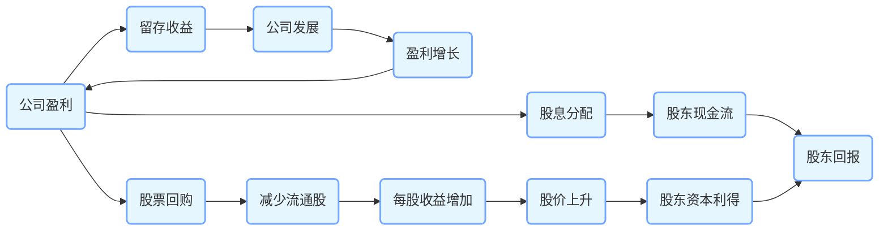

# 彼得林奇如何看待公司的股东回报政策

> 关键词：彼得林奇、股东回报政策、股息、股票回购、公司价值、投资策略、股东权益

> 摘要：本文深入探讨了投资大师彼得林奇对于公司股东回报政策的观点。首先介绍了相关背景知识，包括彼得林奇的投资成就和股东回报政策的重要性。接着阐述了股息、股票回购等核心概念及其与公司价值的联系。详细分析了彼得林奇判断股东回报政策优劣的算法原理和具体操作思路，还给出了相关数学模型和公式进行说明。通过实际案例展示了如何依据彼得林奇的观点评估公司的股东回报政策。同时探讨了股东回报政策在不同场景下的实际应用。推荐了学习相关知识的工具和资源，最后总结了未来公司股东回报政策的发展趋势与挑战，并解答了常见问题，提供了扩展阅读和参考资料，旨在帮助投资者更好地理解和运用彼得林奇的投资理念来评估公司的股东回报政策。

## 1. 背景介绍 
### 1.1 目的和范围
本部分旨在全面剖析彼得林奇对于公司股东回报政策的看法。范围涵盖了彼得林奇在其投资生涯中所提及的关于股息、股票回购等股东回报方式的观点，以及这些政策与公司基本面、股票投资价值之间的关系。通过对其观点的研究，投资者可以更好地理解如何评估一家公司的股东回报政策是否合理，从而为投资决策提供有力支持。

### 1.2 预期读者
本文预期读者包括对投资领域感兴趣的个人投资者、金融专业学生、投资机构从业者等。对于希望学习投资大师彼得林奇的投资理念，尤其是想深入了解公司股东回报政策相关知识的人群具有较高的参考价值。

### 1.3 文档结构概述
本文首先介绍背景知识，包括目的、读者群体和文档结构。接着阐述核心概念，如股息、股票回购等，以及它们与公司价值的联系。然后分析彼得林奇判断股东回报政策的算法原理和具体操作步骤，给出相关数学模型和公式。通过实际案例展示如何应用这些理论。探讨股东回报政策的实际应用场景，推荐学习工具和资源。最后总结未来发展趋势与挑战，解答常见问题并提供扩展阅读和参考资料。

### 1.4 术语表
#### 1.4.1 核心术语定义
- **股东回报政策**：公司将盈利分配给股东的一系列政策和措施，主要包括股息分配和股票回购。
- **股息**：公司按照一定的比例向股东支付的利润分配，通常以现金或股票的形式发放。
- **股票回购**：公司从市场上购回自己发行在外的股票，减少流通股数量。

#### 1.4.2 相关概念解释
- **股息率**：股息与股票价格的比率，反映了股东从股息中获得的收益率。
- **每股收益（EPS）**：公司净利润与发行在外普通股股数的比率，衡量公司的盈利能力。
- **市盈率（P/E）**：股票价格与每股收益的比率，反映了市场对公司盈利的预期。

#### 1.4.3 缩略词列表
- **EPS**：Earnings Per Share（每股收益）
- **P/E**：Price-to-Earnings Ratio（市盈率）

## 2. 核心概念与联系 

### 2.1 股息
股息是公司将盈利的一部分分配给股东的方式。对于股东来说，股息是一种稳定的现金流收入。公司发放股息的决策通常受到多种因素的影响，如公司的盈利状况、财务状况、发展战略等。一般来说，盈利稳定、现金流充足的公司更有可能发放较高的股息。

从投资者的角度来看，股息率是一个重要的指标。股息率高的股票可能更具吸引力，因为它可以为投资者提供相对稳定的收益。然而，过高的股息率也可能意味着公司的发展前景不佳，或者公司在过度分配利润，影响了未来的发展。

### 2.2 股票回购
股票回购是公司从市场上购回自己的股票。股票回购的目的主要有以下几点：一是提高每股收益，通过减少流通股数量，在净利润不变的情况下，每股收益会相应提高；二是向市场传递公司股价被低估的信号，增强市场信心；三是优化公司的资本结构。

股票回购对股东的影响是多方面的。一方面，回购后每股股票所代表的公司权益增加，可能会推动股价上涨；另一方面，股东可以选择在股价上涨后出售股票获得资本利得。

### 2.3 核心概念与公司价值的联系
股息和股票回购都是公司向股东分配价值的方式，它们与公司的价值密切相关。合理的股东回报政策可以提高股东的满意度，增强投资者对公司的信心，从而提升公司的市场形象和估值。

例如，一家公司如果能够持续稳定地发放股息，并且根据市场情况适时进行股票回购，会让投资者认为该公司具有良好的盈利能力和财务状况，进而愿意以更高的价格购买该公司的股票，推动公司市值上升。

### 2.4 文本示意图
股东回报政策主要包括股息和股票回购两个方面。股息的发放取决于公司的盈利和财务状况，影响股东的现金流收入和股息率。股票回购则通过减少流通股数量影响每股收益和股价。这些因素相互作用，共同影响公司的价值和股东的权益。

### 2.5 Mermaid 流程图


## 3. 核心算法原理 & 具体操作步骤 

### 3.1 股息相关算法原理
彼得林奇认为，股息率是评估股息政策的重要指标。股息率的计算公式为：

```python
def dividend_yield(dividend_per_share, stock_price):
    """
    计算股息率
    :param dividend_per_share: 每股股息
    :param stock_price: 股票价格
    :return: 股息率
    """
    return dividend_per_share / stock_price
```

例如，某公司每股股息为 2 元，股票价格为 50 元，则股息率为：

```python
print(dividend_yield(2, 50))  
```

### 3.2 股票回购对每股收益影响的算法原理
股票回购后每股收益的变化可以通过以下公式计算：

设公司原来的净利润为 $NetIncome$，原来的发行在外普通股股数为 $SharesOutstanding$，回购的股数为 $SharesRepurchased$，则回购后的每股收益 $EPS_{new}$ 为：

```python
def eps_after_repurchase(net_income, shares_outstanding, shares_repurchased):
    """
    计算股票回购后的每股收益
    :param net_income: 净利润
    :param shares_outstanding: 原来发行在外普通股股数
    :param shares_repurchased: 回购的股数
    :return: 回购后的每股收益
    """
    return net_income / (shares_outstanding - shares_repurchased)
```

例如，某公司净利润为 1000 万元，原来发行在外普通股股数为 500 万股，回购了 50 万股，则回购后的每股收益为：

```python
print(eps_after_repurchase(10000000, 5000000, 500000))  
```

### 3.3 具体操作步骤
1. **收集数据**：收集公司的财务报表，获取每股股息、股票价格、净利润、发行在外普通股股数、回购股数等数据。
2. **计算指标**：根据上述算法，计算股息率和股票回购后的每股收益等指标。
3. **分析评估**：将计算得到的指标与同行业公司进行比较，结合公司的发展战略和财务状况，评估公司的股东回报政策是否合理。

## 4. 数学模型和公式 & 详细讲解 & 举例说明 

### 4.1 股息率公式
股息率 $DY$ 的计算公式为：

$$DY = \frac{DPS}{P}$$

其中，$DPS$ 表示每股股息，$P$ 表示股票价格。

股息率反映了股东从股息中获得的收益率。例如，当 $DPS = 2$ 元，$P = 50$ 元时，$DY=\frac{2}{50}=0.04$，即股息率为 4%。

### 4.2 股票回购后每股收益公式
设原来的每股收益为 $EPS_{old}=\frac{NI}{SO}$，其中 $NI$ 为净利润，$SO$ 为原来发行在外普通股股数。

回购后的每股收益 $EPS_{new}=\frac{NI}{SO - SR}$，其中 $SR$ 为回购的股数。

例如，某公司 $NI = 1000$ 万元，$SO = 500$ 万股，$SR = 50$ 万股。

原来的每股收益 $EPS_{old}=\frac{10000000}{5000000}=2$ 元。

回购后的每股收益 $EPS_{new}=\frac{10000000}{5000000 - 500000}=\frac{10000000}{4500000}\approx2.22$ 元。

### 4.3 股东总回报公式
股东总回报 $TR$ 包括股息收益和资本利得，其计算公式为：

$$TR=\frac{D+(P_1 - P_0)}{P_0}$$

其中，$D$ 为持有期间获得的股息，$P_0$ 为买入股票的价格，$P_1$ 为卖出股票的价格。

例如，投资者买入股票价格为 50 元，持有期间获得股息 2 元，卖出股票价格为 55 元，则股东总回报为：

$$TR=\frac{2+(55 - 50)}{50}=\frac{2 + 5}{50}=0.14$$

即股东总回报为 14%。

## 5. 项目实战：代码实际案例和详细解释说明 

### 5.1  开发环境搭建
- **编程语言**：Python 3.x
- **开发工具**：可以选择 PyCharm、Jupyter Notebook 等。
- **所需库**：pandas、numpy 等，用于数据处理和分析。

### 5.2  源代码详细实现和代码解读
```python
import pandas as pd
import numpy as np

# 模拟公司财务数据
data = {
    '年份': [2018, 2019, 2020, 2021, 2022],
    '净利润（万元）': [800, 900, 1000, 1100, 1200],
    '发行在外普通股股数（万股）': [400, 400, 400, 380, 360],
    '每股股息（元）': [1.5, 1.6, 1.8, 2, 2.2],
    '股票价格（元）': [40, 42, 45, 48, 50]
}

df = pd.DataFrame(data)

# 计算股息率
df['股息率'] = df['每股股息（元）'] / df['股票价格（元）']

# 计算每股收益
df['每股收益（元）'] = df['净利润（万元）'] * 10000 / df['发行在外普通股股数（万股）']

# 计算股票回购对每股收益的影响（假设 2021 年和 2022 年有股票回购）
df['回购后每股收益（元）'] = np.nan
df.loc[2021 - 2018, '回购后每股收益（元）'] = df.loc[2021 - 2018, '净利润（万元）'] * 10000 / (df.loc[2020 - 2018, '发行在外普通股股数（万股）'] - (df.loc[2020 - 2018, '发行在外普通股股数（万股）'] - df.loc[2021 - 2018, '发行在外普通股股数（万股）']))
df.loc[2022 - 2018, '回购后每股收益（元）'] = df.loc[2022 - 2018, '净利润（万元）'] * 10000 / (df.loc[2021 - 2018, '发行在外普通股股数（万股）'] - (df.loc[2021 - 2018, '发行在外普通股股数（万股）'] - df.loc[2022 - 2018, '发行在外普通股股数（万股）']))

print(df)
```

### 5.3  代码解读与分析
1. **数据模拟**：使用字典 `data` 模拟了公司 2018 - 2022 年的财务数据，包括净利润、发行在外普通股股数、每股股息和股票价格。
2. **数据处理**：使用 `pandas` 库将数据转换为 DataFrame 格式。
3. **指标计算**：
    - 计算股息率：通过每股股息除以股票价格得到。
    - 计算每股收益：净利润除以发行在外普通股股数。
    - 计算股票回购后每股收益：根据前面的公式，在有股票回购的年份计算回购后的每股收益。
4. **结果输出**：打印出包含各项指标的 DataFrame，方便分析公司的股东回报政策变化。

## 6. 实际应用场景 
### 6.1 投资者选股
投资者在选择股票时，可以参考公司的股东回报政策。对于追求稳定收益的投资者来说，股息率较高且稳定的公司可能更具吸引力。例如，一些成熟的公用事业公司，通常会有较高的股息率，适合风险偏好较低的投资者。

对于追求资本增值的投资者来说，关注公司的股票回购政策是一个重要的方面。如果公司的股票回购能够有效提高每股收益，推动股价上涨，那么这类公司可能更值得投资。

### 6.2 公司战略决策
公司在制定股东回报政策时，需要综合考虑自身的盈利状况、财务状况和发展战略。如果公司处于快速发展阶段，需要大量的资金进行投资和扩张，那么可能会减少股息分配，增加留存收益。相反，如果公司的业务已经成熟，现金流充足，适当提高股息率或进行股票回购可以提高股东的满意度，增强公司的市场形象。

### 6.3 行业分析
通过比较同行业公司的股东回报政策，可以了解行业的发展趋势和竞争格局。如果某个行业的公司普遍提高股息率或加大股票回购力度，可能意味着该行业已经进入成熟期，增长空间有限。相反，如果某个行业的公司很少进行股东回报，可能意味着该行业正处于快速发展阶段，需要大量资金投入。

## 7. 工具和资源推荐
### 7.1 学习资源推荐
#### 7.1.1 书籍推荐
- 《彼得林奇的成功投资》：彼得林奇的经典著作，详细介绍了他的投资理念和方法，包括对公司股东回报政策的看法。
- 《聪明的投资者》：本杰明·格雷厄姆的著作，被誉为投资界的圣经，对理解公司价值和股东回报有很大帮助。

#### 7.1.2 在线课程
- Coursera 上的“投资学原理”课程：由知名大学教授授课，系统介绍投资学的基本原理和方法，包括股东回报政策的相关内容。
- 网易云课堂上的“股票投资实战技巧”课程：结合实际案例，讲解如何分析公司的股东回报政策和进行股票投资。

#### 7.1.3 技术博客和网站
- 雪球网：国内知名的投资交流社区，有大量关于公司股东回报政策的讨论和分析。
- Seeking Alpha：国外知名的金融分析网站，提供专业的公司分析和投资建议，包括对股东回报政策的研究。

### 7.2 开发工具框架推荐
#### 7.2.1 IDE和编辑器
- PyCharm：功能强大的 Python 集成开发环境，适合进行数据分析和算法实现。
- Jupyter Notebook：交互式的编程环境，方便进行代码演示和数据分析。

#### 7.2.2 调试和性能分析工具
- PDB：Python 自带的调试工具，用于调试 Python 代码。
- cProfile：Python 的性能分析工具，用于分析代码的性能瓶颈。

#### 7.2.3 相关框架和库
- pandas：用于数据处理和分析的 Python 库，非常适合处理公司财务数据。
- numpy：用于科学计算的 Python 库，提供高效的数组操作和数学函数。

### 7.3 相关论文著作推荐
#### 7.3.1 经典论文
- Miller, M. H., & Modigliani, F. (1961). Dividend policy, growth, and the valuation of shares. The Journal of Business, 34(4), 411 - 433. 该论文探讨了股息政策与公司价值的关系，是股息理论的经典之作。
- Fama, E. F., & French, K. R. (2001). Disappearing dividends: changing firm characteristics or lower propensity to pay? The Journal of Financial Economics, 60(1), 3 - 43. 研究了公司股息支付倾向的变化及其影响因素。

#### 7.3.2 最新研究成果
可以通过 SSRN（Social Science Research Network）等学术平台查找关于股东回报政策的最新研究论文，了解该领域的前沿动态。

#### 7.3.3 应用案例分析
一些金融研究机构和咨询公司会发布关于公司股东回报政策的案例分析报告，可以通过其官方网站或专业数据库获取。

## 8. 总结：未来发展趋势与挑战
### 8.1 未来发展趋势
- **更加注重股东回报**：随着投资者权益意识的提高，公司将更加重视股东回报政策，以吸引投资者。未来，股息分配和股票回购可能会更加普遍。
- **多元化的回报方式**：除了传统的股息和股票回购，公司可能会探索更多元化的股东回报方式，如发放特别股息、进行资产剥离并将收益分配给股东等。
- **与可持续发展相结合**：越来越多的公司将股东回报政策与可持续发展目标相结合，例如通过投资环保项目提高公司的长期价值，从而为股东带来更高的回报。

### 8.2 挑战
- **盈利不确定性**：宏观经济环境的变化、行业竞争的加剧等因素可能导致公司盈利的不确定性增加，这给公司制定合理的股东回报政策带来了挑战。
- **资金压力**：在进行股息分配和股票回购时，公司需要有充足的资金。如果公司过度分配利润，可能会影响其未来的发展和财务稳定。
- **市场预期管理**：公司的股东回报政策会影响市场预期，如果政策调整不当，可能会引起股价波动，对公司造成不利影响。

## 9. 附录：常见问题与解答
### 9.1 股息率越高越好吗？
不一定。虽然高股息率可以为投资者提供较高的收益，但过高的股息率可能意味着公司的发展前景不佳，或者公司在过度分配利润，影响了未来的发展。投资者需要综合考虑公司的盈利状况、财务状况和发展战略等因素。

### 9.2 股票回购一定会推动股价上涨吗？
不一定。股票回购对股价的影响受到多种因素的影响，如市场环境、公司的基本面、回购的规模和方式等。如果市场对公司的未来发展前景不看好，即使进行股票回购，股价也可能不会上涨。

### 9.3 公司如何平衡股息分配和留存收益？
公司需要根据自身的发展阶段、盈利状况、财务状况和投资机会等因素来平衡股息分配和留存收益。在快速发展阶段，公司可能会减少股息分配，增加留存收益用于投资和扩张；在成熟阶段，公司可以适当提高股息率，回报股东。

## 10. 扩展阅读 & 参考资料
### 10.1 扩展阅读
- 《金融市场与金融机构》：全面介绍金融市场和金融机构的运作机制，有助于深入理解公司股东回报政策的宏观背景。
- 《公司金融》：系统讲解公司金融的理论和实践，包括资本结构、股息政策等内容。

### 10.2 参考资料
- 公司的年度报告和财务报表：可以获取公司的财务数据和股东回报政策相关信息。
- 证券交易所的公告和文件：了解上市公司的相关规定和信息披露要求。
- 金融新闻媒体：如财新网、华尔街日报等，获取最新的金融市场动态和公司资讯。