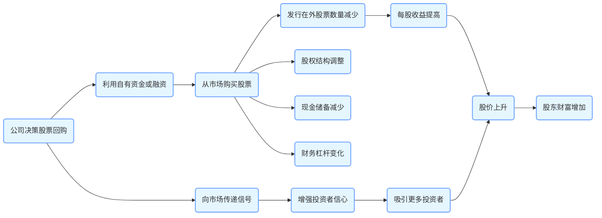

# 彼得林奇如何看待公司的股票回购

> 关键词：彼得林奇、股票回购、公司财务、股东价值、投资策略

> 摘要：本文深入探讨了投资大师彼得林奇对于公司股票回购的看法。首先介绍了股票回购的背景知识以及彼得林奇在投资领域的地位和影响力。接着阐述了股票回购的核心概念与相关联系，包括其原理和架构。通过核心算法原理和数学模型公式的分析，更清晰地展现股票回购对公司和股东的影响。结合项目实战案例，详细解释了股票回购在实际操作中的情况。分析了股票回购在不同场景下的实际应用，推荐了学习相关知识的工具和资源。最后总结了未来股票回购的发展趋势与挑战，并对常见问题进行了解答，为投资者理解彼得林奇的观点以及股票回购的相关知识提供全面的参考。

## 1. 背景介绍 
### 1.1 目的和范围
本文旨在全面探究彼得林奇对公司股票回购的看法。股票回购作为公司的一种重要财务决策，对公司的股价、股东权益、财务状况等都有着深远的影响。彼得林奇作为投资界的传奇人物，他的观点对于投资者理解股票回购的意义和价值具有重要的指导作用。我们将深入研究彼得林奇的著作、言论和投资实践，分析他如何看待股票回购在公司运营和投资决策中的地位和作用。范围涵盖股票回购的基本概念、彼得林奇观点的具体内容、股票回购的实际应用案例以及相关的理论和实践分析。

### 1.2 预期读者
本文预期读者包括广大的投资者，无论是专业的投资机构人员，还是普通的散户投资者，都可以从彼得林奇的观点中获取有价值的投资思路和决策参考。同时，对于金融专业的学生和研究人员，本文可以作为了解股票回购和投资理论的学习资料，帮助他们深入理解相关概念和实践应用。此外，公司的管理层和财务人员也可以通过本文了解股票回购的影响和意义，为公司的财务决策提供参考。

### 1.3 文档结构概述
本文将按照以下结构进行阐述：首先介绍背景知识，包括目的、预期读者和文档结构概述，以及相关术语的定义和解释。接着深入探讨股票回购的核心概念与联系，通过文本示意图和 Mermaid 流程图展示其原理和架构。然后详细讲解核心算法原理和具体操作步骤，并运用数学模型和公式进行分析和举例说明。通过项目实战案例，展示股票回购在实际中的应用和效果。分析股票回购在不同场景下的实际应用。推荐学习相关知识的工具和资源，包括书籍、在线课程、技术博客、开发工具和相关论文著作等。最后总结未来股票回购的发展趋势与挑战，解答常见问题，并提供扩展阅读和参考资料。

### 1.4 术语表
#### 1.4.1 核心术语定义
- **股票回购**：指上市公司利用现金等方式，从股票市场上购回本公司发行在外的一定数额股票的行为。公司在股票回购完成后可以将所回购的股票注销，也可以将其作为“库藏股”保留。
- **股东权益**：是指公司总资产中扣除负债所余下的部分，也称为净资产。股东权益是一个很重要的财务指标，它反映了公司的自有资本。
- **每股收益**：是指税后利润与股本总数的比率。它是测定股票投资价值的重要指标之一，是分析每股价值的一个基础性指标，是综合反映公司获利能力的重要指标。
- **市值**：是指一家上市公司的发行股份按市场价格计算出来的股票总价值，其计算方法为每股股票的市场价格乘以发行总股数。

#### 1.4.2 相关概念解释
- **库藏股**：是公司将自己已经发行的股票重新购回，存放于公司，而尚未注销或重新售出。库藏股没有投票权、分红权等股东权利，不参与每股收益的计算。
- **现金流量**：是指企业在一定会计期间按照现金收付实现制，通过一定经济活动而产生的现金流入、现金流出及其总量情况的总称。公司进行股票回购需要有足够的现金流量支持。
- **财务杠杆**：是指由于债务的存在而导致普通股每股利润变动大于息税前利润变动的杠杆效应。股票回购可能会影响公司的财务杠杆水平。

#### 1.4.3 缩略词列表
- **EPS**：Earnings Per Share，每股收益
- **ROE**：Return on Equity，净资产收益率

## 2. 核心概念与联系 

### 股票回购的原理
股票回购是公司的一种资本运作方式，其基本原理是公司利用自有资金或通过融资等方式，从市场上购买本公司的股票。公司进行股票回购的动机有多种，常见的包括提高每股收益、向市场传递公司价值被低估的信号、调整股权结构、防止恶意收购等。

当公司回购股票后，发行在外的股票数量减少。在公司净利润不变的情况下，每股收益（EPS）会相应提高。因为每股收益的计算公式为：$EPS=\frac{净利润}{发行在外的普通股股数}$，分母减小，每股收益自然增加。这会吸引更多的投资者关注公司股票，可能导致股价上升，从而提高股东的财富。

### 股票回购与股东价值的联系
股票回购对股东价值有着重要的影响。一方面，如前面所述，通过提高每股收益，股票回购可以提升公司的股价，股东持有的股票价值增加。另一方面，股票回购是公司向股东分配现金的一种方式，相当于一种特殊的分红。股东可以选择在股票回购时出售自己的股票，获得现金回报。

此外，股票回购还可以向市场传递公司管理层对公司未来发展的信心。当公司认为自己的股票被市场低估时，通过回购股票，向投资者表明公司对自身价值的认可，增强投资者的信心，从而吸引更多的投资者购买公司股票，进一步推动股价上升。

### 股票回购与公司财务状况的联系
股票回购会对公司的财务状况产生影响。首先，股票回购需要公司支付现金，这会减少公司的现金储备。如果公司过度进行股票回购，可能会导致公司现金短缺，影响公司的正常运营和投资计划。

其次，股票回购会影响公司的股权结构。回购股票后，公司的大股东持股比例相对增加，股权更加集中。这可能会增强大股东对公司的控制权，但也可能会引发一些治理问题。

另外，股票回购还会影响公司的财务杠杆。如果公司通过借款来进行股票回购，会增加公司的负债水平，提高财务杠杆。这在一定程度上增加了公司的财务风险，但如果公司能够合理利用财务杠杆，也可能提高股东的回报率。

### 文本示意图
```plaintext
股票回购
|
|-- 动机
|   |-- 提高每股收益
|   |-- 传递价值低估信号
|   |-- 调整股权结构
|   |-- 防止恶意收购
|
|-- 影响
|   |-- 对股东价值
|   |   |-- 股价上升
|   |   |-- 特殊分红
|   |   |-- 增强信心
|   |-- 对公司财务状况
|       |-- 现金储备减少
|       |-- 股权结构变化
|       |-- 财务杠杆调整
```

### Mermaid 流程图


## 3. 核心算法原理 & 具体操作步骤 

### 核心算法原理
股票回购对每股收益的影响可以通过以下公式计算：

设公司初始净利润为 $N$，初始发行在外的普通股股数为 $S_0$，回购的股数为 $\Delta S$，则回购前的每股收益 $EPS_0=\frac{N}{S_0}$，回购后的每股收益 $EPS_1=\frac{N}{S_0 - \Delta S}$。

下面通过 Python 代码来演示这个计算过程：
```python
def calculate_eps_before_repurchase(net_income, shares_outstanding):
    """
    计算回购前的每股收益
    :param net_income: 公司净利润
    :param shares_outstanding: 发行在外的普通股股数
    :return: 每股收益
    """
    return net_income / shares_outstanding

def calculate_eps_after_repurchase(net_income, shares_outstanding, repurchased_shares):
    """
    计算回购后的每股收益
    :param net_income: 公司净利润
    :param shares_outstanding: 发行在外的普通股股数
    :param repurchased_shares: 回购的股数
    :return: 每股收益
    """
    return net_income / (shares_outstanding - repurchased_shares)

# 示例数据
net_income = 1000000  # 公司净利润为 100 万
shares_outstanding = 100000  # 发行在外的普通股股数为 10 万股
repurchased_shares = 10000  # 回购 1 万股

eps_before = calculate_eps_before_repurchase(net_income, shares_outstanding)
eps_after = calculate_eps_after_repurchase(net_income, shares_outstanding, repurchased_shares)

print(f"回购前每股收益: {eps_before}")
print(f"回购后每股收益: {eps_after}")
```
在这个代码中，我们定义了两个函数 `calculate_eps_before_repurchase` 和 `calculate_eps_after_repurchase` 分别用于计算回购前和回购后的每股收益。通过输入公司的净利润、发行在外的普通股股数和回购的股数，我们可以得到相应的每股收益结果。

### 具体操作步骤
1. **决策阶段**
    - 公司管理层根据公司的战略规划、财务状况和市场情况等因素，决定是否进行股票回购以及回购的规模和方式。例如，如果公司认为自身股票被市场低估，且有足够的现金储备，可能会考虑进行股票回购。
    - 公司需要制定股票回购计划，包括回购的时间范围、回购的价格区间、回购的资金来源等。回购计划需要经过公司董事会和股东大会的批准。
2. **资金准备阶段**
    - 如果公司使用自有资金进行股票回购，需要确保公司的现金流量充足，不会影响公司的正常运营和投资计划。
    - 如果公司通过融资进行股票回购，需要选择合适的融资方式，如银行贷款、发行债券等，并办理相关的融资手续。
3. **实施阶段**
    - 公司按照回购计划，在证券市场上通过公开市场交易或要约收购等方式购买本公司的股票。
    - 公司需要及时披露股票回购的进展情况，包括回购的数量、价格、金额等信息，以保证信息的透明度。
4. **后续处理阶段**
    - 公司可以选择将回购的股票注销，减少公司的股本总额；也可以将其作为库藏股保留，用于员工股权激励、可转债转股等用途。
    - 公司需要对股票回购的效果进行评估，分析股票回购对公司股价、每股收益、股东权益等方面的影响，为未来的决策提供参考。

## 4. 数学模型和公式 & 详细讲解 & 举例说明 

### 每股收益变化模型
如前面所述，每股收益的计算公式为：
- 回购前：$EPS_0=\frac{N}{S_0}$
- 回购后：$EPS_1=\frac{N}{S_0 - \Delta S}$

其中，$N$ 表示公司净利润，$S_0$ 表示初始发行在外的普通股股数，$\Delta S$ 表示回购的股数。

每股收益的变化率 $\Delta EPS$ 可以用以下公式计算：
$$\Delta EPS=\frac{EPS_1 - EPS_0}{EPS_0}=\frac{\frac{N}{S_0 - \Delta S}-\frac{N}{S_0}}{\frac{N}{S_0}}=\frac{S_0}{S_0 - \Delta S}-1=\frac{\Delta S}{S_0 - \Delta S}$$

### 详细讲解
从每股收益的变化率公式可以看出，每股收益的变化率与回购的股数 $\Delta S$ 和初始发行在外的普通股股数 $S_0$ 有关。当回购的股数 $\Delta S$ 增加时，每股收益的变化率 $\Delta EPS$ 也会增加，即每股收益的提升幅度更大。这说明股票回购的规模越大，对每股收益的提升作用越明显。

### 举例说明
假设某公司初始净利润 $N = 500$ 万元，初始发行在外的普通股股数 $S_0 = 200$ 万股，则回购前的每股收益为：
$$EPS_0=\frac{500}{200}=2.5 \text{ 元/股}$$

如果公司决定回购 20 万股股票，即 $\Delta S = 20$ 万股，则回购后的每股收益为：
$$EPS_1=\frac{500}{200 - 20}=\frac{500}{180}\approx 2.78 \text{ 元/股}$$

每股收益的变化率为：
$$\Delta EPS=\frac{2.78 - 2.5}{2.5}=\frac{0.28}{2.5}=0.112 = 11.2\%$$

这意味着通过回购 20 万股股票，公司的每股收益提高了 11.2%。

### 股票回购对股东财富的影响模型
假设公司股票的市场价格为 $P$，股东持有 $s$ 股股票。在股票回购前，股东的财富为 $W_0 = P\times s$。

股票回购后，由于每股收益提高，市场对公司股票的估值可能会上升，假设股票价格上涨到 $P_1$，则股东的财富变为 $W_1 = P_1\times s$。

股东财富的变化率 $\Delta W$ 为：
$$\Delta W=\frac{W_1 - W_0}{W_0}=\frac{P_1\times s - P\times s}{P\times s}=\frac{P_1 - P}{P}$$

### 详细讲解
股东财富的变化率取决于股票价格的变化。股票回购通过提高每股收益等方式，可能会推动股票价格上涨，从而增加股东的财富。但股票价格的变化还受到市场整体环境、公司未来发展前景等多种因素的影响，因此股票回购并不一定能保证股东财富的增加。

### 举例说明
假设某股东持有 1000 股某公司股票，股票初始价格 $P = 20$ 元/股，则股东初始财富 $W_0 = 20\times1000 = 20000$ 元。

公司进行股票回购后，股票价格上涨到 $P_1 = 22$ 元/股，则股东的财富变为 $W_1 = 22\times1000 = 22000$ 元。

股东财富的变化率为：
$$\Delta W=\frac{22000 - 20000}{20000}=\frac{2000}{20000}=0.1 = 10\%$$

这表明通过股票回购，该股东的财富增加了 10%。

## 5. 项目实战：代码实际案例和详细解释说明 

### 5.1  开发环境搭建
为了实现股票回购相关的分析和模拟，我们可以使用 Python 语言进行开发。以下是搭建开发环境的步骤：
1. **安装 Python**：从 Python 官方网站（https://www.python.org/downloads/） 下载并安装适合你操作系统的 Python 版本。建议安装 Python 3.6 及以上版本。
2. **安装必要的库**：我们需要使用一些 Python 库来进行数据处理、计算和可视化。可以使用以下命令安装这些库：
```sh
pip install pandas numpy matplotlib
```
- `pandas`：用于数据处理和分析。
- `numpy`：用于数值计算。
- `matplotlib`：用于数据可视化。

### 5.2  源代码详细实现和代码解读
下面我们通过一个实际案例来模拟股票回购对每股收益和股价的影响。假设我们有一家公司，其初始财务数据如下：
- 初始净利润：1000 万元
- 初始发行在外的普通股股数：500 万股
- 初始股票价格：20 元/股

我们将模拟不同规模的股票回购，并分析其对每股收益和股价的影响。

```python
import pandas as pd
import numpy as np
import matplotlib.pyplot as plt

# 初始数据
net_income = 10000000  # 初始净利润 1000 万元
shares_outstanding = 5000000  # 初始发行在外的普通股股数 500 万股
initial_stock_price = 20  # 初始股票价格 20 元/股

# 定义不同的回购比例
repurchase_ratios = np.linspace(0, 0.2, 21)  # 回购比例从 0 到 20%，共 21 个点

# 初始化结果列表
eps_before = []
eps_after = []
stock_prices = []

for ratio in repurchase_ratios:
    # 计算回购的股数
    repurchased_shares = int(shares_outstanding * ratio)
    
    # 计算回购前的每股收益
    eps_before_value = net_income / shares_outstanding
    eps_before.append(eps_before_value)
    
    # 计算回购后的每股收益
    eps_after_value = net_income / (shares_outstanding - repurchased_shares)
    eps_after.append(eps_after_value)
    
    # 假设股价与每股收益成正比，计算回购后的股价
    price_ratio = eps_after_value / eps_before_value
    new_stock_price = initial_stock_price * price_ratio
    stock_prices.append(new_stock_price)

# 创建 DataFrame 存储结果
results = pd.DataFrame({
    '回购比例': repurchase_ratios,
    '回购前每股收益': eps_before,
    '回购后每股收益': eps_after,
    '股价': stock_prices
})

# 打印结果
print(results)

# 可视化结果
plt.figure(figsize=(12, 6))

plt.subplot(1, 2, 1)
plt.plot(repurchase_ratios, eps_before, label='回购前每股收益')
plt.plot(repurchase_ratios, eps_after, label='回购后每股收益')
plt.xlabel('回购比例')
plt.ylabel('每股收益')
plt.title('股票回购对每股收益的影响')
plt.legend()

plt.subplot(1, 2, 2)
plt.plot(repurchase_ratios, stock_prices, label='股价')
plt.xlabel('回购比例')
plt.ylabel('股价')
plt.title('股票回购对股价的影响')
plt.legend()

plt.tight_layout()
plt.show()
```

### 5.3  代码解读与分析
1. **数据初始化**：我们首先定义了公司的初始财务数据，包括净利润、发行在外的普通股股数和初始股票价格。然后使用 `np.linspace` 函数生成了 21 个不同的回购比例，范围从 0 到 20%。
2. **循环计算**：通过一个循环，对于每个回购比例，我们计算了回购的股数，然后分别计算了回购前和回购后的每股收益。假设股价与每股收益成正比，我们根据每股收益的变化计算了回购后的股价。
3. **结果存储和打印**：我们使用 `pandas` 库的 `DataFrame` 来存储计算结果，并打印出来。这样可以方便我们查看不同回购比例下的每股收益和股价的变化情况。
4. **可视化**：使用 `matplotlib` 库绘制了两个子图，分别展示股票回购对每股收益和股价的影响。通过可视化，我们可以更直观地观察到随着回购比例的增加，每股收益和股价的变化趋势。

从代码运行结果可以看出，随着回购比例的增加，每股收益和股价都呈现上升趋势。这与我们前面的理论分析一致，即股票回购可以提高每股收益，进而推动股价上涨。但需要注意的是，这只是一个简单的模拟，实际情况中股价的变化还受到很多其他因素的影响。

## 6. 实际应用场景 
### 提升公司股价
当公司认为自身股票被市场低估时，通过股票回购可以向市场传递积极信号，增强投资者的信心，从而推动股价上升。例如，在市场低迷时期，很多公司会进行股票回购来稳定股价。苹果公司在过去几年中多次进行大规模的股票回购，有效地提升了公司的股价，增加了股东的财富。

### 调整股权结构
公司可以通过股票回购来调整股权结构，提高大股东的持股比例，增强大股东对公司的控制权。例如，一些家族企业可能会通过回购股票来巩固家族成员对公司的控制权，防止外部势力的恶意收购。

### 优化财务指标
股票回购可以提高每股收益、净资产收益率（ROE）等财务指标，使公司的财务报表更加美观。这对于一些需要满足上市要求或融资条件的公司来说非常重要。例如，某些上市公司为了满足监管机构对每股收益的要求，可能会进行股票回购来提升该指标。

### 员工股权激励
公司可以将回购的股票作为库藏股，用于员工股权激励计划。这样可以激励员工努力工作，提高公司的业绩。例如，很多科技公司会通过股票回购来储备股票，用于向员工发放股票期权或限制性股票。

### 向股东分配现金
股票回购是公司向股东分配现金的一种方式。当公司有大量现金储备，且没有更好的投资项目时，可以通过股票回购将现金返还给股东。与分红相比，股票回购可以让股东自主选择是否参与，并且在某些情况下可能具有税收优势。

## 7. 工具和资源推荐
### 7.1 学习资源推荐
#### 7.1.1 书籍推荐
- 《彼得林奇的成功投资》：这本书是彼得林奇的经典著作，详细介绍了他的投资理念和方法，包括如何选择股票、分析公司等。通过阅读这本书，读者可以深入了解彼得林奇的投资思想，以及他对公司各种财务决策的看法，其中也包括对股票回购的观点。
- 《聪明的投资者》：作者是本杰明·格雷厄姆，这本书是价值投资的经典之作。书中介绍了股票投资的基本原理和方法，以及如何评估公司的价值。对于理解股票回购在公司价值评估中的作用有很大的帮助。
- 《财务报表分析与证券定价》：本书从财务报表分析的角度出发，介绍了如何通过分析公司的财务报表来评估公司的价值和投资潜力。对于理解股票回购对公司财务报表的影响以及如何通过财务报表分析股票回购的效果具有重要的参考价值。

#### 7.1.2 在线课程
- Coursera 平台上的“投资学原理”课程：该课程由知名大学的教授授课，系统地介绍了投资学的基本原理和方法，包括股票投资、债券投资、投资组合管理等内容。课程中会涉及到公司的财务决策和股票回购等相关知识。
- edX 平台上的“财务分析与估值”课程：该课程重点介绍了财务分析和估值的方法和技巧，通过实际案例分析，帮助学员掌握如何评估公司的价值和投资潜力。对于理解股票回购的经济意义和财务影响有很大的帮助。
- 中国大学 MOOC 平台上的“公司金融”课程：该课程由国内知名高校的教授授课，系统地介绍了公司金融的基本理论和方法，包括资本结构、股利政策、股票回购等内容。课程内容丰富，讲解详细，适合金融专业的学生和投资者学习。

#### 7.1.3 技术博客和网站
- Seeking Alpha：这是一个知名的金融投资博客网站，汇集了众多专业投资者和分析师的观点和研究报告。在该网站上可以找到关于股票回购的最新研究和分析文章，以及不同公司股票回购的案例分析。
- Bloomberg：全球著名的金融资讯提供商，提供实时的金融市场数据、新闻和分析。通过 Bloomberg 可以获取到关于公司股票回购的最新动态和相关数据，以及专业的市场分析和评论。
- 雪球网：国内知名的投资交流社区，汇聚了众多投资者和金融从业者。在雪球网上可以找到关于股票回购的讨论和分析，以及投资者分享的投资经验和观点。

### 7.2 开发工具框架推荐
#### 7.2.1 IDE和编辑器
- PyCharm：一款专业的 Python 集成开发环境（IDE），具有强大的代码编辑、调试和项目管理功能。适合进行股票回购相关的数据分析和模拟开发。
- Jupyter Notebook：一种交互式的开发环境，支持 Python、R 等多种编程语言。通过 Jupyter Notebook 可以方便地进行数据探索、分析和可视化，适合进行股票回购相关的数据分析和研究。
- Visual Studio Code：一款轻量级的代码编辑器，支持多种编程语言和插件扩展。可以通过安装相关插件来实现 Python 开发的功能，并且具有良好的代码编辑和调试体验。

#### 7.2.2 调试和性能分析工具
- Py-Spy：一个用于分析 Python 程序性能的工具，可以帮助开发者找出程序中的性能瓶颈。在进行股票回购相关的数据分析和模拟时，使用 Py-Spy 可以优化程序的性能，提高运行效率。
- PDB：Python 自带的调试工具，可以帮助开发者在程序运行过程中进行调试，查找和解决代码中的问题。在开发股票回购相关的代码时，使用 PDB 可以方便地进行调试和排查错误。
- cProfile：Python 标准库中的性能分析工具，可以统计程序中各个函数的执行时间和调用次数，帮助开发者找出程序中的性能瓶颈。在进行大规模的数据处理和模拟时，使用 cProfile 可以优化程序的性能。

#### 7.2.3 相关框架和库
- Pandas：用于数据处理和分析的 Python 库，提供了高效的数据结构和数据操作方法。在进行股票回购相关的数据分析时，Pandas 可以方便地处理和分析公司的财务数据和股票交易数据。
- Numpy：用于数值计算的 Python 库，提供了高效的数组操作和数学函数。在进行股票回购相关的模拟和计算时，Numpy 可以提高计算效率。
- Matplotlib：用于数据可视化的 Python 库，提供了丰富的绘图功能。在进行股票回购相关的数据分析和研究时，Matplotlib 可以将数据以直观的图表形式展示出来，方便分析和理解。

### 7.3 相关论文著作推荐
#### 7.3.1 经典论文
- 《The Information Content of Share Repurchase Programs》：该论文探讨了股票回购计划的信息含量，分析了股票回购对市场的信号传递作用以及对股价的影响。通过对大量实证数据的分析，揭示了股票回购背后的经济原理和市场反应机制。
- 《Dividend Policy, Growth, and the Valuation of Shares》：这是一篇关于股利政策和公司估值的经典论文，其中也涉及到股票回购与股利政策的关系。论文提出了一些重要的理论模型，用于分析公司的股利分配决策和股票回购决策对公司价值的影响。
- 《The Determinants of Corporate Borrowing》：该论文研究了公司的资本结构决策，包括债务融资和股权融资的选择。虽然主要讨论的是公司的借款决策，但其中的一些理论和分析方法对于理解股票回购对公司财务结构的影响具有重要的参考价值。

#### 7.3.2 最新研究成果
- 近年来，随着金融市场的发展和公司财务决策的不断创新，关于股票回购的研究也在不断深入。可以通过学术数据库，如 Web of Science、EBSCOhost 等，查找最新的关于股票回购的研究论文。这些论文可能会涉及到股票回购的新趋势、新方法以及在不同市场环境下的应用效果等内容。
- 一些知名的金融学术期刊，如《Journal of Financial Economics》、《The Review of Financial Studies》等，经常发表关于股票回购的研究成果。关注这些期刊的最新文章，可以了解到股票回购领域的前沿研究动态。

#### 7.3.3 应用案例分析
- 一些专业的金融研究机构和咨询公司会发布关于公司股票回购的应用案例分析报告。例如，麦肯锡公司、波士顿咨询公司等会对一些知名公司的股票回购案例进行深入分析，总结成功经验和失败教训。通过阅读这些案例分析报告，可以了解到股票回购在实际应用中的具体操作方法和效果评估。
- 上市公司的年报和公告中也会披露公司的股票回购情况。可以选择一些具有代表性的公司，仔细研究其股票回购的决策过程、实施情况和对公司业绩的影响。通过对实际案例的分析，可以更好地理解股票回购的实际应用场景和效果。

## 8. 总结：未来发展趋势与挑战
### 未来发展趋势
1. **规模持续增长**：随着全球金融市场的发展和公司治理水平的提高，越来越多的公司会认识到股票回购的重要性，股票回购的规模可能会持续增长。特别是在一些成熟的资本市场，如美国市场，股票回购已经成为公司常见的财务决策之一，未来这种趋势可能会在其他市场得到进一步的推广。
2. **与战略决策结合更加紧密**：股票回购将不再仅仅是一种财务手段，而是会与公司的战略决策更加紧密地结合起来。例如，公司可能会根据自身的发展战略，有针对性地进行股票回购，以调整股权结构、优化资本配置、提升公司的核心竞争力。
3. **创新回购方式不断涌现**：为了更好地实现股票回购的目标，公司可能会不断创新股票回购的方式。例如，采用定向回购、可转换债券回购等方式，以满足不同的需求和市场环境。
4. **监管加强**：随着股票回购规模的不断增长，监管机构可能会加强对股票回购的监管，以保护投资者的利益和维护市场的稳定。监管措施可能包括对股票回购的信息披露要求、回购价格的限制、回购资金来源的审查等。

### 挑战
1. **财务风险**：股票回购需要公司支付大量的现金，这可能会导致公司现金短缺，增加公司的财务风险。特别是在经济不景气或市场波动较大的情况下，公司可能会面临资金链断裂的风险。
2. **市场误解**：股票回购的动机和效果可能会被市场误解。例如，公司进行股票回购可能是为了向市场传递公司价值被低估的信号，但市场可能会认为公司没有更好的投资项目，从而对公司的未来发展前景产生质疑。
3. **股东利益冲突**：股票回购可能会导致股东利益的冲突。例如，大股东可能会通过股票回购来提高自己的持股比例，增强对公司的控制权，而小股东可能会认为自己的利益受到了损害。
4. **法律合规风险**：随着监管的加强，公司进行股票回购需要遵守更加严格的法律法规。如果公司在股票回购过程中违反了相关法律法规，可能会面临法律诉讼和处罚。

## 9. 附录：常见问题与解答
### 问题 1：股票回购一定会导致股价上涨吗？
答：股票回购不一定会导致股价上涨。虽然股票回购可以通过提高每股收益等方式向市场传递积极信号，可能会推动股价上升，但股价的变化还受到市场整体环境、公司未来发展前景、行业竞争等多种因素的影响。如果市场整体低迷，或者公司的业绩不佳，即使进行股票回购，股价也可能不会上涨。

### 问题 2：公司进行股票回购的资金来源有哪些？
答：公司进行股票回购的资金来源主要有以下几种：
1. **自有资金**：公司使用自身的现金储备进行股票回购。这要求公司有足够的现金流量，不会影响公司的正常运营和投资计划。
2. **银行贷款**：公司可以向银行申请贷款，用贷款资金进行股票回购。这种方式可以增加公司的负债水平，提高财务杠杆。
3. **发行债券**：公司可以通过发行债券来筹集资金，用于股票回购。发行债券的成本相对较低，但需要公司有良好的信用评级。
4. **其他融资方式**：公司还可以通过其他融资方式，如股权融资、资产证券化等，筹集资金用于股票回购。

### 问题 3：股票回购对公司的财务报表有哪些影响？
答：股票回购对公司的财务报表有以下影响：
1. **资产负债表**：股票回购会减少公司的现金资产，同时减少公司的股本或增加库藏股。如果公司通过借款进行股票回购，会增加公司的负债。
2. **利润表**：股票回购本身不会直接影响公司的净利润，但会通过减少发行在外的普通股股数，提高每股收益。
3. **现金流量表**：股票回购属于现金流出，会在现金流量表的投资活动或筹资活动中体现。具体取决于公司的会计处理方式。

### 问题 4：股东如何判断公司进行股票回购的动机是否合理？
答：股东可以从以下几个方面判断公司进行股票回购的动机是否合理：
1. **公司的财务状况**：如果公司有足够的现金储备，且没有更好的投资项目，进行股票回购可能是合理的。但如果公司的负债水平较高，或者现金流量紧张，进行股票回购可能会增加公司的财务风险。
2. **市场环境**：如果公司认为自身股票被市场低估，进行股票回购可以向市场传递积极信号，提升股价。但如果市场整体向好，公司的股价已经处于高位，进行股票回购可能就不太合理。
3. **公司的战略规划**：股票回购是否与公司的战略规划相一致。例如，公司是否通过股票回购来调整股权结构、优化资本配置、提升公司的核心竞争力。
4. **信息披露**：公司是否及时、准确地披露股票回购的相关信息，包括回购的目的、规模、资金来源等。如果公司的信息披露不透明，可能存在动机不纯的嫌疑。

## 10. 扩展阅读 & 参考资料
1. 《金融市场与金融机构》，弗雷德里克·S·米什金 著
2. 《公司理财》，斯蒂芬·A·罗斯 著
3. 各上市公司的年报和公告
4. 相关金融学术期刊，如《Journal of Financial Economics》、《The Review of Financial Studies》等
5. 金融资讯网站，如 Bloomberg、Seeking Alpha、雪球网等
6. 在线课程平台，如 Coursera、edX、中国大学 MOOC 等
7. 学术数据库，如 Web of Science、EBSCOhost 等