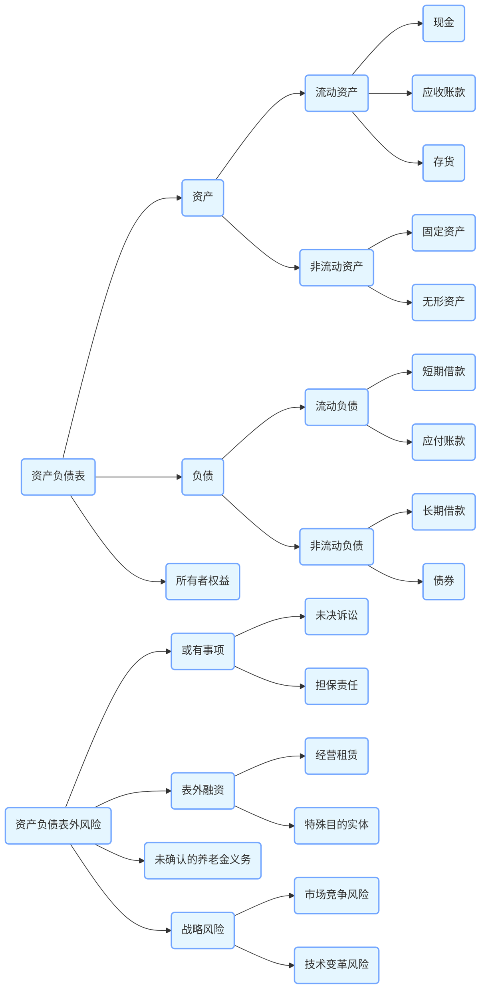

# 彼得林奇如何看待公司的资产负债表外风险

> 关键词：彼得林奇、资产负债表外风险、公司分析、投资策略、财务风险

> 摘要：本文深入探讨彼得林奇对公司资产负债表外风险的看法。资产负债表外风险往往容易被投资者忽视，但却可能对公司的财务状况和未来发展产生重大影响。彼得林奇作为投资界的传奇人物，其独特的投资理念和对公司基本面的深入研究方法为我们理解和评估这些风险提供了宝贵的视角。通过对相关理论和实际案例的分析，本文旨在帮助投资者更好地识别和应对资产负债表外风险，从而做出更明智的投资决策。

## 1. 背景介绍 
### 1.1 目的和范围
本文的目的在于全面剖析彼得林奇对公司资产负债表外风险的认知和分析方法。我们将详细探讨他如何在投资过程中关注这些隐藏的风险因素，以及这些风险对公司价值和投资决策的影响。范围涵盖了彼得林奇的投资理念、他在不同行业和公司中对资产负债表外风险的具体分析案例，以及这些分析方法对现代投资者的启示。

### 1.2 预期读者
本文预期读者包括对投资领域感兴趣的初学者、有一定投资经验的投资者、金融专业的学生以及从事金融分析和研究的专业人士。无论您是想学习彼得林奇的投资智慧，还是希望深入了解资产负债表外风险的评估方法，都能从本文中获得有价值的信息。

### 1.3 文档结构概述
本文将首先介绍相关的核心概念和术语，帮助读者建立对资产负债表外风险的基本认识。接着，详细阐述彼得林奇对这些风险的分析方法和核心算法原理，并通过具体的数学模型和公式进行说明。然后，通过项目实战案例展示如何在实际中应用这些方法。之后，探讨资产负债表外风险在不同实际应用场景中的表现。再推荐一些学习和研究相关内容的工具和资源。最后，总结未来发展趋势与挑战，并提供常见问题的解答和扩展阅读参考资料。

### 1.4 术语表
#### 1.4.1 核心术语定义
- **资产负债表外风险**：指未在公司资产负债表中明确体现，但可能对公司财务状况、经营成果和未来发展产生不利影响的潜在风险因素。
- **或有负债**：是指过去的交易或事项形成的潜在义务，其存在须通过未来不确定事项的发生或不发生予以证实；或过去的交易或事项形成的现时义务，履行该义务不是很可能导致经济利益流出企业或该义务的金额不能可靠地计量。
- **表外融资**：是指不需列入资产负债表的融资方式，即该项融资既不在资产负债表的资产方表现为某项资产的增加，也不在负债及所有者权益方表现为负债的增加。

#### 1.4.2 相关概念解释
- **隐性债务**：一些没有在资产负债表中明确记录，但企业实际上可能需要承担的债务，如担保责任、未决诉讼可能产生的赔偿等。
- **战略风险**：由于公司战略决策失误或外部环境变化导致公司战略目标无法实现的风险，这种风险可能不会直接反映在资产负债表上，但会对公司的长期发展产生重大影响。

#### 1.4.3 缩略词列表
- **EBITDA**：息税折旧摊销前利润（Earnings Before Interest, Taxes, Depreciation and Amortization）
- **PV**：现值（Present Value）

## 2. 核心概念与联系 

### 2.1 资产负债表概述
资产负债表是反映企业在某一特定日期财务状况的会计报表，它主要反映了企业的资产、负债和所有者权益三个方面的内容。资产包括流动资产（如现金、应收账款、存货等）和非流动资产（如固定资产、无形资产等）；负债包括流动负债（如短期借款、应付账款等）和非流动负债（如长期借款、债券等）；所有者权益则是企业资产扣除负债后由所有者享有的剩余权益。

### 2.2 资产负债表外风险的概念
资产负债表外风险是指那些没有在资产负债表中直接体现，但可能对公司的财务状况和经营业绩产生重大影响的风险因素。这些风险可能来自多个方面，如或有事项、表外融资、未确认的养老金义务、战略风险等。

### 2.3 资产负债表与表外风险的联系
虽然资产负债表是企业财务状况的重要反映，但它存在一定的局限性。一些资产负债表外风险可能在未来转化为实际的资产或负债，从而影响资产负债表的平衡。例如，企业的担保责任如果被担保方违约，就可能转化为企业的实际负债，增加企业的债务负担。

### 2.4 文本示意图
```plaintext
资产负债表
|-- 资产
|   |-- 流动资产
|   |   |-- 现金
|   |   |-- 应收账款
|   |   |-- 存货
|   |-- 非流动资产
|       |-- 固定资产
|       |-- 无形资产
|-- 负债
|   |-- 流动负债
|   |   |-- 短期借款
|   |   |-- 应付账款
|   |-- 非流动负债
|       |-- 长期借款
|       |-- 债券
|-- 所有者权益

资产负债表外风险
|-- 或有事项
|   |-- 未决诉讼
|   |-- 担保责任
|-- 表外融资
|   |-- 经营租赁
|   |-- 特殊目的实体
|-- 未确认的养老金义务
|-- 战略风险
|   |-- 市场竞争风险
|   |-- 技术变革风险
```

### 2.5 Mermaid 流程图


## 3. 核心算法原理 & 具体操作步骤 

### 3.1 或有事项风险评估算法
或有事项是资产负债表外风险的重要组成部分，常见的或有事项包括未决诉讼、担保责任等。评估或有事项风险的一种方法是使用概率加权法。

#### 3.1.1 算法原理
对于每个或有事项，首先估计其发生的概率 $P$，然后估计如果该事项发生可能导致的损失金额 $L$。最后，计算该或有事项的期望损失 $EL$，公式为：$EL = P \times L$。

#### 3.1.2 Python 源代码实现
```python
def estimate_contingent_loss(probability, loss_amount):
    """
    计算或有事项的期望损失
    :param probability: 或有事项发生的概率，取值范围 [0, 1]
    :param loss_amount: 或有事项发生时可能导致的损失金额
    :return: 或有事项的期望损失
    """
    return probability * loss_amount

# 示例
probability = 0.3
loss_amount = 1000000
expected_loss = estimate_contingent_loss(probability, loss_amount)
print(f"或有事项的期望损失为: {expected_loss}")
```

### 3.2 表外融资风险评估算法
表外融资是企业通过各种方式在资产负债表外筹集资金的行为，常见的表外融资方式包括经营租赁、特殊目的实体等。评估表外融资风险的一种方法是将表外融资转化为等效的资产和负债，然后计算相关的财务比率。

#### 3.2.1 算法原理
以经营租赁为例，首先确定租赁付款的现值 $PV$，将其视为等效的负债。然后，根据租赁资产的使用情况，将其视为等效的资产。接着，计算调整后的资产负债率等财务比率，以评估表外融资对企业财务状况的影响。

#### 3.2.2 Python 源代码实现
```python
import numpy as np

def calculate_present_value(lease_payments, discount_rate):
    """
    计算租赁付款的现值
    :param lease_payments: 租赁付款金额列表
    :param discount_rate: 折现率
    :return: 租赁付款的现值
    """
    present_values = []
    for i, payment in enumerate(lease_payments):
        present_value = payment / (1 + discount_rate) ** (i + 1)
        present_values.append(present_value)
    return np.sum(present_values)

# 示例
lease_payments = [100000, 100000, 100000, 100000, 100000]
discount_rate = 0.05
pv = calculate_present_value(lease_payments, discount_rate)
print(f"租赁付款的现值为: {pv}")
```

### 3.3 具体操作步骤
1. **收集信息**：收集公司的财务报表、年报、公告等相关资料，了解公司可能存在的资产负债表外风险因素。
2. **风险识别**：对收集到的信息进行分析，识别出公司存在的或有事项、表外融资等资产负债表外风险。
3. **风险评估**：根据上述算法，对识别出的风险进行评估，计算风险的期望损失或等效的资产和负债。
4. **综合分析**：将评估结果与公司的财务状况、经营业绩等进行综合分析，评估资产负债表外风险对公司价值和投资决策的影响。

## 4. 数学模型和公式 & 详细讲解 & 举例说明 

### 4.1 或有事项风险评估数学模型
#### 4.1.1 公式
如前所述，或有事项的期望损失 $EL$ 的计算公式为：
$$EL = P \times L$$
其中，$P$ 是或有事项发生的概率，$L$ 是或有事项发生时可能导致的损失金额。

#### 4.1.2 详细讲解
概率 $P$ 的估计通常需要结合公司的历史数据、行业情况、法律环境等因素进行判断。损失金额 $L$ 的估计则需要考虑或有事项的具体情况，如未决诉讼的索赔金额、担保责任的担保金额等。

#### 4.1.3 举例说明
假设某公司面临一项未决诉讼，根据律师的估计，该诉讼胜诉的概率为 70%，败诉的概率为 30%。如果败诉，公司可能需要赔偿 1000 万元。则该未决诉讼的期望损失为：
$$EL = 0.3 \times 1000 = 300 \text{（万元）}$$

### 4.2 表外融资风险评估数学模型
#### 4.2.1 公式
租赁付款的现值 $PV$ 的计算公式为：
$$PV = \sum_{i=1}^{n} \frac{CF_i}{(1 + r)^i}$$
其中，$CF_i$ 是第 $i$ 期的租赁付款金额，$r$ 是折现率，$n$ 是租赁期数。

#### 4.2.2 详细讲解
折现率 $r$ 通常根据市场利率、公司的信用风险等因素确定。租赁付款金额 $CF_i$ 可以从公司的租赁协议中获取。

#### 4.2.3 举例说明
假设某公司签订了一份 5 年期的经营租赁合同，每年的租赁付款金额为 100 万元，折现率为 5%。则租赁付款的现值为：
$$PV = \frac{100}{(1 + 0.05)^1} + \frac{100}{(1 + 0.05)^2} + \frac{100}{(1 + 0.05)^3} + \frac{100}{(1 + 0.05)^4} + \frac{100}{(1 + 0.05)^5}$$
```python
import numpy as np

lease_payments = [100] * 5
discount_rate = 0.05
pv = sum([payment / (1 + discount_rate) ** (i + 1) for i, payment in enumerate(lease_payments)])
print(f"租赁付款的现值为: {pv}")
```

## 5. 项目实战：代码实际案例和详细解释说明 

### 5.1  开发环境搭建
- **Python 环境**：建议使用 Python 3.7 及以上版本。可以从 Python 官方网站（https://www.python.org/downloads/）下载并安装。
- **开发工具**：推荐使用 PyCharm 或 Jupyter Notebook 作为开发工具。PyCharm 是一款功能强大的 Python 集成开发环境，Jupyter Notebook 则适合进行交互式编程和数据分析。
- **必要的库**：在本项目中，我们将使用 `numpy` 库进行数值计算。可以使用以下命令安装：
```sh
pip install numpy
```

### 5.2  源代码详细实现和代码解读
#### 5.2.1 或有事项风险评估代码实现
```python
def estimate_contingent_loss(probability, loss_amount):
    """
    计算或有事项的期望损失
    :param probability: 或有事项发生的概率，取值范围 [0, 1]
    :param loss_amount: 或有事项发生时可能导致的损失金额
    :return: 或有事项的期望损失
    """
    return probability * loss_amount

# 示例数据
probabilities = [0.2, 0.3, 0.1]
loss_amounts = [500000, 800000, 300000]

total_expected_loss = 0
for i in range(len(probabilities)):
    expected_loss = estimate_contingent_loss(probabilities[i], loss_amounts[i])
    total_expected_loss += expected_loss
    print(f"第 {i + 1} 个或有事项的期望损失为: {expected_loss}")

print(f"所有或有事项的总期望损失为: {total_expected_loss}")
```
#### 5.2.2 代码解读
- `estimate_contingent_loss` 函数接受两个参数：或有事项发生的概率和可能导致的损失金额，返回该或有事项的期望损失。
- 通过循环遍历多个或有事项，计算每个或有事项的期望损失，并累加得到总期望损失。

#### 5.2.3 表外融资风险评估代码实现
```python
import numpy as np

def calculate_present_value(lease_payments, discount_rate):
    """
    计算租赁付款的现值
    :param lease_payments: 租赁付款金额列表
    :param discount_rate: 折现率
    :return: 租赁付款的现值
    """
    present_values = []
    for i, payment in enumerate(lease_payments):
        present_value = payment / (1 + discount_rate) ** (i + 1)
        present_values.append(present_value)
    return np.sum(present_values)

# 示例数据
lease_payments = [200000, 200000, 200000, 200000, 200000]
discount_rate = 0.06

pv = calculate_present_value(lease_payments, discount_rate)
print(f"租赁付款的现值为: {pv}")
```
#### 5.2.4 代码解读
- `calculate_present_value` 函数接受租赁付款金额列表和折现率作为参数，通过循环计算每个租赁付款的现值，并使用 `numpy` 库的 `sum` 函数求和得到租赁付款的总现值。

### 5.3  代码解读与分析
- **或有事项风险评估代码**：该代码通过简单的乘法运算计算或有事项的期望损失，能够快速评估或有事项对公司财务状况的潜在影响。通过累加多个或有事项的期望损失，可以得到公司面临的总或有事项风险。
- **表外融资风险评估代码**：该代码通过折现计算租赁付款的现值，将表外融资转化为等效的负债。这有助于投资者更准确地评估公司的财务杠杆和偿债能力。

## 6. 实际应用场景 
### 6.1 投资决策
在进行股票投资时，投资者需要全面评估公司的财务状况和风险。资产负债表外风险可能对公司的未来业绩产生重大影响，因此投资者需要关注这些风险因素。例如，如果一家公司存在大量的或有负债，可能会影响其未来的现金流和盈利能力，从而降低公司的投资价值。

### 6.2 信贷决策
银行等金融机构在进行信贷决策时，也需要考虑公司的资产负债表外风险。如果公司存在未披露的表外融资或或有事项，可能会增加其违约风险。金融机构需要通过深入的尽职调查，了解公司的真实财务状况，以做出合理的信贷决策。

### 6.3 企业战略规划
企业在制定战略规划时，也需要考虑资产负债表外风险。例如，企业的战略决策可能会导致潜在的法律诉讼、担保责任等或有事项，这些风险可能会影响企业的未来发展。企业需要对这些风险进行评估和管理，以确保战略目标的实现。

### 6.4 财务报表分析
财务分析师在进行财务报表分析时，不能仅仅关注资产负债表内的信息，还需要关注资产负债表外风险。通过对这些风险的分析，可以更全面地了解公司的财务状况和经营业绩，发现潜在的问题和机会。

## 7. 工具和资源推荐
### 7.1 学习资源推荐
#### 7.1.1 书籍推荐
- 《彼得林奇的成功投资》：彼得林奇的经典著作，详细介绍了他的投资理念和方法，包括如何分析公司的基本面和评估风险。
- 《财务报表分析与证券定价》：该书深入讲解了财务报表分析的方法和技巧，对资产负债表外风险的分析也有详细的阐述。
- 《公司财务原理》：全面介绍了公司财务的基本原理和方法，包括融资决策、投资决策、风险管理等内容，有助于读者深入理解资产负债表外风险的本质。

#### 7.1.2 在线课程
- Coursera 平台上的“Financial Markets”课程：由耶鲁大学教授 Robert Shiller 主讲，介绍了金融市场的基本原理和投资策略，对资产负债表外风险的分析也有涉及。
- edX 平台上的“Accounting and Financial Statement Analysis”课程：该课程系统地讲解了财务报表分析的方法和技巧，帮助学习者掌握如何识别和评估资产负债表外风险。

#### 7.1.3 技术博客和网站
- Seeking Alpha：一个专业的金融投资博客平台，提供了大量的公司分析和投资研究报告，其中不乏对资产负债表外风险的深入分析。
- ValueWalk：专注于价值投资领域，分享了许多投资大师的观点和研究成果，对彼得林奇的投资理念和方法也有相关介绍。

### 7.2 开发工具框架推荐
#### 7.2.1 IDE和编辑器
- PyCharm：一款功能强大的 Python 集成开发环境，提供了代码编辑、调试、版本控制等功能，适合进行数据分析和算法实现。
- Jupyter Notebook：交互式编程环境，支持 Python、R 等多种编程语言，方便进行数据分析和可视化展示。

#### 7.2.2 调试和性能分析工具
- `pdb`：Python 自带的调试工具，用于调试 Python 代码，帮助开发者定位和解决问题。
- `cProfile`：Python 标准库中的性能分析工具，用于分析 Python 代码的性能瓶颈。

#### 7.2.3 相关框架和库
- `numpy`：Python 中用于科学计算的基础库，提供了高效的数组操作和数学函数。
- `pandas`：用于数据处理和分析的库，提供了数据结构和数据操作工具，方便进行财务数据的处理和分析。

### 7.3 相关论文著作推荐
#### 7.3.1 经典论文
- “Off-Balance Sheet Financing: An Empirical Investigation”：该论文对表外融资的动机、影响和披露情况进行了实证研究，为理解表外融资风险提供了理论支持。
- “Contingent Liabilities and Corporate Risk”：研究了或有负债对公司风险的影响，通过实证分析得出了相关结论。

#### 7.3.2 最新研究成果
- 关注顶尖金融学术期刊，如《Journal of Finance》《Review of Financial Studies》等，这些期刊会发表关于资产负债表外风险的最新研究成果。

#### 7.3.3 应用案例分析
- 可以参考一些知名企业的财务报告和案例分析，了解它们在资产负债表外风险方面的处理和应对措施，如安然公司的财务造假案例，其中涉及大量的表外融资和或有事项。

## 8. 总结：未来发展趋势与挑战
### 8.1 未来发展趋势
- **信息披露要求提高**：随着投资者对公司透明度的要求越来越高，监管机构可能会加强对资产负债表外风险信息披露的要求，公司需要更全面、准确地披露相关信息。
- **风险管理技术创新**：为了更好地识别和管理资产负债表外风险，金融机构和企业可能会不断创新风险管理技术，如利用大数据、人工智能等技术进行风险评估和预警。
- **国际协调与合作加强**：在全球化的背景下，资产负债表外风险的跨国影响日益明显，国际间的协调与合作将加强，以统一风险评估标准和监管要求。

### 8.2 挑战
- **风险识别难度大**：资产负债表外风险往往具有隐蔽性和不确定性，识别这些风险需要专业的知识和丰富的经验，对投资者和监管机构来说都是一个挑战。
- **数据获取困难**：获取准确、完整的资产负债表外风险信息存在一定困难，部分信息可能需要通过深入的尽职调查和分析才能获得。
- **法规和监管的滞后性**：资产负债表外风险的形式和特点不断变化，法规和监管可能存在一定的滞后性，难以及时有效地应对新出现的风险。

## 9. 附录：常见问题与解答
### 9.1 如何准确估计或有事项发生的概率？
或有事项发生的概率估计需要综合考虑多个因素，如公司的历史数据、行业情况、法律环境等。可以参考类似案例的发生概率，也可以咨询专业的律师、会计师等人士。

### 9.2 表外融资对公司的财务状况有哪些影响？
表外融资可能会增加公司的财务杠杆，提高偿债风险。同时，表外融资可能会影响公司的财务比率，如资产负债率、利息保障倍数等，从而影响投资者和金融机构对公司的评估。

### 9.3 如何识别公司的战略风险？
识别公司的战略风险需要关注公司的战略决策、市场竞争环境、技术发展趋势等因素。可以通过分析公司的年报、公告、行业研究报告等资料，了解公司的战略规划和面临的挑战。

### 9.4 资产负债表外风险是否一定会对公司产生不利影响？
不一定。资产负债表外风险只是潜在的风险因素，其是否会对公司产生不利影响取决于风险是否实际发生以及发生的程度。一些或有事项可能最终不会导致损失，表外融资也可能为公司带来发展机遇。

## 10. 扩展阅读 & 参考资料
- 彼得林奇. 《彼得林奇的成功投资》. 机械工业出版社
- Stephen Penman. 《财务报表分析与证券定价》. 中国人民大学出版社
- Richard A. Brealey, Stewart C. Myers, Franklin Allen. 《公司财务原理》. 机械工业出版社
- “Off-Balance Sheet Financing: An Empirical Investigation”. Journal of Accounting and Economics
- “Contingent Liabilities and Corporate Risk”. Review of Financial Studies
- Seeking Alpha. https://seekingalpha.com/
- ValueWalk. https://www.valuewalk.com/