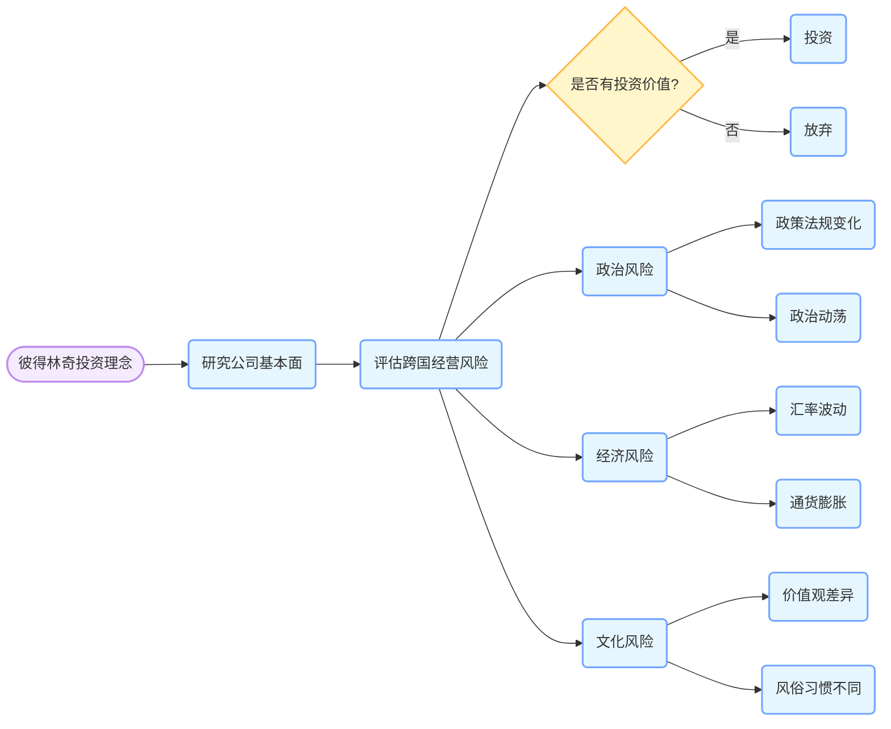

# 彼得林奇如何看待公司的跨国经营风险

> 关键词：彼得林奇、公司、跨国经营风险、投资分析、全球市场

> 摘要：本文聚焦于投资大师彼得林奇对公司跨国经营风险的看法。通过深入剖析彼得林奇的投资理念和相关观点，全面探讨公司在跨国经营过程中可能面临的各类风险，如政治风险、经济风险、文化风险等。同时分析彼得林奇是如何在投资决策中评估和应对这些风险的，旨在为投资者和企业管理者提供有价值的参考，帮助他们更好地理解和管理跨国经营风险，做出明智的决策。

## 1. 背景介绍 
### 1.1 目的和范围
本文的目的在于深入研究彼得林奇对公司跨国经营风险的独特见解。通过梳理彼得林奇的投资思想和实践案例，全面分析他在评估公司跨国经营风险时所关注的要点和采用的方法。范围涵盖了彼得林奇在其职业生涯中对不同行业、不同地区跨国经营公司的观察和分析，以及他基于这些经验所形成的关于跨国经营风险的理论和观点。

### 1.2 预期读者
本文预期读者包括广大投资者，无论是专业的机构投资者还是普通的个人投资者，他们可以从彼得林奇的观点中学习如何在投资决策中考虑公司的跨国经营风险。同时，企业管理者也能从中获取有益的启示，帮助他们更好地管理和应对公司在跨国经营过程中面临的各种挑战。此外，对投资理论和企业战略管理感兴趣的学者和研究人员也可以将本文作为参考资料，进一步深入研究相关领域的问题。

### 1.3 文档结构概述
本文首先介绍彼得林奇的背景和其在投资领域的影响力，引出对他关于公司跨国经营风险观点的探讨。接着详细阐述公司跨国经营可能面临的各种风险类型，包括政治、经济、文化等方面。然后分析彼得林奇在评估这些风险时所采用的方法和关注的要点。之后通过实际案例说明彼得林奇的观点在投资决策中的应用。最后总结彼得林奇观点的价值和对未来投资者与企业管理者的启示。

### 1.4 术语表
#### 1.4.1 核心术语定义
- **跨国经营**：指企业在两个或两个以上的国家从事生产、销售、研发等经营活动，以实现资源的优化配置和全球市场的拓展。
- **跨国经营风险**：指企业在跨国经营过程中，由于各种不确定因素的影响，导致企业的实际收益与预期收益发生偏离，从而遭受损失的可能性。
- **投资组合**：指投资者将资金分散投资于不同的资产或证券，以降低投资风险，实现收益最大化的一种投资策略。

#### 1.4.2 相关概念解释
- **政治风险**：指由于东道国政治环境的变化，如政策法规的调整、政治动荡、战争等，给跨国经营企业带来的风险。
- **经济风险**：指由于全球经济形势的变化，如汇率波动、通货膨胀、经济衰退等，给跨国经营企业带来的风险。
- **文化风险**：指由于不同国家和地区的文化差异，如价值观、信仰、风俗习惯等，给跨国经营企业带来的风险。

#### 1.4.3 缩略词列表
- **GDP**：国内生产总值（Gross Domestic Product）
- **FDI**：外国直接投资（Foreign Direct Investment）

## 2. 核心概念与联系 
### 2.1 彼得林奇的投资理念概述
彼得林奇是投资领域的传奇人物，他的投资理念以深入研究和实地调研为基础。他强调投资者要关注公司的基本面，通过对公司的业务、财务状况、竞争优势等方面的分析，来评估公司的投资价值。他认为，投资者不需要具备高深的专业知识，只要能够深入了解公司的情况，就能够做出明智的投资决策。

### 2.2 跨国经营风险的核心概念
跨国经营风险是一个复杂的概念，它涉及到多个方面的因素。从宏观层面来看，包括政治、经济、法律等环境因素；从微观层面来看，包括企业文化、管理模式、市场策略等因素。这些因素相互作用，共同影响着企业跨国经营的成败。

### 2.3 彼得林奇投资理念与跨国经营风险的联系
彼得林奇的投资理念与跨国经营风险密切相关。他在评估公司的投资价值时，会充分考虑公司的跨国经营风险。他认为，跨国经营风险是影响公司未来发展和盈利能力的重要因素之一。如果公司能够有效地管理和应对跨国经营风险，那么它就有可能在全球市场上获得更大的发展空间和竞争优势；反之，如果公司无法有效地管理和应对跨国经营风险，那么它就有可能面临巨大的损失甚至破产。

### 2.4 核心概念原理和架构的文本示意图
彼得林奇的投资理念强调对公司基本面的研究，而跨国经营风险是公司基本面的重要组成部分。跨国经营风险包括政治风险、经济风险、文化风险等多个方面，这些风险相互关联、相互影响。彼得林奇在评估公司的投资价值时，会综合考虑这些风险因素，以确定公司是否具有投资价值。

### 2.5 Mermaid 流程图


## 3. 核心算法原理 & 具体操作步骤 
### 3.1 彼得林奇评估跨国经营风险的核心算法原理
彼得林奇评估跨国经营风险并没有一个固定的算法，但他的方法基于对公司各个方面的深入研究和分析。他会综合考虑公司的财务状况、市场地位、行业前景、管理团队等因素，以及公司在跨国经营过程中面临的各种风险。他的核心原理是通过对大量信息的收集和分析，来评估公司的投资价值和跨国经营风险的大小。

### 3.2 具体操作步骤
#### 3.2.1 收集信息
彼得林奇非常重视信息的收集。他会通过多种渠道收集公司的相关信息，包括公司的年报、季报、行业研究报告、新闻报道、实地调研等。他会收集公司在不同国家和地区的经营情况、市场份额、竞争对手等信息，以及当地的政治、经济、文化等环境信息。

#### 3.2.2 分析财务状况
彼得林奇会仔细分析公司的财务报表，包括资产负债表、利润表、现金流量表等。他会关注公司的盈利能力、偿债能力、营运能力等指标，以及公司的财务风险。他会比较公司在不同国家和地区的财务表现，以评估公司的跨国经营能力和风险。

#### 3.2.3 评估市场地位
彼得林奇会评估公司在全球市场上的地位和竞争优势。他会分析公司的产品或服务的市场需求、市场份额、品牌知名度等因素，以及公司的竞争对手的情况。他会关注公司在不同国家和地区的市场表现，以评估公司的市场风险。

#### 3.2.4 研究行业前景
彼得林奇会研究公司所处行业的发展前景和趋势。他会分析行业的市场规模、增长率、竞争格局等因素，以及行业的政策环境和技术创新情况。他会关注公司在不同国家和地区的行业地位，以评估公司的行业风险。

#### 3.2.5 考察管理团队
彼得林奇会考察公司的管理团队的能力和素质。他会关注管理团队的战略眼光、决策能力、执行能力等因素，以及管理团队的国际经验和跨文化管理能力。他会评估管理团队在应对跨国经营风险方面的能力和措施。

#### 3.2.6 综合评估风险
在收集和分析了以上信息后，彼得林奇会综合评估公司的跨国经营风险。他会根据公司的财务状况、市场地位、行业前景、管理团队等因素，以及公司在跨国经营过程中面临的各种风险，来确定公司的投资价值和风险等级。

### 3.3 Python 源代码示例
以下是一个简单的 Python 代码示例，用于模拟彼得林奇评估跨国经营风险的过程。这个示例只是一个简化的模型，实际应用中需要根据具体情况进行调整和扩展。

```python
# 定义公司信息类
class CompanyInfo:
    def __init__(self, financial_status, market_position, industry_outlook, management_team):
        self.financial_status = financial_status
        self.market_position = market_position
        self.industry_outlook = industry_outlook
        self.management_team = management_team

# 定义风险评估函数
def assess_risk(company_info):
    # 假设每个因素的权重相等
    weight = 0.25
    # 评估财务状况风险
    financial_risk = 1 - company_info.financial_status
    # 评估市场地位风险
    market_risk = 1 - company_info.market_position
    # 评估行业前景风险
    industry_risk = 1 - company_info.industry_outlook
    # 评估管理团队风险
    management_risk = 1 - company_info.management_team
    # 综合评估风险
    total_risk = financial_risk * weight + market_risk * weight + industry_risk * weight + management_risk * weight
    return total_risk

# 示例公司信息
company = CompanyInfo(financial_status=0.8, market_position=0.7, industry_outlook=0.6, management_team=0.9)
# 评估风险
risk = assess_risk(company)
print(f"公司的跨国经营风险等级为: {risk}")
```

在这个示例中，我们定义了一个 `CompanyInfo` 类来存储公司的信息，包括财务状况、市场地位、行业前景和管理团队。然后定义了一个 `assess_risk` 函数来评估公司的跨国经营风险。最后，我们创建了一个示例公司信息对象，并调用 `assess_risk` 函数来评估风险。

## 4. 数学模型和公式 & 详细讲解 & 举例说明 
### 4.1 数学模型
彼得林奇评估跨国经营风险的数学模型可以用以下公式表示：

$$R = \sum_{i=1}^{n} w_i \times r_i$$

其中，$R$ 表示公司的跨国经营风险等级，$w_i$ 表示第 $i$ 个风险因素的权重，$r_i$ 表示第 $i$ 个风险因素的风险值，$n$ 表示风险因素的数量。

### 4.2 详细讲解
这个数学模型的核心思想是将公司的跨国经营风险分解为多个风险因素，然后根据每个风险因素的重要性赋予相应的权重，最后将每个风险因素的风险值乘以其权重并求和，得到公司的跨国经营风险等级。

在实际应用中，风险因素的选择和权重的确定需要根据具体情况进行调整。例如，对于一个在政治不稳定地区经营的公司，政治风险因素的权重可能会相对较高；对于一个依赖出口的公司，汇率风险因素的权重可能会相对较高。

### 4.3 举例说明
假设我们要评估一家跨国公司的经营风险，我们选择了四个风险因素：政治风险、经济风险、文化风险和管理风险，它们的权重分别为 0.3、0.3、0.2 和 0.2。我们通过对公司的分析和研究，得到这四个风险因素的风险值分别为 0.6、0.5、0.4 和 0.3。

根据上述数学模型，我们可以计算出该公司的跨国经营风险等级为：

$$R = 0.3 \times 0.6 + 0.3 \times 0.5 + 0.2 \times 0.4 + 0.2 \times 0.3$$

$$R = 0.18 + 0.15 + 0.08 + 0.06$$

$$R = 0.47$$

这意味着该公司的跨国经营风险等级为 0.47，相对来说处于中等水平。投资者和企业管理者可以根据这个风险等级来制定相应的投资策略和风险管理措施。

## 5. 项目实战：代码实际案例和详细解释说明 
### 5.1  开发环境搭建
#### 5.1.1 安装 Python
首先，我们需要安装 Python 编程语言。可以从 Python 官方网站（https://www.python.org/downloads/） 下载适合你操作系统的 Python 安装包，并按照安装向导进行安装。

#### 5.1.2 安装开发工具
我们可以使用任何文本编辑器或集成开发环境（IDE）来编写 Python 代码。推荐使用 PyCharm 或 Visual Studio Code 等 IDE，它们提供了丰富的功能和插件，方便我们进行代码开发和调试。

#### 5.1.3 安装必要的库
在本项目中，我们只使用了 Python 的内置库，不需要安装额外的库。

### 5.2  源代码详细实现和代码解读
以下是一个完整的 Python 代码示例，用于评估公司的跨国经营风险。这个示例在之前的基础上进行了扩展，增加了更多的功能和细节。

```python
# 定义风险因素类
class RiskFactor:
    def __init__(self, name, weight, value):
        self.name = name
        self.weight = weight
        self.value = value

# 定义公司信息类
class CompanyInfo:
    def __init__(self, risk_factors):
        self.risk_factors = risk_factors

    def calculate_total_risk(self):
        total_risk = 0
        for factor in self.risk_factors:
            total_risk += factor.weight * factor.value
        return total_risk

# 示例风险因素
risk_factors = [
    RiskFactor(name="政治风险", weight=0.3, value=0.6),
    RiskFactor(name="经济风险", weight=0.3, value=0.5),
    RiskFactor(name="文化风险", weight=0.2, value=0.4),
    RiskFactor(name="管理风险", weight=0.2, value=0.3)
]

# 创建公司信息对象
company = CompanyInfo(risk_factors)

# 计算总风险
total_risk = company.calculate_total_risk()

# 输出结果
print(f"公司的跨国经营风险等级为: {total_risk}")
```

### 5.3  代码解读与分析
#### 5.3.1 风险因素类（RiskFactor）
`RiskFactor` 类用于表示一个风险因素，它包含三个属性：`name` 表示风险因素的名称，`weight` 表示风险因素的权重，`value` 表示风险因素的风险值。

#### 5.3.2 公司信息类（CompanyInfo）
`CompanyInfo` 类用于表示公司的信息，它包含一个 `risk_factors` 属性，用于存储公司的所有风险因素。`calculate_total_risk` 方法用于计算公司的总风险，它通过遍历所有风险因素，将每个风险因素的权重乘以其风险值并求和，得到公司的总风险。

#### 5.3.3 示例风险因素
我们创建了四个示例风险因素，分别表示政治风险、经济风险、文化风险和管理风险，并为每个风险因素设置了相应的权重和风险值。

#### 5.3.4 创建公司信息对象并计算总风险
我们使用这些示例风险因素创建了一个公司信息对象，并调用 `calculate_total_risk` 方法计算公司的总风险。最后，我们将总风险输出到控制台。

## 6. 实际应用场景 
### 6.1 投资者决策
投资者在进行跨国投资时，可以借鉴彼得林奇的观点和方法，评估公司的跨国经营风险。通过对公司的财务状况、市场地位、行业前景、管理团队等因素的分析，以及对公司在跨国经营过程中面临的各种风险的评估，投资者可以更准确地判断公司的投资价值和风险等级，从而做出明智的投资决策。

### 6.2 企业战略规划
企业在制定跨国经营战略时，也可以参考彼得林奇的观点。企业管理者可以通过对跨国经营风险的评估，了解公司在不同国家和地区面临的挑战和机遇，从而制定相应的战略措施，降低风险，提高公司的竞争力。例如，企业可以根据不同国家和地区的政治、经济、文化等环境因素，调整产品或服务的定位和营销策略，以适应当地市场的需求。

### 6.3 风险管理
企业在跨国经营过程中，需要对各种风险进行有效的管理。彼得林奇的观点和方法可以为企业的风险管理提供指导。企业可以通过对风险因素的识别和评估，制定相应的风险应对措施，如风险规避、风险转移、风险减轻等。例如，企业可以通过购买保险、签订合同等方式转移风险，通过优化供应链、降低成本等方式减轻风险。

## 7. 工具和资源推荐
### 7.1 学习资源推荐
#### 7.1.1 书籍推荐
- 《彼得林奇的成功投资》：这是彼得林奇的经典著作，书中详细介绍了他的投资理念和方法，包括如何选择股票、如何评估公司的价值等内容，对学习彼得林奇的投资思想非常有帮助。
- 《战胜华尔街》：本书是彼得林奇的另一部重要著作，书中分享了他在投资实践中的经验和故事，通过实际案例展示了他的投资策略和技巧。
- 《聪明的投资者》：作者是本杰明·格雷厄姆，他是彼得林奇的导师，这本书是价值投资的经典之作，对理解投资的本质和原则具有重要意义。

#### 7.1.2 在线课程
- Coursera 上的“投资学原理”课程：该课程由知名大学的教授授课，内容涵盖了投资的基本理论和方法，对学习投资知识非常有帮助。
- edX 上的“金融市场”课程：该课程深入讲解了金融市场的运作机制和投资策略，适合有一定基础的学习者。

#### 7.1.3 技术博客和网站
- 雪球网：这是一个专注于投资领域的社交平台，上面有很多投资者分享自己的投资经验和观点，可以从中学习到很多实用的投资知识。
- 价值投资网：该网站提供了丰富的价值投资相关的文章和资料，对学习价值投资理论和实践非常有帮助。

### 7.2 开发工具框架推荐
#### 7.2.1 IDE和编辑器
- PyCharm：这是一款专业的 Python 集成开发环境，提供了丰富的功能和插件，方便我们进行 Python 代码的开发和调试。
- Visual Studio Code：这是一款轻量级的代码编辑器，支持多种编程语言，具有丰富的插件和扩展功能，适合初学者和专业开发者使用。

#### 7.2.2 调试和性能分析工具
- Py-Spy：这是一个用于 Python 代码性能分析的工具，可以帮助我们找出代码中的性能瓶颈，提高代码的运行效率。
- PDB：这是 Python 内置的调试工具，可以帮助我们调试 Python 代码，找出代码中的错误和问题。

#### 7.2.3 相关框架和库
- Pandas：这是一个用于数据处理和分析的 Python 库，提供了丰富的数据结构和函数，方便我们进行数据的读取、处理和分析。
- NumPy：这是一个用于科学计算的 Python 库，提供了高效的数组和矩阵运算功能，对数据分析和机器学习非常有帮助。

### 7.3 相关论文著作推荐
#### 7.3.1 经典论文
- “Efficient Capital Markets: A Review of Theory and Empirical Work”：这篇论文由尤金·法玛撰写，是有效市场假说的经典之作，对理解金融市场的效率和投资理论具有重要意义。
- “The Capital Asset Pricing Model: Theory and Evidence”：这篇论文由威廉·夏普等人撰写，是资本资产定价模型的经典论文，对理解资产定价和投资风险具有重要意义。

#### 7.3.2 最新研究成果
- 可以关注《Journal of Finance》《Review of Financial Studies》等金融领域的顶级学术期刊，了解最新的研究成果和理论进展。

#### 7.3.3 应用案例分析
- 可以参考一些知名投资机构的研究报告和案例分析，了解他们在投资决策中如何评估和应对跨国经营风险。

## 8. 总结：未来发展趋势与挑战
### 8.1 未来发展趋势
随着全球化的不断深入，公司的跨国经营将越来越普遍。未来，跨国经营风险的管理将更加重要。一方面，科技的发展将为企业提供更多的工具和手段来管理跨国经营风险，如大数据分析、人工智能等技术可以帮助企业更准确地识别和评估风险。另一方面，国际合作和协调将加强，各国政府和国际组织将采取更多的措施来降低跨国经营的风险，促进全球经济的稳定发展。

### 8.2 挑战
然而，公司在跨国经营过程中也将面临更多的挑战。政治风险方面，国际政治形势的不确定性增加，贸易保护主义抬头，可能会给跨国经营企业带来更多的政策风险和贸易壁垒。经济风险方面，全球经济增长的不确定性增加，汇率波动、通货膨胀等问题可能会对跨国经营企业的财务状况和盈利能力造成影响。文化风险方面，不同国家和地区的文化差异仍然存在，企业需要更好地理解和适应当地文化，以避免文化冲突和误解。

## 9. 附录：常见问题与解答
### 9.1 彼得林奇的投资方法适用于所有类型的公司吗？
彼得林奇的投资方法主要基于对公司基本面的研究和分析，适用于大多数类型的公司。但不同类型的公司具有不同的特点和风险，在应用彼得林奇的方法时，需要根据公司的具体情况进行调整和优化。

### 9.2 如何准确评估跨国经营风险？
准确评估跨国经营风险需要综合考虑多个因素，包括政治、经济、文化等方面。可以通过收集和分析相关信息，如公司的财务报表、行业研究报告、新闻报道等，以及实地调研等方式，来了解公司在跨国经营过程中面临的各种风险。同时，还可以参考专业机构的研究报告和评级，以及其他投资者的经验和观点。

### 9.3 企业如何应对跨国经营风险？
企业可以采取多种措施来应对跨国经营风险，如风险规避、风险转移、风险减轻等。例如，企业可以通过选择政治稳定、经济发展良好的国家和地区进行投资，来规避政治风险；可以通过购买保险、签订合同等方式转移风险；可以通过优化供应链、降低成本等方式减轻风险。此外，企业还需要加强风险管理意识，建立健全风险管理体系，提高应对风险的能力。

## 10. 扩展阅读 & 参考资料
- 彼得林奇. 《彼得林奇的成功投资》. 机械工业出版社.
- 彼得林奇. 《战胜华尔街》. 机械工业出版社.
- 本杰明·格雷厄姆. 《聪明的投资者》. 人民邮电出版社.
- 《Journal of Finance》《Review of Financial Studies》等金融领域学术期刊.
- 雪球网、价值投资网等投资领域相关网站.