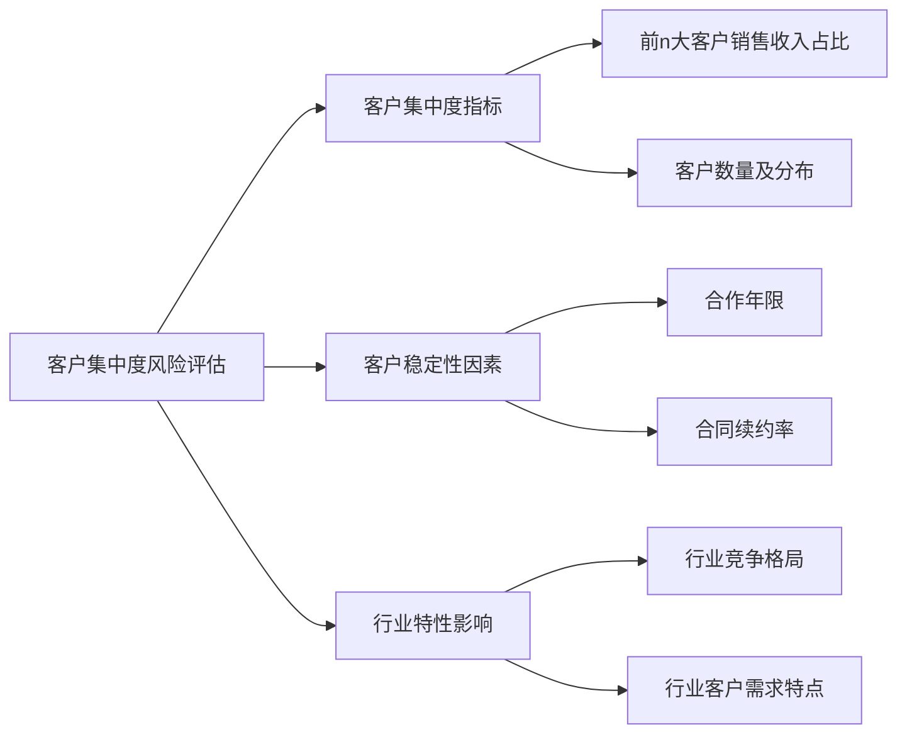

# 彼得林奇如何评估公司的客户集中度风险

> 关键词：彼得林奇、客户集中度风险、公司评估、投资分析、财务指标

> 摘要：本文深入探讨了投资大师彼得林奇评估公司客户集中度风险的方法。客户集中度风险对公司的经营稳定性和财务状况有着重要影响，了解如何评估这一风险对于投资者做出明智的投资决策至关重要。文章首先介绍相关背景知识，接着阐述核心概念及联系，详细讲解评估的核心算法原理与操作步骤，引入数学模型和公式并举例说明，通过项目实战展示实际案例及代码分析，探讨实际应用场景，推荐相关工具和资源，最后总结未来发展趋势与挑战，并提供常见问题解答及参考资料，帮助读者全面理解彼得林奇评估公司客户集中度风险的方法。

## 1. 背景介绍 
### 1.1 目的和范围
目的在于深入剖析彼得林奇评估公司客户集中度风险的方法，为投资者提供一套系统、有效的评估思路和方法，帮助他们更好地识别和评估投资标的的风险。范围涵盖了彼得林奇在投资实践中所运用的各种评估手段和相关理论，以及这些方法在不同行业和公司类型中的应用。

### 1.2 预期读者
预期读者主要包括对投资领域感兴趣的个人投资者、专业投资机构的从业者、金融领域的研究人员以及相关专业的学生。这些读者希望通过了解彼得林奇的评估方法，提升自己在投资分析和风险评估方面的能力。

### 1.3 文档结构概述
本文首先介绍背景知识，让读者了解研究的目的和意义。接着阐述核心概念及联系，明确客户集中度风险等相关概念。然后详细讲解核心算法原理与操作步骤，通过Python代码进行说明。引入数学模型和公式并举例，加深读者对评估方法的理解。通过项目实战展示实际案例及代码分析，使读者能够将理论应用到实际中。探讨实际应用场景，让读者了解该评估方法在不同情况下的运用。推荐相关工具和资源，帮助读者进一步学习和研究。最后总结未来发展趋势与挑战，提供常见问题解答及参考资料，方便读者查阅和进一步学习。

### 1.4 术语表
#### 1.4.1 核心术语定义
- **客户集中度风险**：指公司的大部分销售收入依赖于少数几个客户，当这些主要客户的需求发生变化、经营出现问题或终止合作时，公司的销售收入和利润将面临较大的不确定性和风险。
- **客户集中度**：通常用前几位主要客户的销售收入占公司总销售收入的比例来衡量，反映了公司业务对少数客户的依赖程度。

#### 1.4.2 相关概念解释
- **多元化客户群体**：公司拥有众多不同的客户，且每个客户的销售收入占比相对均衡，这样可以降低因个别客户问题导致的风险。
- **客户稳定性**：指客户与公司保持长期合作关系的可能性和程度，客户稳定性高意味着公司的业务更具可持续性。

#### 1.4.3 缩略词列表
- **CRn**：表示前n大客户的销售收入集中度，n通常取3、5或10等。

## 2. 核心概念与联系 
### 核心概念原理
客户集中度风险的核心原理在于公司业务对少数客户的过度依赖。当公司的大部分收入来自少数几个客户时，这些客户的任何变化都可能对公司的经营产生重大影响。例如，如果一个主要客户因经济环境变化、自身经营不善或选择其他供应商而减少或停止向公司采购，公司的销售收入将大幅下降，进而影响利润和现金流。

### 架构的文本示意图
```plaintext
客户集中度风险评估
|-- 客户集中度指标
|   |-- 前n大客户销售收入占比
|   |-- 客户数量及分布
|-- 客户稳定性因素
|   |-- 合作年限
|   |-- 合同续约率
|-- 行业特性影响
|   |-- 行业竞争格局
|   |-- 行业客户需求特点
```

### Mermaid 流程图


## 3. 核心算法原理 & 具体操作步骤 
### 核心算法原理
评估客户集中度风险的核心算法主要基于对客户销售收入数据的分析。通过计算前n大客户的销售收入占比，以及分析客户数量和分布情况，来判断公司业务对少数客户的依赖程度。同时，结合客户稳定性因素，如合作年限和合同续约率，进一步评估风险。

### 具体操作步骤
1. **数据收集**：收集公司的销售数据，包括每个客户的销售收入、合作年限、合同续约情况等信息。
2. **计算客户集中度指标**：
    - 计算前n大客户的销售收入占比（CRn），公式为：$CR_n = \frac{\sum_{i = 1}^{n}S_i}{S_{total}}$，其中$S_i$表示第i大客户的销售收入，$S_{total}$表示公司的总销售收入。
    - 分析客户数量和分布情况，观察客户群体是否过于集中。
3. **评估客户稳定性**：
    - 统计客户的平均合作年限，了解客户与公司的合作历史。
    - 计算合同续约率，公式为：$合同续约率 = \frac{续约客户数量}{到期客户数量}$。
4. **结合行业特性进行综合评估**：考虑行业的竞争格局和客户需求特点，判断当前的客户集中度是否合理。

### Python源代码实现
```python
import pandas as pd

# 模拟销售数据
data = {
    '客户名称': ['客户A', '客户B', '客户C', '客户D', '客户E', '其他客户'],
    '销售收入': [100000, 80000, 60000, 40000, 20000, 10000],
    '合作年限': [5, 3, 4, 2, 1, None],
    '是否续约': [True, True, False, True, False, None]
}

df = pd.DataFrame(data)

# 计算总销售收入
total_sales = df['销售收入'].sum()

# 计算前3大客户的销售收入占比
top_3_customers = df.nlargest(3, '销售收入')
cr3 = top_3_customers['销售收入'].sum() / total_sales

# 计算平均合作年限
average_cooperation_years = df[df['合作年限'].notna()]['合作年限'].mean()

# 计算合同续约率
renewal_rate = df[df['是否续约'] == True].shape[0] / df[df['是否续约'].notna()].shape[0]

print(f"前3大客户销售收入占比: {cr3 * 100:.2f}%")
print(f"平均合作年限: {average_cooperation_years:.2f} 年")
print(f"合同续约率: {renewal_rate * 100:.2f}%")
```

## 4. 数学模型和公式 & 详细讲解 & 举例说明 
### 数学模型和公式
- **客户集中度指标**：
    - 前n大客户销售收入占比（$CR_n$）：$CR_n = \frac{\sum_{i = 1}^{n}S_i}{S_{total}}$，其中$S_i$表示第i大客户的销售收入，$S_{total}$表示公司的总销售收入。$CR_n$值越大，说明公司对前n大客户的依赖程度越高，客户集中度风险越大。
- **合同续约率**：$合同续约率 = \frac{续约客户数量}{到期客户数量}$，该指标反映了客户对公司的认可程度和合作的稳定性。续约率越高，客户稳定性越好，客户集中度风险相对较低。

### 详细讲解
- **客户集中度指标**：通过计算前n大客户的销售收入占比，可以直观地了解公司业务对少数客户的依赖程度。例如，如果$CR_3$达到80%，说明公司80%的销售收入来自前3大客户，一旦这些客户出现问题，公司的经营将受到严重影响。
- **合同续约率**：合同续约率反映了客户与公司继续合作的意愿。如果续约率较低，可能意味着公司在产品质量、服务水平或价格等方面存在问题，需要进一步分析原因，以降低客户集中度风险。

### 举例说明
假设一家公司的总销售收入为100万元，前3大客户的销售收入分别为30万元、25万元和20万元，则$CR_3 = \frac{30 + 25 + 20}{100} = 0.75$，即75%。这表明该公司75%的收入依赖于前3大客户，客户集中度较高，存在一定的风险。如果该公司到期客户有10家，其中8家选择续约，则合同续约率为$\frac{8}{10} = 0.8$，即80%，说明客户的稳定性相对较好，但仍需关注客户集中度问题。

## 5. 项目实战：代码实际案例和详细解释说明 
### 5.1  开发环境搭建
- **Python环境**：建议使用Python 3.7及以上版本。可以从Python官方网站（https://www.python.org/downloads/）下载安装。
- **开发工具**：推荐使用PyCharm或Jupyter Notebook。PyCharm是一款功能强大的Python集成开发环境，适合大型项目开发；Jupyter Notebook则更适合交互式开发和数据分析。
- **安装依赖库**：使用pip安装pandas库，命令为：`pip install pandas`。

### 5.2  源代码详细实现和代码解读
```python
import pandas as pd

# 模拟销售数据
data = {
    '客户名称': ['客户A', '客户B', '客户C', '客户D', '客户E', '其他客户'],
    '销售收入': [100000, 80000, 60000, 40000, 20000, 10000],
    '合作年限': [5, 3, 4, 2, 1, None],
    '是否续约': [True, True, False, True, False, None]
}

# 创建DataFrame对象
df = pd.DataFrame(data)

# 计算总销售收入
total_sales = df['销售收入'].sum()

# 计算前3大客户的销售收入占比
top_3_customers = df.nlargest(3, '销售收入')
cr3 = top_3_customers['销售收入'].sum() / total_sales

# 计算平均合作年限
average_cooperation_years = df[df['合作年限'].notna()]['合作年限'].mean()

# 计算合同续约率
renewal_rate = df[df['是否续约'] == True].shape[0] / df[df['是否续约'].notna()].shape[0]

# 输出结果
print(f"前3大客户销售收入占比: {cr3 * 100:.2f}%")
print(f"平均合作年限: {average_cooperation_years:.2f} 年")
print(f"合同续约率: {renewal_rate * 100:.2f}%")
```
### 代码解读与分析
1. **数据模拟**：使用字典`data`模拟销售数据，包含客户名称、销售收入、合作年限和是否续约等信息。
2. **创建DataFrame对象**：使用`pd.DataFrame()`函数将字典数据转换为DataFrame对象，方便进行数据分析。
3. **计算总销售收入**：使用`df['销售收入'].sum()`方法计算公司的总销售收入。
4. **计算前3大客户的销售收入占比**：使用`df.nlargest(3, '销售收入')`方法选取前3大客户，然后计算其销售收入总和，并除以总销售收入得到$CR_3$。
5. **计算平均合作年限**：使用`df[df['合作年限'].notna()]['合作年限'].mean()`方法计算合作年限的平均值，排除缺失值。
6. **计算合同续约率**：使用`df[df['是否续约'] == True].shape[0]`计算续约客户数量，使用`df[df['是否续约'].notna()].shape[0]`计算到期客户数量，两者相除得到合同续约率。
7. **输出结果**：使用`print()`函数输出计算结果，保留两位小数。

## 6. 实际应用场景 
### 投资决策
投资者在选择投资标的时，会关注公司的客户集中度风险。如果一家公司的客户集中度较高，投资者需要谨慎评估其风险，考虑是否值得投资。例如，对于一些依赖单一大客户的公司，如果该大客户出现经营问题或终止合作，公司的业绩可能会大幅下滑，投资者可能会选择回避这类公司。

### 公司战略规划
公司管理层在制定战略规划时，需要考虑客户集中度风险。如果公司客户过于集中，管理层可以采取措施拓展客户群体，降低对少数客户的依赖。例如，加大市场开拓力度，开发新的客户；优化产品和服务，提高客户满意度，增加客户忠诚度等。

### 风险管理
金融机构在评估企业的信用风险时，也会关注客户集中度风险。如果企业的客户集中度较高，金融机构可能会认为其信用风险较大，从而提高贷款利率或减少贷款额度。企业自身也需要加强风险管理，制定应对客户集中度风险的预案，降低风险对企业的影响。

## 7. 工具和资源推荐
### 7.1 学习资源推荐
#### 7.1.1 书籍推荐
- 《彼得·林奇的成功投资》：彼得·林奇的经典著作，详细介绍了他的投资理念和方法，包括如何评估公司的基本面和风险。
- 《聪明的投资者》：本杰明·格雷厄姆的经典投资书籍，阐述了价值投资的理念和方法，对评估公司风险具有重要的指导意义。
- 《财务报表分析》：帮助读者了解如何分析公司的财务报表，掌握评估公司财务状况和风险的方法。

#### 7.1.2 在线课程
- Coursera上的“投资学原理”课程：由知名大学教授授课，系统介绍投资学的基本原理和方法，包括公司分析和风险评估。
- 网易云课堂上的“财务分析实战”课程：通过实际案例讲解财务分析的方法和技巧，帮助学员提高财务分析能力。

#### 7.1.3 技术博客和网站
- 雪球网：一个专注于投资领域的社区，有大量的投资者分享投资经验和研究报告，包括对公司客户集中度风险的分析。
- 东方财富网：提供丰富的金融信息和数据，包括公司的财务报表和客户信息，方便投资者进行分析。

### 7.2 开发工具框架推荐
#### 7.2.1 IDE和编辑器
- PyCharm：功能强大的Python集成开发环境，提供代码编辑、调试、自动补全等功能，适合专业开发者使用。
- Jupyter Notebook：交互式开发环境，支持代码、文本、图表等多种形式的展示，适合数据分析和快速原型开发。

#### 7.2.2 调试和性能分析工具
- Py-Spy：用于分析Python程序的性能，找出性能瓶颈，优化代码。
- PDB：Python自带的调试工具，可用于调试Python代码，定位问题。

#### 7.2.3 相关框架和库
- Pandas：强大的数据处理和分析库，提供高效的数据结构和数据操作方法，方便进行数据清洗、分析和可视化。
- Matplotlib：常用的Python绘图库，可用于绘制各种图表，直观展示数据。

### 7.3 相关论文著作推荐
#### 7.3.1 经典论文
- 《客户集中度与企业财务风险》：深入研究了客户集中度与企业财务风险之间的关系，为评估客户集中度风险提供了理论支持。
- 《基于客户关系管理的企业风险管理研究》：探讨了如何通过客户关系管理降低企业的风险，包括客户集中度风险。

#### 7.3.2 最新研究成果
- 关注国内外知名学术期刊，如《金融研究》、《会计研究》等，了解关于客户集中度风险的最新研究成果。

#### 7.3.3 应用案例分析
- 一些专业的金融研究机构会发布关于企业客户集中度风险的应用案例分析报告，可通过相关机构的官网或数据库获取。

## 8. 总结：未来发展趋势与挑战
### 未来发展趋势
- **数据驱动的风险评估**：随着大数据和人工智能技术的发展，未来对客户集中度风险的评估将更加依赖于数据驱动的方法。通过收集和分析更多的客户数据，能够更准确地评估风险，并提前预警潜在的风险。
- **行业整合与客户多元化**：为了降低客户集中度风险，越来越多的公司将采取行业整合和客户多元化的策略。通过并购、合作等方式拓展业务领域和客户群体，提高公司的抗风险能力。
- **风险管理的智能化**：借助人工智能和机器学习技术，风险管理将实现智能化。系统可以自动识别客户集中度风险，并提供相应的风险管理策略和建议。

### 挑战
- **数据质量和隐私问题**：数据驱动的风险评估依赖于高质量的数据，但数据质量和隐私问题是当前面临的挑战。如何确保数据的准确性、完整性和安全性，同时保护客户的隐私，是需要解决的问题。
- **复杂的行业环境**：不同行业的客户需求和竞争格局差异较大，评估客户集中度风险需要考虑行业特性。如何准确把握不同行业的特点，制定适合的评估方法，是一项挑战。
- **风险管理的动态性**：客户集中度风险是动态变化的，随着市场环境和客户需求的变化，风险状况也会发生改变。如何及时、准确地监测和评估风险的变化，调整风险管理策略，是需要面对的挑战。

## 9. 附录：常见问题与解答
### 问题1：客户集中度风险一定是负面的吗？
解答：不一定。在某些行业中，由于行业特性，客户集中度较高是正常现象。例如，一些大型设备制造商的客户可能主要是少数几家大型企业。只要这些客户的稳定性较高，且公司与客户保持良好的合作关系，客户集中度高并不一定意味着高风险。

### 问题2：如何判断客户集中度是否过高？
解答：没有一个固定的标准来判断客户集中度是否过高，需要结合行业特性、客户稳定性等因素进行综合评估。一般来说，如果前3大客户的销售收入占比超过50%，则需要引起关注；如果超过80%，则客户集中度风险较高。

### 问题3：如何降低客户集中度风险？
解答：可以采取以下措施降低客户集中度风险：拓展客户群体，开发新的客户；优化产品和服务，提高客户满意度和忠诚度；加强与客户的合作关系，签订长期合同；进行多元化经营，降低对单一业务或客户的依赖。

## 10. 扩展阅读 & 参考资料
### 扩展阅读
- 《投资中最简单的事》：进一步阐述了价值投资的理念和方法，对投资者有很大的启发。
- 《金融炼金术》：乔治·索罗斯的著作，介绍了他的投资哲学和实践经验。

### 参考资料
- 彼得·林奇相关的演讲和访谈记录。
- 上市公司的年报和财务报表。
- 相关学术期刊和研究报告。